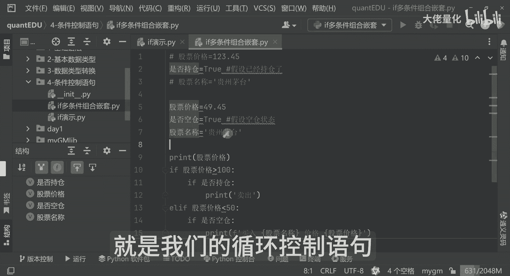
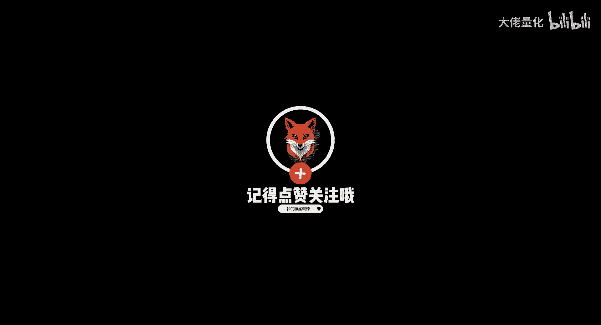

# 量化交易入门到精通35-python条件语句 - P1 - 大佬量化 - BV122xmeTEq7

欢迎伙伴们啊，今天我们开始进入我们的一个就是控制流的，这一部分的学习哈，那之前我们学习了Python环境，学习了我们的IDE，然后还学习了基本的语法，现在呢我们开始学习我们的控制流。

就是这块是涉及到这个程序的逻辑相关的，但是这块逻辑呢是由浅入深，这个也是从0~1的一个过程，所以大家也不用担心，我这边再新建一个新的模块，那就是第四个条件控制语句号，那这里边我会写一个样例代码。

按样例代码来讲呢，那就是先看一个if，那我们在正常的买股票的过程中，我们要判断，那例如说我们根据某一个股价，那达到一个什么价格，我才开始进入买入的一个操作哈，我就这么写了哈。

加个等于这个我们上一节课学了我们的float，这就是float类型，那可以打印我们的骨架，那同时来讲我们可以判断一下，这里面就引入我们的if，如果是我们的价格大于100元。

那这里边就是进入我们的一个卖出操作，那否则来讲呢就是else if，我们的价格如果是低于50元，那我这边就进入一个买入操作，当然来讲呢这两种情况都不符合的时候啊，也不属于这个股票价格大于100元。

也不属于这个小于50元，那我们这里面就会走另外一个分支，那就是ELS，那就是说好保持或者是观望这样一个操作，那我们现在呢可以看一下，那我们现在执行一下是吧，我们输出的是一个卖出，那当前价格是这个哈。

那好把我们的价格我们再重新改一下，比如说变成了这个49块四毛五的时候，我们再运行，那就告诉你说，那我推荐的是买入，那这个呢就是我们的AF以及if f else和else。

那其实这个else if if来讲呢，相当于是一个中断函数，是整个if if else，if if和else只要有任何一个条件满足呢，下面的是不会执行的，你比如说我现在这里边，我判断它是小于这个50元。

那这里边就是买入了，你会发现这行代码是不会被执行的，然后我们可以再看下一个案例啊，我们可以把这个代码再改一下，其实并不是说我是达到了大于100元，那我就卖出小于50元，我就买入，那这里边同时呢。

我还要判断我当前是否是持仓的，是不是，那好我现在再写一个代码，我再新建一个啊，就if一个多条件组合啊，这是个嵌套了，好我们还以刚才的代码为例，那我现在判断if我的股票价格，我把这部分代码拿过来好。

我怎么知道说我需要卖出还是买入呢，这里面其实我还是需要再定义一个变量，比如说是否持仓，假设已经持仓好，这里面股票名称等于这个是贵州茅台，那好那我这里边就会进行一个二次的一个判断。

这里边如果是大于100元了，我还要再判断一下，那是否持仓，如果是持仓状态下，我就把它卖出，这里边大家注意一下，我这里边是否持仓标识，我是是true，那这里面就是一个if的一个组合，嵌套条件的嵌套。

那这里边呢如果是说它小于啊，他如果是说没有持仓状态下，那就进行一个买入操作啊，这是第二个逻辑，那第三个来讲等于AC，这是保持不变的，那这里边我是增加两个逻辑，那我刚才演示的是。

它的价格是大于100元的时候，那并且我是持仓的情况下，那我这里边做的是卖出动作，我就不用处了啊，假设是空仓状态，那这里边就是个false了，那同时来讲因为小于50元嘛，我们把它改成49块四毛五。

那就是说我的股票价格小于50元，我是49块四毛五，那是否持仓呢，我是没有持仓的，那这里边我会进行一个买入操作，但这里边你会发现一个问题啊，如果是这么写的话，if是否持仓。

那false的时候这个是永远不会执行到的，那这里边我要改一个逻辑了，就不叫是否持仓了，这里边要叫做是否空仓，我要改成true，然后上面那个是否持仓这块我把它给打开，这会就不报错了，刚才这是报错。

那这个逻辑来讲呢，我判断的就是是否空仓，那上一个逻辑来讲，就是卖出的时候我要判断是否持仓，我买入的时候来讲，都要判断的是是否扣仓啊，那好这时候我在执行我的代码的时候，大家可以看到这个价格。

这是一块四毛五，那建议呢是买入的，那这里边逻辑是什么哈，这逻辑稍微有点复杂啊，这个逻辑就是说我的价格是小于50块啊，小于50块，那同时呢我是空仓状态下，我是买入的哈，那这里边来讲呢。

当然可以把这个股票的名称可以打印出来哈，买入我可以在这里大家还记得吧，就是F和FORMMATE下，那同时来讲这里边好把它加进来，这里面我在打印的时候就可以看到，我是买入贵州茅台，那价格是多少。

我可以再加上价格啊，价格为特别是我们的股票价格哈，好这里面就看到了哈，买入贵州茅台价格是49块四毛五，但是买多少手来讲，这个就是额外的一些判断了，这个就是我们一个多条件的一个组合，就是if else。

这种判断逻辑是非常非常常用的哈，这是我们的一个条件的控制语句哈，那下节课我们要讲另外一个非常重要的知识点，就是我们的循环控制语句。

