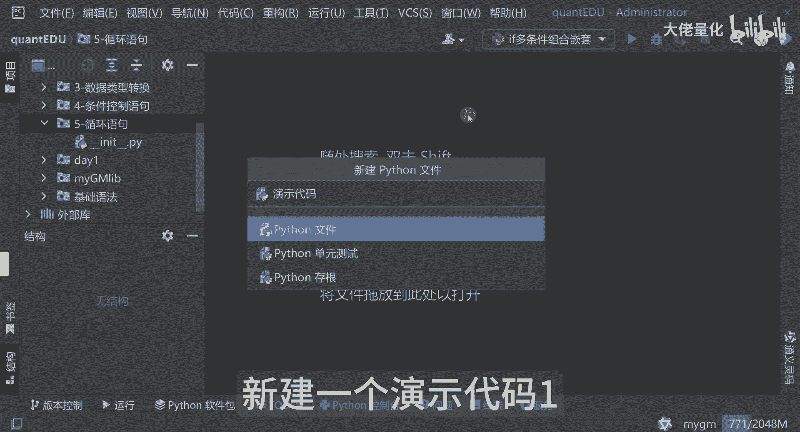
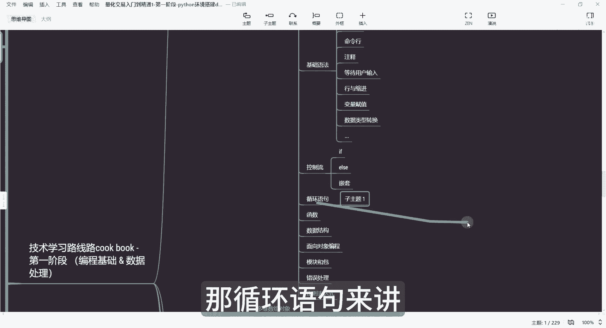
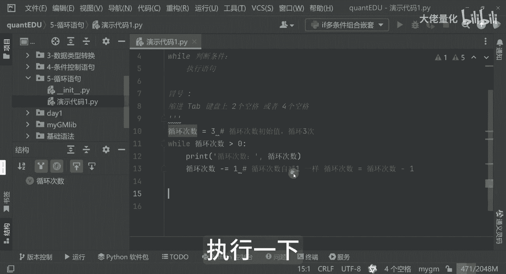
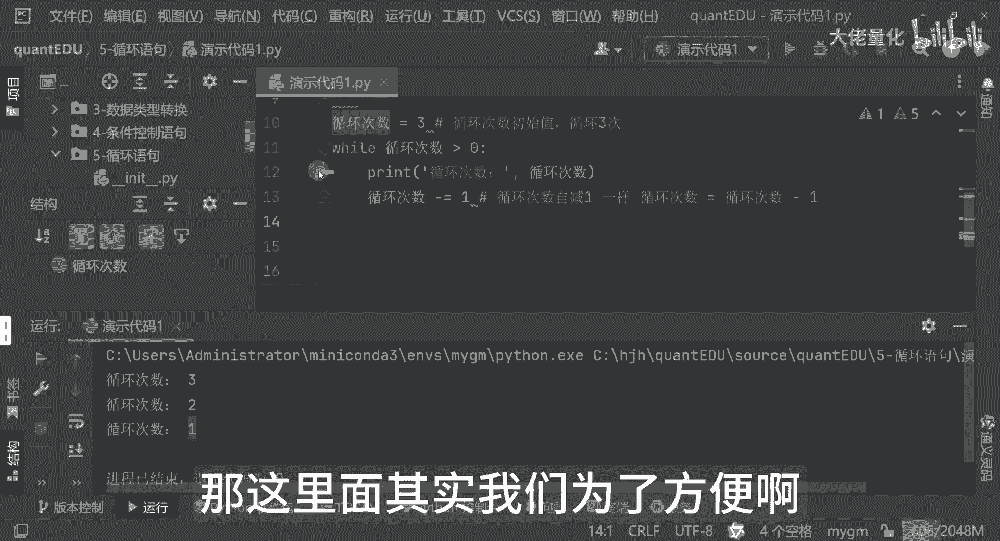
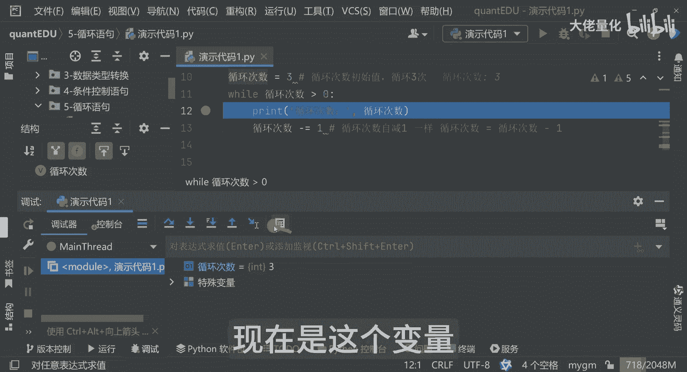
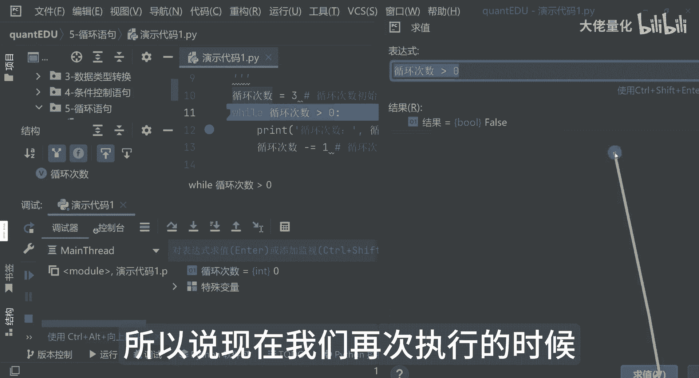
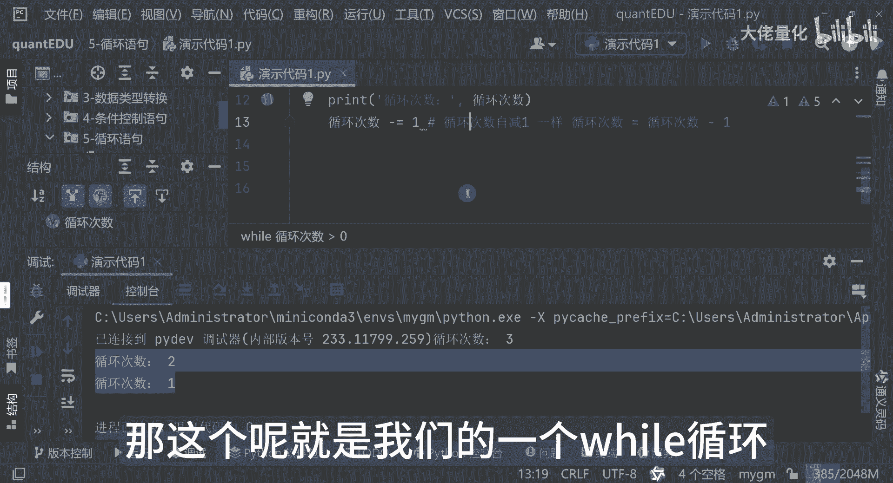
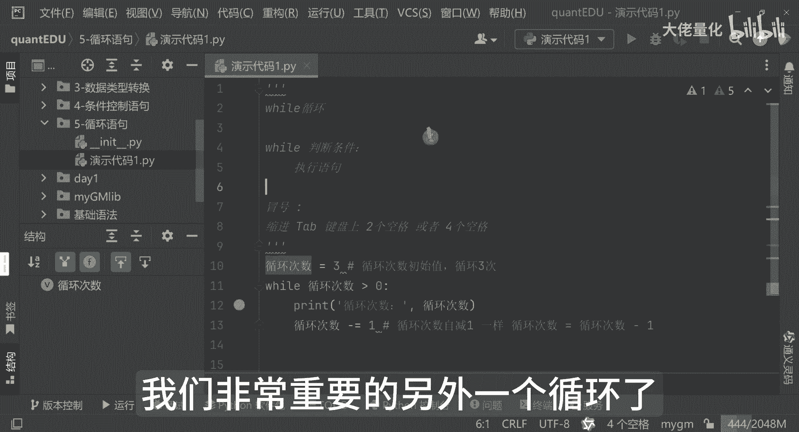

# 量化交易入门到精通36-python循环语句-while - P1 - 大佬量化 - BV16axYenEqN

欢迎朋友们回来，那我们这节课学习另外一个非常重要的知识点，就是我们的循环语句啊，这是我们的循环语句哈，然后在这里边来讲呢，新建一个演示代码一。

我在这里脑图这里边再补充一下啊，这是一个就是我们的一个循环语句，刚才讲到我们的控制流if else啊，还有一个是嵌套，那循环语句来讲呢。

我们是分为两块，一个是我们的while，一个是我们的for哈啊，大家可以看一下啊，那我们什么场景，什么时候是需要一些循环呢，那其实简单来说，那循环语句就像我们勤劳的一个小蜜蜂一样。

可以我们帮我们重复的执行某些代码，那省时又省力啊，那比如说呢，你想在A股市场上找到所有过去一年中，每个季度啊，净利润都实现增长的股票，如果一个一个去看，那肯定是到猴年马月了对吧。

那这个时候循环语句呢就派派上我们的用场了，那我们可以用它来遍历所有的股票的数据呢，然后判断每只股票是否满足条件，那最终呢是筛选出我们想要的股票啊，那这里边就是配合了我们的循环。

再加上我们一个条件控制语句哈，那这里边呢我们先看啊，我们先学习第一个啊，就是我们的一个while循环，那这个while循环来讲呢，它就像一个执着的一个小家伙一样，小蜜蜂一样，只要条件满足。

就会一直的执行下去，它的形式是这样的，就是首先是我们的while，然后是我们的判断条件，那这里边呢是我们的一个执行语句，那好那这里面来讲呢，我们可以看一下演示的代码哈，这里面要大家注意啊。

就是冒号和这个缩进，一般正常来讲在id里面你就直接点tab键，就是再写上冒号，也就是这个符号，然后和缩进缩进来讲，一般呢我们就是电脑里边的那个铁壁键哈，啊键盘上的有些是两个空格。

两个空格键或者是四个空格，当然这个是可以自动设置的，一般大家用四个空格会多一些，那这里边呢我们可以看一下我们的while语句，的一个演示的代码，我们照例再继续写一个，比如说循环次数等于三，那么YY一下。

如果是循环次数大于零的话啊，这是初始值啊，我这备注一下，这是循环次数，初始值初始值是循环三次，循环次数大于零的时候，那这里边会打印循环次数，然后那个这里边这个操作就是我们运算服务。

就是减等一哈这块来讲呢，我可以再写的更清晰一点哈，就是循环次数自动减一哈，那他的操作是什么意思呢，相当于是我们的循环次数等等于循环次数减一，这两种写法是一样的哈，所以说我们用这种方式来简写的。

用减等于一，这种方式其实和它的意思是一样一样的，然后那个是是为了让我们代码就看起来，更整洁一些，那这里边来讲呢，它的预期效果就会打印出我们三次，这样的一个值执行一下好。

可以看到啊，这里面是循环三次，这里边每次来讲呢，你会发现它减一第一次的时候是三，也就是我们初始定义变量的时候是三，那它经过一轮执行之后呢，减一之后呢变成了二啊，执行了一对吧。

那这里面其实我们为了方便啊查看啊。

这里面其实可以看一下，这个其实不用掌握，你可以看一下这里边的一个值，你可以看一下哈，来看循环次数，现在是这个变量。

看一下这个通过这种方式打的id，这是三哈，好我再执行一下，OK我我这边我再计算一下它的值，你看这变成了二对吧，那这里边也能看得到是二，那好我再执行一次好，这里边我再执行一次，这里面变成了一。

那我就相应的求值变成了一啊，然后这里边我再执行，我再执行再执行，我这里边再执行一次，1-1的时候就变成了零，好变成零了，这里边其实我们可以把这句话可以拿出来啊，这时候已经变成零了，我们先把它拿出来。

可以看这里边等于false了啊，之前的时候呢，其实每次的循环次数它是从三开始，321，它这里面其实这句话的一个含义呢，就是每次返回的时候，它是个BOOL，也就是布尔值，它要反应true。

这里面的反应false，那所以说现在我们再次执行的时候。

程序就会完全退出掉了，看这里边就是他把这个循环次数，321就整个执行完了，那这个呢就是我们的一个while循环。

那下节课我们要学习一下，我们非常重要的另外一个循环了。

就是我们的for循环。