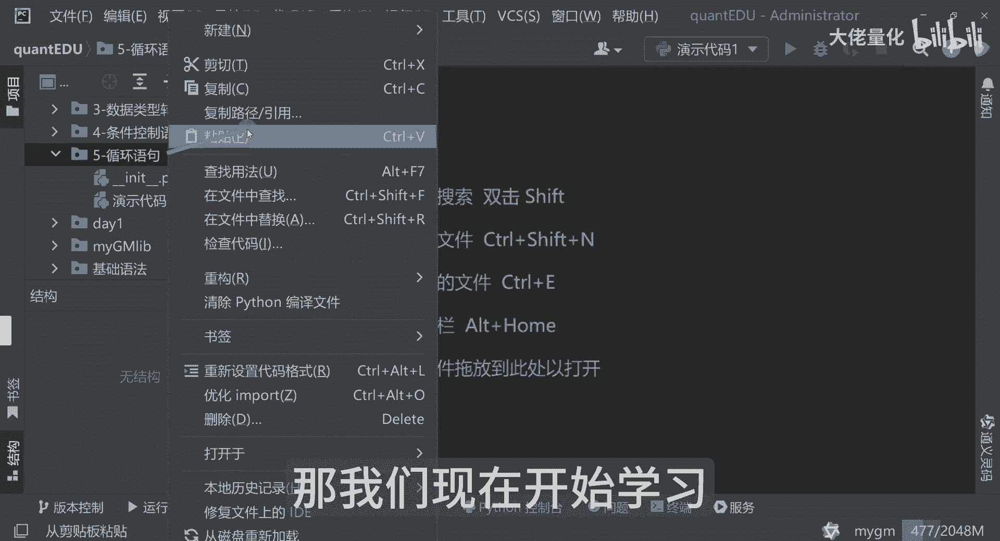
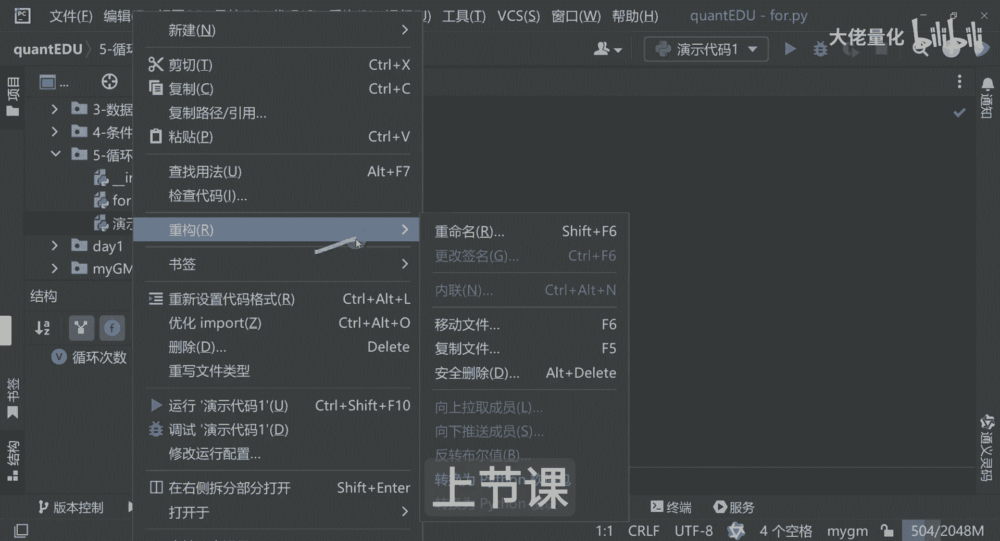
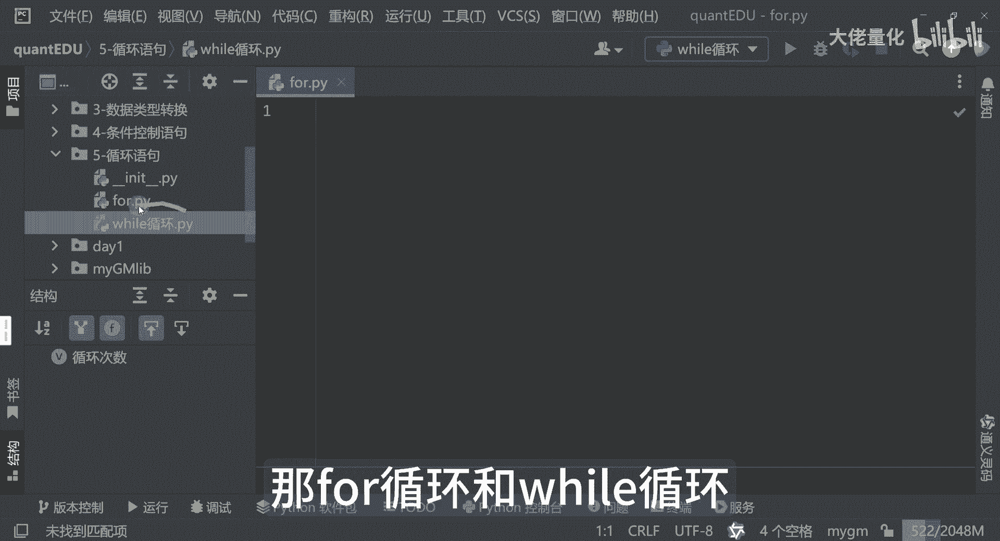
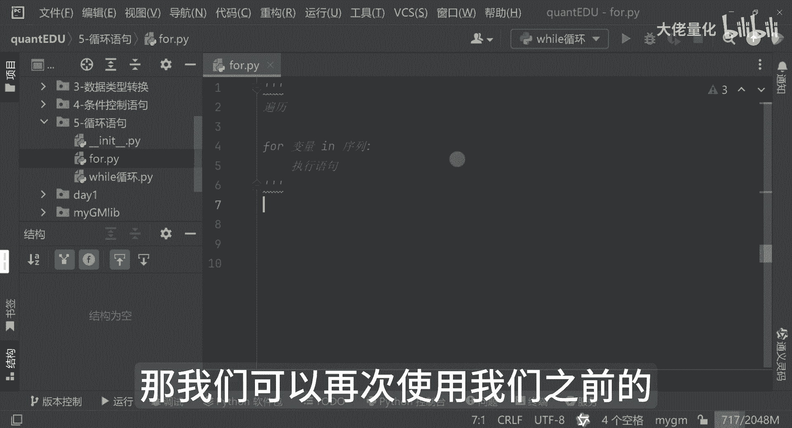
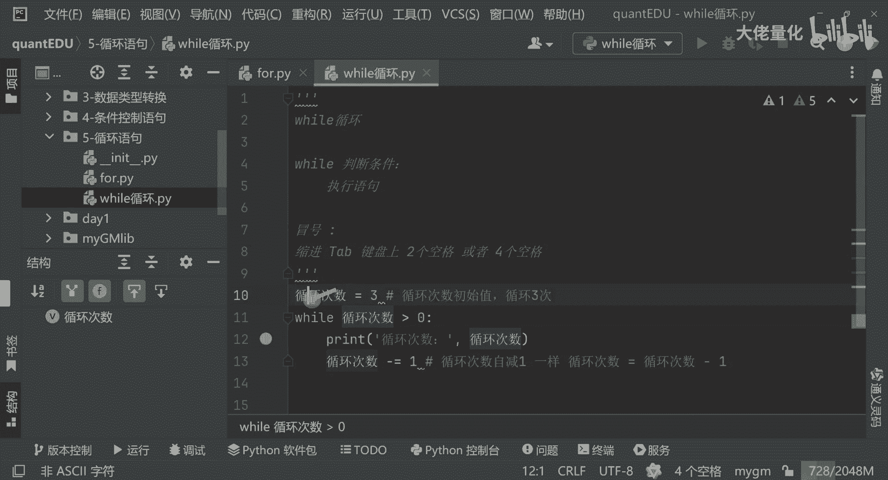
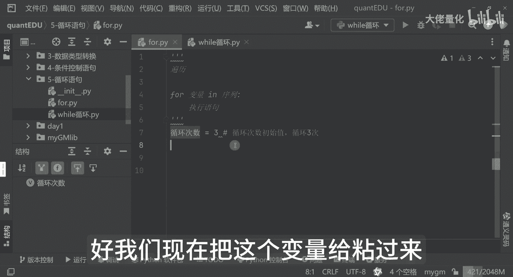
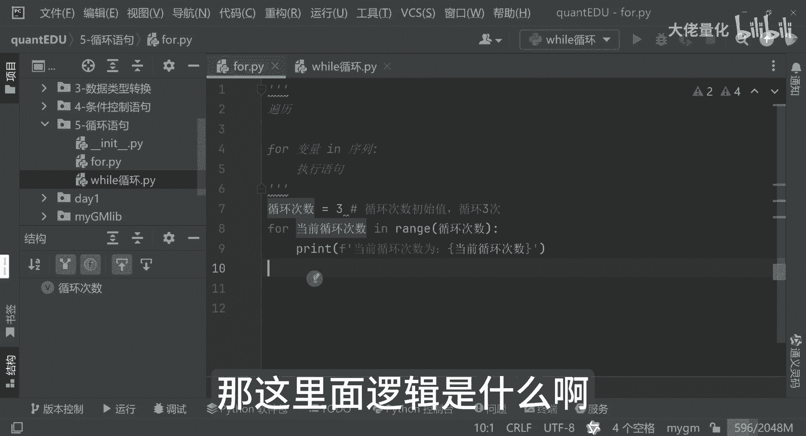
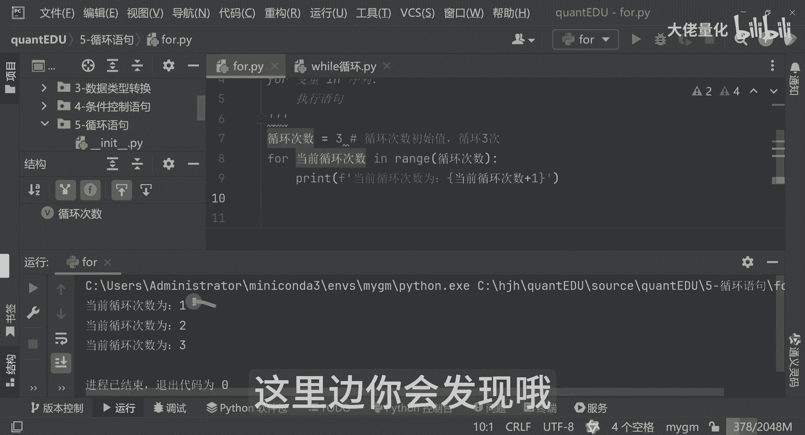
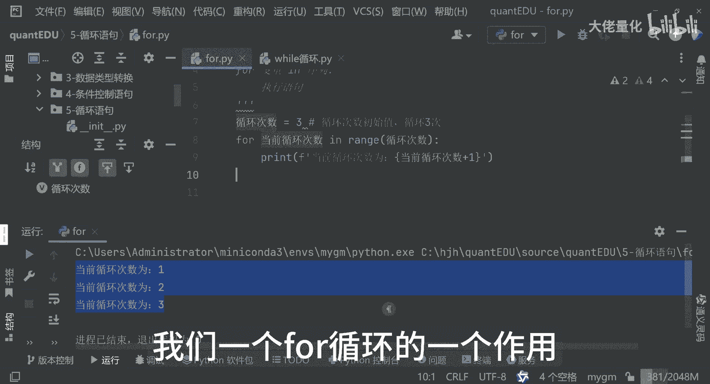

# 量化交易入门到精通37-python循环语句-for - P1 - 大佬量化 - BV1Ny4KeHEcd

欢迎伙伴们啊，那我们现在开始学习我们非常重要的一个循环。

就是for循环，上节课我们学习的是我们的一个while循环啊。

那for循环和while循环。

其实这两种方式用的都很多，那for循环呢其实它我们常用的呢就是一个便利，便利来讲呢，就是用的还是蛮多的，你比如说我们便利一些啊，列表啊，字符串啊哈等等一系列的，这里面都会用到我们的一个for哈。

那他的写法呢和while循环会有些不一样，那首先来讲呢for后面跟着是我们的变量，然后是in，然后是我们的一个序列，这里面同样是个冒号，那这里边这个位置也是个tab，再加上一个执行语句啊。

是这样的一个逻辑，那么接下来呢查看一下我们的一个例子啊，那我们可以再次使用我们之前的。

用while的一个写法，看一下我们当时写的不是这样吗，那就是循环次数等于三对吧。

好我们现在把这个变量给粘过来哈。

这为了方便大家理解啊，那好那这里边来讲我写个for，那这里面大家可以看到这里边我再打印一下。

就是我们的当前循环次数V好好，这个来讲我可以不用I哈，就是当前循环次数我把I就替换掉了，但通常我们代码中一般都会使用用英文的方式，后面真正我们到实战阶段来讲，我也会带着大家真正写英文会多一些。

一般定义变量，写这些呢是为了让大家好理解哈，那这里面的逻辑是什么哈。

我们可以先运行一下，看一下结果好，可以看到哈，那这里边来讲呢，我们可以发现一个很奇怪的问题啊，这里边哎当前循环的次数为什么零呢对吧，我们之前其实学到我们那个数据类型的时候，我们也知道整个程序计算机呃。

语言里边来讲的是从零开始的，这里面是带一下标0101那种哈，二进制那样的，所以说他是从零开始的哈索引哈，他是index索引，那我们为了让它看的更舒服一点呢，其实在这里边我们可以人为的加一，都是可以的哈。

你比如说我现在再运行一次哈，这里边你会发现哦。

这看着当前循环次数一，当前循环次数2123哈，那这里面来讲呢，我们接触到一个新的一个方法叫range，那其实这里边呢就是告诉我们，是说这是一个便利的一个值哈，是从这个值啊，从这个里边哈。

那依次的把它遍历出来，并且每次呢它的值呢，其实就是放到了当前循环次数，这个变量里面去哈，那这里面就是实现了我们一个，for循环的一个作用。

