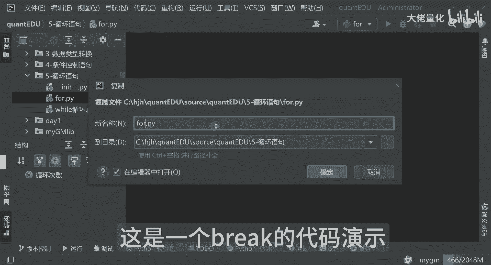
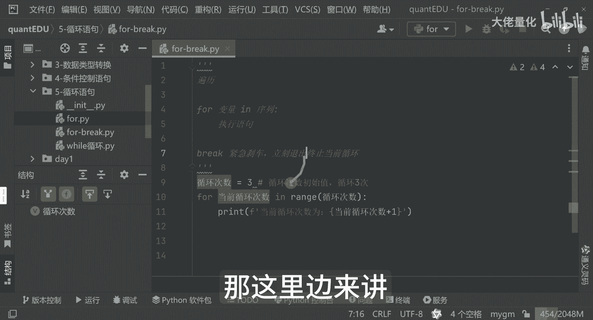
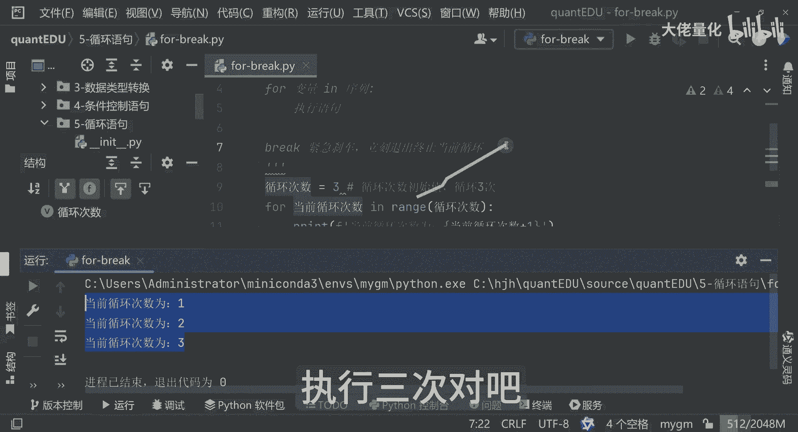
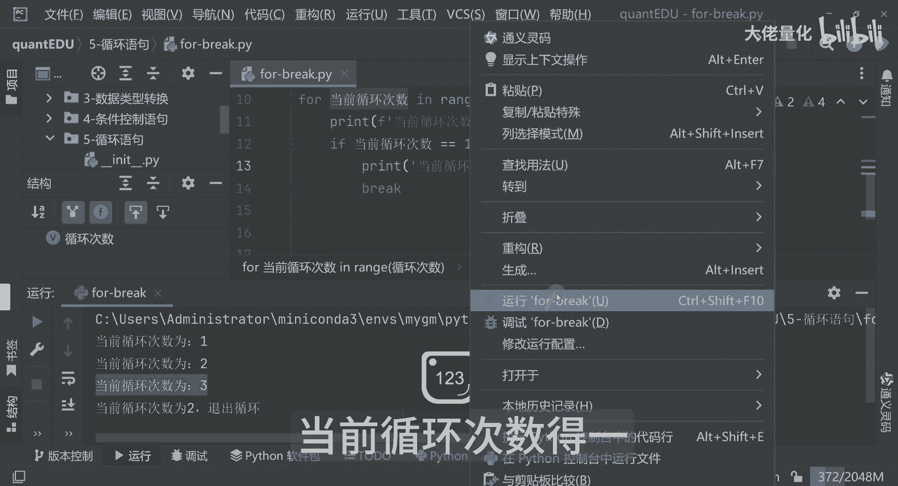
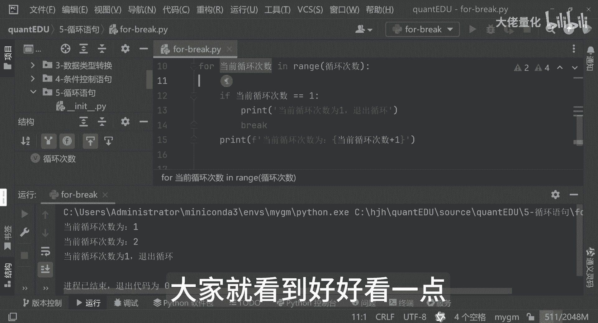
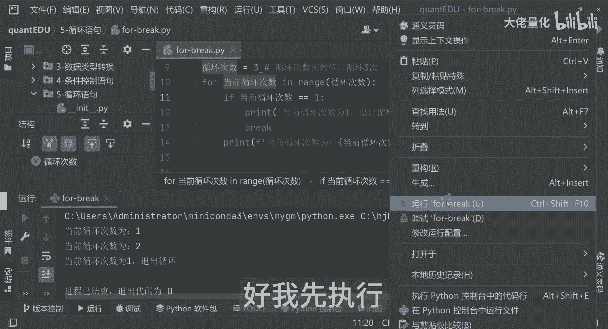
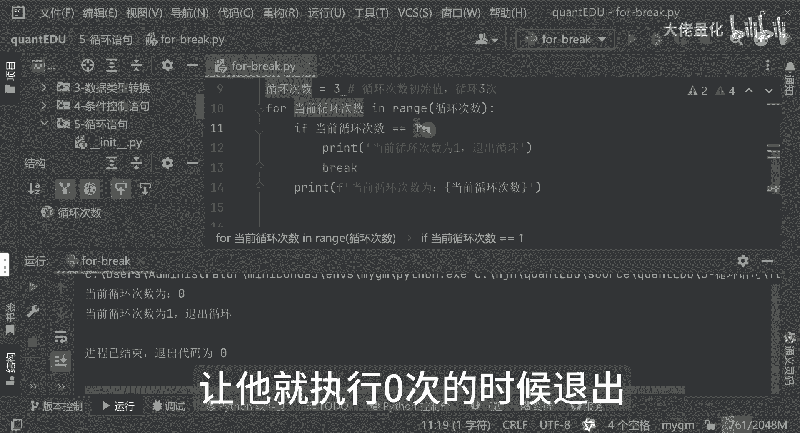
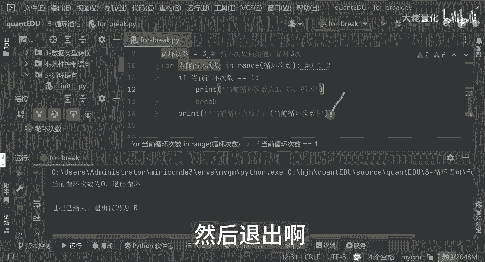
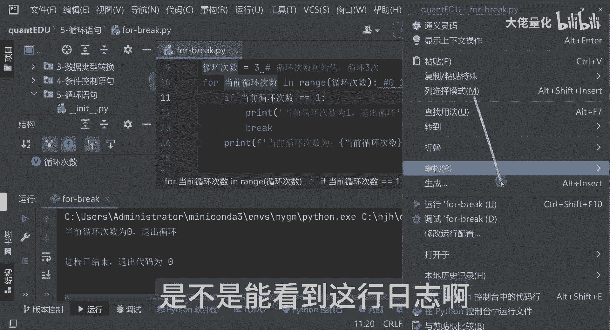
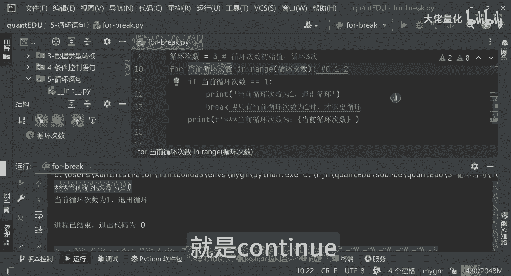

# 量化交易入门到精通38-python循环语句-break - P1 - 大佬量化 - BV1MQ45eUEYF

我们再看一下，这是一个break的一个演示。

那这里边break是干嘛的呢，break打断了，这里边就相当于是个紧急刹车一样，这里边会立即的退出，并且终止我们的一个循环的一个执行，一个退出，终止当前循环，好那好，那这里面要怎么做。

我们再结合一下我们之前的一个程序，那这里边来讲。

我想执行三次是吧，好那执行三次之后，123好，执行三次对吧。

那我现在想让他执行第二次的时候，我就想让他退出，那这里边再结合我们之前的一个方法。

等一下当前循环次数，当前循环次数等于一。

我看一下，那个我们可以把它放到这里来哈，把这行语句调整一下，大家就看到好好看一点。

那这里面来讲呢，我们比如说我们只循环一次，就让他退出好，我现执行。

大家注意看到这个里边的输出内容，当前循环一次的时候，那这里边就会判断我这个range，也就是0123啊，对我应该把这个E去掉，这样大家好理解一点，那这里面等于一的时候，其实它已经是执行两次了哈。

大家可以看一下啊，他这里面是零嘛对吧，那我现在想要它就执行零次的时候退出。

执行零次他就退出了，因为这里边我说了哈，这里面真正执行的时候是这样的哈，是零二，那所以说我刚才判断是有问题的，那大家现在可以看到了哈，那当前次数循环到一的时候就退出了，并且这句话是没有打印的，对不对。

那我现在把它改成一改成一哈，那我让它循环到零一的时候，然后退出啊。

也就是说我们这里面最起码我能看到这个值，是不是能看到这行日志哈。

给大家看到在执行好吧，那这里边就打印出来了哈，那当前执行次数为一，单次数为零好吧，我这里面我加了三个星号，大家看的更清楚一点，你看大家可以看到这句话，就是当前的循环次数为零。

因为他第一次的时候为零的时候，是不符合这if if条件的啊，所以说这行语句呢并未触发这个break，这个触发break的时候，是只有当前循环为一的时候才真正的退出，这是我们的一个break的一个用法。

好，接下来下一课呢我们要学习一下，我们非常重要的另外一个语句就是continue。

