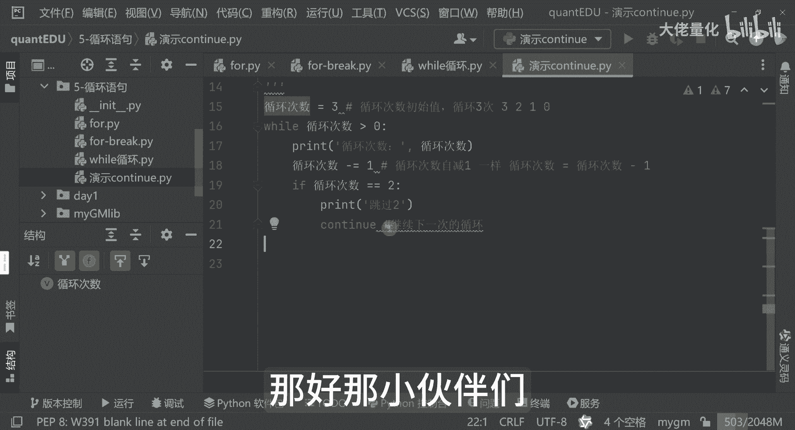

# 量化交易入门到精通39-python循环语句-continue - P1 - 大佬量化 - BV1y9xfewEMN

我们这节课去学习我们的循环，我们刚才学到了我们的啊，for while以及我们的break，其实这个for break它并不是针对于for来这个break啊，其实在while里边也是一样的。

也是有break，就是break和continue这两个关键的用法，在for和while里面是都可以使用的，那接下来我们再新建一个方法演示我们的continue，刚才我们一直用的是for的写法。

那这里面来讲，这次我们可以改一下哈，我们的while的写法好，我现在把这个while的代码粘过来，一样的，就这里面来讲呢，就是这个continue刚才不是有break刹车吗，continue来讲呢。

告诉你，其实字面意思就是继续可以继续继续往下做，那这里面我们刚才执行了就是三次嘛，好就是循环次数0123对吧，循环次数是三，因为他从这里边为什么这样子啊，这里边它是从二从一啊，从零啊，不对。

它每次减的时候，它是从321，因为初始值来讲呢，他现在不是零了哈，因为这里面是个减的过程哈，它不是加的过程哈，所以每次来讲呢就是3-1=2，2-1=1，然后一直到零的时候，那不符合零的时候。

他才会退出对吧，那这里面我们如何把我们的continue引入进来呢，那照例来讲呢，我们在这里边我们再写一下，那if if循环次数，我们等于二的时候，我先要输出一下，好，这里边来讲呢。

我告诉你说我们要跳就不会让输出这一块了哈，那我们现在执行一下，看有什么效果，这就是continue，这是一个继续的意思，继续下一次的循环，这是肯定有的意义，好我们现在执行，这是有个有个bug哈。

这里面是有问题的，那这里面来讲的话，我们应该是这样的，我把它放在这里是有问题的，因为为什么哈，因为刚才来讲呢，我刚才那么写完之后，大家看到哦，跳过二跳高二跳高跳二，为什么会有这样的哈。

那其实你可以看一下，因为这里边是没有走到这个循环次数，减一的操作哈，所以说这里边来讲呢，它永远它的值他都是这个从三二这样，一直是那个状态，他一直没有减的操作哈，所以说你大家可以看一下。

其实在那个短短的一瞬间，那程序电脑它已经是在这个执行过成千次，上万次，那如果是服务器来讲，它的运算效率会更高的话，你看我的鼠标一直在滚动啊，这里面其实你看他一直没有变化啊。

那我们现在把我们的刚才的一个bug修复了好，那我们现在来讲呢再次执行啊，看看这次会怎么样，大家看一下，这就是符合我们的一个预期效果了，那这里面来讲呢，首先看到我们的循环次数啊，首次的时候等于三嘛。

看我鼠标这个位置哈，等于三，那这里边来讲呢，好OK那如果是说啊这个循环次数等于二的时候，他告诉你说好跳过continue，但这里边来讲呢，是因为下次来讲呢，它这里边已经执行了这句哈。

所以说他还会继续继续来执行的哈，那其实等于这个一的时候好，我们的程序就结束了哈，那这里面其实肯定用来讲呢，我们一般会用在哪里哈，其实一般这么用的会比较少，我这个案例这种用法可能用的会比较少。

一般我们continue来讲呢，一般会在我们的一个程序中，话说exception异常的时候，例如我们的一个网络请求超时了，那我们是否是不是循环从事等等，这是我们要做的事情。

好那这个while循环continue for break都已经学完了，那我们下节课要学习我们的一个函数，函数是非常非常重要的，那好那小伙伴们。

我们下次再见。

