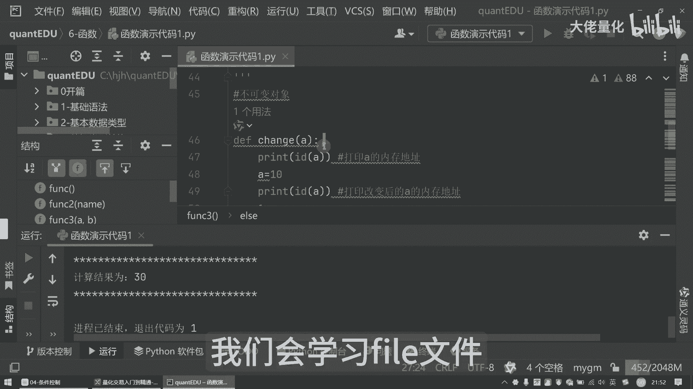

# 量化交易入门到精通40-python函数 - P1 - 大佬量化 - BV1ao1QYRExr

大家好，我是专注量化交易的速度，那之前我们学习了语法基础控制流，今天我们来学习函数，函数是非常重要的，我这边新建一个目录，就是我们的六函数，然后我现在新建一个Python代码，函数演示代码一。

那这里边我再简单写一下函数是什么，那其实很多小白一听到函数就头大，那其实它就像我们炒菜的菜谱一样，那把菜的做的步骤要写好，然后以后只要按照这个步骤来做就可以了，那咱们的Python也是一样。

把代码封装起来，那以后用的时候直接调用，那方便快捷还省事，你说对不对，那么函数是长什么样子呢，那咱们首先咱们得认识一下函数长啥样，Python定义函数是用我们的一个叫DEF关键字哈。

那就像咱们写菜名一样，那后面是跟着我们的一个函数名，然后再加上一个括号，那括号里边放的是我们的一个参数，那最后来讲呢再加上我们的一个冒号，那就像我们的菜谱里的配料表一样，那我们接下来举个例子。

我们根据DF就是我们的一饭，一个我们的关键字，那函数来讲呢，其实就是我们的函数名称，我们叫funk和function哈，然后这里边呢是我们的括号，那括号来讲呢，一个是有有参数的，一个是我们的没有参数的。

那我在这里面也写一下啊，无参数来讲呢，这里面就是空的了，我把它全删掉，这里面就是这种形式啊，那这里面来讲呢，我演示的第一个呢，就是我们的一个无参数的一个方法哦，叫无产定义，定义一个无参数的函数。

这个就是一个无参数的函数，然后我们现在直接运行它，看看我们的输出结果啊，我把字稍微调大一点点，那我们现在运行我们的一个无参数的函数，好运行，运行之后我们发现哦什么都没有是吧，那什么都没有。

那这里面直接用和原来的方法也是不一样的，这里边用的时候就直接调用函数，那这里边实际上要把我们的一个就function，这是上半部分是定义的，下面是应用使用啊，那我们刚才执行的时候呢，这个部分是空的。

什么都没有，那我们这时候定义完我们的方法，定义完我们的函数，然后这里边你会看到hello world，这里边就是把我的这一行，the print hello world打印出来了啊。

那这里边的一个函数来讲呢，它就像你学会了一个菜谱，我们直接调用这个菜谱，那相当于是说我把这道菜又重新做了一遍啊，咳相当于是我一个炒菜的一个秘籍，那我们这里边除了我们这样的一个函数，简单的输出啊。

我这里边可以再写一个，定义一个有参数的一个函数，比如说定义一个有参数的方法，那我们还叫function function，二里边来讲，我们会发现有个name哈，Hello。

刚才我们是hello world哈，那好我们在调用它的时候，你看啊，这里边我们现在输入的是Python，那我们现在看看最终输出的结果是什么，看这里控制台好，第一句话是hello world。

这句话是这这句话输出的，这是我们无参数函数，下面来讲呢是我们的有参数函数哈，那这内幕内幕也就是我们function2啊，作为一个参数的一个输入啊，就是Python。

那这里边输出的就是hello Python，其实就是把我们的Python传入进去了，这种就是函数的一个简单方法，除了这个简单传一个函数方法以外，我们其实可以传入其他的函数。

你比如说我再写个稍微更复杂一点点的，你比如说我要定义一个函数，然后比较两个数大小，然后我们现在定义这样的一个函数哈，那这里边方式三来讲，这里边是有两个啊，叫做形参啊，实际上形参就是我们的形式上的参数。

那简称叫形参A和B两个值，如果是A大于B，那我们就输出A是大于B的，如果是A小于B，那么就输出我们的A小于B的，那如果说第三种情况啊，那就是我A既不是大于B，也不是小于B，那就有可能是等于B嘛。

哈那我们这里面输出的就是我们的A等于B，那我们调用这个function3的时候，这里边告诉你说我们现在输入这个两个参数，当然我们可以不用这种方式，我们输入参数来讲，还有另外一种方式。

你比如说我A等于一啊，B我等于这样来讲呢，我这里边我不直接输入这种呃，这个一和二好，我们现在来看我们的方法，这里边我输入的是A这里边我输入的是B好吧，这里边会最终输出是什么。

我这里边再打印我们的一个分隔符，好我们现在打印这里面就告诉我们了，所以说一是小于二的对吧，那好我们现在把A变成二，B也是二啊，那好我们看一下好，二是等于二的对吧，那这里边呢你比如说我现在输入三。

那就告诉我们就是三是大于二的，这是没有问题的哈，那这里边就是我们的一个有参的，然后参数，并且是用我们的一个变量来进行传入的，好这里边还有个疑问啊，你会发现哎我们的定义变量是A和B对吧，这种叫形式参数。

那事实上我们传入的时候定义的变量哈，这里边我再备注一下，这里边是我们的一个定义变量啊，好那我们现在不传A和B，比如说把它注掉，我们现在再定义另外一个，这个我叫做X好吧，这个我叫做Y。

那么我在传参数的时候，我把这个XY传进来，我X我等于10Y或等于九，那么这时候来讲呢，大家猜一猜哈，我这里边是A和B，那我这里面定义的是XY，那么这时候我还能执行成功吗，会不会报错呢。

好那我们现在执行一次，大家会发现，那我现在这里面明明定位是A和B呀，那这里边我传的是XY也是可以的啊，那这里面就是所谓的我想解释就是形式参数，形式参数和我们实际传的内容是不一样的哈，好那我们再看下一个。

我们还拿做菜这个举例子啊，那函数呢它配料啊，那这里边就是相当于是我们的一个参数，传递一样，那做菜的时候啊，那不同的菜呢需要不同的配料，那咱们的函数参数也是一样的，那可以根据需要传递不同的参数。

那Python函数呢在参数传递的时候，有有这种这个可变对象和不可变对象两种，那我们可以看一下不可变的对象啊，那不可变对象是什么呢，就像咱们在炒菜用的盐一样，你加多少就多少，不会影响原来的严啊。

比如说数字啊，字符串元组，那这些呢你在函数里面改了它，它只是新生成一个对象啊，它不会影响原来的值哈，这种叫做不可变的一个对象，那什么叫可变对象呢，那比如说这里面常见的一些列表字典。

那你在函数里面改变它呢，它会影响原来的一个值啊，我们可以写个例子啊，你比如说我们现在定义一个方法啊，那我们叫做change，那change着来讲呢，比如说输出的是A好吧，那我们现在比如打印一下。

那这里边有个关键字就是IDIDA，那我们现在取它的一个内存地址哈，那这里边会输出啊INA的内存地址好吧，我现在比如说我先A等于十啊，那这里边来讲我再打印一次A的地址，就是打印我们改变后的A的地址。

那我们看一下会有什么不同，那这里边我们进行调用，按照我们的一个方式，X等于我现在给个一哈，我现在调用我们的X那好注意输出哈，那这里边我现在再加一个分隔符，好那我们现在输出啊，看这个结果会有什么不同啊。

好我们可以看到啊，当我们传入X等于一的时候，也就是A啊，为了方便理解啊，我先用A我一样啊，那输出的时候会发现那这里边等于这个数哈，那前面的这些号是差不多的，你可以看到后面那它等于一的时候。

也就是我们的43行，这一行打印A的地址是我们的360结尾的，那当他把A改成十之后，这里边它的地址结尾就变成了我们的648，它的内存地址是进行了一个改变的，这种呢就是我们的一个数字数字字符串。

就相当于是说你这个值已经改变了，那就是此A非彼A了，我我我再解释一下啊，什么叫内存地址，那那整个一个计算机的一个存储，除了我们一个内存硬盘，其实在CPU里边也是有一个相应的一个存储能力，我们叫寄存器。

就是等等一系列，那还有存储的方式有很多种，我们现在内存来讲呢，这里边每个值每个操作我们叫做什么，我们叫做什么，是对象指针，这些呢实际上都是存在我们的内存中的，我们常见的一些错误。

你比如说大家用windows时候会常见一种错误，叫内存溢出，那这种来讲呢，在原来那种比如说C语言啊是非常常见的啊，那你比如说这个主要是和指针这边啊，然后分配分配内存空间溢出了这种有关啊。

那其实它并不是C语言才有，你像这个Python java这种程序，它也可能有会员内存溢出，那内存溢出是什么呢，那内存来讲呢，相当于是内存里边是它的数据结构，又分为我们的内存，这里面又分为我们的一个对战。

还有很多啊，这边我就不详细展开啊，那所以说我们的一个字符或者是一个数字，这种对于我们的不可变的一个对象，那我们输出的这种内存地址是不一样的，那好那我们再看下一个内容，我们的一个可变对象。

刚才我们演示了就是不可变对象啊，那这里边来讲呢，我们再定义一个叫做可变对象，那可变对象粒子是比如说是这样的哈，那这里边我用称这二哈，那这里边我再打印一下这个分割线，打完了哈，那我现在是用这种方式。

你比如说我们现在定义了一个叫list，定一个列表，那现在来讲呢，我现在只有十二十，有30，那么现在来讲调用我们的change2，然后把我们的my list传进去好，我们可以看一下，那这里边来讲。

我追加的是40吧，那我们现在打印一下，看看有什么结果稍等，我打印的值是不对的啊，不只是打印他的地址在这里嗯，再加一个啊，调用前的值为是这个啊，那我现在在这个位置来讲呢，我是调用后的值为好吧。

刚才他仅仅打印了那一个地址，然后我现在打印，OK大家可以看到，那我调用前的值是这个102030，那我调用之后，就这里边有一个叫做append，append来讲，相当于是追加我们的值，你会发现追加完之后。

那这里面调用hold就变成了十二十三十四十多了，一个40，这就是我们追加了，也就是说它这个传入的值是这种是可变的哈，现在是把它可变了，我们现在比如说我们把日志加到这边来看，后面再加一个。

看看我们那个输入输出之后的一个结果是什么，好吧，就是调用完这个称之二之后，我们的输出结果是什么，这边来讲的话，我们再加一个这个哈，打印一下，用大括号来进行打印，My list。

然后这里边啊这个是函数Y的值为，这里面可以看一下啊，最终我加了这个，这里边是不单单是在函数里边追加了40之后，它原来是十二十三十四十啊，它已经变成这样子了，你会发现他这个my list啊。

my list它自从调完这个称轴二之后，他真真正正的就把它也真正的变了，变成了十二十三十四十了，这里面所以说my list来讲，这种就是我们的一个可变对象的一个例子了，那这里面来讲，下一个。

我们要看一下我们的函数的一个参数了啊，那函数参数其实有很多种啊，相当于是说我这个做菜我是有各种调料一样，除了我们的可变和不可变的函数参数，还有有几种不同的类型啊，就像我们放油盐酱醋一样。

可以根据我们的选择不同放不同的调料，你比如说我们的一个必须的参数，然后还有一个关键字参数，还有我们的一个默认参数，这些都是非常常用的啊，还有一个是不定长参数，那这里边来讲，我们可以先从第一个来看啊。

那什么叫做必输参数哈，必输参数呢，就像我们炒菜必不可少的油和盐一样，那少了它那就做不了菜，这些来讲呢，bu参数是必须按照顺序传递的，那数量也是和这个定义时是一样的，不然程序是一定会报错的。

我们可以举个例子啊，你比如说我在这边我加一个，这个就是必输参数啊，B出参数的时候，现在调用它分成四哈，那这里面来讲呢，我就直接传一和二，那好我现在我把二删掉，我先输出，OK你看到没有看到没有。

这里面没有值的哦，我现在把那个二再输入进去，大家看到一和二了吧，所以这种必出函数来讲，就像油和盐一样，你一定要放那个调料，那好，那我们接下来我们看我们的关键字的一个，演示代码，关键字来讲。

就像我们在炒菜的时候，可以根据口味加点辣椒啊，那关键字可以用那个名字来指定参数，这样就不必须的按照一个顺序来传递了啊，你比如说这样子方身五哈，我之前传的方式，你看A和B我传的是一和二嘛，对不对。

那我现在来讲呢，我现在显示调用顺序是可以随意的，你看这里面输出的是二和一还是一和二，可以看一下，我们先输出好，OK我再加个日志，把他空空出来，大家看一下啊，这里面输入的一和二了吧对吧，我好。

我现在把B改成改成这个三，我现在把这个4A改成四哈，我现在输出一下，你会发现啊是吧，这里边他依然输入，按顺序，他先把A值打印出来，然后再把四这个值打印出来，这个就是我们的一个关键字参数用法。

再看下一个方法，就是我们一个默认的一个参数演示代码，我现在打一个分隔符啊，好那这里边一个默认参数啊，你可以看到我们的定义方法的时候，A是一个变量，B等于二哈，现在就进行我们的调用，现在是我们的方程六啊。

你比如说我现在传入的A是什么呢，A我传的是十，B我传入的是20，那好那我现在输出你会发现我现在A等于十，我B等于20，我现在输出来的是等于十和20是没问题啊，那好那我现在来讲B的值我先不传。

我们现在运行一下好，你会发现那这个二从哪来的是吧，那这个二就是从我们的这个默认的，B等于二值来的，也就是十和二，这个就是我们一个默认参数的一个演示代码，这些方法大家记得啊。

这些方法都非常非常的一个非常非常重要，那接下来我们再看一下不定长函数啊，这个我们的演示代码这里面是什么意思啊，你看这里面有个星，这个来讲，就像我们炒菜的时候，根据我们的一个人数是可以加菜的。

那根据我的心情，这个菜里边我可以加不同的佐料配料，那不定常函数可以接受任意数量的一个参数，用星这个关键字啊来进行一个表示，那这里面来讲调用了我们的function7，稍等，我现在打印一下我们的分隔符号。

那这里面来讲呢，也可以看到我们现在传入的参数是123，那最终输出的值是什么，好看一下，那首先来讲，它把这个ARJS，就是我们的输入的除定长的一个参数，显示出来了，1234，那这里边来讲。

比如说我现在不输入1234，我现在输入的12345，那看一下我们现在输出什么东西了啊，这里边他就会把我们的值输入进来，来12345对吧，那好那这里边type是什么呢。

大家看到了这个熟悉的老朋友couple元组是吧，还class table，那这里边来讲呢，我们用AARJS用曲原组的方式，012也可以取出这个123值，对不对，那其实也可以用其他的方式来进行便利。

我们的一个结果，比如说我现在把它注释掉，在运行的时候，你会发现它只打印了这个，我们输入的12345，然后把这个元组值打印出来了，下面的值是没有一个打印出来的，那我们如何把它完全打印出来呢。

好吧那这里边就是用我们的这种方式，你比如说我现在用好我们十二十三十四十五十，大家可以看一下啊，这里边很神奇，用了这两行代码，就是把我们的AIJS里面的值都打印出来了啊，这个for in我们之前有讲过啊。

那其实for all in这种呢就是我们的便利，我们的top元组，这个是我们的一个不定长的一个参数的演示，好的，那我们的Python函数呢我们已经都讲完了，Python来讲可以把代码封装起来。

方便我们以后重复使用，那函数的参数传递以及我们的参数类型，这些呢就像咱们的配料和技巧一样，可以让我们的代码更加灵活和高效，希望今天的分享能帮助大家更好的理解和使用，我们的Python函数。

在量化的交易路上越走越顺，那我是专注于量化的速度，下节课呢我们会学习while文件好。

那我们下节课见。

