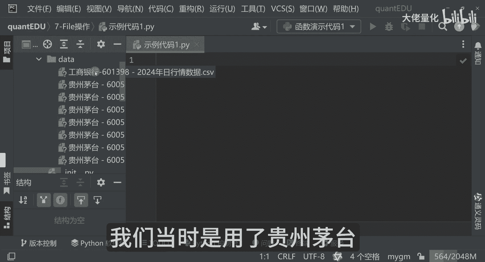
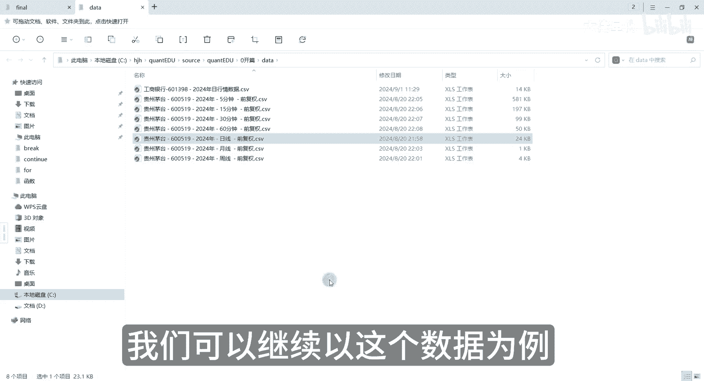
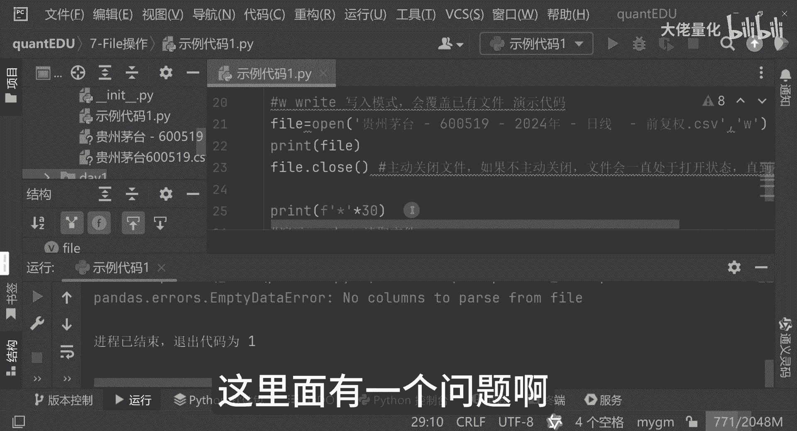
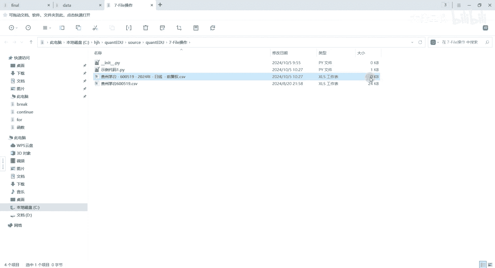
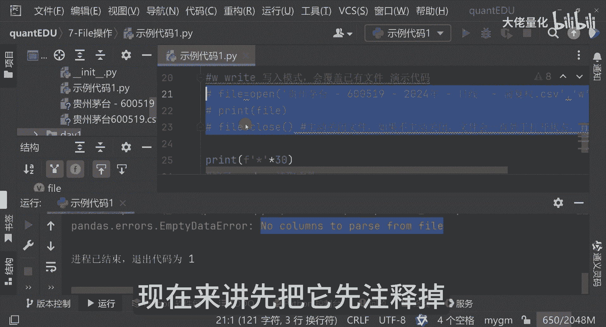
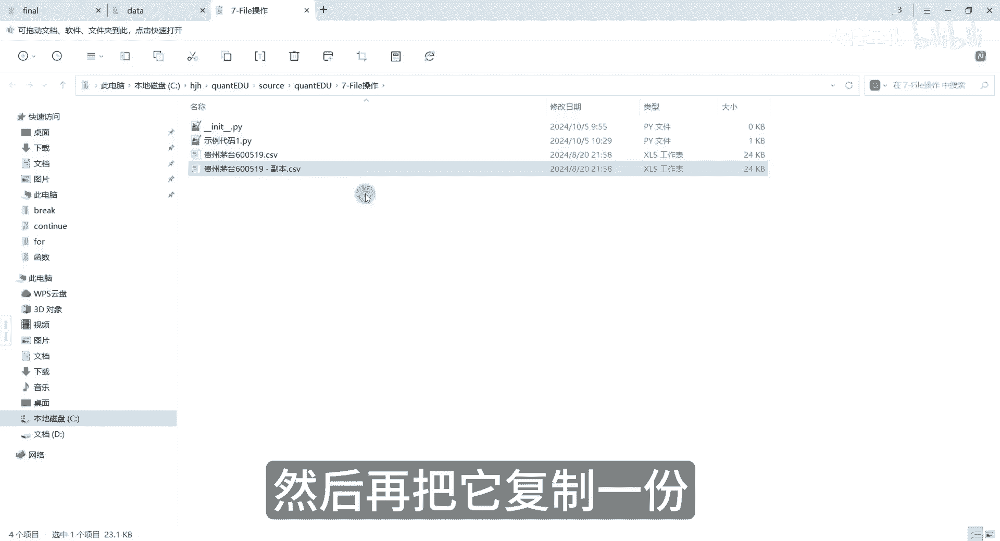
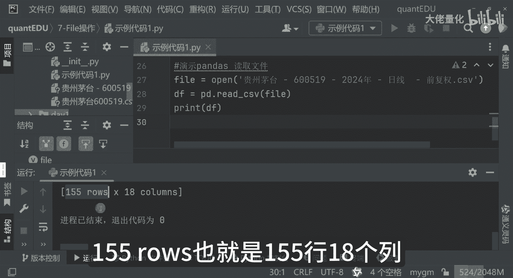
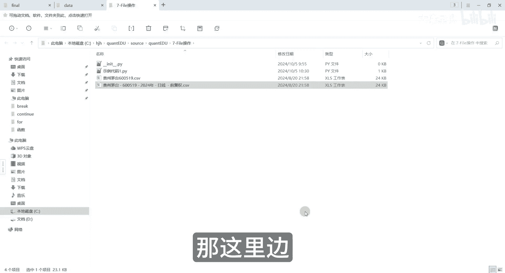
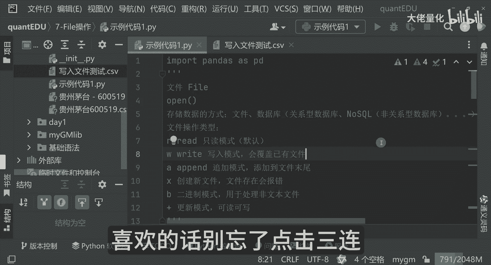

# 量化交易入门到精通41-python文件 - P1 - 大佬量化 - BV1kX2FY8EGH

哈喽大家好，我是专注于量化交易的速度，今天我们来聊一聊Python的一个文件操作，那我们的课程量化交易从入门到精通，已经是把我们的一个基础的语法部分继续推进，控制流已经学习完了。

那函数我们也已经学习完了，那接下来呢我们要学习的。

就是我们的硬件操作file，那我们在这里面IDE里面创建一个新的包，那我们是第七个七，是我们的一个file操作文件操作，那文件来讲，这里边有文件有很多，其实在我们的开篇这一章的时候。

我们当时是用了贵州茅台这样的一个票。

进行了一个演示，当时我们演示了这么多，我们在8月份的时候，当时有贵州茅台，工商银行，以贵州茅台日线为例，可以看到这是每天2024年，是拿到8月20号的数据，那这里边可以看到。

这里边你看有我们的一个交易日期，股票代码，开盘价，收盘价等等等，我们可以继续以这个数据为例。

我简单说一下我们今天要讲的一个内容的概况，说到我们的文件，也就是file，那这里边我们常用的一些函数呢，比如说open这个就是打开我们的一个文件，就是我们在量化处理文件的时候，是非常非常重要的。

我们应该知道就存储我们的一个文件，存储数据的方式，有我们的一个文件，还有数据库，那数据库来讲，有我们的一个关系型数据库，还有我们一个非关系型数据库，也就是NO SQL，那还有一些其他的数据库。

但是我们常用就是这些，今天讲的是文件的一个操作，那文件存储的时候，我们如何像windows系统一样，或者像苹果系统一样，双击就打开这个文件了，一点关闭就可以把它关闭掉，那我们在用Python的时候。

如何用我们的程序来进行一个操作呢，那我们可以看一下，你比如说我把这个贵州茅台的数据拿过来，放到这里面来，那我现在为了方便我就不用建data目录了，那我直接就放到当前目录了，我们可以看一下。

比如说我们的open，你看我们在敲open的时候，其实我们用的IDE，这里面可以看到这是我们的一个F呢，代表function文件open，然后再打开我们的，你看文件路径和我们的一个文件类型。

那这里边我们可以把它复制过来，试试我们的文件路径和文件号，然后操作方式我们可以用RR，一会儿我再解释一下这R是干嘛的，然后这里边我们再把它接收一下，那我们函数处理是有个返回值的。

那返回值我们用file来代替，我们先执行一下，你发现报错了啊，报错原因这里面其实也说了啊，这个我们之前也见过，就是我们的一个符号的问题，符号搞错了，可以把这些都删掉，好现在看还报不报错。

那我们现在也是用英文的括号，这是很重要的好，那我们现在运行，因为发现控制台里边什么都没有是吧，那我们现在把它打印一下，Print file，file是作为open的返回值，诶，这里边可以看到了。

说IO这test to rapper告诉你说name，name实际上是什么呢，name就是我们的这个文件名称，那当然了，我们可以把它更简单一点，可以把它命名为其他的名字，也可以。

这是一个点CSV格式文件，其实就是我们的excel文件，那这里边会有个mod，事实上是我们的一个叫做文件操作类型，R呢实际上是我们的读取red的一个缩写，那这里边可以看到encoding。

encoding是我们的一个编码，好这里边我简单的再写一下，就是mod文件操作类型，这R来讲代表的是一个只读模式，二来讲呢就是如果是我不写R，这里边解释一个默认的，然后还有我们的常用的，像我们WW来讲。

是我们的write，这是一个写入模式，那写入模式来讲会覆盖已有的文件，那就相当于是说我同名文件，我在写入的时候再把另存时候，它会把它原文件内容会覆盖，那还有一个AA是什么呢。

A实际上是我们的一个append，是我们一个追加模式，并且这追加模式呢添加到文件末尾，那这也很好理解，就像我们一个test的记事本一样，那我们在逐渐往里加的时候，事实上他会把文件的尾部来继续追加。

还有一个是xx来讲，在这里边是创建我们一个新的文件，那文件存在它会报错好，还有一个就是B，那B实际上是我们的一个就是binary，是我们的二进制模式吧，这里边主要是用于处理一些非文本的文件。

比如文件网络传输的时候，就会有一些二进制文件，然后再进行一些解析，这里边也是方便我们的一个啊处理，还有一个加符号，这是一个更新模式，是一个可读可写的模式，那这里边比较常用的，你像R啊，W6啊。

A这几个都是非常非常常用的B是吧，那其他X和加这种模式用的会稍微少一点点，那这里面的是R的一个演示，那好那我们看一下这个write一个演示，这是一个写入的模式，可以看一下我们在打印的时候。

你发现R和W它打印的内容是差不多的，你看看这里面内容是这样的，然后他告诉我们是mod变成W了，刚开始的时候拿，而是我们的读模式，现在是W是我们write是个写模式，这里边还有一个就是说。

我们不管是说写入模式还是打开模式，这里边一定要有一个叫做关闭，比如说我们点file的时候，可以看到这里边有多种方法，函数方法都有，那这里面是有一个方法，就是把我们的文件打开之后进行关闭。

其实就像我们电脑中操作一样啊，那打开文件之后，你关闭当然是比较好的习惯，你不关闭其实也没关系，你程序结束的时候，它也会关闭，如果不主动关闭文件会处于打开状态，直到程序结束，如果程序不结束的话。

那个文件是一直占用CPU，会占用很多大量的资源好，那我们除了我们的读和写，还有我们的一个具体打开文件里面的内容，那我们可以引入这个pandas，然后并且把它给命名为pd，这里边不管是读和写。

那这里边我们都会有一个主动关闭的一个动作，那这里面来讲是我们的一个pandas读取文件号，我们可以这样子啊，open我们的file啊，打开我们这个文件，打开文件之后把它作为一个参数pd点。

然后我们的RISV，然后这块open之后把它放到我们的一个file中，那file来讲作为我们的一个参数，然后这边来讲读取数据，把它存到一个叫data frame里面去啊，那再打印我们DF。

OK我们现在运行好看是报错的，稍等一下，我知道了，这里面有一个问题啊。

我们现在看一下我们的文件，看到没有，它变零了，原来这个文件是有24KB。

现在变成零了，那真正的原因是什么呢，因为我们刚才用W写入的方式来进行读取了，进行操作了，所以说我们在这个W模式下会对文件进行重写，到现在来讲。

先把它先注释掉，注释掉之后我们先把它先删掉，然后再把它复制一份。

那复制一份之后，文件名还是一样的，OK还是R4K，我看一下，我们都以只读的模式，我把它也注意一下，这里面来讲我是打开open，它open了之后，我这里边也是一个默认只读模式，我们看一下这里边有什么内容。

好看到没有，155rose，也就是155行。

18个列，那看一下我们这里面内容是真的是这样吗，我打开看一下，看一下一共有多少行，一共是156行，那这里边我们的程序里面。

打印的是155行，那它实际上是把第一行它给忽略掉了，那有18列，我们看一下是不是有18列，大家可以自己感受一下，然后这里边我们就可以看到里面具体内容了，那好我们用pandas这种方式，我这里边我说了啊。

这里边你加了R是一样的，来看一下，发现没有，内容是一样的，都可以打印出来，因为我们有中文的存在，这里面来讲，我们也可以显示的加上一个encoding哈，encoding来讲呢，我们可以指派一下。

比如g bk是吧，GDK就是一个字符编码啊，好然后这里边还有个细节，我们可以看到，这里边内容是和我们的excel数有些不一样，发现没有，我们的excel里面是这样的，很全的，这里面来讲中间他有点点对吧。

他是不全的，那这种情况下我们该怎么办呢，这里边我们可以尝试两种方式来打印，刚才我是直接把我们pandas读取的这个，CSV文件来进行一个打印，这里边还可以用另外一种方式看到没有，我这里点了之后。

这边有个叫TOSTRING，大家可以看到这是个括号，它是个函数function，那我们现在在执行的时候，大家看到没有，这里面内容就是我们熟悉的excel了对吧，这个code好close。

high low是吧，price这些都会有的，对不对，这就和我们的excel里面内容是完全一样的，只是说我们通过这个WPS或者office，这边看起来会比较舒服一点，在命令行来讲看的是没有那么的美观。

所以这个方式来讲，这里面是完整打印，这是data frame格式内容，我把它注释掉，这里边来讲，你可以把它这个print df这种格式打印内容，但这里边是有精简的控制它，你看它是显示这么多后五行。

前五行，那中间他用点点点就用代替了，这个就是我们默认的一个data frame这种方式，那这个来讲就是我们一个打开的操作，那除了我们这种打开的方式以外，还要其他什么方式，我们可以先把它先注释掉。

那好那我们再看下一个演示，我们其实还是用演示读写，我们是用with的方式with语句打开文件，那这种方式来讲，大家可以看一下有with语句，看open了这个文件，那以只读的模式。

那encoding来讲是我们的j pk，这就是我们刚才写的as file，其实这是等价的，现在打开的这个文件，那以只读的模式，然后呢编码是我们的JBK，然后把open的返回值给了file。

再传给的一个pandas点，red csv号格式是一模一样的，然后我们现在在打印啊，上面我已经注册了，当我们看一下这里面有啥东西，你发现这也一样嘛是吧，那其实我们想完全打印，只要把这句话粘过来就可以了。

加一个TOSTRING就可以了，对不对，那我把这句话给它给注释掉好吧，那打印打印之后可以看到完整的我们的excel内容，又重新打开了，这个就是我们的一个with字的写法，他俩是等价的。

用with语句来讲，这里边其实比较好一点什么，正常来讲，我们在open之后，要把这个打开的文件流要进行的关闭操作，我先把它先注释掉，先把它先放开好打印哈，这里边来讲呢不是简简单的打印，打印完之后呢。

如果是程序没有退出的话，它会继续打印的，所以这里面来讲，我们要显示的把我们的文件进行关闭，如果不主动关闭文件，会一直打开一个文件，打开没有问题，我们CPU和内存都很强大，但大家想没想过。

如果是说你是个循环执行的，你会有成千上万甚至上亿的文件打开的时候，文件的操作系统，内存和操作系统的CPU占用是非常非常恐怖的，这里边我们在用这种方式的时候，要显示的把文件进行关闭。

这里面打印的时候你是无感的，什么都看不到的，那这里面是源于我们的Python底层，我们的CPU底层的一个操作，那用位置语句打开的方式，我们会发现是不需要手动关闭文件的，这个是比较好的方式啊。

这是我们的一个读的方式，并且引入了我们的pandas，那同时使用了我们的with语句，那接下来我们要看一下文件的写入模式好，OK这里边我们现在用的W，那我们现在file点哈点来讲呢。

这里边看有个write方法，那这里边我们写一下hello world好吧，写个hello world，那同时来我加个换行杠，N换行，我就不叫这个文件了好吧，我叫另外一个写入文件测试好。

那我现在写完之后了，再进行文件的一个打开操作好吧，我文件打开操作，那我们现在呢再次打开这个文件，看看有没有好，我们先执行啊，执行的时候发现什么都没有，哎呦注意这里有没有写入文件测试。

这个就是我们刚生成的们，现在打开哈，hello world已经写进来了对吧，那我们现在再执行一次，打开你还是hello word，这个是写入模式，那我们再看一下另外一个模式，就是文件的一个追加模式。

大家看一下文件的追加模式会有什么不同，那我同样还是这个文件我执行一次好，我把它先注释掉，我把上面的代码也注释掉好，OK我们确保是只有这行代码，一个是写入模式，这是我们的追加模式，好。

我们现在执行执行的时候看有什么把先注释掉，追加模式的时候看哦，有两个hello world了，好我们再执行一次，因为现在是append追加模式好，我再执行一次，我们现在看这里面有多少个，看到没有。

有这么多号的word，这就是我们的追加模式，而且追加模式它是从最后面追加的，这个就是我们的一个追加模式哈，好我们再往下看啊，再看一下读取指定函数，这里面是读取指定行数演示代码，那一个文件来讲。

我有的时候是不想读取太多，我可能只想读取几行而已，那我们还以写入文件测试为例，那我们现在要怎么操作呢，比如file file，那这里面我是red lines，我就是按行来读取的。

我当然来讲我直接打印是可以的，大家可以看到里面什么东西，hello word是吧，Hello world，Hello world，一共打印了这几遍是吧四遍，那我现在我是不想一次性付出这么多了。

我想用我们之前学到的知识和for的方式，for i是in我们的range，比如说我想只读取两行，那length来讲就是我们的file好，我们再进行具体的一个打印。

那就是我们的一个file里面具体的内容好，这里边你看打印的什么东西，打印两行，Hello world，Hello world，那我这里边比如说我只想读取一行，那就range1等一下啊，应该是这样的啊。

比如说我只想读取前几行，少少了一个关键字好，大家可以看一下啊，看到没有，只读取一行，然后呢我现在只想读取两行，那我就要把它写成二好，我在执行这里边就读取两行是吧，以此类推啊，这种方式来讲。

就是我可以根据我的程序，我可以读取指定行数的代码，那我们今天学习了文件的操作，用我们的open再结合pandas，那我文件可以读写追加等等等一系列操作，在我们量化交易过程中的。

文件读取一定是我们的必备技能，有了它就像自由读取和处理各种数据，创建属于自己的一个量化策略，那怎么样，是不是觉得Python文件操作也没那么难哈，大家有任何问题都可以在评论区留言，我会尽力解答。

喜欢的话别忘了点击三连啊。

你的支持就是我创作的动力。

