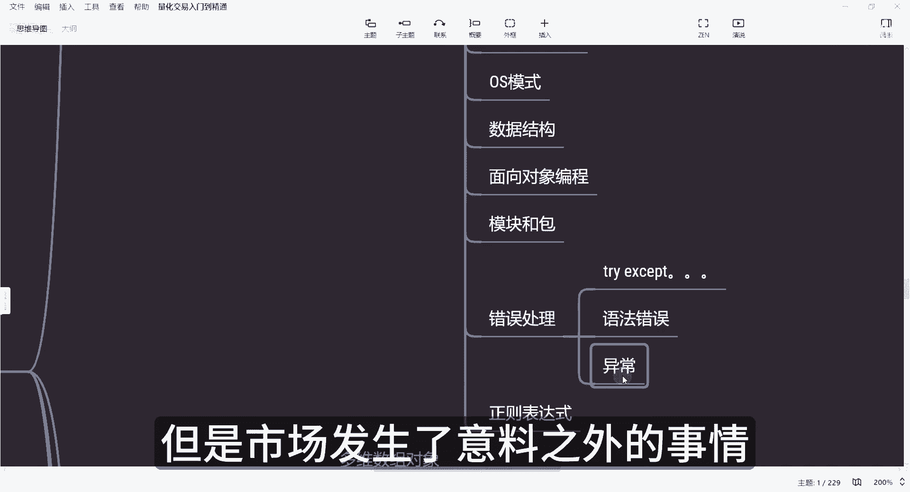
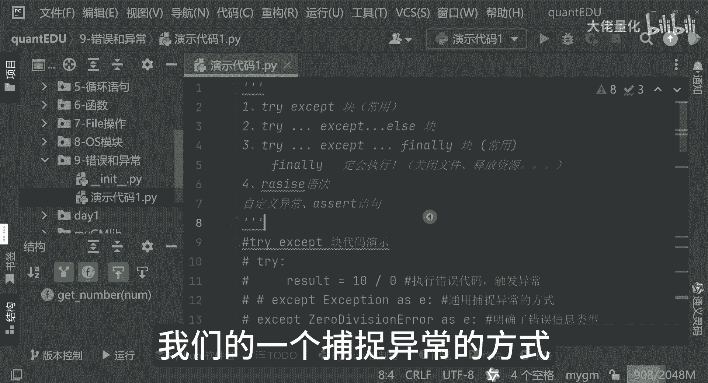

# 量化交易入门到精通43-python错误和异常 - P1 - 大佬量化 - BV1jq2MYCEsK

我是专注量化交易的速度，那今天我们来深入学习，Python的错误和异常处理机制，那对于我们编写健壮的程序是至关重要的，尤其在量化交易中，能够有效地处理错误和异常，这是至关重要的，那可以帮助我们避免损失。

提高策略的稳定性，那首先来讲呢，Python这边是主要有两个错误类型，一个是我们的语法错误，另一个是我们的一个异常，那语法错误是我们代码不符合Python的语法规则，那解释器是无法解析的。

就像我们写错了股票代码，而异常是代码语法正确，但是运行中发生错误，就像我们买了股票，但市场发生了意料之外的事情的时候。

首先呢我们照例，我们创建了我们的一个错误和异常的一个包，然后再创建了我们的一个演示代码，首先第一个看到的是我们的try exception，那这个也是我们非常常用的一个块。

那这里边有个exception的演示代码，大家可以看一下哈，我现在先把它先放开，把这先注掉好，我先运行，那这个代码来讲是我们是一个整数，然后那个除数为为零，那这里面会报错，除数为零啊。

那这个捕捉方式就是try exception as，那这种语法，那相当于是说这种语法是我们通用的，捕捉异常的方式，另外一种写法就是我们这种写法，那这里边我已经明确了，知道说这种写法会触发我这个。

除数为零的一个报错，那我们可以执行一下来看，那执行完之后发现哦，除数为零，其实看信息是一样的，我可以先把这个try exception先给它注释掉，第二个就是我们可以看到除了我们的try except。

还有我们的try except，EXELSE这种块的方式，另外来讲还有我们的try except，finally哈，这种也是非常非常常用，finally就最终的嘛，那这个就是我们的一个示例的一个代码。

大家可以看到，那我们继续与这种零除数为零的一个方式，例子哈，那这里面用这种方式一定会报错的，并且处罚我们的异常，那我们现在执行的时候，看到这里边说除数不能为零。

那错误信息是这个叫dervision by zero是吧，那这样的一个提示报错信息，那这里边你会发现这个到了exception之后，后面的它还会有一句话叫程序结束，那好。

那我们现在如果是说把他这个正常的10÷2，这个就不会触发我们除数不能为零的，这样的一个异常报错，那我现在执行执行的时候发现啊，这里边只告诉说我程序结束了好，那我在程序的结尾，我现在可以加一下。

比如说我在这个位置加一下，程序正常结束了好，OK我现在执行一下，这里面告诉你程序结束了，程序正常结束了好我现在在这个位置，我把这个零分开好，O我们看一下日志啊，看到没有也是一样的。

所以说这里面不管怎么样，这行代码都会被执行的，就是25行，这个代码都会执行的，24行，这样代码也会被执行，那大家感觉到时候诶这种方式也没什么区别嘛，是吧好，那我们现在变成另外一种的一个形式。

那比如说我现在define这个MACCEPT，就相当于我自己定义了一个函数，我现在把它拿过来调好我们的格式好，那我这句话还在这里，我再次调用我这个my except，这里面我们看看会有什么效果。

你看我现在用零报错好，OK看下运行结果好，程序结束了不能为零是吧，但这里边我们有的时候不一定会用print，那可能我们在这边会有个return，那return内容是什么呢，return内容可能是这样子。

然后呢报错的时候哈，有exception的时候，我们就可能是报错了，这边我可能就不会执行这个，我可能是执行，比如说是这样的方式，return nn或者是return-1，有多种写法啊。

你比如说我们以这种方式来执行的时候，看看这句话还会不会再出现呢，好我们先执行一下，看到没有，这句话，程序正常结束了，就没有这句话了，这块可能稍微有点绕，这里边是什么意思呢，就是这种写法。

相当于是类似我们的一个中断函数，中断程序一样，就类似于这种写法一样，那相当于是说我抛了一长，我已经报错了，那我就相当于是返回这边了，那我正常来讲，我如果没有报错的时候，我才会返回什么呢。

比如说我再加个return，我在这个位置上return return0吧，那在程序里面来讲，通常零是代表成功，然后那个一来讲，通常代表是失败，一般大家这么写无所谓啊，这是约定俗成的，就是你想用二负三。

你现在用A和B来表示都可以，甚至是用这个布尔值出false也都无所谓，好我现在执行的时候，大家可以看一下啊，这里面我执行完这句话之后，我现在可以把它的值再次捕捉到ES，我现在等于把它打印一下。

然后是程序执行后的返回值，我们先执行一下啊，大家看一下啊，这是程序执行后的返回值为零是吧，值为零，那这里边呢你看程序结束，同时呢告诉我们说程序是不能被零整除的，这是我们的一个写法。

那这个呢就是我们的try exception，Finally，那finally来讲一定会被执行的，就这句话，finally这部分一定会支，那这个就是非常重要的，我们的try except。

还有finally，那再往下可以看一下raise，瑞子语法来讲呢，以及我们的自定义异常，还有third，那RASE语法来讲，是我们主动的把我们的异常给抛出来了，我先把这先注释掉，大家可以看一下。

这个就是我们的一个raise语法，那这里面呢我们定义了一个函数来get n，传入的参数是AYM啊，Nm，那这里面呢首先它会打印我们输入的参数，会判断NM是否小于零，如果小于零呢，这里面会调用RASE。

那这里面又告诉说value r告诉你的值是错误的，那这里边呢把我们的自定义内容，输入的值是必须大于零，这句话给返回回来，return回去相当于是抛出来，那再往下来，如果是说他是不小于零的。

那么可能是大于等于零嘛，else嘛，if else这种方式，那这里面有也会返回回来，那这里边呢我们先传入的值为一，那这里边打印一下，返回值是什么，好看看有没有捕捉到异常，我们先运行。

大家会看到这里面告诉你说，我们输入的内容为一，也就是36行所显示的那自定义的输入内容，输入内容是必须大于零的，那明显就是不符合我们的要求，那这个就是我们的一个rise，这种方式，今天来讲。

就是介绍了我们的一个捕捉异常的方式。

这种异常方式是非常非常重要的，熟练掌握这些技巧，可以帮助我们写的程序更健壮更可靠，那尤其在我们的量化交易中，能够更有效地处理异常和错误，对于风险控制和策略稳定性是至关重要的。

希望今天的讲解对大家有所帮助。

谢谢大家。

