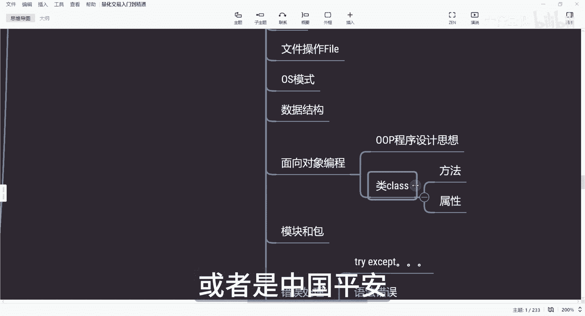
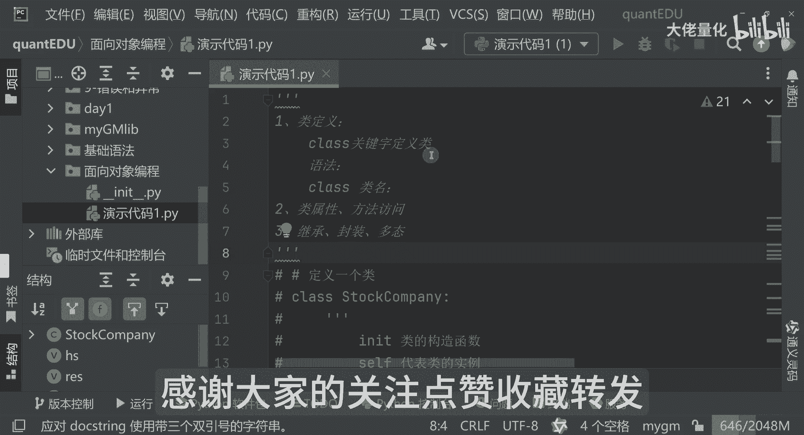

# 量化交易入门到精通44-python面向对象编程 - P1 - 大佬量化 - BV1cG2CYmE2Z

大家好，我是专注量化交易的速度，那我们上节课学习到了错误处理，那本节课我和大家分享一下面向对象编程，如何利用Python进行面向对象编程，用它构建我们自己的一个量化交易系统。

那很多朋友在刚接触量化的时候，一听到面向对象编程就头大，觉得这东西太高深了，只有那些科班出身的程序员才能玩得转，但我想说的是，Python面向对象编程呢并没有那么难，只要你理解了它的基本概念。

那么你就能用它来搭建一个更灵活，更便于维护的一个量化系统，我这边可以简单的描述一下，其实面向对象我们一般说是OP，那OP面向对象编程就是程序的一种设计思想，他是把数据和操作数据的函数封装在一起。

形成一个类类，就像我们一个模板一样，叫做类叫class，我们可以用它创建多个，具有相同属性和方法的对象，那类了，很重要一点，就是我们的一个方法属性，这是很重要的组成，假如我们要呃研究A股所有的上市公司。

那我们可以把每家上市公司看作一个对象，每个对象都有一个共同的属性哈，那比如说公司名称啊，股票代码，市盈率啊等等，那每个对象也有一些共同的方法，那比如说如何计算它的市值，如何计算它的净利润增长。

我们可以用Python来定义上市公司的一个类，那把这些共同的属性和方法，都封装到这一个类里面去啊，那我们就可以用这个类来创建，多个上市公司的对象，那比如说我们的贵州茅台，或者是中国平安对象等等等。

那好那现在再回到我们的代码中来，新建一个软件包，那第十个知识点就是我们的一个面向对象，编程了，我们再新建一个Python文件，是一个演示代码，一好，我现在把我的注释写先写好。

那首先我们要学习如何定义一个类，在python3中我们是用一个关键字，就是class，这是个关键字来定义类啊，那它的语法形式语相当于是这样的一个class，类名在下面是我们的一个表达式。

这里边呢写一个事例代码定义一个类，那比如说我现在定一个stock company，这是一个股票公司哈，我再定义一下这DEF来讲，我innit一下，这里边就是我们的初始化，这是我们的一个叫做股票名称。

这是我们的股票代码，那这里边还可以用self点price price，那等于多少呢，那贵州茅台啊，我等于2000元好不好，那这里边是这样的，这我现在就定义了我们的一个股票的名称，代码不对。

这里面应该是这样的，是price是传入的值，我们现在定义了一个一类了，这里边我再解释一下innate，这个innate它是类的一个构造函数，那这里边什么叫构造函数，大家听到肯定是比较陌生这个词。

那构造来讲，它会在创建类的时候是自动调用的，就像初始化一样，Initialize，这是个构造函数，另外来讲，这里边可以看到一个叫self，那self是干嘛呢，这里边是代表类的实例。

那这里边它也就是创建的对象，这里边可以看到参数除了cf以外，name stock这些其实我们叫做类的属性，那他类的属性来讲，其实就是用来描述对象的一个特征，你是描述你个类是干嘛的，这类里面是有什么价值。

那这里面就是定义我们一个类，那好那我们再看下一步就是要创建我们的对象，那定义好我们的类，那我们如何创建我们的对象呢，那这里边来讲，我们以这个为例，比如说name股票名称，就是我们的华泰证券。

股票代码什么60000，那价格是12块五毛钱，那这里边呢我们现在把这个类stock company，定义的一个创建对象，用HS来进行接收，那这里边我们可以看到HS点name。

那同时来讲我可以把其他的都打印出来，is s大点，stock h s点price，那我们现在执行一下，看看好，看到了，这边就是华泰证券，它的股票代码以及它的价格，其实这个创建对象也叫实例化，实例化。

那相当于是什么呢，上面是我们的定义一个类，这是定义他的一个模板一样，他的模板他有什么东西，那下面来讲，相当于是我把这个模板我传入了实际的一个值，华泰证券，我还是贵州茅台，你比如说我现在我把这个值哈。

我不用华泰证券，我传入贵州茅台，其实也是一样的，那好，那我们再往下来看一下我们的一个访问属性，我们该怎么做，那其实就是我们的h s name，这些叫做访问属性，我把这粘过来。

这个呢就是我们的一个访问属性，那这再往下来还有我们的一个类的方法，我们在类里边是可以定义一个类的方法好，那我们这里边那该怎么做，那这里边class stock company这边来讲。

INITINIT是我们的类的一个构造函数，cf代表我们的实力，这些就是我们的属性好，那这里边我现在又定义了一个类，可以看到这里面有get stock info，这和上面是不一样的。

我可以把上面那些分布我都可以注释掉，我只要这一个类在这里面来讲，这个叫defining，这个就是我们类中定E的方法，我我可以用说get stock和info，但是我可以这么写，Add，我传一个X。

我传一个Y，我这里面还要有关键字啊，就和外面定义不太一样，这里面有个sf，那我现在return一下，我是X加Y好，这是获取个加法的一个值，这边是可以获取到我们传入的相关的内容，我们现在再把它实例一下好。

那我现在还用我的华泰证券吗，我现在HS点，那这里边有price，有name，然后有stock code，有get stock info，那大家可以看一下，可以看后面啊。

这里边看见没有stock company，也就是这几个位置上，他其实都是类class本身的，那再往下就可以看到object，这就是其他的了，我们只看这一块，那现在就HS点price，HS点内有HS点。

stock code都可以直接访问的啊，那我现在S点get stock info，我们看这里面会有什么，我们看到他是个返回值，return回来的，现在再加个r e s result。

那我们现在把我们的返回值打印出来，那IES我们现在返回的是什么呢，这里边就是说获取到的股票信息，V好打印一下啊，这里面可以看到了，那获取到的股票信息为股票名称，华泰证券代码是0000，价格是12块五。

这个方法就调用的是我们类中stock company，这类中的get stock info，这个获取股票信息的也就是这块，那我们现在调用一个有参数的ADD，你比如说我现在HSI的。

但这里面不同点在于说我要把这个值传进来啊，就是X我等于10IA呢，哦我等于20，那这里边我就不用一和二了，我现在就用XY好吧，那这里面我在调用这个类里边的，一个属性和方法的时候。

我同时把两个参数传进来了，那好我把它在加个占位符号，就是Y就是X好吧，我们现在打印一下啊，这告诉你说10+20，结果为30，这个就是我们的类的方法，这里边我们刚才看了这么多类的定义，类的属性方法访问。

其实类的还有一个很重要的概念，就是继承封装，其实面向对象里面的继承封装咳多肽，这些呢是面向对象的一个非常重要的三个要素，然后你会发现看到一些项目的时候，有很多都是用一些类的方式。

本视频我们了解到Python的面向对象的一，个基本概念，并结合和我们A股的一个实际案例，演示了如何用它来创建一个简单的氧化的程序，那当然这是个非常基础的一个案例啊，那实际量化交易系统会更加复杂。

但我们希望通过一些案例呢，能让大家感受到面向对象的一个魅力，对量化交易是感兴趣的朋友们，或者想学习更多的关于Python，对面向对象的一个编程知识，欢迎大家评论区留言，可以私信和我沟通，感谢大家的关注。

点赞收藏转发，我们下期再见。

