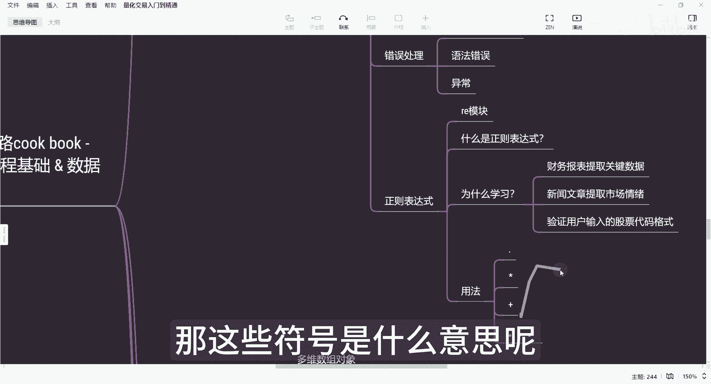
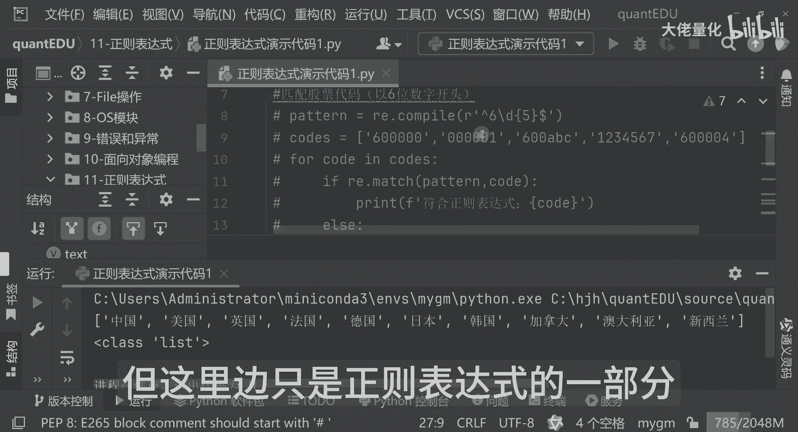
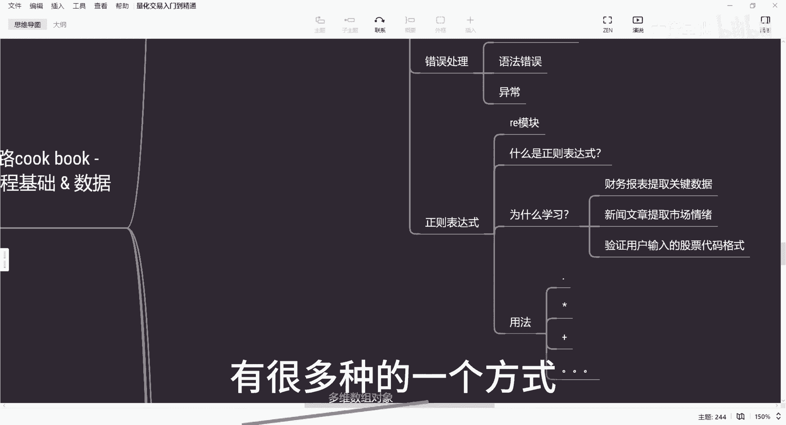
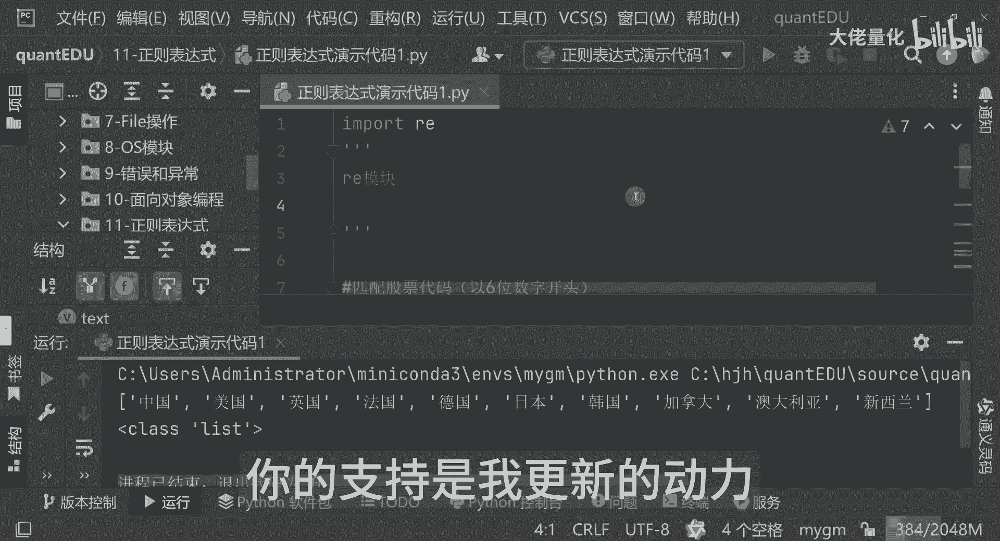

# 量化交易入门到精通45-python正则表达式 - P1 - 大佬量化 - BV1zL2RY5ECQ

大家好，我是专注量化交易的速度，今天我们来学习一个数据处理和文本分析，非常强大的一个工具啊，就叫做正则表达式，什么是正则表达式呢，那正则表达式就像一个精密的一个过滤器一样。

可以帮助我们从大量的文本数据中，提取我们想要的信息，很多人觉得正则表达式是看起来是很复杂的，但实质上他也是比较复杂的，难以理解，但只要掌握了它的基本规则和常用技巧，我们就可以轻松的驾驭它。

那今天我们就由浅入深，逐步的学习正则表达式的用法，那结合Python这个IE模块进行我们的实战演练，那首先来讲我们要知道一个概念，什么是正则表达式，那正则表达式其实是一种。

描述我们文本的模式的特殊字符串，可以用来匹配查找替换，甚至说我们的分割文本可以用正则表达式，为什么要学习我们的一个正则表达式呢，在我们的量化交易中啊，我们经常处理大量的文本信息啊。

比如说我们的一个财务报表中，提取我们的关键数据，那这时候你就需要正则表达式，那另外新闻文章，然后提取市场情绪啊，那再或者说是验证用户输入的股票代码，格式等等等，有有很多种方式。

这就是为什么我们要学习正则表达式的原因啊，那正则表达式用法还是有很多种，比如说用法，那用法就是很多，你比如说这种点号，然后或者是用星号啊，或者这种加号等等等，有很多种，那一会儿我也会为大家演示一下。

那这里面看起来就是很迷糊了，那这些符号是什么意思呢。

那我们今天就开始我的第11个，先创建我们的一个包，就是正则表达式，好，我们再创建一个演示代码，正则表达式演示代码一好，那首先呢我们写一下这个注释，那正则表达式呢就是RE，我们用的是一个RE模块。

那这里边有很多种方法，那我们现在就是直奔主题，直接把我们的非常重要的一个IE模块，import导入进来，那首先呢我们可以看一下实战案例，比如说第一个匹配股票代码以六开头好，OK我们可以看一下哈。

那比如说哈，那这样呢就是我们的一个股票代码表达式哈，我现在用用这种非常简单的方式，那我先定义了我们要以六开头的啊，并且是五位数字的好，我们现在就已经是用RE来定义了，我们一个正则表达式。

那接下来就是我们把我们的一个测试数据，比如说cos，那我们定义一个列表，后面是有很多的票代码，那我们这里边随机写一下哈，比如说我写零开头的，那另外来讲呢我这块写成比如说ABC的。

那这样来讲我可以随便写个1234567的，后面的我保留到这儿就可以了，那接下来我用我们的一个for循环，前面学的for循环啊，比如for cos，那我现在第一步我们要匹配一下，再打印我们的code。

那如果是说我们匹配到的并且满足的话，那这里边会打印，稍等我这里再加个日志code到这边来，然后呢是符合正则表达式好，那如果是不符合，那我现在else下这里边，我把它再打印出来，是不符合的。

那好那我们现在定义完我们的一个正则表达式，那把我们的数据传进来，那用for in循环的方式来进行一个调用IE的match，然后进行一个匹配，然后把我们的参数扣的逐行的可以传入进来，如果符合的话。

就可以打印符合正则表达式，如果不符合的话，就打印出我们的不符合的股票好，那我们现在点击右键进行运行，那这里面可以看到，首先我们可以对照上面数据，上面是说600是符合的，001是不符合的。

600ABC是不符合的，1234567是不符合的，6004是符合的，那这个就是一个非常简单的匹配我们股票，然后并且是以六开头的这样的一个，演示的实战代码，那其实这里边，你比如说我如果是只想取零开头的。

那也是一样的，这种方式来讲，除了校验我们的股票代码，可以校验我们的邮箱，叫我们的手机号码，多种方式是都可以的，那我把这部分代码先注释掉，我们可以看下一个案例，是我们的提取日期的代码。

那我们看一下我们这个代码该是如何的，那我现在传入的日期，我我我不这么写了，这么写太简单了，写个test test来讲，在这边我写今天的日期是，比如多少号，就是这个我要我把它这样子我加个横线。

我要和它完全匹配嘛，今天日期是这个是明天的日期，是我再把它拿过来，星期四把它拿过来是零，再加个横线好，我们现在运行一下，看一下效果，我先打印一下，print一下，那我们现在是提取的日期是什么。

那比如说是这样的好，那我们现在打印一下，那提取到日期这里面就可以看到说，那我符合是四位数字的啊，那我加横线两位数字的，加横线两位数字的这种方式来讲，你会发现他就是把这个日期提取出来的啊，不对。

今天是9号，这回应该是10号，我再执行一次，看这个日志，这里边他就把2024年的10月9号和，2024年的10月10号这两个值就提取出来了，那这个就是我们提取日期的一个演示，那好我现在先把它注释一下。

好的那我们刚才看了我们的演示，如何提取日期啊，接下来我们可以看一下，那就是我们一个替换字符串演示，那如何替换我们的字符串呢，我们可以看一下，你比如说我们就不叫这句话了，我们叫另外一句话。

我们叫做这个报告，显示公司上季度营收为1000万元，我现在也不用这个符号，我用咱们的中文呢，那这里边我们现在就可以用这种方式，比如RES点sub，那这边可以看一下，你比如说我们这种形式。

那现在把我们的括号把它括起来，这是万元，这边来讲，我们把它替换成这个数，比如说替换成11234元，我们把这个值接收一下，应该正则表达式处理之后，它会变成一个新的一个值，我们叫做new test。

那我现在打印一下它的值，New test，看一下我们替换之后会有什么效果啊，我先输出不对，这个应该是这样的啊，1万元，我假设啊，就这样子吧，那好那我原来是1万元，那我现在通配完之后。

这里面会变成了报告显示上季度营收为1万元，这里面就是我们一个字符串的替换，这个就是我们替换字符串的一个演示，好我们看下一个演示，就是我们的一个分割字符串演示代码，分割字符串的演示代码是干什么的。

你比如说我现在有这么多国家，那现在我把它分割一下，我按什么来分割，这里面这么多国家，我是按竖线来进行排的，那我现在我想把它分割一下好，我现在运行，你会发现这里面都被替换成了我们的验证方式。

并且他适应的是一个list的话，我们现在可以看一下tap，把它再复制一行，那我现在用tap加括号，现在运行好看，这里设个例子的，我们这里边如果不用这种方式，比如说用逗号的方式也可以，这边连续做些修改。

这是我们几个演示，但这里边只是正则表达式的一部分。

其实正则表达式有很多种方式，我刚才在脑图中写的有很多种的一个方式。

大家可以到后期的时候，也有一些专门的在线网站也可以进行查询啊，甚至说正则表达式可以自动生成的，这个大家不用担心，因为它的语法也确实是比较复杂一些，虽然对初学者看起来是比较复杂，但是非常值得学习。

它可以大幅度提高你的处理文本数据的效率，希望今天的讲解对大家有所帮助，那也欢迎朋友们点赞关注收藏，你的支持是我更新的动力。

谢谢大家。

