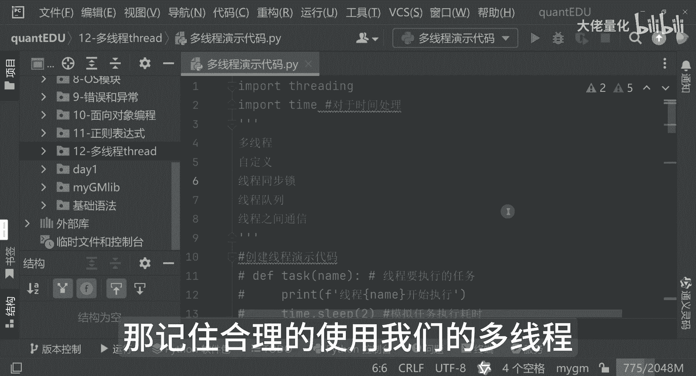
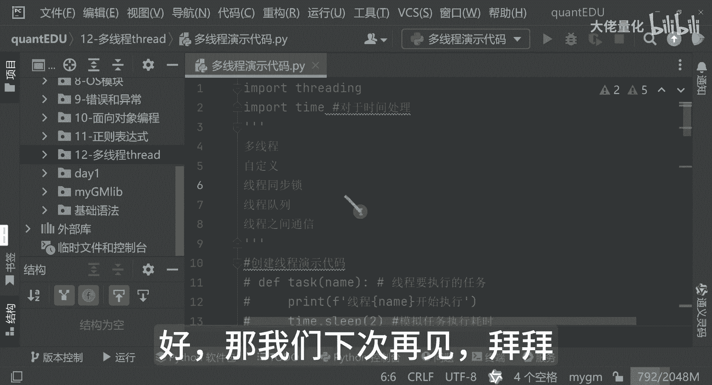

# 量化交易入门到精通46-python多线程 - P1 - 大佬量化 - BV1A52iYAEvo

大家好，我是专注量化交易的速度，今天和大家分享的一个知识是非常重要的，就是我们的多线程，那多线程来讲，这个是在任何语言里没都是非常重要的，就像我们windows电脑，为什么同时我可以打开x man的。

我同时可以打开排插，又可以听歌，我又可以看电影，我又可以聊微信，那这个呢就是我们的电脑里边进行一个多线程，多进程这两个概念，那Python来讲，那一个进程可以有多个线程，是这样的一个概念。

在量化交易过程中建成是一个非常重要的工具，能够帮助我们高效率地处理数据和执行策略啊，你想象一下，如果同一时间下载多个股票的历史数据，或者同时运行多个策略回测，那如果用单线程，那就一个一个来。

那效率是非常低下的，那多线程来讲是能够帮助我们解决这个问题，让这些任务是并行处理，这是大大节省我们的时间，Python呢是提供了两种多线程的实现方式，那么这里边我简单写一下，一个是thread。

还有一个是THRIDING，那这种thread的方式是比较底层的，那官方来讲是不推荐的，那threading呢就是我要和大家分享的这个threading，也是一个功能强大，并且对用户是更加友好的。

那话不多说，接下来在我们的排插里边，创建一个Python的一个软件包package，那就是看一下我们的一个多线程，那这里边呢现在再新建一个Python文件，多线程演示代码好，那首先我们看一下多线程。

我们刚才在脑图中也看到了，需要用到这个THRIDING，那么现在就把它引入进来，Import thriding，这个在写代码的时候，尽量是用复制粘贴，或者是用IDE里面功能手敲，真的是有可能是出错。

那好看一下，第一个演示就是创建线程演示代码，首先我们define一个task，那task来讲呢，我们是作为一个一个方法，那这里边是有一个name的，是作为一个线程要执行的任务。

这里边job task都可以，我们先打印一下，这里边是线程name要开始执行，那这里边再加入另外一个包，Import time，这个time是非常有用的一个包，主要是对于时间的处理包。

然后下面如果是调用这个包的时候，你会打印一下，这里边可以加一个，因为是多线程，所以说这里面调用一个time点sleep好吧，Sleep，所以大家可以看到参数，它是个float类型。

那这里边实际上是一个模拟任务执行耗时，然后紧接着在这里边再打印一下这个任务，也就是这个线程已经执行完毕了，那下面就是真正的调用我们的这个任务了，调用我们的THRIDING点thread。

可以看到那这里边就是我们的一个target，指上就是这个方法，task l js来讲，实际上是我们的参数，其实就是我们传入的name的值，我们这里边叫做线程一。

那下面来讲是我们的一个start start来讲，才能执行我们的线程，那我现在执行一下好，这里面看到线程一执行好，紧接着两秒后线程一执行完毕，那我现在我再把它复制一行，这里边呢不叫线程一了，我叫线程二。

我们现在这样子啊，我不在这里start了，我把这个值它创建完这个线程之后，我在这边用thread1线程一，那我再把我们的线程二返回值放在这里，那我现在这种写法drive一点start，现在12。

2点start，相当于是把两个线程同时启动了，那这里边我在线程Y啊，我再加上一句话叫做主线程执行完毕，那好那我现在运行，大家看一下这个终端里面会有什么效果好，大家看到一个很神奇的现象啊。

这里边啊大家看一下线程一开始执行，线程二开始执行没问题，那紧接着就是主线程执行完毕，大家发现一个问题，那这里面就相当于是说我执行完了线程一，执行完了线程二，然后然后主线程我就结束了。

然后这里边的sleep两秒之后的时候，因为有模拟任务执行，耗时长好，他sleep之后，这里面才会显示这个线程一执行完毕，线程二执行完毕，对不对，这里边呢就是一个线程的一个时序，那其实线程呢它运行的时候。

它的时间先后顺序，有的时候是不确定谁先执行还是谁后执行的，因为我们这里面很少就只有两个线程，如果线程特别多的时候，他就不一定是谁先执行，谁后执行，那并且来讲我真正处理的时候也不是sleep。

就把它固定两秒对吧，比如说我解析一个大文件，处理一个大的任务，处理一个大的一个股票数据，处理一个大的计算指标的时候，他可能用耗时会更长一些，你比如用一些非常简单的计算方法的时候，那它耗时是非常短的。

所以这里边的先后顺序是不确定的，它是并行的，就像高速公路上车一样，那这个就是我们对多线程的一个最初的印象，那我们接下来再看线程，还可以用另外一种方式，那就是说自定义线程类演示代码。

这是我们的自定义线程类的演示代码，那可以看一下，那这里面就是my thride riding点thread，那这里边它是一个name，然后这里边上节课已经学过了，这是它的一个构造方法。

这里边是它的参数name和N，然后这里边会有一个run的方法，那相当于是说我执行的时候就会执行，说某个线程开始执行了，然后某个线程结束了，那我们下面开始真正的调用一下，我们看一下会有什么效果哈。

我们就直接调my thread，因为它是一个类啊，现在直接用这种方式来触发它，那同时呢把这个name和name传进来，我就直接点start了，我就不分着写，那我们现在看一下效果是怎么样的。

好线程一开始是线程一，这个执行完毕是吧，那这个就是和上面的代码功能是比较类似的，这个就是这种方式好，那我现在把它写一个线程二，那线程二来讲，我不是sleep两秒了，我sleep比如说一秒。

一个是sleep两秒，一个是sleep暂停一秒，模拟他们的处理效率，那我现在执行的时候，大家看一下日志，看这里边可以看到在线程一开始，线程二开始，线程二执行完毕，线程一结束。

那这里边因为我们传入的值线程一是两秒的，那线程二是一秒的，所以说线程二先执行完毕也是正常的，那同样现在把我们刚才这个主线程的一个日志，加入进来，那我们现在再看一下效果，你看这里边的线程一开始。

线程二开始，主线程直接输完毕，然后线程二完毕，线程一完毕，这个其实和上面代码就非常类似了，这个呢就是我自定义的线程类的一个演示代码，那好我们还要再看另外一个代码，我给大家say注意下啊，可以再看下一个。

就是我们的线程同步的代码演示，那我们这个是怎么做的哈，比如说创建的锁，这里面有个锁对象，创建一个锁，这个也是我们第一次听过什么是锁呢，那其实大家举这个线程的时候就会用这个啊，比如公共厕所分为男厕所。

女厕所，每个厕所里边他的一个坑位是有限的，大家都想上，那每个门里边那肯定是说我进去了，我要上锁，那别人就只能在外边等待，那其实线程锁也是类似这种概念啊，相当于是把这个线程lock给锁住一样。

那这里边呢我再可以定一个，比如说counter，这个是作为一个计数器，那紧接着再定一个方法，比如说是叫这个名字吧，我传入的参数就是name，那这里边我再把这个counter，这是个全局变量啊。

那我现在比如说我要循环执行这么多次啊，这是100万次，那这里边呢是用这个with lock的方式，那这种方法和我们的fire写法就很像，如果是我们不写这种，那lock的方式来讲。

正常我们的写法应该是这么写的，大家可以看一下，首先是lock点，lock点干嘛呢，这个相当于是我获取锁了，相当于是上锁了，把这个线程上锁了，那上锁之后，那下一步把我这个全局变量计数器，这里边上完锁之后。

我现在把它加一加，等于一嘛，现在执行完的时候再打印一下，这个是告诉你我当前的系数是多少，那再往下呢很重要的一点就是释放锁，那这里边就是我们创建锁对象的一个方法，那我们看如何调用，我先把这注释掉。

一会再演示，那这里边就是调用的这个方法，就是线程一和线程二这两种方式，那好那我现在用这个thread一点start叫start，然后SWIDER2点start就是启用我们的一个线程。

那相当于上半部分是创建我们的线程，然后就是启用我们的线程，那再往下来这个drawn是干嘛呢，这边我也加个注释，这里边其实就是等待线程执行完毕，这个就是我们的thread join，这个我再加个注释。

这里边是启动线程，我也加一个注释，创建线程，这一步呢是创建线程，这一步是启动的线程，这一步是等待我们的一个创意结束好，OK这里边我在结尾的时候我再打印一下啊，主线程执行完毕。

这里边我再把目前最后的一个值，这是counter，counter是一个全局的一个计数器，好，OK那我现在执行啊，大家可以看一下什么效果，很快的，这里面大家可以看到一个效果。

这里面事实上他是线程一和线程二，是反复的交替在执行的，看到没有，它是一个交替在执行的，这里面计数器呢它只是一直在变化的，你可以看一下，那主线程执行完之后，你会发现200万了，那为什么呢。

因为这里边我们定义的一个全局的变量计数器，并且我先上锁了，那这里边我相当于是说一个全局的变量，我有多个线程对这个变量同时进行操作，这里边写global这个counter，就是这个声明我们的一个全局变量。

这里每次循环的时候循环100次，每个线程里边循环100次，首先它会上锁，获取锁，紧接着它会释放锁，那并且每次执行的时候，他都把它计数器加一，那并且还会在程序运行的时候，它会打印当前更新了多少次啊。

我们现在看一下他当时的日志哈，上面是这样的，大家看到没有，这里面其实它的线程是交替在执行的，它可不是一个线程，刚刚我不是说了，还有个with lock吗，那我现在可以把这一步给它先注释掉。

我现在把它释放出来，这里边你会发现我们少少了获取锁的，上锁的这一步，也少了我们这个lock release释放锁的这一步，解锁这一步，那我们现在打印的内容是一模一样的，就是print好，我现在执行。

大家看一下啊，你看这里边好线程一，线程二，这个线程执行起来是非常快的，这个事实上是取决于我们的一个CPU的一个能力，你的线程越多的时候，你会发现你的CPU你会发现看到没有，这里边CPU占有率是非常高的。

你看CPU执行完之后，刚开始都已经达到差不多百分之百，90%多，现在执行完之后立马就降下来了，这就是多线程的威力啊，这是为什么快嘛，当然了，还启用了GPU，看到没有。

刚才他一瞬间其实也也把GPU给拉起来了，当然我的GPU是两个，一个是集成的，一个是英伟达的一个独立显卡，他刚才他只是拉了一个集成的显卡，集成的GPU啊，那好就这两种方式一模一样，大家呢用哪种方式都可以。

只是说从人的理解上来讲，这种方式是阅读更加好理解的，就是44~47，而4~50这种方式来讲，就是说相当解放双手，哪种方式都是没问题的啊，那这种lock这种方式是确保了同一时间。

只有一个线程是可以访问我们的共享资源，counter的，避免了数据的一个竞争，好我先把这部分也注释掉，因为多线程这种内容来讲，是在任何一个编程语言里边都是比较高级，也都是比较相对复杂一点点的技术。

一般也都是嗯比较高阶的一个程序啊，才能驾驭了一个多线程好，那我们刚才看到了多线程，也看到了我们的自定义的一个线程演示，还有这个线程同步锁这种方式，那其实还有很多，比如说线程队列，线程之间的通讯。

这些都是比较高级的技术啊，如果后面有机有机会的话，我会和大家慢慢的来进行展示，那希望今天讲解的内容，是能够帮助大家更好的理解Python的一个多线程哈，那记住合理的使用我们的多线程。

可以显著提升的一个程序的效率，但是也要注意线程安全和同步问题好。

那我们下次再见，拜拜。

