# 量化交易入门到精通47-python处理json数据 - P1 - 大佬量化 - BV12DmgYvETD

大家好，我是专注量化的速度，今天我们来聊一聊Python中的JSON数据处理啊，那JSON数据处理呢，这是我们量化交易中非常重要的一个技能，在我们量化交易中，我们经常需要处理各种数据，比如股票行情。

财务报表，交易数据等，那这些数据很多时候，他们都是以JASON的格式存储和传输的，所以说呢我们学会如何用Python处理JSON数据，对我们进行量化分析和策略开发是至关重要的，那JASON是什么哈。

J它是一个缩写吧，它实际上是JavaScript object notation，是这样的一个缩写，它是一个轻量化的一个数据交换格式，主要易于我们人的阅读和编写，也是易于机器的解析和生成。

那在Python中呢，我们可以使用内置的JASON模块，来进行我们的JASON处理。

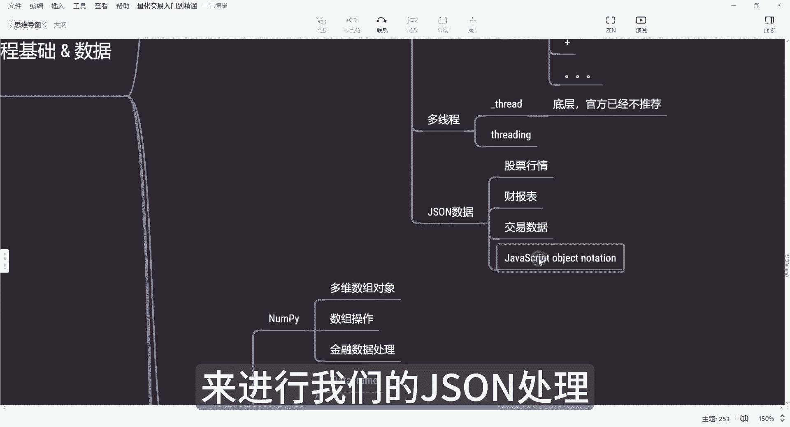

这里是有listen模块好，那我接下来看一下我们的代码，那今天就是我们的第13个啊。

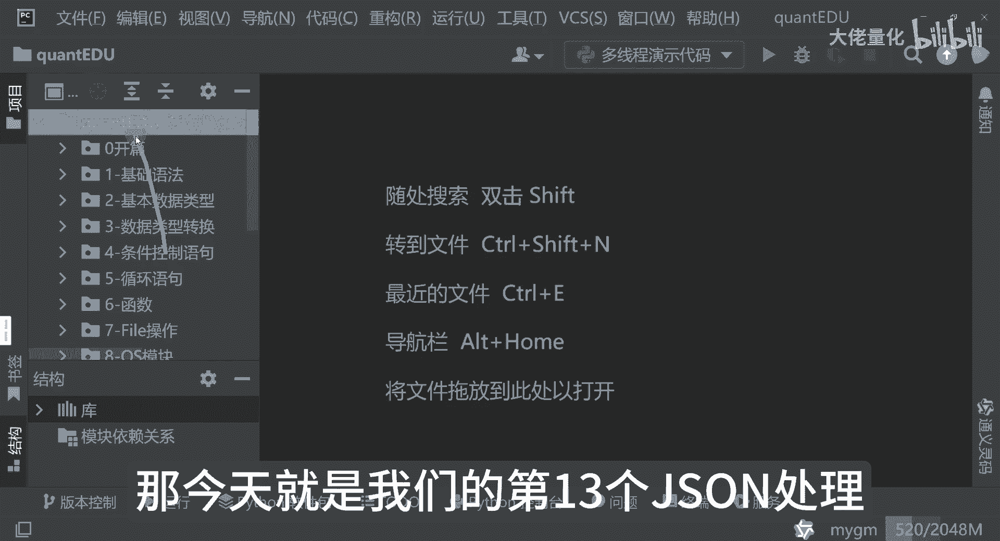

JASON处理，现在写一个JAON演示代码。

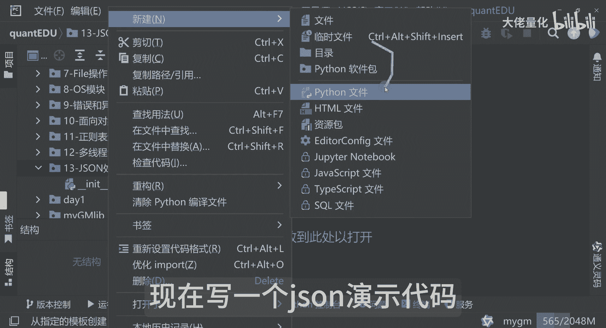

那首先Python中是有一些常用的操作方法啊，我们要了解几个概念，叫编码，编码其实就是我们的encoding，那在使用JASON包之前，我们引入import jason就这样一个包，那引入包之后。

那我们可以看一下，我们是通过Python中的jason dump，可以将我们Python对象转成我们的一个JSON字符串，现在已经导入到我们的JASON，然后定义我们一个data贝塔来讲。

比如说是这样的，那name比如说是贵州茅台，然后这里边扣的就是600519，那price比如说1800，那紧接着那我们该如何处理呢，那就是调用我们的JASON点dumps，这里边把我们的data传进来。

data传进来之后，这里边我们来接收它jason train，我们再输出一下我们的jason train，同时把我们的jason three的type输出进来。

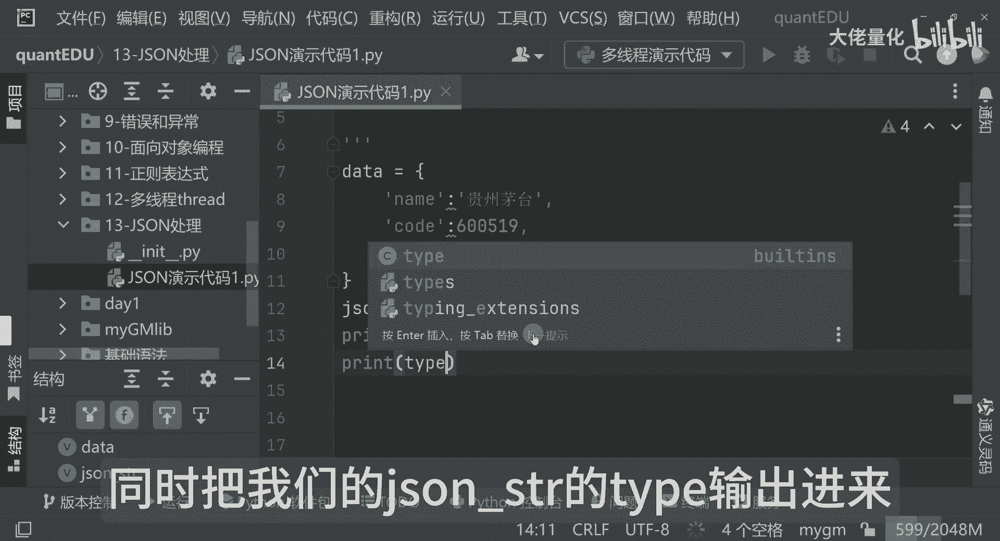

好看我们的终端这里边就可以看到name code price，然后这里边code price都可以看得懂，name来讲，大家现在就看不懂了。

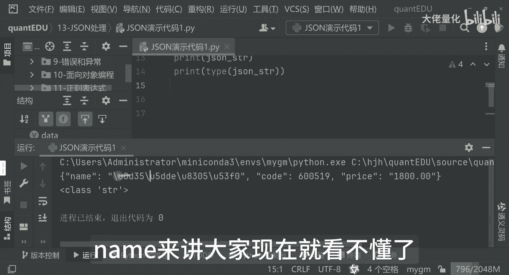

你会发现每个都是杠U开头的，所以这里面已经是把它encoding的，所以说这里边是看不出来的哈，那好再往下看，那我们也可以用另外一种方式加一些参数，让我们的代码更加方便读。

刚才用的是JSON down码，但实际上这里面还有一个参数。

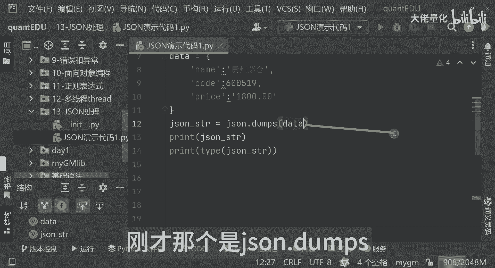

比如说我们先用四种方式先运行，好好，你发现这里面现在就变成这种方式，对不对，刚才看的时候不是这样，我把刚才的打印出来啊，我把这个去掉，等一下我在这边加个输出好，我先输出哈。

那这里面来讲它第一次输出的是这样的，对不对，那我现在用这种方式来讲，它这里面会给他自动换行，并且这里只有四个空格，是进行了一个格式化，那缩进之后你看起来会更加容易理解一些好。

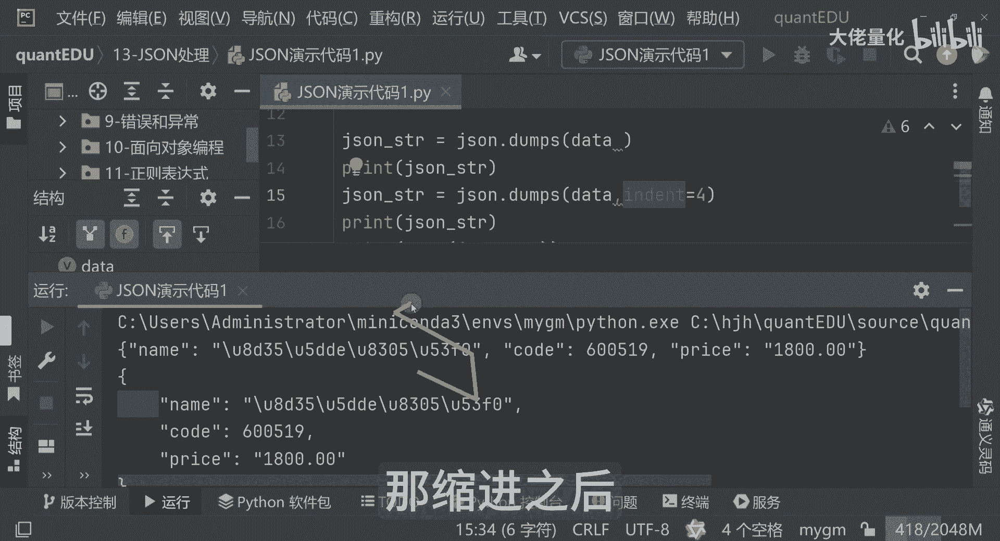

那这里就是可以看到我们的一个，encoding的演示代码，好decoding之后，我们接下来看另外一个代码，那就是说我们的一个解码就是一个decoding，好好。

那这里边我们会用这个jason load，把我们那个jason string给引入进来。

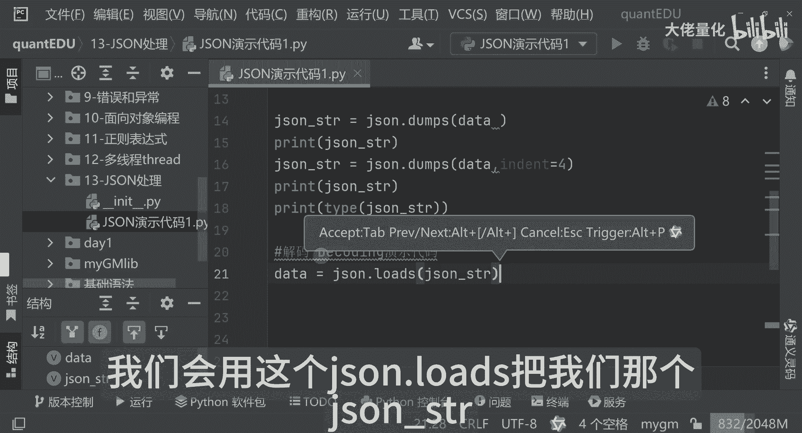

那我们现在打印一下，看是什么样的，那这里面看到他又回到了原来的样子哈，就是我们的贵州茅台了，现在这个就是解码后的一个内容了。

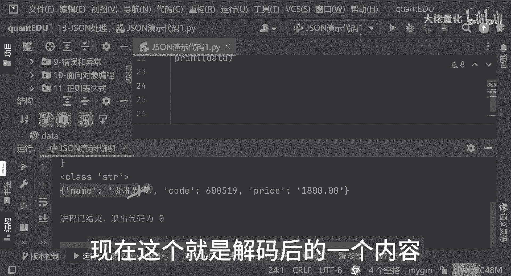

这个就是我们的编码和解码，然后再往下来讲就是一个写入文件的演示，那我们可以看一下哈，那比如说把我们的JSON文件把它写入进去，好看会什么效果，然后这里边我还是用这种方式，就是给他重新格式一下好。

OK现在就是在我们的JASON处理文件夹下面。

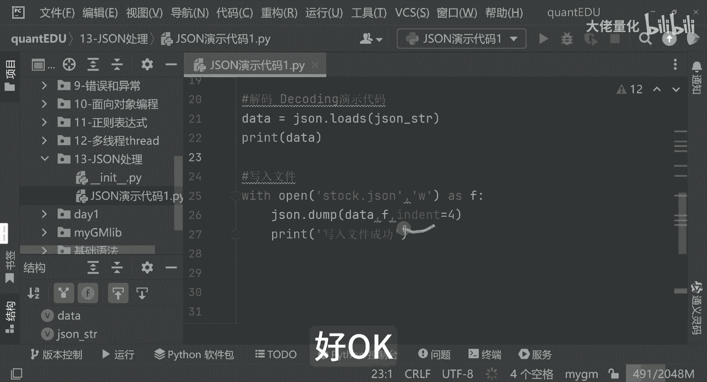

生成一个stock JSON文件，好。

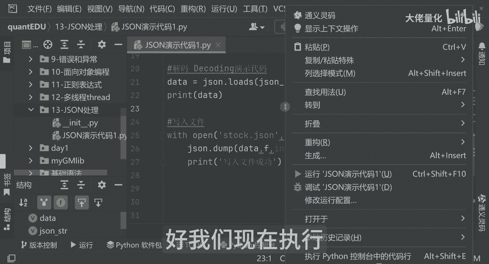

我们现在执行执行完了，文件写入成功了哈，那我们看一下有没有这个文件在这里stock jason，那么现在打开之后，可以看到是有这样的一个文件的，对吧好，那这里面来讲也是一样。

我把它去掉之后就是变成一行了，那这是我们写文件，那接下来可以看一下读取文件的一个演示，那读取文件该怎么读取呢，那实际上就是也是用with子的这种方式，那用R的方式写的时候，用W读的时候用R的方式。

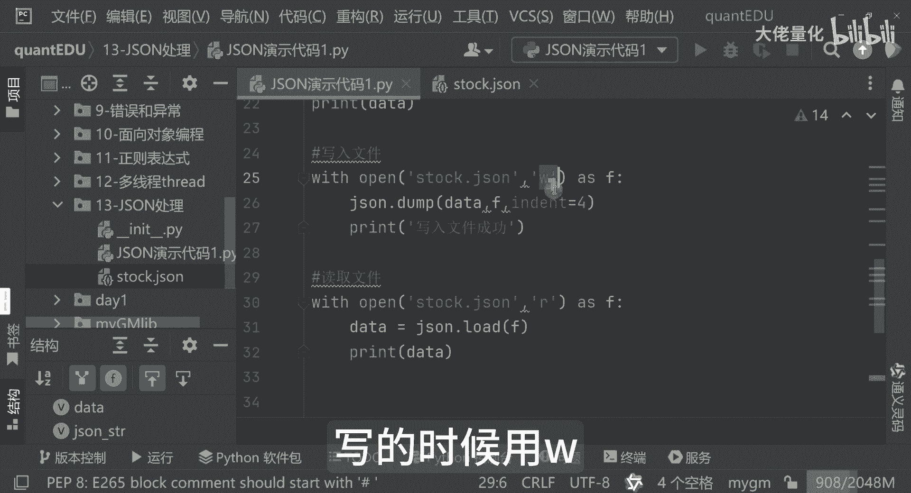

那这里jason load，等一下我再打印一下啊，这块来讲我再加个data，然后在这边是我们的读取JSON文件成功，数据为好，我们看一下哦不对，这是一定要用英文的。

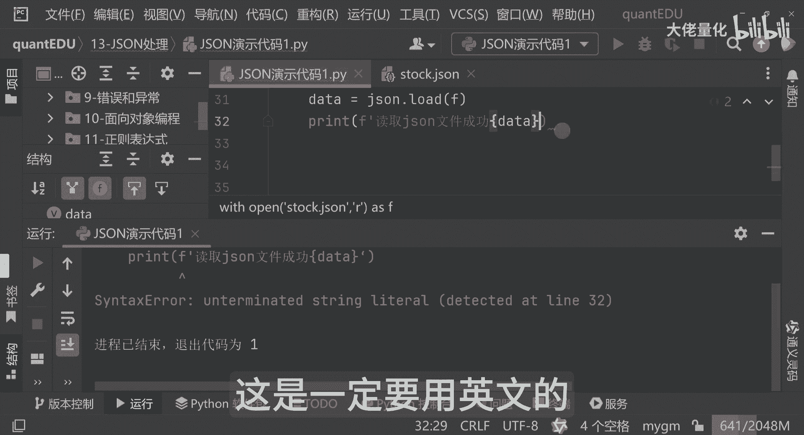

你看这就是读取的JSON文件成功，这里面就是贵中茅台，你看啊。

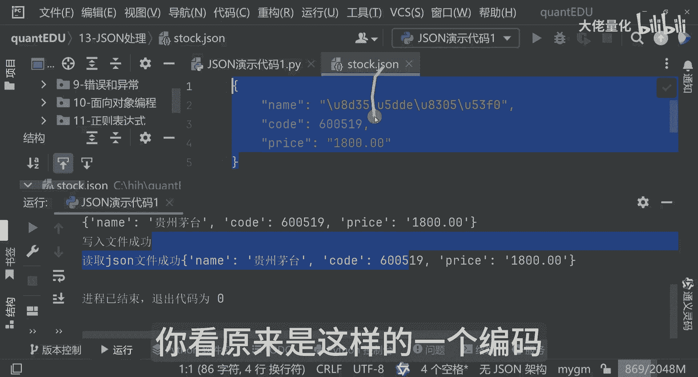

原来是这样的一个编码，这是编码后的encoding之后的，我们decoding，然解码之后呢就成这样子了。

这个就是我们对文件的一个处理，另外其实JASON它的数据格式很复杂的，那就是处理复杂类型的数据，JSON来讲是支持多种的数据格式的，我再写一下吧，持多种数据格式，例如列表，字典，元组集合等。

这边都是支持的，我们可以看一下演示代码，你可以看一下啊，比如像data来讲是这样的，可以看到这是我们贵州茅台啊，这是代码，这是价格，那同时还可以看到它历史的一个行情，假设2010年的时候。

他1月份的时候价格是这样的，那2月份的时候价格还是这个价格，就不太合理了哈，那我们可以改一下哈，比如说是这个价格到2号的时候是2000块，那这里面来讲数据格式已经定义完了。

那我把之前的代码先给他注释一下，为了避免干扰好，那这里边呢首先第一步可以用jason dump，这次down MAD之后呢，可以把我们的数据打印一下。

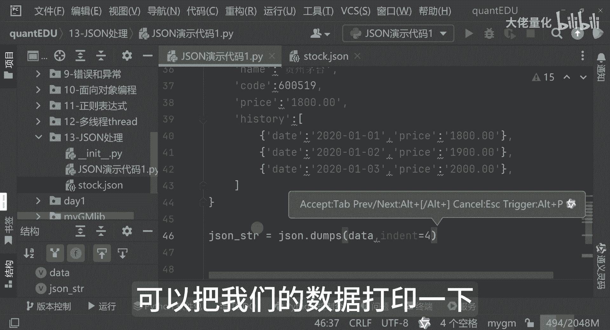

Print json string，看一下能不能打印出来哦，可以看到了，这里边已经编码好了。

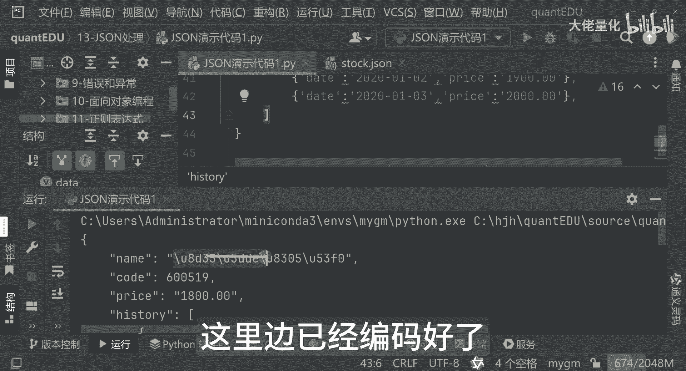

编码好的数据就可以在读取我们的一个数据哈，然后loads里边JSON string这里边把我们解码的数据，decode data等于哈，然后我再打印一下。

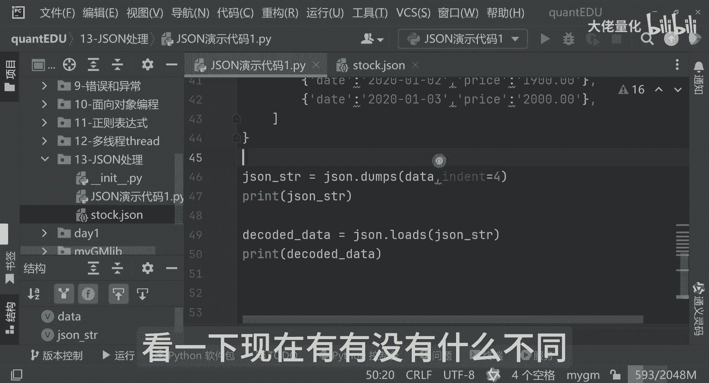

我们可以看一下，这里边他把这个值都打印出来了。

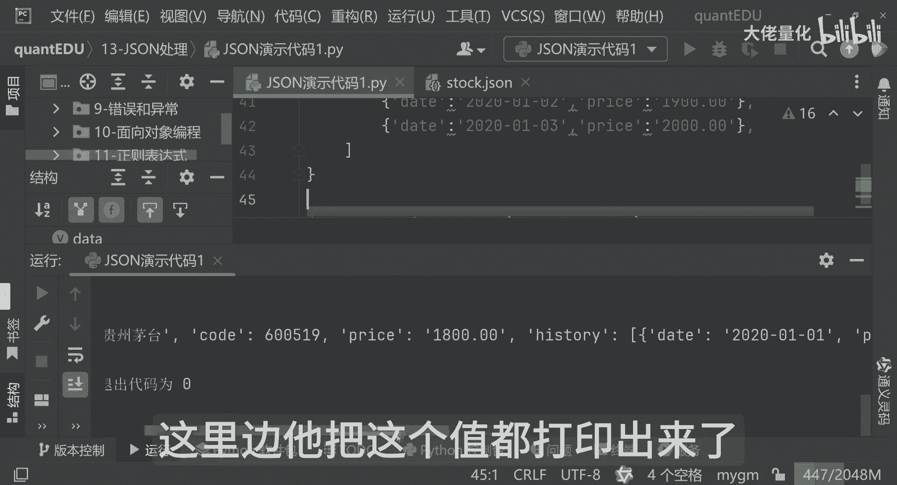

那我想获取里边的呃数据，我该如何获取呢，它的数据格式是这样的对吧，那我现在加一个分隔符号，那我现在呢我只想获取的一部分，就是我们的decoded data。

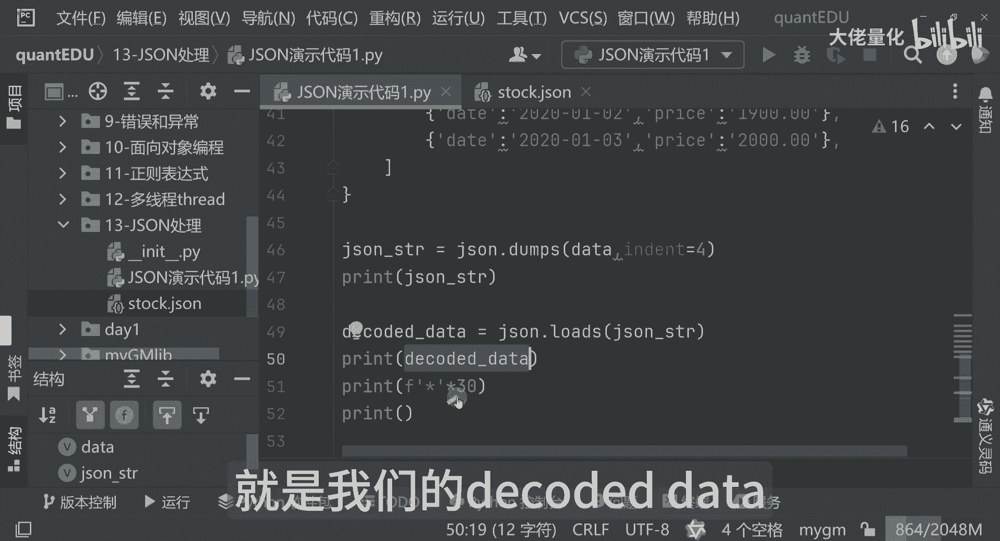

比如说我只想获取name好吧，我们看一下能不能获取到好，贵州茅台可以获取到了，对不对好，我现在不想获取name了，我现在想获取里边的，比如history，我现在拿过来好，OK我们看history人来讲。

反正有很多个，对不对，而且他这里面是一个list，那好那我想获取第一个的好，这里面看到了吧，这就是2022年，2020年1月1号的一个行情价格是吧，那这里面我只想获取当时的价格。

pose好我们看一下这里边就可以看到了，那我现在呢想获取它里边的一个日期，在上面我直接拿过来，我这里边就不是获取的price了，我实际上是想获取里面的data，可以看一下。

这里面贵州茅台2020年1月1号。

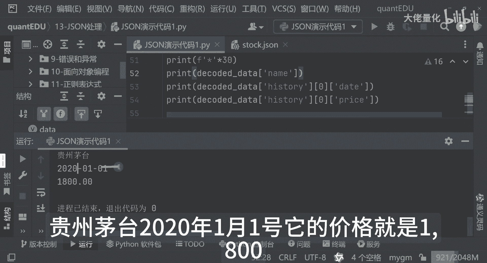

它的价格就是1800，这个就是处理我们的复杂类型的，那另外来讲可以处理我们自定义的对象，一个JSON序列化啊，反去的话，那希望今天的讲解能够帮助大家。

更好的理解和使用Python的JASON的模块来处理。

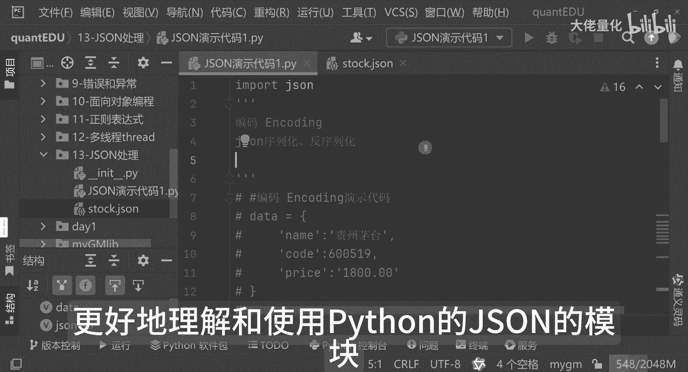

JASON的数据，在我们量化交易中，熟练的掌握我们的JASON数据处理技能，可以让我们更高效地处理各种数据，为我们量化分析和策略开发提供强有力的支持，那伙伴们，我们下次再见，感谢点赞关注转发。

谢谢大家再见。

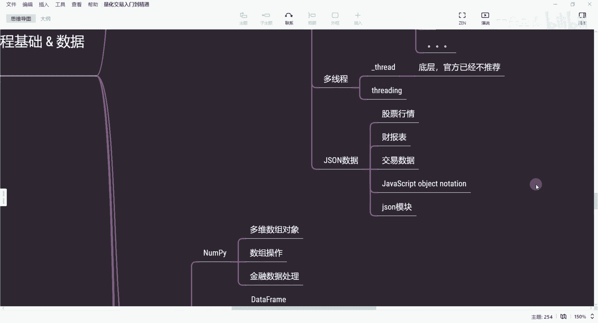