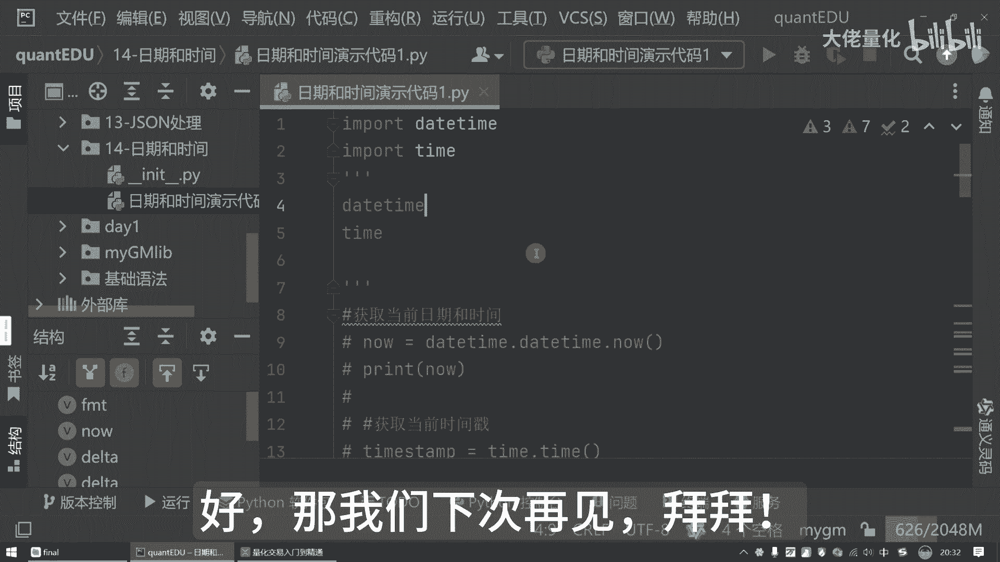

# 量化交易入门到精通48-python日期和时间 - P1 - 大佬量化 - BV1UwmJYFEDx

大家好，我是专注量化交易的速度，今天我们来聊一聊Python中的日期和时间，这可是量化中一个非常基础，但又非常重要的一个技能，那我们会认为时间，日期平常在生活中是再熟悉不过了哈，但是在量化交易中。

时间就是金钱，我们需要精确的记录和处理各种时间数据，那比如说我们股票的交易时间，财务报表的一个发布日期，经济数据的发布时间等等，我们熟悉掌握了Python的日期和时间的处理技巧。

那对我们进行量化分析和策略开发，是至关重要的，那Python来讲是提供了两个啊模块，来处理日期和时间，就是我们的date time和我们的一个time这两个模块，那time主要用于处理我们的时间戳。

和我们的一个时间格式转换，而daytime模块则提供了更高级的日期和时间对象，那话不多说，今天我们创建第14个软件包，就是我们的一个日期和时间，好，创建我们的Python程序日期和时间演示代码好。

我们刚才说了，我们是主要两个非常重要的包，也是daytime和一个time好，那我们首先来把我们的这个包先引入进来，那就import daytime和import time，把这两个包导入进来待用。

那首先呢我们先看这个获取当前时间，那这个就是我们的获取当前时间好，这里面调用的是我们的date time下的date time，然后now号来讲代表是个方法，是一个function好。

那我们运行一下程序，那运行程序之后可以看到，这是2024年的10月9号，21：19：59，这个就是我们获取当前日期和时间的一个方法，这里边是不只是时间了啊，这是日期和时间好，我们再看下一个代码。

就是获取当前的时间戳好，这里边就是用我们的一个time好，这里边还有个细节，就是你会发现IDE里边这边有个结构，这个里边结构里面可以看到now time step，也是now time step。

这里边就是我的这个变量value，我先把它注掉哈，好那这里面只有time step，我们现在运行一下，这里面可以看到就是这一大串数字，我们也不懂这是什么是吧，那好这里面我们如果是想看得懂。

那我们就是把当前时间戳那转换成时间对吧，好，我们看一下，那转换成时间之后，实际上这里边是要把我们上一步获取的时间戳，那传入到我们的time，然后点look time，然后现在把我们的一个时间戳。

转时间的一个内容打印出来，大家可以看到这里面打印我们的time struct，也就是我们的一个时间数据里，可以看到这里边有time year，2014年是months，这是day hour。

Minutes second，这边都有，这里边告诉说第几周，我们可以看一下今天星期几，今天星期三我们之前说了吗，那算记里面是从零开始，那就是012。

所以说这里面的weekday就相当于是day day等于二，那这里边是告诉你说，这是一年中的第多少天是吧，那这里面刚才演示了这些，我把这个先注释一下，那我们再看下一个用法，就是时间格式化，可以看一下。

首先来讲我们定义一个permit，Permit，实际上是我们的一个格式，这里面可以看到y year month day hour，这个是minutes and second。

这里边就是您月日时分秒这样一个缩写，然后再往下，这里边是获取了我们daytime，Daytime now，这获取我们的一个时间，再往下来讲，可以看到这里边就是调用了我的now点。

Train ommade it time c r f time，这里面把我们传入的值，就是我们的一个FORMMIT时间格式，那好我们现在打印一下，可以看到，这里边就是把我们当前时间显示出来的。

这里面之间是和我们的现实时间是完全一致的，也就是我们的20：23：34，2024年的10月9号，这个呢就是通过这种方式，当然这里面也是可以改的，你比如说现在把这个format it改成其他的形式。

我不想用横线的方式了好吧，我想用一个比较奇怪的星，当然我们通常也不会这么显示，但是我却想让它看起来不一样一点是吧，那看这里面就是星了，这里面其实就是一个占位符的形式好，那这里面也可以说我不要年月日。

我只要时间好吧，那我现在在运行，你会发现这里边只有时间了对吧，这里面多种方式，除了这些，还有我可以用这种方式啊，你比如说用斜线，我们在程序里面也会见到这种这种形式对吧，这种也是比较常见的。

那另外还有我们的其他的形式，看看还有什么形式呢，你比如说哎呀啊B啊，这个小弟，然后我们的百分号Y是吧好，那我们看一下现在有什么东西啊，现在就是WEDNESDAYOCTOBER09对吧，2024。

那这里面就可以看到了，这是我们的星期三，然后是我的10月好，那这里边就是有多种形式，那其实就是根据我们的时间的具体的需要，来进行一个时间戳的一个转换好，那我们再看下一个演示代码，字符串转换时间啊。

这个也是比较常见的，那现在呢可以看一下，我们还是先定义一个FORMMATE，一个格式年月日时分秒，比如说我的time step，是2018年的八月八号的12。12分，那我现在呢通过我的time。

然后这是个字符串，那我现在在调用之前，我可以先把它打印出来，我可以先把它打印出来，Type time step，那我们看一下终端里面会输出什么，但这里面是time string。

这里面他是告诉你这是个字符串类型，我现在再把它打印下，我这边我再加一个type，我再打印一下，你看他现在是什么类型，那转化成之后，它会变成这样的一个叫time struck time这种类型。

刚才我们所看到的年月日时分秒，这里面都有对吧，那这个就是我们的字符串转，之间的一个处理方法，那另外来讲日期和时间是可以运算的，我们可以看一下是什么样的啊，这里面照例我们可以再来一个格式。

我可以获取我的当前的时间，现在可以打印一下我的一个当前时间，那这里边都可以看得到好，我再往下这里面来讲，我比如说我现在我可以算出三天的差，再往下我现在把他俩加到一起好吧，那我们可以看一下。

今天是我们的9号，那加三天之后是多少呢，就是12号，这个就是对日期的一个加的操作，当然我们也可以减，我们可以看一下，那减了之后就变成这个零六了，对不对，这个就是加和减的演示啊，那这里边我也加一个备注。

就是日期增加天数，这里边来讲就是日期的减少天数，那除了日期以外，那我们的时间其实也是可以改变的，那这里面是我们的一个时间的升降演示，这里边可以看一下，比如说我现在增加三个小时是吧。

现在再看一下是怎么样的哈，我把我们之前的一个操作先把它注掉啊，你看啊，现在它就变成了23点了，那实际上就是加三个小时之后的一个时间了，那这就是hour，那这里边还有一些。

你比如说我们交易一些境外的股市的时候，可能还会有一些时区的一些处理，时期处理演示啊，那时区来讲，现在定义一个时间，再往下来获取我们的一个时间，那获取时间之后呢，可以看到当前时间格式是如何的好。

这里边你可以看到我当前的一个时间戳，可以看到我的一个市区，也就是我们的一个time soon，那这里边呢可以看到还有一些其他的信息啊，再往下有很多，这里面有很多好，我现在把它打印一下，大家可以看一下。

这里边就是说有我们的一些时区的相关信息，包括这是中国标准时间，这是夏令时时间啊，这个其实就是time zone name，好的，希望今天的讲解能够帮助大家更好的理解。

和使用Python中的日期和时间处理功能，在我们量化交易中熟悉掌握这些技巧，可以帮助我们更精准的处理时间数据哈，那提升我们的策略的效率和准确性好，那我们下次再见。

拜拜拜。

