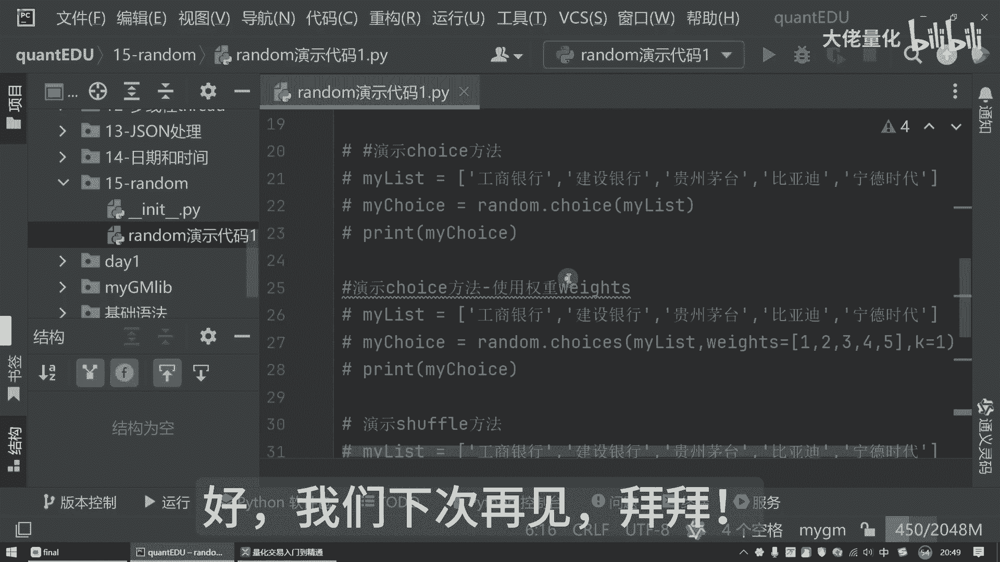

# 量化交易入门到精通49-python random模块 - P1 - 大佬量化 - BV1q9mwYhEZ1

大家好，我是专注量化交易的速度，上节课我们学习了日期和事件，那本节课呢我们要学习，另外一个就是我们的random，是我们的随机随机模块，是一个用于生成随机数的一个标准库，那在量化交易中。

随机数的应用是非常广泛的，那比如说我们模拟一些交易，模拟生成一些随机的一些策略参数，然后这些非常重要的，那random呢是提供了丰富的函数，可以生成就各种类型的随机数，那接下来新建我们的第15个包啊。

然后再新建我们的一个演示代码一好，首先是把我们今天那个主角请出来啊，就是我们的random random，它的主要作用就是随机，随机，就是它最主要的一个核心功能，那现在呢先看我们的一个演示。

就是声程中的随机整数，那正面来讲就是random可以看一下啊，我们先执行一下，你看啊，随机数生成我们的随机数，这里面每次执行的时候，他都会生成一个值，当然可以不点右键，我点这边也是可以的。

这边有个绿色的三角形，CTRLF也是一样的，好每次执行都是这样的一个数字，对不对，那好它默认的时候返回的是什么，我可以看一下，我现在把它打印出来，把那个type去掉好，我们现在执行，大家看到没有。

每次其实都是生成一个float类型是吧，这是一个生成一个随机数，这是一个浮点类型浮点数，那好那我们如何生成一个随机的一个整数呢，那么我们现在随机生成从1~10这样的一个数。

那好那我们看一下这里面最终会生成什么样子，然后我们看一下运行，看到没有，现在来讲，我把上面两个浮点数这块先把它注释掉，那生成整数的时候是这样的，我每次执行的时候，其实这里边会生成一个随机值。

那我现在把这个随机值啊，我不把它放这里，那就是我把它放到这里来好吧，那就是my my int，然后我在这边的时候，我把那个值打印出来，我在这边的时候，我确保它都是一个值啊。

那我现在运行的时候可以看到这里面告诉谁，说这是八好吧，这是七，这是七好，这是二，你发现这是随机的啊，然后并且告诉我们他返回的是个整数，上面这个代码呢默认生成是个浮点数。

这样来讲我加了这个random integer这种方式，并且我划定好一个区间之后，我也可以生成这样的一个随机的整数好，那我们生成浮点数也是一样，那生成浮点数来讲，这里面其实也是可以这样的。

我把这个代码也稍微改造一下吧，就是my float好吧，我这边的都用我的my float，这边也用我的my float，现在生成的时候，这里面都是float类型。

那其实flog类型我们也可以加一个随机的范围，这个浮点数它是从零到1。0，这是它的一个范围哈，好然后我现在再把它注释掉，那下面的就是生成一个随机浮点数，我们可以看一下这里边。

比如说我们现在是uniform，那现在我们在打印它时候看一下是什么好，现在你会发现就不是从0~1，这样的一个浮点数了，它会变成说从1~10，你看7。7777。7，然后再往下来一点几是吧，八点几。

然后这样八点几再往下来讲，你看这里边还四点几这样一个随机生成的好，这是生成简单数字的这种方式，那这种就比较符合我们，比如说生成一些虚拟行情数据，在回测的时候进行测试的时候可以这样子。

那另外可以用我们的一个choice，是我们的random里面一个方法，从序列中随机选出一个元素，那这里面可以看一下演示我们的一个choice方法，我们可以看一下啊，choice方法。

你比如说我现在my list里边，那这样来讲好，我现在我随机选择我的一个值，那么打印的时候可以看到随机的时候，你看CE好吧，那现在不够直观，那我现在把它改成另外一个名字了，就是工商银行，建设银行。

贵州茅台，比亚迪宁德时代好吧，那我现在在打印的时候，大家看着就比较有感觉了，建设银行工商银行，贵州茅台宁德时代，宁德时代，宁德时代好，比亚迪是吧，贵州茅台宁德时代，这样就随机的可以选出我们的一个相应的。

比个股票，这个就是随机生成一个元素方法，那好其实这里边还比较好玩，还有一种玩法，这里面是可以加一个权重的，那我们检视我们的choice，使用权重with这样的方法，照例来讲。

我们继续生成我们的测试的一个列表，那就是list，然后我们再生成我们的一个choice，那这里边除了把列表传进来，还有一个with这样的一个参数，那好现在看我们的choice方法，那使用了权重之后。

这里边我们随机选择一个值，这里边呢可以看到我的工商银行权重是一，宁德时代是五，按照这个参数的方式来讲，我的宁德时代，比亚迪，这出现的概率是一定会比工商银行出现的概率，会更高一些。

那我们现在运行程序的时候会发现比亚迪对吧，比亚迪一次宁德时代一次好，贵州茅台，贵州茅台，工商银行，建设银行，比亚迪，建设银行，宁德时代，宁德时代，宁德时代，贵州茅台。

大家会发现这个就是我们设置了权重之后呢，我们的宁德时代会出现次数会更多一些，这个九有点像我们抽奖的时候一样的，这里面会有一个概率会有一个权重值，那再往下来可以看一下，在那个随机里边。

还有一个是比较常见的，就是我们的一个shuffle，shuffle也是比较常见的一个方法哈，那我们可以看一下它是具体怎么用的，比如还是我们的my list，还是这么使用。

那我们现在把这个随机排列进行打乱了，那我们现在再打印一下，我们my list，我打印之前的时候，我的顺序是这样的是吧，那我重新排序之后是什么样的，看贵州茅台，工商银行，比亚迪，建设银行宁德时代。

你会发现这个顺序其实已经改变了是吧，那我现在在执行一次，看到没，我每次执行的时候，它的顺序都是有改变的，相当于是把它重新随机的进行打乱顺序了，好那这个就是我们的一个12分的是。

那再往下呢就是我们的一个随机种子，随机种子是什么呢，那随机种子来讲，你比如说我现在random seed1，那这个就是设置我的一个随机种子，那这时候先print render，那这里边来讲好。

Print render，然后现在我先打印一下，你看这里边值是这样的，对不对，那好，我现在我比如说我在这边又重新设置了，随机种子为一好，我现在打印，你发现没有，其实他这个随机数为什么说它是假随机数呢。

你会发现啊，比如说我的随机种子是一，那这里边我的值是一样的，发现没有，虽然每次是真的随机了，但是它的值是一样的，看到没有，你比如说我现在把它设成了二，我现在设成了二，你看啊只是这样的，看到没有对吧。

这样来讲就是设置了随机种子，它会生成一个值，你比如说我现在一个一一个二，你会发现它是不一样的对吧，是不一样的，这是我们的一个随机种子，那我们就是把常见的一些功能也演示完了，我希望今天讲解的随机这块儿。

可以帮助大家更好地理解我们random模块，在量化交易中，这随机数的应用是非常广泛的，那掌握了random模块的各种函数，可以帮助我们，我们更好的进行模拟分析和策略研发啊，那今天就到这里好。

我们下次再见。

拜拜。

