# 量化交易入门到精通8-python简介1 - P1 - 大佬量化 - BV191HbenE8P

Hello，大家好，我是专注量化的速度，S u d o，咱们今天来聊聊Python，之前，把我们整套课程的四个阶段都已经介绍完了，今天开始我们的第一阶段的学习，第一阶段主要是掌握编程基础。

还有数据处理能力，这是非常重要的根基的技能，那我们今天开始学习Python的入门部分，那整个入门部分，我们会结合量化数据的一个交易场景变化，交易数据的应用场景基本分为基本语法呀，控制流函数等等一系列。

我相信大家通过各种渠道，应该也知道Python有很多种应用领域，例如我们国内豆瓣或者知乎，那国外来讲，像谷歌的一些应用项目，油管有很多的项目巨头都在使用Python，那Python到底是什么玩意儿。

什么个东西，Python其实相当于是我们原普通话一个简单易懂的，谁都能我说的写这种语言，选Python肯定是没有错误的，是非常简单容易的，你会发现和我们的正常沟通是比较相似的，首先要有逻辑。

要清晰自己的目标是什么，其实我们也知道并不是完美的，它也有缺点，比如说他比较慢，这是他的一个缺点，但其实我们说快和慢也是分为两个部分，说它快呢，因为它的开发的速度非常快，那说他慢。

其实他执行的速度会略显，你学C语言，C加加肯定是稍微会慢一点，但是它的快是在于它的一个快速实现自我想法，这是Python的一个本质优势，那我们看一下这点。

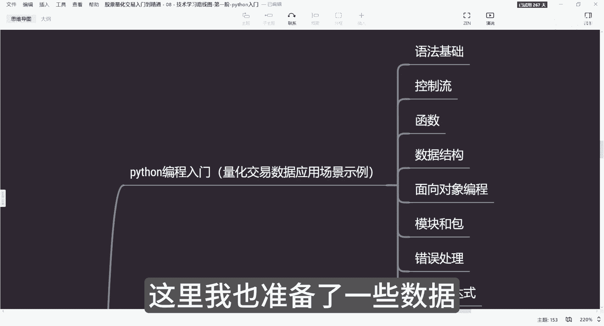

我也准备了一些数据，我个人用的同花顺比较多，大家根据自己喜好，有各种看盘的行情的软件，比如说我想知道今天涨停的有多少，那通过这里边可以看得到这涨幅排行，那茫茫股海之中，全中国A股目前有5000多只股票。

如何根据某只股票的数据来进行量化分析，数据分析，我我现在录这个视频的时候，正好是2024年的9月1号，整个金融市场现在真是跌的比较惨的，整个市场人数也相对比较悲观，但是最近的银行股屡创新高哈。

这个确实是让大家还是记忆犹新啊，我们现在可以看一下，比如银行板块来讲，前段时间整个大盘都在下跌的场景下，但实际上这块来讲是连续慢涨昨天，但是这几天都没过热啊，突然有个风险的集中释放，比如四大行。

工农中建，我们以工商银行为例，大家可以看到这个区间范围内行，从6月17号到8月27号，工商银行这样一个体量的一个市值的股票，总市值涨前值一点几万亿嘛，之前不也说宇宙第一大行。

那你看整个6月17号到8月27号，涨幅是在25。93%，那这么大个市值的股票涨这么多，这个真的是很夸张啊，即使是最近三天的跌幅也并不是特别的大啊，你可以看一下，这几天来讲，它是急跌的状态。

才跌了8%点几，其实在整个上证指数，一直是空头市场或者阴跌的行情下，那整个空头排列了，在这个行情下能走出这样的一个战绩，真的是非常不容易，这里边我们也整理了工商银行的一些，实时交易数据。

每日的今年的2024年的1月2号，到现在，你看当时的股价，当时开盘价是四块七毛八，收盘价是四块七毛九，至2024年的1月2号，我收集数据的收集到8月20号，我是有关注他的，你看8月20号当天。

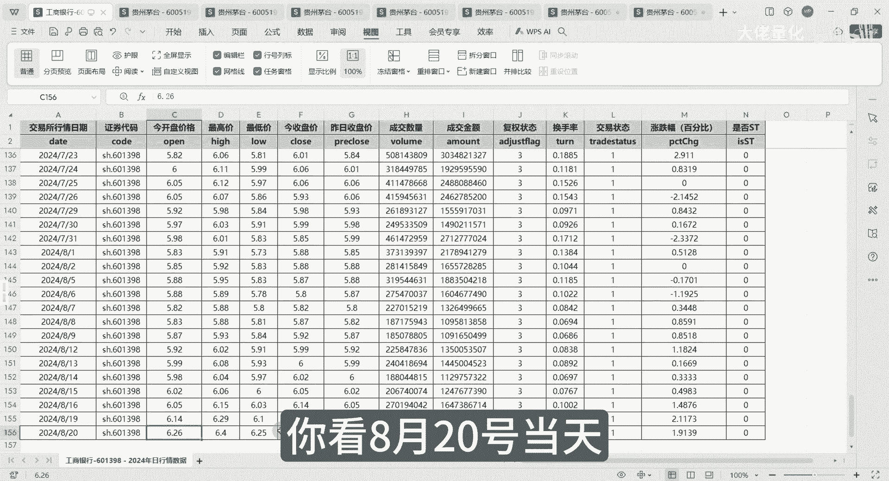

收盘价已经达到了六块三毛九，还是蛮夸张的，那Python在整个过程中，其实我把这个Python的数据和代码进行相结合，这里边我是有个示例代码的，那这些代码大家目前阶段可能看的不是很明白。

那我这边简单解释一下这个import来讲，引入我们的相应的包，我把它放大一点点，大家能不能看清楚一点点，import t来讲，我们引入包就是像贴lab库，i login是个日志库。

pandas是处理一个非常常用的金融库，那下面来讲我们处理一些日志的等级，你是info等级level或者是一个format，一个输出的一个格式是什么啊，下面来讲我们首先第一步，那这里边开始捕捉异常。

这里边导入我们的股票，这里边我日志写的也很清楚啊，开始读取目标数据，其实读取是什么呢，读取的其实就是我刚才为大家展示的excel文件，工商银行601398，2014年的日线行情数据点。

CSV其实就是我们那个excel文件，这里边coding来讲，实际上是个编码，那编码来讲我们常用的比如说UTI8，那中国来讲GBK汉字是支持会更好一些，同时打印出我们的excel有多少行。

那这是第一部分，那第二部分来讲计算我们的一个均线，那均线来讲，我们看到行情软件里面默认的，比如说5日十日啊，15日二十三十，当然更多的还有比如六十一百二啊等等，当然除了我们的日线的维度。

还有周线维度的月线维度，甚至还有分中文一度，那我一会儿也会展示我们的贵州茅台的这种，分钟级的一个数据，那看到我们计算我们的均线的时候，这里边你可以看到把我们的所谓的数据哈。

close收盘数据导入到我们的一个t lab中，来计算我们的一个5日的平均移动的一个指数，来计算出我们的5日均线，同时来讲我们用同样的方法啊，只是参数不同，把我们的20日的均线也计算完成。

那这是我们的一个均线的计算，那再往下来讲，我们常用的比如MACD啊，这样的我们或是算金差死差等等一系列的，那有很多种方式都可以导入我们的程序当中，目前阶段我相信大家听起来肯定还是比较茫然。

但是我想给大家呈现的，我们学完这套课程之后，其实这个只是抛砖引玉啊，我们可以用更多种的一个量化策略，来展示我们的想法，实现我们最终自动化盈利的目的，而这里边来讲，把我们的一个最终收益可以打印出来。

这里面来讲我们可以看，那这里面其实我是执行过的，我可以再执行一次啊，那我用的是po charm i d e，是我们的集成开发环境，那网络上也有推荐vs code，但是有很多种。

那我个人来讲觉得开charm，而且我用的是社区版本，是开源免费的，其实我现在我才知道，这个工具是整个idea家族里面还是非常牛的，你看java来讲，就用的idea海灯等系列。

他全家桶其实整个的一个形态其实近人幕后，实本人研发的这个是挺让我意外的，我之前一直以为是欧美那些主流的那些国家，这个还是真的很厉害，这里边脑图的形式。

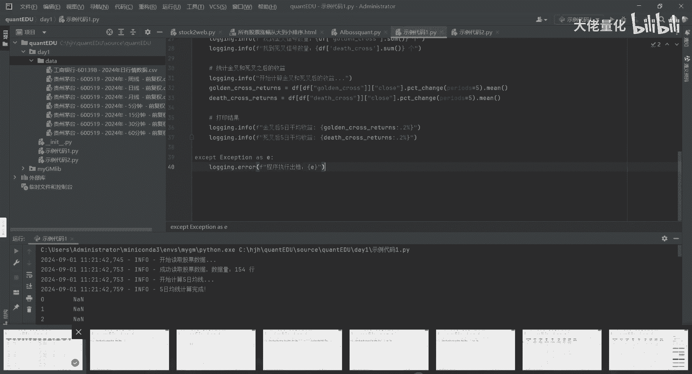

这边我也再加以我们的一个IDE的B选项，当然了，家用我们的也可以，除了vs，甚至说原有很多种，甚至说服务器上甚至说记事本都可以，只是说我是希望大家可以从入门到精通，可以确实没必要浪费太多时间。

所以说这是我们目前来讲，个人来看是最优的一个选择，我想和大家介绍的是，上我们那个包的管理工具来讲，比如说我们的pip有很多种啊，pip来讲，这里边比如说镜像源，这是个镜像源。

那比如说我们的清华的一个镜像源，或者是还有用喜欢用豆瓣的，豆瓣圆有很多种，其实这个pip我后面都会有详细的介绍，现在大家是有个初步的印象，那真正的就是说你pio charm它只是一个IDE。

而已就集成开发环境再差，我可以把这个代码写进来。

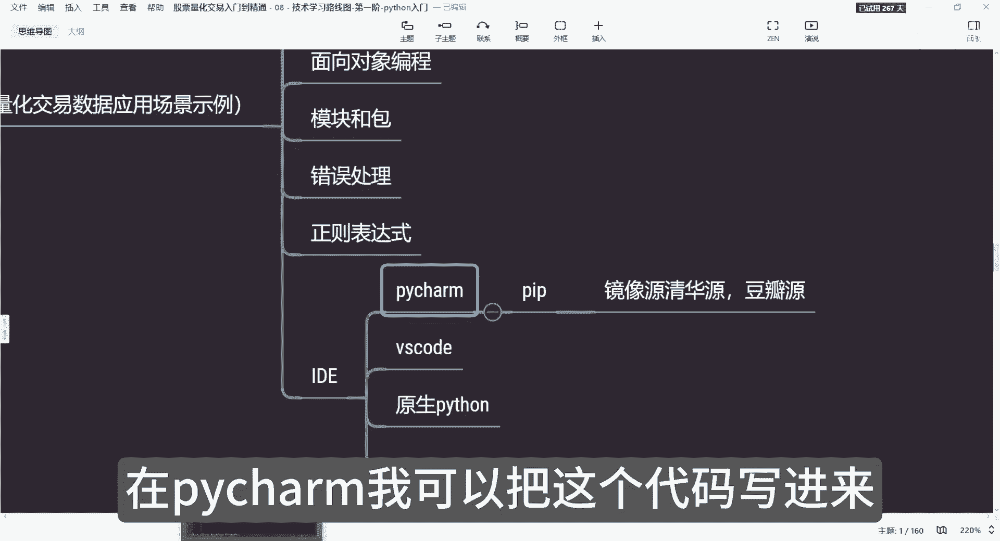

就像我这样的一个工具一样，你可以把代码写进来，但事实上这里面引用那些包，它并不是这个排插里边所本身就有的，那这里边你就可以通过我们的pip，来进行一些包的一些安装。

例如刚才引用的比如tia lab表示等等。

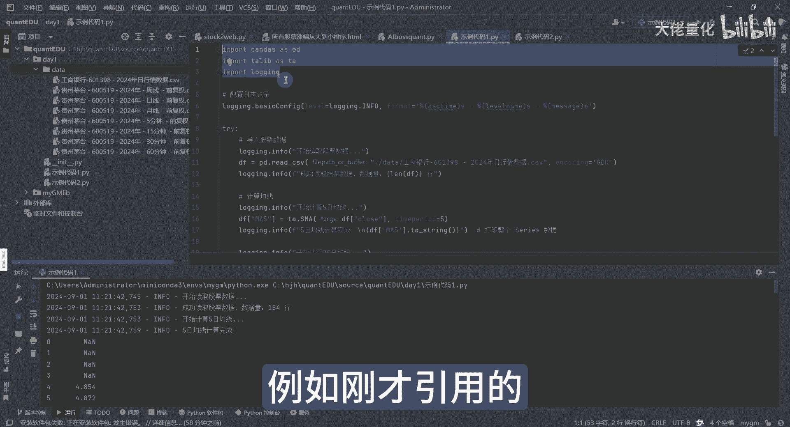

一系列i request就是网络请求的包，那另外一个概念就是要介绍PIPPIPY，还有一个一个一个的，这个也是很重要，目前比较主流的，像我们的康达，当然来讲这个其实也是根据你的选择。

我个人喜欢这个迷你康纳来讲呢，康纳其实是一个东西，在这里面来讲应该理解为是一个极简的安装，并且根据个人的需要来进行了一个扩充，需要进行扩充，这个来讲本身是已经集成了很多常用的一些包。

就相当于是说你可以不需要按太多，因为我个人来讲，我对机器的性能，我或者是对整体的一个打包一个效率，我还是你比较要求了这里PIP康达米康达，那这里面很重要的一点就是环境，那这些环境啊。

这里边我就可以分出很多的一个虚拟环境，虚拟环境来讲，你可以理解为是我们Python的一个工程，运行的一个沙箱沾的box，那这种沙箱的好处是什么，你比如说我现在我想写一些彭的一些程序，那爬虫的去。

那比如说我现相关的算法相关的一些程序，那比如说我现在想写一些作业相关的程序，其实每个程序之间本身是没有问题的，但这里边也会有很大的问题，就在于说你在创建不同的环境的时候，引入不同包的时候。

彼此之间最最怕的一个事情，或者说我们最不愿意看到的事情，就是一个包冲突，包冲突的事情，我相信很多人都会很郁闷，举个例子，你比如说我某一个包的引用依赖，里面还有一个叫依赖，那你比如说我在爬虫的时候。

我某个一个包X叉叉叉一个包，那我的依赖版本我可能依赖了，比如说request这个网络请求包，那我比如说我依赖的版本，我是1。0版本，那好我在我算法这部分来讲，我依赖呢我可能是一个二零版本。

那我到真正交易策略的时候，我发现我记得request版本1。1。1版本，那这里边如果是通通都放到一个境里边，放到一个所谓的没有虚拟环境，其实就是一个实体环境，那那这里边就会遇到一个非常大的问题。

包冲突之后有最直接的影响，就是说在同一时间它们是互斥的，就只能是运行一个程序，这就很麻烦了，你比如说好吗，我只能运行我的爬虫，要么我就只能运行我的一个交易策略，这里边就很麻烦。

那用我了虚拟环境之后非常大的好处，就是我可以在不同的环境里边，我可以引用不同的包，并且使用我们的康达或者迷你康达或pip，来管理我的这个包，后续来讲我都会有一个具体的概念演示啊。

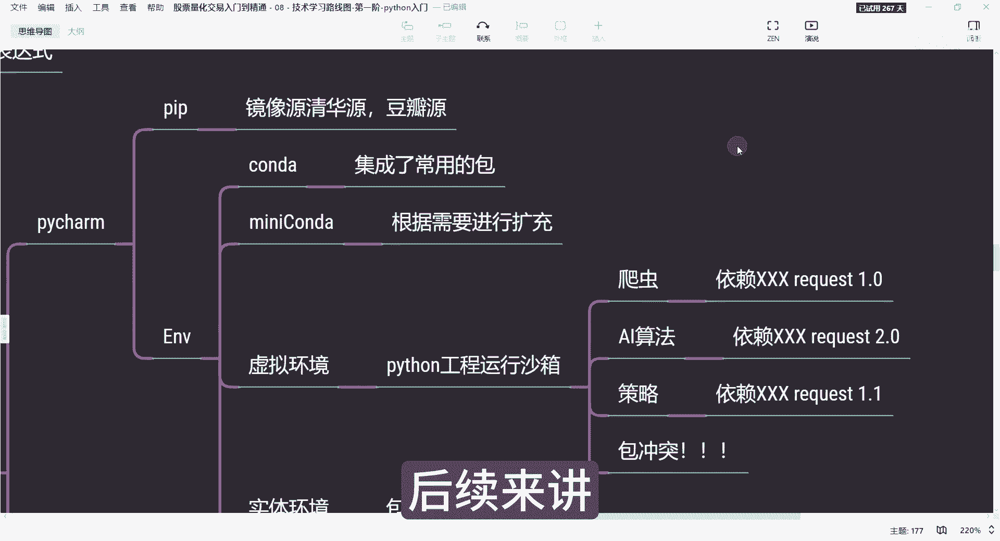

那我们看了我们刚才的一个工商银行的一个。

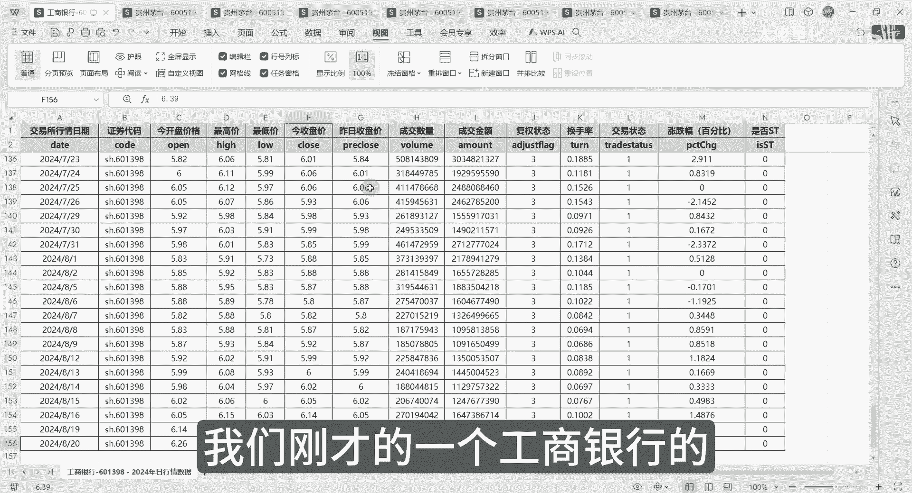

具体的一个交易情况，我们可以看到我们输出的日志，这个在排叉里面有一个日志，那我们对照刚才的一个代码的一个情况，看，这里边，你看我成功获取股票代码是154行，154行好。

我们看其实我们读取的这个excel文件。

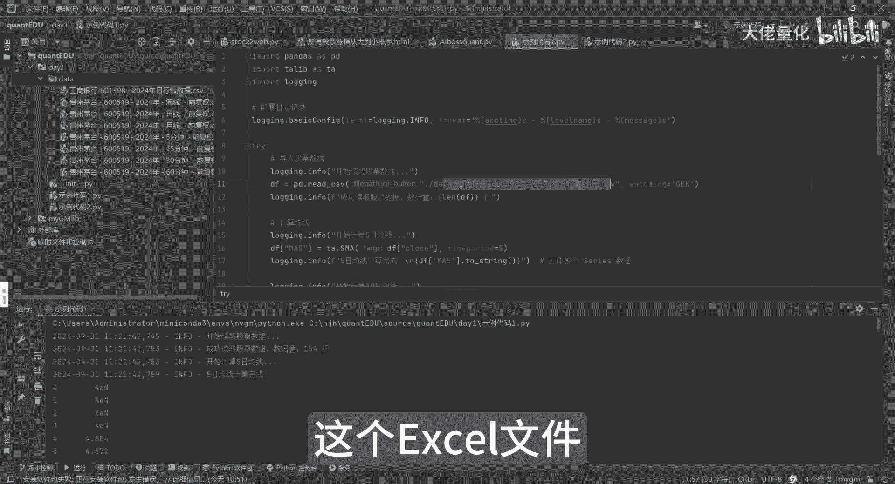

这边，你看其实这里边我们发现不是153行，156行，那为什么呢，那是因为我们整个数据的格式是一个，叫做data frame，那其实第一行第二行，这是作为一个所谓的一个表头，那这两个是不计在内的。

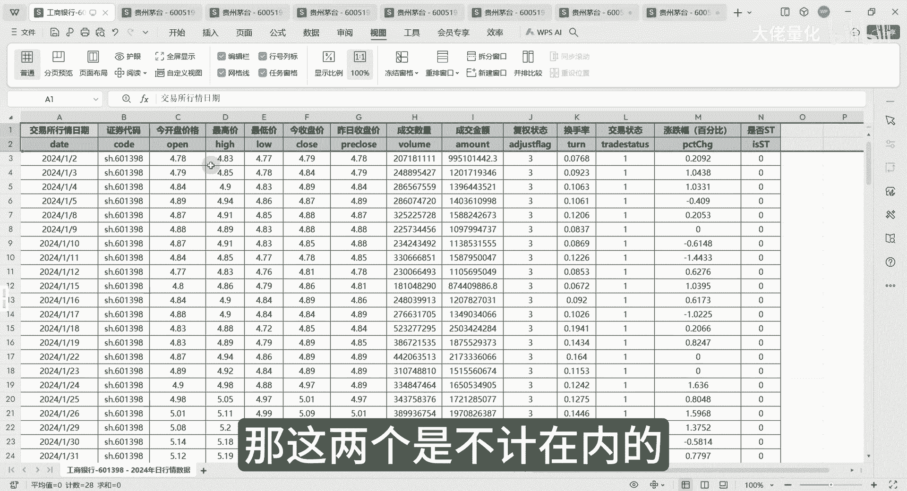

这里面仅限于一个数据项，所以说这里面是这样的一个，所以说这里面是显示我们的真正数据，那数据有154行没问题的，接下来计算我们的一个分钟的一个，计算完之后呢，这里面大家可能发现也有个疑点。

为什么说我们这里边等一下，为什么说5日开始计算5日均线的时候就前三，那他从零开始，这个时候我们的日常的一个说法会有些不一样，那从他从1234这四天都是真an，实际上就是个空值啊，为什么呢。

因为我们其实这里面很好理解，有一点，因为算的是5日的一个局限，因为前几天是没有5日，这种也达不到5日嘛，所以说前面就是空值，那到第五天的时候，他才算出来是我们的一个四块八毛五，还是四舍五入也可以。

这里面是没有进行处理的，所以说在这边是这样的一个，再往下来讲呢。

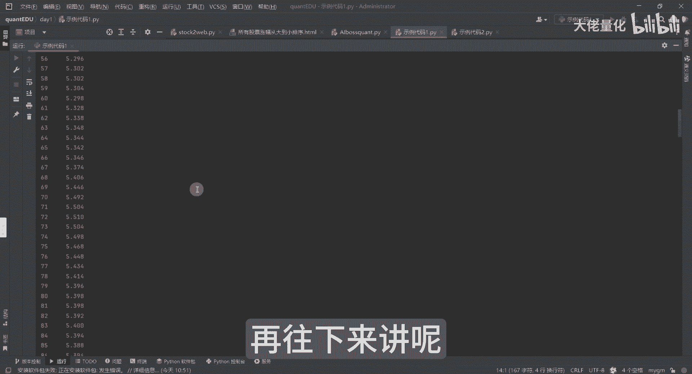

可以看一下这个望和大家展示，这里边，其实我们当时算的是，2024年的8月20号啊。

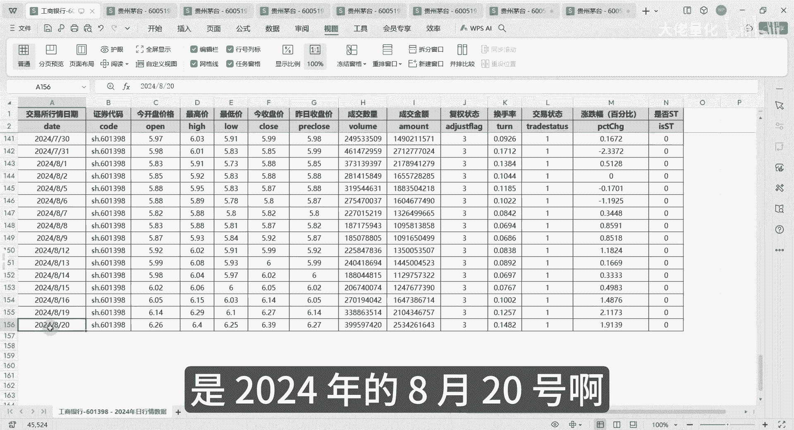

当时算的一个5日的均线是6。17，6。17呃。

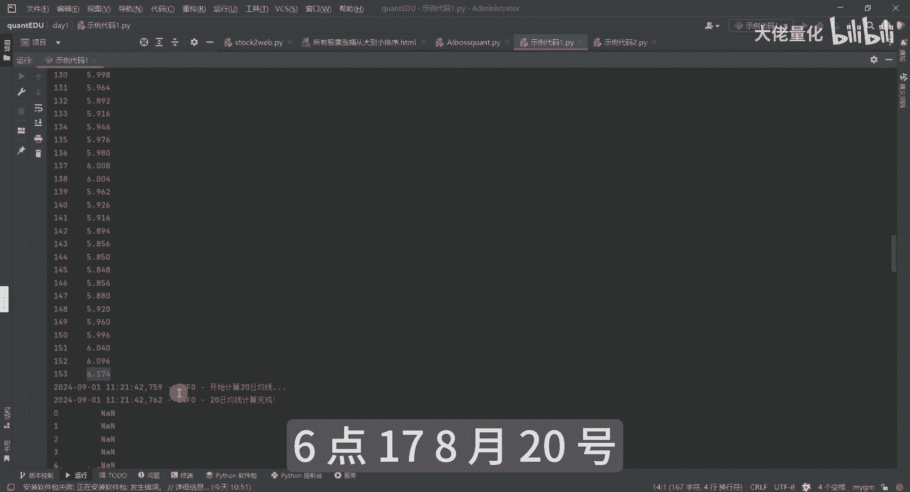

8月20号，8月20号好看，等一下啊，大放大一点，大家可能看不见，是这个位置，你看我们的。

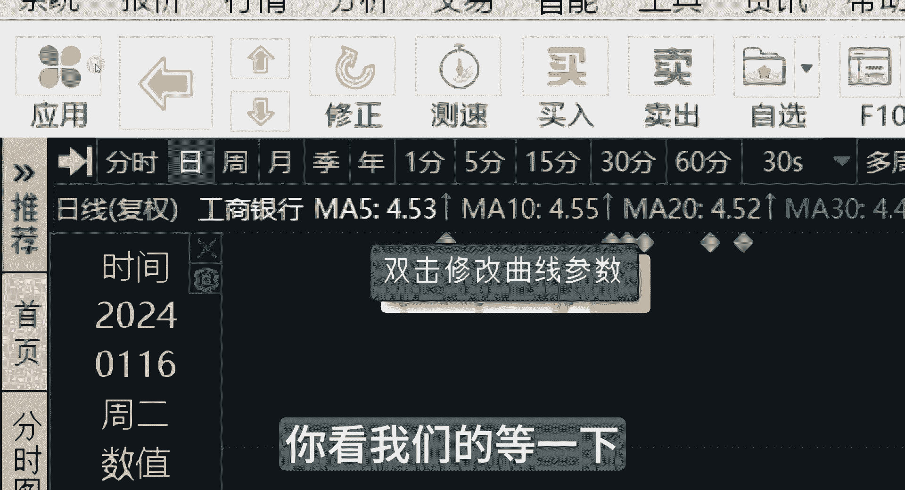

等下就这个位置，ma5这个位置看一下8月20号的时候，当天是什么情况，大家可以看一下，我截个图，这个位置可以看到，当时ma5来讲是我们的6。17，6。17，因为他是四舍五入了。

而后面来讲我当然还有演示是，你看这里边当天是20点不对，当时是5。99，这是20均线和5日的均线。

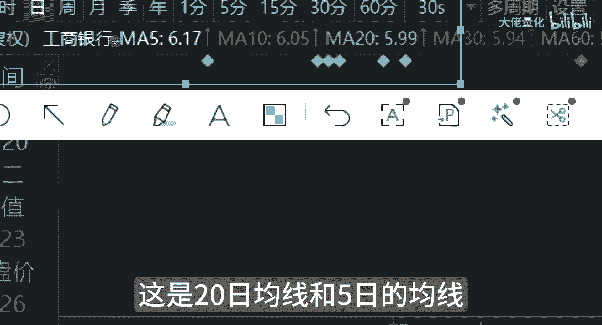

这是最终的一个计算结果，再往下算，20的时候和5日也是一个道理，你会发现前19天也是为空的，到第20天才有值，再往下来讲算，我是否有这种所谓的现在是有线的一个交叉，5日线，20日线的一个交叉。

是否有交叉，你认为这是一个金叉死叉，当然来讲你可以认为说向上突破，或者甚至说MACD，那这些都可以通过我们的ti live包，这种直接可以计算出来，这是一个简单的一个代码的一个示例，那另外来讲。

我这里边其实也会用到一些AI的AI的一些代码，目前来讲我认为世界上有很多种这种基座，大模型有很多种，当然来讲，我个人是比较喜欢谷歌的AI和chat gbt的恋爱，我觉得这两款做的还是蛮优秀的。

但国内来讲，我觉得像千问或者是说可能除了千万，其他的暂时还都包含这两档代码，我也简单给大家，这里边可以看一下上面这些内容呢，最基本的一些温度值啊，top key等等一系列，那这里面可以看一下。

这是个安全等级等等，那这是调用我们的一个相应的一个接口，那这里边可以给一个提示词和提示词之后，你可以进行一个多轮的对话的输入，就是我们常见的，比如说你是谁，这里边来讲，他会告诉你说。

因为它是根据我的property，是我的提示词来一个预设词，来告诉我说我该怎么样，这样来讲就打造了我们自己的一个股票，量化的一个AI助手，那同时来讲这里边其实还可以那种stop外吧。

那像这种我可以知道说我今天，但是这代码，大家目前我所展示的这些代码。

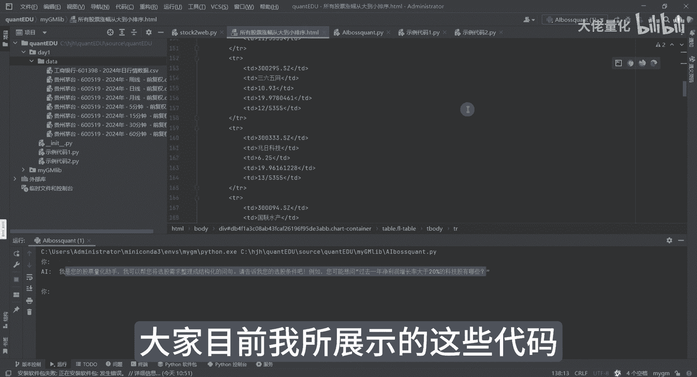

都是可以用程序来自动生成的，这些都可以自动生成的，那可以看一下，那像这种你可以知道说8月30号，因为今天是9月1号啊，8月30号是上周五，那当天来讲，我们可以看到当天我们接服务一个排行，智信电子。

竞彩科技，幸福娱乐等，那其实可以到这边，你可以看到你比如说点个股，这边你看星辉娱乐啊对吧，银行智控啊，这边都有的，这里边都可以看到这些天股票，当然来讲，这些其实都是通过这个程序来给我们自动生成。

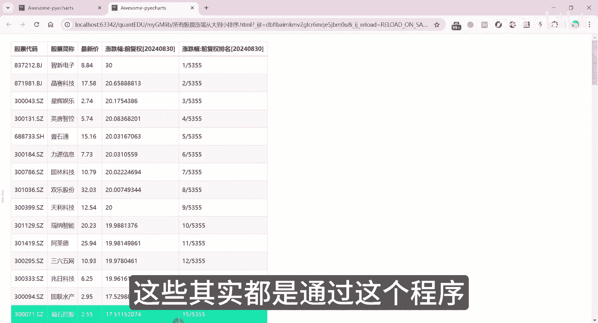

然而这个也是我们团队开发的。

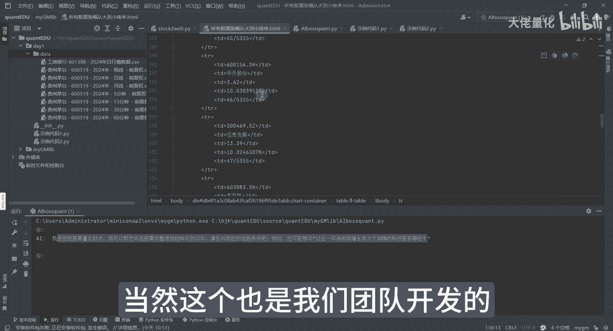

这里边其实介绍这么多，想跟大家介绍一下，说我们的Python真正的一个威力。

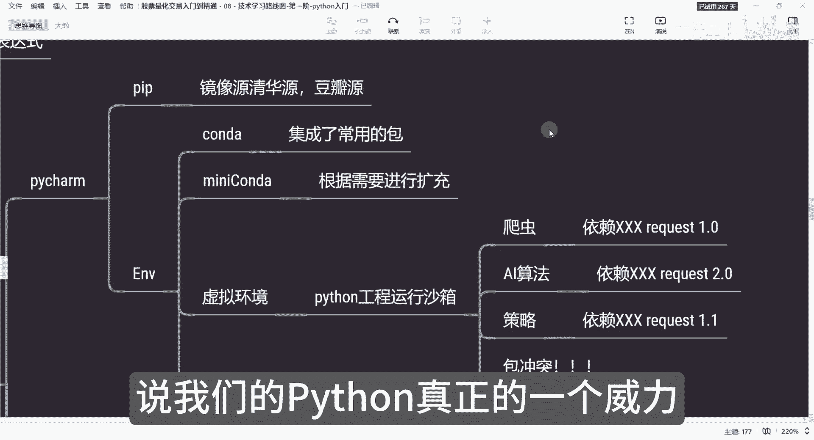

那包括这些，除此以外，还有这些，你比如说除了这种技术指标的，或者是你的财务指标的一些筛选啊。

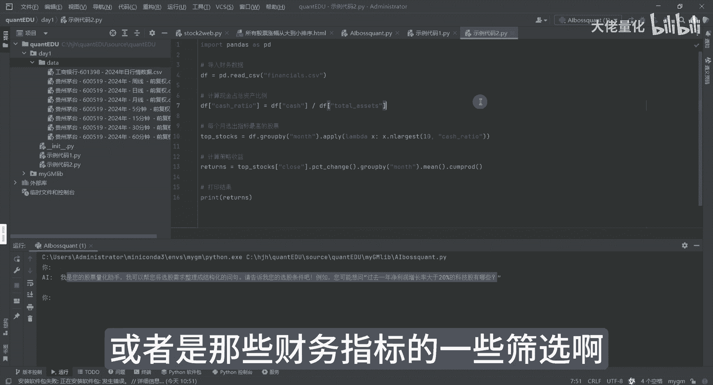

那所以说到现在来讲，我们整个的一个例会相对比较完善一些，你比如说你的一些舆情的一些分析，基本面的一些分析，还是技术面的一些分析，那在Python里边其实都可以通过一些方式手段，都可以技术上都可以实现。

那整个来讲我们可以看到Python在A股量化领域呢，真的是一个神器啊，它帮助我们分析数据，开发策略，自动交易，那我可以说是无所不能，那所以说那接下去我会带着大家来进入。

我们具体的Python的一个语法的工作，学习完之后逐渐渐进的一个过程，所以大家跟上我的节奏，第一阶段是这样的，本套课程也是免费在互联网上和大家分享，大家如果是有什么好的建议和想法，随时和我互动。

也欢迎大家点赞关注分享，那谢谢大家。

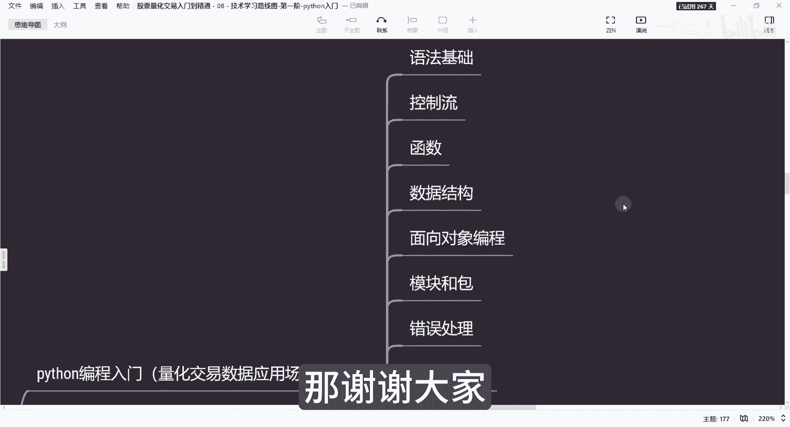