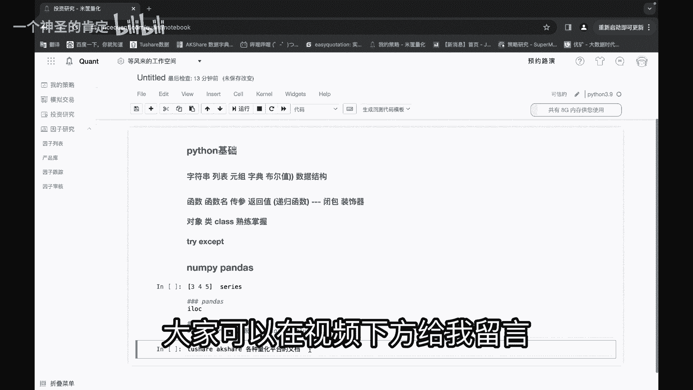
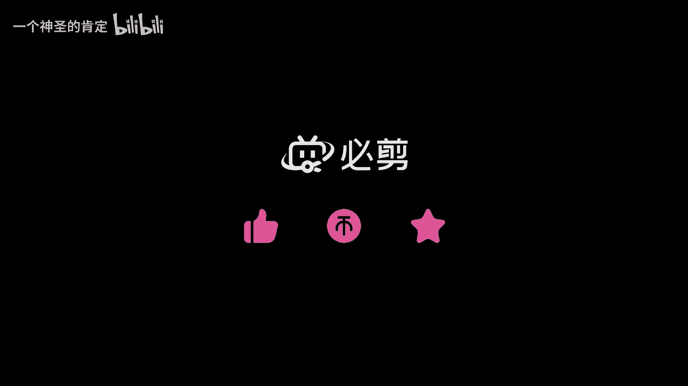

# 量化交易入门必须掌握的基础知识 - P1 - 量化程序员logos - BV1DJ4m157Ur

嗯今天讲什么，今天就准备讲一下，这个就是量化交易，要就是要掌握的一些基础东西，跟大概给大家介绍一下，第一个我们来讲一个，就是大概的东西都讲一下嗯，嗯第一个肯定是要会一些Python基础啊，对吧。

Python基础，Python基础里面，比方说一些很，基本的数据结构你也知道啊，比方说这些，字符串啊对不对啊，列表啊对吧，元祖啊，对不对，元祖啊，字典呀，对不对，是布尔值啊，这些东西对吧，布尔啊。

布尔值对吧，他那时要用的布尔值对吧，这些最基本的数据结构啊，这是他的操作方式对吧，他们那些函数都得懂对吧，这是基础，这是基础的这个啊，这这一部分是什么，这部分就是数据结构，对不对，数据结构。

看这三个车主对吧，数据结构基础里面要大概要知道这些东西，还有这个数据，结果说完了，还有个什么，就是函数对函数你也懂，对不对，函数也懂，函数里面有什么，比如说它函数的最基本的这些概念该懂。

比如说函数名对吧，传参，嗯传参对吧，返回值对不对，你要想完全了解这个函函数的话，你得对吧，你得知道这个递归函数对不对，你自己也会写这个递归函数，递归函数对吧对吧，这后面啊到后面进阶的还有什么东西呢。

然后还有什么B包啊，对不对，还有，B包对吧，还有装饰器对吧，嗯这两个就是了解是吧，平时开发时不太用，但是你要写网站转业还是要用的对吧，前面这个啊最基本的联动函数，这个这些东西对吧，还有什么对象，对不对。

对象对吧，对象应该知道吧，对不对，累对吧，你得会写累吧，对不对对吧，cos这玩意儿对不对啊，我大概讲一下啊，这个类类和对象啥东西类啊，就是模型对吧，对象就是从类里面实例化出来一个对象对吧，对不对。

那就是一个纯纯概念的东西，纯规定对吧，从规定里面变出来一个活生生的一个事例啊，大概就是说一下啊，是不是类里面的一些函数啊对吧，对不对，实例化对象之后也对一些函数的调用啊对吧，这都要熟练掌握，啊对不对。

为什么要这个概念要熟练掌握呢，因为你在调包啊，什么东西的那里面就是一些属性啊，函数啊对吧，你比方说你要用后面很多什么pandas np啊对吧，to share啊，AAA和sh啊是吧啊。

那些股票数据的库对吧，他们都是啊封装的类和对象对吧，类里面有含有有函数对吧，通过实际对象之后来调用对吧，嗯啊这个也懂，还有一些比方说还有其他的，比方说嗯报错。

报错里面有个try t r y try except，对不对，try except这个报错机制啊，你才会出来应用，大概的Python基础啊，就说这么多，你这前面加点这个井号吧，是个意思。

OK大概说这么多，然后拍子就说完了啊，还有重要的几个包啊，南派判这个库对吧，还有pandas这个库是吧，这两个库哦，这两个库也很重要，这两个库一定要会的啊，这两个库要熟练运用啊。

我可以大概说一下南派和pandas是什么东西啊，南派它里面的数据结构就是数组啊，就是一个列表里面标志345对吧，这是基本数据结构啊，这个要清晰的记得他和这个Python的列表区别。

列表里面这中间有逗号是吧，这个没有逗号对吧，然后pandas里面的数据结构是什么，是一个cs，cs cs本身就是一个字典，知道吧，pandas就是一列一列的数据对吧，每一列它就是一个cs对。

每一列就是个字典，他把每一个字节拼成了它的数据结构对吧，这判断是最重要的，是潘达斯，潘达斯他是封装的南派是吧，pas里面有很多，单纯讲一下pandas里面要掌握的东西啊，掌握什么呢。

比方说他有很多这种cs和data frame呢，他这种数据结构本身有很多这种操作函数，你要懂，比方说求平均值啊，对不对，i lock对吧，i lock这个这个函数一定要着重掌握啊，明白了没有嗯。

然后Python还有什么，还有它一个应用函数APPLY，这个函数一定要会用，知道吧，这个东西对他那对每一列数据，对每对data frame整个表对吧，进行处理的时候要用这个函数的，知道了吧。

这个啊还有一个就是啊常用的叫分组和聚合，分组分组聚合啊，看一下分组，聚合对吧，分组什么，就是GOODBYGROUP隔夜的背对吧，这个东西隔离的背对吧，还有QQ机合流了，还有什么salt s o2so。

对啊所windows这个函数也得知道排序对吧，分数据和排序OK大概就是这么多啊对吧，这两个包说完了啊，这两个NPENCE啊，这个数据结构，这些NPD里面这些运算三元运算什么，要知道这两个就说完了。

其他的就是怎么说的啊，就是其他的还有一些库要用了，其他就要用一些库啊，导入一些函数啊，一些库啊，就刚刚说的啊，图示对吧，r e to share excel对吧，各种量化平台的文档对吧。

啊啊就看看就可以了，就看这些东西就可以了，怎么各种量化评论的文档怎么能看得懂呢，啊就关键点就在这了，你要把这个对象和类啊，要自己会写类和对象啊，你就能看到这些文档了，获取数据啥的。

你就可以对在掌握这个pandas，OK你就可以自己写策略回测了，基础的东西就这么多，OK还有什么问题。

