# 量化交易策略框架 - P1 - 老湾python量化交易 - BV1HfqdYhEjq

我们今天从宏观的角度来学习策略框架，常常会有一些同学在后台私信我，问我有没有成熟的交易策略。

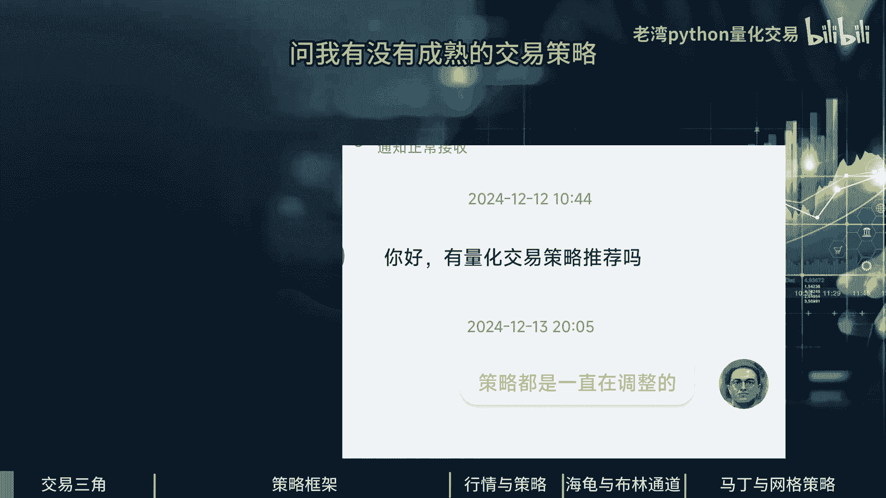

或者是更直接一点的老师，你有没有一年收益十个点以上的交易策略，如何建立一套自己的交易策略，刚刚那几个问题，这很重要，我们希望我们的交易策略呢，能够稳定的获利下去，很多人在做交易策略的时候。

往往忽视了市场行情的走法，一般的市场行情是趋势与震荡，是交互牵扯在一起的，一大段的大涨大跌之后就会震荡了一大段时间，又开始走出一段趋势了，这才是市场常态，所以面临这样的市场行情变化的时候。

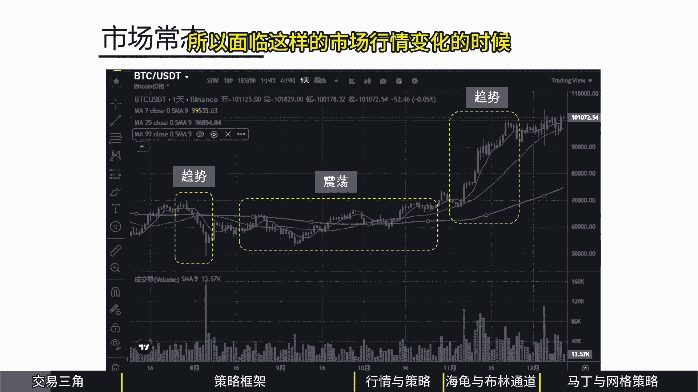

我们应该采取怎样的交易策略，在一般的交易策略之中，有三个问题是我们常常会遇到的，第一个是胜利问题，就是你交易了多少笔记冲，有多少笔是获利的，另外一个问题是赔率的问题，假设你今天有一笔赔的赔了十十万块。

你的另外一笔是赚的，你赚的那一笔是30万，赚赔比就是三倍，另外一个因子是频率问题，也就是你这个策略一年能做个多少倍，以刚刚那个例子来说，赔是赔10万，赚是赚20万，挺好的交易策略。

但是如果这笔交易策略一年只能做一次的时候，它的获利品质跟它的稳定度，就不会是一个很好的选择行，这是一个不可能，交易三角形要同时满足高胜率，高赔率或者是高频率，这样的交易策略是非常难找到的。

这个策略能不能永久的稳运营下去，这是个最大的挑战，对于一般同学来说，我会建议同学把电话交易的过程分成四个阶段，第一阶段是选择交易品种，因为同学能够交易的不是只有股票，虽然股票是很多人刚开始接触的。

第一个金融交易工具，但是同学现在能够做到，除了股票之外，还可以做期货期权，还有些同学能够做到境外的加密货币，当你在这些市场当中，选择一个比较合适的金融商品的时候，你可以去尝试，或许A股不适合你。

或者A股的期权对你来说很合适，有些同学喜欢做境外的加密货币，每个人不同的市场偏好，因为这会涉及到这个交易品种，你对它的熟悉程度或者它的波动率，或者它的趋势是怎么样，这跟每个人熟悉的环境都是不一样的。

所以每个人都有自己适合的环境，你不用一直从头到尾都只做股票，你还有很多可以选的，第二个是如何去选股，包括了是用基本信息或者是趋势或者是波动面，或者是消息面去选出我要做的哪些股票。

通常是一开始是好多只股票，我们在这个池子里面呢会持续性的去跟踪观察，找到合适的时机，所以选股之后呢就是要选时了，其中的每一只股票什么时候要进场，什么时候要出场，这会涉及到我的交易周期是多久。

如果你是做比较短一点的，可能是日内的，做T也可能是跨日的，也可能是做一年期的，也可能是多年期的存股，有些同学是看日K的，先只看一个数据，收盘价是多少，整个日K全部连起来，就会产生一些趋势或者是震荡。

有些同学去做日内的话，可能就会用到tick数据。

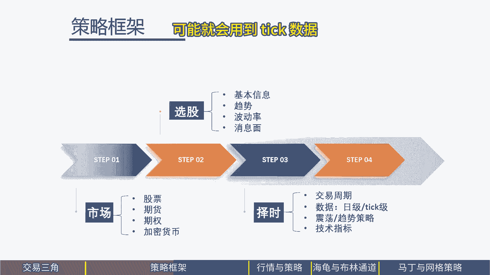

我们从tick级的数据可以看到，委托买入跟委托卖出的价格，他们的数量是多少。

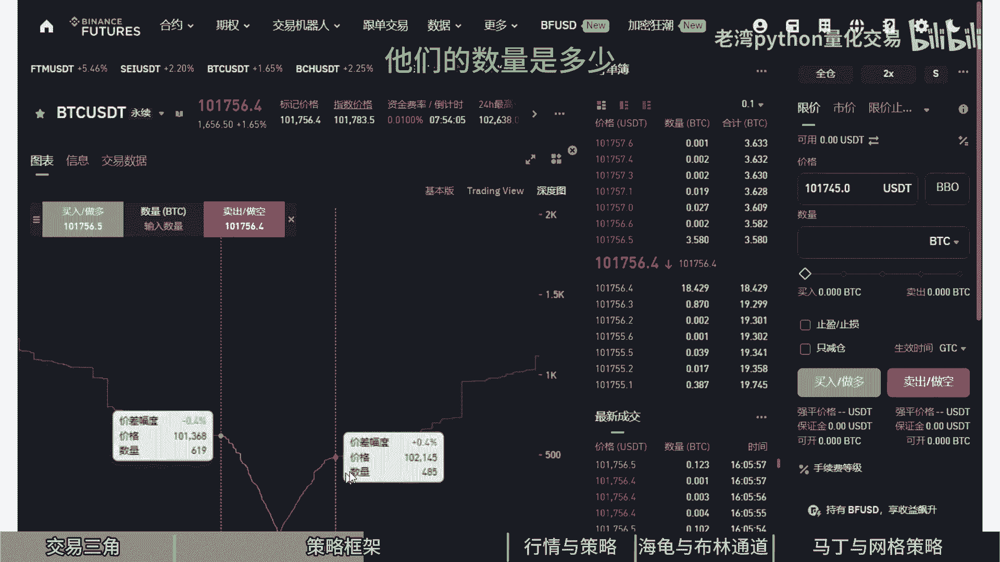

这是交易时的企图心，另外一个指标是这笔委托单，这笔委托买入委托卖出是被责任成交的。

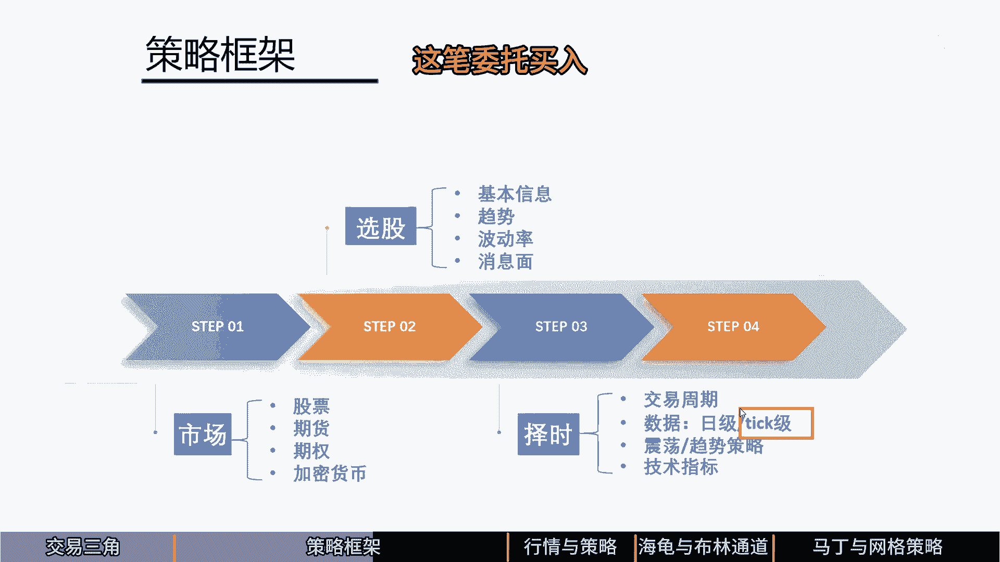

当你挂买一买二买三的时候。

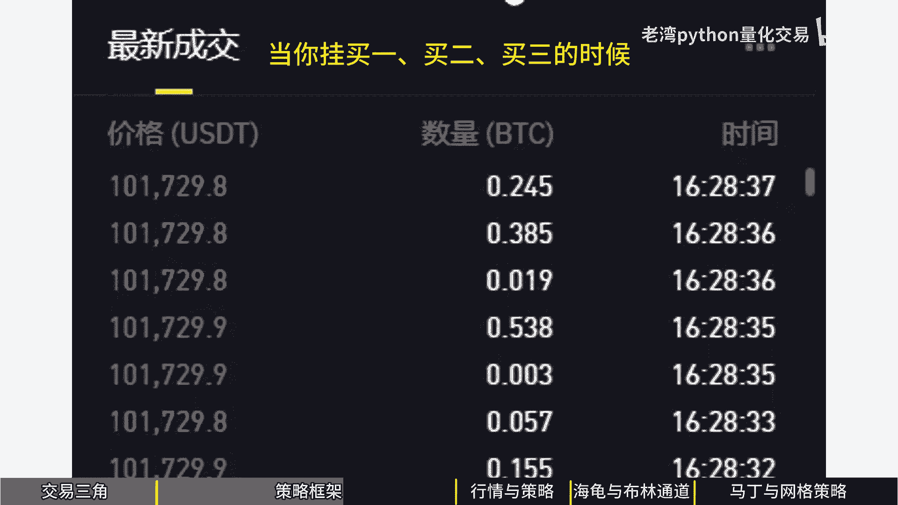

对方用你的价格成交的时候，就是卖方成交，因为对方积极的成交，这比，所以我们可以从不同的行情数据里面，挖出不同的信息指标，这都是我们参考的数据，所以tick级的数据可以挖出更多数据。

最后面一个问题是如何去分配我们的资金，因为资金你可以做单一的标的，或者是做多个标的，同时定的目标呢有三个五个十个，20个以上，另外进场策略我是要全仓还是分仓，如果是全仓的话，就一笔缩了，如果是分仓呢。

可能一开始我1/3，三分之一三分之一的下单，我也可以提高我的容错率，在比较低的胜率之下呢，我提高我的赔率，所以这是不同的交易策略，出厂的交易策略还挺多种的，有些是逐步平仓，或者是有些人是全部出仓。

人呢会用到一些技术指标，例如移动止损或者是移动止盈。

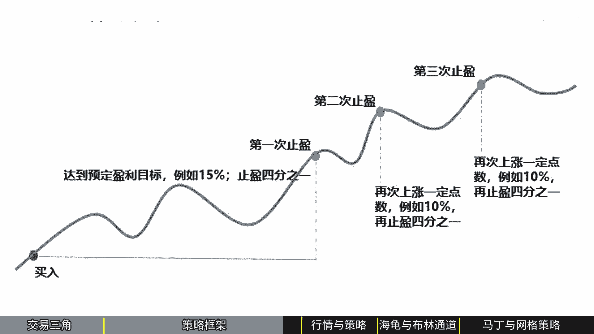

这整套其实是一套完整的量化交易策略，每个同学都可以找到自己比较合适的交易策略，并不是接触股票，所以你做了股票，不如是你做了期货，所以你就一直在做期货，因为有些人想做加密货币。

每个人都可以找到自己合适的交易品种。

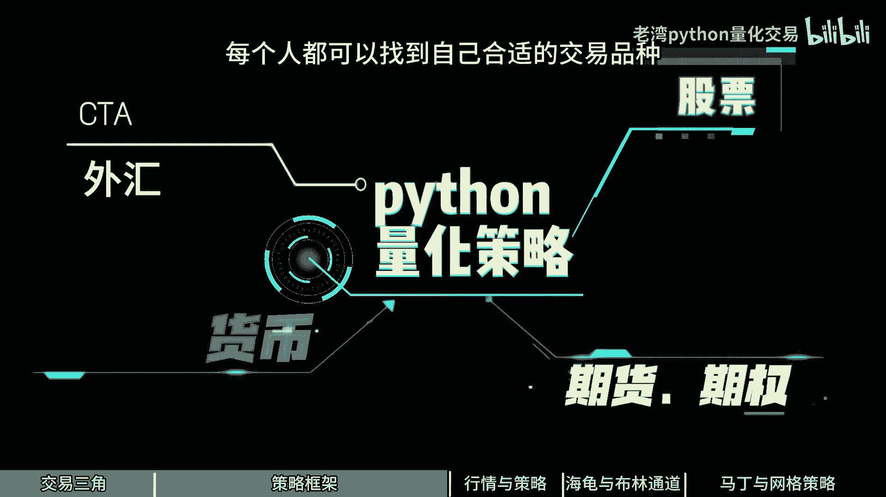

另外我们要聊一聊策略与行情，因为很多同学在做交易及策略的时候，我们都没有考虑到自己的策略，是做趋势策略或者是做震荡策略，我们把人性考虑进来，跟对于未来预测的不确定性的时候。

不管是波动率或者是趋势有一定的看法之后呢，我们可以选择一个比较合适的交易策略，这是我们在做城市化交易量化交易的时候，通常都需要考虑的问题，因为对于未来它是一个未知的，既然是未知。

我做的各项交易就存在一定的不确定性，那如何透过这些技巧可以降低我的不确定性，或者是我的收益呢，我今天跟同学介绍两个维度下面的交易策略，第一个维度是趋势或者是震荡，如果这个行情是走趋势最简单的方法。

那就是赶紧跟上，如果是震荡反复在一定的范围之内呢，上上下下，你必须在它往下跌的时候买入，往上涨的时候卖出，再做一个区间操作，这有点像是之前做题，另外我们要考虑到容错率的问题，如果呢你目前看到的标的。

你觉得现在就是爆发式的起点，那么你可以全场进。

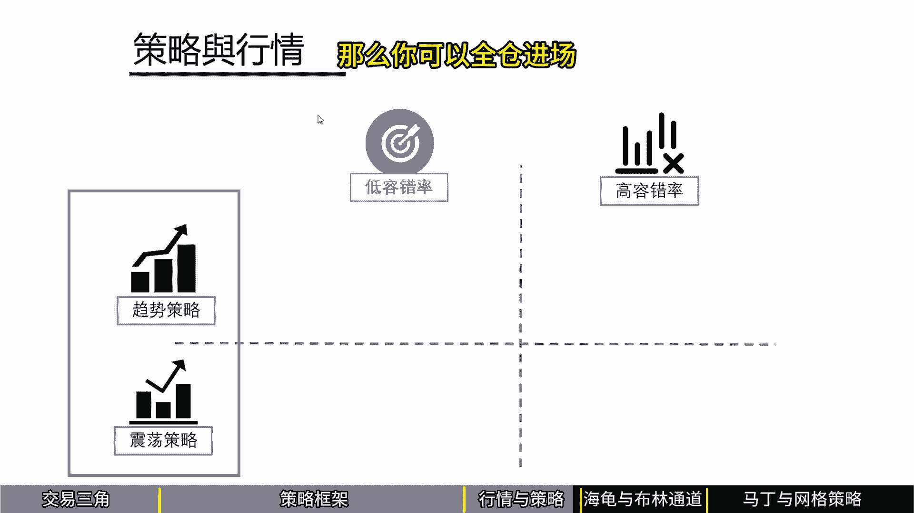

但是呢如果你做错，会降低你的容错率。

第一套策略是海归策略，海归策略就是，当整个趋势突破了最近新高的时候呢，就是进场时机，如果往下跌破最近新低的价格的时候，就是出厂，它是一个低容错率的，因为你赌那么一次，而且是全仓的堵路的胜率会降低很多。

这是一个低容错率的趋势策略，我们刚刚讲的是是走出一个趋势，一直往一个方向，可能是往上或者是往下有一个比较明确的趋势，但是常常会遇到的是，它在一定的范围之内呢，波动涨了也会下来，下了又弹上去。

在这种情况之下，我们会使用一些买低卖高的交易策略，布林通道是一个代表，当你的交易标的往下跌的时候，跌到一定的幅度的时候，我们就进场，如果你有持仓，而且它又涨到一定的幅度的时候，你有一定的获利的时候。

我们就出场，透过上下买低卖高这样的空间操作，我们可以维持我们的获利，我们刚刚介绍了海归策略，一把就全下了，他的胜率呢会比较低一点，有没有一种方法，如果拍的方向是对的，把我的单子拆开到好几个小单里面。

透过我降低的胜率，拉高我的获利率，海归策略与布林通道策略，都是每一次只做一次的交易。

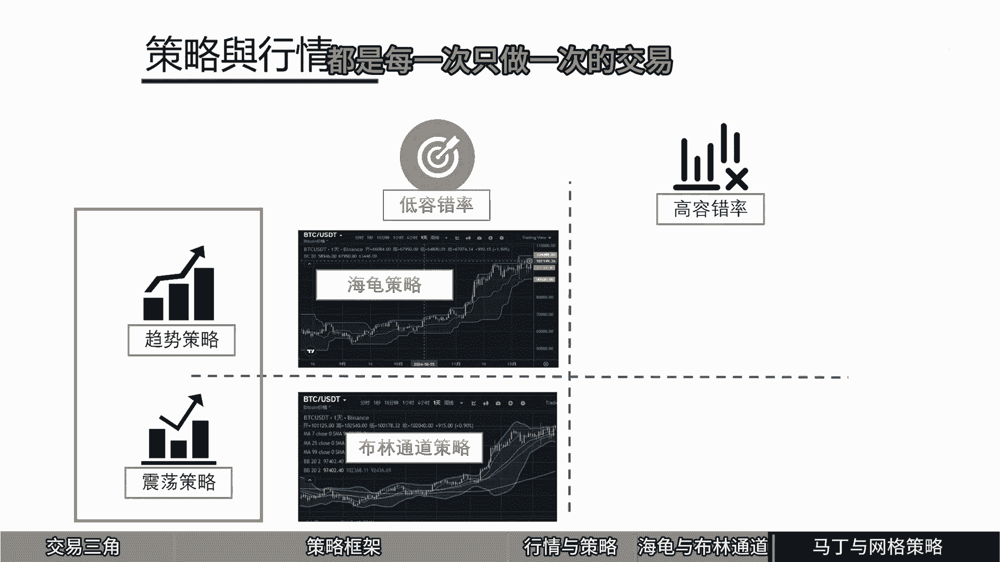

也就是他全部都是梭哈了。

这个马丁策略呢，他就是如果你赔到一定的程度的时候呢，我就持续的加仓，一直赔，我就一直加，一直赔，一直加，直到整个价格的回升的时候，刚好能够弥补我之前的部位的亏损，只要有一次比较大的反弹。

就可以把自己亏损全部弥弥补过来，这是透过仓位控制来提高我们的容错率。

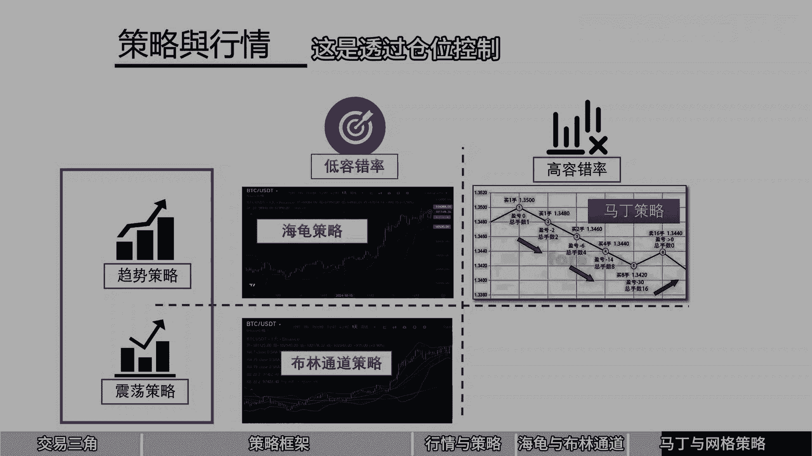

那布林通道呢也是有类似的策略，最经典的就是网格策略，如果是一直往下跌呢，就是买买买，如果往上涨呢，我就卖卖卖卖卖跟马丁策略的差别在哪边呢，马丁策略呢，就一直等到整个价格低到不行的时候，反弹。

那么他赚的是那一波，但是网格交易策略呢它是一个震荡策略，也就是我预期目前的波动率是在一定的范围，可能上下五个点，只要它达到一定的点时候呢，点例如说2。5个点是都加仓或者减仓一次，透过分散我的交易。

把所有的交易分散在不同的交易时机，提高我的胜率，虽然我会降低我的收益率，但是我的胜率会大幅的提高，能够降低我的风险，用马丁策略往下跌就加码，但是呢这个策略呢需要心理非常强大的交易者。

因为通常遇到往下跌持续的加仓，这需要相当大的勇气，前几天我在油管上面看到一个币圈的大佬，他的底层思想就是大饼，他不会跌到零，所以往下跌就买，往下跌就买，他这个信念呢支持着他一直在做法定策略。

往下跌他就加仓买，这是他的信仰，但是呢我们一般人在做这样的交易策略的时候，我们是不是有这样的毅力跟信仰，当我的标的一直往下跌的时候，赔钱了再加仓，这是一个相当大的难度，那我们通过一个宏观的了解。

知道我们在做城市化交易，做量化交易的时候，要关注到哪些点，特别是我们这整个交易框架里面，包括了你要选择合适的市场，包括了你要选择合适的交易标的，或者是带搭配选股选择策略，最后搭配到仓位的控管。

这才能达到长期性的稳定收益。

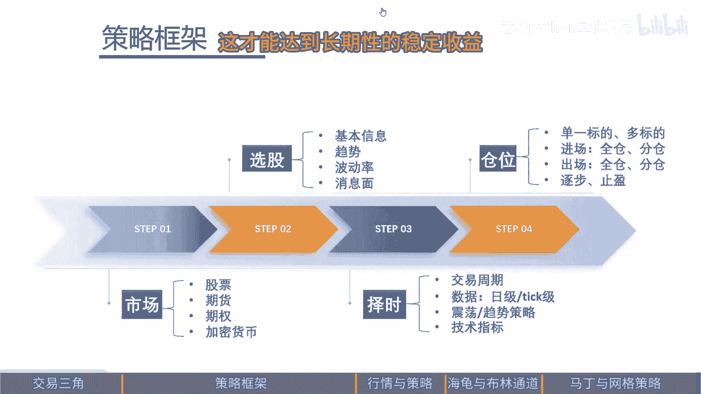

今天的分享先到这边。