# 量化交易零基础 第二十一课 程序篇6 python基础4 - P1 - 户大叔 - BV1PxvsedEaw

大家好，本次是量化交易零基础的第21课。

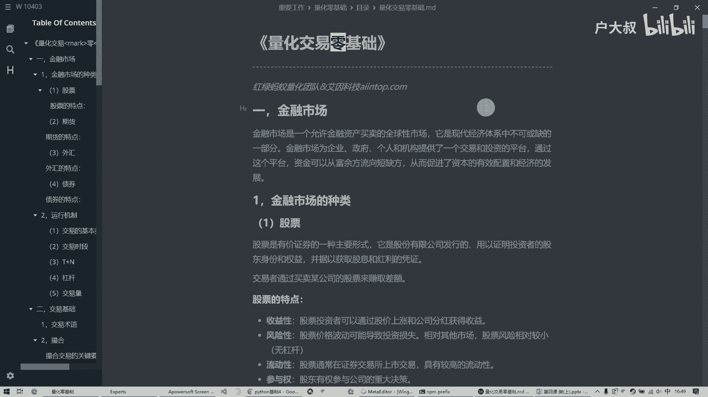

那本次课程呢，咱们继续呢来说一下这个Python的基础啊，本节次本本次课呢主要是讲这个面向对象啊，这个我们之前的呢，包括我们上前几节课呢讲的这个呃，都是这种顺序执行的，也就是说呢。

你看我这个文档里面都是这么一行一行的，这么顺序执行啊，这个呢是以前C语言啊等等的这些啊，他们的这个呃这种执行的逻辑，那现在呢已经到了那个面向对象的时代呢，像C加加java，还有这个Python呢。

他们都是面向对象的啊，他们呢是一个以一种呃更接近人思维的，这么一个方式呢啊来进行开发啊，所以说呢，他这个面向对象是一个非常划时代的意义啊，我们现在的程序呢基本上都离不开它啊。

啊那借用一句这个java之父的这么一句话呢，啊就是万物皆对象啊，那这个对象到底是什么意思呢，我们先说一下这个类的概念，类是什么意思呢，类呢就相当于一个类型，它是一个抽象的概念啊。

就相当于说呢我们之前的那个，比如说我们创建一个变量的，它呢只是指定的那几种类型，比如说是一个整形的一个字符串的，或者呢是一个字典，那么现在呢我呢想自己创造一个类型，然后这里面呢包含了很多的变量啊。

我们这个类在类里面它叫属性啊，还有甚至呢我把一些函数呢也都放进去啊，整个呢放在一起叫做这一个类，这个类呢就你可以认为它是一种类型啊，就相当于是一个字典类型，一个INT类型啊，这么一个概念。

它是一个抽象的概念，那这个类定义好了以后呢，我们怎么用呢，我们必须把它就实例化，实例化，这就叫做对象，实例出来的就叫做对象，对象呢就是类的具体的表象啊，那咱们举个例子吧，比如说狗狗就是一个类。

而这个我特指呢邻居家二哈那条狗，那这个就是这个狗这个类的一个对象啊，可以这么理解，或者说呢咱们可以这么理解啊，比如一个类型呃，咱们之前学过的啊，一个A变量，A变量呢就是一个对象，它的这个变量呢。

它的类型呢可能咱们指定它是一个i int类型啊，这种的啊可以这么类比啊，当然这个概念有稍微有点不一样啊，这个呢就叫做这个类啊，那我们定义类呢实际上就是一个写一个class，然后再写一个类名。

这个类名呢规范呢根据之前的这个对象，就是这个呃变量的这个规范是一样的，但是我们一般呢都会第一个字母大写啊，这个是这个类的定义，然后一个冒号里面呢就是类体就是一些定义啊，这是一个简单的定义。

那咱们看一个具体的例子，我定义一个animal类，就是动物类，然后呢这里面包含了一个属性，这是一个字符串的变量name，然后呢又定义两个函数啊，这个呢在类中呢这种属性呢。

呃我们这个这个变量呢一般呢就叫做属性啊，这种函数呢一般叫做类的方法啊，就是说名字不一样了，但实际上就是概念都一样，然后这个这个方法这个定义里面呢，我们一般都会写一个self。

这个self指的是这个类本身啊，这个呢我们不不用去管，就是它呢它呢调用这个类里面的这些啊，这个属性呢直接插就是self点name，哎，哎就是它啊，这样的话呢这个当然我们在调用的时候呢。

这个参数是实际上是无参的，不用去管它，把它传传进来，一个一个什么自己类类型什么的，不用这么着做，这个程序会自动帮你做啊，这个定义好以后呢，咱们执行一下啊，它呢没有任何输出，因为它只是一个定义。

那么我们呢可以这个创建这个对象，就说以它呢哎后面加一个括号，这是类名吗，括号给一个变量，这个A呢就是animal这个类的对象了，那它呢可以用一个点呢调出它里面的方法，然后呢B呢我们也创建了一个。

它呢也是这个animal的对象啊，他那个点name啊，就可以改改变这个啊它里面的一些属性啊，改成一个B然后呢也掉这个E，然后呢现在呢我们把这个A跟B呢，A的这个eat这个调用的是叫动物在吃东西。

就掉的是这个函数吗，啊掉了它，然后呢B呢我们改了它的名称了，所以呢他就是B在吃东西啊，然后我们又把这个AB这两个，这个对象都打印一下，它能告诉你啊，这个呢是一个啊什么类型的。

那它们是animal这个类的对象，然后呢他在一个内存中间内存中的地址，这个地址呢你看这两个是不一样的，也就是说呢我们呢创建的对象，这个类是在内存中定义好了，它是一个位置。

它这个他这个类呢它只存放在内存中一个位置，但是呢它呢可以创建无数个它的对象，每一个对象呢占用不同的空间啊，这个呢就能看出他们这个类和对象的概念，然后呢还有一个叫做构造函数，构造函数的意思呢。

就是说呢我们现在的创建呢，只能算用这种默认值，然后呢后面呢再去改，这样呢有点麻烦，那咱们呢写一个特定的方法，就是这是两个下划线，这后面也是两个下划线，然后跟一个INIT，然后呢定义好了以后呢。

咱们可以加参数，这三个参数呢就会传到这三个这个属性上，这么写，这么self在这个哎这个构造函数里呢这么写，self点这个name呢等同于这个这个name是一样的啊，然后呢把这三个参数呢都给它们赋上值。

这样的话在创建的时候呢，我就已经给他们三个赋上值了，然后这还写了一个about函数的方法呢，他呢就是打印出来，那我们呢来执行一下，哎你看呢我们呢在这个person这个类。

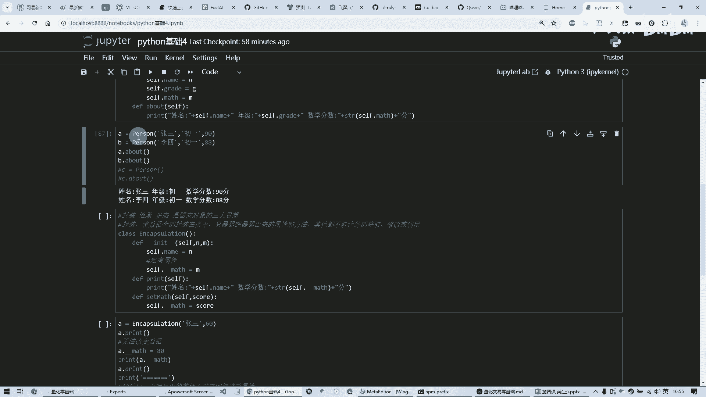

就是我们在定义这个类的时候呢，哎给它呢直接三个初值啊，他的这个年龄，他的年级还有他的数学的分数，然后呢调完了以后他就能打印出来啊，这是两个不同的对象，但如果说我们这么写就不行了，这是一个就像上面似的。

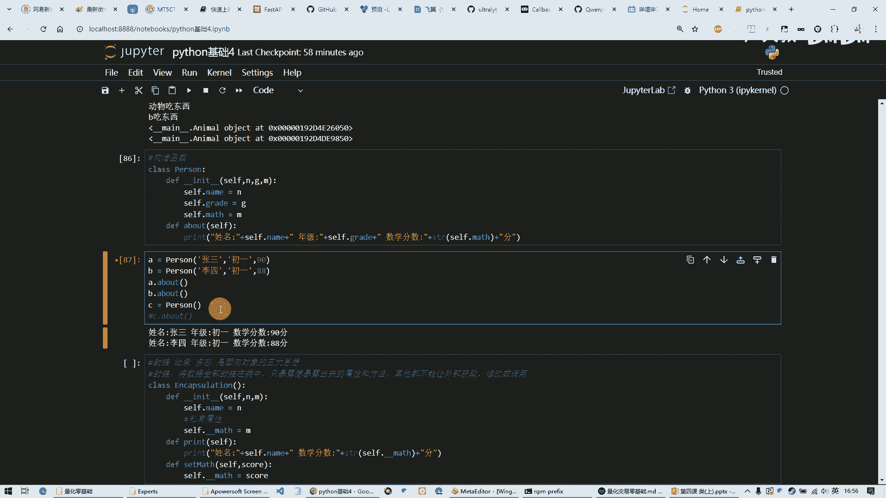

我们直接写这么1animal这么调，这是一个无参的，哎，这样的话它就会报错，为什么呢，是因为他说呢我需要三个这个参数，你没给我啊，这个呢就是要注意。

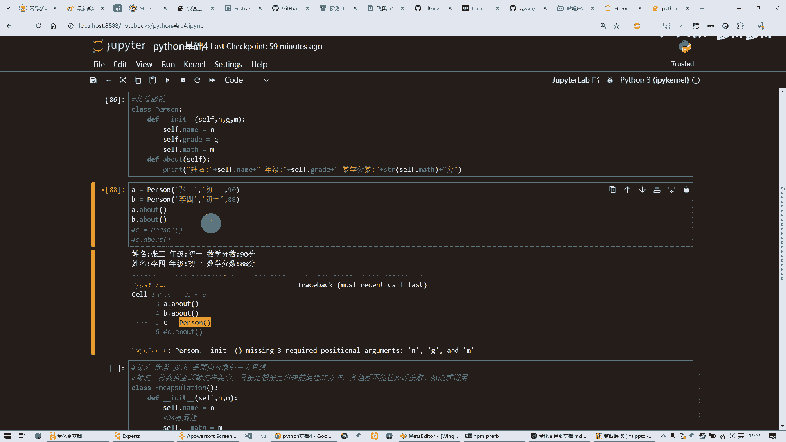

也就是说呢我们在这个赋初值的时候，就就这个在创建的时候必须给它赋初值。

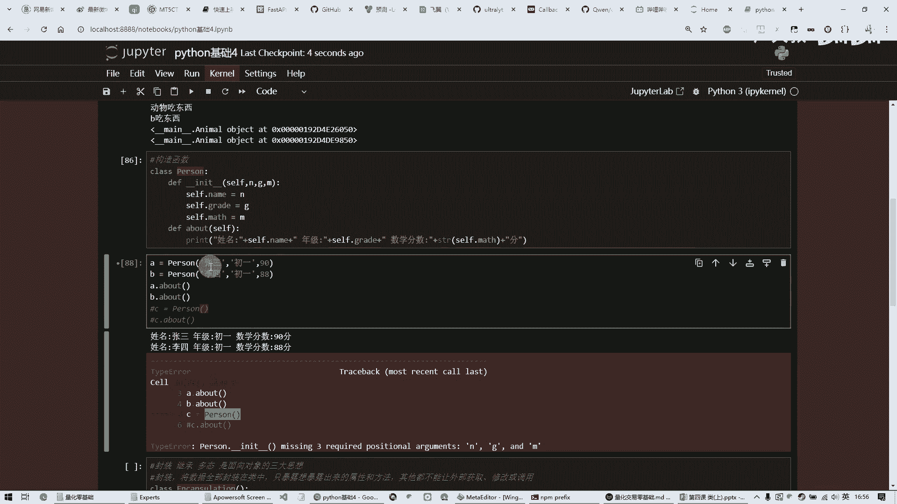

啊，然后呢，呃封装继承和多态呢是面向对象的三大思想啊，也就是说呢我们要做这个啊，面向对象的这种开发呢，必然呢会有这三个呢思想，第一个呢是封装性，封装性是什么意思呢，它呢将把这些数据呢封装在一个类中。

只暴露想暴露出来的属性方法，其他的不能让外部的去修改啊，什么意思呢，我们写了一个叫做封装这么一个类，然后呢他呢有两个这个属性，一个叫name啊，然后呢这还有一个俩下划线，这么写呢。

就代表它是一个私有的属性，那私有的属性呢啊我们的在内部，就这些函数呢是可以给它修改呀，啊给他这个打印出来啊，访问这些都没问题，但是呢我们在外部的时候，在对象的时候想改是不行的。

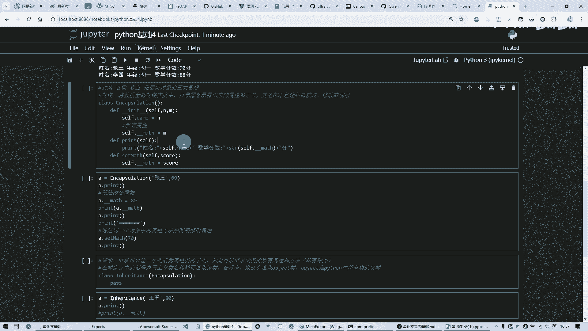

好现在呢我们定义好了以后呢，我们呢创建了一个这么一个封装类啊，给他传了一个张三六十分啊，可能是觉得他这个分数呢将将及格，所以呢他呢不想让人知道，所以他这个数学分数呢。

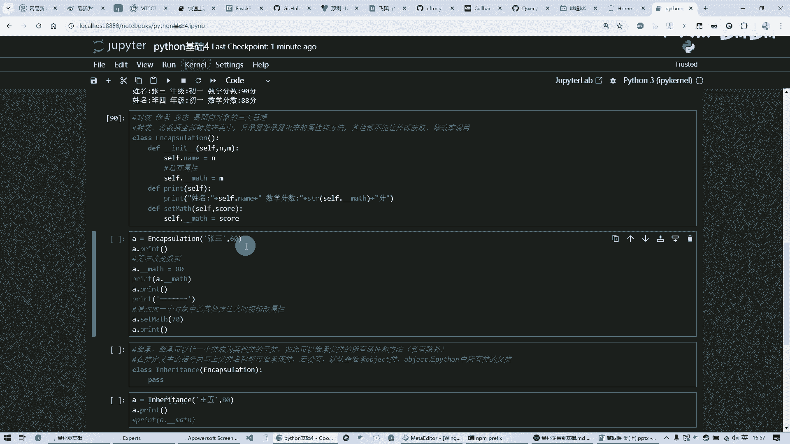

他呢啊变成一个私有属性，那现在我们的A点print就打印，就调这个方法呢它呢能正常能输出。

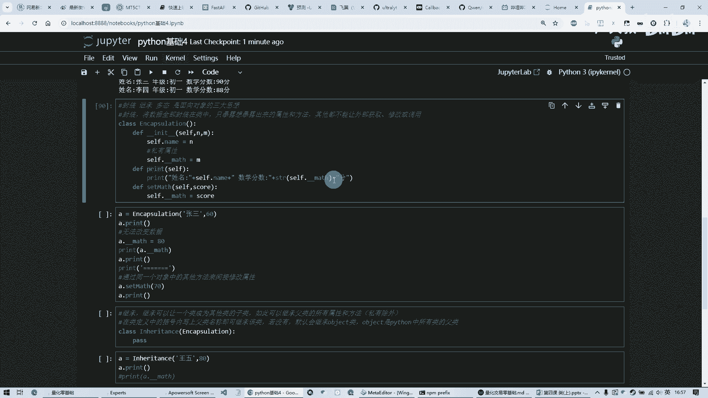

但是呢我们现在呢能把它这个这个分数给改了，并且打印出来，然后再调用这个print，咱们来看一下这个效果，哎第一次呢是60分，然后呢这我们也打印了，我们改了改成80了，但是我们一调这个print呢。

诶他怎么还是60，也就是说呢他这个属性呢是改不了改，改变不了的，那我们想改怎么办呢，我们呢就写了一个叫做set max这么一个方法。

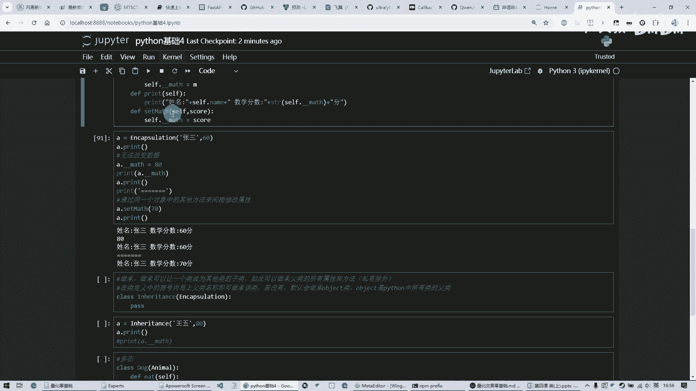

然后传一个外部的这个分数给他，然后从内部改，因为在类的内部是有权限去访问这些属性的，它呢相当于是通过一种间接的方式呢来修改它。

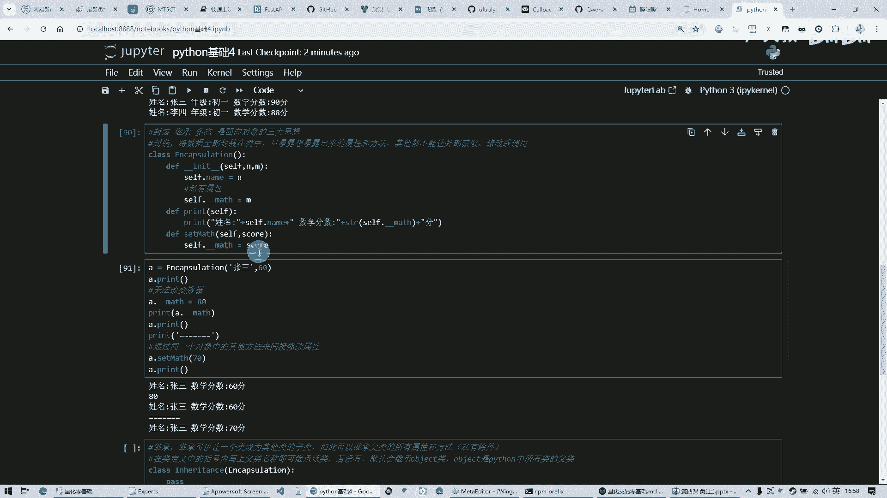

然后这样我们给它调这个方法呢给传一七十，然后再打印呢，最后他就被改了，他这个打印的是70分啊。

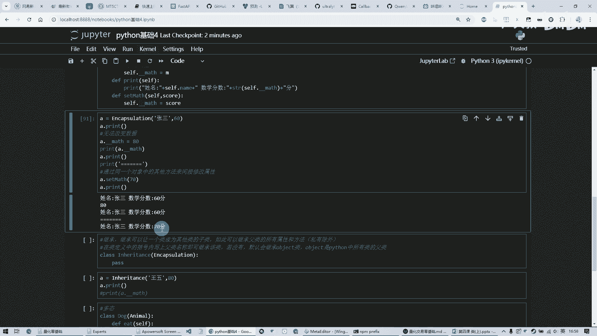

这就叫做封装性，封装性主要体现在一些呃权限控制上，就是有些东西呢我不想让别人去修改，只能我内部的一些逻辑呢来修改啊，这样的话可以用这个封装，然后呢继承呢顾名思义嘛，就是儿子继承父亲嘛啊。

就是让一个类呢可以继承其他的类，然后这样的话呢，这个子类呢啊，他呢就是能继承这个父类所有的属性和方法，但是呢私有的不行啊，也就是说这个啊，我们呢写这么一个叫做继承这么一个类，然后呢，他这个括号呢里面呢。

写上这个要继承的这个类名，这样的话相当于是我们这个类呢就继承了他了，然后我们这个类中什么都没写。

然后呢我们呢可以调用父类的这个构造函数。

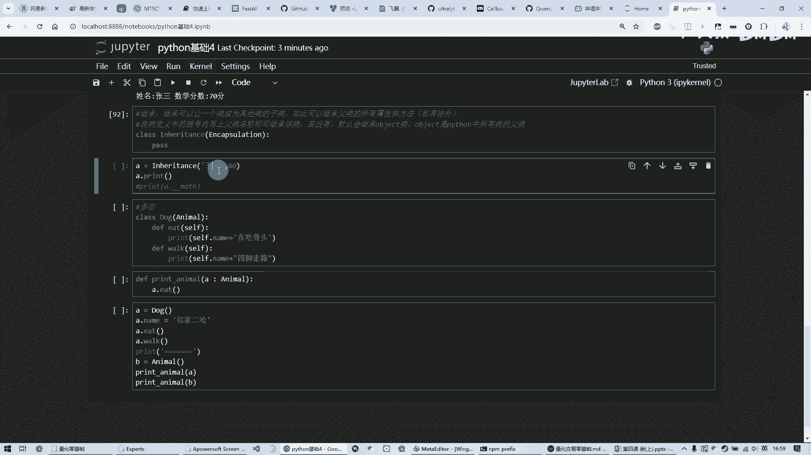

也可以调这个父类的这个print。

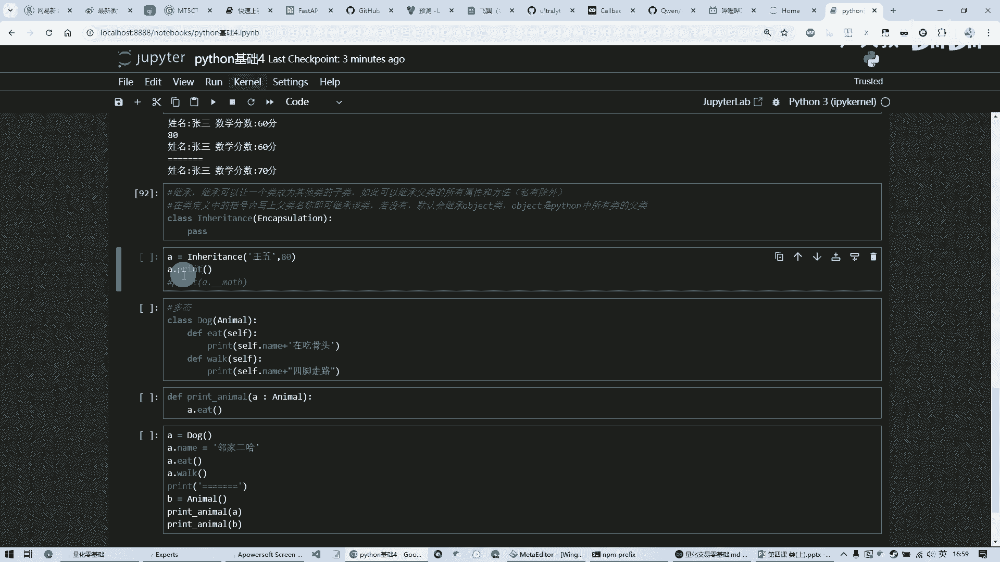

这个方法，也就是说这个print还有这个构造函数都可以用，哎这样是没问题的，但是呢我们如果说这么着就不行了，因为这个这个是这个属性呢，是父类里面私有的属性，然后呢我们继承过来以后呢。

啊这个属性我们是没有的，这个呃你看啊他这个是不行的，它提示说呢根本就没有这个属性啊，他这个的意思呢，就是说呢啊谁都有一些自己的小秘密是吧，有些东西呢可以继承给后代，有些东西是没法继承的。

只是有自己的是自己的东西啊。

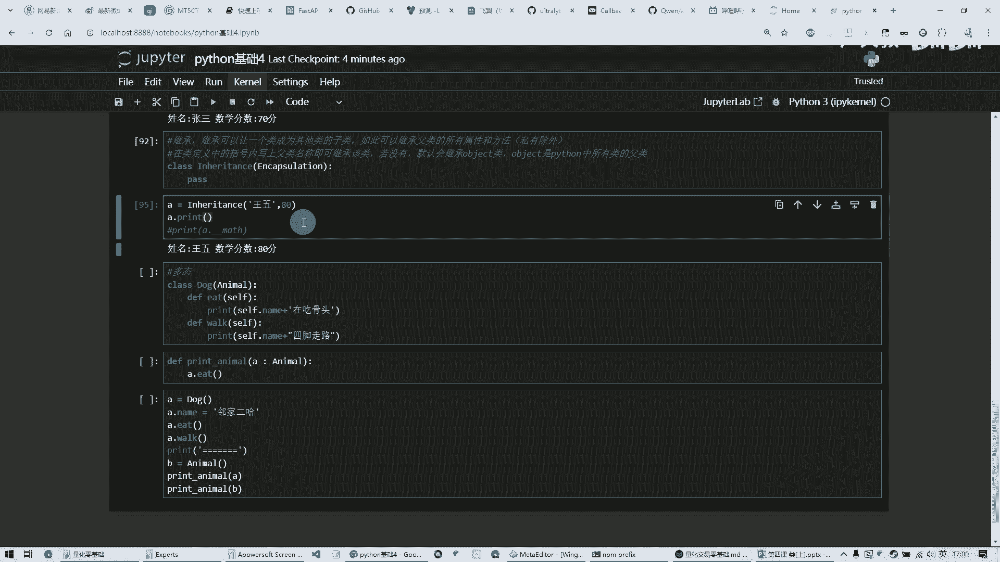

这个继承不了，所以说呢他这个呃这叫叫做这个继承啊，最后一个呢叫多肽，多肽这个概念呢是比较一个非，这是面向对象的思想，我觉得是一个最重要的一个思想啊，就是说什么呢啊我呢继承了一个父类。

然后呢我呢又定义了一个这个函数，然后呢我呢传递的参数呢必须指定呢，必须是这么一个父类的这么一个类型，也就这个就是一个变量啊，加一个冒号，后面跟一个这个类型的名称啊，就代表呢我这个参数必须这个A呢。

必须传这个这个指定这个类型的，这个类型的才行，否则就会报错，我肯定不能传个字符串啊，INT啊什么的，然后呢我这个dog这个类呢继承了这个animal呢，然后呢我还能把它的两个吃跟走。

这两个方法呢全部改写，覆盖掉，覆盖掉这个父类的方法，这样是可以的，改变以后呢啊因为他是dog嘛，他是四条，他是四条腿嘛，所以就变成四条走路，它吃呢也是吃骨头什么的，所以呢这个呢就更具体了吧。

然后这样的话呢呃我们呢先呢执行一下，然后呢也定义一个外部的一个函数啊，然后呢我们呢创建一个这个dog类的对象A，然后呢我们可以给给它改名啊，因为他继承了这个animal了。

所以呢他有这个name这个属性嘛，然后起名叫林家二哈，然后调用一下他这个吃跟走，然后呢我们再来一个BB呢，是这个animal类型的，也就是他这个父类的类型的对象，然后呢我们分别调用这两个函数啊。

这样是可以的，哎你看他最后打印的是这个二哈在吃骨头。

在四脚走路，然后呢我们这个B呢，他这个正常打印的还是吃骨头啊，这这个AAA的话还是吃骨头，而在这个B呢调用完了以后。

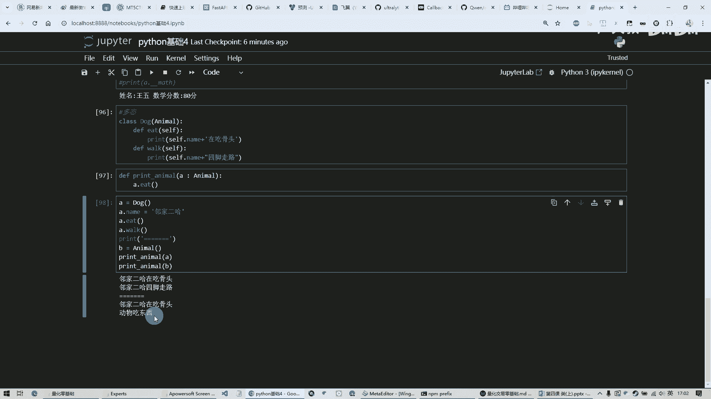

他就是吃东西，也就是说我们最上边的这个吃东西，这个他掉的还是父类的啊。

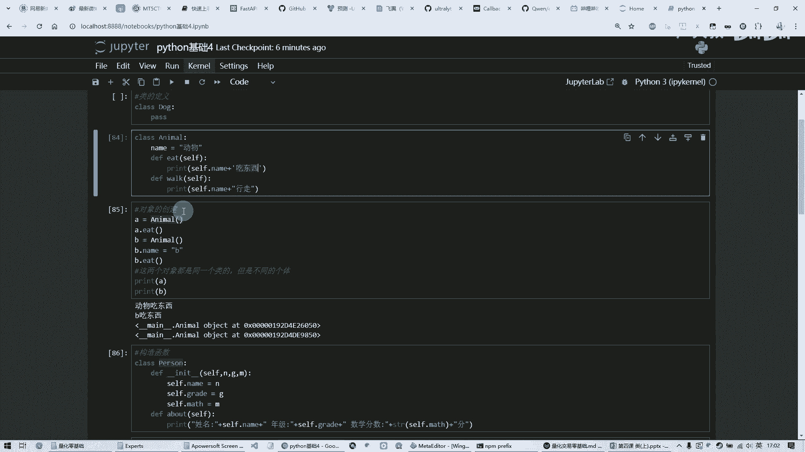

这个呢就是叫做多态性，那这个多肽主要体现在什么上呢，我们呢就相当于是呃比如说有两个程序员啊，一个人呢开发了这些类啊，一个人定了一些业务逻辑的函数，它这个定义这个函数以后呢，里面呢可能做各种操作。

但是我要指定你必须是某一个类型的啊，对象才能做相应的啊处理一些逻辑，然后呢我呢假如说我建立一个工厂类。

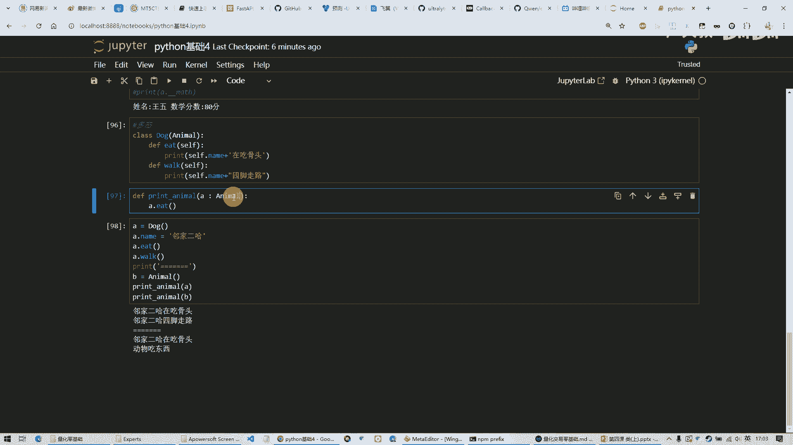

工厂类呢，我呢有一个方法叫做制造啊。

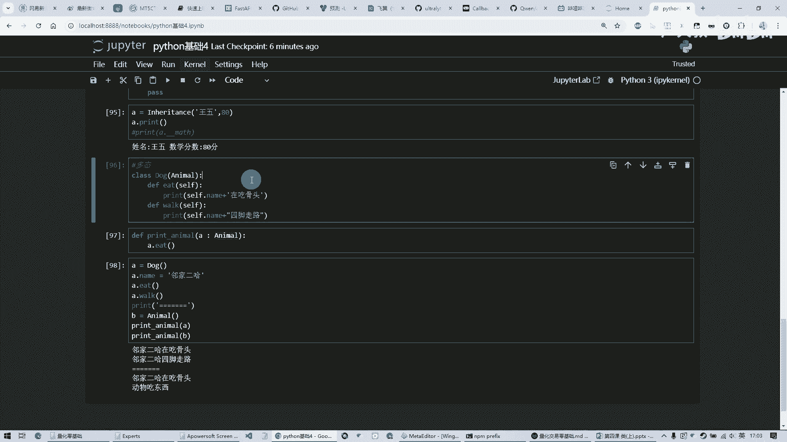

然后呢我呢希望呢我的这个呃某一个函数呢，就只调工厂类的制造，这么一个函数我就定死了，你必须是这么着定义成一个规范，这样的话所有的开发人就是第二个开发的人呢，他只能呢继承这个animal。

就这个继承这个工厂这个类，它比如它起名叫手机工厂或者叫什么汽车工厂，然后呢他继承了他以后，写改写他父类的这些函数和这个数据，完了以后呢，他们呢都能统一的被调用，被这个业务逻辑所调用，但他们都定死了。

所有你你你这个制造的是什么东西，那这是因因人而异啊，就是我这一手机工厂，我继承了这个工厂类，然后呢他都指定的，我到调这个业务逻辑里，都会调这个制造这么一个方法，它制造东西就会不一样。

这样呢就体现了一种一种设计模式的思想啊。

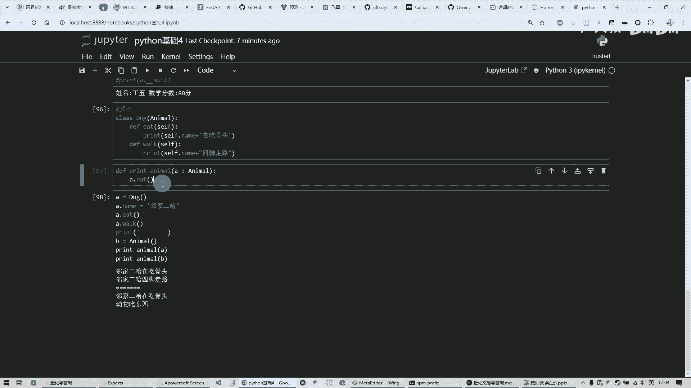

这个呢就是多肽啊。

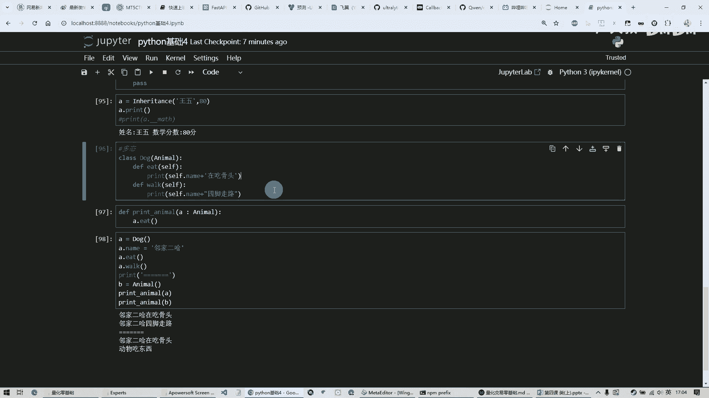

这个面向对象呢咱们就讲差不多了，他这个是其实有点难难以理解啊。

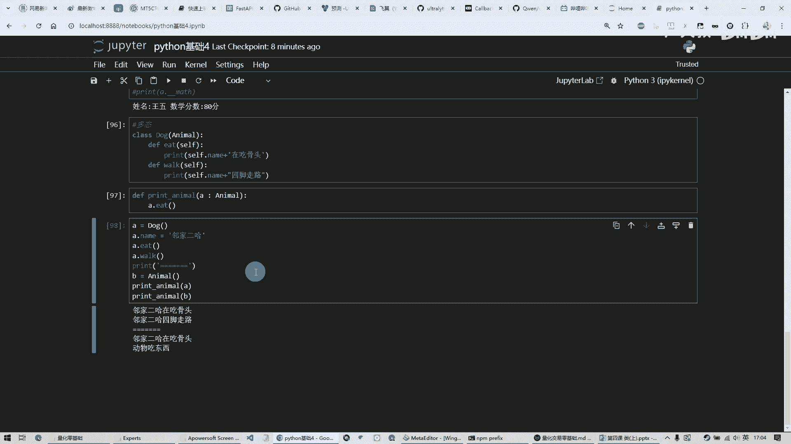

啊在这个慢慢消化一下，再多自己看一看，然后再这个实践一下啊，可能对这个概念就有比较深了，因为这个现在所有的开发基本上呃现代的语言，那除非你是做特别底层的这种开发，像用得用C啊这样的。

现在的剩下的这些开发呢全部都是面向对象的。

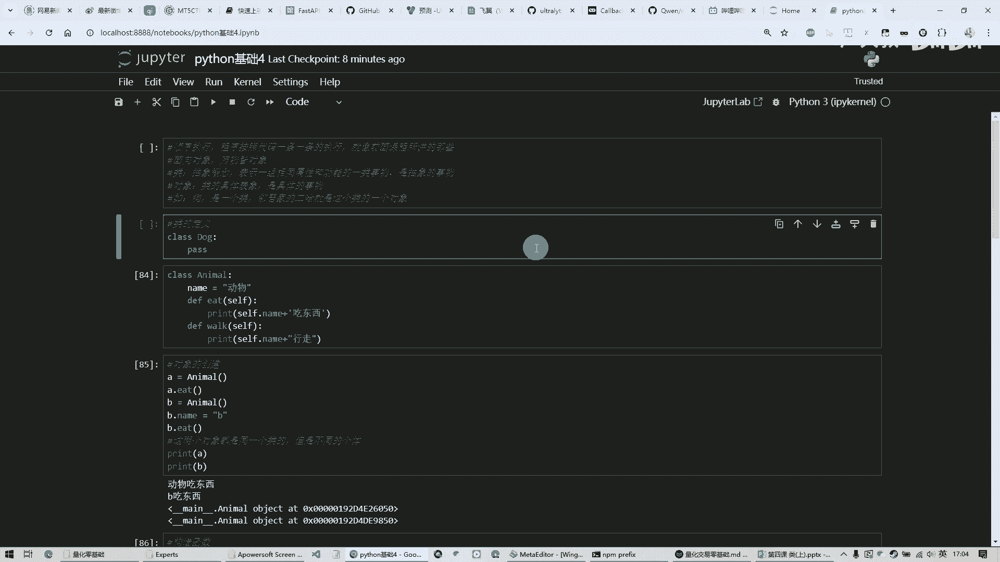

全部都要用到这些这三大特性啊。

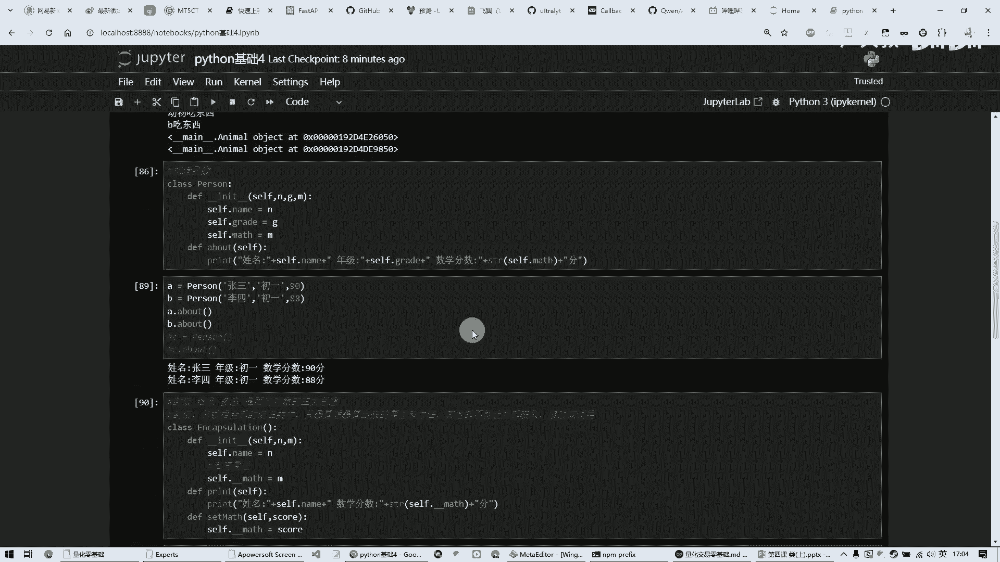

三大思想，所以说呢这个呢是我们必须要掌握的好。

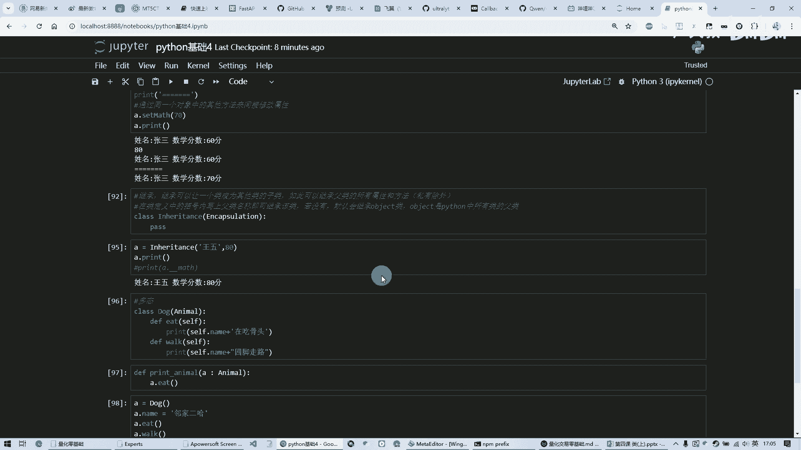

那今天的这课呢就到这里。