# 量化交易零基础 第二十课 程序篇5 python基础3 - P1 - 户大叔 - BV1E1421872N

大家好，本次是量化交易零基础的第20课啊。

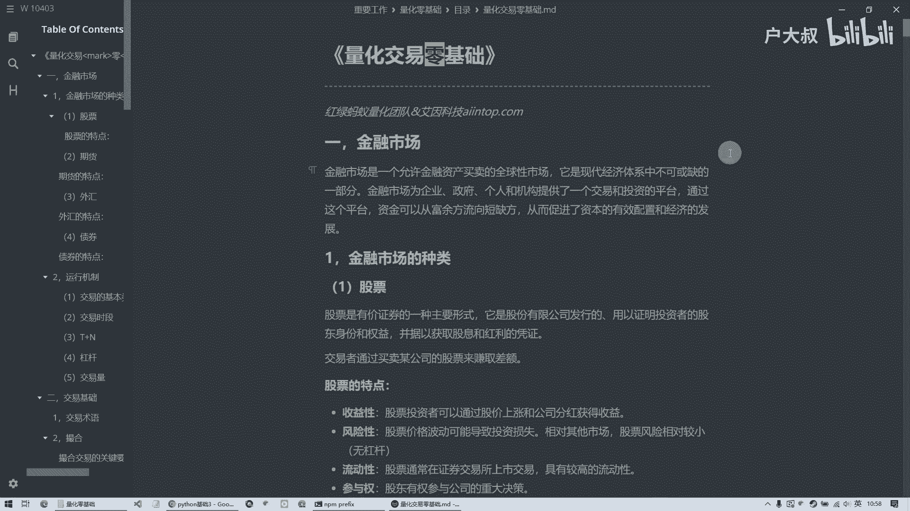

我们继续呢讲这个Python的基础，上节课呢咱们把这个分支循环讲完了，那个是一个非常重要的一个知识点，那本次课呢也是会逐渐的变难啊，然而且这个也是一个非常重要的一个知识点，就是函数啊。

这个函数呢是什么意思呢，就是我呢，如果说嗯经常做一些程序中的这一个功能啊，这个功能呢啊很多地方都要用，那么呢我呢就把它写成一个函数，省着呢，我每一次呢我复制一段代码，然后呢写成函数呢。

我每次呢直接调就行了啊，这个呢也是一种开发的思想啊，比如说几个人一块儿做，那可能第一个人呢他呢负责的是某一块功能，但其中呢可能需要另外的功能，那每个人分工呢，我呢就是我只负责我这块的功能。

中间涉及到其他功能的时候呢，都是那个别人呢啊给他写好了啊，给他写成一个函数，这边呢只要是调用就行了啊，反正呢就是呃这个函数呢，听着呢好像是挺那个呃高大上的，这么一个挺神秘的这么一个东西。

实际上他就是呃做了一个功能好，那我们这个函数怎么定义呢，首先呢就是还有一个关键字叫DEF啊，这个DEF呢空一个格，然后写上函数名，然后呢后面有两个括号，然后一个冒号啊，里面呢就是函数题。

这个呢也是那种嗯，前面呢要这个换行这种缩进的这种的好，这个呢就定义了一个函数，咱们定义一个函数以后呢，咱们执行一下，啊可以看到呢就是任何显示都没有啊，他那个呢只是定义，定义完了以后呢。

我呢就要调这个函数啊，那调怎么调呢，其实就是这一块就是你的函数名，然后呢哎一个括号，然后这样的话他就打印了，Hello，就是这个这块的功能啊，这个呢是一个最简单的无参的，无返回值的这么一个函数。

那我们第二个呢看一下带返回值啊，返回值是什么意思呢，就是很多函数呢，它并不是说只是完成一个功能啊，可能像刚才我们说的这样，打印一个数据就完了，他可能呢啊要经过计算，计算完了以后呢，要返回我们一个结果啊。

这个呢就是它会就会返回嗯，把我们计算的结果呢返回回去啊，这样的话呢，我们这个调用方呢，就会得到这个最后计算的结果，然后呢进一步处理，那我们现在做一个简单的函数啊，啊定义一个A，定义了一个B。

然后呢再把这个A加B的这个数值呢，哎返回回去写一个return啊，这样的话呢它计算完的结果呢就会返回，这个执行完了以后呢啊就相当于定义了，我们呢把它调一下，看一下这个呢就是调一下这个F2这个函数。

然后呢把结果呢，他这个返回的数据呢给一个A变量，然后打印出A，然后最后结果呢就是三啊，他这个呢就是一个简单的返回，返回完了以后呢，你必须拿变量去接住它啊，把它存下来，然后呢进一步处理。

那这里面呢就有一个细节啊，就是我在这个函数里面的定义一个A，然后呢A呢也有数据，然后也有B这样最后计算完返回呢，我这个也是一个A，那也就是说呢嗯我这里面定义了A了，然后这也定义A了，这不就重复了吗。

然后这个会会怎么样呢，其实呢额不会有问题，因为这个函数里面所有在函数体中啊，所有定义的这些变量呢，只要一通过这个最后这个return回去，或者像这种执行完了的话，它这里面所有的变量呢。

它就会自己就会自动销毁，所以说呢啊这块呢是没问题的，也就是说呢这些里面这个A和B呢，它是一个局部的变量，也就是说它在只有在这个函数中执行的，这个时候才有用，然后呢这个函数执行完了。

它这个这些数据就自动帮你销毁了，从内存中就去除了啊，这样的话呢就能帮助咱们这个啊，节省这个内存空间，然后他呢只有返回的结果能返回回来，剩下的这些数据都没有了啊，现在我们就打印的是三。

然后呢这个函数呢还可以带参数，假如说呢咱们做一个简单的A乘以B，这么一个功能闹呢，我呢传两个参数，一个A1个B我告诉他，然后呢这个其他的这个还是函数的定义，然后呢我呢返回呢是A乘以B。

把这个结果呢返回回去，那定义完了以后呢，我执行一下，执行完了以后呢，我传了一个三一个五，那么呢到这个F3这个函数里面了，最后打印的就是15，那就是3×5的结果，这个呢就是呃带这个参数的啊。

也可以带这个返回值的啊，当然了，这个参数呢一定要注意呢，就是它这个顺序一定要这个呃，注意就是顺序必须跟它定义的是一样的，这也是这样的，当然这个可能看不出来，因为他这些都是数字嘛。

但是如果说他有别的类型的话，好几个参数，你的这些调用顺序，一定要跟这个你的这个函数定义的是一致的，否则呢它这个类型就错误了，然后他也没法处理，然后这个呢呃例子呢是它可以带多个返回值。

这个是Python的这个啊，还有几种特殊的语言呢，所一个特殊的一个地方，就是呃如果说像C啊，什么C加加啊，java这些语言呢，它呢只能返回一个数据啊，但是呢Python呢它这块呢做了一个扩展。

它可以把多个数据返回，多个数据返回以后呢，像我们把这个定义了以后，然后呢，这个里面的这个ABC，这三个数据都会被返回回来，那我们调用的时候呢，也是呢给它三个变量，它呢就依次呢把AA呢。

就是把这个A的数据给A了，B的呢就给BB了，C的这个就给cc了，这样然后我们分别打印出来。

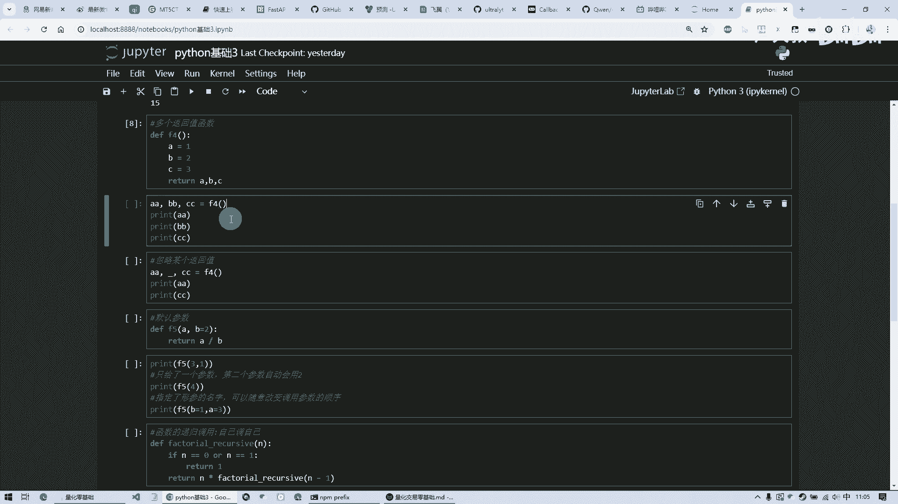

哎这就是这123这个数，哎它呢就在外部呢能够接收到了。

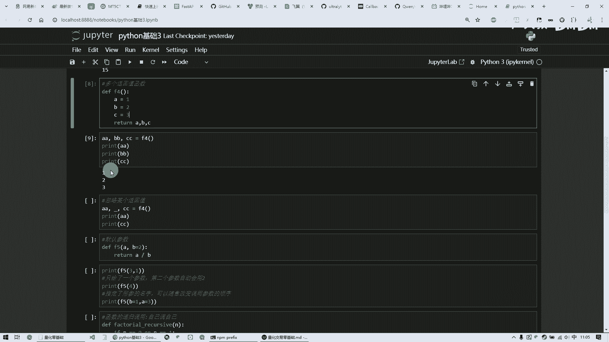

好这个呢是多返回值，那如果说呢有的时候呢，我可能这个这个数据我没什么用啊，我呢但是呢它返回的是三个，我我呢又得按照你的顺序，必须有拿三个数据去接，那这个时候呢我可以写一个下划线。

这样的话呢他呢就会忽略中间的这个返回值，这三个里面的中间的那个就忽略掉了，然后我打印一下AA跟cc啊，那不就是一跟三了，这个B没有啊，这个呢是一个可以忽略啊，这是多返回，然后呢还能不能进行这个默认参数。

就我定了一个F5这么一个函数，我给了呃两个参数，A和BA呢我是必须呢，你必须给我一个啊，我我这个调的时候呢。

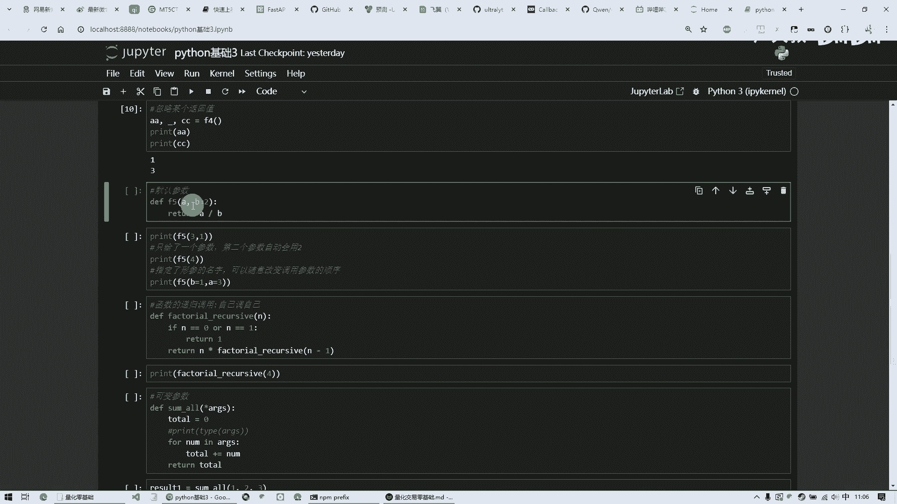

我A跟B我都需要值，否则呢就会报错，但是呢我A呢是一个定义一个变量以后呢，B呢我写了一个等于二，这样的话意思就是说呢如果我没给B这个参数，那么B呢默认呢就用这个二了。

然后最后呢这个里面呢执行的是A除以B，那我们来计算一下这个如果说正常情况下，我们应该给两个参数，那三呢除以一，那如果说呢这种的我四呢就给了一个四啊，那他那个第二个那个B呢就会等于二。

然后这样的话呢就是呃可以实现这个啊，默认参数，也就是说呢我只要给你这个指定的，剩下的我可以用它的默认默认的值啊，也有可能也有一种方式呢，就是我可以这是A跟B这两个名称，我呢想改变一下顺序。

那么我可以呢这么写B等于一，在调用的时候，我指定了这个名称，跟这个定义的这个名称是对应上的，这个呢叫做形式参数，这个实际调用的这叫实际参数，然后呢我这个形式参数这个名称只要能对上。

那我调用的顺序呢可以改变啊，这样的话咱们打印一下看一下。

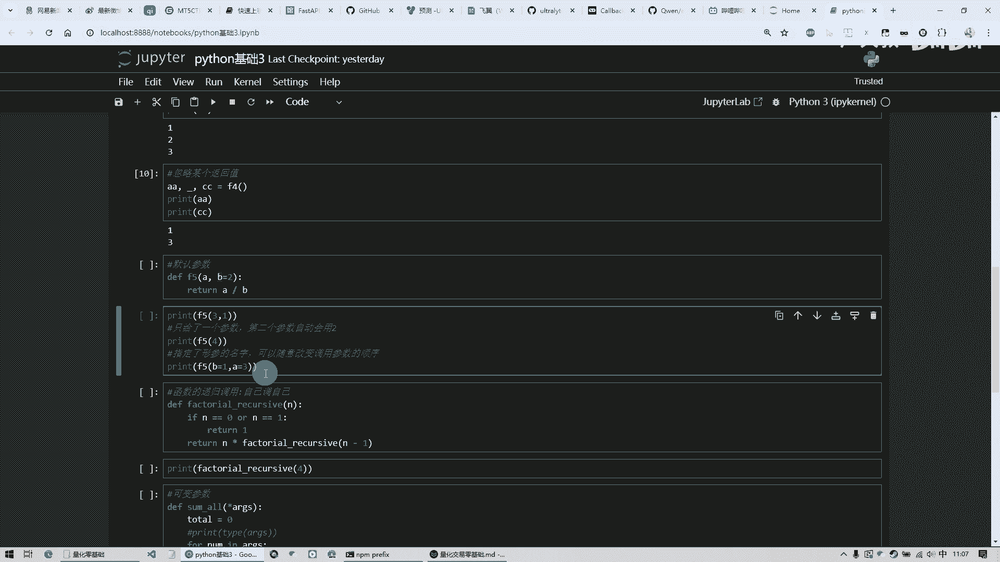

哎你看他这个F5，他就哦，啊刚才这个没执行啊，他那第一个呢是三呢除以一啊，那还是得三，然后呢第二个呢是只传了一个，那四呢除以二，最后就得二，然后这个呢是我把这个顺序变了，那就变成还实际上就是3÷1啊。

最后呢是三啊，这个呢就是函数啊，后面呢我们来说一些比较难的啊，函数的递归嗯，实际上呢就是自己雕自己啊，这个呢是一个嗯比较复杂的一个例子，你看呢咱们这这是做了一个叫做阶乘，这么一个函数啊。

起了这么一个名称，然后呢他呢收一个参数，然后呢如果说这个参数呢它呢等于零，或者说它等于一的话，直接返回一，这个呢叫做递归头，然后呢否则的情况下，那我能返回呢，我这个参数乘上还是调我自己这个名称。

跟那是一样的，然后呢N减一再调一遍啊，这样的话相当于是在这个函数，自己这个函数中又掉自己，然后呢实现了这么一个啊功能。

这个呢就是阶乘，那我们要是四的阶乘呢，唉就是R14，也就是4×3乘上2×1，它这里面调用的就是这样，我这块儿传的是四四进来以后四乘上啊，它这个呢是N减一吗，然后又进减，那这个N呢减了一呢变成三。

三进去以后呢，就是三乘上N减一变成二，然后又掉它，它是二二进来以后就是二乘上减一就变成一，那一的时候呢走走这块了，它直接返回一，返回一呢就跟刚才那个二的那个相乘，完了以后，这个计算完了数据再返回。

然后跟那个三的那相乘，然后再返回跟四的相乘，它是一个自己掉自己这么一个过程，这叫做递归，然后呢这样的话最后呢就哎得出结果，这个呢我必须要有一个递归头，否则呢这个程序就死就陷入死循环了啊。

他必须要有一个终点，然后呢这样的话你才能定义，这样的话你执行的时候才不会出问题，否则它就自己掉自己，然后一直这么循环下去就死了。

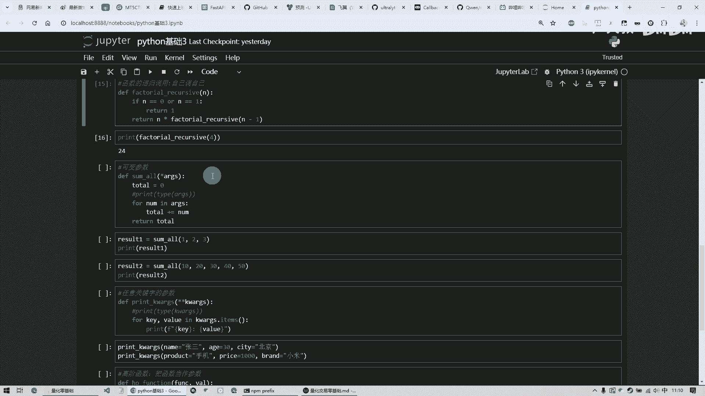

然后呢这个呢叫做可变参数，可变参数的意思就是说啊，我呢这个函数呢我的参数不一定有多少个啊，我现在不定不定的时候呢，那这个时候呢我呢可以写一个星，然后A2JS这个名称呢是大家约定俗成的啊。

其实这个名称这个参数名称呢可以随便改啊，当然一般都会这么写，然后这样的话呢它呢会自动把你的参数，不管是多少个，它呢会组成一个元组，然后呢，然后我这个函数呢就是不管你有多少参数。

我把这些参数所有的数据呢都加总，最后呢给你返回一个总数啊，这个功能就是干这个，那我可以把这个打印，把这一块儿打开，然后呢看一下这个type呢，就是可以呢能知道你这个变量是什么类型的，他给你打印出来。

然后呢这样的话呢咱们调一下，比如我传一个123，然后他告诉你这个呢是一个元组类型，然后呢他把这个一二和三的加在一起，最后得六，然后呢我也可以呢调五个参数，我可以任意多个，然后最后呢他得150啊。

这个就叫做可变参数。

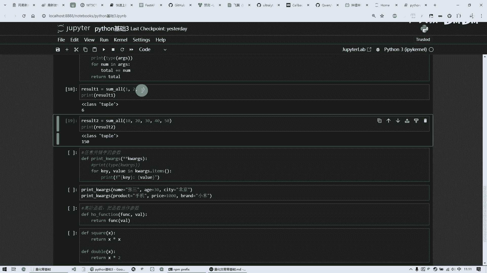

它可以任意多个参数，还有一种呢是任意关键字参数是两个星，然后是KWARGS，啊这个呢也是一个约定俗成的名俗，约定俗俗成的这么一个名字啊，啊它这个作用呢是变成那种名字值对的形式。

也就是说呢它会把它变成一个字典，然后呢我们呢会把你管你输入多少个数据，我呢会用一个循环把它整个都给你打印出来，哎这个呢循环呢是咱们上节课讲的，他呢这个如果说是字典类型的话，它有一点items可以返回他。

这是两个两个返回值给你这个你的这个名称，还有值，就这俩就p value，这是咱们上节课还是上上上节课讲的，然后呢最后呢我给打印出来啊，这是一个啊叫做任意关键字的一个参数，然后咱们调用的话可以这样。

比如说name等于张三，AH等于30，然后ct是北京，或者说呢我这产品呢是手机，然后呢那个价格是1000，然后呢品牌呢是小米。

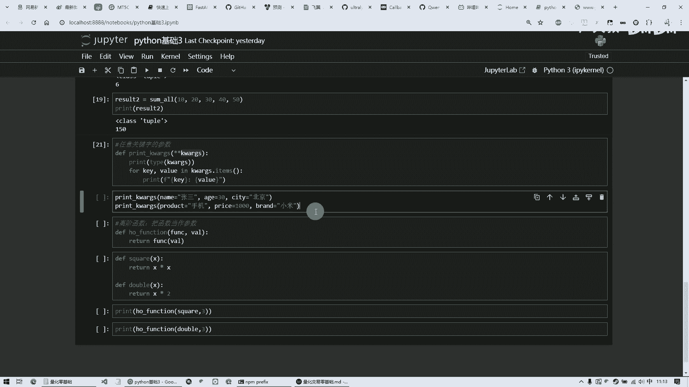

然后打印出来呢它这个类型呢就变成一个字典，然后呢他给你打印出来，你这个名称是什么，你的年龄是什么，你城市在哪。

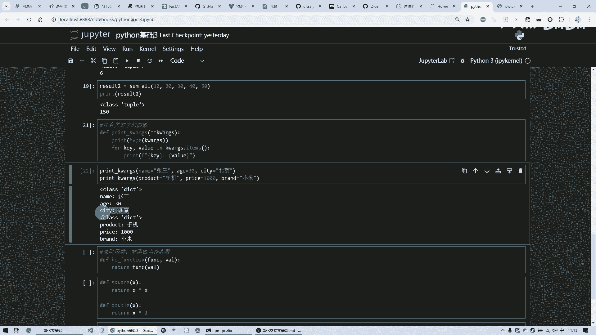

然后第二个这个调用的时候呢，也是啊，他给你，你不管你输入多少内容的，他都能跟你这种名字值对，这种形式他都给你打印出来好。

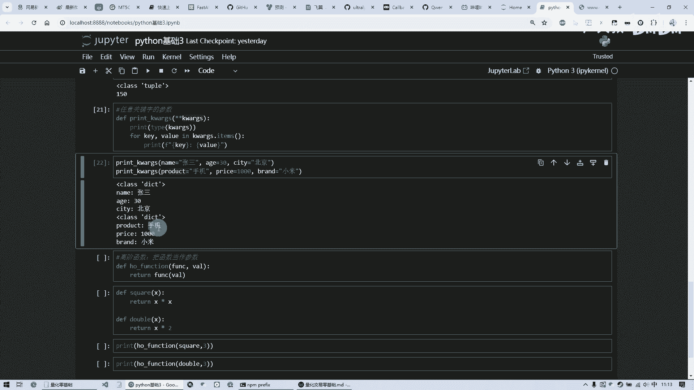

最后一个呢是呃这个高阶函数，高阶函数呢也就是说呢，我这一个参数是另外一个函数，这么着吧，呃也可以啊，这个呢就是比较高级的这个用法，就是说呢我这是一个值，我这个呢接收一个函数，然后进来以后呢。

我就调用这个函数啊，来处理这个值，然后我呢定义好以后呢，我写了两个函数，一个呢是求平方，一个呢是加倍，然后呢这两个函数呢都是嗯接收一个参数，然后把这个数据做处理，然后返回，这个也是接收一个参数做处理。

然后返回，那么我呢我把这个函数名称传进来啊，这是第一个参数，它它这个传递的是一个函数，然后呢我再给他传一个数据，那最后呢得出的是九，也就是说呢他执行的是这个是这个嗯，就是三的平方啊，就是九。

那我呢哦这个呢给他传一个别的这个函数，传一个加倍的这么一个函数，然后最后呢这个给他三呢，他就是六，也就是三呢乘以二，这个呢就是高阶函数，它呢把函数当做一个参数，这么也可以啊。

这个呢是一个嗯比较高级的用法，那今天这课呢就是讲了所有的，基本上所有的这个函数的用法啊，而且呢这个这回课呢就是明显的觉得就难度啊，有提升，当然了咱们在线下呢肯定是要多这个练习啊，多多练习。

那我们后面的课呢会更难啊，然后呢我们呢把这整个的基础都讲完了啊，后面呢咱们就继续讲，这个在股票中怎么进行量化，那今天这节课就到这里。

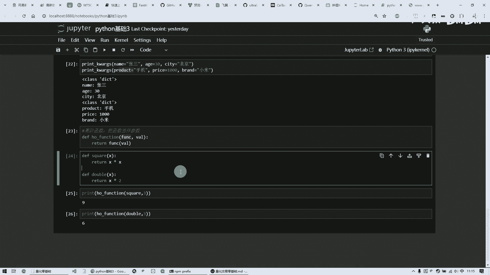