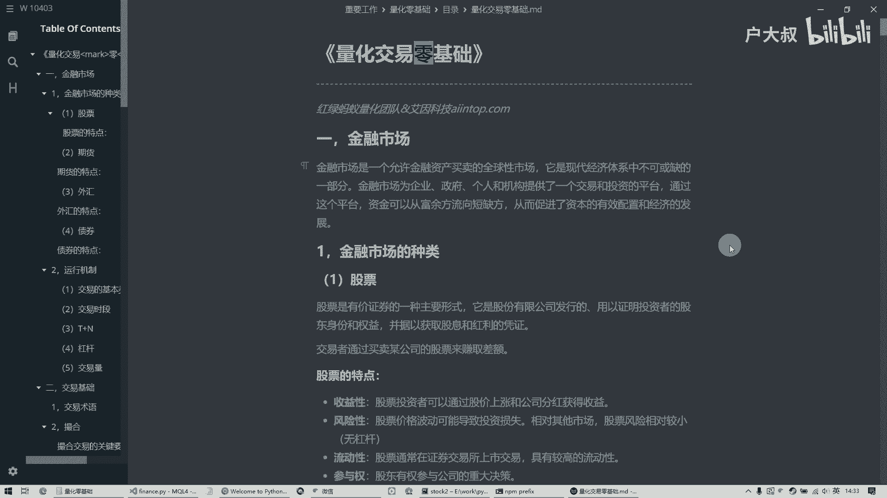
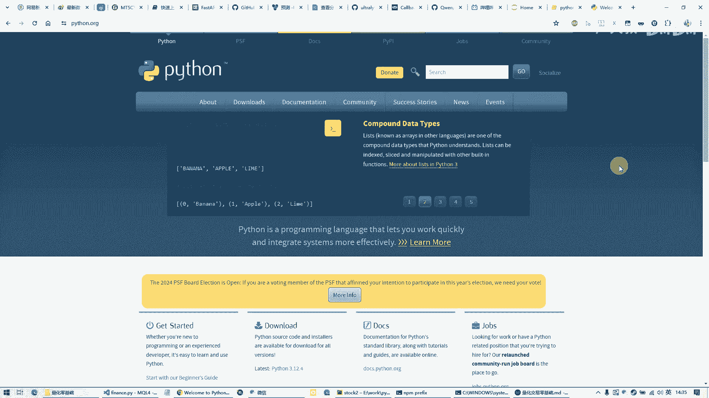
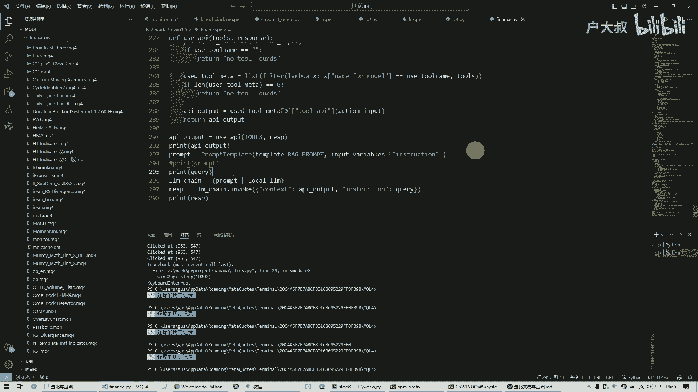
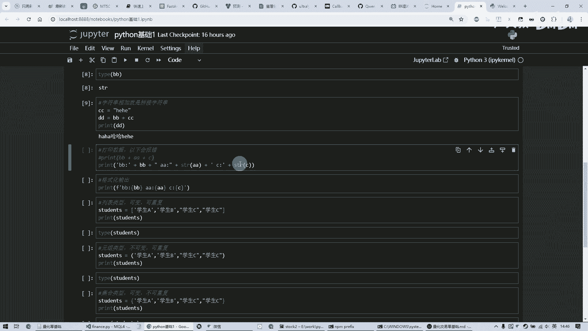
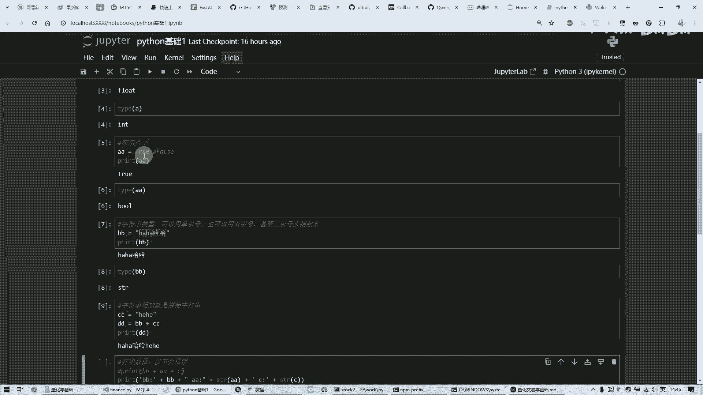
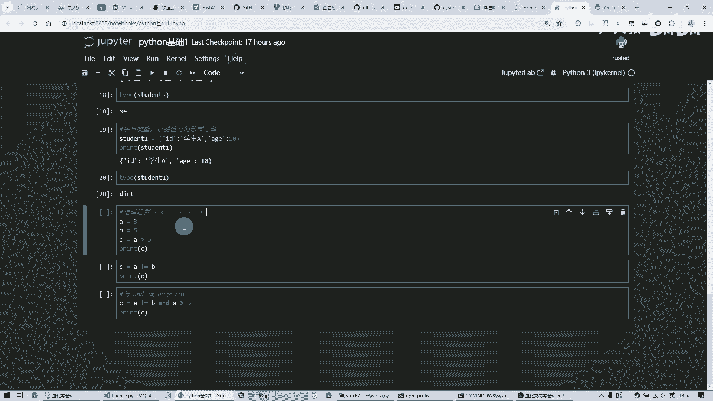
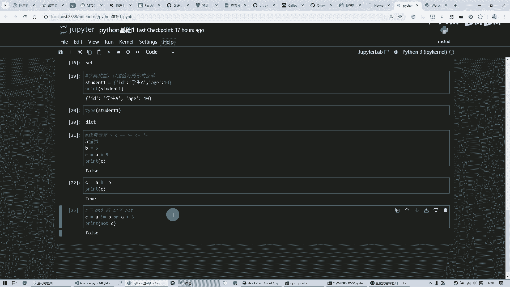

# 量化交易零基础 第十八课 程序篇3 python基础1 - P1 - 户大叔 - BV14f421z7oD

大家好，本次是量化交易零基础的第18课啊，从这节课开始呢，呃咱们来讲一下这个Python Python这个语言啊，因为咱们在如果说是做这个股票的量化的话啊，我们后续呢会用这个迅投的，QMP这个平台来做。

它呢，里面呢是支持用这个呃Python来写，咱们咱们这个代码的，所以说呢，嗯很多小伙伴可能他根本没有这个基础，所以呢咱们这里面呢，就是快速的给大家过一遍啊，当然也有很多就是市面上有很多别的这个课啊。

就是Python讲比的比我这个呢可能讲的更详细呀，更好，那我这个呢就是呃给大家过一遍，因为毕竟咱们这是零基础嘛啊，然后呢首先呢是下载啊。

下载呢它是这个官网去下载就行了，他这就是Python点ORG，然后呢他这有一个download，底下呢有一个最新版多少啊，点一下下载，下载完了以后呢，我这块就不讲这个安装了，因为就是运行下一步。

下一步下一步就装完了，这个就没有什么呃可以说的，所以说呢这个呢就是它的那个下载，下载完了以后呢，咱们呢嗯要试一下，就是怎么才能是我这个啊环境安装的，对不对呀，怎么着的能不能运行。

那这个呢可以呢用这个如果是windows的话，它有一个快捷键，是这个windows这个键，键盘上有一个win键，就是在这个control旁边，然后再加R打开一个那个运行的那个窗口，输入CMD。

然后呢就能打开咱们这个运行程序的这么一个，命令行的窗口，然后呢打一个这个Python，然后呢如果说你是安装好的话呢，它能告诉你你现在安装的是什么版本啊，等等信息。

然后他停在这一个一个三个箭头这么一个界面，这里面你就可以自己输入代码，脚本啊一些东西，然后这就可以呃，它能运行，咱们呢简单输入一个，啊有一个hello，然后呢他正好也能输出一个hello。

那说明了咱们这个能这个环境已经安装的，没有问题啊，然后呢呃退出，啊他这是一个退出函数啊，这这些函数什么的什么概念呢，待会我们会讲啊，这就是咱们这个呃相当于是开发环境已经好了，好了以后呢。

咱们要在这个一个开发的工具上，来开发和运行嗯，来调试啊什么之类的，那那现在呢其实有很多这个呃。

编辑器可以做到啊，那推荐的话一般都都是用这个vs code，这个是免费的，微软出的一个轻量级的这个呃编辑器啊，然后呢装上一个它能支持插件，然后呢装上一个Python的这个插件，然后它就能运行啊什么的。

这是一点它就能运行Python程序啊，然后这个呢是这个vs code。

然后呢也有的人呢会用这种比较，就是呃更更更好一些的这种嗯集成开发环境，这个是那个呃一个一个PYTHM，就是一个也是一个商业版本的啊，当然他有一个社区版，我这个是装的社区版啊，然后装了社区版的。

它是免费的，然后呢这个也有这个企业版，那个收费的，那可能是做这种各种大型的程序啊，等等这种工程的，我可能会用到我这里，因为只是写一些Python的代码，所以说呢我这个很少说用到这些高级的功能。

我呢就用的是这个社区版，这个呢就是就是免费的了，当然了我们这里呢给大家介绍呢是用第三种。

第三种呢就是这个JUPITER啊，这个呢是一个咱们这个Python的，它第三方的一个软件吧，它呢是适合教学啊，在这里面呢哎也可以哎可以打字，也可以说明成一个怎么一个笔记啊，这么一个notebook啊。

这么一个笔记啊，这样的话还能存起来，然后呢将来呢还能看，那这里面呢也能运行代码，所以说呢他这个是比较好使的一个工具，而且基于网页的啊，所以说呢咱们呢用这个工具呢，给大家来做这个介绍啊。

然后这个Python的语言呢，为什么说这个呃现在为什么那么火啊，而且那个其实他出了很久了，他这已经是上个世纪的语言，它是一个脚本语言，然后所谓脚本语言呢，他就属于那种嗯我这个呢一一个代码片段哎。

一执行都能执行，它不像这种像什么C呀，C加加呀这些语言，java啊，这些语言它是这种强类型的，Python呢它是这种弱类型的，他这俩呢就是有很大的不一样，像C啊，C加加那些都适合写那种大型的程序。

然后然后呢这个呃软件呀什么的，然后呢但是呢我们这个Python呢，它呢主打的就是一个简单方便啊，它呢而且呢就是一种代码段的话，哎这么一段一运行啊，它相当于是一个小脚本，我要写一个小的工具啊。

自动化的工具帮我干成一个什么什么事啊，这个时候呢Python就非常适合，当然呢它呢呃这种脚本语言呢，它没有这个呃对类型呢没有这个要求，对变量的类型没有要求，所以呢它的这个那它的运行速度啊什么的。

它虽然是简单了，但是它运行速度可能相对来说比那些C啊，什么的要慢一些，然后呢呃再加上呢我们呢用的这个平台呢，QMT呢，他呢是呃可以用这个java语言和这个Python语言呢，来做这个开发。

然后所以说呢我们就来学这个Python，而且呢现在你想比较火的是Python做这些啊，爬虫啊，还有AI呀，现在那么火的AI程序呢，都是这个Python是支持的最好的，所以说呢嗯现在非常流行。

那咱们呢呃就是说即使是咱们不做这个量化，这个开发，咱们拿这个学了一门这个语言以后呢，唉将来呢也能对我们工作呢有很多的帮助啊，那么呢现在呢我们来开始说一下这个Python啊。

然后首先呢啊我一个简单的东西一个式子，那就是1+1等于几，这个呢我运行一下啊，那他这个结果呢就是二啊，这个就是一个简单的，也就是说呢我只要写这么一个简单的式子呢，他呢就给我列出来一个答案，他能给我计算。

就当做一个计算器的感觉啊，这个呢就是脚本语言的特点，如果说我是用java或者用C加加之类的，我要先建一个工程，然后呢整个结构怎么怎么样，然后呢唉都编排好了，然后运行完了以后要编译打包。

最后运行是一个特别麻烦的一个过程啊，当然这种这种Python这种脚本语言呢，它的优势就在这，它呢很简很随意，我就是写可能就写一行，我运行下看，想看个结果啊，这都可以。

这个呢就是最基本的这个咱们这个四则运算，然后呢第二个呢呢是咱们来说一下这个变量啊，变量是什么意思呢，实际上这个变量的意思就是说，我要把我的数据呢啊存在内存里，然后呢后续呢我得的这些数据呢。

可能之间的相互做一些运算，然后最后计算完了一个结果了，最后显示出来也好，还是干什么工作也好，所以说呢我要把这些数据都要放在内存里面啊，先存着，然后呢等我用的时候再拿出来用啊，这个呢就是变量的作用啊。

如果说像那种像C加加那种语言呢，他们呢就是我输我这个输入的东西，我存起来的一个东西，我必须要告诉它，我这个存的这个数据是什么类型的，就是我是个整数还是个小数点，小数还是那个字符串还是个什么东西。

它这些东西呢必须要有明确的定义，而这个Python呢不需要它是自动推断的，也就是说呢我呢这个基础语法呢，就是这边有一个变量名，然后中间有一个等号，这里面不是相等的意思啊，这是赋值。

也就是把右边的这个数据呢，哎通过这个等号呢给这个A这个变量，这A呢就会在这个内存中哎开辟一块空间啊，他能存这个数据啊，然后呢我呢给它起个名字叫A，这样的话将来我想用的时候直接拿A来用啊。

A呢再加上二或者A再怎么怎么样，那这个呢就是相当于是我来操纵内内存，我取内存中的那一块的数据，然后再做运算，所以说呢我必须要呃有一个变量的概念，这个变量的起名呢可以很随意啊，字母数字下划线都行。

但是你第一个就是开头，那必须是字母的，不管是大写还是小写都行，然后呢或者说是下划线开头都可以，但不能以数字开头啊，这个是有有这个额有一定的这个要求，然后呢这个呢就是我的一个例子。

我先呢给A这个变量呢负了一，这是一个整数，然后呢给B呢一个2。0是一个小数，然后这个还有四这各种这个四则运算吧，有加减这个心就是乘这个斜杠，就是除这个百分号，它是一个呃取余的操作，就是两相除以后呢。

不是得到除数，而是得到余数，然后这个括号也是咱们这个呃，小学数学里面那个四则运算里面加上括号以后，它优先级就先算啊，这个的都是跟咱们那个学的是一样的，然后呢那这个井号开头的是注释。

这句话就是能标明它这个哎，你这个代码是什么意思，这是自己写的啊，就是它不会运行，它就是一个起到一个注释的作用，那我们呢把A和B呢都赋上值以后呢，我A呢哎取余二的话，最后给个C，然后我们把这个C打印出来。

那这个C会是多少呢，那咱们来看一下，最后结果是一啊，为什么一呢，因为是1÷2，然后呢它的余数余一，所以说呢他这个就是一这个就是呃四则运算啊，完了以后呢，我们呢可以看一下这个变量它是什么类型的啊。

加一个type，然后括号里面的放上变量的名称啊，这是一个type函数啊，这个是系统提供给咱们的，咱们可以直接用啊，你只要中间的这个括号里面放上这个变量名啊，他就能得到这个数据的类型，那咱们运行一下哎。

它它提示呢它是一个float，Float，就是浮点数，也就是这种带小数了，咱们B呢设的是2。0，而不是二，它呢会自动推断啊，你这个数据哎是带小数点的，所以呢它的类型呢，自己呢就会变成这个float型。

那这个A呢它呢是整形的integer，就是简称int啊，这个呢就是这个呃类型，然后还有一种类型叫做布尔类型，布尔类型的作用呢它就是只能存两种数据，一个是真一个或者是假，只有这两种。

就是说呢啊咱们以后将来后面要做判断的时候，我嗯你这个满足不满足条件，它是真还是假，他是有这么一个东西，所以说呢我呢再起一个叫AA的变量，然后呢给他一个true啊，他只能填这种true或者是false啊。

只能是填这两个值，那这个是假，这是真的意思，那我把这个true呢付给这AA，然后打印一下呢，它这个里面的值呢它就是一个处啊，然后呢咱们打印一下这个AA的这个类型呢，它呢告诉你了是个布尔类型啊。

这就是真假值，然后呢第三啊，下一种呢它是字符串类型，它呢是用这个一个双引号或者是单引号，或者是单引号给他括起来，中间呢是你的内容，哎这么着呢给一个变量叫BB，然后呢咱们呢也打印一下。

然后呢他呢哎它里面的值的就是这个哈哈哈哈，这些啊就是咱们这个括起来的内容啊，然后呢这个BB呢哎看一下它的类型，它是SSTR，就是string的那个缩写啊，这个呢就是字符串。

那当然我们要把这个字符串相加呢，那它就是拼接这个字符串，比如说这个cc是呵呵，然后再把咱们上次这个BB哎两个呢相加，然后再打印一下，然后呢他这个呢就是这个拼起来了，这是前面BE的。

后面的是这个呃C那个cc的，然后呢他等于说拼在一起了，成成一个新的一个字符串啊，给一个DD啊，这是打印的DD，然后呢下面这句话呢会报错，这个我想打印这个BB和AA，还有cc呢，咱们之前呢呃前面是算过了。

C呢是一它呢是这个数字类型的嘛，然后呢这个BB呢它是一个字符串类型。

然后呢AA呢是个真假值。

哎那我把这个东西呢哎给他们呢拼起来，这个呢是一个字符串啊，用一个单引号给引起来是一个字符串，再加上这个BB的内容，然后再加上一个双引号引起来，这个都可以啊，这个都是字符串。

只不过呢我故意写成了有双引号的，有单引号的，只要这括起来，这两边是一样的就行，都是字符串，然后呢再把这A的值打印一下，然后呢再把C的值打印一下，在这里呢，我必须要加一个这个STR的这么一个函数呢。

把这个AA呀，还有这个C呢强制把它转换成这个字符串类型，这样呢这句话呢才能执行，如果说呢我打印这个的话，唉他就会报错，他说呢这个这个都是数数值嘛，这个还有真假，我不认识我，我没法给你输出。

我只要那个字符串的，所以说呢我呢必须呢给它做一个转换，然后最后呢这个整个这串儿就是这样的，看到这是一啊，这是true啊，还有前面这些字符串这么打印出来，哎这个是呃拼接啊，打印需要注意的一点。

然后呢咱们这样还能可以用格式化的方式，就是print里面加一个F，然后后面是字符串，然后每一个变量呢，用这个大花括号给它括起来啊，这样的话就避免这种来回这么加，还得再转换这种麻烦了，这个呢咱们运行一下。

效果跟上面是一样的，这两个是一样的啊，这个呢就是格式化输出啊，然后呢下一个类型是列表，也就是说呢我呢可能有好多条数据啊，比如说咱们那个数据库里，或者说像excel11行是一条数据。

那我把这个数据呢哎通过这个逗号分隔，然后呢外面加一个中括号，然后里面都是这种字符串的学生ABC啊，两这样的话呢给一个变量，然后呢我呢可以打印一下里面内容，他呢就能给你这么输出一个这样的东西。

那咱们看一下它的类型呢，它呢是叫做list是一个列表啊，他这个类型的特点呢，就是说呢我可以再加再加数据，相当于是我这个列表是可变的啊，然后呢也是可以重复的，因为我这有两个学生，C这个呢就是列表类型啊。

然后呢我再把这个换一种方式，把这个外面这个中括号了，换成这个圆括号，小括号，然后呢还放在它里面，那这样的话呢，这个变量就原来因为已经复制过这些内容，但是现在呢我给他新的内容的话。

它呢原来的内容就被覆盖掉了，然后现在就是新的这个了，然后呢咱们在那个打印一下哎，他也能出这样，只不过它是一个圆括号，这种的数据呢叫做元组类型，打印一下它这个类型它是元祖啊，这个类型的特点呢是呃。

他跟那个上面的都可以重复，都有这个学生C，但是呢他不可变，也就说这个固定了，我第一次写好了以后，你再想加再想减再改，那不行了啊，这个呢就是它的一个特点，第三种呢是这种集合类型。

我还是把这个这是一个大花括号啊，其他都没变，再付给这个students，把等于它呢又被覆盖掉了，原来的数据没有了，就现在是这个新的这个数据了，咱们把这个执行一下，哎出来了呢，哎变化了，他没有学生C。

只有一个学生C了，他呢就是这个可变也可以加一些数据，但是呢我不能重复它，这个呢是有一个排除的作用，这叫做集合类型，然后咱们打印一下它的这个类型，它是set一个集合啊。

这种呢就是啊Python的几种类型吧，还有第四种叫字典，字典呢是以键值对的形式来存储，那也就是说呢我可能这一条数据呢有很多属性，比如说这个人的id或者说叫name啊，他可能叫学生A。

然后他的年龄哎是这个十岁啊，他这个是一个字符串，这个呢就是键就是你的key或者说叫键啊，就是我一拿这个键呢能取得这里面的数据嗯，但是这个整个的啊这整个这一条呢叫做字典啊，也就是说呢。

我就跟那个咱们现在翻的这个字典似的啊，就是我通过前面的目录啊，第多少多少页能找到你相应的内容，找到这个字，它是解释啊等等的，所以呢这叫字典类型，那这种呢就是它的键，它就叫key。

然后呢这种的里面的内容呢就是就是它的值啊，这些都是值，那叫value，所以说呢都是键值，键值这么一键值对这种形式出现哎，这种的这是一条记录，我呢给你这个student1，然后呢我呢再把他这个打印一下。

哎他能给你这么列出来，那咱们的类型呢ADDICTIONARY的那个缩写DICT，它就是告诉你这个呢是一个字典类型啊，这个呢就是这个咱们的几几种数据类型吧，啊可能还有别的，就是说这个咱们后续再讲这些。

这些都是一些基础的类型，然后呢下面呢就是逻辑运算，逻辑运算的作用呢就是说我可以判断呢，你比如说一些大于小于等于大于等于，小于等于和不等于，哎，这些呢逻辑方面呢这种运算呢，哎他呢也提供了有这么多运算符啊。

这个呢就是大于小于这些，跟咱们这个呃咱们学习的上学的时候都差不多。

唯一不一样的就是这个这个是等于等于啊，那一个等于号那个叫赋值，就是把这边的右边的内容复到左边，给这个变量里面，而这种两个等于呢，就是比较左右两边是否相等啊，他这个是叫逻辑运算。

假如说呢我A呢覆盖掉等于三，原来是一，现在B呢等于五了，然后我然后呢我呢A大于五这个东西呢，式子计算完了以后呢，把结果给C，那这个C的结果是什么呢，它是一个假，就是他变成一个布尔值了，就是逻辑运算。

最后的结果一定是一个真或者假啊，这个叫做逻辑，就是说你这个式子符不符合条件，你你符合了啊成立，那就是真，那不成立它就是假啊，这种呢叫做逻辑运算，然后呢啊还有一种呢就是这个不等于一个叹号，一个等于号。

这个呢就是A呢是否是不等于B，然后把这个结果放C里，那这C呢那是真还是假呢，那咱们来看一下，最后是除，为什么呢，是因为A是三，B呢是五，这俩不不等于嘛，所以说呢他一定是这个啊。

最后呢这个它不等于是成立的嘛，这个式子那我给了C了，那C呢最后告诉我这是真啊，这个呢是逻辑，然后还有一种呢是与或非三种啊，雨呢就是说啊式子两边都为真，它才能是真，否则就是假货呢。

就是嗯两边呢左右两边的式子啊，有一个为真，那我就能告诉你呢是真的，那这个非呢就是取反啊，那我现在这个式子呢就A不等于BA呢A是三，B是五，那这边呢肯定是真，这个是成立的，然后中间发一个and。

然后呢就是与操作这边呢A大于五，A它大于五，A是三，它不大于五，那我把最后这个计算完的这个式子，结果放在C里面，站在这个C输出呢，那就是甲因为这个and呢这个与操作呢是两式子，两边的必须都成立。

它最后呢才能是真，那这个呢就是肯定是不对的嘛，那我要把这个变成or变成这个货呢，那最后的结果就是真，为什么呢，是因为前面这个符合条件，后面这个虽然不符合条件，但是我两边呢只要有一个他是或者的关系。

那最后出来呢那就是真啊，他这个呢就是啊与或非啊，这个这个not是取反，我可以在这里面输出呢，加上，哎那就结果就取反了，我本来呢刚刚是或这边呢这个C里面是真啊，我加了1not取反了。

那最后呢那反过来呢真的反过来，那就是假吗，那最后就是假了啊，这个呢就是呃Python咱们这个基础第一课啊，把这些数据类型啊，还有一些简单的运算呢给大家呃介绍了一下，那好那今天的课就到这里。

