# 量化交易零基础 第二十三课 程序篇8 迅投QMT平台介绍 - P1 - 户大叔 - BV1rrewepEtG

大家好，本次是量化交易零基础的第23课，从本次课开始啊，咱们来讲一下嗯，具体的用一个量化交易的平台，然后在上面呢进行咱们的策略开发啊。

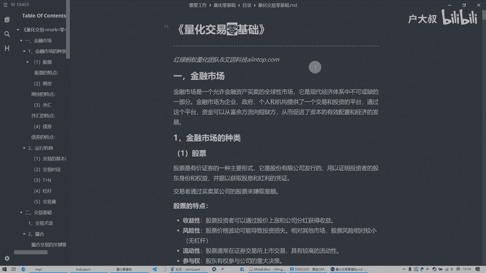

我们呢使用的平台呢是这个训头的QMT啊，这个是他的那个登录以后的界面啊，这个讯投这个QMT是一个什么样的平台呢，它呢是一个国内的啊，他们这个开发的这么一个可以进行啊，用Python。

然后呢在上面呢写策略，然后呢可以在上面跑实盘模拟或者实盘，然后呢也可以回测这么一个量化的人，这么一个交易平台啊，这个呢在国内呢，咱们有很多的这个量化的平台啊，比如说那个用那个什么距宽啊等等的啊。

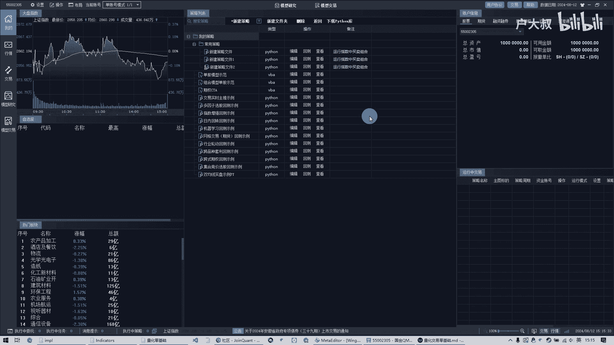

这些平台呢就是大家都是可以在上面进行回测，写策略啊，并且呢像巨宽他们都是网页版的，它是一个也是可以用Python的来做的，但为什么就我最后选择了。

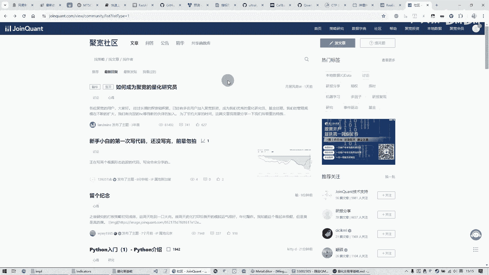

是用q mt这个软件的形式来做呢，是因为它主要是有几点啊。

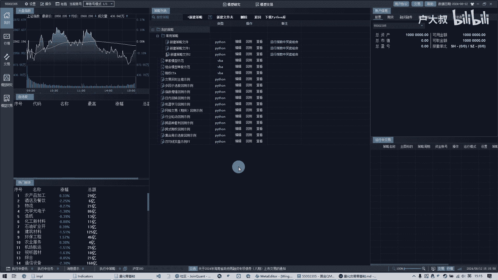

首先呢就是这个呢他们是这个，比如像距宽啊这些的，还有米框啊，他们都是这种网页版的，网页版的呢，呃优势呢就是在于，用户呢可以不用安装任何软件啊，他可能在电脑上操作啊登录，然后呢在上面呢哎他提提供了一些。

比如说你这个嗯它那个内部呢它有一个功能啊，你在上面呢可以看别人的策略也可以呢，自己呢在上面写纯网页的，然后完了以后呢，所有的操作呢也是在网页上做。

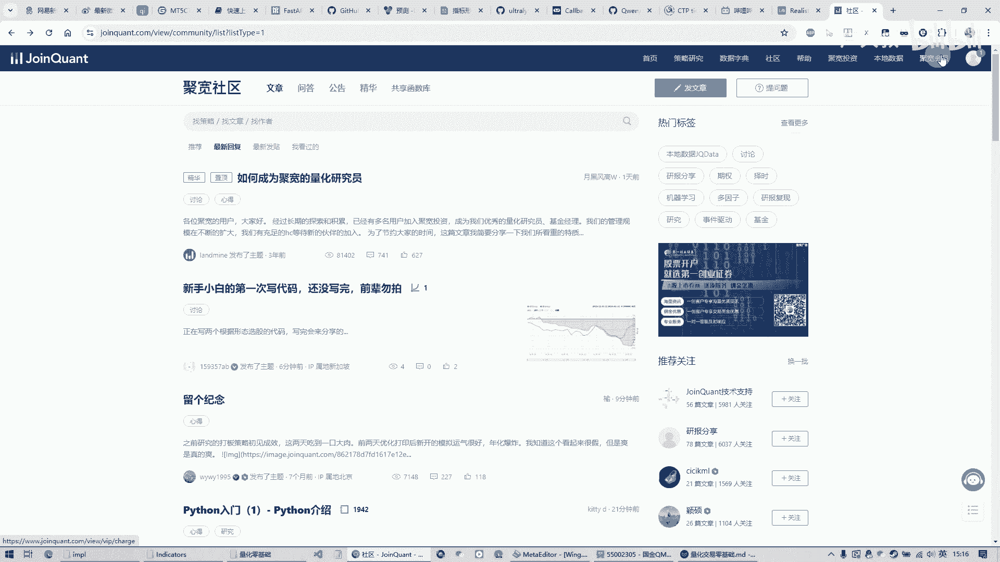

然后像q mt这种的，他呢是必须要安装一个软件啊，必须在windows或者什么这样的环境下，在电脑上装这么一个软件，然后这样的话呢我需要安装啊等等的这些东西，可能一些这个接触电脑不是很多的这个用户呢。

他可能操作上啊都有很多的问题，所以说他可能对这个，咱们这个一些初学者来说呢，可能门门槛有点高，但是这个网页版呢他呢嗯有什么缺点呢。

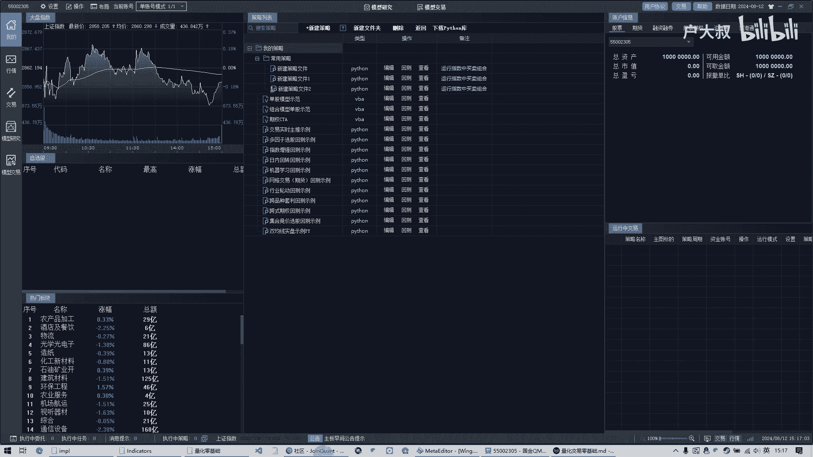

是我呢就必须在人家这个平台上啊进行开发，开发完了以后我的策略啊，我自己的这个策略呢只能在他这个网页上看，我的数据呢都是在人家这个服务器里面存着，也就说呢，呃咱们这个当然人家也不会这么做了啊。

就是相当于是我的所有的数据，都是在人家的那个服务器里面啊，然后呢而这个时候呢，比如说我们是一个专业的做这个量化开发的，那么我的策略嗯肯定是要私有的，就是我的东西肯定要在我的手里面，然后这个时候呢。

这种网页这种平台虽然说呢它门槛比较低，但操作起来比较简单，但是呢他那个并不适合咱们这种，如果说咱们做特别专业的这种啊量化交易的话，肯定不太合适的，而且呢就是这个这是这是第一点。

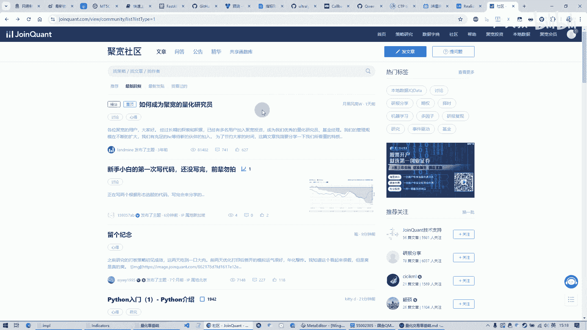

而这个这种QMT呢。

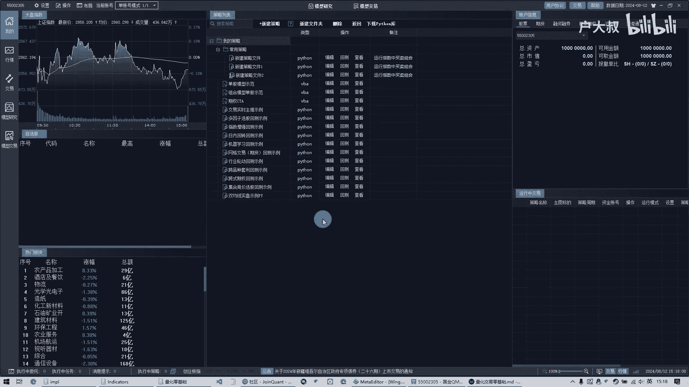

他这种平台呢都是我们自己在本地编辑一个，我们的程序啊，这样的话这个呢所有的策略呢，我还可以进行加密啊等等的，让我的这个程序呢都在我本地，这样的话呢我呢有一个保密性，安全性在这里面，所以说呢。

呃我们呀还是选择这种比较专业一点的。

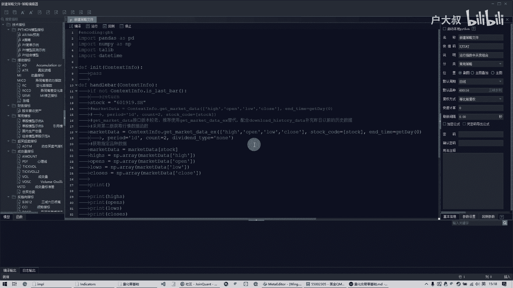

这种平台，毕竟是要上实盘嘛，这是第一个，第二个的问题呢，就是说啊他这种网页版的呢，他呢可能一些灵活性可能不高，或者说他呢需要跟券商合作啊，因为呢这个国内的股票市场呢，他呢是每一家券券商呢它有自己的接口。

就说当我涉及到下单，平仓这些交易的功能的时候呢，每一家券商有自己的定义，他没有一个统一的这么一个操作的，这么一个接口，或者比如说最后连到上证啊，嗯等等的这个真实的你去交易啊，这样的话呢。

也就相当于是我的任何一个量化的平台呢，必须要对接各家的这个券商，那我可能在某A这个券商开的户，但是呢我这个平台呢它不支持A这一家，那我就用不了你的这个呃平台，因为我即使是我在上面做了一些呃。

我的量化的开发，最后呢我只能当个模拟看，看验证我这个策略好不好用，或者当个测试的啊这么用，但真正的我要是拿这套程序去交易的时候呢，因为你这个平台他没有对接相应的那个券商，那这样的话呢。

呃他呢就是无法进行一个真实的交易，那这个QMT呢它的好处是他接了嗯。

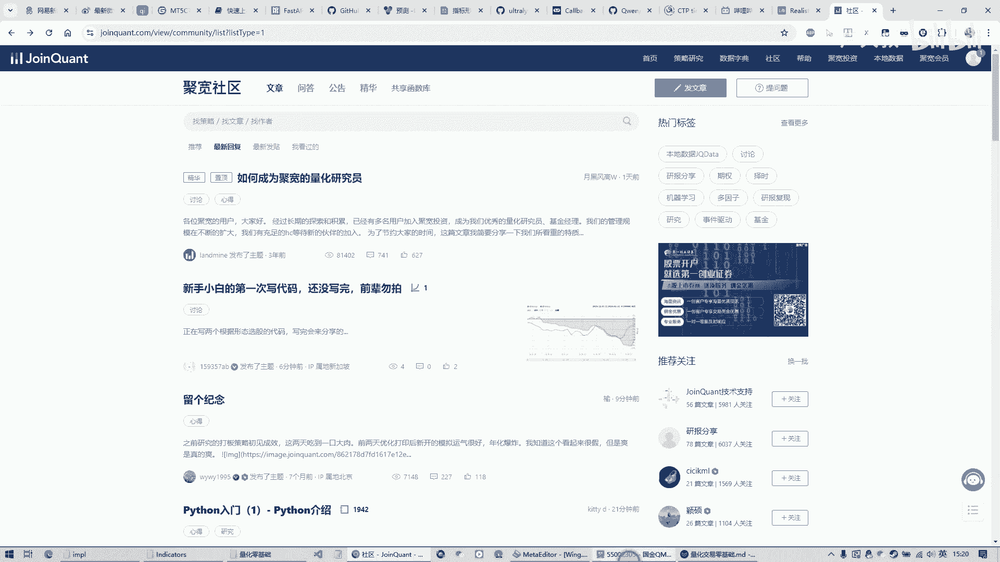

至少有70家，我记着是啊啊70家以上的这个券商，那也就是说呢呃这个范围就比较大嘛，有可能呢咱们这个比如说我开户的这一家呢，它上面呢就支持这个软件啊，那这个呢就需要呢。

就是咱们呢去询问一下咱们开户的这个券商，这个公司，然后问一下他们这个呃，咱们这个券商呢支持不支持q mt这个软件啊，这个呢是他的这个第二个我选择他的理由，所以说呢这个呃QMT平台呢。

是咱们后面的讲解的一个重点啊，这个呢就是嗯咱们这个选择这个量化平台的，这么一个理由吧，啊然后呢量化平台，那为什么咱们要选择这么一个量化平台呢，就是因为咱们个人或者说某个机构，它呢是无法做到说去呃。

直接进行一个股票的交易啊，必须通过券商而对接券商呢，他平时呢他也不会说是跟你有任何的啊，说哎我要接进去，他还他也不会理你的，他呢有他自己的这个一个接口啊等等的一个啊，必须呢通过这些平台来接入啊。

平台的接入呢啊，这个这方面的事情呢就不用咱们去考虑了，然后平台呢接入了某一家券商以后，他呢可以比如说获取你的账户信息，那你的行情数据等等的，像我们要是做这个呃，尤其是期货的啊。

他呢虽然是有一个统一的这么一个接口，但他给你的数据全部都是提克的数据，也就是说比如说这一秒来了一个当前的行情，行情数据，他给你的是当前价格，如果你想回测，或者说我想得到历史的数据，我要得到K线数据。

那都是没有的，所以必须呢通过这种量化的平台，它呢接了这个券商的数据，然后呢他呢有专门的服务器，有专门的行情系统，把咱们的数据呢，把这个历史数据呢它全部都形成K线，比如说天图的一小时的。

一分钟的等等的这些数据，然后呢咱们在它的平台上呢直接使用它的功能，它给你提供好的功能，咱们呢直接用这样的话就能获取他的，比如说口开提收啊等等这些信息啊，就是这个呢是，所以说呢，咱们如果说是做国内的。

这个股票的量化交易的话，就必须要借助一个量化的平台啊，所以说呢嗯这个量化平台的选择呢，就像我刚才说的啊，咱们要根据自己的情况，那自己的开户的券商是什么，然后呢咱们是不是要做一些啊简单一些的开发。

还是一测试呢，还是说呢要上实盘，或者说呢我这是一个大的机构，我是一个私募，我要是多少多少亿的资金啊，要做这些呢都是根据个人情况不一样，然后呢选择呢不同的这个量化交易平台啊，这个平台没有什么好话一说。

这个呢只是呢给大家介绍一下，要根据自己的实际情况出发啊，那这今天呢就是一个QMP这个软件的一个，简单介绍好，那我们在后面呢会详细的教大家，如何开发一个策略好，那今天的课就到这里。

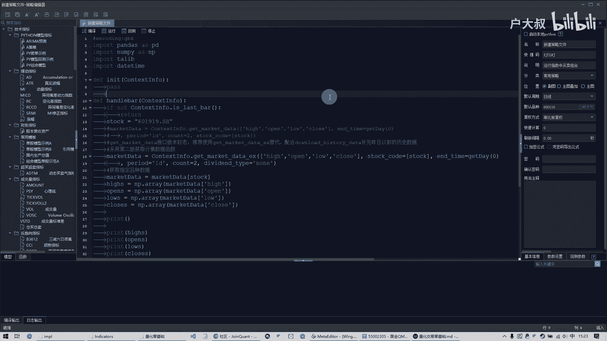