# 量化交易零基础 第二十二课 程序篇7 python基础5 - P1 - 户大叔 - BV19uaQe6E55

大家好，本次是量化交易零基础的第22课啊，本次呢我们继续来讲这个Python的基础啊。

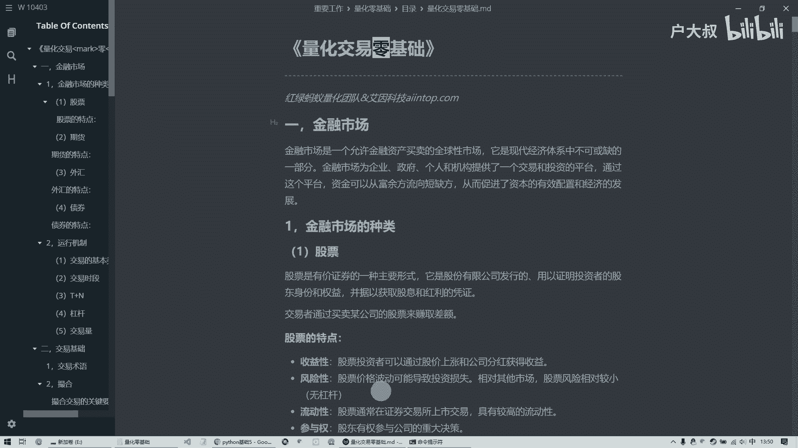

本次呢是这个Python基础的第五次课啊，我们这节课呢讲一下这个异常嗯，异常呢就是说呢我们经常呢在写程序的时候呢，就会发生一些错误啊，比如说我现在这个错误，那我这个Python呢它是一个脚本语言。

它遇到错误呢它就会报错，然后呢就停止运行了，但我们并不希望会这样，因为那就是错误呢很难免，就是比如说某个文件找不着了，某个文档丢失了，然后呢访问不了了，这种很正常，那不能说因为遇到一个什么错误。

然后呢他就直接就程序就停止了，所以说呢我们呢需要呢把这个异常呢把它找到，这个异常这个报错的地方，然后呢把它哎经过一些处理啊，这样的话让我们的程序呢能够正常的运行，那现在呢我给大家举一个最简单的例子。

这个例子呢就会触发一个异常啊，他是这样，我在这故意呢前面留了一个空格啊，这个空格呢就会导致它报错，好他就告诉你说呢这个错误是什么错误呢，是这个缩进的错误。

因为咱们这个Python呢啊一般情况下都是这样的啊，就是都顶格的，如果碰到这个循环啊，或者说分支啊啊，或者是像咱们说的那些什么类啊函数啊，那些东西他才会缩进，然后呢如果说你平时的时候你就这么缩进的话。

它是错误的啊，他这个会报错，报错呢，他这个程序就停止了，而且呢他告诉你是什么错误，并且呢底下这句话他就不会执行了，所以我们这看也没有打印出来，也就说呢这个呢就会发生错误了。

但是呢我们怎么才能解决这个错误呢，就是要用这样的语法try一个冒号，然后这是缩进，然后还有一个except，然后呢呃这块呢写成这样，然后一个冒号，然后呢这里是处理这个错误的这个一个呃程序。

然后呢这是后续的程序，啊这个呢他就会告诉你哎你报错了，报一什么错呢，除零错误，因为呢除数不能为零吧，所以说呢这个报错了以后呢，我们呢哎把它处理一下，所谓的处理呢就这里就简单了啊，就是打印了一下。

然后呢他后续的这个程序呢还能继续走，这个呢就是啊异常和处理，那异常处理呢我们这个就是写一个try，然后这里面呢写上可能会发生异常啊，的一些这个代码，然后呢这一段代码呢嗯不知道会发生什么异常。

总之呢我们把它括起来，然后用一个except一个关键字，后面呢告诉他呢是用什么错误，然后呢它呢它是一个这个是一个类异常类，这个异常类呢是所有错误的类的这个啊父类啊，所以说呢啊我们呢经过上节课学的这个呃。

多肽呢，我们能知道就是我只要写一个他们所有的父类，总的这个类呢，哎那就可以包含任何一种异常，然后我们给它起一个变量名，然后呢这是他的对象嘛，相当于是然后呢可以打印一下他的，就能知道I是什么错误啊。

这是除零的错误啊，这个呢就是异常的处理，那这个异常处理呢，如果我们知道这可能会发生什么异常，那我们可以指定一个啊，他专门的那个错误啊，就是我们下一个例子啊，我们这个呢就会触发一个异常。

因为这个变量B呢根本没有定义，直接就打印了，打印呢这会调用就会报错，报一个什么错误呢，它就是一个命名的错误，然后呢我们可以把它打印出来，啊他说呢这个呢名称这个B呢他没定义啊。

所以这个他是我知道这段代码中，可能会出现什么错误，我呢唉找到相应的这个错误类，然后告诉他会发生这种错误啊，如果你碰到这种错误了，哎你就执行哎这个错误处理啊，这个呢就是啊。

在指定知道什么会发生什么错误的时候呢，找相应的这个错误类，然后呢他呢就能这么处理，但是有的时候我可能是一大段代码，这里我也不知道可能会发生什么错误，那这个怎么办呢，就像上上一个这个这个例子似的。

我直接用他们的组工类，他呢包罗万象吧，他是他的祖宗，这个呢就是多肽嘛，多肽的一种体现，然后呢哎这样的话他也是能运行啊，这样也是可以的，然后呢如果说呢我能知道是什么错误，然后呢这几种错误会发生哪几种错误。

我也可以多写好几个except，然后呢我这个比如说是文件的报错了，找不到是这个错误，这个呢是命名错误，还有可能除零错误，还有等等等等啊，我都可以列出好几个，然后每一种呢碰到每一种错误呢啊。

然后呢用不同的这个啊处理方式去处理啊，这样的话呢他呢如果说这段代码中出现了错误，然后呢他呢会相应找到，如果呢他这个程序能找到相应的，这个错误的处理呢，他就会走这个相当于是跟那个if分支似的。

哎那这个呢就走到这个命名错误这了，因为呢他这个错误呢，跟你这个发生错误是一样的，所以呢他呢就哎走这里面了啊。

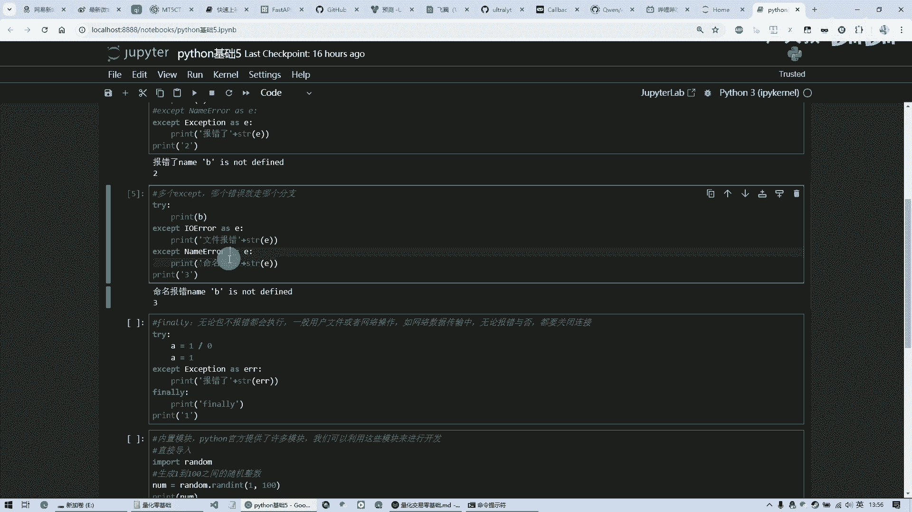

打印一个这个，然后最后打印一个三，就这个呢就是运行结果。

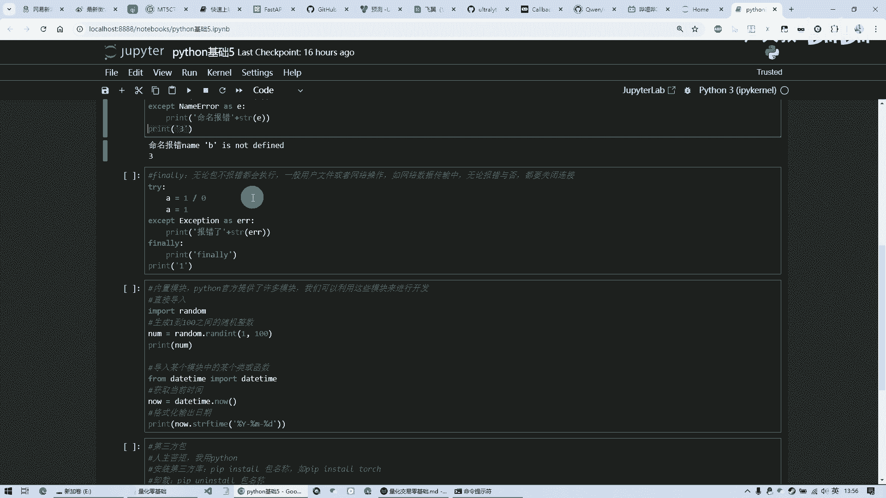

然后呢还有一个final里，就是假如说有很多情况中嗯，像比较常见的，比如说网络网络操作，我传输一个数据，但是呢我那个网络呢是需要通过这个计算机嗯，网卡，然后呢通过互联网啊传传给另外一个人数据啊。

这个时候呢我或者说呢比如说像打开文件啊，时候，我呢可能对文件进行操作，但是这个文件可能不存在，或者说它无法写入呃，磁盘满了等等的，他也会报错，但报错呢我不希望它呢处理完就完了哦。

我我最后呢我肯定是需要关闭它啊，比如网络它的这个端口正打开呢，我需要把它关闭掉，那这个呢是我不管报错还是不报错，我都会要做的事情，那这种情况下呢，我就要用这个finally来来做进行一个处理。

这个finally呢是，不管你这个程序报错了还是没报错，最终都会走它，那我们看这个程序，他呢报了一个处理错误，然后呢但是呢他最后还是打印了这个finally，然后呢后面继续执行，那如果说。

我把这个注释掉，在执行呢，他就不报错了，但他最终呢还是打印了这个final，也就是说你不管你错还是不错，这一块儿都会走啊，这个呢就是叫做finally，一个处理，一般常见于这个文件操作和那个网络操作。

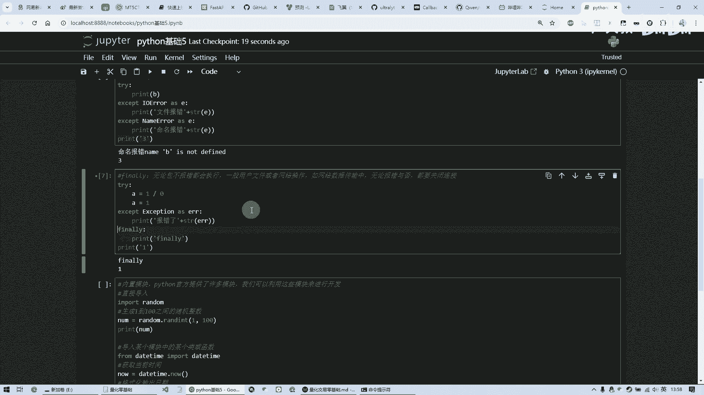

啊，这个呢就是咱们这个错误的这个方面的处理啊，有了这些处理以后呢，我们呢就是可以预想到很多啊，在一些特殊的情况啊，这些报错的情况哎，能够把它拦截住，然后进行相应的处理啊。

以至于不让这个程序呢呃因为错误而退出啊，这个是啊Python的错误处理啊，下面呢就是这个啊模块啊。

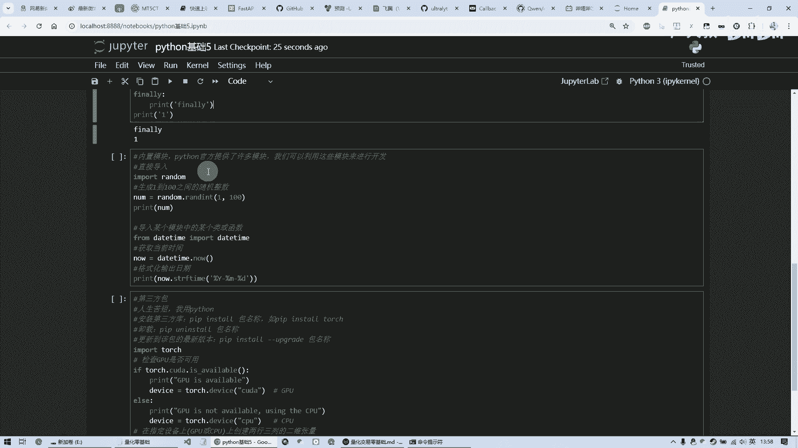

模块呢这个意思呢，就是说呢我们在这个呃Python这个语言中呢，嗯其实呢它内置了很多模块。

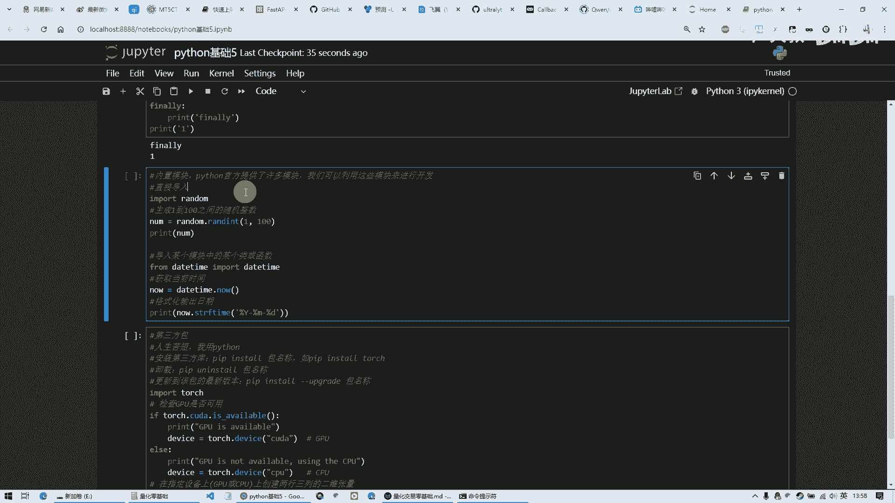

除了我们上面这些用到的，比如说一些基础的加减乘除啊等等功能以外呢。

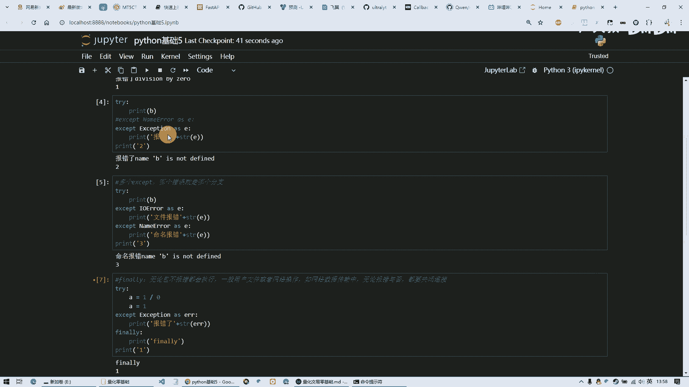

很多呢它是以模块的形式哎，存在这个咱们程序中，然后呢，咱们呢呃运用到这些相应的功能的时候呢，哎把它呢这个模块导入进来用，要不呢它整个这个程序非常大，他把所有的功能全部一股脑儿的都放进去，那非常大。

但很多功能我都用不上，等我把这些功能呢都分类，然后呢相应的歌变成不同的模块，然后这个时候呢我用到某一模块时，再把它导入进来，然后呢用它其中的功能，这个呢是官方提供的很多模块啊，以下呢是一个例子。

就是呢我想呢算1~100之间的随机的数啊，而且是整数，那我就可能需要用到一个随机的这么一个功能，但随机功能它本身呢它是没有的，它呢内置了一个这么一个叫random的，这么一个模块。

这个模块里边是各给你提供了各种各样的这种，随机的功能啊，随机生成从0~1之间的随机数啊，那是一个小数，或者说呢像这种我想生生成这个整数啊，用这个RANDINT这么一个函数。

这个呢是它这个这个模块里的random，这个模块里的功能，所以呢语法呢就是import，然后呢后面跟这个模块的名称啊，执行完这个以后呢，哎他就知道啊，你这个程序里呢，可能要用到这个模块中的某个功能。

然后呢，我们在这个名称呢点它里面的相应的函数啊，然后呢这个呢就是从1~100，最后呢给他们再打印出来，这个呢就是内置的模块，然后呢还有一个呢，就是说我可能这个模块里有很多很多功能。

但我可能只用到它其中的某一个函数，我只要它一个函数或者说某一个类就行了，那这个时候呢也是啊，这是可以这样写这个import呢，什么模块，这个都没问题啊，这根不变，前面的加上符号。

然后呢这就是从这个模块中取得这个类啊，或者说这一个函数我要用的啊，其他的我不需要导入啊，我就要用到它啊，这个呢就是一个得到当前时间的这么一个功能，它是在这个daytime这个模块里的。

然后呢他那个点now就能得到当前时间，但是他这个时间呢它是没有格式化的，是一串数字，然后呢经过他一个专门的一个函数呢，给他转化成这个年月日这种形式，好最后呢结果呢啊这个呢就是这个日子是今天。

然后这个呢是这个，咱们上上面这个从1~100之间的这个随机数，咱可以多执行几次，啊他这个都是在变动的，这就是呢产生随机数，这个呢就是Python的这个内置的官方提供的这些啊，通用的这些模块。

然后呢但是这些模块呢还是不够我们使用，就是说啊很多呢啊官方没有提供的呃，别的这个程序员呢他呢分享出来啊，他呢制作了一个第三方的模块或者包，这个呢我呢直接拿过来用好，这个呢就是第三方的这种呃方式啊。

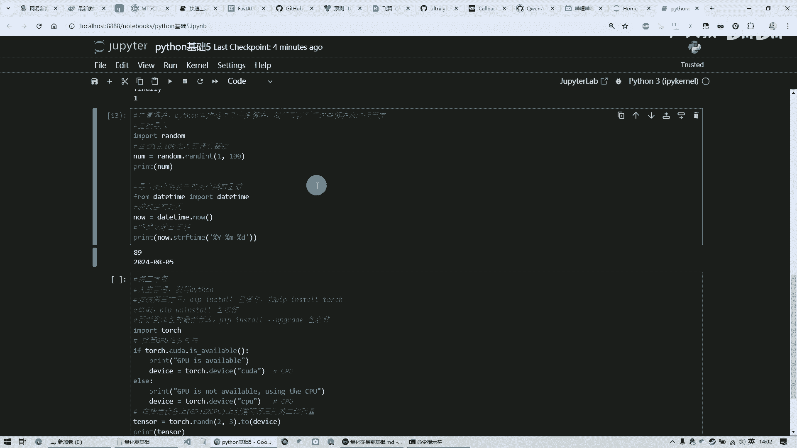

第三方包呢啊这个是Python的一个一大特色吧，因为呢Python呢就是用的人为什么非常多，非常流行呢，就是因为呢他呢首先是语言比较简单，第二是它的第三方库非常非常的丰富。

丰富到嗯各行各业什么功能几乎都能包含在内，所以说呢它非常非常的方便啊，我们呢不需要很多细节，假如说我要实现一个特别复杂的功能啊，我可能是呃去访问某个网页啊，可能需要涉及到网络，但是这些东西我不太了解。

我呢就想通过呢你给我提供一个包，这个包里面给我封装好，这些方法我直接调来用哎就行了，这方便我用啊，这个呢就是第三方包，所以说呢呃用Python的人呢都会挂在嘴边上，一句话叫做人生苦干。

我用Python为什么呢，是因为它太方便了，很多东西，很多复杂的功能别人都写好了，我呢直接安装第三方的包导入进来，直接用就完了啊，这个呢就是第三方的包，那第三方的包怎么安装呢，我们要打命令。

就是他这个安装Python安装好以后，它有一个叫做PIIP的命令，这个呢是专门就是包管理器，他呢就是pip空格，install空格，你要哎导入的就是安装的这个第三方的包，名称啊，就像这样。

这个pip install torch，那这个torch这个库呢很很著名，是做AI用的嘛，啊这个呢就是啊这样就可以进行安装了。

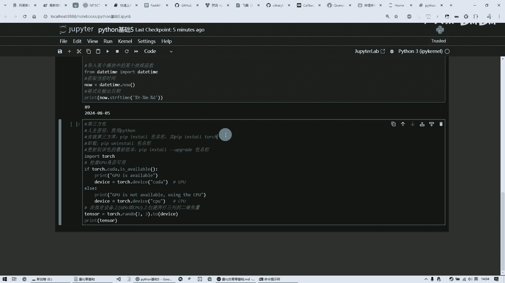

咱们也可以试一下，在命令行里面呢，哎只要打这个它呢就会自动从网上给你下载，而且呢给你下载最新版本，然后呢他这里因为我这个已经装过了啊，所以说他这块能告诉我这个已经存在了啊。

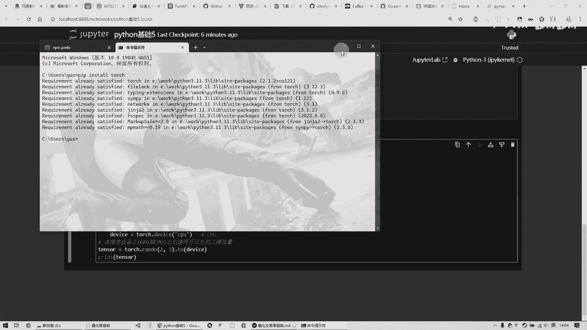

这个呢就是这个安装，然后卸载呢就是pii p an install，然后这个包名就卸载了嗯，然后呢如果说你想更新版本呢，那就是pip install，杠杠两个杠，这个是中线，不是这个下划线，只是减号。

然后呢upgrade后面跟着个包名啊，那它就能更新到最新版了，这个呢就是很方便的一个包管理器，然后呢我们呢就可以这个导入第三方包了，比如我导入这个torch，然后我这个功能是检查我这个呃设备。

有没有这个呃英伟达的这个显卡，然后如果有的话呢，我呢用这个呃显卡来计算，如果说没有的话，我就用CPU来计算，然后最后呢啊随机生成一个两行三列的张量，然后呢把它放到这个相应的设备里，然后进行计算。

这个是就这个是AI中要用到的啊，我就是举个例子，那咱们运行一下它这个运行需要点时间，总之呢就是说我先知道第三方包是什么，然后我用这个pip install这个命令的安装，这个包安装完了以后呢。

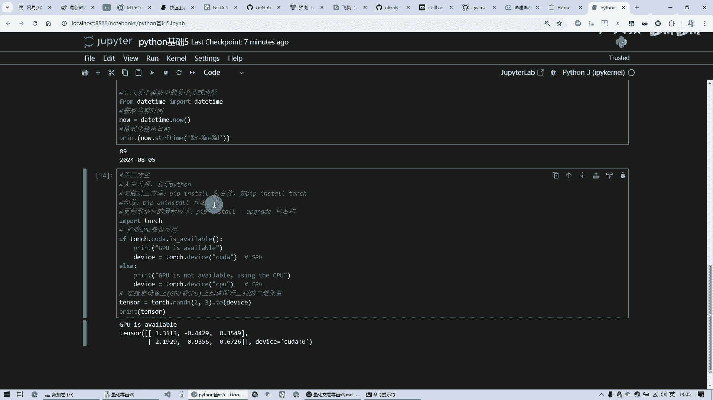

哎我就能可以，就像这个咱们这个内置这个模块似的。

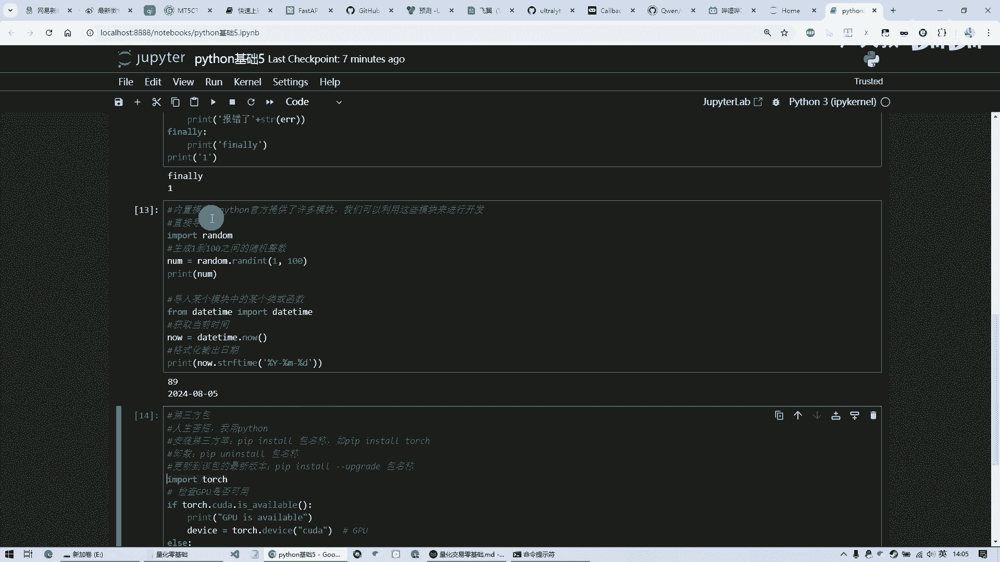

哎直接这么导入进来，然后呢使用它的这些功能，然后他那个这个唉，我因为我这个电脑他有装的那个嗯有这个显卡，所以说呢他这个他写的是GPU可以用，然后呢，哎随机生成了这么一个两行，三列的那个二维张量啊。

这个呢就是呃一个呃包的这个功能，所以说呢这个Python呢就是最强大的，就是咱们现在为什么这么流行呢，就是因为它的功能太丰富了，第三方包特别特别丰富，再加上他的语言还是一个脚本，怎么着都能运行。

然后呢运行起来呢，这个学起来也相对来说比较简单，不像C加加啊，java那些啊比较难学一些，然后呢，所以现在在随着这个啊人工智能的发展呢，这个用Python的人更多。

因为Python的库现在是这个touch库呢，是基本上市面上八九十%的这个AI的，这个程序都是拿他这个库来写的啊，所以说呢啊这个呢就是啊，Python这个咱们说非常非常流行的原因好，那这节课就到这里。

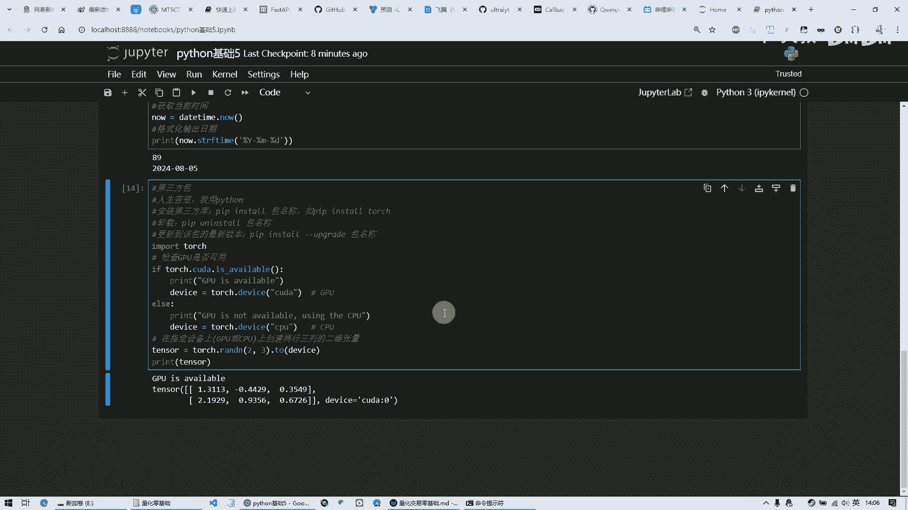