# 量化交易零基础 第十九课 程序篇4 python基础2 - P1 - 户大叔 - BV1yE421w7Jd

大家好，本次是量化交易零基础的第19课啊，也是咱们这个Python基础的第二课嗯。

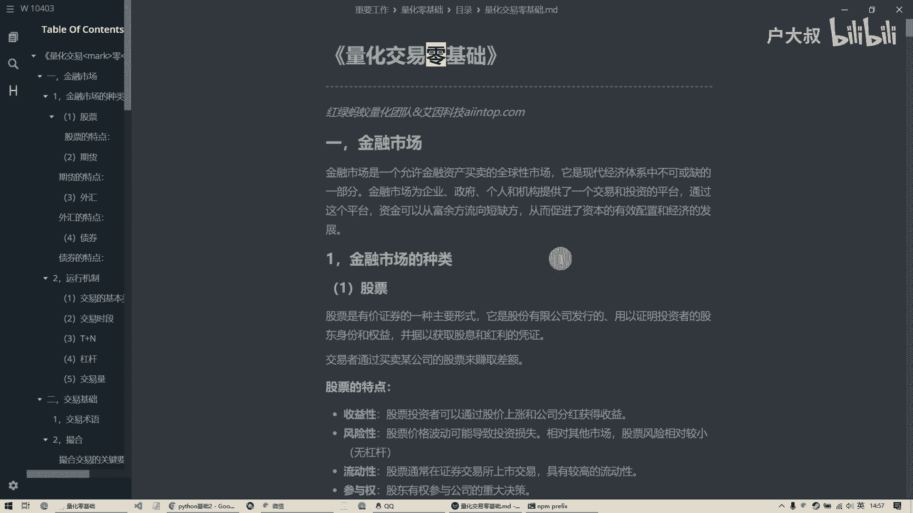

在第二课里呢，主要是给大家讲一下这个分支跟循环好，那我们现在呢先看一个例子，就是这里面呢是我用了一个，它Python的内置的一个函数叫input，他这个作用是干嘛的，就是哎前面的提示一句话。

就是咱们这个书的请输入一个数字，然后后面呢他会让你去提示你说输入一个数，然后输入完了以后呢，哎存在这个啊咱们这个A这个变量里啊，这是咱们上节课学的这个赋值嘛一个等号，然后呢咱们来运行一下。

运行一下以后呢，他这就提示了，请输入一个数字，然后这是一个框，我就随便输入一个数字哎，那他们就会存在这个A里面，然后打印出来这个就是三，就是咱们存的这个三，然后呢现在呢咱们呢是根据这个有的时候呢。

我根据这个用户的输入以后呢，我要做一些判断，就是如果说你输入的内容不同呢，哎我判断一下你这个内容嗯是要显示什么，或者说别的操作，那可能就会用到这个分支，分支的作用呢，就相当于是当你满足某个条件的时候。

我就执行某一段代码，如果你不满足条件的时候，我在执行别的代码啊等等等等，这种啊，这个叫做分支，分支呢它这个语法呢也很简单，就是要加一个if，然后呢后面呢跟这个你的这个一个式子。

这个式子呢最后呢结果一定是真或者假，就是满足还是不满足啊，这个咱们上节课也说来着，这种属于那种逻辑运算，然后呢咱们把这个A呢用一个int这个函数呢，把它转成这种数字类型的整数类型啊。

因为它这个A呢输入进来，它是个字符串嘛，然后呢给它强制转型转换转换成这个整数，然后判断一下他是不是大于十，然后呢如果说呢这个条件满足呢，后面跟一个冒号哎，底下的这些话。

它呢就是咱们这个呃满足条件时候所执行的，然后这还有一个else一个冒号，底下呢就是说如果你不满足的话，就走这个条件，这个呢就成形成了一个分支啊，这里要注意的时候。

Python的语法呢他呢嗯这块呢是可以写很多话的，啊我可以哎我可以输入很多，那他怎么知道哪这些呢是是要运行的啊，那他怎么来区分呢，他因为别的语言呢它是有个大括号给括起来，它这个没有，它呢全靠这种缩进啊。

他这个呢是四个空格，它这个是缩进的，只要是缩进的，他就认为啊这一段代码呢都是这个条件下的啊，那他呢就会执行这个，那咱们执行一下咱们这个这个程序呢啊，他是问这个小于十，因为呢咱们刚才输入是三。

那三呢就不满足这个条件，不满足的话，他就走这个else，然后他就会打印这句话，好最后就是这样啊，然后现在呢咱们来复杂一点儿，好结合咱们上节课啊，咱们可以这样就说输入一个ABC3个数。

然后呢如果说嗯这个A呢大于这个B，就是第一次输入的这个数，要比第二次输入的数大，并且这and这是咱们上一课学的，就两边都要满足中间的整个这个式子才为真啊，然后呢，如果你这个数第一次输位数呢。

也大于第三次的这个数，那么呢就会显示这句话，然后呢如果说呢这个不满足呢，那这一块就不会走，那最后呢不管怎么样，是走这个还是不走，这个最后呢都会打印一个结束，那咱们来运行一下，比如说我输入一个十。

再输入一个二，再输入一个八，然后呢他就能打印了这句话，因为他满足这个条件，这个十呢要大于这个二，然后这个十呢也大于这个八，所以他就会走这个，走完这个以后呢，它也会执行这个结束啊。

这个呢就是咱们这个呃结合咱们上一次的课，然后再加上这一次呢，他这个是条件呢是可以哎用这种and呀or啊，这种的逻辑符号呢来进行一个拼接，实现了就是两个不同的条件，然后呢你是呢并且的关系呢。

还是或者的关系呢等等的啊，你可以这么组合，然后总之呢最后呢他这个这个这个这个式子，计算完了以后，他必须要得到一个真或者假，如果是真的话，它就会执行这个里面的代码块，如果说呢他这个为甲。

那这一块都不会执行啊，就会走后面的啊，这个呢这个话呢它呢是没有缩进的，也就是说呢它不属于这个if这个分支里面的，所以呢不管你是呃这块儿满足不满足，最后都会打印这个结束啊，这个呢是一定要注意啊。

人如果呢咱们把这and换成or会怎么样，换成那个或者会怎么样啊，这个呢可以大家自己去再琢磨琢磨啊，然后现在我们来说这个呃新的这个语法，就是这个if呢它可以呢是多个判断，比如说呢我这儿呢输入一个A。

然后并且呢把它转成整数，然后现在这个A里面存的是一个数字嘛，然后呢如果说这个A呢，它呢可能是个成绩啊，他比如说呢它大于等于90，那也就是说呢你这个考了90分以上啊，那就得U嗯，如果能没有不满足这个条件。

然后呢他们会判断这个l if啊，这个呢就相当于是else if，也就是说呢我这个条件不满足，那我再看看这个条件满不满足这个条件，如果不满足的话，我再看看这个条件满足不满足，如果这些条件全都不满足。

那我会走这个else啊，这个呢是if判断的的一个新的一个语法，就说呢我可以在一次判断中呢啊走不同的分支。

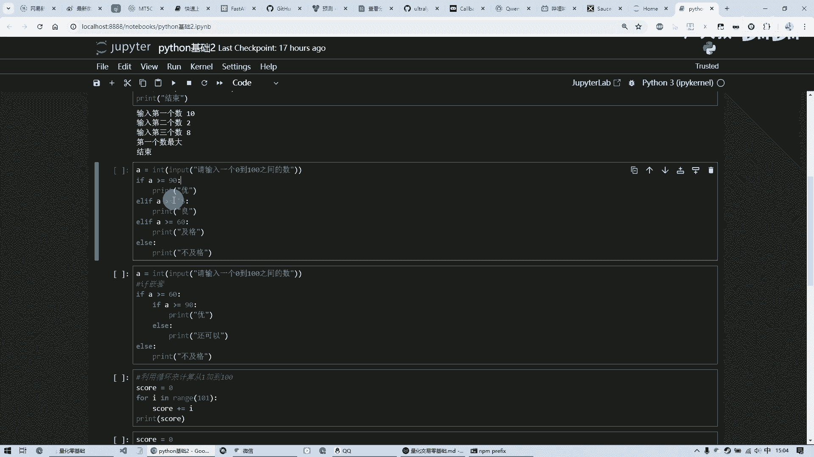

也就是说呢，不像上次那个只有这个呢只有两个分支，这个只有一个分支。

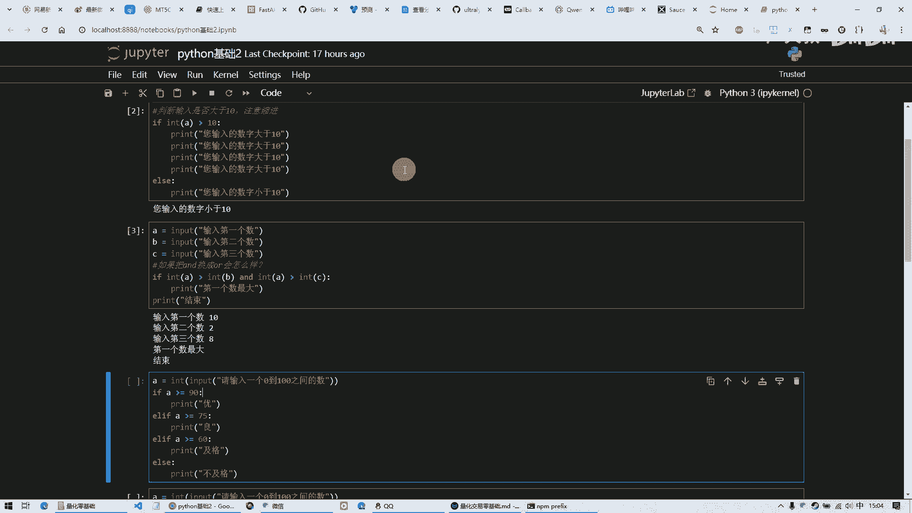

这个是一共四种情况，然后呢他呢就会根据你这个输入的分数呢，咱们最后呢哎得到一个结果，那咱们也运行一下试一下，假如我输，我得了一个88分，然后呢最后呢他就会走这个量，然后呢其他的这个条件就都不会走了。

这个呢就是呃咱们这个e l if，这个呢其实就是else if啊，他这一个有一个缩写，它这属于关键字啊，必须要这么写啊，后面呢跟也是跟一个这个条件的这么一个式子，然后呢他来判断满足不满足啊。

这个呢是啊多个分支，然后呢这个例子呢是这个分支呢可以嵌套，也就是说呢还是刚才的例子，我再输入一个数，然后这个数呢也转成这个整形给这个A以后呢，然后呢我呢判断如果它呢它是大于等于60的。

那我再进一步里面再判断，你具体的是90分以上的，还是不到90分的啊，如果呢你你第一个条件呢是，这个都不到这个60分，那直接就走这边了，就不及格了，它呢是可以这么嵌套的，然后这个呢这个缩进呢。

也就是说这一块呢它呢是属于这句话的，也就是说这句话只要满足了，他就会走这里面，然后呢这里面呢又嵌套一个艺术的，它里面再缩进，好，这样啊，这两个是又又再缩进了，前面等于是八个空格，哎。

这样的话它形成了一个嵌套的关系，所以呢咱们可以试一下，这次呢我得了一个比如说是78分完，那他就可以走到这里就还可以啊，这个呢就是这个是一个分支的这个嵌套啊，这个呢是咱们的呃。

这整个上面这些呢都是分支的这个语法啊，这个分支呢循环这两个呢，是这个任何一个编程语言里边最重要的一个呃，语法啊，就是任何一个编程语言都会有这两个啊，因为实在是他这个东西就是控制流程的嘛。

所以说这个是非常非常基础的一个额语法，咱们呢必须要掌握，这个呢实际上就是一个逻辑关系，就是判断判断完了以后走不同的分支啊，这个呢是分支，那咱们来看看循环循环呢啊我呢做一个例子。

我呢想做一个从一加到100，假如说我要做这么一个功能，那么呢如果我呢自己在这个代码里写啊，然后这个数先给它初始化为零啊，把这个零给他，然后呢我呢他呢再加一，然后再加二，再加三，再加四，一直加到100。

那有这功夫呢，我拿计算器都算出来了啊，就这个这种式子就是重复劳动的，而且呢我呢想让它哎有没有方法呢，就是让它自动能能够算出来呢，那就需要用到循环，循环呢，意思呢就是说呢我这儿有一个for一个关键字。

后面的跟一个式子，这个式子呢也是必须得到真或者假啊，如果是真的话，它进入这个循环体执行里面的代码，然后呢他又回来再判断这个式子是不是成立，如果还成立的话，继续再执行里边的吧这个代码。

然后直到呢这个式子不成立，然后呢他会跳出这一块就执行完了，然后最后呢会打印这个，然后最后结果呢是5050，那就是从一加到100，就是正好是这个数啊，所以他的语法呢就是说啊我呢给它一个范围。

就有一个叫range函数，这个range函数呢很有意思，它呢可以是一个参数，两个参数，三个参数，那我们分别说一下这一个参数呢，代表呢我呢从这个一开始，从这个我给他一个范围101。

那最后呢他不会包含这个101，它就会到100，它是它呢是一个这个嗯就是不包含的关系，也就是说我给你这个数呢，它默认会从零开始，到这个这个数呢减一这个位置，他到去循环，然后把这个数呢就会给这个I。

然后这个I呢就是第一次呢它可能是个零，然后第二次是一，第三次是二，这么着一直下去，然后呢把它都加在一起，这个语法呢相当于是加等于，这个呢就相当于是，等于，然后再加上这个这俩是等价的。

然后呢这是一个简写的写法，也就说呢写一个加等于呢它相于它自己，再加上后面的这个啊，就是就是这样了，它自它呢等于它呢加上这个I，然后再给他这么着的，所以说呢我呢直接呢哎写一个加，等于这是一个简写的形式。

好这样的话呢他最后呢结果呢打印出来，他最后就是累加了啊，第二个例子呢跟这个上面例子是一样的，只不过呢他这个range呢是两个参数，两个参数呢它是一个左边是闭区间，右边是一个开区间这么一个范围。

也就是说呢他这块呢会包含我给他一个范围嘛，我这块呢是包含的，这块是不包含的，然后呢最后呢结果呢跟上面是一样的啊，他呢只不过呢我会给他一个开始的范围，跟结束的范围，这个呢是只给一个结束范围。

它默认从零开始啊。

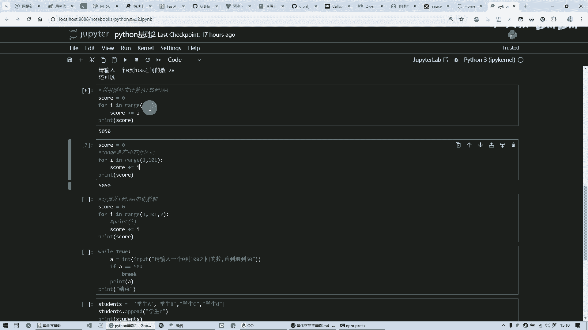

这个呢就是它两个参数的意思，这个呢是我可以第三个参数给它一个步长，那也就是说呢每次呢它呢是从比如说从一开始，那第一次是一，第二次是二，这么着来回循环，但是呢我给他一个步长，也就是说呢每次你要跳跳过一个。

他是他每次呢是步长，原来是默认是一吗，他现在变成二了，那他这个最后呢就是所有的基数和，啊他呢会每次呢就是从比如说从一开始，然后呢下一个是三，因为它是有一个步长是二嘛，给一个就变成三，然后是579这么着。

然后呢他这个呢就是哎每次呢跳一个啊，这个是他这个三个参数的意思，然后呢还有一种循环呢叫做while循环。

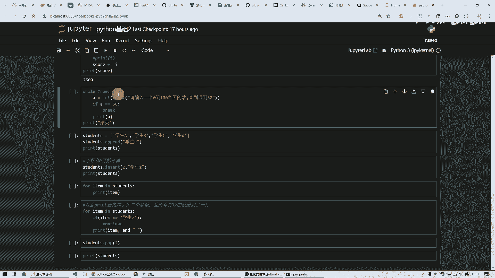

while循环呢，它是呢直接就可以条件里面就执行，执行呢，知道吗，这个这个条件不满足，或者是呢用别的方式能跳出这个循环，而我这个呢就是一个典型的死循环，好while后面跟一条件，这个条件是什么呢。

没有任何判断，直接写一个真，那它永远会执行，那这一段代码会永远执行，然后呢我呢就是一直呢一直呢在这个输入啊，一直在输入一个数，这个数呢如果说呢等于了50，那么就跳出这个break也是一个语法。

是会跳出这个循环，然后如果说不满足这个条件，那么它就会打印出来，然后呢再下一轮循环再会让你输入一个数啊，直到你呢那个输入是50，如果说不是50，那就再循环，就一直这么循环，就是成为一个死循环。

然后最后整个循环结束的话，它会打印一个结束，那比如说第一次呢我输一个一，那么他又问我啊，再输一个数，那我输一个二啊，他还继续，他会一直这么下去，直到呢有一天呢我输了一个50好。

那结束了他这个呢循环就结束了，否则呢它是一个死循环，所以说呢这个true呢咱们要注意，就是说一定要给他一个能够跳出的，这么一个条件，否则呢它就会一直在这里面循环，循环循环就死机了。

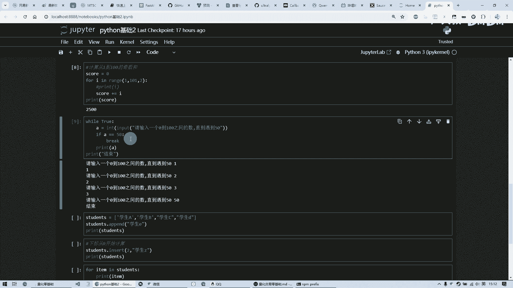

好下面呢我们再结合一下上次这个例子，我们呢这是一个列列表啊，list这是一个中括号嘛，是个列表，这里有四个学生，有学生A学生B学生C学生D，然后呢我呢这个列表呢这个存在这个变量里。

这个是我们上一次课学的，然后呢它呢这个列表呢它自己呢也有一些函数，加一个点儿，然后后面跟一个函数名，这个呢是这个函数名，是它这个列表里面所自带的啊，他呢可以呢往后呢加一个新的学生啊。

这个呢咱们再执行一下，最后呢就变成五个人了啊，最后加了一个学生E啊，然后呢如果说呢啊我们呢想中间插一个，那么呢我们可以调这个insert这个函数，它也是这个学生这个变量，他写一个点儿。

然后呢后面跟这个函数名，这些东西是在这个列表格中所特有的，然后呢我呢告诉他要插到什么位置，插什么东西啊，这样的话最后呢他就会插入了，但是这个二呢一定要记住我，我们现在这个学生ABC就是12345。

那他呢他呢并不是按照这样的顺序来的，这个在计算机里呢所有的列表啊，所有的这些所有的长串二的这种的列表之类的，他的所有的这个下标呢都是从零开始算的，也就是说呢这个元素呢是第0号，这个是第一号，这是第2号。

这是第3号，这是第4号，他有五个记录呢，从0~4，它是这么一个顺序，所以说呢如果差二的话，他会插在这儿这个学生C的前面，因为他是00号，这是一号，这是2号，插在这个2号前面，唉结果呢你看这个学生费呢。

看到插班差呢直接插到这个第三个位置了啊，这个呢是要注意它所有的这种列表，像这种Python啊，不管是什么语言，基本上都是从零开始计数记这个下标的啊，大家都是这样的，所以呢我们要注意这个这个二。

然后呢我们呢可以借助刚才学的循环呢一个for，然后呢从这个列表中呢啊，每一次呢给它一个数据加一个in，这样的话呢就是它呢会顺序的从第一条啊，得的数据呢给他，然后呢他那里面做一些操作，然后就继续去循环。

然后它从它的里面呢找出第二个来，然后再给他，然后呢再再这么执行，直到把所有的循环，这个列表呢全部都遍历一遍啊，这个最后结果就这样了。

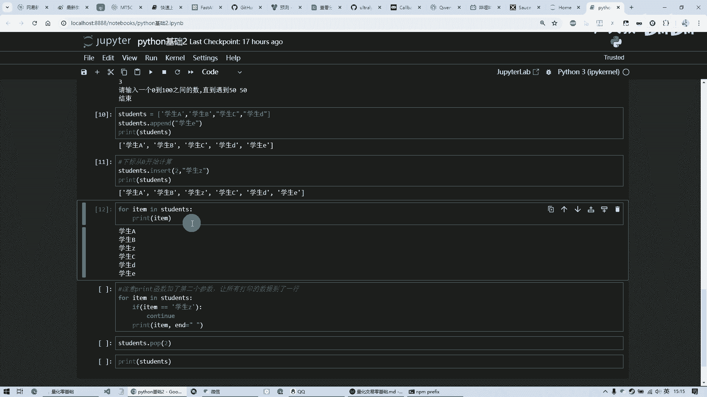

唉他是ABCCDE啊，这样这就是把刚才的这个，用一个循环的方式给列出来了啊。

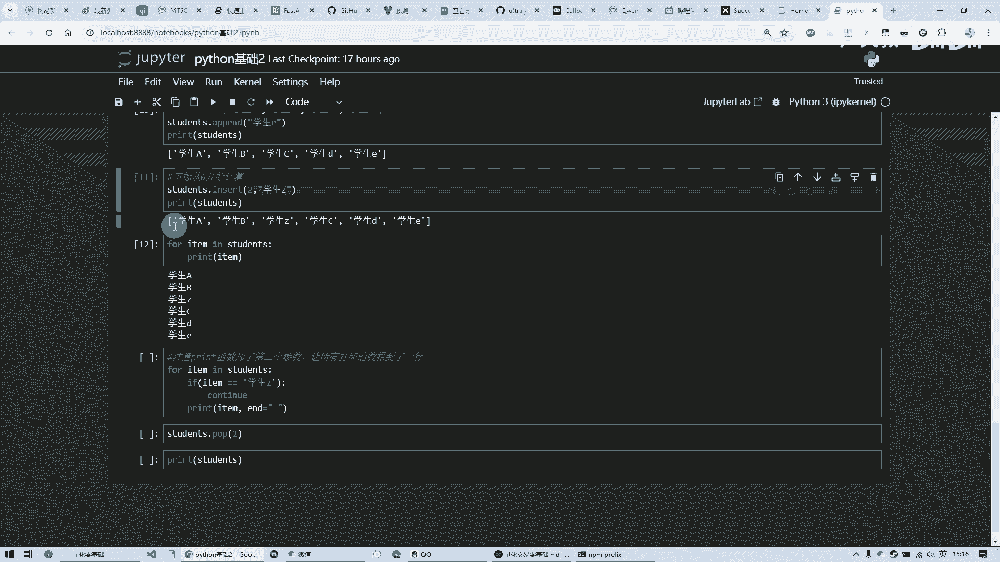

这个呢就是呃for循环的另外一种一种方法，他呢可以呢给他一个列表啊，然后呢他呢就会把这个列表呢给你，整个都给你导一遍啊，那当然我们再结合刚才那例子呢，中间再加上一些判断。

假如说呢我觉得这个学生Z呢特别讨厌他呢，等于相当于是差班了嘛，那么我呢判断一下，如果呢我在循环中呢碰到这个学生Z了啊，这两个式子相等了，那我就另一个continue这么一个呃一个关键字啊。

然后呢如果说不满足条件的，那就打印啊，这continue是什么意思呢，它会强制啊直接进入下一轮循环，那也就是说呢最后的结果呢，我呢会打印ABCDE把这个Z跳过，因为我满足这个条件。

它会走这个他就不会走的这个print，他呢就会强制的进入下一轮循环，这个呢是它的作用，也就是说呢我们通过这个continue啊。

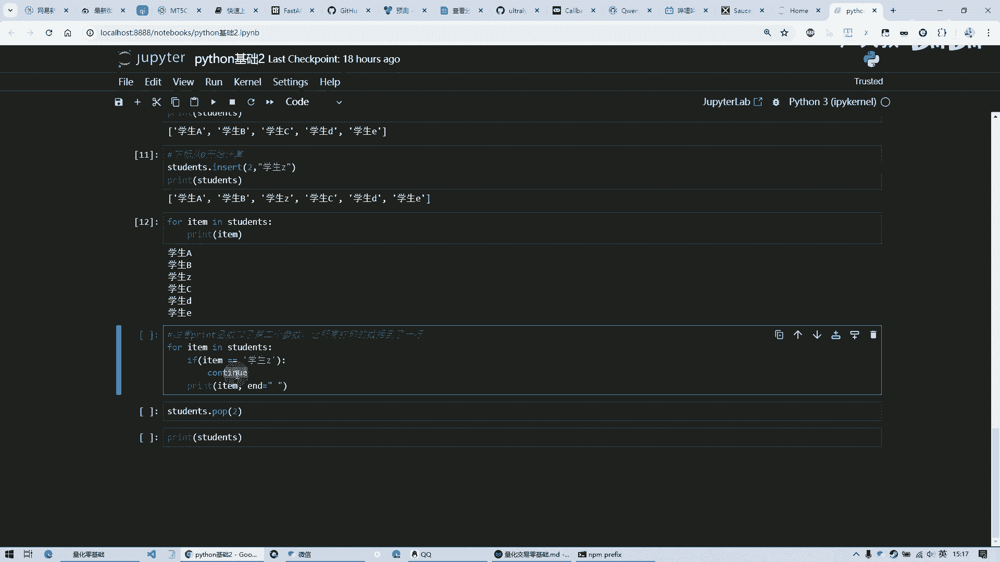

还有刚才讲的这个break呢是能够控制啊，咱们这个循环里面的一些流程啊，这个呢最后呢就会显示出是这样哎。

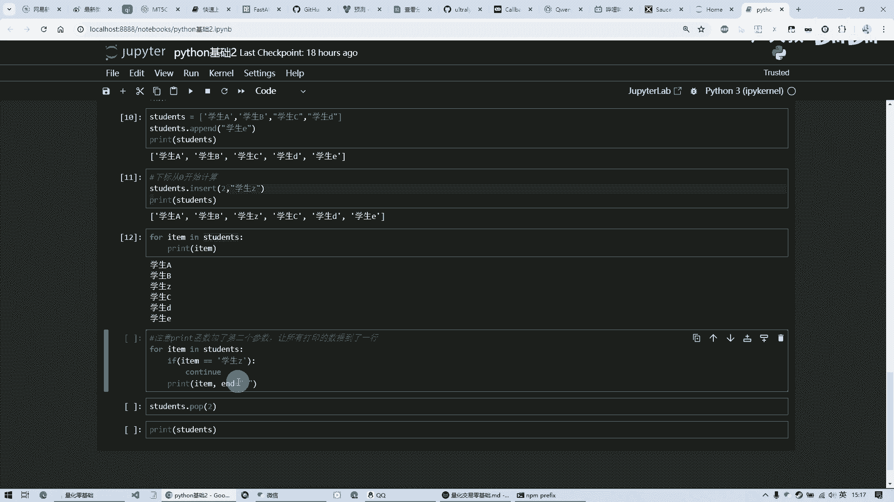

在一行打印出来的，那刚才是这么竖着的，每一条呢都是一条一行数据，那为什么他这个是横过来呢，是因为这个print呢它呢有第二个参数，它默认的情况下呢是回车换行，但是呢咱们告诉他。

你这个回车就是最后结束的这个东西是什么吗，我就加了个空，一个空空的空格的这么一个字符串，那也就是说呢，他呢就会被把那个回车呢就会被替换掉，然后呢他就会变成一个空格，所以呢每一个学生之间的都会有个空格。

并且呢咱们在这里面看呢。

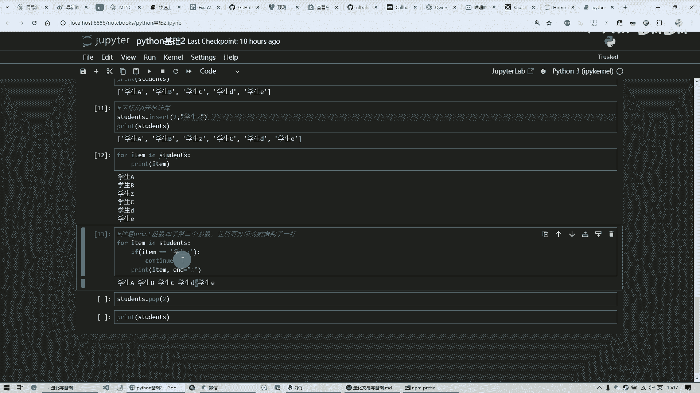

它是没有这个学生Z的，因为他执行到这个学生Z的时候，他发现这俩相等，他这个字符串跟他相等，那他执行肯定有它直接就下一轮循环了，等于跳过这条语句啊，也就是说呢他呢就隔隔出去了，把这个Z呢就没有打印出来。

然后最后呢我想删了它，那我就执行这个，然后呢这个呢就是一个弹出，弹出呢会把这个下标为二的这个记录弹出去，它会显示出来，并且呢从这个列表中删除了，那现在呢我们再打印一下，哎这里就没有那个Z了。

注意呢这个二还是刚才咱们说的，那咱们这个记录呢是这个是零。

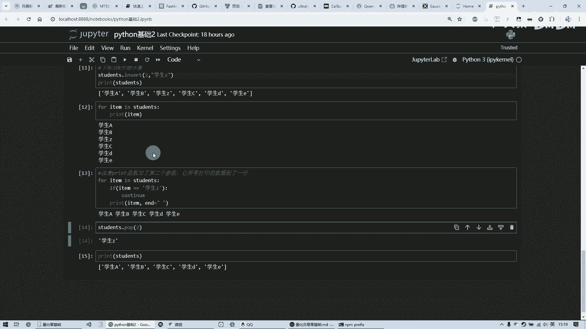

这是一这是二，也就是说呢我输入一个二呢，实际上呢是把第三个这个学生给弹出去了，给删除了啊。

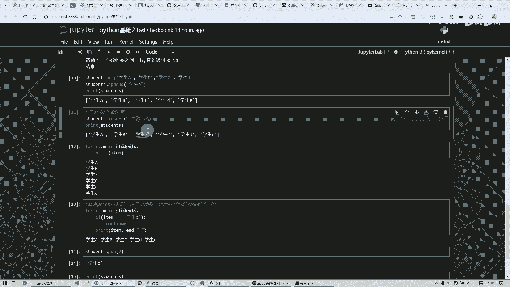

那他那个最后呢这个Z就没有了啊，这个呢就是呃啊今天讲的诶分支跟循环啊。

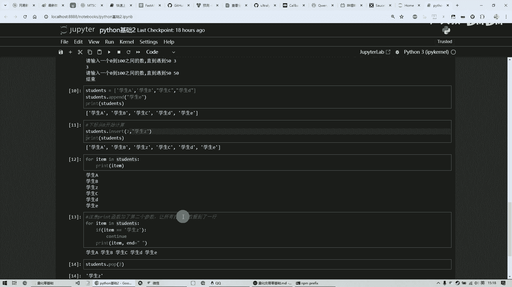

那这个分支和循环呢实际上是非常复杂的啊，咱们可以利用它呢做一些很多的功能吧，啊但是这个也是又基础吧又很重要，所以说呢咱们在线下一定要呃多练习啊，多掌握才能这个了解他这个中间的精髓。

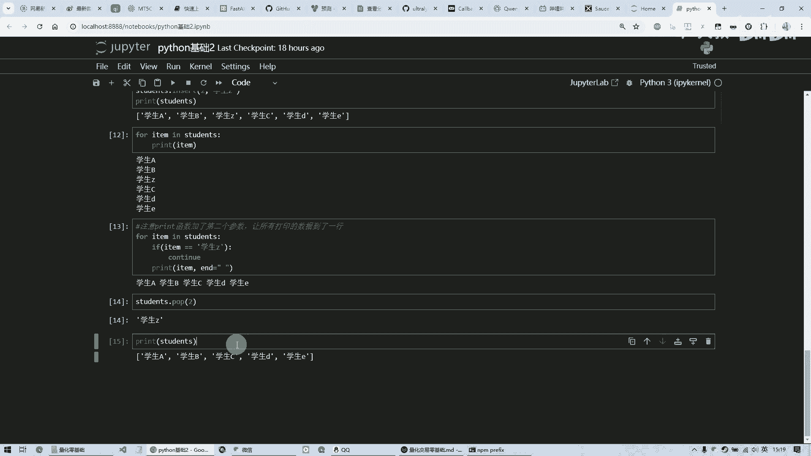

而这个循环呢啊如果说处理不好。

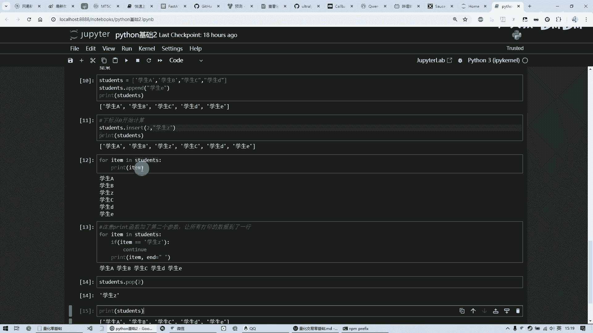

那也会产生一些什么死循环啊，一直就出不去了等等这种的，所以说呢用起来也要小心一些好，那今天的课就到这里。

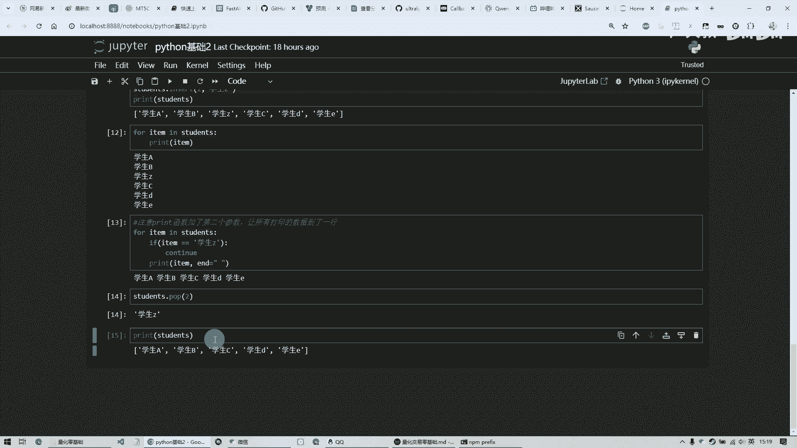