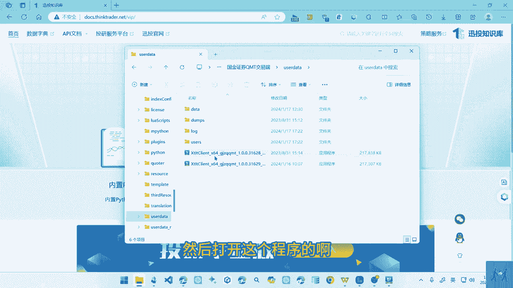
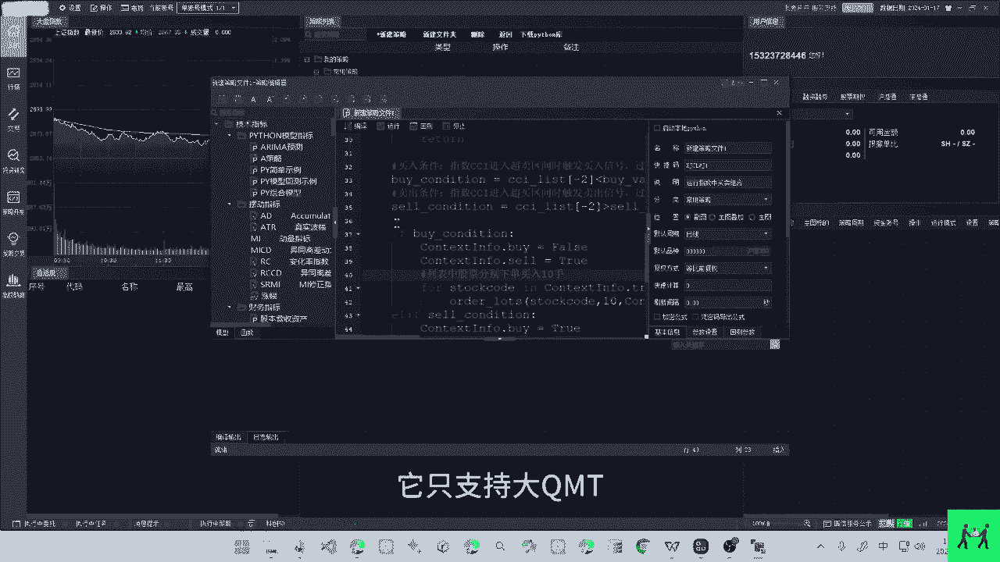
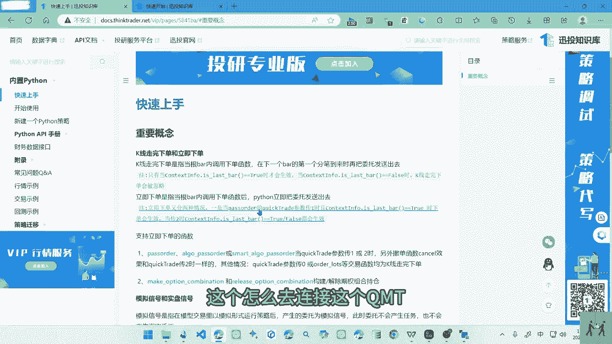
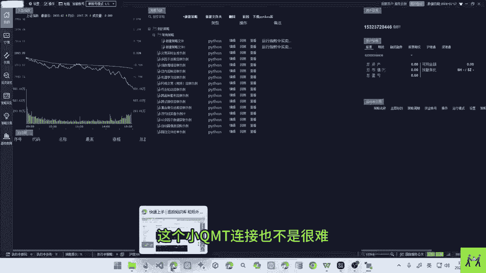
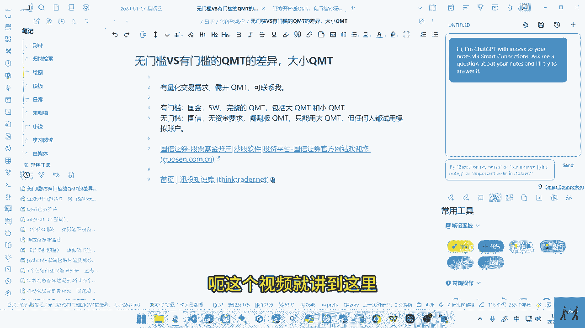

# 量化交易，无门槛VS有门槛的QMT，大小QMT #python #量化交易 #股票交易 #QMT - P1 - 无限超人Infinitman - BV1L14EeuERB

呃这个视频我们来看一下这个QMT的，一个开通QMT的话，它有一个大QMT跟这个小QMT呃，大小QMT的话，它是构成了完整的一个QMT，但是狗性提供的这个mt的话。

它是阉割版的一个全T只能用这个大q mt，但是它是可以用这个模拟账户的，就是任何人都可以去注册去试用啊，通过模拟账户去适用它，呃我们来看一下这个QNT啊，这个信投这边的一个知识库。

知识库的话它有三个版本，一个是内置的版本，然后一个是延伸的版本，呃这个是VBA的一个编程，但是相对而言这个是比较少人用的啊，如果你懂这个语言的话，也可以用这个BBN进行编程额。

然后要说的就是这个大QMT跟这个小QMT，这个内置的QMT为什么称之为大QMT，这个为什么称之为小q mt呢，因为这个QMT的使用的时候，要接入一个啊极简版啊，就是这个我们要点这个极简版的一个模式。

极简版模式的话，它是依赖于这个Python的一个库的呃，它这个是它的一个安装的一个路径，而它是需要通过这个mini的一个数据啊去调用的，这个是用户的一个数据啊，然后一个mini版本。

它是要通过这个啊mini这个文件夹去调用的啊，我们要打开的话是打开呃这个，然后打开这个程序的呃。

这个程序的话，它进入的也就是通过这个极简版进入，因为它借助的是这个mini的一个文件夹，所以简称它为一个小QMT啊，相反啊，内置的我们就啊认为它是一个大的QMT，内置的QMT的话。

我们只能登录上去以后啊，从这个里面去编程，并不能在外面去编程的一个q mt啊，比如我们打开这个，我们看这个国信他是没有这个极简模式的，而这个注册以后，他就提供相应的一个模拟的一个账户。

可以通过这个模拟的账户进行一个试用，如果我们使用大QMT的话，我们只能在这里进行一个编程啊，这个是它的程序进行相应的编程，如果是大QMT的话，它有很多的规则的文档是非常长的啊。

个人是不建议使用大QMD的，因为它跟原神的Python存在较多的一个文档，当然如果你喜欢界面的话，你可以啊通过这个大Q提取试用，国信这边的话，它只支持大k mt。

不支持小k mt，我们可以来看他的一个知识库，知识库的话，它内置的话它的文档是呃有几百页，非常的烦人啊，所以这个我对大QMP也是不怎么熟练，然后我们可以看一下这个小的q mt，小的q mt的话。

它是遵循这个Python的一个编程的呃，它的这个代码的话是相对比较少的，它只有两个类啊，我们学习这两个类就可以了，一个是获取这个行情的一个模块，然后一个就是获取这个交易的一个模块，就两个模块。

但是如果你用大q mt的话，它的函数啊，都是这个QMT自己去定义的一个函数，自己去阅读的话非常麻烦，在灵活度上也是很受限的，所以如果你的Python比较好的话，呃，可以选择这个小q mt。

不用去看那么多文档啊，自己什么都是自己去写哦，这个就是这两个q mt，我们看这个内置的QMT，内置QMT的话，它有很多接口啊，啊它的都是自己去定义的一个函数，很多函数这个就是这个QMT的一个文档。

然后他这里有一个字典可以去进行一个查询，你要查询这个呢延伸的还是这个内置的一个Python，这个两个Python它这个内置Python的话，它这个有个图的一些解释，反正它的文档是很长的，呃。

这个视频就简单的介绍一下，这个QMT的一个文档呃，下个视频我们来呃，说一下这个小q mt的一个链接，因为今天有这个网友问到这个，怎么去连接这个QMT。

当然如果你用的是大q mt的话，你是在这里面啊进行编程的，然后我们进行运行就可以了，就不用去链接它啊，直接在这里去使用，这个就是大QMT的一个好处，在链接方面没有那么繁琐，但是如果我们去看文档的话。

这个小QMT链接也不是很难啊。

下一个视频来说一下吧。

