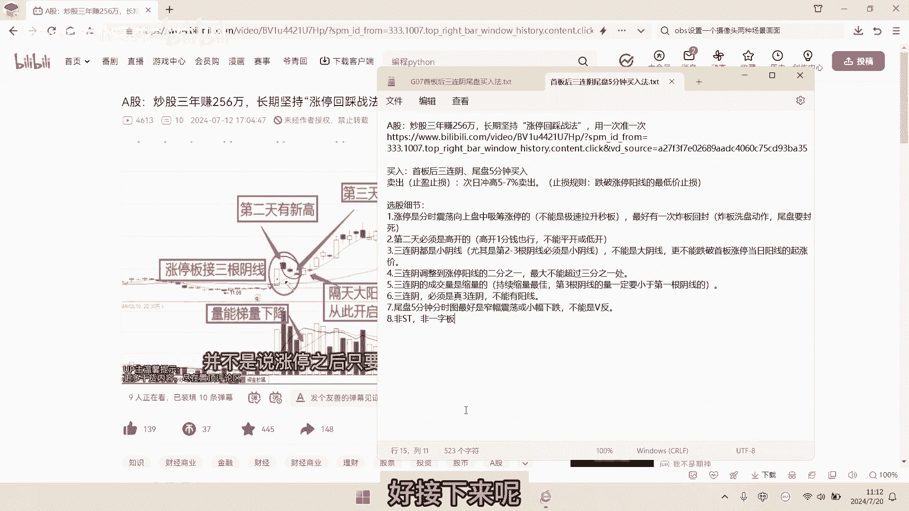
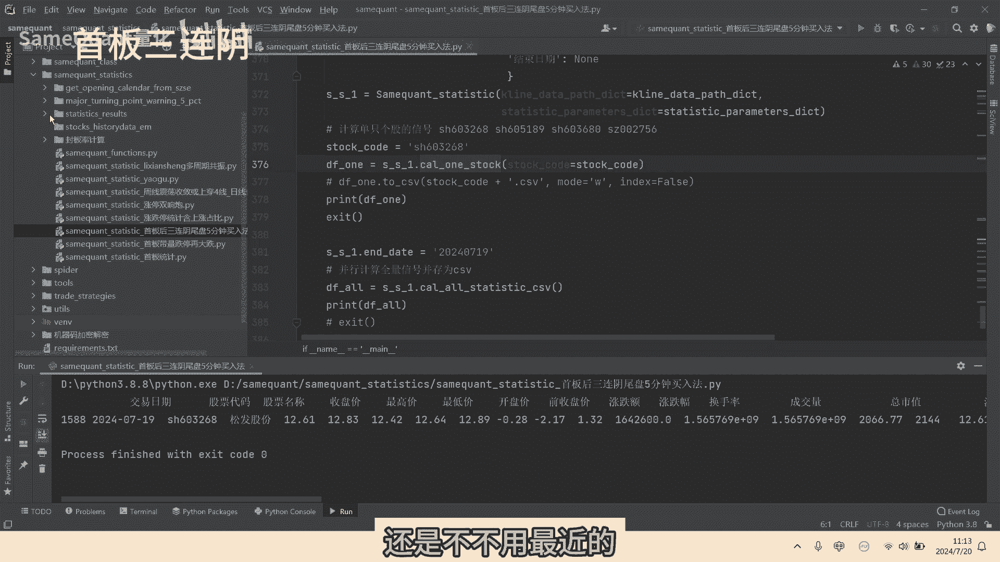
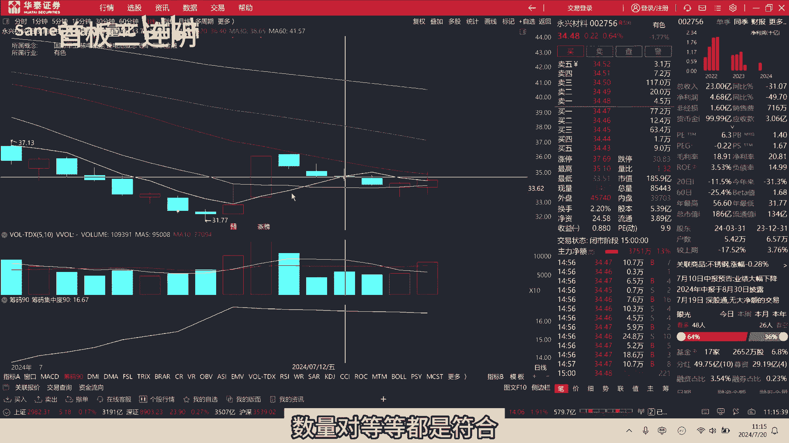
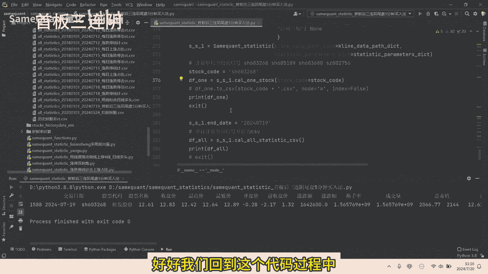
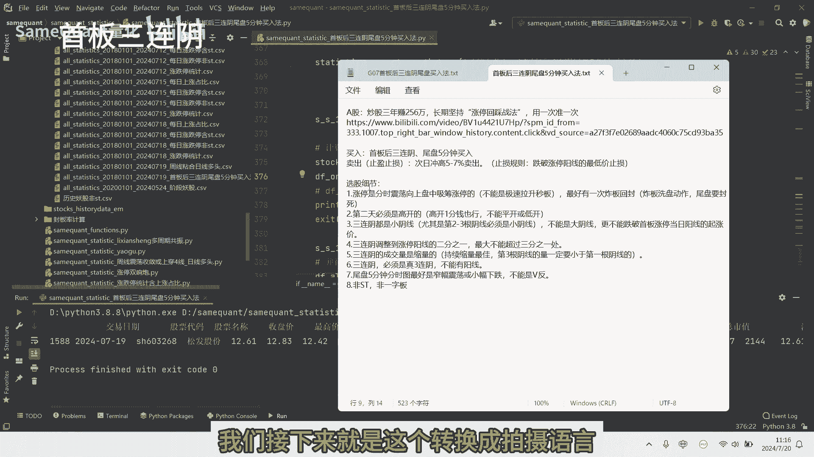
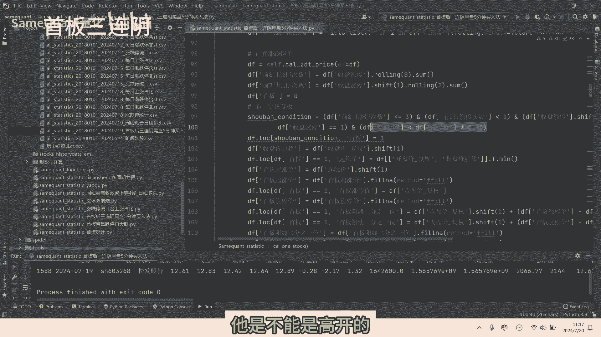
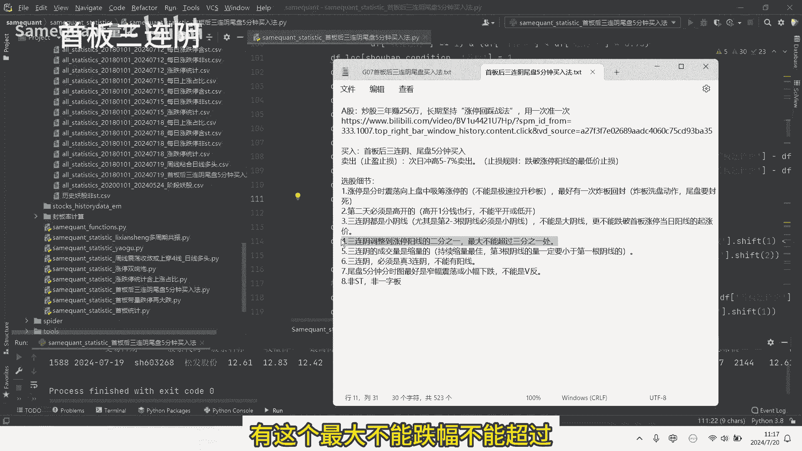
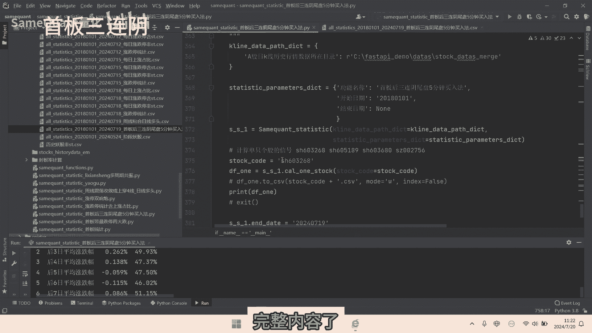

# 量化分析某博主的《首板后三连阴尾盘买入法》，靠谱还是坑人？ - P1 - SameQuant量化 - BV181421t7d8

网上有很多人分享他的炒股经验，他分享了到底是胡说八道还是有真本事呢，他们往往啊自称是高手或赚了很多钱，那现在呢无私的分享他的高胜率，战法或选股秘籍，那我呢也偶尔会刷到这类视频，如果看到是高赞的视频。

一般会认真看完啊，毕竟是高赞嘛，那如果我认为有研究价值的话，我会进行详细的量化统计分析，用数据来辨真假，这期我们就统计分析验证一个啊，自称炒股3年赚256万的啊，首板后三连阴，尾盘5分钟买入法。

我们先看一下这个视频，他的一个标题是3年赚256万哈，我们会看到它播放量只有4000多，但是他的点赞啊，收藏啊，这个分享啊将近接近20%，这个比例应该说是非常高了，说明这很多股民啊。

是日他这一个选股方法和战法的，我们看一下哈，播放一下，了解高5~7个点就可以直接卖掉，只要这种形态出现，并且符合条件，那第二天呢必然会有大阳线甚至涨停，那今天我要跟大家去讲的呢。

就是如何在这一天阴线的位置啊进场，然后在次日啊，也就第二天阳线的位置啊，我们冲高卖出，好像这个图的话呢，在第二根阳线啊，它是大涨了8%啊，为什么我知道呢，因为这个票是我最近做过的票，那比如这个图啊。

在这天第三根阴线的时候，我们进场，然后在次日啊这根阳线的时候啊，冲高我们可以卖出这支股票的话呢，当天冲高最最多是14%，好了，我们先暂停一下这个完整的视频，我们就不在这里播放了，然后我总结了一下。

他的一个视频里面的一个内容哈，现在呢把他的一些选股条件呐，各方面的整理给大家看，我们可以看一下啊，这个word文档里啊，首先我把它的一个标题以及它的链接也放进来，另外呢我就直接总结了他的一个买入。

读板后三连音，尾盘5分钟买入，卖出了也就止盈，止损就是次日冲高5%到七卖出，那止损的规则呢，就是跌破涨停阳线的一个最低价，止损，也就是途中啊涨停价的起涨价，这位置跌破了止损哈，选股的一些细节啊。

虽然他这个涨停首板啊，首先是要手板，另外呢他这个手板呢分时震荡，使震荡向上，盘中是吸筹的，涨停要选这种手板，涨停啊，不能是急速拉升的秒板，最好有一次炸板回封，大板呢可以视作是一个洗盘动作。

尾盘呢一定要涨停，要封死啊，你不能没有封死涨停，这种必行不行的是，第二天他必须是高开的，高开一分钱也行，不能是平开或低开的，三连音都是小阴线啊，尤其是第二根，第三根必须是小阴线，不能是大阴线啊。

更不能这个是跌破了首板，当日阳线的一个起涨价啊，你不能是三根连续的大阴线，直接把这个主板指涨价给跌穿了，这个是不允许的好，第四点是三连阴，调整到涨停阳线的1/2处啊，最大不超过1/3处啊。

这个点也是比较重要的，这一点我们要注意啊，因为接下来我们会用量化的语言，把这些条件全部都转化一下，那尤其是在这一点要要注意啊，如何去转化啊，第五个啊，三连音的成交量是缩量的啊，持续缩量是比较佳的。

然是第三根阴线的量啊，一定要小于第一根阴线的啊，这个是必须的，第六三连音它必须是真的三连音啊，你不能有阳线啊，这三根中不能有假阳线啊，不能有阳线，这个是必须的啊，第七尾盘5分钟分时图。

最好是窄幅震荡或小幅下跌啊，不能是最后5分钟不能是违反的啊，这个是不可以的，第八点啊，这个是我最后加上的啊，这个是非s st啊，把s st要排除掉，主板呢不能是一字板啊，一字板给排除掉啊。

好接下来呢我们就将他的选股思路啊。

逻辑转化成一个Python的一个语言，做一个量化的一个回撤，这个回撤开始日期，我们从2018年的1月1日，然后到结束了，叫到最近的一个交易日，好我们先运行最近的一个个股的啊，我们可以看一下叫这个用新的。

那么化幻影最近的这一支呃，还是讲了下，还是不不用最近的啊。

这个用最近的不好啊，我们用之前的好找一个找一个之前的啊，看到没，这个我们来看一下，也就是指只填这个，我们可以看一下啊，这个是否是符合的，首先呢这一天我们看到他是一个首板，20cm涨停，而且的话他是震荡。

那向上你看这也有炸板的一个动作，应该说是完美符合他的一个要求的啊，四这个也是小幅高开的啊，高开开盘价是高开了0。2%，这是符合的，这是三连音，是这个三连音是缩量的，这个怎么样。

这个三连音的第三根阴线没有跌破，它的起涨价的1/3处没有跌破，我们可以看到它是尾盘尾盘，当然它尾盘的5分钟它是向上拉的，这个可能分时图来讲，可能不是很符合博主他说的一个，要么是震荡或者是小幅下跌。

这个可能不是很符合好，当然我们去看一下啊，次日这个票他的表现如何了，我们可以看到他次日确实是开盘之后，一路直接是向上，最高来涨到了百十八个点，应该说是吃了大肉的，这个肯定是触发了5%到七的一个止盈的。

这个是没有问题的啊，这个是完美符合了的哈，我们再来看一下啊，另外的啊，比如说这只是永兴啊，看到这个就是一个反例了啊，这个你看我们看到这天，首先这个分时图手板分时图也是符合的，你看这是三连阴，三连阴。

他这尾盘介入尾盘，这个分时图是符尾盘5分钟，这个分时图是符合他说的一个条件的，包括成成交量缩量啊。

对等等都是符合的，这个是次是有一个下跌，跌了3%点多，应该说啊这支票呢他就说没有怎么样，没有没有没有成功吃，没有吃肉哈，就说有肉了，也有没有吃肉的啊，这个都是很正常的一个策略，都不可能说啊。

他是百分之百就能达到60%，已经顶天了，如果你你你信号的量特别多的话，好好我们回到这个代码过程中。

我们量化的一个步骤，就是要把这些首先你一个策略，一个思路，你买入也好，卖出的也还一个条件啊，他的选股的一些条件，你首先它是一个你要用中文的一些语言，首先要转换成Python的语言。

我们接下来就是这个转换成Python语言哈。

啧，我们就大概讲解一下这个代码的，核心的一个逻辑了，核心的一部分了啊，首先呢一个手板，那首先定义你Python里面什么叫手板对吧，手板，你你看我这里面定义，就是它前8日它涨停数小于三。

他前两日它没有涨停啊，他昨日他也是没有涨停，这个肯定毫无疑问对吧，它当日收盘是涨停的，他是不能是高开的啊。

它不能是高开的，不能是大幅高开，我这里限制是高开幅度小于5%啊，这里我就定义他一个手法，这也要计算它是这首板起涨价，这个计算方法还是很复杂的啊，手板的涨停价，这里要计算它的一个手板阳线的啊。

还有1/3价位，因为我们的选股条件里面有这个，有这个最大不能跌幅不能超过啊。

最大下跌不能达到涨停，主板涨停阳线的1/3处是吧，所以说你要把1/3这位置给计算出来啊，价位计算出来，另外这个手板后3。1，什么叫3。1，你要定义出来，还有这个三连音各种条件吧，成交量的各种条件哈。

我们统统的给啊，这个用Python语言给出来好，另外呢我们不是要统计分析吗，统计分析随缘，而我这里又加了一个叫次日触发5%，涨阴的止盈，我这个给它标示出来是触发5%止损，给它标示出来。

除了这个触发5%之外，还有一个就是按照他策略的一个思路，他是跌破涨停阳线的最低价止损，我们就统计一下，就说如果是次日买入，次日之后它直接跌破了这个涨停起涨价，对我们也给它标示出来，标示出来。

为了方便后面的一个统计哈，好这个单只个股的计算完成之后，我们这一个方法就是将所有个股历史的，从2018年的啊，甚至包含退市的啊，全部给他统计出来，统计出来，运算之后会得到这样的一个CSV文件啊。

长期的每一只个股的一个记录啊，全部都给他列出来，我们看到最近的一只是啊，也就是昨天啊是我们看一下是中发啊，看一下昨天是不是它嗯，差不多也是一个符合他的说的一个条件的。

你看这个分时图基本上符合这个是高开的，也是符合的，这个也没有跌破这个1/3处，三天基本是符合的，当然这个不不是让你们关注啊，这个只是举例说明啊，大家可以观察一下啊，这个呢就是一个统计分析啊。

对于我们这些信号所有统计好，我们接下来就直接运行一下，我们看到啊，这个是详细的历史的所有的一个信号，我们看到这个策略的话，统计期间是2018年到现在，信号总数是有740一个啊，出现了740一次。

那所有的信号，次日平均涨幅是0。526%，这个是正的啊，0。526%应该来说还是不错的哈，次日收盘上涨的一个占比是55。2%，这个也还是不错的，因为超过50%嘛，它下跌至45%嘛。

这个概率应该说还是可以的，是5%涨止盈的一个次数有多少次了，有145次，差不多占了百分之呃，20%不到的一个比例是5%，止损的一个次数是啊，65次不到10%吧，也就是说次日直接5%。

止损的次数不到10%，次日就是直接跌破起涨价的一个次数呢，50次啊，差不多是百分之百分之零点啊，7%的那个样子啊，这个概率也我们还统计了所有的信号后，一到9日的一个平均涨跌幅和收涨概率。

我们看到第一天的话，它收涨概率是啊，都为正呢，平均涨幅跌幅都为正数，涨概率是55%，大于52%，我们可以看到像后面来说他怎么样，他是一个逐渐下降的一个趋势哈，我们从这些统计结果我们可以看到。

这个是我们可以得出一个基本的结论，那这收涨概率大于55%，盈亏也比较好，盈亏的一个次数也比较好，你看止盈的次数是远高于止损的一个次数，那我们可以看到后1000的话，它的收涨概率是可以的。

所以说他是自合超短隔日交易，也就是说这个策略你去超短隔日交易，也就是当天买次日的，次日就卖掉，那这个是相对来说是可以的啊，是有一定实战价值的，你不能这个策略它就是一个超短的一个策略。

你不能持有五天以上或者十天烂烂，不是很靠谱，好了，这个呢就是我们本期视频的一个啊完整内容了，整个的代码源码呢我们是可以分享的。

有需要的直接私信留言即可，大家好啊，这里是神木矿车量化，如果你也对量化感兴趣，或者是对于你的策略信号，你想做统计分析啊，你对这方面感兴趣啊，也想学一学的话，欢迎留言私信。

