# 量化回测指标评价神器Quantstats - P1 - 橙子先生-量化 - BV1L2421N7nK

嗨各位朋友大家上午好，今天录一节课，关于讲一下一个量化分析的库，Constance，这个库呢是非常方便的，我们之前在做回测，很多指标的计算都是自己写函数的呃，那实际上呢自己写的。

他不符合这个Python的这种风格，Python就是能用别人已经生成的这种哭啊包，就不要自己去写，这样为了提高效率，呃今天时间有限，我们就快一快来介绍一下这个这个非常简单。

那么其实大家在使用量化的量化库的时候，首先要下载就可以通过pip in store，然后把这个库的名字放在后面就可以了，如果特别慢的话，可以使用清华源，清清华的这个镜像源是比较快的，豆瓣一般用不了。

好提醒大家一下，这是安装，安装完了以后呢，我们就可以直接生成，直接用import constance as qs，然后它非常简单，尤其是对美股，它是可以支持一键下载的QS点。

然后download returns就可以下载成为这个格式，当然大家如果是用国内的这种数据库来下载呃，数据尤其是这种收益率的数据的时候，我们一定要注意他这个是series格式，第一它不是NV。

它不是当派格式，第二它不是data frame格式，如果大家以那两种格式进去的话，就会报错的好，第一步就生成了这个series的这种收益率股票。

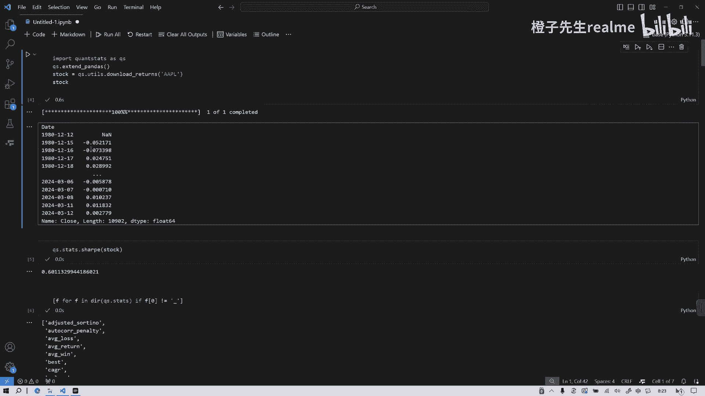

苹果股票收益率的这么一个时间的一个序列吧，那么第二步呢。

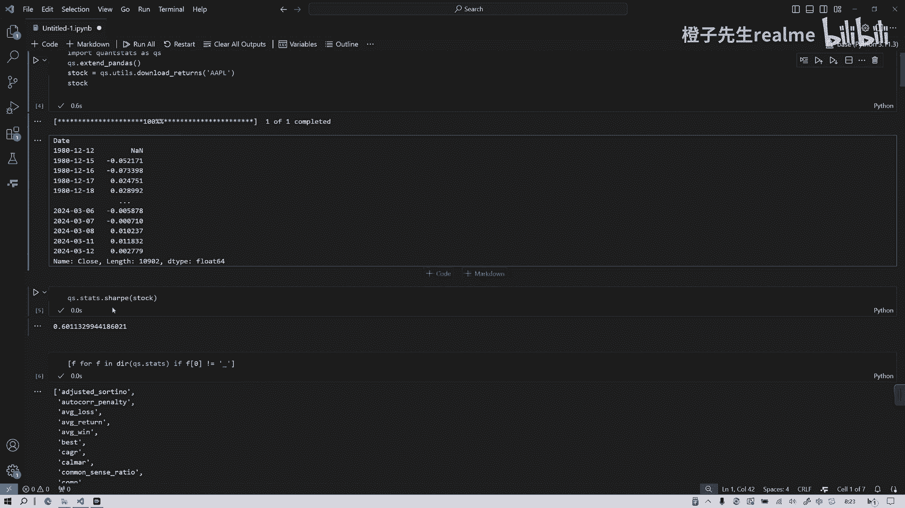

我们就可以通过qs dance点sharp来求他下不值，然后呢有很多很多只能求我们之前做量化，不是每一个回测的指标都要算吗，那这不用了，你看看有多少这么多指标都可以算，非常非常全，那实际上我们就可以呃。

其实量化回测系统它是一个系统嘛，是可以通过各个模块组装的，就跟汽车一样，轮胎是用什么的，发动机用什么的，那么这个就相当于我们在策略做完以后，会不会出现一个一个序列，就是它的我们策略整个收益的序列。

就每每一天它会有一列嘛，就是它的收益这样一个时间序列，那么把这个序列变成呃这种series s格式，然后放进去放到这个函数里面。

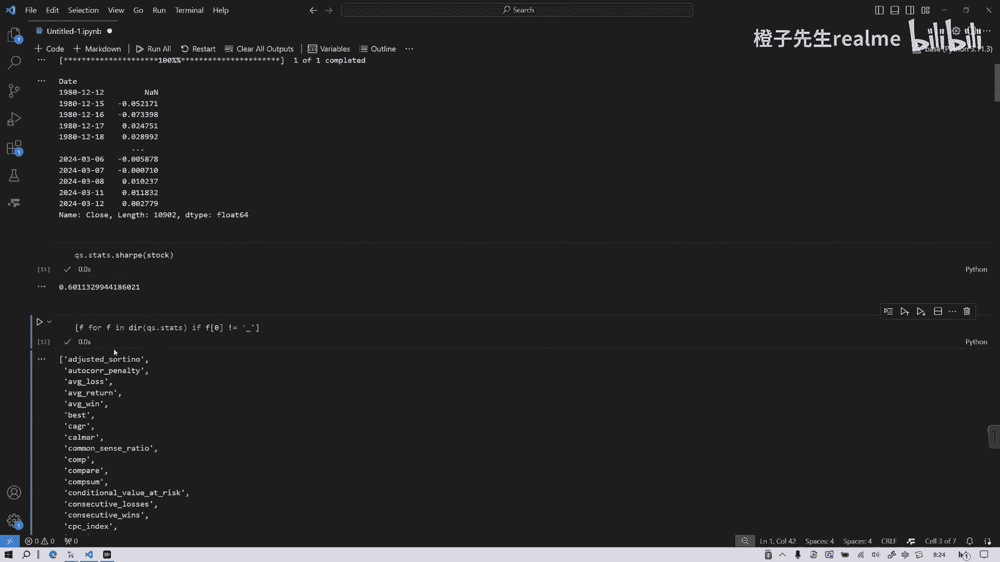

就会算出各种指标啊，第一我们先以图形的形式展示。

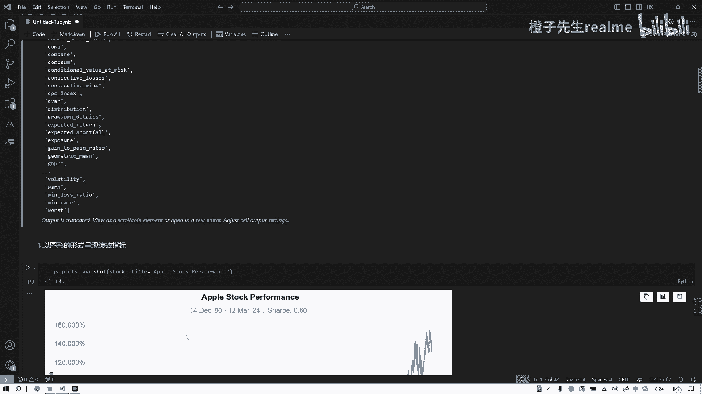

苹果这个股票的业绩吧，啊，我们看一下第上面这个蓝色的线是累计收益率，累计收益率哦，这是百分号。

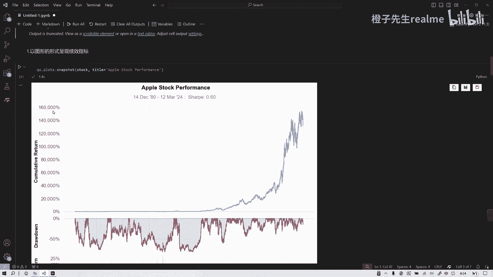

就完全除以二，得除以二是吧，但是收益率是非常非常高的，那么是从1980年开始涨了很多倍啊，那么底下的是底下的是什么，红色线是什么呀。

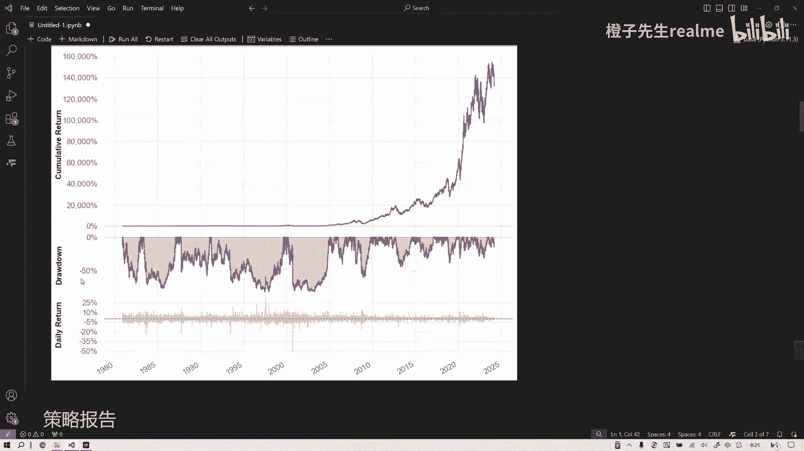

周down，然后这个黄色线是daily return，就每天的这个收益它是上下波动的对吧。

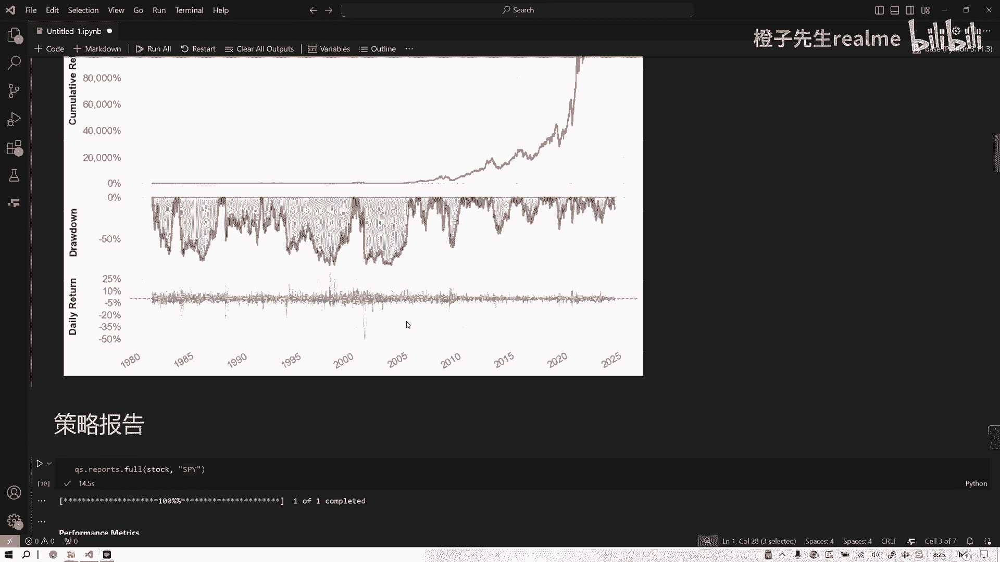

好我们看看这个后面这部分最重要的，我们快快讲一下，这个就是策略报告，策略报告呢这就非常非常方便了，我们之前包括我们用BTA时候，我们都觉得有点麻烦，就是你在做这些指标展示的时候。

它它是以那个编组的方式呈现，就给人看的很别扭，而不是像我们用一些量化平台，比方说巨宽啊，右右右框啊，这些他直接就给你生成一个完整报告，我们呃，你像一些外行的那些投资人来展示的时候。

你更多的是展示策略报告，要要要他们看得懂，而不是机器的懂那种数据结构。

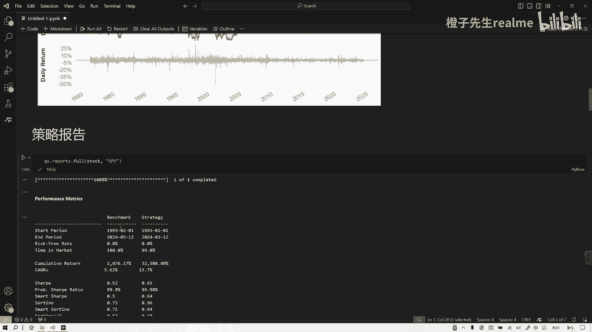

所以最好是这种方式也可以展示的，这非常方便，Qs reports for，就可以生成一个包含全部可报告信息的，这么一个SPY是指数，SC是苹果，就你一个基准吗。

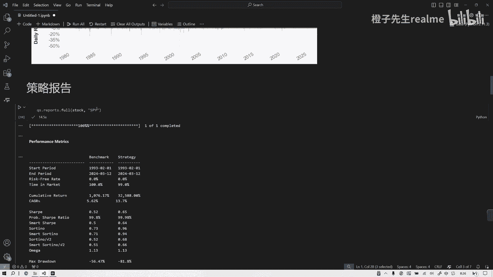

根据这个指数基准来比，我们就看到这个收益率最大回撤-56，benchmark其实就是被动持有嘛，就被动持有的所作策略，主举个例子嘛，啊半径Mark不是被动持有，是指数这个策略strategy就被动持有。

我们看看，它的开始1993结束，2024，这指标哈都是有的，好吧，然后我们来看看它最大的五个回撤。

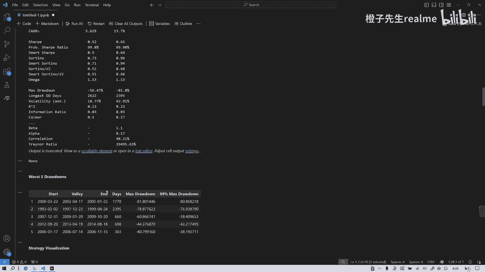

然后呢。

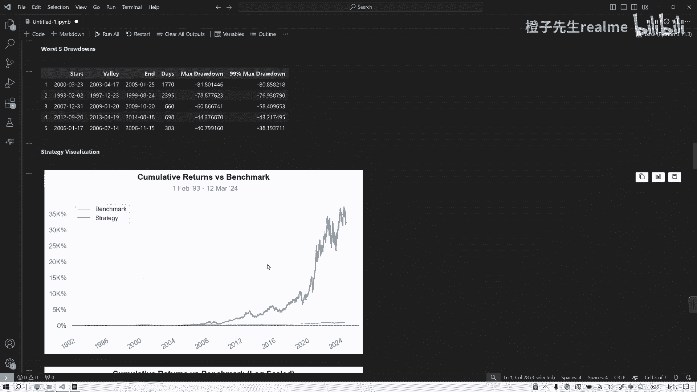

策略的可视化两条线啊，安全Mark是指数，这是它的收益，所以好的股票它是远远跑过指数的哦。

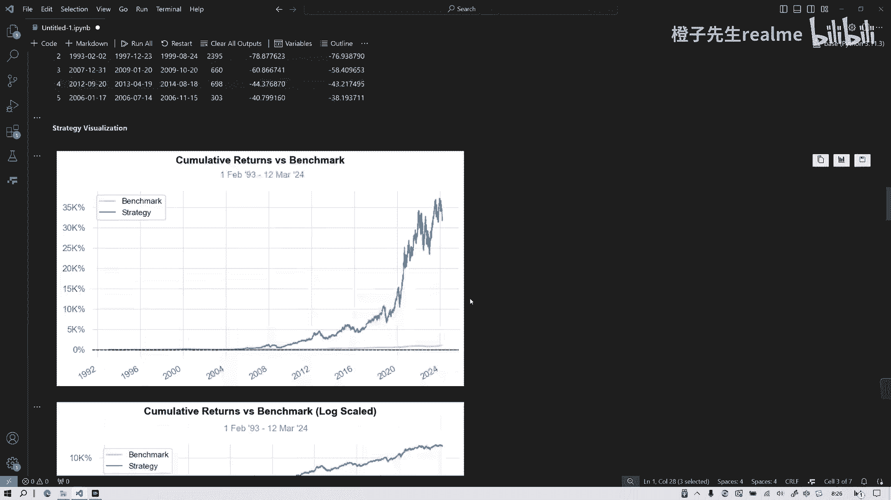

他是非常全，我就不一一列举了，今天就是主要给大家介绍这个数据分析库呃。

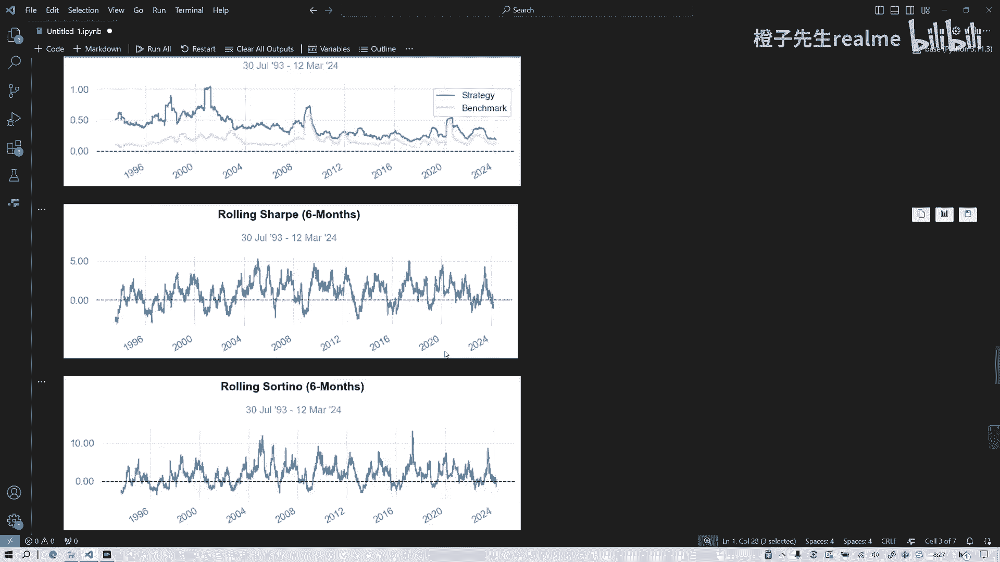

呃这个数据包这个软件包啊。

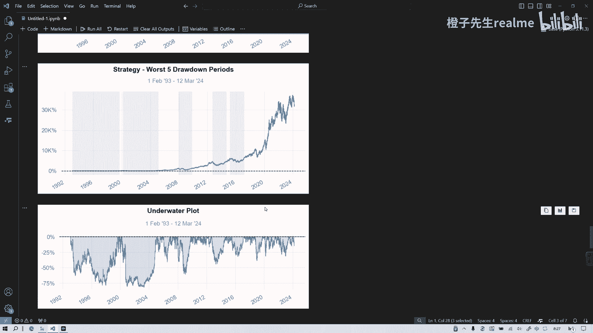

你看他就非常清楚就可以。

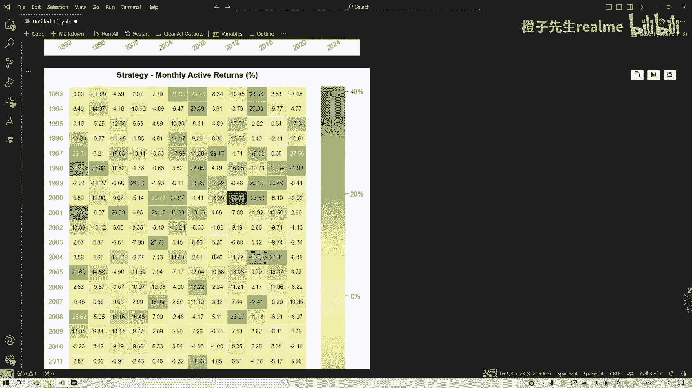

就大家如果在写这种学术报告的时候，也非常容易展示嘛，不用自己再一副一副的写了，你要如果一步一步代码写，你估计几百行代码就过去了。

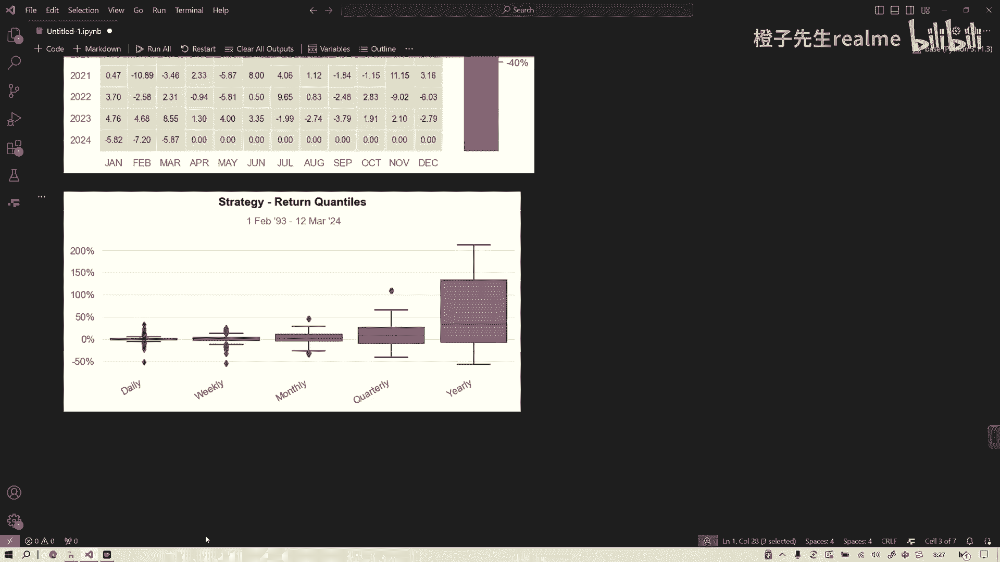

但他这个很方便，就就像调一个函数就可以了，好今天就到这里。

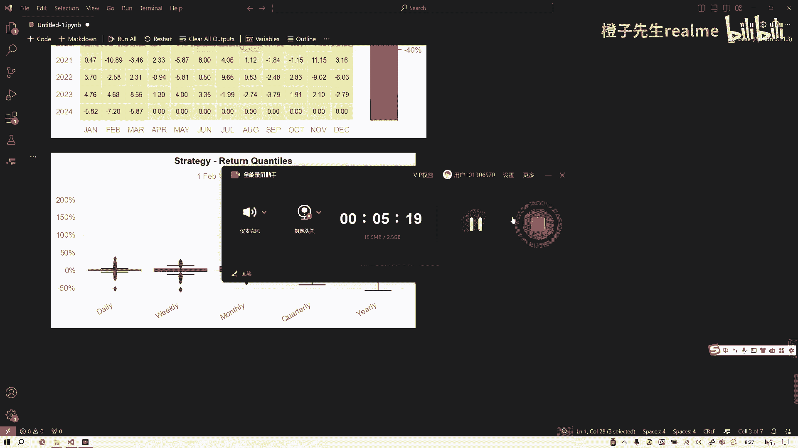