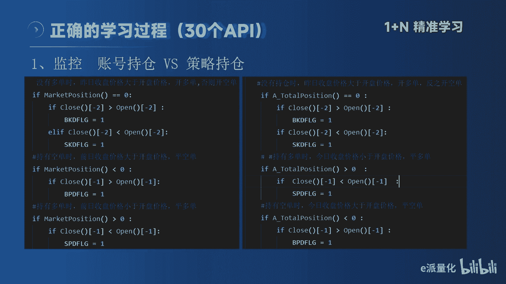
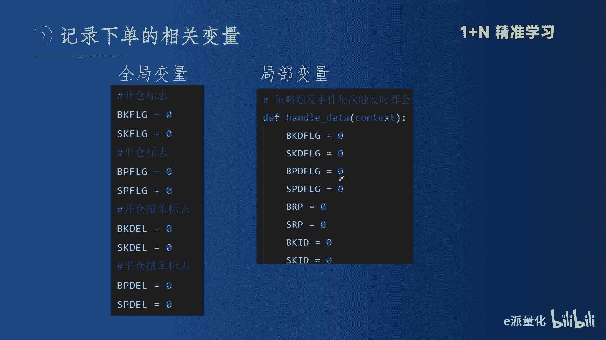
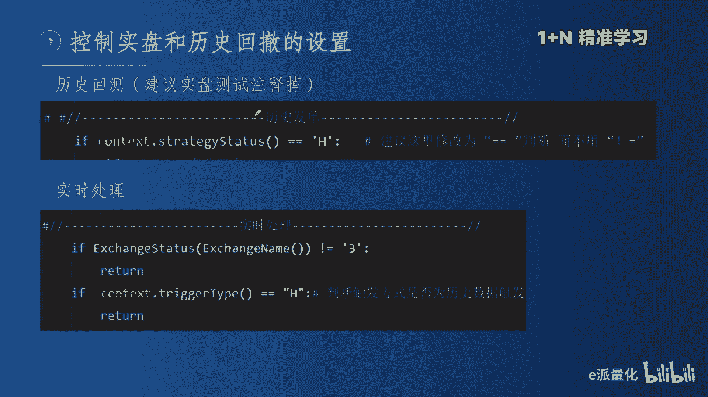
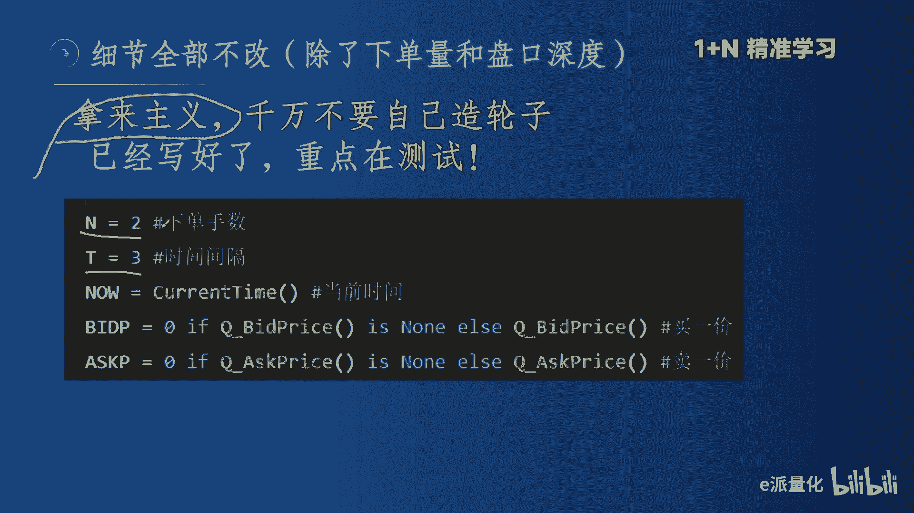
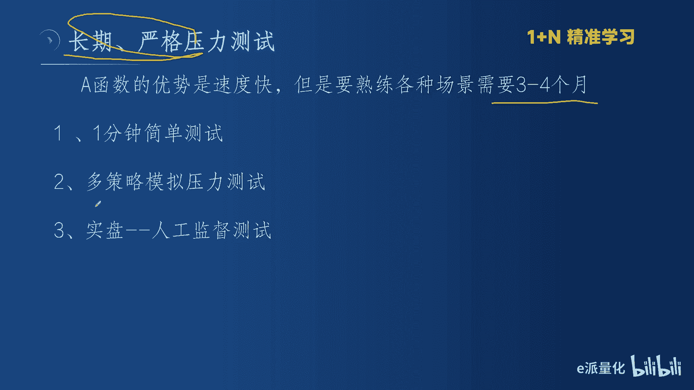
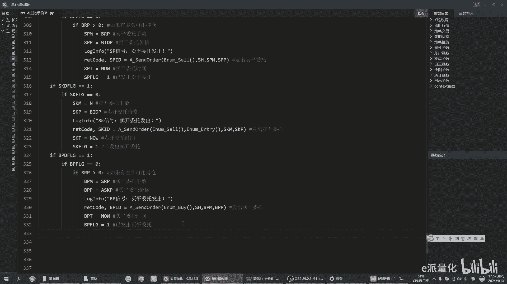

# 量化实战篇：9完结篇 - A账号函数 - P1 - e派量化 - BV1Tp421X7fb

大家好，我们啊经过前面十三讲的学习啊，我们今天终于来到了完结篇啊，我们为大家讲解这个A函数，就账户函数。我的整个的视频的这个教学流程啊，是经过精心设计的。啊，可以说我是从易到难啊，从简单到最后。

我把这A函数，也就是最难的这一部分放到了最后啊，这个就像拼图一样，我看网上没有人讲A函数因为它最难是吧？但是呢这个也是意生最强大的东西。啊，也就是说你掌握了这个易胜的这个A函数。

那么所有的量化平台你都不在话下啊，我看那些股票的呀，比特币的，他们那些量化平台在控制下单上，在撤单上。都远远没有我们期货量化的啊这么的精准。啊，可以这么讲，你就是会了这个所有的啊量化平台。

那些下单对你来讲都so easy嘴。😡，啊，所以说今天我们作为完结片，今天的内容呢，我分三个主要的环节。第一，我讲A函数中最精华的几个函数啊，A函数一共有三十几个函数。

这个展开讲或者展开学都是没有必要的啊。第二部分呢，我会把这个代码啊，就是我认为必须要掌握的代码跟大家讲清楚。也就是说你把这个难点攻克了，后边那些代码你就看起来啊就容易。

这几个难点你没有彻底搞懂你后面的代码，你怎么看也是看不懂。😡，啊，最后呢我给大家讲最重要的A函数要是测试的一个思路啊，A函数它不同于策略函数，因为它需要不断的去测试。

A函数呢它是一个学习的难点啊是一个学习的难点。但是在使用上，A函数却非常的简单啊，也就是学习它，看懂它很难。😡，掌握它去写它也很难。但是我们用的时候就非常容易。为什么我会在下面告诉大家。

用的时候它是一个标准化的模块。我不讲我们是一个模块，你就用这个模块就可以了。它不需要你再修改啊，你就把我的数据代码拿回去，我告诉你改的地方，你去改啊，其他地方你就不用管。

因为这个都是经过官方测试和我测试的啊。好，我们说这个A函数。😡，伊胜官方啊就知道这个A函数是难点。因为伊胜是一家老牌公司了啊，他推出这个量化平台，他已经推出去了，这个已经是第二个版本了。

所以说呢他知道难，他就写了10个事例。啊，大家看他那个官方那个，但是呢这十0个事例呢，我觉得写的都非常好，而且有几个事例呢写的非常高级啊，我也要给他点赞啊。但是这些代码它的代码量确实非常大是吧？

想把这10个事例代码都学会的话，那是需要付出啊，最少最少也得付出，我觉得10天的时间是最少的了，而且他代码量大，你抓不出重点啊，这是一个。第二呢，他的写法呀，比较高级，这个高级是怎么理解呢？

就是说他不是按照我们理解的逻辑来写的。他按照这个程序员的逻辑来写的。😊，啊，就是程序员的逻辑。因为大家特别是来跟我学习的这些朋友，我大家都是大部分交易啊，我我了解一下来，大家都是交易经验比较丰富。

但是写代码大家确实是啊这个也能理解嘛。但是你如果不是程序员，你来看这些代码的话，那确实是不太容易看。😡，啊，第三个呢，我认为这个。四力代码里边的变量命名啊，它比较生色。不太容易理解。

我们说这个记忆它最好是理解性记忆是吧？就像我们学习英文单词也好，数学公式也好，它这个命名我是没有发现什么规律啊，因为它都是用拼音嘛，这个现在大家的规范命名，嗯，不管是在股票还是在这个。😡。

大家包括这个大模型的命名，大部分都是用这个英文啊，用英文的简写或者驼风式的啊，这样呢大家一看这个命名就知道他要表达的意思。所以说呢这里边呢我再跟大家解释一下，嗯，这些命名大家可以稍微改一下啊。

可以稍微改，但是大部分不用动啊，因为它的变量它经常是三十几个变量，你要大部分改它的这个命名，那这个时间也是成本比较高的是吧？但你只要把几个关键的不太容易理解的，你给他哎命名是你能理解的。

那么我想呢大家在学习这个过程当中，那就是顺立很多。

下面啊我重点讲大家必须要掌握的几个函数啊，这里边呢为了便于学习啊，我建议大家呢用我这张图啊，用我这张图，因为这张图它是一个对比图。啊，左边是我们正常的啊，我们刚开始学的这个策略函数下单。

右边是我为大家截的，就是用A函数下单。这里边第一个就是if market position，就是判断持仓啊，这是用策略函数。那么在我们A函数里面就用A total position。

就是这个也是说判断持仓，就是我们做交易，我最推崇的代码的逻辑是你要把。😡，这个写到前面啊，把你的交易逻辑写在这个里边，啊不是刚开始写交易逻辑。然后在交易逻辑发生之后，你再去判断持仓，这是不对的啊。

这是不对的。所以说这个大家一定要一定要记住啊，就用我的这个逻辑往里写啊，刚开始判断没有仓位，然后判断多单，判断空单啊，然后用这两个函数判断多单，对吧？这足够了啊，这个逻辑大家学会就可以了。

也就是说我们再往里面套的时候，先套这个这个持仓判断啊，这是第一步，我们先要用A total position来判断我们的持仓。😡。

第二步就涉及到这个执行下单啊，这个环节了。执行下单呢。易圣呢，他在他的势例代码里面呢，他一般他都写了两个模块啊，一个叫做历史发单啊，一个叫做实时发单。历史发单这里边有一个地方啊，大家一定要去关注一下啊。

一定要去关注一下，就是这个地方啊，这个地方它写的是不等于C啊不等于C，就是说。判断一下目前这个交易连接是不是回撤还是实盘。它这个不等于C呢，其实呢和等于H就是等于回撤是一样的啊。

但是呢这个地方它写成不等于C。嗯，因为它这个函数它返回是只有两个啊，所以说是可以的，但是它不容易理解是吧？我建议这地方大家改一下啊，这就便于大家理解嘛。你这样我一眼看过去，我就知道我这代代码的意思了。

比如说这个代码啊，就是说他在历史回撤的条件下，我这样去建啊，建多头见空头，对吧？平多啊平空啊，这就很简单的，你的逻辑就通顺了。😡，好，然后在我们A函数里边呢，我们实际上这个下单啊分成了两步啊。

分成了两步。这两步呢，你在这个四例代码当中去看的时候呢，它给写颠倒了。他写电脑了是对的，就是他先做了一个这个成交处理，然后再做了一个委托处理。但是在我们逻辑理解里边呢，是吧？大家去想想，我们的逻辑是哎。

我收到信号之后，我应该先怎么先去开单啊，先去买开委托发出是吧？我应该是先开单。大家能理解吧？然后开单了不成交，我在做什么撤单，然后再追单啊，这是我们正常的交易逻辑。😡，所以大家先把这个理解。

其实你写的时候这么写是没错的。像他这个写的逻辑是没错的。但我建议大家理解的时候，先按照我这个步骤来啊，先去理解啊，我收到了信号。比如说刚才我把这个全局变量设置成了开仓啊，然后说到这个开仓信号之后，哎。

刚才没有过开仓，我就进行了委托开仓。委托开仓里面这个函数是大家唯一需要非常非常熟悉或者非常非常高频记住的就是这个函数，这个函数呢我跟大家说一下，嗯就是A，然后三or， send order里面呢。

它有四个参数，第一个参数就是买卖方向啊，买卖方向。大家一看就是败嘛啊，就是开多单。然后第二个函数是还是，就是你是开仓还是退出啊，就是这个函数。😡，第三个参数呢。第三个参数，这个就是手数。

也就是我们说的QTY啊，就是成交量委托量。第三个就是委托价格。委托价格。这里边它通过一个计算啊，它前面有一个计算这个盘口深度的，然后把这个呢发到这里边来啊，这4个参数放到这个A啊。

这个函数里边来A3的order呢它返回值是两个啊，一个就是是否成交的一个标识啊，是否成交了。第二个呢就是这个BKID这个BKID就是说它的下单的一个委托号啊，你先别管这个是不是交易所返回的委托号。

很多朋友就是在这个地方他理解不太好理解，就是哎交易所返回委托号不对，这个BKID是我们这个策略的这个ID。😊，而是我们这个策略执行ID和交易所那个还没有关系，就是我们监控的是我们本地的这个。😡。

能理解吧？哎，能理解这个就好办了。然后通过后边就通过检索这个BKID是否成交，然后我进行撤单，对不是如果成交了，我就打印成交信息啊，它都是通过这个ID啊，同是通过这个ID来实现的。

就后边大家就是说在成交处理那段哎，看到BKID就对了。其实后边你要看重点就看这个看BKID，而不是看外边那么复杂的逻辑。当然那个逻辑，你要先把它搞懂也不难。但是说他用什么来执行呢。

它就是通过BKID来判断这个。😡，这个委托是否成交，需要撤单，是否撤单成功，他就是通过这个BKID啊。啊，下面就记录了一下啊我们的时间啊，然后记录完之后，这个地方大家要学会。你看前面我是什么？

是零的时候，我开仓，我开完仓之后，我把它怎么样，我把这个开关关闭了，我就把它复制为一个一。那么再遇到这个这个策略啊，发过来信号的时候，我已经开过仓了，开过仓，我就不再开仓。😡，啊。

所以说这个这个大家一定要学会开关一定要学会关闭啊，你不会关闭开关的话，那它就总是在开仓啊，因为这是个全聚变量，你把它关闭了，那它就不会再开仓了。😡，成交判断这里边啊，就是因为这个里面截图啊不太好截啊。

所以我只截了上面这一小段啊，但是呢跟大家一讲，下面大家也看得懂啊，也就是说这个小段是什么呢？我刚才讲了，它通过BKID来判断这个刚才我们下的那个单子，它的状态啊，它的状态。

这个函数就是返回是这个这个功能的。然后它返回值，这就是一个枚举值，这个地方是关键同学们。😊，这个地方是关键，它返回的枚举值是不一样的，对不对？它如果是完全成交，就是这个枚举值啊。它如果是撤单，哎。

就是这个枚举值。下边大家去看啊，下边大家去看啊，就是通过这个PKID返回这不同的枚举值，然后我在这个不同的枚举值的时候，哎，我就把它怎么样进行不同的处理啊，如果完全成交了，我就打印。如果哎完全撤单了。

我就拒单啊，我就又追了一个单，看到没？又又追了一个单。😊，A函数呢它之所以难。之所以大家看不懂啊，之所以医生也觉得大家学起来是难点。对吧因为他是所有的客户啊，经过这么多的反馈，就是因为他的代码量特别大。

代码量特别大，它建立的基础是什么呢？就是说他要控制的变量特别多啊，大家知道他要控制的变量特别多，那控制的变量一个是多。😡，啊，有三十几个啊，一般情况下三十几个、四十几个。

但是它这些变量大家要理解它的核心的意识。😮，啊，这里边我就列出来几个最重要的啊控制的变量。一个就是在全局变量里面控制的开仓标识、平仓标识啊，撤单和平仓撤单啊，这个他要在全局变量里面完成。

也就是说我开仓之前打开开仓之后关闭。😡，啊，我撤单之前打开撤单之后关闭啊，这个变量是通过我执行完相关操作之后，我要把它重新复制为零，或者把它复制为一来打开和关闭的啊，这个就是全局变量，这个是关键啊。

这里面大家之所以。😡，看不懂，就是因为这个变量呢，其实你看BKflag啊BK flagag啊，这里边既有拼音啊，又有英文啊，B屏flag啊平仓啊S屏flag啊，B屏避开，你可以改成你自己喜欢的啊。

你可以改成自己你喜欢好记的如果不写好记，那你就得把它这个记住啊，这是全局变量里边我跟大家讲的最重要的地方啊，其他的和我们前面讲的全局变量没有没有变化。那只是你一个熟悉的过程，对吧？

但是这个它是和前面的说的变量是不一样的啊。😡，关键的来了，就是这个地方啊，handle data里边的哎，它在handle data里面，它上来就命密了这么多这个局部变量。这个局部变量是关键。😡。

对吧全局变量我不讲了，是我们执行完之后，我们给他负的值开关，对吧？但这个局部变量是什么？是他收到了这个实时行情的触发。😡，触发了条件之后啊，这里边这些变量就激活了啊，就是说它是在每一次触发的时候。

每一次触发的时候，策略每一次触发的时候，它都可以重新激活的啊，所以说这个局部变量，大家一定要把这个理解透，这个地方有点绕。😡，啊，这个地方有点绕啊，对，就是他用全局变量来控制开屏。

但是他用这个局部变量来控制它的信号的生成。哎那大家。

容易啊容易这个出错的点呢就是这个地方啊，这个地方我刚才已经跟大家讲了啊，我建议大家把这地方改成啊等于H啊，而不是这个不等于啊。呃，这样逻辑上比较容易自洽啊，逻辑上比较，而且呢呃历史回撤的时候。

大家知道历史回撤它是在历史上显示信号嘛，对不对？实盘当中呢。他会出现一个问题，就是说历史上如果有仓位的话，你这个实盘这个A函数平不掉它。A函数它在历史当中也发单，但是它在实盘当中评不掉历史的单子。

我这说大家能理解吗？😡，也就是你为什么测的时候，它俩总不平总不平就对了啊。所以说呢我建议在这个地方呢给它注释掉。就是我我看信号是否是我想要的，我在历史当中检查一遍，没问题了。okK我在实盘当中。

如果用A函数的时候，我一定我建议是把这个地方屏蔽掉啊。因为这个这是个坑，你不屏蔽到它的。😡，你处理不了这个历史历历史的仓位，同志们。😡，啊，我是处理不掉，我不知道谁有什么办法，这这是不可能的事情。

对不对？因为现在你是在已经开始处理实次行情了，你怎么能处理到历史的单子呢？😡，对吧所以说我建议在实实上就是你分开分开测试，你看历史就用历史的对吧？看实盘的就用实盘，你你写两套其实也不复杂。

因为你以后就是两套同时用嘛。😡。

下面啊我跟大家讲啊。这个A函数的测试是很重要的啊。A函数。医生已经帮大家写好了四例代码。我呢告诉大家，就是这些事例代码就足够大家去实际当中去用了。😡，啊，所以说我刚才不讲了，你这个学习A函数它非常复杂。

代码量非常大，逻辑非常高级是吧？但是你用的时候它非常的简单。我告诉大家，就是我强调的就是拿来主意，同志们就是拿来主意，我们不干别的对吧？我们就是全部要改，我建议全都不要改就改两个地方，就是这两个地方啊。

下单手术改一下，然后撤单时间你想改也可以三秒，我觉得挺好啊，5秒也可以，对吧？这个比较比较好，你说一秒就变成了高频。😡，嗯，没必要，而且呢因为这个交易所返回，交易所返回和咱们做模拟返回又不是一个逻逻辑。

同志们，因为交易所那实时报报单的速度，你只有实盘去扯。啊，不是因为现在我们测的是什么？现在大部分人咱们测的是模拟服务器，就是模拟交涉。那个它不是真实的真实的那个速度我觉得三秒比较好。还有一个地方呢。

就是这个盘口啊，因为它是用对价下单。同志们，它是用对价，你可以改成这个买一啊，买2啊，买三呢，就是你来改，我觉得就这两个地方需要改。😡，记住了，就这两个地方需要改，一个是下单的手术。

那这个地方你如果是说你能计算，你用一个全局变量，对吧？像我讲海归策略的时候，你能计算出来对吧？用风险价值计算出来也可以，你不能计算出来，你就拿计算器给它敲出来啊，我用我的我的风险价值是多少。

我我能称上多少0万。我下期的机少，你就给它写出来。下面说一下这个A函数的测试思路啊，测试是关键嗯。😡。

A函数啊它最大的优势就是速度快啊，A函数是速度最快的啊，医生的A函数它是它的底层啊，它是单独的一个进程，它的速度是最快的啊。但是呢这个速度快，它是个双刃剑，我刚才不讲了吗？他有的时候交手可能返回来了。

但是你这没收到，这都有可能的。所以说他必须要怎么样，必须要长期的啊压力测试。😡，他必须要长期的压力车。我建议这个。😡，3个月到4个月不要短了不要短。嗯，再短了，你第一你没有遇到这种极致的行情。

就是说对吧？你都一次就成交了，你没有遇到这个快速的滑点行情，那你撤不掉，那它的价值在哪里，它的价值不就是你两三个月碰到一次快速的平不掉的情况，它比这个这个这个对吧？我们策略还是有优势嘛。

如果大部分情况下，其实策略还是你写个最价开仓，平常它不就解决问题的吗？😡，他不就是有个别场景，它那个屏不掉吗，而且它没有测单功能，而我们的A函数有测单功能，那么你就是要给他一个时间。

我建议最少3到10个月啊，遇到几次啊这种快速的滑点呢。😡，啊，然后唉看他怎么解决，他的解决方案是不是你满意，你满意了就OK了，不要总测这个东西啊，你测这个东西，因为你他真正应用的场景并不是那么高频的。

😡，啊。然后测试的时候呢，我建议就用一分钟周期去测啊，用一分钟周期，特别是刚开始模拟的时候，用一分钟周期去测啊，十八的时候你可以稍微稍微放高一点，比如说用30分钟啊，1小时都可以。

因为刚开始你都信号都很少，那你怎么测嘛，对吧？我讲这是个压力测试啊，第二步呢？做多策略模拟，多策多策略模拟啊，你一个策略，你不是出信号比那个频率低吗？对吧？你你你做三个，你也别做太多了。

我建议刚开始就是三个，这样的话你看得过来，对吧？找问题啊什么的，你就这个不要刚开始就给他上太大的压力是吧？就太大的压力，你自己都都都不知道问题出现哪。😡，啊，第三步就是比较关键的就上市牌。啊。

上市板就一定要人工监督了。我不讲了嘛，他这个来回撤车单速度是很快的，追单也很快。啊，那这个你你是真金白银，你不能不不断的对吧？万一我看那个群里面很多人就是说你们都没撤过，对吧？你们就就就赶上。

我觉得你们真的是有钱是吧？😡，嗯，有钱那是可以任性，但是你任性完之后又抱怨你又不潇洒，你说你任性完了，你潇洒也可以是吧？我觉得花钱买买学费也可以啊任性的时候是挺任性。我对结果达不到自己满意的时候。

那那不行，你就是你失败人工盯着，哎，那你这两三个月，你不干别的，你就你就要了这个结果不也可以吗？对吧？你花两三个月三四个月的时间，那你以后心里有底的，别人再跟你说这个东西有什么优势，有有什么劣势。

那你说我经历过，你们都是都没经历过，你们有什么发言权嘛，对吧？你们都是听说的，或者是偶尔做那么一两次。😡，啊，所以说这个一定要有时间的朋友，或者是你白天上班，晚上去测也可以。但是这个要给他一个时间。

而且我建议是人工去监督，还有一种办法，对吧？大部分是朋友啊，就是如果做做做级别大一点的，我建议呢你就下午2点半开始测，晚上10点开始测你把时间给他放后，对吧？这不就这不就解决问题了吗？对吧？

你你下午两点半看一下，你因为你做交易，你总是要看一下盘面的吧，对吧？那你两点半看一下，哎，晚上晚上你总是要看一下的吧，对吧？夜盘你总是他九点开班，你10点之后，你总有时间的吧，你看一下，哎。

然后这个时候你给他测一下，我建议也这样也可以，我们就这个代码部分啊，带大家过一下代码。😊。

前面大家可以看啊，前面这个定义变量啊占据了啊，这里面应该有五十几个变量啊，它占了你看占了53行，就是到前面它全是定义变量啊，我就给大家写到这儿，大家呢拿过来就用啊，因为这个是。😡，你无论写任何策略。

你都要定义这些变量了。所以说呢大家拿过来就用。然后在你需要的时候呢，你就把它改个名字啊改个名字。😡，好，进入这个策略执行代码啊，我们就要定义我们的开仓平仓啊，这些什么这些信号。

你看BKIDBKID我都是刚开始都是个零，对吧？SKID它都是零。为什么？因为这些是我通过下边的执行来激活它的，而不是我给它负的值。大家要记住全局变量就是我负的值啊，就是我们负的值。

而这个局部变量就是行情触发的啊？我这么讲不要通时易懂啊，大家可以下来这么去理解。好，这段我在前面PPT上已经给大家重点讲解了啊，就不讲了。但是这一段呢就是一个判断历史发单的啊，然后在历史发单当中。

我把它。给他给它激活。但实际上我要用实盘发展，我建议把它注释掉啊，我建议屏蔽历史发展，我建议屏蔽历史发展。然后实盘阶段你看我单独写个实盘阶段的金属场定义。我建议这两段呢。😡，就是说你运行历史的时候。

把实盘屏蔽掉，运行实盘的时候把历史屏蔽掉啊，这是我重点建议的，这样的话就不会乱。啊，不会乱，因为用A函数比较容易乱。前面实时触发的信号写好之后，后面我们进进入了实时处理的阶段啊，实时处理的阶段。

这些东西都不用动。同志们，朋友们，我刚才讲啊都不用动啊，这些东西都不用动，动就动这个手术，其他地方不用动啊，动一动这个地方啊，其他的不用动啊，比如动要动，其实呢还不如不动。

下面也是你看他先写了个成交判断，然后在下面进行了一个委托处理啊，成交判断它分了这几个步骤，这几个步骤大家可以去学习一下。大家去看一下这几这个很好，这个对于大家去学习代码是很有帮助的。😡。

到了300到了300多行才到了委托处理啊，也就是说你要按照我前面给大家讲的。😡，这个读的逻辑啊，你要先读委托处理，然后之后再去读这个成交处理啊，委托处理反而很简单，对吧？就是几个信号对吧？开多啊。

然后买平就是平多嘛，对吧？然后。就就就这四个反而简单啊，把这个之后简单完之后再看后面的这个成交处理。就是因为成交处理它就涉及到了这个撤单和追单。好。这个代码呢大家可以下去啊，找我联系啊，我发给大家。

然后大家在实盘当中呢，就可以直接拿来用。

下面呢为大家介绍一下我们的这个后续的这个实教课程啊，我这个实教课程呢和市面上大多数的这些录播课程是不一样的啊，我看这个市面上大部分课程啊，不管是软件公司的啊，还是这些平台的啊。

还是这些所谓的这个冠军的是吧？他们都是录播课程啊，录播课程，而且这些录播课程动则就是。呃，六七千甚至上万啊，我觉得这些东西啊嗯它就是一个基础东西啊，它们不值钱啊，这个教育它就是应该因材施教嘛，是吧？

每个人的基础不一样，怎么能上同样的课程啊，对吧？小学一年级和小学五年级用同一套课本，这全部可能啊，是吧？所以说我呢就是说。😡，喜欢啊喜欢旺哥的，你可以联系我，对吧？我保证3到4节课我还没有教不会的啊。

这里边我分成两部分啊，一部分就是基础的对吧？基础特别薄弱的，特别是啊零基础的看到代码就头疼啊，那你自己学，那我可以说你90%的概率是放弃对吧？自学就是自学就是放弃的啊开始。😡，因为行百里者半九0嘛。

那就像我们说没有一个正确的方向啊和引路的话，你说你自己去看。😡，那我相信啊，你不是马能的话，你是不可能学会的啊，2到3节课具体看难度啊，那确确实实是我教给你们自己写啊，不是我给你们写，同志们。

我给你们写，那很快。但是对你们来讲。😡，这个没什么用，就是说我会告诉你们，你的思路应该从哪儿来入手，需要哪些条件啊，需要哪些语法和哪些函数，然后你自己来写，这是第一次。第二次我会告诉你，你写的当中啊。

哪些难点啊，或者是哪些方法，我们还可以改进啊，我希望呢就是通过我这种策略代码实现啊，你学会那么以两个策略代码。那后边你就可以说所有的策略你都能写的好了啊，这就是为大家提供的啊两个服务，有喜欢的朋友呢。

大家可以联系我啊，我上次给大家推出之后呢，哎确确实实也有一些朋友啊，参加了我的这个啊一对一辅导课，我相信呢大家收获都是很多的啊都是很多的。那我很希望能帮助啊想学习的人啊，这是我的一个愿望。

但是呢这个东西呢是你喜欢对吧？我希望我能帮助你啊，大家是一个互相学习的这样一个过程。😡，喜欢旺哥视频的啊，咱们交个朋友啊，你要相信。旺哥也是啊曾经机领学当最受欢迎的讲师啊，我要讲不会你。

嗯那不是可那是不可能的啊，没有我教不会的人。好，那么咱不多说了啊，大家喜欢的咱们私下啊交个朋友啊，我保证。😊，这是你做的最正确的选择啊，在学习上的投资是最值得的投资。好，不多说啊，有喜欢的啊。

有需要的朋友咱们私下联系啊，不要再被外面这些录播课程割韭菜啊。这些课程确确实实他是哥的认知啊，其实你看了100个小时，你一样学不会啊，可能反而啊耽误了你的时间啊，我觉得钱倒是小事，耽误你的时间。

恭喜各位啊追到我们这一讲的朋友啊，我们大功告成了啊，大功告成了。😡，创作啊真的不容易啊，我呢从11月份开始啊创作到现在呢也一转啊一转下已经快6个月了啊，其中经历了春节，而且过完年之后工作又特别忙啊。

我实发的压力啊，实发的这个工作又特别忙，所以说确确实实。真的是离不开大家的这个点赞、关注、评论和群里的互动啊，我也真心的感谢大家啊，希望喜欢旺哥这些视频的朋友，大家小手动起来啊，给我点个赞啊。

加个评论啊，你们的喜爱啊，也是我创作的动力。😊，那么接下来呢我会把我的重心呢放在这个期货量化策略五十讲上。这个也是我给大家立的一个flag。我看。B站啊和网上分享期货量化策略的非常的少。

而且大部分都是这个当年TB的。那那那些策略啊大部分都是那些策略。然后不管是从淘宝啊，从这个为什么呢？因为那些策略呢，当年他们确实做了个我印象中他是一本书嘛，对吧？

那本书里面他把呃他当时收集到的这个市面上比较流行的那些策略都给大家啊做了一个，但是那个东西很老了，那个东西很老了，我不是说他的写法很老了，第一他的写法很老了，他那个写法。😡，大模型不认识，我们现在学。

如果大模型不认识，那这个东西就不要学了。第二，他那个策略也很老了。所以说我会拿出我啊我写过的策略里面，我我把这里边我精选出50个策略啊，但是呢这个大家要有耐心啊，这个是我给大家立的一个flag。

就是我一定会完成期货量化策略五0讲，而且是大家从来在市面上见不到的期货量化策略啊，那些烂大街的咱不讲，但是大家给我时间啊，我我尽量的尽量的给大家在尽快的时间完成啊，当然了，如果大家点赞评论上来了啊。

对吧？那么就说明喜欢的人多了，那我可能我可能就一周一更啊，如果要是正常的，我可能就俩周一更啊，我觉得也可以，大家也不不要搞太多的压力是吧，而且呢这些策略呢其实大模型也会出一些简单的策略啊。

不要再不要再这个什么。😡，某宝某猫上去去搞那些东西了啊，那些东西。没什么用，到这里啊，我们。下期再见啊，需要呃这个四例代码的朋友，你们可以联系我啊，然后备注一下啊，我就会发给大家。因为没有四例代码。

确确是对于学习来讲呢，它是比较低效的好。😊。

最后感谢您的观看，我们再见。😊。