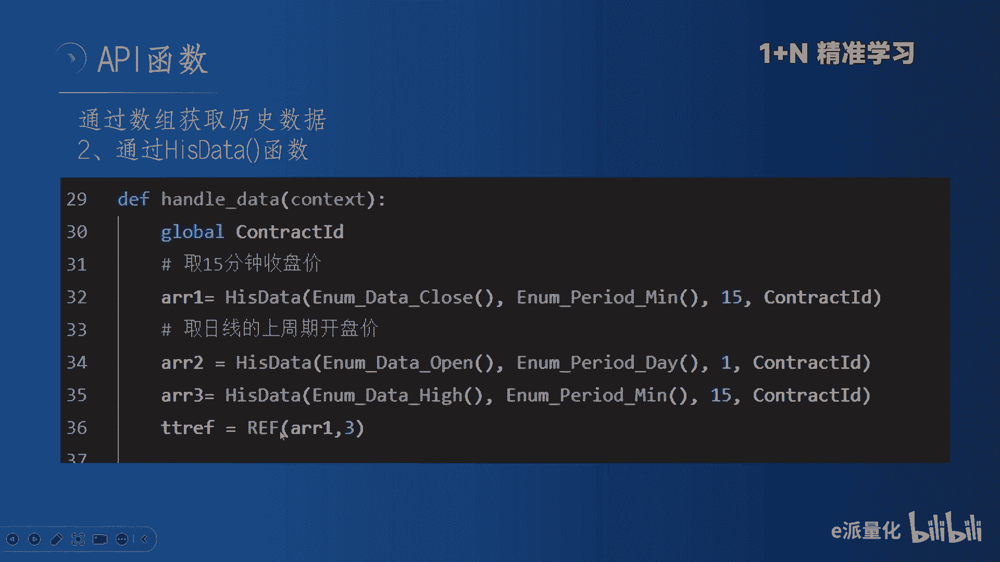
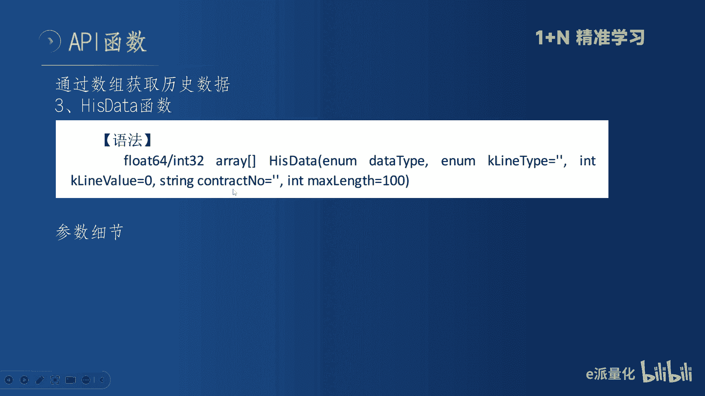
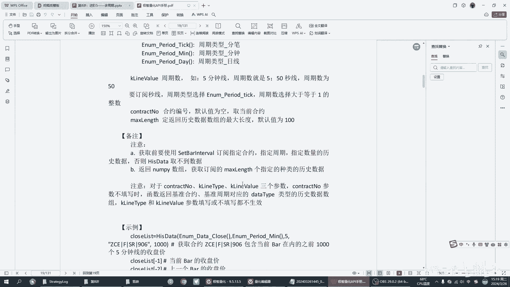
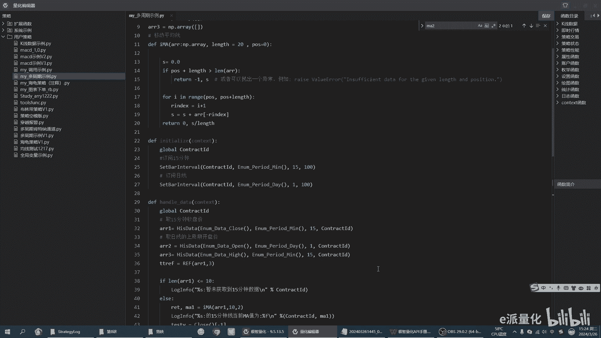
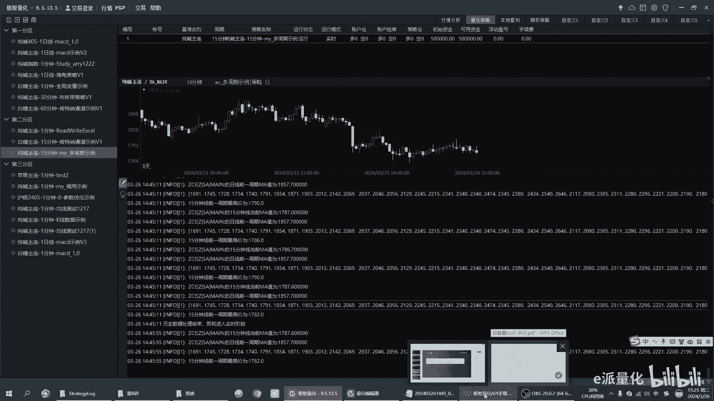
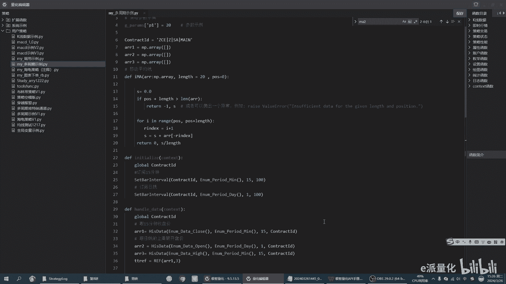

# 量化实战篇：第8讲／多周期结合 - P1 - e派量化 - BV1mK421a7Kk

大家好。😊，我们又见面了啊，今年后比较忙。今天呢跟大家把后面的内容啊，我们用两讲的时间给大家做个结尾。第八讲我们讲多周期结合。这里的周期呢我跟大家先强调一点，我们要以日线为主啊，同学们一定要以日线为主。

为什么要以日线为主？因为日线是市场上所有人最关心的。啊，可能你看的那个15分钟，5分钟、30分钟。市场上大部分人是不看的。但是日线所有的人都关注，也就是一旦趋势形成，它在日线上一定是所有的人。多尊重他。

我们做事情不想要有基础嘛。那么我们多周期是以日线为基础啊，有了这个基础，我们再做其他的组合。今天呢由是个内容啊。第一部分我跟大家讲一些我的学习上的建议啊，通过大家最近的反馈啊，和我以往带学生和自己学习。

我把一些经验跟大家分享一下。第二呢，我就具体的讲一下多周期的思路了啊，到底怎么做多周期是吧？是不是就是日线和30分钟一结合就叫多周期。啊，我给大家讲一下我的一些思路啊啊，第三部分呢就是具体讲这个代码。

嗯，代码呢也是大家现在特别是初学者比较头疼的一关我能把详细的代码给大家写好了，但是呢我课上以后呢，特别是以后我们会重点的讲一些思路的时候呢，代码就不会像前面讲的那么细了，是吧？前后讲的太细了啊。

我听大家的反馈，确实因为大家都是初学者，我会讲的非常细啊，这也是我多年的一个经验。啊，我记得在。06年吧06年的时候呃，上海有一个叫金岭学堂的啊，金岭学堂嗯，也是这个期公司，他们办了100多期啊。

就是请了100多个讲师去讲啊，我呢他们评为是史上好评率最高的讲师，为什么呢？就是我把代码讲的非常的细啊，我的戏不光是说每个代码帮大家敲一遍，就是我要把这里面的逻辑啊，和他为什么这样用给大家讲清楚。啊。

我相信呢对大家是有很大的帮助的。嗯，最后呢我跟大家介绍一下这个一加N精准学习啊，这也是我们后边重点为大家提供的。呃。这两个月啊我没有更视频。但是呢大家给我的反馈啊，我真的是。呃，诚惶诚恐啊诚惶诚恐。

热泪盈眶吧。啊，我非常感谢大家对我的支持啊，就是我作为一个视频的录制者啊，我没有想到大家会这么。😊，这么喜欢学习啊，这里边呢有几位同学啊对我感触比较深啊。第一个我叫老哥啊，老哥嗯。

老哥呢今年已经54岁了，同学们50岁岁的一个老哥啊，但是呢他也做了十几年交易。现在呢还在坚持学习，我相信啊这个老哥一定能学好。啊，老哥，而且老哥呢非常有心。啊，在春节的时候呢，还给我发了一个祝福的微信。

哎呀，我觉得这个人与人之间的距离啊，一下子就变得温暖了。啊，其实我真的是呃尽我所能啊来帮助大家。第二个同学呢就是交流起来感受比较深的。有一个同学啊，名字我就不提了。但是他说了一句话，我感受很深。

他就说这个现在啊我们这个对吧这个这个吃喝呀，这些生活条件都没有问题了。但是我这个就是喜欢交易，这个交易不能停。那这句话要触动了我可以讲啊，你如果要是。交易是赚钱了。

那交易应该是这个世界上最美妙的一个生意啊，最美妙的事情。但是得是赚钱的啊，交易不能提。嗯，第三个同学比较感受，比较深的就是悟道同学。我在群里面也分享给大家，就是他自己把300多个函数啊。

把300多个函数它做成了excel表。啊，我觉得这个非常有心非常非常有心。因为我见了这么多学习的朋友啊，他确实是下了大功夫。我相信呢将来必有所成啊。啊，还有小雨啊，蓝天啊，特别是蓝天。啊。

这个的留言我也看到了啊，确实非常感动啊，确实非常感动，一起感谢啊，学习量化呀。它是一个长期工程。啊，它是个长期工程，这个长期呢不是说一个月、2个月半年。啊，我把它定义成是一个呃可能要伴随一生的事情。啊。

只要你在做交易，因为什么呢？因为交易它就是个长期的时间，对吧？交易就是个长期。你如果想学量化。啊，你刚开始入门是熟悉代码，后边呢是熟悉交易思路，对吧？到后边呢是跟大家去啊去探讨怎么去组合，怎么去优化。

啊，怎么去改进迭代策略，但这个是长期的这个是长期的。啊，一定要这个打持久战的准备。嗯，第二点呢。大家给我的反馈呢，我也感看到了，就是说我们学习啊。同志们，咱们不要贪多求全。啊，不是说你今天啊。

你写了一0行代码，你就是学到了，不是这样的。你今天学10百行代码，你明天肯定是忘了90。啊，你学的多忘的多，这也是我在这个现实当中劝朋友们。我说你们要想学呢，咱们就一步一个脚印，你日每天。啊。

进步一点点，每天进步一点，抓基础啊，把基础的多强化。比如说我给大家的一些识例代码。你就把它彻底搞懂啊把它彻底搞懂。因为这些事例代码呢都是基础。我就像大家学数学一样，不要从场子去做难题啊，你把基础抓好了。

你每次考试都95分，那就很厉害了。😡，给大家的视频呢，大家不要这个听一遍。然后呢，我把代码给大家了，大家代码过一遍啊，回撤走一遍就就就完了，那不可以的。刚开始是可以的。第一遍。啊，这样走一遍。

我们提高效率吧，对吧？第二遍。这个代码你就要自己过了啊，自己过一遍。现在呢你如果说不想敲，那你就自己复制一遍啊，一一行一行的复制。啊，一行一行的走。对里边呢，因为你第二遍看的时候看的就是细节了。😡。

为什么很多朋友说东东就是那个英文啊，中文啊，还有一些参数啊，一些这个数据类型错误了。就是这些细节呢？你没有关注到啊你没有关注到，最好呢就是第二遍的时候。在看完第一遍的时候呢。

第二遍的时候呢最好别隔太久啊，两天之内吧啊太久了你就忘了两天之内。再强化一遍。第三遍呢。就比较容易了啊，第三面咱们就快进了。因为这个视频对吧？我们就可以快进，你可以1。5倍啊，1。5倍快进，你就1。

5倍数或者两两倍数把这些视频过一遍啊，把这些知识点掌握了就达到效果了啊，最好是三双，最少最少是两双。好。第三点呢，我建议大家呢不懂就问啊，不懂就问，不千万不要死磕啊，咱们做这个量化不是搞科研。啊。

不是搞科研，他没有标准答案啊，他没有标准答案。但是作为。大家刚开始的时候呢，可能就是一个语法，一个参数。可能一天两天都解决不掉。那这个效率太低了嘛，是吧？大家就在群里面问啊，只要我看到了。

我一般呢我都会及时回应。只要我看到大家问这些问题，我都会及时回。所以大家呢不要在自己门头搞啊，也不要屎磕，史磕精神是对的。史磕精神是对的，但史磕的这个做法咱们改一改。下面呢。

给大家分析一下多周期的思路啊，多周期的思路。多周期的思路呢，我重点啊我重点认为啊就是要就是要日线。朋友们就是要日线，然后把30分钟以下。😡，15分钟的什么全部给他干掉。啊，可以看一看啊。

15分钟级别你可以看一看，看看它的强弱是没问题的，但是不作为我们进场的条件。啊，比如说哎我看突破之后回下强不强，那我用四五分钟看一看，因为他日线没走完嘛，但是我追进场条件和出场条件。

以日线为主啊以日线为主。所用到这个多周期呢有两种用法啊，有两两种用法。嗯，大的行情大的行情啊就是多周期共振。大的行情，但是多头去共振呢。是走出来之后，大家才能看清楚。😡，啊。

一年当中啊就是说有大的行情啊，整个市场啊，像去年的磷山里啊这个纯检啊，像今年还没有走出来，嗯，它一定是有多周期共振的。但是呢是走出来的。所以说多周期共振的时候呢。大家要想以日线为主了，我日线已经进去了。

😡，对吧比如说我做多啊，我举例做多，我做多已经进去了。😡，我要不要找机会。小头期也进去。啊，这就是多周期共振，就是多周期都往一个方向走啊，都往只是一个快一个慢的问题，知道吧？啊，这个是一个一个。😡。

这就要多收期公正。但是这种方法呢。他的胜率并不高啊，朋友们。我可以负责的讲，如果多周期公正这么简单。那么市场上赚钱。那是大多数。是吧那不可能的事情一定是走出来之后，你看出来他多出去周期共振的。

你他在走的过程当中不会特别的流畅啊，他在小级别当中，他肯定是啊有大的回调的有大的回调的。但是呢这一回调一结束，哎，他马上多周期就共振了。😡，啊，这就是多做其公振。不是公正呢。我在前面跟大家也讲过啊。

多市一工作呢是你参加比赛呀，或者想创造奇迹呀。因为你想你。你中长线也做多，短线也做多，你的仓位就上来了。😡，是吧你再加上突破你也做多，那你仓就上来了，这个时候是能创造奇迹。

但是呢它的胜率呢并不高啊并不高。就是多周期共振呢，是我们重点研究的一个。但是我们在用的时候呢，要有提高你的这个啊这个叛变机会的能力。我看咱们很多同学呢还都是期货老手啊，有的期货交易两三年。

但股票做了十几年啊，应该能理解这个道理。啊，不是。大家平时看到的那个那些文章中讲的那么容易，那是不可能的事情是吧？就市场它是复杂的它是复杂。好，再说一个，我认为啊就是日常出新率比较高的，就是这个。啊。

顺大周势大周期，顺日线的大周期，日线大周期没问题，对吧？现到这个区域，那你就只能做多了，那你没有别的别对吧？没有别的，那你因为这种是这种行情并不并不常见啊，一年当中可能会有三四次促净率啊。

你做到就做到了，没做到就没做到了。那日常我们做的很多时候呢都是在这个位置啊，或者在这个位置。对吧或者在这个位置就是刚刚的刚刚的形成刚刚的形成。这个时候呢我们要做的是什么呢？

我认为比如说这是一个底部区域啊，这已经是一个底部区域了。这个地方已经有有半年或者3个月的一个底部区域啊。啊，那这个时候呢，他一上来的时候，我就要逆着他的回调去做啊，就是顺着大周期逆着他的。啊，这个。😡。

底部已经做完了啊，底部做完，我们一般不在底部参与，我们做趋势交易的啊一般不在底部参与。因为底部参与呢。呃，就是你的盈亏比打不出来啊，你的盈亏比打不出来，就是他必须要突破，它必须要突破一个区间。

然后我们开始跟踪。啊，我们开始跟踪，他只要突破了，那我们就认为它是大趋势已经形成了啊，那错了就错了嘛，对吧？😡，Yeah。然后你在这里边去找小周期的逆势的机会。啊，就是那些做震荡的人呢。

一般的都喜欢在这里面做，然后到这儿就不能做震荡了，是不是那到这儿应该怎么做呢？应该是我不想过嘛？你应该大周期输完之后，小周期。😡，逆着这个居住。啊，这个时候好像马上就马上就金叉了，马上就跌破了。

实际上它好不容易出来之后呢，它一旦形成这个势啊。刚开始我们学波浪雨，大家知道它第一波的时候呢，它都是不太容易被被识别的，只有到三浪的时候，对不对？走到三浪的时候，它才走的很流畅。

啊但是这个时候你要记住了，这个时候你要是把这个机会把握住了。那么后边我相信大家应该知道啊，怎么操作，后边就都不难了啊，后边就都不难了，就难就难在这儿，这个头部一定是这样。

你看现在很多那个黑社说在这是要暴跌。它暴跌他也跌不到哪儿去。我跟你讲。😡，它暴跌也挺，因为什么？因为它那个位置啊它不好，它那个位置它不好，暴跌都是在这儿才能发生的啊，在这儿它不因为这儿呢你看对吧？😡。

这前面做空的人都死了，然后做多的人怎么样，做多的人也也要平仓。所以说他多空共同的力量把他给。😡，砸下来了，而你这个地方你多头也死了，空头还没有仓位，它能它能暴跌到哪儿去？😡，是吧他喊我跟你讲，百分之。

我不收多少空间了，但是是很有限。😡，反而呢刚开始一波大涨，哎呀，这几就来了，同志们今年要大干大涨的品种。😡，那后面必然是这样啊必然是这样，反正你就这样去想啊，大涨完之后他能站住吗？😡。

是吧嗯很少有这种平台参，大部分都是你像离三里这种对吧？它其实它先后已经涨了很多，然后上一上市正好大跌来吧是吧？那就是造就了这波下跌。下面我们进入代码的讲解啊，代码呢我就给大家这个截图了。

因为在这个呃这个这个平台里面讲的这个字太小了啊，大家可能看不清。下面呢给大家讲一下这个这段代码，这段代码呢就是首先呢你要订阅一下你的这个数据啊，s bar interview你要订阅它啊。

订阅这里边呢它有两个这个参数啊，一个就是这个周期啊，一个是周期一个是它的合约代码啊，一个是合约代码这个周期呢就是分钟级别周期。这个周期呢就是日线级别周期啊，订阅完之后呢，怎么获取啊，怎么获取。嗯。

要通过这个数组啊，通过数组的形式来获取啊，在群里面我也跟朋友们讲过嘛，呃平台它存的这些数据都是以数组的形式存的啊，比如大家常用的close啊，hi啊，open呢，它都是以数组的形式存的。

那么我们在调用这个周期的时候呢，我们也要用数组的形式把它调出来。首先呢我们要定义三个数组变量啊，三个数组变量AR1AR2和AR23。我们定义三个空的数组变量啊。

用于存储后边的我们调用的这种日线周期和15分钟周期的数据。啊，这就进入了这个我们的这个执行模块，hand data。首先我们。要把我们的这个全局变量啊给它调用进来啊，全局变量我在外面写了一个全局变量啊。

这个合约合约代码的全局变量。然后我们取15分钟收盘价啊，his data这时候用的一个函数叫做his data。啊，he之day是什么意思呢？就是说他调的是历史数据啊，他调的是历史数据。

历史数据里边的这些参数等一下我会给大家展开讲啊，详细讲一下。这里边就是首先你要把这些历史数据给它存到一个数组里边来啊，就是我们刚才定义的这个数组，我们刚才不定义了三个数组嘛？哎，把这三个数据。

第一个15分钟的收盘价存到数组一里边啊，日线的open就是开盘价啊，这里边我跟大家再讲一下细节。日线啊不要用close。啊，不要用close，因为close呢容易取到未来函数啊，容易取到未来函数。

就用open啊就用open。至于为什么呢？这个我就不展开讲了啊，因为你以后做任何啊任何这个量化交易，不管是这个股票的期货的还是数字货币的。他这里边都不建议用这个close。

因为close呢是容易取到未来函数。至于你说为什么，那要展开讲，那是一个课题啊，我也不会给大家再讲开讲。但是大家就记住了，你用open是最准确的啊，是最没有问题的。

当然你也可以说我用close一就是前一根K线的close也可以，那就看你个人喜欢了啊，但是不建议用直接用这个close啊。然后我又调用了1个15分钟的这个最高价啊。

最高价我们不讲一个数据里面有高开低收是吧？我们先把这个最高价也给它调换出来啊，然后呢我再去用REF啊做一成一个回溯。下面为大家讲一下这个his date这个函数啊，his date这个函数。

这个呢是语法手册上的截图啊，大家看这个语法手册呢，第一眼啊，比如说这个是heday的这个函数，大家先看一下它的类型，要看它的类型，这个是 array类型，这就是个数组，就是它取决的是个数组。

数组是直接不能被调用的对吧？数组是直接不能被调用。你如果是一个列表是个数值型的啊这样一个返回，那是可以被调用的。但它是数组。所以说呢数组，我们要先把它保存下来，然后再通过这个历史引用符，把它引用出来。

啊，首先我们第一看它的这个数据类型。第二呢，我看什么，看它这里边的这个参数的类型。你看它这个参数e name啊，就是说枚举值啊，这个也是Ename也是枚举值。这里边你先不管是吧。

这个是data type，就是呃日期类型或者叫数据类型啊，下面的Kline type就是K线类型。嗯，后面是一个整数，你看你要先关注一下它的类型，大家为什么经常写错啊？对啊，因为你们看的是势例代码。

但实际上势例代码呢他没有告诉你为什么这么写。😡。

要看这个。好，我们下面进入API手册看一下啊，关于这个hes data这个函数的说明。第一，他说了这个是获取各种历史数据的数组。啊，他首先就说明这是获取数主的。然后我们看里面的这个枚举值啊，枚举值。

你看你想要的这些数据类型。有收盘价、开盘价、最高价、最低价、中间价、标准价、成交量、持仓量。都在这里面存的啊，第二，我们看Kent这里面有什么？它有分比数据t啊，有分钟数据。这个命也有日线属于对啊。

他就是这三个周期都可以调了。啊，大家呢要学会看这些关键的参数的定义啊，要学会看关键的参数定义啊。嗯，他下面呢还给一些备注啊，首先是订阅。第二呢它返回的是南派数组。所以说呢你要订阅你的这个历史数据。哎。

这个地方啊历史数据你订阅的多少是你只这只能调用多少如果你定义了100根，你这只能调到100，你调到200就就就报错了啊，这是个问题啊，这这大家一定一定要看到看到这个问题啊。好。

我们下面就入代码给大家演示一下啊。

啊，这就是我写好的一段啊一段事例。首先啊我定义了三个数组，然后我通过。订阅啊订阅15分钟啊，订阅日线我订阅了这两个数据啊，然后在这个可执行这一段啊，hand到data我把它。赋制给这三个数组啊。

同时呢我通过这个历史回溯啊，REF我把它的前三日的啊给他付了一个值啊，这样的话呢通过这个数组形式的引用，我后边呢就可以对它进行计算了啊。首先呢我先对它进行一个啊历史。银符啊，我把它取出来啊。

它就前一天的啊，我把它取出来。我还可以怎么样呢？我还可以对它进行这个把它写到这个这个函数里边来啊，作为函数的一个一个啊一个一个一个一个取值啊，也可以这样去操作。就是说当你把这个取出来之后。

你就有各种办法。比如说我我们今天讲的啊我。开仓啊，比如说我MACD啊，已经符合开仓条件了，那么我再给他加一个。我再给他加一个日线上是不是符合条件？啊，如果日线上它大于20日均线，那么我就开多，对吧？

日线上如果它小于20日均线，我就开空。这样的话呢，你就实现了这个多周期的空制。啊，都做一的工作。但是MACD它是一个突破策略，你还可以用震荡策略。我前面不已经讲过，你还可以用震荡策略，对吧？日线向上啊。

那如果它向下回调，我认为是回调，我就逢低做多。啊，这我说的这个可跟那个胡总编和李大霄说的抄底呢完全他那个日线向下，我抄什么底嘛？我这个是日线向上。哎，小周期，比如说15分钟，30分钟回调啊。

我用一个震荡指标，比如说不林下轨啊，比如说R3A类似的啊震荡类的指标，那我就找一个震荡类的机会进去。😡，啊，这就是我尊重了大周期。同时呢我在小周期上进行了一个组合啊，当然了。

这个用法呢我会在后边有一系列的课程啊，这次呢我准备给大家讲一个呃系列课程，就是说策略。因为我看啊这个关于医生啊的课程确实比较少啊，那关于策略的就几乎没人讲。那么后面呢我会给大家讲一个系列的课程。好。

这样的话当我们。把这个日线数据和15分钟数据把它结合起来的时候呢，我们用起来就可以。实现我前面讲的啊，你既可以做周期共振，也可以做这种顺大周期逆小周期的组合。这样的话你再做起来，你的策略就丰富了啊。

你在一个周期里边去做，你再怎么做啊，你也变不出太多的花样来啊，你也变不出太多。我看好多朋友就喜欢研究这些参数啊，这些值啊，我跟你讲你这个东西你怎么研究，你也研究不出太多花样来。好，我们我们输出一下啊。

我们打家输出一下啊，这是我们大家输出你我们可以看到啊，这个就是我们明显的看到这是一个数组啊，这是一个数组啊，我前面呢我调用100根K线，那这就是100个日线的数据。

啊，那15分钟的上一个周期，你看我这里面我调的是上一个周期的它的MA值啊，日线的我也是上一个周期的MA值。啊，我的这个输出呢输出我输出的是一个均线啊，输出的是个均线。嗯，回头呢把这个大码发给大家啊。

大家呢自己去调。因为这里面可以调的东西就比较多了。你想用很多朋友就挺有意思的，问我我要不要回收两根三根，这是你自己对市场的理解啊，你觉得我害怕被骗，那你就三根嘛，等你觉得我害怕错失机会，我就一根嘛。

这个这个是个度的问题，是个灵活度的问题，它是没有标准答案的。

啊，谁告诉你他有什么独家秘籍，说两个人是最好的，三个是最好的。那绝对是大忽悠。好。嗯。代码讲解呢就到这里啊，回头呢。这个代码大家自己去看，大家自己去看，同时要自己会动手去改。下面呢跟大家讲一下呢。

我后面会给大家提供的一个一对一课程。

啊，我看也有几位朋友在问啊，说有没有这个。这个课程呃，我讲一下吧，因为这个。这种录播课呀，我看市面上还是挺多的啊，动不动呢，我看就六七千啊，还有的这个软件公司是上万的啊，他们呢很多就是。

可能是为了让这些年轻人嘛这个激发起这个物有所值的这种概念吧，动不辄就路过100个小时啊，几十个小时啊，让你学三个月5个月的是吧？这种我觉得这种。我认为都都是割酒神，都是割酒神。因为录播课程嘛，以前呢。

😡，这个金岭学堂啊，那个时候呢。也请我录过课啊，也请我录个课，而且他那出场费还不低啊，也是上万的出场费。其实呢这个录过课程，可能我就录三节，录四节就完了。

实际上很多时候都在讲一些这个这个这个最最基础的东西啊，最最基东西呢我认为就可以自学。大家把我前面的这些视频，你听懂了啊，你学会了，我认为。你写100个写1000个策略都都没问题的啊。

剩下的呢就是说你要你要怎么样，你要不断的去熟悉它就可以了，对吧？因为呢量化呀它还是一个熟悉的一个过程啊，这次呢我就不准备给大家再做录播课程啊，我在我的这些这个免费分享的视频里面，我会把所有的基础内容。

包括后边我会做呃量化策略5十讲，我会专门讲50个策略，50个经典策略，你把这些学会了你那些课都可以不上。那么我这个实教课提供的是什么服务呢？第一呢就是说基础比较薄弱的朋友啊。

这时候呢需要我给大家做一个零基础啊，或者是说入门的一个辅导。我觉得这个时候呢。大家确实是能学会，你我不想你自学能学会，但是你付出的时间成本啊，我给大家呢。😡，快速的过。那这样的话呢，可能我一节课对吧？

45分钟，60分钟讲完之后，你自己自己学的话，就相当于10个小时。啊，节约了你的时间啊，这个就是我的一个这个一对一或者一对二，最多是一对三啊，最多是一对三啊，这样一个量化的一个基础辅导啊。

这个主要是针对基础比较薄弱的朋友啊，你前面你听得懂就O了。后面动手的事，强化的事儿，我带着你去做啊，一般情况呢有三节课四节课就足够了啊，我身边这些朋友。嗯，只要肯学习了，我还没有世节课教布会。

还没有十节课教会的啊，你如果是学不会，你可以来找我。我一分钱不收啊，我一分钱不收。😡，第二呢，我准备带大家呢做一个一对一的策略这个实现辅导，就是我带大家去写策略啊，我带大家去写策。

这个这个说先说清楚是我带大家去写策略，而不是我写策略给你们用啊，市场上呢市面上现在写策略的挺多的啊，什么淘宝啊什么的，什么多多上面都有，对吧？500到2000，但是呢它只能给你一个策略。啊。

给你一个策略。实际上呢你自己的想法最重要，我呢帮你实现你的策略，带大家实践策略的。一般呢会有2到3个课时啊，如果特别复杂的策略可能要上个课时，一般的策略两个课时。第一个我带大家去把你的思路理理清楚啊。

然后你需要用到的函数，需要用到的写法，我会告诉你啊，剩下来你自己去写啊，我甚至会把框架都给你告诉你怎么写。第二步就是你写出来交作业，叫最后我带你去改啊，我带你去把参数调好，把时间做些答对啊。

这就是一个策略的完整的时间过程但是我告诉大家，我是带大家做。我去带代叫，我这个叫做授之以鱼，不是授之以渔。就是你通过选一个策略啊，就可以达到以后你自己写策略的啊这样一个完整的过程啊。

这就是两个给大家提供的服务啊，有需要的朋友呢，我看咨询的朋友还都是很有实力的。因为大家其实也都能接受这个知识付费的啊，这个我真的感到和以前不太一样是吧？

现在大家都都觉得知识是要付费的所以说呢大家有这种需要，那么呢可以私下来了解啊，不要再被外面那些录播课程割韭台。而且那些课程动辄就上万，我觉得那个真的是。哎呀，这个就是就就是对吧？认知的钱了，交认知的钱。

最后呢我在这儿呢，我向咱们群里的朋友啊那个发出这个邀请函啊，这个我这个热情邀请两位啊两位群助理啊，邀请两位群助理。嗯，因为呢确实实实有的时候呢大家的信息一多了，我也回不过来。啊。

我希望呢这个群助理呢第一，你学习能要强啊，我会把我这些知识交给大家。第二呢就是说要热心场啊，要热热心场。啊，作为群助理呢就是说能及时的回复大家。同时呢。自己要能学会啊自己要有学会。

而且呢我也承诺啊呃做我的群助理啊，我呢每一月有两次啊两次一对一的辅导，希望有热情啊，有意愿啊，有学习这个愿望的朋友呢，大家都来联系我啊，一起呢。把这个量化这个群啊给大家做大啊，做强。好。

今天的课程内容就到这里啊，需要实例代码的朋友呢添加我们的微信啊，然后备注一下AI量法交易啊，备注一下量AI量法交易。我呢就会把我们的实例代码啊发给大家。因为这个实例代码呢，你要自己从头敲的话。

那还是很耗时间的啊，有的朋友但是你拿回去之后呢，按照我说的，你要过三遍好不好？

好。🎼今天的课程就到这里啊，感谢您的观看啊，最后呢希望您动动您的宝贵的小手啊，给我一个评论啊，您的评论呢也就是我最大的原创动力，感谢。😊，🎼。

🎼你。