# 量化投资中机器学习的应用思路 ｜ 数字货币 ｜ 股票 ｜ 期货 ｜ 高频 ｜ CTA ｜ tick ｜ 人工智能 ｜ 深度学习 ｜ python - P1 - 逸思长天 - BV1A4421U76r

量化投资啊，是用数理模型的方式来进行程序化的交易，那根据数据的时间力度不同呢，又可以分为在天纬度上的交易的中低频策略，和分钟秒级甚至TK级别的高频策略，那中低频策略呢如多因子模型。

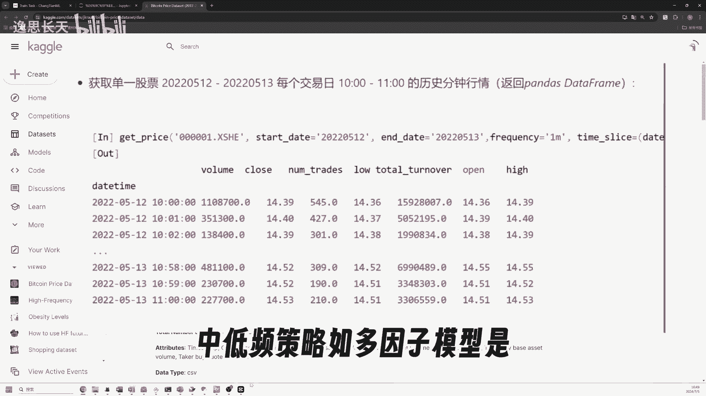

是利用精心构造出的一系列的因子呢，来构建模型，从而决定呢从股票池中交易的股票和权重，那有些研究者呢尝试过在这里面用机器学习，但是呢可能由于中低频的这个数量啊，实在是太少了，那信噪比呢比较高。

所以呢机器学习很容易就出现过拟合的现象。

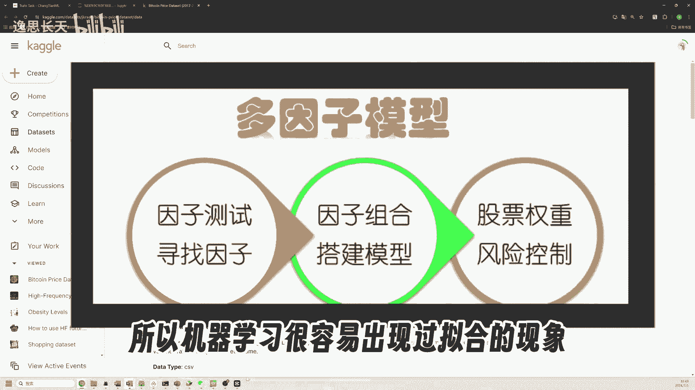

但是在高频的数据维度中呢，我们其实可以构建出大量的因子的型号，并且在TIK级别的数据场景中，每天能用到的数据量也很大，因此啊这个机器学习反而有更多的应用空间，比如我在QQ上找到了一个比特币的分钟。

实际数据，小小三个月的数据呢就有接近14万行，然后呢，我就利用这个数据构造了一些经典的信号特征，比如这分钟的收盘价减去过去几分钟的ma，那布林带的上下方，以及高低价波动率和成交笔数等等。

那其实呢类似的因子的信号。

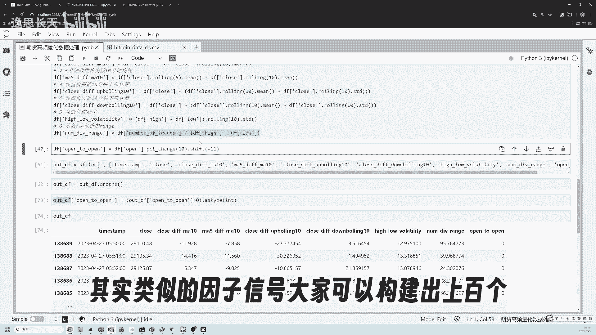

大家可以构建出上百个，并且呢也可以用零一的信号来表示，然后呢进一步的呢我就选择标签，这个标签呢是预测未来10分钟累累计收益率，因为这次所有的这个信号因子啊，都是根据前10分钟计算出来的，那么我们最快呢。

可以在第11分钟开盘的时候交易，然后再过10分钟呢再产生信号，在第21分钟进行下一轮的交易，并且结算呢就过去10分钟的一个收益的情况，所以这里呢我用的是10分钟的累计收益率。

并且转化成了零和一的二分类的形式，那接着呢我们就可以尝试使用机器学习了，由于在使用机器学习的时候啊，我们要选择不同的算法模型，并且调整参数，这里呢要花费的时间还是很多的。

所以这里我用的是长TML的自动化机器学习，零代码建模平台，那我们先选择时间序列建模，这种模式下呢会把数据集按比例拆分，距离现在较远的数据呢用来训练。

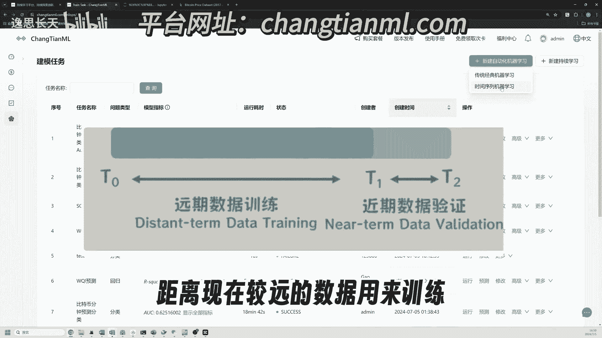

较近的呢用来测试打分，然后我们只需要上传数据集，选择我们要预测的问题的标签，配置下哪一列是时间以及其类型，以及呢要做的时间窗口的搜索，额这边的话呢可以必须要填写一下，如果不去做这个自动化特征工程的话。

在后面的时候我们可以把它给勾选掉啊，然后呢再下一步进行预测，那过了几分钟呢，平台自动给我们搜索出了最优的模型参数，可以看到呢。

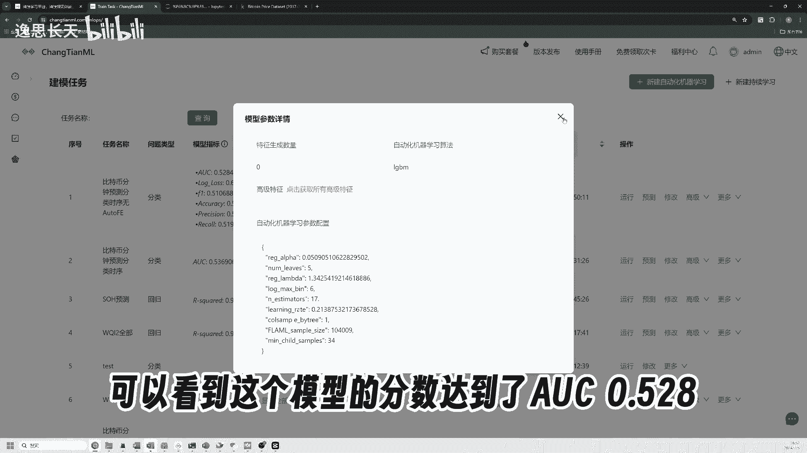

这个模型的分数啊达到了AOC的0。528，由于这个现场平台呢上传的数据量，还有建模的时长都有限制，所以这里得到的效果呢其实是一般的，但是大家在做交易的时候也懂得，如果赔率相同的情况下。

即使你的胜率呢是51%，也可以通过不断的重复来获取收益。

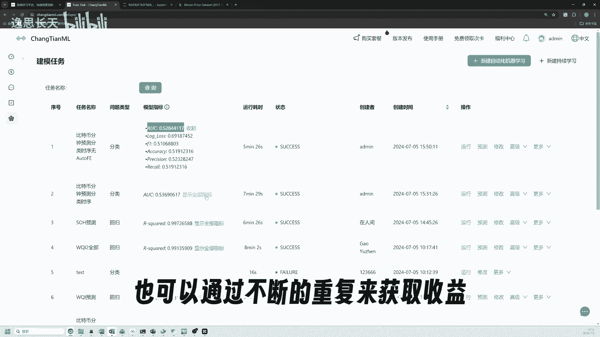

其特别是在高频数据的情况下，然后呢平台还支持自动化的特征工程，就是会利用一些数学算子和时序算子，进行特征的生成。

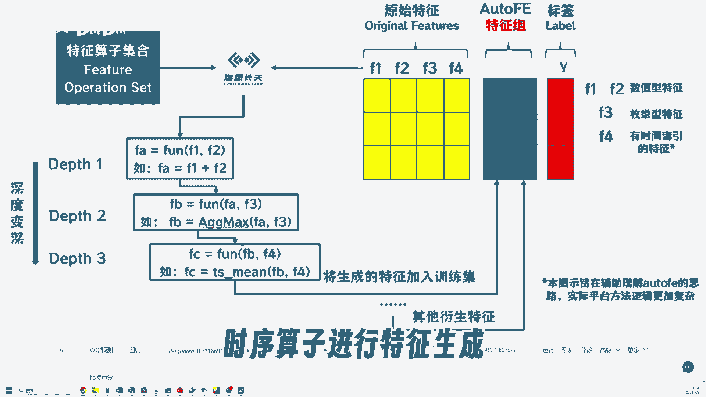

比如刚才大家填写的那个时间窗口，也就是在这里会发挥作用。

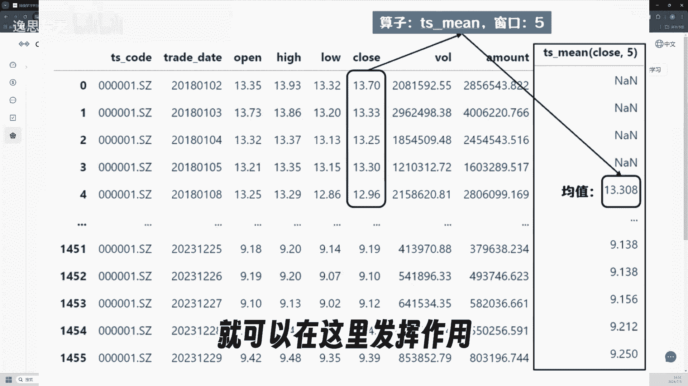

所以这次呢我们新建任务配置完后，不把alt f e也就是自动化特征工程关闭。

然后运行可以看到结果呢是有所提升的，并且产生了一些可能更有意思的特征，有的特征的重要性啊，甚至超过了原始的入模特征，此外这些特征还能做到更深层的嵌套，那这些特征呢。

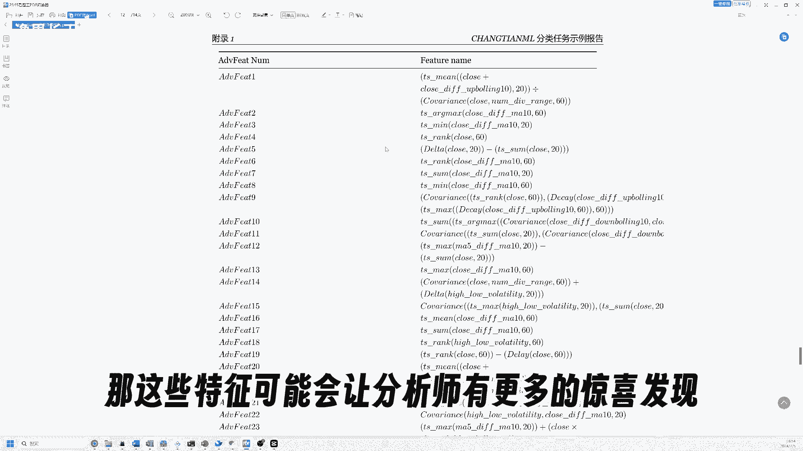

可能会让分析师有更多的惊喜的发现，好的这个视频呢主要是给大家一个思路，也就是金融时间序列的这些数据，是可以通过原始数据，或者自己预先构建的信号因子，进行机器学习的应用的，那今天这个数据呢是分钟级。

相信在秒级以T和级别上会有更多的应用空间，目前呢，我们平台的效果，已经在多个行业学科得到了验证。

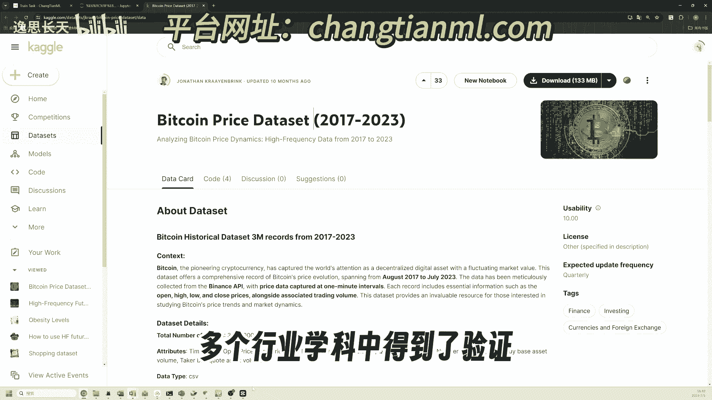

那感兴趣的小伙伴可以访问长天ml进行试用，对于有数据隐私和更高性能建模要求的同学呢。

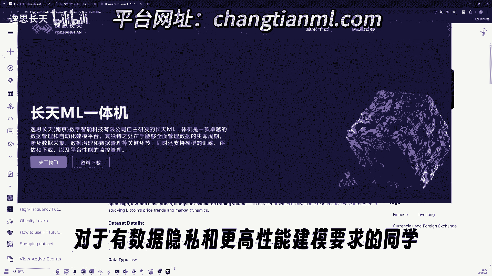

我们也提供了一体机，可以联系我们进一步交流，想要今天的数据和预处理代码的，也可以加我微信，我还会把你拉到呢。

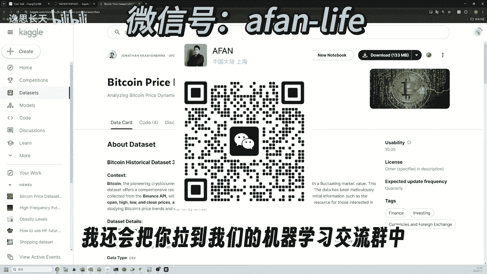