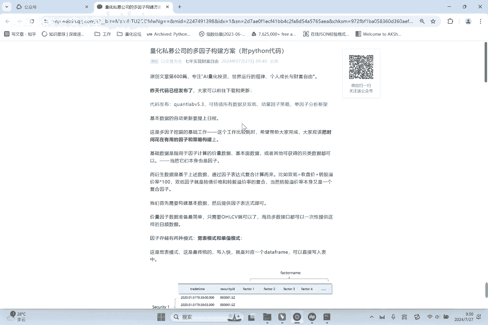
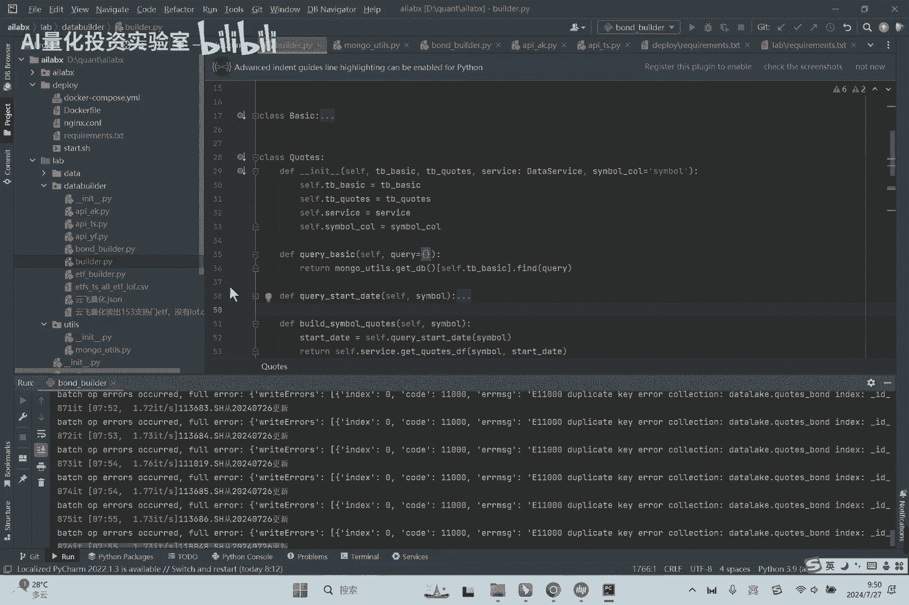
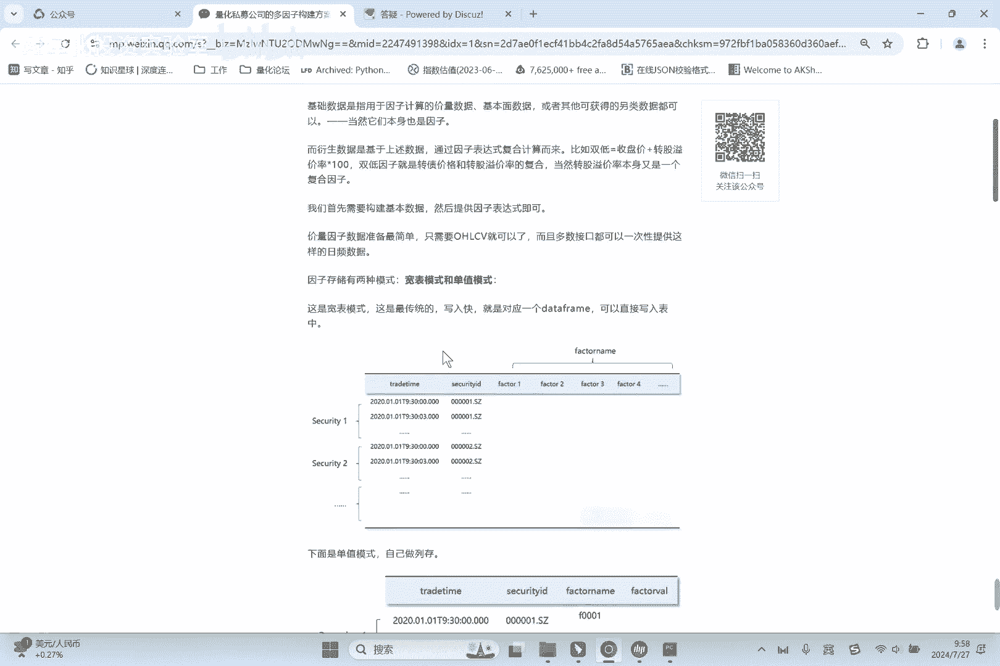

# 量化私募公司的多因子构建方案（附python代码） - P1 - AI量化投资实验室 - BV1vwvVekEnp

好各位同学大家好啊，咱们今天来讲一讲这个多因子模型，它需要的基础的数据构建方式哈，数据构建方式，顺便说一下，咱们昨天星球里的QUERLAB5。3已经发布了，咱们这段时间以来都是做可转债相关的啊。

当然咱们这把可转债的数据直接都呃。

搁到了这个代码目录的data里啊。

就是用CSV的格式，这个是为了方便大家回撤和这个复线测量，方便对，但是真正当你要用到，比如说模拟或者实盘当中的时候，你还会涉及到就是昨天同学问的数据更新啊，当然最好是呃它会自动化的更新对吧。

那这个时候这些因子如何去做增量更新，然后如何去做增量计算，那这一点上就需要好好设计一下了，一个是考虑到写的性能，读的性能维护的方便性，然后如果你有因子的扩展的话，怎么更方便啊，当然了。

我们是希望把这个耗时的工作都给大家做完哈，就是大家应该把精力，更多是花在这个因子和策略构建上，这是最重要的，甚至很多同学老师一上来就问哎，磁盘什么磁盘或者说大模型，其实有一个问题是。

我就算把实盘的代码给你整合出来给你，你有策略吗，这是间最关键的一个问题啊，因为说实话，现在呃审核磁盘的代码其实是现成的，有很多平台，当然取决于你是做ETF还是可转债，还是这个股票或者期货。

期货就不用说了，就是网上到处都是开放，他们，这是最标准的股票的话，现在像QMT啊，pk的之类的也也很成熟，你的券商支持，其实那个代码就是调API的问题，当然不是说里面呃。

还有大量的还有一些细节的工作要做啊，那只不过是说这个是一个很偏工程化的东西对，所以我们应该把精力更多的花在因子因子筛选，然后这个策略构建上对呃，今天介绍一个模式啊，就是嗯大家知道数据库是分行存跟列存。

我们传统的关系，数据库都是行存，就所谓的一行一行一行，这个是非常直观的一个逻辑，也是对应我们一个data frame对吧，data frame就长这样，而且比如像mango。

你可以直接通过Python把pandas的data frame直接写到，写到这个mango表里对，写到MONGO表里对，就像我下面截的这个图，对这个就是可转债的所有的基础信息啊。

通过这个一个data frame就直接写到mongo dB，但是呢如果你是去存储因子的话啊，就像我们传统都这么沉嘛对吧，就是symbol date，就是股票日期，然后开高低收volume。

然后其他指标这样一行一行，这样传统的行程会有一个什么问题呢，比如说你现在要扩一个因子怎么办，就你现在有开高低收volume对吧，我现在有个amount，我要加进去，那那你你你不可能直接加一列，对不对。

一行一行呃，要么你分表就是两个表，当你用的时候就会很麻烦，你得跨表去查啊，如果你还想做大框表的话，你得重建，你得重建，就是说你既有的数据里你是不能去加一列的，或者你一行一行的update。

那个效率是非常非常低的，非常非常低啊，如果是列存的话，这里介绍一个列存的方案哈，列存的方案的逻辑是这个，还是daytime symbol，股票某一天统一都叫因子值了，然后有个因因子的name和因子的值。

这就相当于变成列了，比如说你这个因子001它的值是什么，因子002它的值是什么，大家发现没有，这里有个好处，如果你再来了一个因子001百，你是不是可以直接append on上去，就是直接加一堆行。

因为它就是一堆行，相当于我们很巧妙的用一个列，用长存来解决列存的方案，对就是然后你要读的时候也非常简单，你要你要读的时候，你要指定这个第一，你指定symbol，比如说这00001这个点点SZ。

然后一段时间内的你再给一个因子名，比如002号因子是不是这一段的因子，这些行读出来，而且呢因为因为它没有其他列对吧，没有其它列，它的性能也会更快，性能也会更快，唯独唯独它的缺点就是大家看出来了。

它占的函数是特别多的对吧，因为它列很少，列很少就四列啊，行的比较多，而且呢你在你在比如说这个数据在写的时候，我们一般开高低收，那你就得写四次对吧，你要拆成四个，开高低收，四个因子，网上存对。

这个就是我们用大数据都是列存啊，大数据都是列存对，就是但是我们不想引入大数据那么重的技术上，比如我就用mango来模拟内存的时候，这个是一个合适的解决方案啊，这个在很多私募公司就是这么做的。

私募公司就是这么不一定有mango，但是都会这么设计，对这个对于来讲因子就是可以无限扩展的，有无限扩展，你要删掉一个因子，不影响别人对吧，00101号，你只要指定这个factor name等于0001。

你要清掉就清掉，对不不影响其他因子，不影响其他因子啊，有这里优缺点对吧，他的运维方面是快的，效率也是高的，唯独唯独就是他写入，肯定比那个框表会慢一点点，分表会慢一点点，一般来讲。

就是量化分析本身也是一种大数据分析场景啊，所以呢大数据分析场景，一般我们都需要用大框表标准的方式，都说用大宽表对，就是最后在使用的时候都会把它整理成框表啊，当然这个大家知道。

你读出来基本一下就就会还原回去对，就是这里是有一些呃，在工程上的一些细节考量的细节考量的，然后这里的代码设计我把它抽象了一下，这样呢就股票可转债ETF期货，它所有的数据更新我都可以遵循同一个范式，对对。

就这样代码维护起来会更加容易啊，其实并不多，其实并不多嗯，然后就是给大家介绍一下星球，咱们是的社群，就是做了一个支持的的论坛，大家有兴趣可以去看看BBS，点AI lab叉都看，就是寻求代码。

尤其是新同学怎么用，大家可以登录上去，这个我应该是手把手的教程，已经写的很清楚了哈，诶好今天的分享就到这里。

