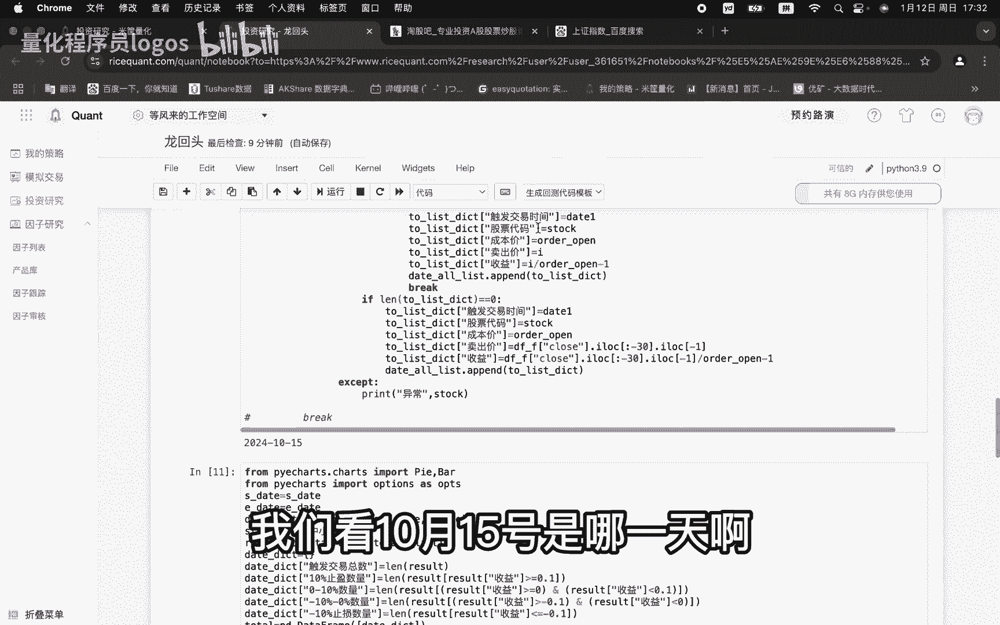
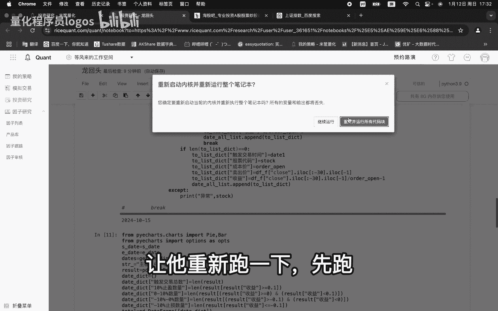
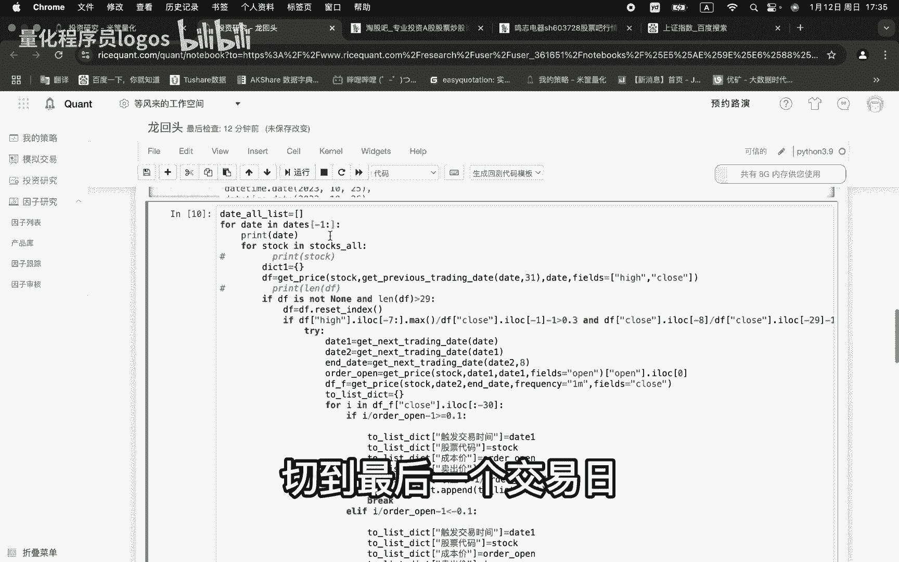
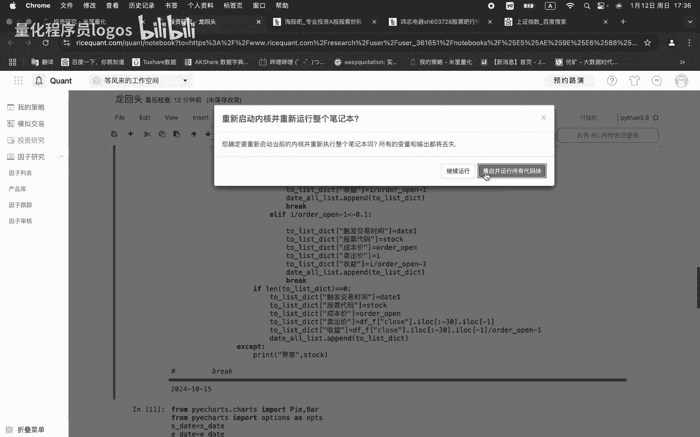
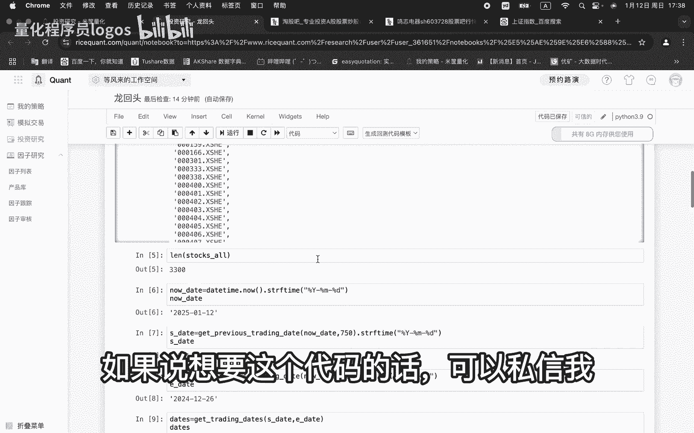

# 量化程序员，被裁后第二次面试，失败！在家讲解自写python回测框架，想学量化回测的可以看看。 - P1 - 量化程序员logos - BV1WNc3eAEsr

上周去面试了那个资深量化研究员，我去他们公司去了，然后发现只有一个人在上班，只有一个人在上上班，一个人上班，加老板两个人，然后我问最后我面试的问他，我说你们有这个Python的接口吗，然后他说没有。

就那一个程序员正在开开发呢，最后聊着聊着，然后谈到薪资问题了，他竟然想让我没有工资，就是就不给我发工资，让我去上班，让我到时候赚钱，让我拿提成，卧槽他这想让我去付费上班呢，还是在这个三件套那边的。

哎然后我就立马走了，唉算了，加油吧，再继续面试，我看粉丝有人想就是学一下这个回测，我今天准备一下嗯，可以就是讲一个简单的回测回测框架啊，我刚才准备准备了一下嘶，在这是搞的这个简单一点，搞了个简单的。

就是我视频里面讲的那个头七战法，这是策略条件对吧，这打包对吧，这是为什么用米框呢，米框回测没有时间限制，掘金还要这个要积分呢，你测的时间长，这是选出股票是吧，主板的上市主板深市主板。

还有这个中小板的票嗯，一共多少只呢，3300只对吧，开始这这是今天的日期对吧，开始日期一般都会测3年五年的对吧，这是结束日期是吧，因为条件啊，我们这个地方的条件是什么，这两个条件是吧。

有了然后止盈止损是要持仓啊，持股十个交易日10%止盈，10%止损，如果说没有触发的话，就在第十个交易日下午02：30给他卖掉，嗯所以说你看这个地方要对吧，我们今天要去往前推十天。

是最后一最后一个交易出发日，这是这是选选出所有的交易日，OK这就是主要的回测框架代码啊，可以大概讲一下啊，大概讲一下啊，不能讲的特别细，特别细，时间会特别长，然后这个是我就选了一天。

就是选了一天来跑这个代码，如果说你要测所有的数据的话，你把这个啊date的，我现在选的东西，这这部分删掉，不让他去切切片就可以了啊，你去跑这代码嗯，嗯这个就是选取这个股票的历史数据啊，选个31天左右的。

然后这个地方就是核心的两个条件对吧，这个就是最近的七天是吧，最七天最大值让它跌下来，要跌到30%对吧，这是这是这个七天一天是吧，再往前推20个交易日，让它涨幅大于30%啊，这两个条件选出来了对吧。

然后啧DA1对吧，因为我们A股是T加0T加一嘛对吧，所以说这一天买完之后对吧，这个就是这一天这一天买买的嘛，以开开盘价来买哦，这是以开盘价来买，买完之后当天是不能卖的，所以说我们要从第二天开开始。

来对它进行条件判判断，这行代码就是从对吧，买完之后，第二天到这一天，一共九个交易日的分钟的所有分钟数据，以所有分钟数据来对它进行条件判断，你把所有的分钟数据，从这开始对它进行判断对吧，把02：

30要卖嘛，所以把最后最后30个分钟数据把它剔除掉，然后对它进行便利，大于10%了是吧，咱先存到这个字典里面啊，存到字典里面，再存到这个列表里面对吧，存到这个列表里面，列表里面嵌套字典对吧。

这样来形成data frame的数据，OK这所有的便利完了，你看这一个for循环遍历完之后，如果说它没有触发的话对吧，那么他这个字典就是是个零，那么我们就在02：30把它卖卖掉。

然后把统计数据也搞到这个列表里面对吧，然后这是用py charm来统计画图的对吧，这行代码是什么，就是来统计我们统计止盈的，然后这是什么，就是十天之呃，他没有止盈，也没有止损，然后再最后卖卖的时候。

他还是赚钱的，对吧对吧，这个就是胜率了，这我们这个是很重要的，就是最后一个结果就是这每一笔交易成功了，就赚钱的这个笔数占多少，OK我们这个代码可以再重新跑一下啊，我们选的是10月15号这一天去选股。

那么就在10月16号开盘，早上买入，买完之后拿十天，我们看10月15号是哪一天啊。

我们先把这个代码让让让让他重新跑一下，先跑。

OK先跑了，10月15号大概学员看看大盘是在哪，就是我们不能选，如果说你选到这，那肯定会涨对吧，但是啥都都都都都可以赚钱，我们想选在它它跌是吧是吧，龙辉头嘛，他跌跌跌差不多了啊，我们在这随便选位置抄底。

这所有的日期你都可以跑，都可以测，我们选的是10月15号啊，就是这反正就是跌嘛，我们就是跌，肯定要是在月跌的时候，我们去抄对吧，那么就如果说手动的话，我们就在10月15号。

最好在15月这行绝望的时候去买，抄10月15，10月15号去选股，那么就10月16号开盘去买对吧，买入之后拿十天，如果说盈利10%，我们就卖掉对吧，个股这个股这是大本，是10%卖卖掉。

如果说跌10%我就止损，如果说这十个交易日都没有没有止盈，也没有止损，那就在最后第十个就是02：30把它卖掉对吧，这样的话就把所有的交易笔数统计出来，我们来统计我们的赚钱的比率有多大。

OK我们看一下这个数据，啊这样的股票选了十十九个对吧，他的成功率有多少，90%啊，你看我们选的是哦，我们不是选在我们不是在爆发的去去追涨了，我们是在在它有大概率横盘的时候买的，就能达达到90%。

我们嗯验证一个股股票啊，就说这个是呃，603728603728603728，明治电器，10月17号，当天10月17号当天买的，10月17号，10月17号在哪哦，在这你看每个个股都是跟随大盘的方向。

大盘回调时候他也要跟着回调的对吧，你看是正好是10月17号买的，你看这后面是不是，那肯定是止盈了嘛，对不对，我们11月11号是开盘价多少，42。17，我们看我们的策略里面的，是不是那个是那个成本价多少。

10月16号买的，10月16号是42。49，看一下啊，46249，明制电器16号16号买的啊，你看看评价是不是多少，是42。498，没问题对吧，数据是没问题，这这个是赚钱的呃，这数数据你都可以对一下。

没问题的，我这我对待一下没有问题，这是这是我们横盘的时候，你看概率就这么高，没问题对吧，那我们肯定要选一个大盘跌的时候啊，对不对，我们就最近最近这一两个月啧，专杀龙回头对吧。

我们选我们搞一个就是最后嘛就是，最近的对吧，就26嘛，对不对，就这个最后一个交易日，切到最后一个交易日。

我们这所有代码只抛一天数据。

龙回头这个策略啊，头七战法他非常非常受大盘的影响，我们选这两天来跑一下数数据，让你感受一下，如果说你要优化的话啊，就优化的方向呃，这两个条条件是基本的，你要加入大盘的风控对吧，这是一个方面。

第二个你还可以加入板块是否是热点对吧，然后你还可以加入这个个股的这个成交量对吧，比方说他这种成成交量，它它你看它这量都是每天的量，都是基本上是平量，说明每天换手还很很健康是吧，当他这个量。

如果你看这个量缩到这个底部的时候，那就是抛盘是吧，和换手基本上就啧就比较弱了，就属于变盘节点，所以说这个地方去买的话，概率会大一些，知道吧，但是也不能保证一定赚钱，知道吧，我这个策略给你讲。

只是讲这个逻辑，你不能把我这直接去，然后去炒股，然后亏钱什么，这根本就是怎么说，你不能来实际的操作啊，你别亏钱再找找我，那我还是呵呵是吧，我肯定不能保保证你去赚钱对吧，如果说我能保证赚钱。

那我还录什么视频呢对吧，哎你看这个这个的胜率，你看只有20%几了，知道吧，12月27号去买，26在哪，在这你看后面你持仓十天，你看大盘跌成啥了，你的胜率高吗，不高对吧，我们去跑这个策略。

大概率是没有问题的，好吧，大概就讲完了，如果说想要这个代码的话，可以私信我。

