# 量化策略如何实现程序化自动下单交易_掘金&QMT - P1：Rec 0467 - 科大金工 - BV1hPpHeFEzF

Hello，各位同学大家好，欢迎大家关注科大财经啊，那今天的话我们主要来讲一下，关于程序化自动下单系统的一个介绍啊，也帮助大家去打通一下，如何从我们的信号触发啊，到落地交易啊，就是信号出来之后。

我们如何去进行一个买卖交易的，一个这样的一个流程啊，那一般来说的话我们使用的比较多的啊，量化自动下单系统的话是掘金和QMT啊，那这两家也跟很多的券商啊，有一些啊支持和合作啊，像什么掘金万合啊。

掘金国盛啊啊，或者QMP的话，像比较多的，像跟国金啊之类的合作也都比较多啊，所以这些下载系统的话主要是帮助我们辅助啊，去使用Python API接口，或者说文件单的形式去进行自动化的啊。

或者说快速的进行一个委托下单的一个流程啊，那整体的一个介绍的流程的话，大家可以参参考一下我们今天的大纲啊，那第一部分呢，其实就是我们如何去把我们的本地的策略啊，去实行定时的一个触发任务啊。

因为有时候我们写好一个Python的脚本啊，这样这这这是一个策略啊，那他会给出信号，那信号一般来说可能我们需要去运行一下，这个文档之后，它才会给出信号啊，但是我们不可能说每天趴在那，每天到了点。

比如九点钟到了，我们运行一下，运行一下，这种比较啊比较麻烦啊，也并不一定说我每天都有这个时间去做啊，所以在这种情况之下的话，我们一般会是用我们电脑里面自带的，这种定时触发功能啊。

帮助我们去执行一下本地的这种定时任务啊，给出信号之后，然后并且实行实现自动的这样的一个下单过程，那这样就可以实现全流程的信号的给给出，以及下下单交易的这样的自动化啊，那第二部分的话我们讲一下。

如果你要实现自动化交易啊，一般来说，因为自动化交易跟普通的交易会有区别啊，会涉及到一些Python这个API接口的下单，而且他下单的速度会特别快啊，所以啊呃这里面的话会涉及到一些券商，合规的问题啊。

所以如果去开通对应的接口的话，需要去走的是券商的程序化交易的一个审批啊，那也不会很麻烦啊，那基本上反正填一下你的策略类型，然后你的每天下单的一种数量啊，可能一般来说你可能个人投资者的话。

下单数量可能也就几十次，或者说少一点，可能就多一点，可能也就100来次啊，就差不多了啊，所以说像几个月前的这种监管，比如说1万次以下的这种，主要是针对机构的啊，对于如果你是个人。

想去做这种程序化自动交易的话，基本上不会有什么太大影响啊，所以这部分的话审批基本上可以，这个可以可以可以pass啊，然后第三部分的话我们会讲一下啊，如果你得到这个审批之后呢，你可以去找券商对应的这个呃。

有合作的这些交易系统的一个服务服务商啊，像掘金和QMT，这两个是我们业内用的比较多的啊，那这q mt里面其实也会分啊，是这个正版的，就是就是就是正式版的这种qt和mini q mt啊。

就是它会分两个一个试用题，一个是MINEMT，等一下我在后面会介绍啊，它们之间的一个区别，那这两个下单交易系统的终端的话，主要是帮助你去对接到券商的这个，乘法交易接口，然后去实现一个申报下单的一个。

这样的一个流程啊，那第四个部分的话，我会讲一下，如何去在原有的API下单软件终端的情况下，你去在做一层，比如说如何去实现一些集成化交易的算法，比如说我们想去做一下啊，这个这个交这个算法交易啊。

或者想去做一下调仓，或者想做一下清仓啊，这样的一个行行为，那我们在第四部分会给大家做一个介绍，好吧好好，那我们做一下区域的一个预告啊，那下期的话我们会给大家讲一下啊，如果你是一个小白啊，想从零开始去啊。

学习搭建一个量化策略，应该怎么去进行一个研究的顺序啊，因为我看到很多的外面在讲的这种研究的顺序，或者说外面有些课程在讲的时候，他的顺序其实是颠倒的啊，所以我给大家到时候罗列一下。

应该怎么去进行一个学习会比较正确啊，啊那我自己有开一些相关的量化课程啊，那基础课程的话主要是讲一些多因子模型的啊，关于什么数据清洗呀啊因子的一个构建啊，包括因子的检验啊，多因子模型的构建都会有啊。

包括回测的一些一些呃，会会做的一些搭建啊，那今天课程的话啊，主要是偏向于一些既学习了啊，继学习的遗传算法啊，遗传规划，包括一些记学习的一些数模型的预测啊，包括一些择试策略，其实也都会有。

那大家如果有需求的话。

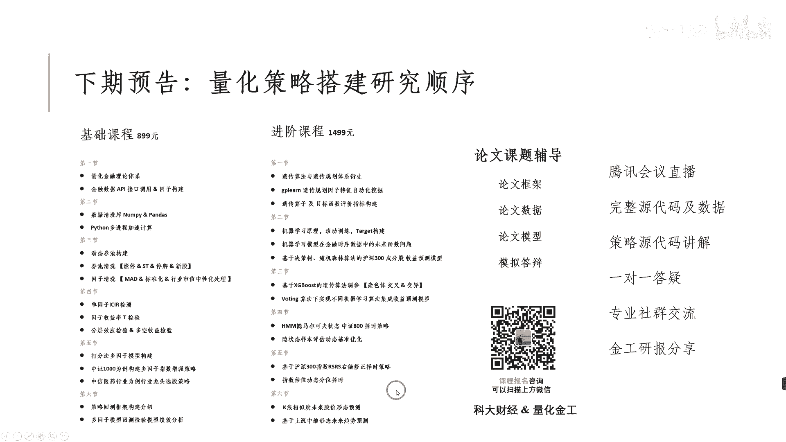

可以去扫描我右下角的二维码，发给我进咨询就可以了啊，好那我先来讲第一部分，那第一部分是关于策略的，本地定时触发的任务啊，那这里面给大家先讲一个非常重要的一个啊，一个点就是需要选择你的设备的配置啊。

如果你是windows电脑的啊，那这就没问题了啊，那但是如果你是Mac os或者是其他系统的，那你需要注意一下啊，为什么这边我强调啊，非常强调说一定要用windows系统呢，因为啊如果你是OS系统的话。

很多的券商是不支持的啊，很多券商的原生的一些下单的一个系统，比如说像同花顺啊，这种已经是已经已经是这种集成器的那种啊，比如说你如果是开国金的啊，或者是如果你是想用啊国盛的啊，包括如果你是像一些啊。

反正不同券商交易终端的话，它只有一个windows版本，它不会有什么OS版本或者LINUX版本，它都没有，所以建议大家一定要先选择好自己的设备啊，设备如果是自己之后想做量化研究的话啊。

建议搞一个windows系统啊，不管你是用虚拟机也好，怎么样也好啊，弄一个稳定的windows系统去做啊，那好那除此以外的话，我们讲一下如何去做一下，我们策略本地化的一个编译啊，那第一步骤当然你需要啊。

有本地化的一个数据接口啊，你数据接口可以有很多，比如像to share或者ak share，那这两个是一个比较比较比较常用的，或者说比较便宜的啊，那个数据库的一个来源啊，那当然你也可以选择一些比较贵的。

像巨宽啊，response这种平台，其实也会有提供相对应的数据接口，那你可以用这些本地化的数据接口，去搭建一个本地化的策略啊，本地化策略，那这个策略可以直接在你的本地进行运行的啊，这个叫本地化策略啊。

那有了这个搭建好之后啊，那这个策略怎么搭建我就不说了啊，这个可以看我其他视频里面去讲啊，那我们在有了你策略的前提之下啊，然后你需要去编写一下，你的程序化交易的一个啊程序啊，比如说你想去实现一个啊。

比如说你这是第一天是你想去进行一个下单啊，或者你想进行一个调仓，或者来进行清仓，那这时候你可以写对应的一个，程序化下单的策略，所以这两个策略都是一个脚本脚本A脚本B啊，一个是产生信号的。

一个是进行下单执行的啊，那下单执行的话，就是刚刚我们说的觉醒的QMT的都可以啊，那这两个策略写好之后呢，啊这这两这两个脚本写好之后呢，你可以在比如说其中的一个脚本，是按策略脚本里面啊。

你可以再写一个叫做比如说邮件的一个提醒啊，邮件的提醒，一般来说说这个策略在运行过程中的时候呢，啊，比如说今天要买，这是个标题或者卖这是个标题，或者买这二手标的，卖是20个标题。

那最好的情况下就是你有你有个备份，这个备份，就比如说他是能够实时通知你现在啊，今天要调入买入什么样的一个股票了，那最好的话就是你可以使用一些邮件提醒，或者说啊，像一些比如这个微型机器人安之类的也行啊。

那邮件提醒相对比较简单一点，你可以去参考一下啊，网上应该会有SMTP的协议啊，去做一些邮件的提示啊，只要你这信号触发之后，你可以通过STNSMTP协议啊，去通过Python脚本啊。

帮助你去是去通过QQQQ邮箱啊，发送你的这个调仓的信息信号啊，到你的这个邮箱里面啊，这样的话你也可以稍微关注一下，今天买的这些股票到底怎么样啊，也可以留意一下，那有了这三部分之后呢。

那我们需要把这三部分全部把它写成啊，这是这这是这这是一个一个一个脚本吧，啊那我们需要去如何去运行这些脚本啊，运行脚本的时候，我们会去写一个叫做BAT文档啊，大家可以看到有像有些什么抖音里啊。

或者说一些什么视频号，上面经常会教你们如何去一键关机，一键什么重启啊之类的，那其实都是毕业季的脚本，那这BAT脚本，它其实就可以去调用这些对应的脚本程序，比如说像下单程序或者说测试程序。

让它去进行一个执行啊，实现我们的这一个策略的脚本的一个调用啊，以及bat环境里面，bat的这个脚本里面你也可以去写对应的啊，比如说他的一个这个程序，你是调用什么样的一个康大环境啊，因为我们一般在写的话。

我们会调用一些配置下康大环境啊，所以在这里面的话也会去呃，选择你到底用什么抗大环境去做啊，那最后最后其实就是你把这些脚本呢，放到你的这个这个计算机的这个，定时任务里面啊，右边其实给大家截图了。

就是大家可以去在你的这个系统里面，去找到一个叫做计算机管理，计算机管理进去之后呢，你会里面会有定时任务，你可以把这个定时任务啊，去选择一个对应的时间点，比如进行定时的触发，然后去选择去触发什么的。

去发表你的bat脚本，因为bat脚本到时候会调用你这个Python程序啊，Python程序啊，所以这样一来之后，你就可以去实现你的这个策略的脚本的，定时触发的任务啊，那如果大家有什么不明白。

或者说里面一些细节一步一步不知道怎么做的，也可以在后台私信我啊，我会给大家这个，到时候可以一对一的再沟通一下，好吧啊，那所以这几步流程你全部打下来之后呢，那这个时候你就首先可以完成第一个点。

就是说你的信号可以进行自动的触发啊，每天九点钟或者说每天八点钟的时候啊，它会自动的去生成这样的一个信号，然后发动发到你邮箱啊，然后再到比如说09：30的时候啊，或者09：15分或者安那会。

什么时候你可以去自动的去开始准备，不接单了啊，不单了，OK好，那这是第一部分定时触发任务。

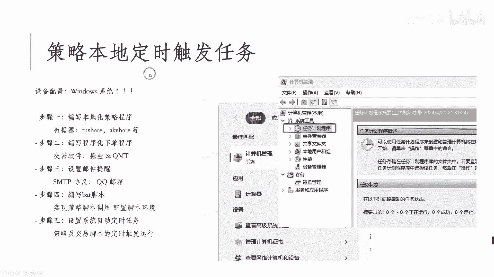

那第二部分的话其实就是我们要说的啊，你的这个合规问题啊，券商的程序化结构的一些审批啊，那因为这个这个量化交易里面其实分两部分，一部分是券商的部分，一部分是这个呃交易系统的部分啊，因为券商的话。

他不会完全自己去搭一部分的交易系统啊，包括就算他们自己搭了，其实交易系统有些都比较就比较，就比较就比较一般啊，所以说一般会有三方的，像掘金QMT卡方PETRA的啊，现在我我这边。

其实大家如果需要开通对应的这个，绝境KMT的这种接口的话啊，都可以去在后台后台私信我啊，那有了这些交易系统系统之后呢，他可以跟券商之间进行一个连接啊，那所有交易系统都需要通过券商的这个会员席。

位连接交易所的这个柜台进行撮合啊，所以这两者都是需要的，一个是券商开了对应的这个API接口，其次就是你有对应的这个交易系统啊，那因此需要去找到具有成熟的交易接口，服务的券商。

而有些券商可能他并不经常做这种量化的一个，接口的业务，所以他可能基本上就没有做量化这方面的经验，所以你可以去选择，比如像国金啊，国盛啊啊都可以，银河啊，万合啊之类的，都可以去找他们对应的这些券商。

开通对应的这一权接口啊，你审批通过之后呢，有了对应权对应权限之后呢，他们券商会给你发送这些三方软件，比如说比如说国盛啊，或者说这个国金国金，比如说支持的QMT啊，国盛支持的是卡方，那这时候。

或者说他们就会把对应的三方软件发给你，你可以去使用这个国晶和QMT啊，的一个联合版本啊，一般一般这种QMT不会是单独自己QMT，一般就是国盛QMT啊，或者是铂金QMG这样的形式去发给你。

那然后你就可以去进行使用好吧，所以例如像这个PMT决定P区的卡方，都可以去做一个第三方的这个交易系统去做，那这里面会有一些要求，比如说像我刚刚说的这个申报频率啊，你的交易频率大概多少啊。

会有一个会会会会有一个大概的一个范围啊，你自己要做申报，然后包括你的资金数数量的审核，比如说你的资金数量是多少钱，你是十几万的还是几万的，还是啊几百万的啊，做一个审核啊。

当然这里面不会有一个严格的资金要求，比如说一定要有几百万之类的才能做啊，你可以几万块钱也可以做啊，不同券商他的一个门槛是不一样的啊，啊那然后呃现在是已经支持的一些券商啊。

就是大家如果大家如果需要去开通对应的，量化的AAPI接口的话，我这边是已经啊可以支持的，像国金国盛，万合和银河，都可以去支持对应的这个量化接口的，一个呃呃的使用啊，开通啊。

那这样的话你就可以快速的使用Python脚本，去对于你的这个对应的这个呃这个这个系统啊。

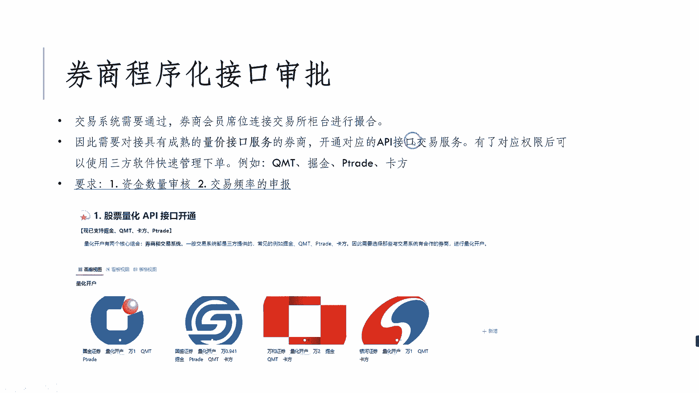

就是去进行进步单了啊，那然后的话对于API下单，这个软件终端的一个介绍啊，我们讲两个，一个是绝经啊，还有一个是PMP啊，那掘金的话会有在他官网上面啊，就是掘金量化啊，那他在他的官网上面啊。

可以点击这个绝境终端啊，那就可以免费体验他这个绝境终端的，这个使用啊，那这个就这种这个版本的话，他是个测试版本，就是模拟交易的测试版本，你可以直接通过绝境的官网进行下载啊，但是他不能直接进行下单啊。

因为呃正式的这种版本的话，需要通过与掘金已经有合作的券商啊，就像国盛啊之类的，也有合合合作过的这种券商，需要在券商那边先开通了你这个API接口之后啊，他券商才会发送给你对应的，整局金版本的系统啊。

而且不同的券商因为他的合规性不一样，所以他们对应的这个支持，掘金里面的功能也会有区别，比如说有些券商可能会多支持一个条件单，但是有些券商可能就只支持，比如说API下单接口啊。

但是AP加相应签约构也也够了啊，也够了啊，那条件单其实就类似于我做一个扫单，比如说在我一个文件夹路径下面啊，我去把我当天的这个交易信号把它放进去啊，然后它会自动去扫描这个交易。

这个这个路径下面的这个交易的文件单啊，可以在到时候大家如果下载好这终端之后，可以进去找到交易工具。

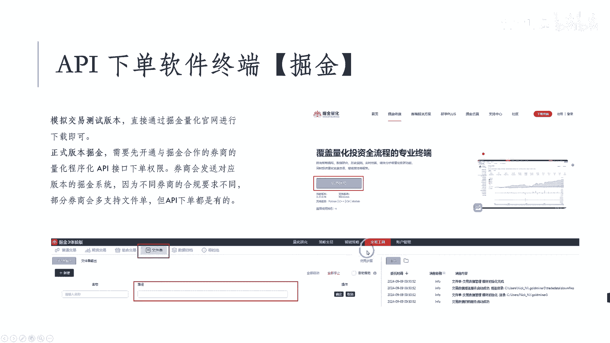

然后里面各个文件单啊可以进行新增，当然你在做模拟盘的时候，反正都可以去测试啊，那这边给大家看一下如何去啊，体验一下两种这个文件单模式和API接口的，一个啊的的一个区别啊，那上面是两个链接。

这两个链接分别介绍了这个，大家到时候也可以去在后台私信阿木，我要这一个啊这个课件啊，这两个链接进去之后，都可以找到它对应的这个文件单的这个这个，documentary一个介绍啊，然后这个也是一样的啊。

AAPI接口的文件介绍，那文件单模式下的话。

只要在对应的路径下啊，就是这边的话到时候你可以传入一个路径，这个路径就比如是个文件夹的名称啊。

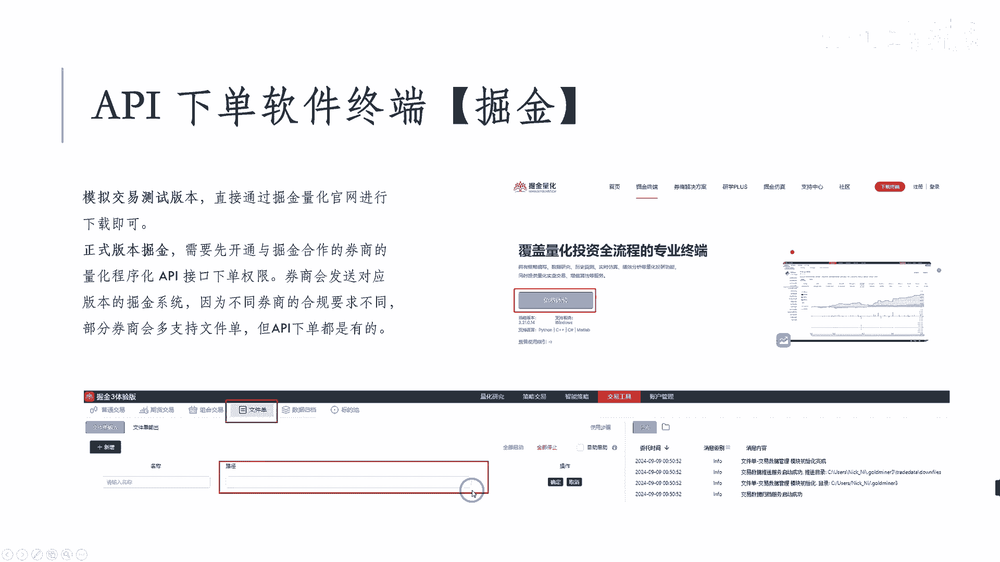

对对对的一个路径，然后你只要在这个路径下传传入指定交易啊。

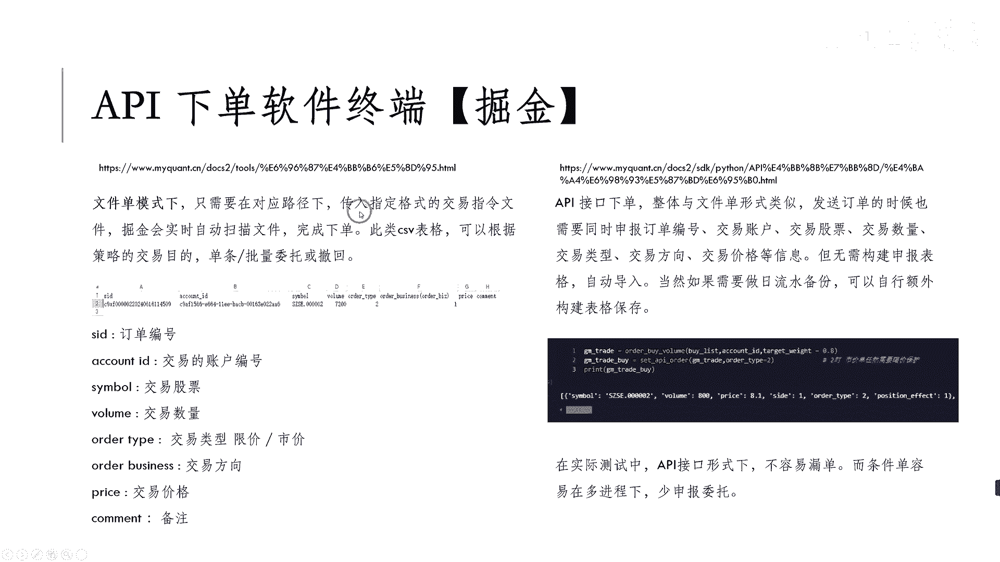

格式指令的一个文件，那掘金会只要你这个绝境软件是开着的啊。

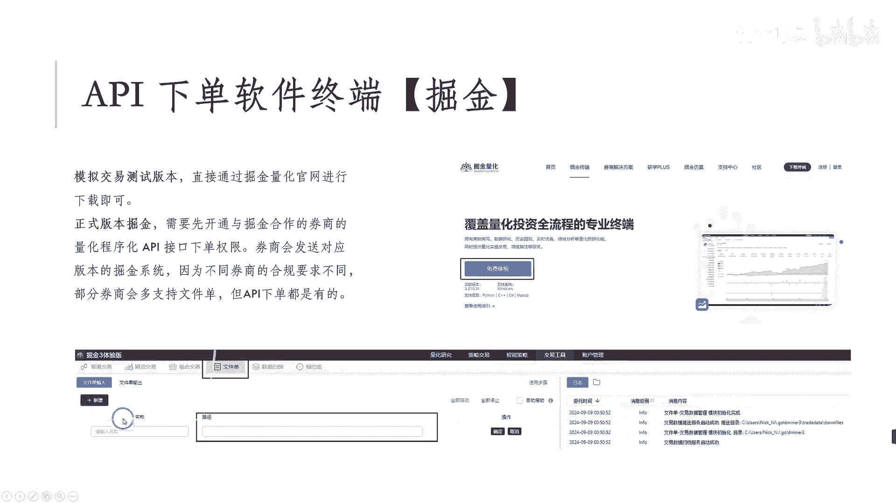

它就会实时去扫描这一个对应的文件，然后进行一个类似下单啊，那此类的CSV表格的话啊，可以根据你的交易目的啊，进行一个多条的单挑，或者批量子的委托或撤回啊，所以你就可以在通过条件单，你可以进行一个下单啊。

或者说你去进行一个批量下载啊，就是比如说100个股票同时去下，也可以，他会同时去申报出来，那这就比你一个一个一个一个在输，肯定要快很多嘛是吧，你不然的话，如果你现在还是手手动下单的话，手动下单的话。

你可能就是今天啊这个从早上开始输，你有30个股票要买，每个股票可以输入输输个十秒十秒钟啊，30股票买30股票卖吧，那这个时候你就是六十六六十六十笔交易，60比较低，乘以十的就是600秒六版本的话。

那可能时间就很很很多了，那可能错失一些交易交易时间了机会，那通过AAPI接口下单的话，他可以批量进行下下单，那这样的话它的整体的一个交易的速度啊，或者说实现你的目标的这个速度就会更快啊。

OK那这种其实也不涉及说我这个抢跑啊之类的，这个完全没有什么关系，只不过我申报的时候，可以一下子统一的申报出去啊，这个只不过是一个你按按键盘的一个这样，这样这样的一个区别而已，好吧，你键盘按的快。

其实你可以很快很快是吧，然后你单挑的，就但这边可以实现一个单调度，批量次的一个委托，或者说我这些单我放了之后，我不要了，撤回也行啊，那像格式里面的话，其实这是一个标，这是一个标准的一个啊。

委托的一个委托下单的一个格式啊，然后里面会有这个SID，这个其实就是订单偏好，这个订单偏好是你自己自定义的，一套订单编号啊，自定义自定订单，一个订单编号，比如像我这里面的话，订单编号啊。

前面这个C9AF，这个是C9F00，这个其实应该是我的委托账号，委托账号要就就这个account id，前面就是C9F，因为我需要去告诉我是对于那个交易订单，去那那个交易账号去进行执行的啊。

然后后面这些是我的交易的时间啊，比如2024年的6月16号啊，11：45：09啊，这个是我交易时间，所以说这个订单编号是，你其实是你自己去定义的，方便你到时候去实现，比如说你的当日的当日的流水的回溯。

或者说你去做测单都可以呃，康纳id呢，这就是我的一个完整的一个交易交易，交易的一个账户啊，然后SYML的话就是我的交易股票的一个啊，你要交易哪只股票啊，然后交易多少数量马六。

然后auto type就是你是想进行限价单还是价单啊，这边他会有分一二，当然这里面其实还会有很多，比如说本方最优或者卖方最优，或者说的买买一档，买二档，买三档，卖一档，买二档。

买三档都可以去做对应的一个申报啊，包括如果你要做复杂点，比如说像一些这个这个期货啊啊期权啊，可能他的这个order type的类型可能会更多啊，然后还有older business啊。

ORACS其实就是我的这个交易的方向，你是一还是二，这个就是你是买还是卖啊，那如果你是比如说试驾单的啊，试驾单比如说你是二类型的，那这时候你的price方下，你就可以不备注你的价格啊。

因为试驾单本身就是现直接直接实时成交嘛，是吧嗯，能成交多少就成交多少啊，但是如果你是现下单的话，一般你需要去申报申报一下你的价格啊，所以这里面会有一些有一些区别，然后最后这个其实是备注。

就是说你可以去写一些啊，你想啊，比如说这个这是对哪个策略的啊，或者说你是什么样类型，你可以解备主这个也行，但反正交易里面主要主要用到，就是你是对谁买多少数量，什么类型，什么价格去做啊。

这是文件单的一个形式，它是通过CSP文档传到你的指定目录下面，来进行扫描完成，那Python接口的话相对比较细简单一些啊，那Python接口的话，它整体的形式其实跟文件单是类似的。

也需要去发生对应的这个编号啊，交易账户啊，股票啊，哪只股票啊，数量啊，类型和方向啊，价格信息都是一样的啊，所以在这里面的话啊，比如说我这边申报完啊，这是我自己定义的一个这个这个函数啊。

比如说我这边去生成一下，我想要交易的这个数量，像我这个是older bible，就是我想买到比如多少多少的比例，比如百八成八成仓位啊，然后我把这个对应的仓位去输到我的这个给API，order里面去。

然后它会生成对应的这样一个，编制好的一个价格目录，因为你不可能这里面的价格，你价格数量你不可能一个个手动自己敲啊，你可能也是需要这个代码帮你去快速进行执行，那这时候你就可以自己定义一些对应的函数。

然后快速帮你生成你对应的方向，和你的这个对应的金额啊，啊不然的话你也很很笨是吧，不然72072000，你这一个月输你可能还不如在交易终端，交易终端直接输更加快了是吧，所以这里面你可以通过配一些配置好。

自己想好一些函数，快速的对于你想交易的目标，去生成对应的这样的一个，这样的一个交易信息啊，然后这样的话就可以进行快速的步单，那不单的结果你可以看看这里面有我有这个，比如说哪只股票有多少数量，什么价格啊。

方向类型啊，曲线这样的执行啊，那这样就可以快速完成申报，可以通过你的Python的这个文件里面，可以快速进进行申报啊。

那这样一个下单的流程的话，你也可以直接使用前面的这个，订单触发的功能啊。

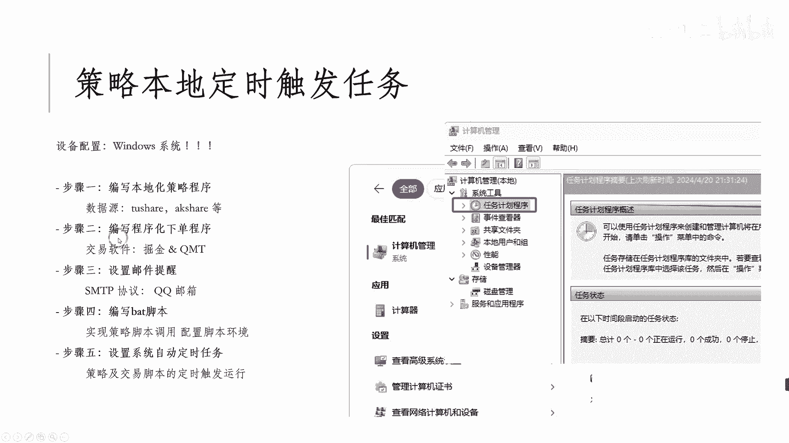

就是我们这边步骤二里面啊，可以去进行一个自动化的一个交易啊，那当然这里面的话，如果你是用AI接口进行申报的话，那这时候他是直接进行申报的啊，但是他不会去保留像cc文档这样的一个格式。

所以这时候如果你要做日流水的备份的话，你可以额外去购进一些表格啊，去进行保存也行，那我实际上也对比过这两种方法的一个区别啊，那在实际方法中的时候呢，文件单呢可能你的流水保保存下来，可能更方便一些些啊。

那但是呢在实际测试测试中的时候，AAPI接口进行下单的时候不容易漏单啊，不容易落单啊，有时候你文件单同时放出去，或者一一下子放好多个数据之后，他可能会漏单啊，特别是自带这个这个文件单。

这边条件单其实就是文件单啊，就是当你容易在多进程的情况下啊，比如说你啊，比如说你想对于多个标题去做t wet web的，这种算法交易的时候啊，进行拆单的时候，那这时候可能啊。

你一次如果只能对一个标题做算法拆单嘛，但是你想去同时做，不然的话你等前面一直不做完，再后面就做，那肯定时间浪费了是吧，所以这时候你可以去进行多进程的这样下单，在多进程下单的话，其实就会导致。

比如说像文件文件单里面，可能就会进行少少申报这种现象，但是如果你通过AAPI接口下单的话，它就不会出现这种现象啊，相对比较稳健一些些啊，这是在绝经力系统里面，这两个方法上的一个区别啊。

然后再讲一下这个三单终端里面，另外一个叫做mini q m t啊，那这里面的话，我们先讲一下QMT跟mini q m t的区别啊，大家也可以在很多的这个，像知乎上面看到他们之间的一些介绍啊。

那最难的一个或者最明显的一个点就是啊，能否使用AAPI接口进行下单，就Python a API接口进行下单，那普通版的PMT啊，它是不行的，但是mini q t就是可以的啊，可以进AAPI就可下单啊。

那API接口下单的话，需要你拥有API接口下单的一个权限啊，通常的话迷你QMT只开通，给机构客户去使用啊，他们拥有这种API加单的权限，但个人个人投诉的人，可能只可以给只给你开KMT。

那个别券商的话会允许你开通这个MIKP啊，所以这个的话就相对来说，可能他的这个要求会相对高一些些啊，啊但是也是能开啊，也是能开，那然后可以在这个API接口里面啊，其实你也可以去查询。

比如说你当前账户信息啊，比如这是我的账户啊，我自己写的函数叫做get account information啊，那这时候你可以查到我这个account，我的这个股票交易账号是什么啊。

我的现在有的钱是多少啊，我的总资金是多少啊，开始就是我的存留存留现金投资，asset就是我的总资金，比如9万块钱啊，然后我当前持仓是什什什什么多少多少数量啊，这包括当日委托的那些当日成交有哪些啊。

这边我只是写了个demo给大家啊，大家可以做个参考而已啊。

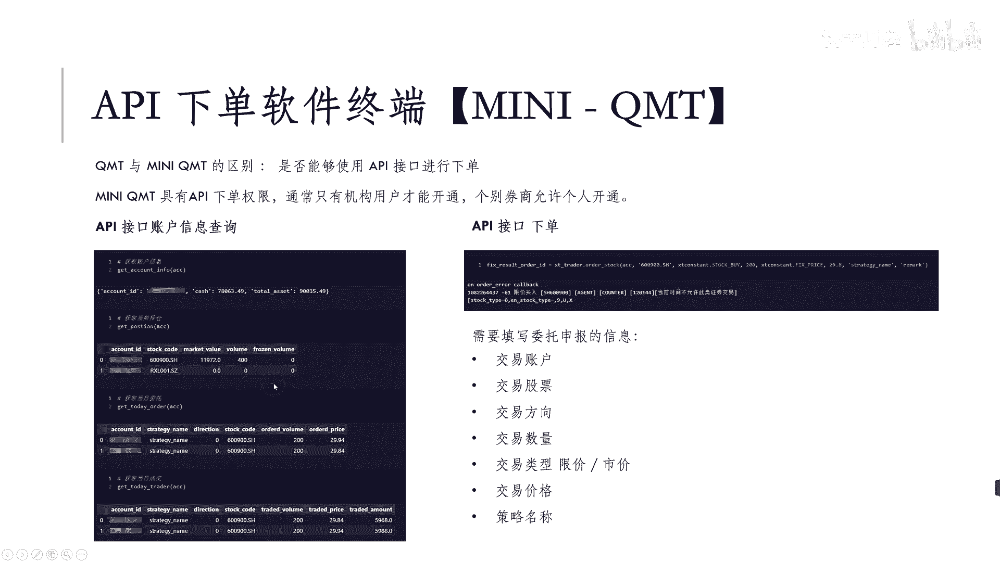

呃那当然前面的绝境里面，也可以，通过我们这一个一些这个一些一些一些API啊。

接口可以去调调出来这个绝境系统下面，它对应的这个账号里面可用资金多少，或者说冻结资金有多少啊，总资金有多少啊，这个都可以去看啊，那当然也可以去说，我们最重要的就是AAPI接口下单了啊。

AAPI接口下单了啊，那一篇旧有下单的话其实也是一样的，只不过他的一个格式可能会有区别，相对于巨星来说啊，你可以通过这个查t trader啊，然后去下单，Order order store。

然后这边是你account，就是你的信息账户，比如说你的账户是多少多少的名，什么日本，比如说是8800777，OK这这这你的股票账户，然后这边是你的这个下单的这个，股票的一个名称，然后这是你的买的方向。

而是by os费用啊，然后这里的数量，然后这是你的是价格，是固定价格还是什么什么价格啊，如果固定价格的话，就给一个对应的这个这个价格的值是多少，然后包括你还可以传入你的strategy的名称。

比如说你是啊390增强，或者是日内什么什么交易之类都可以好吧，然后嗯最后这个没什么用啊，所以这几个就是我们在mini k m t里面。

需要去申报的一些信息啊，所以两边其实都差不多啊，基本上都是可以实现我们这个价格的申报啊。

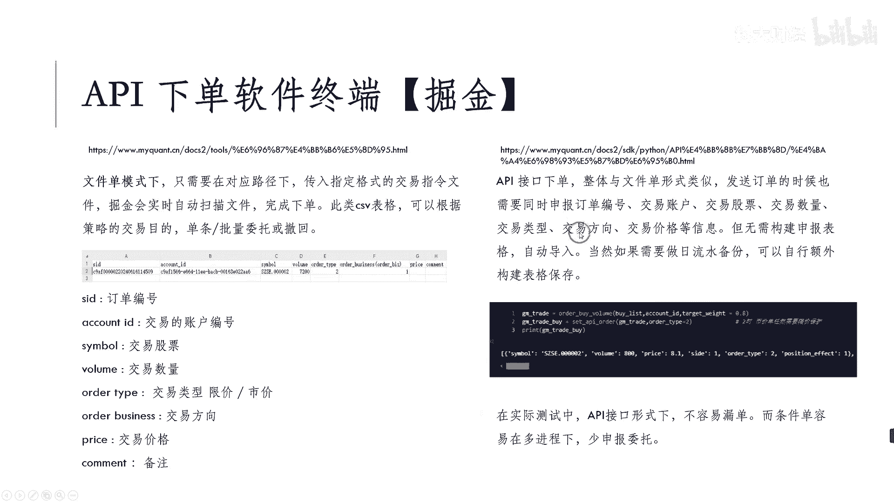

比如说价格的申报，包括我们的价格的查询啊。

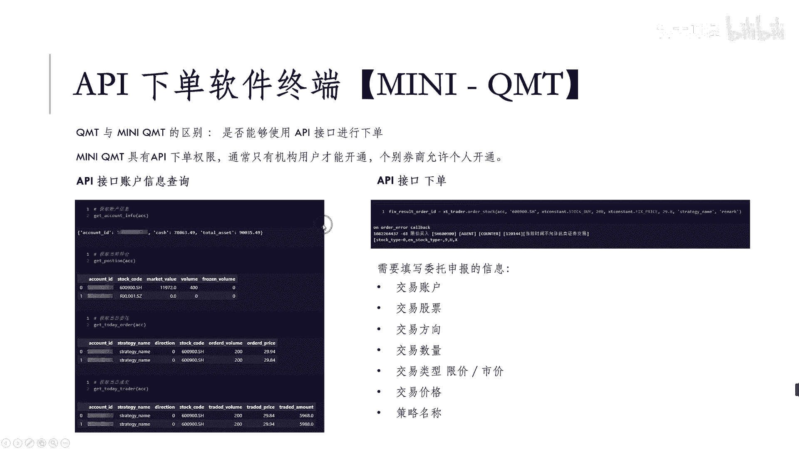

只不过不同的这个机构啊，可能他们支持的这个会不同，像国际支持k m TP trade啊。

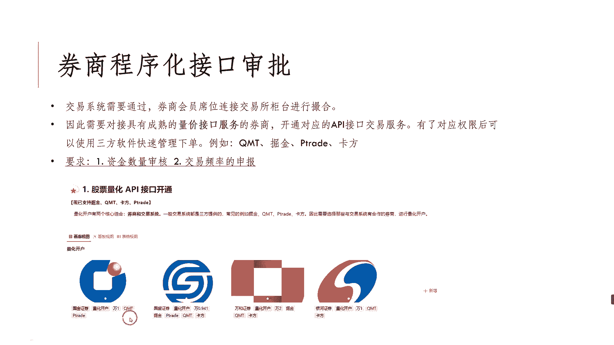

国盛支持的什么P税率，KMT卡方掘金啊，会有些不同而已，OK啊那尽量反正可以去找那些熟悉的啊。

熟悉做就是已经有一定服务过量化啊，用户的这种基金经理，那那个客户经理吧，那这种的话他们其实啊服务器你来的话，他们也相对来说属熟门熟路一点啊，如果你的客户经理还没有做过这个，电话的接口的话。

那可能问起来他们也不知道啊，没有办法进行服务啊，一般只有少数的营业部会去做这种量化的一个，量化的一个这样的一个权限的一个使用啊。

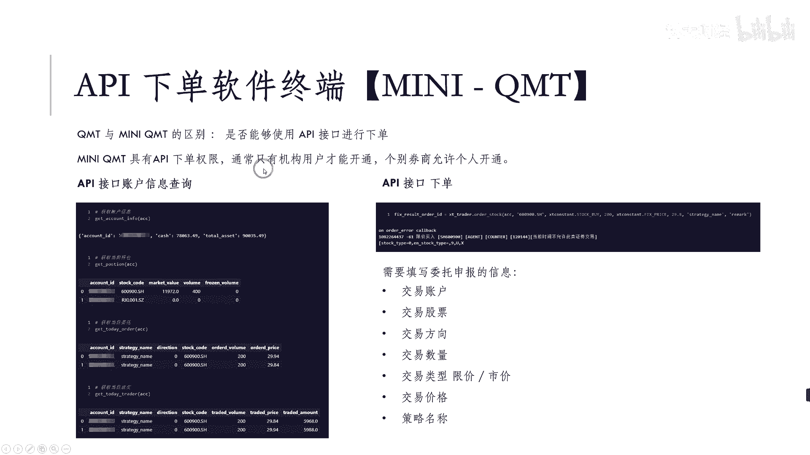

然后我们最后讲一下啊，这个关于集成化算法交易的一个的一个内容啊，为什么要做一下集成化解算法交易啊，那一般来说的话量化交易终端啊，像QMG有绝金的话，他们提供的API接口主要分为以下几类。

一个是账户查询啊，我查一下账户里面现在有多少钱啊，我现在买了哪些股票啊，我今天每周多少啊，那其实就是大家能够在你自己的股票账户里，手动看的那些，其实也类似，只不过这边的话。

我们可以通过我们的这个这个AAPI接口，直接进行查啊，会更加方便一些些，那还有就是你的委托功能，我想买和卖啊，或者撤单功能，我想撤掉某一个单，包括还有一些简单的集成功能，像掘金里面可能会有一键卖出。

我想把我的底仓我现在都不要了是吧，我现在买的这所有的股票我都不要是吧，你先卖出，包括一些算法交易，那算法交易的话，一般像对于这些，然后交易中的话，他们会收一些这个通告费用，渠道费用。

他们可能会收个万几的，万零点几的渠道费用，那也算他们的收入吧，那但这些其实功能都是一些比较简单的功能，那啊什么叫做复杂功能啊，也是我这边主要讲了，为什么我们要做集成化算交易算法。

那算法算法的一个交易的一个流程什么呢，就为了使去啊就写写写写写的问题啊，就是为了去这个适应啊，适应我们实际的交易的一个场景，那我们其实可以根据我们啊，这种具体的交易需求。

对于上述的这些功能进行一个叠加啊，比如说我们可以通过账户查询，加上我们的委托交易啊，然后完成我们比如下单的过程啊，比如我们先账户查询一下，我们现在股票有哪些啊，有多少仓位啊，然后现在我们想买到某个仓位。

那这时候我们可以去先查询，然后再进行委托，或者说进行一个买委托，卖委托都可以，所以我们可以实现仓位的查询，并且实现部分的买卖，比如买入八成的总仓位或者卖出的三层总仓位，可以这样做，包括我们也可以去。

比如说根据我们当前仓位的一个这个，比如说你的这个股票的一个风格啊，就我们之前讲过一些什么BA风格，你是偏红利类的还是偏成长类的啊，这些都可以做，那这个时候你可以去调整一下你的这个风格。

或者说其实最简单的就是你的市值是吧，我们想把所有的市值低于51的股票，就是小市值股票去卖出，你可以做这样的风格调整，那这样的话你可以快速的，就不是说你一个一个去查这股票，到底有不到50亿是吧。

然后我再去做，那这样的话，其实如果你的仓位股票比较多，比如说二三十个股票涨，你可以一次性全部卖出，就非常快啊，然后包括策略的调整啊，比如说你每天或者说每周也要去调整，你的策略里面的股票。

那这时候你可以去通过啊，这样一个自动化的一个程序帮助你算好，比如说今天以什么价格进行卖啊，然后以什么价格进行买，买多少数量全部帮你算好之后，一次性全部给给出，所以可以在这里面我们集成化写的时候呢。

可以把上面这些账务查询，委托交易啊，全部打包起来的一些功能就是复合起来，然后去实现我们比如说上一期的信号能买上，上期信号的卖出，然后这期新号新信号股票的买入，而实现这样的票仓。

那这些调仓的话肯定就是啊原生是不支持的，需要你自己去定义一些函数去进行写的啊，这也是你自己要从实完交易交易里面，必须要去完成的这样一个东西，那还有一些就是说你想去把他们这些算法。

交易的内容把它去进行替代，比如说原声有什么UVP啊，然后ice berg这种算法，那这时候你完全可以去，通过你对于UP的一些理解，自己去定义一个这样的一个下单流程，那只不过这下单流程里面可能会涉及到。

你可能买了之后挂了一段时间，他还没有还没有成交，那这时候你可能会涉及到一些撤单的功能，或者说查询的功能，就是查询，比如说你的委托是否已经成交，如果没有成交的话，那就撤回这种这种形式啊，所以在这里面的话。

下面这些复杂场景的话，其实都是对于现有这种功能一些叠加啊，只不过你需要的把这些场景具体化啊，到底应该怎么去执行，一步一步去做啊，包括最下面就是多进程的下单啊，你可以去查询一下你当前的这个委托交易啊。

然后开始对于是多音程序R，还是对于这个算法加一来的啊，算法加一来的，你可以同时去查查查这个账户信息，然后去实现一步一分的这个这个算法交易啊，OK所以这里面的话呃。

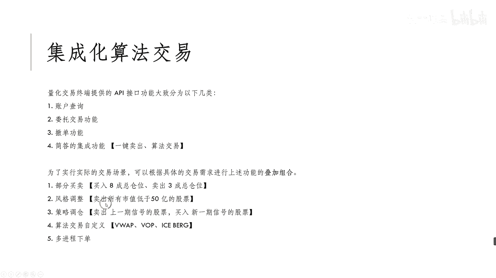

一些简单的功能，其实啊迷迷IKMT，或者说掘金其实都已经有了啊。

只不过后面如果你真的要用啊，那可能还需要一段啊过程，需帮助你去跟你实际交易的场景进行叠加啊，不管你是什么类型的策略啊，你肯定都会涉及调仓嘛是吧，那这时候你就可以去使用这种计算算法啊。

帮助你去快速的完成这样的一个信号，下单的一个过程啊，那这也是我们整个量化交易的，最后的一个部分啊。

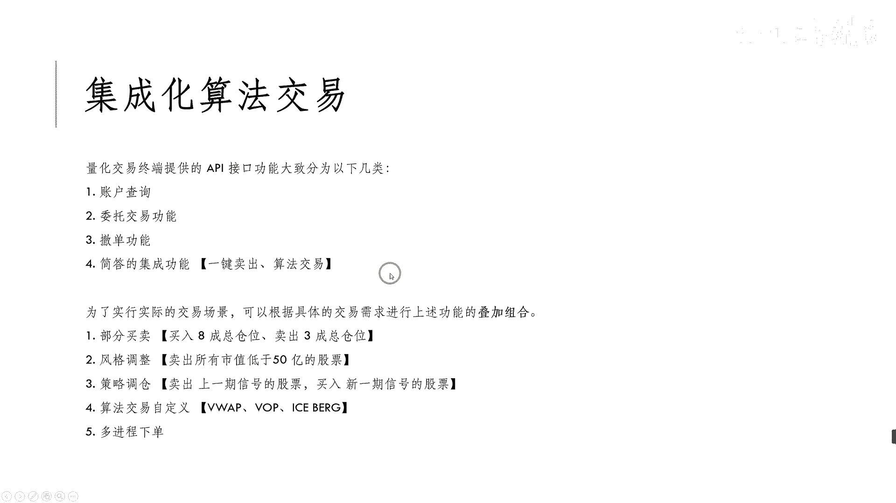

就是你传来信号之后，完成你的下单的那个落交易的落地啊，也是你最终能不能赚到钱的一个关键的部分。

好吧好，那今天的话基本上就把我们这几个流程啊，把它给大家都梳理了一遍，那大家如果有什么不懂的啊，有不理解的也可以在前面啊，扫描二维码，或者说在我的B站后台进行过咨询啊，来问问我一下啊。

这个比如哪个地方不懂的啊，可以私下来问我，好吧好的，今天基本上就到这，那感谢大家的这个观看，那希望大家能够给出你的一键三连，多多支持。

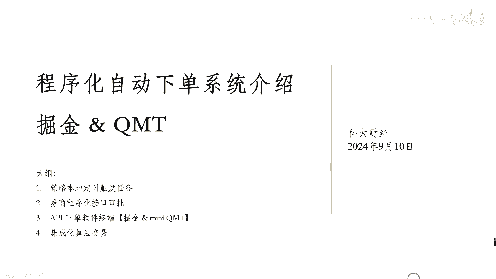