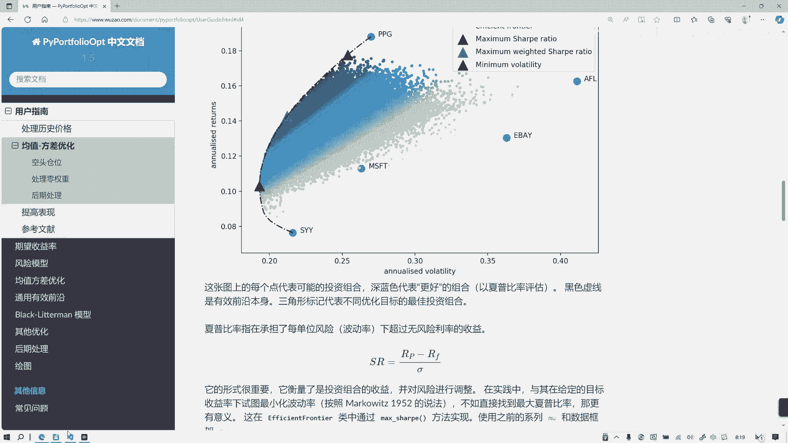
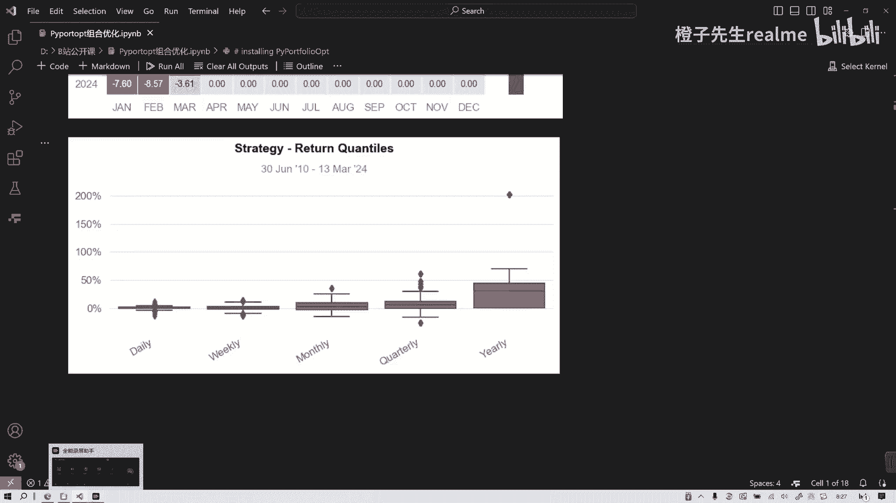

# 量化组合优化库Portfolioopt真的太好用了！ - P1 - 橙子先生-量化 - BV1qC411a7wx

各位朋友大家好，今天讲一下量化这个组合优化啊，量化组合优化呢，是一般的专业投资机构非常重视的一个应用吧，呃量化组合优化呢，它其实我们如果做这个多股票的投资的时候，是非常常用的。

我们今天讲一个非常基本的库叫portfolio o p t，这个据说是一个物理学家发明的啊，然后非常好用啊，在这个库之前呢，我们可能需要写很多很多行的代码，来来实现这么一个最优化嘛，相当于最优化的问题。

我们首先讲一下理论吧，他的理论啊，最早的这个我们叫做规范金融学的理论，就是均值方差模型，它是马克维茨1952年的经典论文中，提出来的，他什么意思呢，就是说我们在投资一个组合，比方说有N只股票的时候。

我们首先要算出它的这个均值，和它的协方差矩阵，那么我们的这个把这个整个投资的优化的问题，可以概括为一个这样一个公式组合，就首先我们有一个目标，就是最优化它最小它的要投资组合的风险。

然后在哪些约束条件下呢，就是这些每一个股票的权重之和等于一，然后每一个股票的单独，每个股票的权重都大于等于零，然后他们可能对每个月都有约束，都有约束，就收益率有一定的约束，那就求解，求这么一个解。

那我们根据这个求解呢，我们就之前如果大家学过CCFCFACFA1级，就知道什么这个最优前沿是吧，就是在这把这个所有的可能画出来以后，有一个前沿，这个有这个前沿叫有效前沿，就是最佳投资组合，有效前沿。

这个图就画出来了，我们就看到这个深蓝色代表更好的组合，就是以夏普比夏普比率来评估的，所以这个理论呢当然它也有一些这个问题，不过它最大的价值是马克维斯，最大价值就是把这种投资以一种数学的方式。

一种量化的方式可以展现出来，在这之前是很少有这种方式的，那之后呢，就比方说现在很多国外的一些投资机构，他们特别是特别大的那种斗气口，它都是只有资产组合的，它的组合一般是以这种夏普比率来来衡量。

或者来选择吧来评价，那么我今天分享的这这串代码就是讲什么，是很简单的，我们选了四只美股股票，然后对它通过调用函数来来对比一下吧，一个就是我们常常之前讲一些子弹组合，我们说最常见的一个配比方式是什么。

就是等权重配比方式，就通过等权重配比来作为benchmark，而这个最后下午比呢，我们当成一个strategy，这是一个优化策略吧，然后我们来对比一下，用这个库来实现打开呃。

大家可能呃如果第一次用这个库的话，可能要先安装，先安装portfolio，这个安装，如果安装不了，就用那个清华镜像源啊，清华镜像镜像源比较好，然后要下载这个quest states status吧。

我们昨天讲的这个分析库，然后把这这些包都给引入哈引入，然后我就在本地先把就下载下来了，然后直接引入，比如这两个数据要说清楚一点啊，这两个数据包括什么呢，一个是嗯，这四只股票的。

按时间序列分布的这么一个收益率的数据，另一个呢是这个他每日的收盘价的数据一，一般来说是前复权啊，就是复权的，那么我们来展示一下第一个数据的格式呃，这个数据格式大家看一看有什么问题吗。

就如果你直接用这个这种格式的，一会儿会出问题的，你又不断调试，很麻烦，其实大家看看他这个索引就有问题，它的索引是默认的，索引是01234中自然序列的，应该索引它这个函数处理的索引，或者说我们在量化当中。

大多数用的索引应该是什么，是D除了这之外呢，他这可能是格式要要要变成什么格式啊，不能是字符串格式，要不要把这种字符串格式变成daytime格式，所以他这要处理两部，一个是set index。

然后括号单引号就是date，然后第二个呢就是把two DP d点two daytime吧，变变成那个daytime格式，这两步我现在没有处理之后还要处理，不然会出错啊啊，然后我们就把这一列单独给拎出来。

就把苹果这列单独拎出来，这是苹果啊，这一列苹果列单独拎出来就变成这么一个格式，我们昨天也讲过，就是它很多函数库，它在处理数据的要求是什么什么格式，series是吧。

就pandas中的series格式不能是data frame，不能是NDLV啊，记住，然后第二列是特斯拉，然后依次把四股票都给给他切切出来对吧，切出来以后呢，就是第一个。

第二个表格就是收盘价的时间序列的表格，依然存在那个问题啊，就是一个是索引问题，第二是格式day time格式问题，我们就一起过去吧，好这是第一步，获得数据，咱们已经获得了嗯，如果大家没有的话，去下载啊。

去自己找一些渠道下载，第二，第二步，当然也可以是也可以是A股的股票都一样，去哪个股票都可以，这只是举个例子，第二步是来计算投资组合的预期收益率和样本，协方差矩阵是一个收益，一个一个风险嘛。

就通过这个来找最优最优组合啊，然后呢，首先这个预期收益率这个mu啊是可以算的，通过spected returns这个这个模块来算命，it's a return来算，把DF1传进去。

DF1是这个DF1什么知道吗，收盘价不是没收益率传的，收盘价的这个data frame传进去，记住这时候已经改了，这个对这个索引已经改了，然后算他这个，协方差矩阵算出来算出来啊，算出来就这两个值。

The expected returns，这是解放上去，算出来之后呢，把这个mu和S传入efficient frontier，就是它的相当于这个前沿，这个这个这个这个函数里面传进去算个EF。

然后EF呢我们用的是什么样的追求方式呢，我们用的是最大下部比率的方式，来构建它的权重，来勾引它的权重，这个在这个函数里面就直接用EF点，max shop就可以了，然后大家记住。

这接下来呢我们要要清理一个权重，就是当就在计算的时候会有一些干扰，就当某些也就当某些个股它的权重很低的时候，比方说是0。000001，它会干扰这个结果，我们一般把它忽略为零。

所以这种这种过程呢就叫做呃权重的清理，clean with清理清理这一个步骤，然后呢，我们就把这个清理后的资产组合的权重，这么一个列吧，就生成出来了，它展示了一些一个字典字典的格式呃。

根据这个根据历史的这个统计啊，他就对苹果的配置是0。70828，特斯拉是0。29172，这两个是零，然后我们再构建新的权重，就是什么叫新的权重呢，就追花之后的权重，就这两个，前两个股票它是有配比的。

后面是零，他得出了一个最优化的组合组合，我们就展示一下它最优化组合的每日的收益率，就这么一个序列，哎这后面这就是刚才没有处理的嘛，所以后来报错了，报错回来我又改了一下。

就把index改成了这种daytime格式的，这两个都要改，我们对比的话，他肯定有一个benchmark对吧，benchmark就是等权重的子弹组合，就是我们刚才讲我们之前讲的那个多因子。

多因子这个模型构建的时候，往往根据因有的因子，它它的配比也是等权重比较方便嘛，但等权重它不一定是最好的，他可能只是一个平均偏上的水平，那等权重的话就用1÷44股，每个股配25%对吧。

把这个portfolio就算出来了，就每个股每个收益乘以0。25%，那就是0。25，不是0。5%，那么构建出portfolio的收益是这个样子的序列，然后最后一步就是这个重头戏。

就对比了对比等权重策略和最大效果比例策略，一个业绩业绩比较吧，那我们看一下他通过qs reports，点负天讲过就出来了，我们首先我们我们来看几个关键的指标，第一个就是一般的投资人都很关注的。

一个年化收益是吧，收益就是平均的吧，你看benchmark是20。722，Strategy21。32，就是说我们这种根据优化获得夏普，最大夏普比率，优化过的组合每年要高一些的，然后我们看夏普比率。

他肯定是最优，夏普比率是比较高嘛，1。08，1。06等等啊，这个锁定到都要高一些，都要高一些，它整体来说来看，我们是展示到了这种效果，然后看最大回撤，那比他小回撤越小，收益越高，就是整体是优化的。

然后我们看这是历史上五个最大的回撤，他都是他都小于它的，它整个指标它是全面碾压他的对吧。

我这下午比例全面碾压下来，我们看看可视化，可视化会比较直观一点，然后我们的这种需要下补比率的这种策略呢，一直是基本上都是超额的对吧，超过分Mark有超额收益的，你看这些图就比较明显了，带大家看一遍。

过一遍过一遍好，好谢谢大家，今天就讲到这，最后强调一点，这个没有什么投资建议，只是为了展示这么一个库是怎么使用的。

好吧。