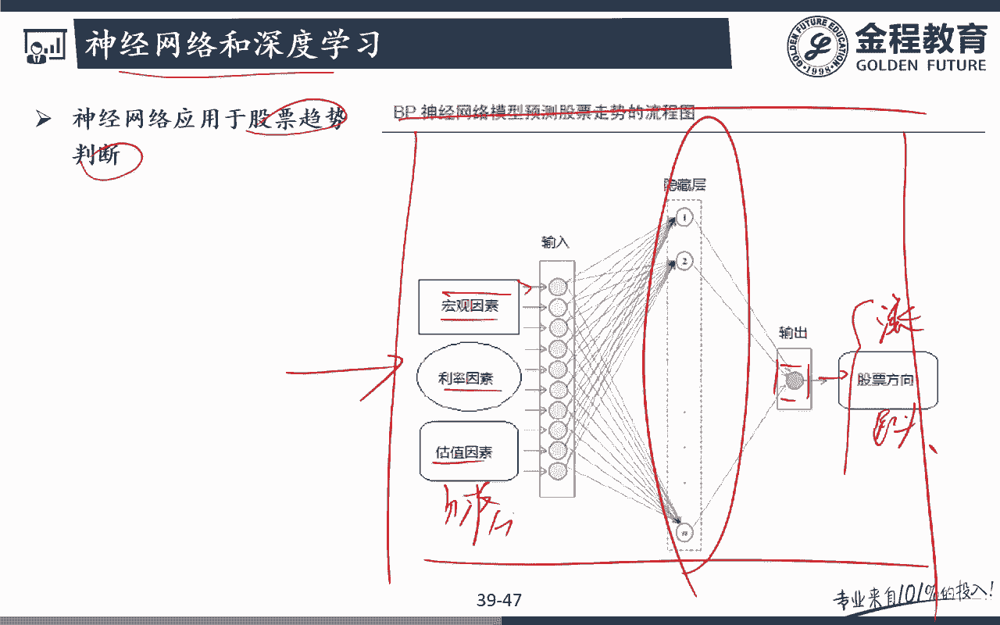
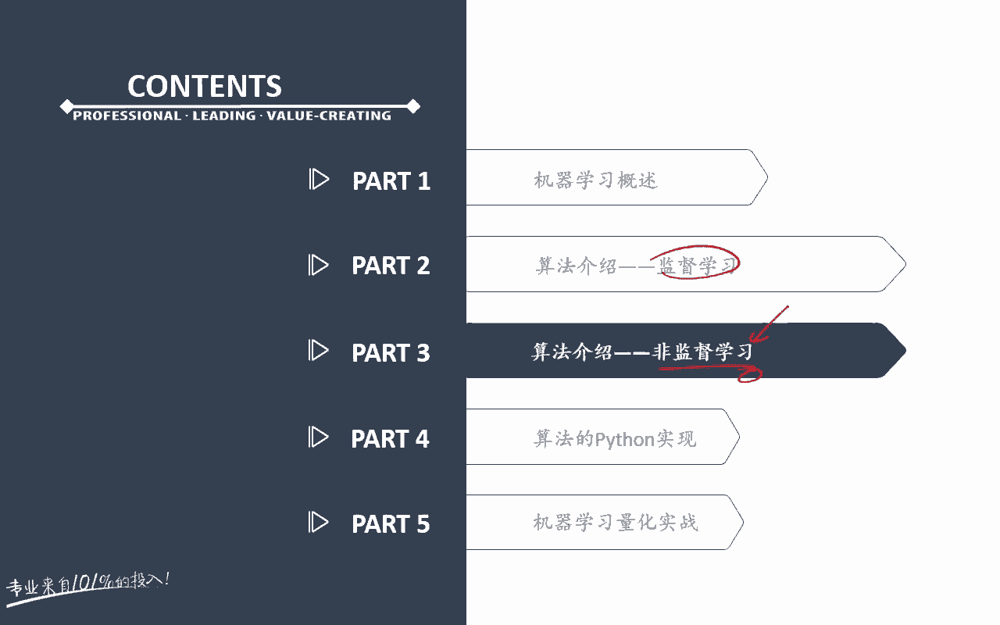

# 2024年金融大神老师讲解量化金融分析师.AQF—量化金融专业知识与实务 - P11：《+威❤hhh427501  了解获取全套课程》05.机器学习算法原理_5神经网络算法原理 - 量化沿前 - BV1oU411U7QM

好各位同学大家好，那么接下来的话呢我们要跟大家讲的是，目前我们机器学习领域，非常热的一款叫做神经网络对吧，哎呃包括这一里的一个深度学习，deep learning的一些内容啊，好那么对于我们来说啊。

这一块deep learning这一块的内容呢，它有它的一个特征对吧，就是呃包括像google的TENSFLOW啊，这一块，其实都属于这个领域范畴里面的一些东西了。

那么对于他嗯嗯对于这一块的内容来说的话呢，呃目前确实是属于大家的一个研究的一个前沿，演习和研究的一个重点，呃，因为这个deep learning这神经网络，其实概念提出来挺早的啊。

但是呃比较早的那些年份的时候的话呢，收益至于计算力对吧，受制于我们的一些技术，硬件方面的一些问题呢，其实很多呃地方呃，我们的这个研究开展就不是特别方便啊，但是随着尽量来计算力的这样一个。

大幅的一个提升啊，使得我们这里的神经网络啊，deep learning的一些东西可以有它的一个地方，可以去施展它的一个呃能力对吧，所以对我们来说，deep learning的话呢。

现在目前的一个领域的话，应用的是非常非常广泛，而且他的效果也非常非常好啊，因为我们之前跟大家讲过SBM对吧，也就是在其实在deep learning这一块火起来之前，其实最大家用的最多的。

也是最受欢迎的一个算法，其实是很多人会选这个SVM对吧，但是的话呢deep learning这一块内容出来了之后，我们会发现它可以呃非常好的去拟合，一些非常复杂的一些问题，最终的话呢它的效果都非常好。

所以呢目前大家又把大量的一个精力研发的，这样一个投入都投到了我这里的deep learning这一块啊，呃神经网络好，那么我们一起来看一下，这一块到底是什么样的一个过程呢，其实对我们来说，他神经网络。

其实说白了他就说模拟人的大脑的一个，什么结构哎，通过这种神经元，一个一个神经元的大脑感受到感知，这样的一个反应来去进行这样一个处理，因为我们发现，其实人脑对一些事情的一个啧判断，包括图像识别啊。

语音识别，它其实它的效果都是非常非常呃，我们都是非常非常快的，所以呢对于我们来说的话呢，这一块内容我们一起来看一下啊，它里面的一个结构，也就是说大家来看啊，人的大脑，它是一个由860亿个神经元组成的。

这样一个巨型的一个神经网络，对吧好，那么一般来说啊，这个神经元存在两种状态，一种叫做兴奋，还有一个呢叫做呃抑制对吧，那么绝大多数情况下啊，绝大多数的神经元是处于抑制状态的。

那么一旦啊每某个神经元上的这个树突，就是这里的出它它出来的这些东西啊，树突它受到上一个感受器或者神经元，传来的一个刺激的话呢，他的电位就会超过一定的阈值，完了之后呢，这个神经元就会被激活。

处于一个什么兴奋状态，也就是说在这个里面，比如说他接收到了一个电信号对吧，那么这个nuclear这个神经元呃，他会进行一定的处理和反应，完了之后的话呢，它会传递给怎么样下一个这样的一个神经元。

所以呢对我们来说的话呢，我们这个里面啊我们深度学习神经网络，它就是想去模拟我们这个人脑去处理信号啊，我们能这么快的去识别图像啊，识别声音的这样一个呃功能啊，好我们一起可以来看一下，对我们来说。

这是一个单个神经元的这样的一个结构啊，呃在这个里面的话，我们可以看到X1X2X3X4对吧，这其实是我们的这样一个特征信息特征向量，也就是说所谓的这些input或者说futures对吧。

唉这些是我们的一些具体的一些输入过程，好完了之后的话呢，他会这里有CA1，C塔二，C塔三，C塔四，这些的话呢其实是我们的一定的权重，每一个输入信息的一个权重，好通过这个HXHX是一个什么东西呢。

哎是一个转换函数，或者在我们这个里面叫做激活函数对吧，唉通过这个非线性的HCTX这个激活函数呃，相当于就相当啊模拟了人脑啊，就相当于把这个神经也把他给激活了对吧，所以这是在这个原因的话呢。

呃我们把它叫做activation function，就是叫做激活函数对吧好，那么这个激活函数的话呢，用的比较多的是哪一个呢，就我们之前跟大家讲过啊。

我们logistic regression里面的这个激活函数，还记得吧，GC等于什么东西啊，I等于一加上我这里的E的什么哎负C次方呃，所以呢动麻说我神经网络其实很多啊，他是他的这个激活函数。

用的就是我们之前跟大家讲的，这个logistic regression里面的这个激活函数，那么通过这样的话，那相当于是一个树，这里的feature simple，是不是树突接收到我的一个信息啊，对吧好。

然后呢，通过这个进呃，激活函数的这样的一个非线性的一个转换，就可以得到我们的一个怎么样，最终的一个future对吧，而最终的一个labor，比如说是涨还是什么跌对吧，哎这个其实对于我们来说的话呢。

它只是怎么样单层神经网络啊，那对于我们来说的话呢，我们可以去怎么样哎呃弄非常各种各样的input，我还可以弄成好多个层来对吧，那么到买车的话，那我们就可以去啊，你和现实生活当中更复杂的一些情况。

比如说我们在这个里面我们来看啊，这个里面有一个input layer，就是我们的一个什么输入层，好完了之后的话呢，在这个里面有一个什么层啊，哎隐藏层hidden layer。

那么HINDERER要注意啊，每一个这个神经元这里，它其实都有这样一个怎么激活函数，那么这个激活函数的话呢，它相当于是可以进行一定的，怎么样非线性的这种转化，对不对，哎所以对马说的话呢。

这样的话我们就会发现呃我这里的输入层，最终到我的输出层，output输出层这里啊，我们还有一个呃hidden layer，这个handle layer里面，我们就可以进行各种各样的一个处理，对不对。

而且呢有些复杂的一些神经网络的话呢，我这里的handle layer可以有怎么样好几层，也就是input layer之后，我要经过多重的怎么样hidden layer的一个处理。

最终才达到我这里的什么output这里呃，那么我们为什么说deep learning这个神经网络啊，这一块的内容的话嗯，效果很好呃，那其实对于我们来说，它就是有这样一个非常复杂的一个结构对吧。

神经网络的功能非常显强大，多层的神经网络，其实可以近似的拟合任何一个函数，也就是说不管现实生活当中的什么样一个情况，额我只要我的层数足够多，那么我这里的拟合的效果就会越好。

那么它基本上可以拟合出我们现实生活当中的，任何人这样一个函数好，那么对于我们来说的话呢，嗯这个deep learning啊确实啊我们自己试过以后，我们就会发现他的预测一些事情，真的预测的非常非常准。

但是呢他在现实生活当中应受到那个限制，就在于哪里呢，就是因为它太复杂了，基本上他一个运作的过程还相当于是一个什么，唉黑箱的一个活呃，过程对吧，也就是说简单的一层，我们还可以大致可以看出来啊。

但是如果说我们这个里面的隐藏层，有好几层的话呢，那其实对于我们来说，从你这里的输入层到这里的输出层，经过了好几层的这样一个隐藏层的一个变化，最终的话你这里的输入跟输出的这个关系。

其实你压根自己都不知道了，所以呢对我们来说嗯，这也是为什么像类似于神经网络，深度学习在这一块呃，在我们的这个呃学习呃，在我们的量化投资领域啊，这个用的还比较少的一个原因呃，也不是说比较少吧。

反正有一定的局限性的一个原因，就在于我一个输入和我输出之间的关系，到底这个输入跟我这里的输出的关系之间，是什么样的一个关系，我通过修改input到底怎么能影响我的output，我是不知道的。

能理解意思吧，所以整个的过程当中，其实只要你的层数足够多，它完全就是一个黑箱的一个过程啊，而且的话呢嗯啧额他就不像SBM这种呃，类似于线性分类的这样一些算法，那对我们来说。

我们可以非常明很清楚地知道我input，或者跟我output之间的这样一个关系对吧，我们是一个存在这样一个线性的一个关系，但是呢对我这里的神经网络的话呢，这一块的内容的话，我们只能到作为一个黑箱去看。

而且对我们来说呃，因为神经网络大嗯，不知道有没有这样呃了解一下啊，比如说对我们来说，神经网络它其实会有一个前向传播，前向传播的话呢，它其实刚开始去进行预算的时候，这里的前面的那些权重啊，他都是随机的。

随机的话呢会给每一个神经元之间，都会随机匹配一个权重好，然后呢经过这里的呃，隐藏层里面，非常复杂的一些非线性的一个变化之后，我们会产生一个output，完了之后产生了这个output之后。

我们就会去跟我们真实的这个target，真实的这个目标是吧，我们可以去进行一个对比，看看我的产出的这个output的，跟我这里所谓的这个目标是否匹配的，结果是否呃拟合的情况是否好，如果不好的话。

那它还会有一个什么嗯，哎他还会有一个反向的一个传播，那么反向的这个传播主要就是在干嘛呢，就是相比较于我的目标，跟我的这个呃output之间到底差在哪里，然后呢通过反向传播出去可以去干嘛呢。

去更新我这些神经元上的这些权重，去更新我的这个权重，那么这个更新怎么去权重，怎么去更新呢，我要一层一层的去做啊，比如说有了output之后，我要先知道output对上一层。

这个这一层的hen layer之间的一个影响对吧，我可能要求去去求一些偏导啊，那么这呃垂线偏导数等等，那对于我们来说的话呢，这一块的内容的话呃好几层的处理一层还好啊，如果说你先求一层再求下一层再求下。

有好几层的话，最终呃你的目标跟对你的input这个影响，其实完全就压根没法去计算出来了对吧，或者说呃就算能计算，也就停留在我们的电脑端，其实对我们自己直观的来看的话呢。

其实你压根就不知道具体的一个影响是什么，所以呢这个就在我们量化投资领域会受到额，会有碰到这样一个困境，什么样的困境呢，我呢在回测的时候用了这个呃，比如说我弹词flow。

或者说我的深度学习的这样的一个策略对吧，好在回测的时候策略非常非常好，所以呢我就把这个策略拿去怎么用，是用于实盘了，好用于实盘的时候，第一呃这个比如说第一天下来诶，站起来我很开心对吧，我继续会用下去。

但是第二天亏钱了，哎你现在就纠结了，或者第三天的，或者前一周吧，前一周前五天我们都赚钱了，下面一周第六天的时候我亏钱了，那这个时候你就会陷入到无比纠结的一个地方，去亏钱了，面临着一个非常现实的一个问题。

我这个模型还要不要用，对不对，哎那对我们来说额，你可能想哎前五天都是赚的对吧，那么第六天虽然亏了，第七天我也接着用呗，那我第七天万一又亏钱了，那你还用不用，那这个时候。

其实我知道我最终因为都这个deep learning啊，很像一个很像对吧，最终我只能知道我这个结果，今天我是赚钱了还是亏钱了，那赚钱哪里地方赚的好，我不知道亏钱了呢，哪些地方我要做进行调整。

其实我也不知道，因为这里面的一些计算量啊，它其实真的非常非常复杂，所以多玛来说，其实我没有办法去修改我这些input，来去给我提升，我这里的output，也就是说我拿这个模型。

其实压根没有太多的一个办法，所以呢我只能听天由命对吧，呃，这个呢，就纯粹看你的一个内心的强大程度了对吧，比如说前三天，前五天我是赚钱的，后一个周呢我全都是亏钱的，完了之后呢。

再下一周我可能就这个模型我就不用了，完了之后呢，再下一周可能我这个模型又能赚很多钱，所以呢对我们来说这个呃继续学起来，特别是我这一块神经网络男呃，呃net network。

包括我这里的deep learning这一块啊，这实在是呃有些复杂，所以呢对我们来说呃，大家如果呃以后在实务当中啊，想要用这一方面的这个策略的话呢，其实它背后的一个嗯运用的时候，这样的一个困境啊。

我相信大家应该都能去，就会以后自己如果真的要用这一块啊，就可能会有这样一个感觉，那么对外码来说的话呢，这一块确实有一些抽象啊，所以我本来就不想讲了，但是我觉得呢这一块是目前最火的一块领域啊。

所以呢它的背后的一个原理，我们尝试着来跟大家讲一下啊，呃大家看吧，反正我觉得这一块确实有点嗯虚无缥缈了，大家大家在做的时候，很多都是拿着黑箱，确实效果非常不错啊，啊像我们这里的探索flow啊。

或者说一些deep learning的其他的一些框架做出来，拟合出来的效果确实非常不错，但是就往往遇到的一个问题，就是万一这一天哪一天我这个模型不能用了，我压根可能连修改的一些地方我都不知道，对不对。

哎那么呃接下来的话呢，我在这里手绘了这个确实非常难讲啊，这个呃机器学习里面的这些概念，所以我后面手绘了一些呃这个图啊，当然画的也是非常粗糙了，尽我尽量去用一个最简单的一个语言啊。

带着大家把这个神经网络背后的一些思想，来去跟大家去讲一下，那么在这一块内容的话呢，这个大家就看了啊，就随缘了啊，听得懂听听不懂的话呢，就大概知道一下，因为反正你听懂了，你真真正在用的时候。

这这这哥们这东西也是一个黑，近似于黑箱的一个东西，对吧好，那么我们来看一下呃，在这个里面的话呢，嗯我们要解决还是一样，比如说我们可以拿神经网络去解决一个，分类的一个问题。

或者说去判断我将来股票市场是涨还是跌，对吧好，那么呃在我们这个里面，我们就拿这个简单的这个分类问题来去做啊，大家来看这里，我有这样一个数据集，这个数据集的话呢有两块各分类，一个是红色的，一个是蓝色的。

对吧好，那么我们会发现，其实如果我们想把这块蓝色的这一块分成类，分出来的话呢，它其实要用到的是我们这个紫色的这样一个，决策边界对吧，它其实是一个非线性的一个关系啊，因为如果我拿线性关系的话呢。

呃线性的这条线其实我是画不出来呃，把这个这一块内容把它给拟合出来的，对不对，唉好那么这个时候的话呢我可以怎么办呢，这个时候啊我们就可以呃，借助我这里的neural network对吧。

哎神经网络的一些内容，一些方法来去看啊，那么简单来看一下这个，虽然啊我们通过一个线性关系，我们无法找到这条线对吧，我们至少要找到我在我们这个里面，我们是用绿色的这条线条画出来的。

这两条线至少要有这两条线，我才能把这个蓝色这个圈圈的里面的分类，把它给分出来，对不对好，那么这个时候咱可以怎么办呢，注意啊，我们可以这么做，也就是说呃呃大家看啊，接下来这个图我都简化了。

因为在这个里面我找了非常多的一个点啊，但是因为后面如果每张图都画这么多个点，就疯掉了对吧，所以我后面的每一张图都是简化了，你看啊，相当于就这一块这四个蓝色的点，就相当于对应的我这里的这个蓝色的点。

我就不会，我没有画成像这样更接近一个实际情况，我这里就是用讲几个12个点去拟呃，去模拟我这里的一个情况，没题吧，哎大家能看明白就好了啊，不用太去追求它这个画的好看是不好看啊。

那么我们尽量用最简单的这个话，来去帮助大家去理解这个神经网络啊，所以也就是说，如果我们想把这一块蓝色的部分，把它给切出来的话，必须是哎必须需要使用切到两刀才行，对不对好，那么我们可以来看啊。

我们把这块分解开来来看，也就是说我要把这块蓝色的呃，这四个图形把它给切出来的话，首先我要得横着这样去切一刀吧，完了之后呢，我得竖着这样去切一刀，完了之后呢，我可以把上下两个节点上的那个东西啊。

进行一定呢，怎么样有机组合，是不是就可以变成最终我这样的一个结果，对吧好，那么变成这个结果之后的话呢，我们会发现诶，这一块我们是不是就把它给额绿色的这一条，这四个蓝色这四个点，我们是不是把它给切出来了。

对吧好，那么具体在切的过程当中，我们是怎么去进行切的呢，还用到的是注意啊，跟我们逻辑回归里面一样的这个思想，我们大家来看一下，也就是说在我们这个里面，我们可以把我们的图形分成蓝和额红啊。

比如说这里是red，那么这里就可以是什么blue，对吧好，那么在我们这个里面，比如说我们可以任意的找到每一个点，比如说这个蓝色的点，它是蓝色的这样一个概率，那么之前是不是在讲逻辑回归的时候。

是跟大家讲过这样的一个思想了，对吧，好比如说你是蓝色的，又在离我蓝色很近的这个地方，那么这个时候我们认为怎么样，你是蓝色的，概率是不是接近了九十二零。9%，那么同样的道理，在下面这种情况下。

如果我是这么切的话呢，怎么样呃，我是竖着切来去切一刀的话呢，在这个里面这个蓝色的点是我蓝色这个概率，那么可能是怎么0。8也就是80%，没问题吧，好，那么我们把这两个上下两个节点。

不同的切法结合在一起的时候，大家就会发现我这一个蓝色的这个点，在我是我蓝色的blue的这个概率是多少，唉其实我们呃如果认为是这一块的话呢，其实简单来看啊，我们可以认为这两块的概率相加，0。9+0。

8是不是可以等于多少，哎，是不是可以等于是1。7啊，对吧哎所以呃但是呢注意啊，1。7超过一了对吧，显然就不是一个怎么样概率的了，对不对好，那么我们怎么样再把它变成一个呃，零一之间的一个概率呢。

用一个什么方法哎，用我们之前跟大家讲的那个什么SIG格，MOID的函数还有印象吗，就是前面跟大家讲的那个几C几Z等于什么，一加上我一额一除以E的什么负的C次方额，我们这个通过这个转换函数。

或者说在我们额神经网络里面的话呢，他就嗯叫做activation对吧，我们把做激活函数，通过这个激活函数的一个转换，我们就可以把它转换成零一之间的，这样一个概率了，对不对，好，那么在我们这个里面。

我们随便说的啊，我都是拍脑袋想的啊，这里变成1。7之后，在这个里面其实呃总的来说，我可以通过那个sigma的函数，把这个1。7这个数字转换成我们这里对应的，零一之间的一个数字，对吧好。

那么转化出来的这个概率是多少呢，0。89没问题吧，也就是说我们把上面这个节点跟下面这个节点，这两种情况结合在一起，那么这种分类的里面呃，这种切两刀之后的分类的这个结果里面啊，那么这个绿色呃。

绿色打框框的这一个蓝色的这个圈圈，是我蓝色的概率是不是达到了0。89啊对吧，哎所以注意啊，这个0。89是怎么算出来的，我是怎么样通过一个sigma的函数式转换，得过来的，对吧哎好那么我们接着进一步来看。

对我们来说，我们可以进行一个更复杂的，也就是说上下这两个节点其实怎么样，我不一定像上面的话呢，都是50%，50%的一个情况对吧，哎他的权重都是50%，但是对于我们来说的话呢。

我可能怎么上面和下面的一个权重，可能并不是50%，或者说在它前面，在上面和下面这两个节点之间，我是不是可以乘以一个系数啊，比如说上面这个我乘一个六，下面这个我乘以一个三，那么对于我们来说的话呢。

其实我们就会发现呃，如果上面这个系数是六，下面这个系数是三的话呢，最终的话呢我们就会变成了这样一个结果，也就是上面这个蓝色的是节点，是蓝色的概率是0。9，下面这个节点呢是我蓝色的概率。

前面就是不是是怎么样，0。8好，那么我们可以通过网前设制定一些呃，这样的一些细数的话，我们就会发现，在我们整个拟合出来的这样一个额，这咳咳，这个两条线结合在一起的，这一个概率就变成多少。

原来我是直接是0。9加，怎么0。8等于1。7对吧好，现在的话呢，可能我就要经过怎么样，前面的一个系数的一个调整，我可能算这个呃，蓝色是蓝色的概率的时候，我要怎么样拿六，这个也就是前面我们乘的这个系数。

先乘以0。9，再加上三乘，以我这里的概率0。8，为什么后面还要减一个五啊，因为我们知道线性函数的话，它可能会有一个这样的一个位移对吧，就是我们的那个intercept，就是呃我们的一个截距。

所以呢这里我都是这里的，所有的数字我都是随便说的啊，这里前嗯减6-7减八也好，都无所谓啊，Whatever，那么在这里的话呢，我们就可以算出来呃，对于我们来说，最终的这个数字是多少呢，是2。8好。

还是那句话啊，2。8是不是我们的概率啊，不是我们的一个概率，那么怎么把这个2。8，转换成我们一个对应的一个概率啊，还是用的是我们的那个什么哎，在logistic呃。

regression里面学到的这个激活函数，那么通过这个GC的这个激活函数的话呢，我们就可以把这个2。8，转换成我们这里的对应的一个概率对吧，比如说这个对应的概率转化出来是个上单，0。92。

潘达都在说的啊，转化出来的这个概率是怎么样，0。9啊，能理解意思吧，好那么看到这里的话呢，其实我们这个单个神经元的这个结构啊，就已经有点出来了，大家有没有发现这样一个问题啊。

也就是说上面这个节点我给你的系数是多少六，下面这个节点呢我给你的系数是多少三，那么每个节点上的这个点是不是这个点的，这个概率是多少，0。90。8我都是知道的，然后的话呢在呃组合出来的这一块。

线性的这个方程是吧，还可能加一个位移呃，位移偏移量对吧，所以呢在这个时候，我们就可以把这张图的这个一个神经元，我们就可以把它画出来了，也就是这里是一个input，这里是一个input。

这个input的话呢，这里是六系数，这里的系数是几呢，是三，然后呢根据一个位移是多少五好，完了之后，再根据我前面跟大家讲过的这个什么HCTX，这个什么，你可以用几Z来表示都可以啊，就通过这个什么激活。

通过这个激活函数，那么是不是就可以怎么样得出我们这样的一个，呃这个我们想求的这样一个输出的一个问题啊，对吧唉好，所以这个的话呢其实我们画的这一页，它其实就是一个单个的怎么样，神经元的这样一个概念，哎。

通过这张图，我们再把这个神经元的这个画出来的话，大家是不是可能会有点直观的一个感受啊，对吧好，那么我们再把它推广到一般啊，比如说在我们这个里面，这里有一个，这里呢也有一个，所以呢在这一刀切的时候的话呢。

我们可能不同的切法啊，那你看我先这里斜过来切一刀，这一刀的这个呃线性方程呢是多少，6X减3Y等于七，完之后呢我还可以注这注意啊，这些数字都是我自己瞎编的啊，完了之后我这里横着切一刀。

就变成了6X减8Y等于什么，一没问题吧，所以呢这个时候如果输入变量一个是X，一个是Y，那么这个时候跟我前面类似啊，我们会发现每一个这样的一个结果的话呢，呃都可以写成怎么样。

类似这样一个神经元的这样一个结构，对不对，好，那么我们就会发现在我们这个里面，其实XY这个输入变量和这个input，那这里对应的对应的是这里不是五啊，这里我写的是六对吧，这里是六，完了之后呢。

这里是三好，那么截距位移项是多少，七完了之后，下面这个节点呢也是输入X输入Y这一个是六，一个是八，我等于几呢，我这里的位移偏移，那是不是等于一呀，好那么这个之后的话呢。

我们再可以跟最前面的我们这个怎么样，也就是说这个这里的这个input可能是怎么样，之前已经有一个神经元给我们产生了一个output，来作为我们这个神经元，就是六三负五这个神经元的一个什么input。

没问题吧，因为我们知道啊，神经元和神经元之间呃，你的output，可能就是下一个神经元的一个什么input，这没地方哎，所以干嘛说这里的六，这里的三和这里的对应的这个五，这个神经元的input。

可能是从前面两个什么神经元给我传递过来的，对吧，哎所以呢比如说我们在这里又模拟出来了，前面我们可能还有两个怎么样神经元，所以呢我们把这两个神经元捏在一起，把XY这里是呃，我都写错了。

因为这里是全都应该是六，这里是六，这里是三，这里是七，同样的下面也是六，八和一，这两个是一个什么神经元，好完之后呢，这两个神经元是不是可能会有一个output啊，对吧。

哎这个output又可能是我们前前面怎么样，已经通过画图跟大家讲的，这个神经元的一个什么input吧，没问题吧，所以呢我的output可能就是你的怎么样input，所以呢在这个时候。

我们就可以把这个神经元和神经元，是不是捏在一起啊，那大家可以来看到原来注意啊，我输出的这个input，我这个input，他是在作为我下一个神经元的一个呃，就是前一个神经元的output。

作为下一个神经元的input，那么这两个神经元，我们是不是可以把它捏在一起了，所以呢我们这个时候就变成了这样的一个，捏在一起的这样一个结构，能理解意思吧，所以这里是XY，这里又是六负三，这里是六负八。

就相当于是六负三，六负八，这里是七，这里是一对吧，哎好完了之后呢，这个神经元的output又直接传递给了我前面画图，画出来的这个神经元，就传递到了神什么六三和什么哎负，那么大家会发现这个神经元的话呢。

其实跟我们前面看到的神经元，是不是已经有点像了，好那么我们再经过一定的处理，简化的一个操作，因为你的输入也是X嘛，我的输入也是X，你的输入也是X，我的输入也是X，这两个输入input的都是一样的。

所以我们可以其实就写成X和Y，因为我的input其实就这两个吧，好那么这个X的话呢，其实有两个地方我可以输入，所以一个变成到了多少，一个到七，他的这里的权重应该这里也是六，还有一个呢到了怎么样，哎。

还有一个是X到一对吧，那么这里的，额X到一，那么我们来看一下啊，这里的权重我们呃应该是这里应该不是七啊，这里应该是六，因为这里是六对吧，这里是八啊，好那么还有一个是YY呢，在这里一个是怎么三，一个是八。

这没问题吧，一个一个应该是哎应该是六，这里应该也是六对吧，哎所以多买说的话呢，经过这个权重的一个调整，那么相当于，我们可以把这两个神经元捏在一起好，最后一步的话那就没问题了，又是一个六，又是一个什么三。

最后的话我的位移的结局是不是还是五啊，好那么首先一个点啊，我们是怎么把这个给求出来的，这里的六三负五啊，还是那个在每一个节点上，其实我都用到了什么active，什么vision function。

我都用到了，前面跟大家讲的那个什么激活函数，相当于是把线性的一些东西通过这个激活函数，是不是进行了一定的一个转化对吧，唉好那么我们推广到更一般，那这里的XY就是我前面这两个输入啊。

input x和Y是不是就是我前面跟大家讲的呃，PPT里面的这个什么import，什么layer，没问题吧，好那么输入XY之后，我可以先切一刀，怎么样再切一刀，就是呃在我们这里我们可以先这里切一刀。

再这样子切一刀，这里切的这一刀的过程，其实就是我们这里的所谓的一个什么隐藏层啊，Hen layer，那么通过我这里切一刀，这里切一刀最终怎么样，我可以得到这样一个什么哎，呃这样一个output。

这个output的话呢，是我前面是不是就可以把这里怎么样，额这哎这里都是红色的点对吧，这里有这个红色的点，这里面的这两个点的话呢是怎么样，蓝色的就是我前面的那个图形啊，那么对于我们来说的话呢。

通过我的一个input，通过我handle layer的一个什么激活函数，的一个激活，激活函数的一个转换，最终我们是不是就可以实现到我这里的，怎么把这上面这个节点的影响和作用。

和我下面这个影响的节点的一个影响和作用，结合在一起，是不是就可以变成这个图形啊对吧，当然了，这里权重是六，这里权重是三，还有呢这个对应的一个截距是五，这些你都是可以通过我们前面的正向传播。

反向传播去更新啊，这些更新的算法都要求什么偏导啊，这些我们就不不管了，那么在我们这个里面，我们只是把一些呃背后的一个，核心的一个思想啊，讲的可能也不是特别严谨啊，但是呃。

我只就是想让大家就是直观的来了解一下吧，对吧哎，那么除了我这里的hen layer有一层以外，我这里的hen layer还可以有两层，比如说这个时候这个还是我们的input layer，对吧好。

那么首先来看，如果我们只有一层黑的layer的话，先横着切一刀，再竖着切一刀，我们是不是可以把这个前面的蓝色的那个，把它给画出来，对吧好，那么对我们来说，其实我们可以有两个hle layer。

也就是说通过不同的权重，我们是不是还可以画出另外一个图形啊对吧，这个图形上面那个权重就是所谓的六三的，这个权重可能画出来的是这个好，完完之后呢，我可能换一个权重，比如说五负三。

那么这个时候我画出来的这个图形，是不可能是这个完了之后呢，这两个是我们的一个什么，hen怎么样，Hen layer，那么隐藏层，通过这个隐藏层的转换，最终我的output，我的输出。

这咳咳我的output layer，我的输出层可以是一个奇奇怪怪的一个图形，对吧，哎所以这也是为什么我们前面跟大家讲啊，这个呃深度学习的这个嗯，神经网络的这个效果很好，它几乎可以是你和任何一个情况。

而且呃可以告诉大家一点，大家应该也能感直观的感觉到啊，我hen的layer越多，也就是我这里的隐藏层越多，我所能拟合的这个什么模型，这个数据的复杂程度是不是就越大对吧，哎同时呃有些比如说我们这些规律。

通过只有一层隐藏层，我们并不能很好的发现的话，你就多加几层吧，两层三层，四层五层你就往上加，那对我们来说，总有我可以把我这个数据，可以把它给分割出来的，哎但是它背后的一个原理，因为你四五层六层。

七层八层以后啊，你这个hand的layer，到底你最终的output，对我的这个input的影响到底是什么，哎这个我们已经很难再去知道了，对吧哎好那么这样的一个东西的话呢。

其实就是我们神经网络的一个非常呃，我最最最最简化的可能额不是特别严谨了，但是我觉得是相当于在每一个节点上，这一个图形是怎么出来的呀，哎我们要通过一个activation激活函数。

function这个激活函数呢，就是我们之前在怎么样，可以，可以是我们之前在logistic function里面学到的，这个sigma的函数，那么通过呃先切一刀再切一刀，然后呢通过我权重的一个控制。

和我的这个位移的一个控制，再经过一个呃，西格玛函数的一个这样一个，激活函数的一个转化，我就可以拟合出各种各样的一个图形，对吧，哎那么对我们来说，你可以先有一层呃隐藏层，再有一层隐藏层。

那么如果说你最终想拟合的这个数据，特别复杂的话，多加隐藏层是不是就可以了，对吧好啊，这一块我们尝试着跟大家去试图去讲了一下，这一块的内容，但是是这一块内容确实嗯有点小难啦。

那么如果大家之前没有接触到这一块的话，我讲的也特别累对吧，这呃也不知道大家听懂了没有啊，那这一块确实呃有点小难，那么没关系啊，这个听大概了解一下啊，有这么个东西对吧。

我们可以通过把两个这个神经元的一个解呃，输出作为下一个神经元的一个输入，然后呢可以通过隐藏层，然后把我input层的一些变量，通过一次一次的一个变化激活之后，最终我可以拟合出我想要的这样的一个什么。

output对吧，好这样这样一个过程就好啦，也不用特别纠结啊，那么对我们来说，其实呃真正正正嗯背后的这一块，真的就是呃还是确实非常复杂的了，所以也不用特别纠结啊，那么但是呢现在的话呢我们会发现嗯。

运用的一个场景啊是非常多的对吧，比如说我们的一个无人驾驶，那你看在这个里面，它的input layer，有非常非常多的一个输入变量对吧，那么它的hidden layer。

你看你看他的一个隐藏层有65个呃，所以对我们来说的话呢，它的六六十五个这样的一个units，完了之后的话呢，它最终的一个嗯output的话呢，最终因为是无人驾驶汽车嘛，所以呢就是你要告诉我们的啊。

汽车我应该怎么走对吧，往直行倒车，往前走，往后走对吧，哎这个呃，它其实也是有通过这种神经网络这一块，来去处理的，包括，那么如果说我们要拿来去预测股票的一个，价格趋势的话呢。

那等完说我这里的输入层可以是一个什么唉，宏观因素，利率因素，估值因素等等，或者说财务因素都可以，完了之后，能通过我个呃这个隐藏层的各种方的一个处理，最终我可以有一个output，这个output。

比如说这是我骨架的一个方向，我们是会涨还是会怎么样，唉点能理解意思吧，唉大概能知道这样一个结构啊就好了啊，这是一个神经网络，去预测股价的一个这样一个流程图。

好，那么讲到这里的话呢，监督学习的一个算法啊，基本上就跟大家讲完了，那么我们讲完额，我们接着下面这个下面课程的话呢，我们会跟大家去介绍。

