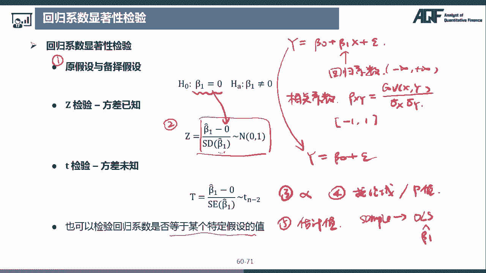

# 2024年金融大神老师讲解量化金融分析师.AQF—量化金融基础知识（完整版课程） - P7：《+威❤hhh427501  了解获取全套课程》07.数量分析-07_线性回归分析1 - 量化沿前 - BV1ar421K7Mo

好那最后一节是线性回归分析，那回归分析其实就是研究变量之间的相关关系。

那那有一些变量之间的关系是确定性的，也就是一个确定关系，那什么是一个确定关系呢，比如说嗯圆的半径和圆的面积，那我们知道圆的面积S等于派R的平方对吧，那这个关系其实就是一个确定性的函数关系。

也就是这个面积S和这个半径，R是一个确定的关系，我们知道了R是多少呢，我们就可以算出它的面积，那还有一些变量之间没有像这种确定性的关系，但是存在相关关系，比如说最简单的我们认为身高，和体重。

是成一个正相关的关系，那这个关系肯定不是一个确定关系对吧，因为并不是说某个人身高是多少，他体重就一定是多少，并不是一个一一对应的关系，但是如果我们取很多观测值来看的话，那我们会发现一般来说身高比较高的。

体重也会比较重，那回归分析的话，也就是研究的这个变量之间的相关关系，那这个是我们回归分析研究的问题，注意一下，我们研究的是相关关系，不是因果关系，那这个是很多同学在初学的时候，容易理解错误的。

比如说有的人嗯做了一个回归分析，发现股价和降雨量存在相关关系，但这两者存在因果关系吗，并不存在因果关系好，那回归分析方法呢，是在非常多领域都有非常广泛的应用，比如说在量化投资领域。

一个非常常用的也是一个主流的模型，就是多因子模型，那在多因子模型中检验因因子有效性，一个非常常用的方法就是用回归法，那这个我们是怎么做的呢，那我们是首先收集了所有股票，每一期的个股收益。

而同时我们也收集了前一期，所有股票的因子值X那这个R呢是呃个股收益，然后X是因子值，因为我们是收集了所有所有这个股票池的股票，那么我们是不是有这个R1R2R一直到RN，同时对应的X1X2到XN。

然后呢我们把这个个股收益和因子值做个回归，比如说我们回归出来是R等于A加BX，那如果说回归系数这个B是显著的话，那么我们就说这个因子是有效的，那为什么是有效的呢，如果B是大于零的话。

是不是说明这个因子值越大，那么这个R也就是它的收益越高，那如果说B小于零的话，那是不是说明X值越小，嗯这个收益越高啊，那如果说这个B不显著的话，那不显著的意思就是X其实对R的影响很小。

那不管X这个因子值怎么变的话，对这个个股收益影响并不是很大，那说明这个因子值是不是对它的这个收益呃，参考性比较低，嗯好那这个是检验多因呃，检验因子有效性的一个方法，那这个是多因子策略。

那还有比如说配对交易，在配对交易中，我们是不是通过两个相关性非常高的股票，那比如说呃从历史数据来看这个Y的价格啊，从历史数据来看，它的呃价格是X的1。5倍，也就是说正常情况下它的价格是1。5倍。

但是说如果这两个股票之间的价格，脱离了这个关系，比如说现在Y的价格哎变成了X的两倍，那是不是说明Y的价格相对于X的价格来说，更贵了呀，也就是Y更贵了对吧，那X是不是相对于Y就比较便宜。

那这时候我们就买低卖高，什么低啊，XD对吧，YY高，那就是买X卖Y，然后等到他们这样的一个呃，价格关系又回到了历史正常水平的时候，我们再做反向操作，也就是我们再把这个X卖掉，把Y买回来好。

那这个里面用到的这个Y等于1。5，X这样的一个关系式，其实就是我们通过历史数据的回归得到的，啊那线性回归的话其实是最简单最直观，也是最常用的一种回归方法，那这里呢我们一般把就是我们把想要解释或者。

预测的变量叫做因变量Y，这个是我们想要解释，或者说想要预测的一个变量，那我们可以控制或者说用来解释的变量，叫做自变量X，那如果说我们自变量只有一个的话，那就叫做一元线性回归。

那如果说我们自变量X是有多个，就X1X2到XN的话，那这个就是叫做多元线性回归，那我们首先考虑一个最简单的一元线性回归，也就是只有一个自变量的时候，那么考虑一个非常非常老套的问题。

就是工资水平和和工作年限之间的关系，那我把工资水平作为因变量Y，工作年限作为自变量X，那按照我们常理来想的话，工作年限和工资水平是不是应该是正相关的呀，你工作时间越长的话，你这个工资是不是会更高。

所以我们可以写出来一个关系式，Y等于贝塔零加上贝塔1X，那这个是什么意思呢，是不是说呃当这个工作年限X是零的时候，也就是说我们刚刚开始工作的时候，我们这个开始工作的呃，薪水是不是这个贝塔林啊。

那随着我们工作年限增加，那我们每增加一年，也就X每增加一，那这个Y是不是增加贝塔一，所以说这里面的呃贝塔零呢，就相当于一个初始的工资工资水平，贝塔一呢也就是说我们每多工作一年，我们的工资水平上升多少好。

但是我们这个关系式是不是有点问题啊，因为我们这个写出来的其实是一个函数关系，也就是Y和X和Y是一一对应的对吧，因为我们只要把一个X带进去算的话，我们就可以算出来唯一的一个Y值。

但是我们研究的这个工资水平和工作年限，并不是一一对应呃这样的一个函数关系，因为嗯比如说有的人，一一这个一毕业就工资就二三十万，那有的人可能要工作几年才能达到这样的水平。

所以工作年限和工资水平不是一一对应的关系，那是一个相关关系，所以这个柿子的话呃，严格来说是不准确的，那最准确的写法应该是什么样子的呢，应该是EYXI等于贝塔零加上贝塔1xi，那这个式子是什么意思呢。

这个式子是说工资水平的条件，期望和工作年限成函数关系，那我们在图上给大家画一下就很清楚了，比如说我们把这个画在一个呃一个坐标轴，然后我们把工资放在Y轴，这个是工资Y轴。

然后工作年限就是嗯工作年限放在X轴，那我们工作的年限可能是工作了一年啊，两年啊，一直一直呃工作30年，这样子对吧，那对于每一个工作年限，每一个人的工资是不一样的，比如说这个工作年限是X。

那这个工资可能是这样的一个范围，就有的人最低的可能工资是拿到这里，然后最高的话可以达到这个位置，然后工作年限是等于二的时候，那可能这个工资是呈现一个这样的状态，也就是说最低的在这儿，然后最高的在这儿。

哎然后我们后面这个34567也是一样的，那我们把所有的这个数据全部都取出来，这样子画，那什么叫EYXI呢，这个也就是说在特定的一个X上的Y的期望，比如说XI是等于一的时候，我们Y的期望可能是在这个地方。

然后X是等于二的时候，我们Y的期望是这个地方，然后我们把这个所有Y的期望连接起来，诶，那这个的话，那这条线就是我们这里写的这个函数关系式，那在线性回归模型中，这个函数关系就是一个线性关系。

那这个函数呢是叫做总体回归函数，也就是说我们把总体所有的数据呃，都搜集过来的话，我们就可以得到这样的一个关系式，那对于每一个个体而言，比如说我们对于这个呃这样的一个点而言，这样的一个个体而言。

那他的那这个点，是不是并不在这个总体回归函数这条线上，那它和这个总体回归函数这条线中间的距离呢，就是用一个随机误差嗯，absent i来表示，所以对于每一个个体而言的话。

这个xi yi的关系式可以写成YI等于贝塔零，加上贝塔1XI加上ABSOLUI，那对于每一个个体来说，这个ABSOLUI是不一样的，好那这个是总体回归函数，那总体回归函数反映的就是。

假如这个Y和X中间是存在相关关系的话，那总体回归函数反映的就是它们之间的，那个真实的关系，就是站在上帝视角来看的这个关系，但是我们不是上帝，我们没有办法知道这个真实的关系关系。

所以我们只能从样本中对这个总体来进行推断，好那接下来的话我们就是要取一个样本嗯，对总体进行推断，那我们换一个颜色，比如说我们取了一个样本，那我们在这个坐标轴上，也把这些样本点标注出来。

假设我们取到的观测值是这些，那这些这里面每一个这个观测值就是对应的，我们观测到的某一个人的工作年限，比如说他的工作年限是这么长，然后我们他的工资是这么多，这个是我们观测到的好。

那我们这个把所有观测到的点，画在这个呃坐标轴上，那这样的一个图形其实就是叫做散点图，那根据这些观测点，我们可以确定一条最优的直线，可以尽可能的穿过这些点，比如说我们找到了嗯这样的一条直线好。

这样的一条直线，是能够最大程度地穿过我们所有的观测点，那这条直线呢就是叫做样本回归线，它对应的就是样本回归函数，y i hat等于贝塔0hat，加上一个贝塔1hat xi好。

那这里的贝塔0hat和贝塔1hat，就是决定我们这条线的形状，那贝塔0hat就是决定这条线的这个截距，然后贝塔1hat就是决定这条线的斜率，那和这个总体回归函数肯定是不一样的对吧。

然后这个xi的话就是工作年限，这个yi hat呢就是我们根据这个样本回归函数，这个是样本回归函数，预测出来的一个工资水平，也就是说这个样本回归线上的值呢是xi和YI，Had，那对于每一个观测值来说。

并不是一定在这条直线上的，对不对，那对于每一个观测点YI来说，它就等于贝塔0hat加上贝塔1hat xi，再加上一个随机误差，在这里的话，我们为了和上面区分，我们把它叫做absolui had。

我们加上一个had好，那比如说还是这个点，那这个观测值距离样本呃，这个样本回归线它的距离呢叫做absnoi hat，那这里的话这个why i had，就是这个e y xi的估计量。

贝塔0hat就是贝塔零的估计量，贝塔1ht就是贝塔一的估计量，好我们来看一下PPT上，那这个第一页呢，就是总体回归函数和样本回归函数，那总体回归函数就是这个呃，E y xi。

这个条件期望是等于贝塔零加上贝塔1xi，那这个总体回归函数也就是真实的这个关系，也就X和Y之间真实的关系，但是这个关系呢我们是无法知道，只有上帝知道好，那对于任何一个观测点。

有YI等于贝塔零加上贝塔1xi加上普SONALI，那这个ABSNOI，其实就是每一个观测值和这个条件期望，之间的差值，那因为我们是无法知道这个总体回归函数的，我们只可以抽取样本来额进行估计。

那我们估计出来的这个函数呢，就叫做样本回归函数，也就是我们通过样本点回归出来的函数，那这个呢是我们做回归出来的，那这里y had是EYXI的估计量，然后贝塔零，贝塔1had分别是贝塔零和贝塔一的估计量。

对于任意和一个观测点，有YI等于贝塔0H的加上贝塔1h xi，加上absent i had，那这个absence i had，就是每一个观测点和样本回归线之间的距离，那我们看这个图。

这个红色的这条线呢是这个回归的线啊，这个是样本样本回归线，然后上面这个呢是总体回归线，那对于任何一个观测值来说，它和总体回归线之间的距离是ABSOLUI。

和样本回归线之间的距离是absolo i had好，那现在我们是不是问题，就是如何确定这样的一个样本回归线呀，我们刚刚说是要确定一条直线，能够尽可能的穿过所有点，那什么叫做尽可能的穿过所有点呢。

那一种非常常用的方法就是最小二乘法，那它的核心思想就是说使得误差的平方和最小，也就是这条直线，这条红色的直线离所有的这些样本点最接近，那最接近的话，是不是要使得这个嗯absent i had要小。

那因为我们要使得所有的点都要小的话，我们是不是要做一个求和，那为什么不能直接这样求和呢，那我们注意到这里面有的有的这个呃，呃absent i had是不是正的，有的是负的呀，那在这个直线下面的话。

是不是他的这个absent i had，就是一个负负值负数，然后在上面的话，这个X算是一个正数，那如果说我们直接把它相加的话，那正负不是抵消了吗，所以这样呃，所以直接相加是不行的。

那我们还有一种方法就是用绝对值嘛，那绝对值是不是也可以衡量距离，那我们可以把这个epsnoi had的绝对值加走，使得它最小，那也是OK的，但是这种方法呢计算起来非常麻烦。

因为我们在去掉这个绝对值的时候，我们到底要不要在前面加负号，这是一个很头疼的问题，就是额计算非常麻烦，所以我们就使用另外一种方法，就是把它做平方，也就是用这个嗯ABABSENT。

i hat的平方进行一个加走，使得这个值最小好，那这个的话就是最小二乘法的思想，好我们来看一下最小二乘法，那普通最小二乘法也叫OL，那大家看到这个OLLS的话，应该是非常非常常见的。

大家还是要把这个呃熟悉一下，那它就是意思就是普通最小二乘法，那这种算法呢就是使得样本回归方程中，残差平方和最小残差的平方和，也就是最小化，absent i hat的平方，那我们如何使得这个最小呢。

我们是不是调整这个线，我们是不是要调整这一条样本回归线的位置啊，那我们可以把它唉放到这样子一个程度，或者说我们这样的一条线，那我们怎么调整这条线的这个斜度，斜率和位置呢。

那是不是调节这个贝塔0hat和贝塔1hat呀，所以说我们这里的话就是通过调整贝塔0hat，和贝塔1hat，使得abs snoi hat的平方和最小，那这个是我们的目标函数。

那absolui had是什么东西呢，是不是这个YI减掉y i had，那这个why i had就是样本回归线上的这个点，那YI的话就是某一个具体观测值的点。

那EPISO呢i hat是不是就是这个样本呃，某一个观测值和这个样本回归线之间的距离呀，那所以我们就是可以可以写成这样的形式，那么我们再次把这个y i hat进行一个拆分。

这个YIH是不是就等于贝塔0hat，加上贝塔1hat xi，那我们把这个带进去，那我们就得到了哎这样一个式子，所以我们最终的话就是要最小化这个这个式子，通过调节贝塔0hat和贝塔1H。

那这时候我们要怎么算，那算一个最小值的话，那是不是就是求导，那这里最终求导的结果就是这样的一个结果好，那这里的话嗯，那这里的话给大家就是推导一遍，那普通最小二乘法OLLS的目标是不是最小化。

absnoi hat的平方，通过这个贝塔0hat和贝塔1H好，那我们把它拆开来，那就是嗯YI解掉y hy hat的话，是贝塔0hat加上贝塔1HXI，的平方好，那我们现在的话就是要最小化这个式子。

那我们就是把这个式子分别对贝塔0hat，和贝塔1hat求导，那首先我们把它呃对这个贝塔0号的求导，那就是德尔塔YI减掉贝塔0hat，减掉贝塔1hat xi的平方，然后对贝塔林海求导。

那这里平方的话我们就是首先二提出来，然后YI减掉贝塔0HD减掉贝塔一和xi照常写，然后贝塔0H的前面是负号，那前面加个负号好，那它是要等于零好，那这个的话是不是我们第一个式子，那我们把这个式子整理一下。

那首先这个二的话是不是可以把它去掉了，因为反正是等于零嘛，那个二可以先去掉，然后ABSOLOYI呃，就是YI求和的话，一共N个YI的话，那算下来就是N倍的Y的Y额，Y拔就是Y的均值。

然后减掉N倍个贝塔0hat，然后再减掉，这个贝塔一害的xi求和呢，可以把这个贝塔一害的提到求和符号之前，那就是贝塔1hat，然后xi求和，那贝塔1hat xi求和，那xi求和是N倍的X8好。

那我们算出来是这样的一个式子，那N的话约掉，那我们可以算出来就是贝塔0HT就等于Y8，减掉贝塔1ht x8好，那这个是我们通过第一个式子获得的最终结果，那第二个就是我们要把这个式子，对贝塔一害的求导。

就是YI减掉贝塔零哈，减掉贝塔1HXI的平方，对贝塔1had求导，那这个求导额首先还是把这个呃平方放下来，就是YI减掉贝塔0I减掉贝塔1xi，然后再对这个里面的贝塔1had求导的话，是不是负的xi。

那我们把负号提到前面去，然后xi的话还是要在求和符号里面的好，那这样子的式子，那这个式子也要等于零，那我们同样可以先把这个二给去掉，然后呢我们是不是上面有了一个贝塔零，HT等于Y8减掉贝塔1H的X拔。

那我们把这个带到这里面来好，那现在就是YI减掉Y拔，然后呃再加上贝塔1HX8，减掉贝塔1HXI，这个要乘以xi等于零，那这里面的话我们把这个前面把它放在一起，就是YI减掉Y8放在一起。

然后呢呃这个后面还有一个xi，然后呢后面把这个贝塔1hat提出来，也就是加上贝塔1hat x答减掉xi xi等于零，那为了统一的话，那我们把这里的额调换一下顺序，把负号提到前面来，就是xi减掉三好。

那这样子的话我们就计算出来贝塔1hat，就是这个YI减掉Y8xi，除以一个XI减掉X8xi好，那这个的话就是我们最终计算出来的，贝塔1hat的呃式子，那有的时候呢。

我们还会将这个贝塔1hat进行进一步的改写，也就是我们在上面和下面都加上一个，都写成xi减掉X8，xi减掉X8，那就是呃平方好，那这个式子为什么等于这个式子呢，我们再到下一页吧，写不下了嗯。

这个贝塔1hat是等于XIYI减掉Y8，xi xi减掉X8，那这个为什么是等于xi减掉X8，YI减掉Y81个xi减掉X8的平方呢，这两个为什么相等呢，那我们看一下这个两个之间的差别。

那上面的差别是不是就是相差了一个嗯，减就是减掉了一个X拔，YI减掉Y拔这样的一个东西对吧，这两个式子是不是相差了一个，这个那这个的话是等于零哎，为什么呢，我们把这个X拔提到加号前面去。

也就是X拔YI减掉Y拔，那这一块呢是等于零的，你如果实在是看不出来的话，你也可以把这个求和符号拆开，然后前面就是YI的求和，那YI求和的话是不是N倍的YHY拔，那后面的话N个Y吧，那是不是也是N个Y8。

那这个两个相减的话是不是就等于零了好，那所以的话这个这一块是等于零的，那这个的话就是等于这个的，那下面其实也是一样的道理，它们之间相差的是不是就是减掉一个X8，然后xi减掉X8，那是不是和这个一样。

也就是这一块的话它是等于零的，所以我们减掉了一个零，还是和原来一样好，那如果这样的一个式子的话，如果我们上下同时除以一个N，也就是N分之这个东西，然后N分之这个东西。

那上面这个是不是就是可VANCEXY的公式，那下面的话就是VARI，就是呃X的方差，所以我们最终的话也可以把这个贝塔1hat，写成呃这样的一个形式，那也就是我们PPT上面的这个这个东西，好好。

这个的话就是我们使用普通最小二乘法，求解出来的贝塔0hat和贝塔1height，那我们是不是求解出来这个两个值之后，我们就是把这个样本回归线给确定了呀，好嗯这里的话还有一个高斯马可夫定理。

那这个是说在线性回归模型中，如果随机误差项期望为零，方差相等且互不相关，则OS估计量是最佳线性无偏估计好，那这个大家注意一下，就是OLS估计量是最佳，线性无偏估计就可以了，嗯这个大稍微了解一下就可以了。

好我们来看一下简单线性回归模型的假设，首先第一个假设是线性回归模型是指参数线性，那一般我们来理解的话，如果说我们说X和Y是存在线性关系，那我们脑子里面想的是不是Y等于呃。

贝塔零加上贝塔1X那是呈一条直线的关系，但是说但是我们在这个统计学上的，线性回归模型是指对参数而言的线性，也就是说这里面的参数，贝塔零和贝塔一只能存在一次项，那这里面自变量的话是可以是X或者说是乱X。

然后X平方X3方都是可以的，所以说如果我们有这样的一个回归模型，是Y等于呃贝塔零加上贝塔1X的平方，加上XX的这样子的一个模型的话，也是线性回归模型，好第二点，自变量X非随机嗯。

这个是说假定我们是可以控制自变量X的，所以自变量X不是一个随机变量，但是因变量因变量Y是一个随机变量，就是X是非随机，但是Y是随机变量，那比如说我们这个工资水平和工作年限，那我们可以控制。

我们现在就是取工作年限是一年，但是我们娶到的这个人，并不知道他的工资水平是多少，所以说这个工作年限是我们可以控制的，但是工资水平这个因变量是我们没有办法控制，只有我们呃这个获取了某一个观测值。

我们才可以知道，第三个随机误差项的期望为零，也就是ABSNOI的期望是等于零，那这个其实是一个非常就是呃，一般就是常见的假设，就是随机误差的期望是零，然后还有一个随机误差的方差相同。

是等于ABSOLU这个西西格玛呃，ABSOLO的平方，然后随机误差项之间彼此不相关，也就是两个ABSNO之间，ABSNOI和absolute j之间COVERANCE，它斜方差是等于零。

然后还有一个自变量，X和随机误差项也是不相关的，就是这个最后一个是随机误差项，服从正态分布，就ax snoi是服从均值为零，然后方差是西格玛普森的平方的一个呃，正态分布好。

那这些是简单线性回归模型的假设，好接下来我们来看一下回归系数显著性检验，那首先回归系数是个什么东西，它其实就是回归方程里面的斜率，比如说我们这个回归方程是Y等于贝塔零，加上贝塔一，X加上X了。

那这个贝塔一就是回归系数，那它表示X增加一个单位，Y增加多少个单位，要注意一下回归系数和相关系数的差别，那有些同学就是会容易把这两个名词搞混淆，一个是回归系数，一个是相关系数，那相关系数是什么东西啊。

那是这个是不是我们之前在讲随机变量的，数字特征的时候讲到的呀，那相关系数若XY是等于covariance xy，除以一个西格玛X西格玛Y，那它的值呢是在-1~1之间的，那如果说是一是表示完全线性负相关。

如果是一是表示完全线性正相关，那这个呃回归系数，它的取值范围是不是在负无穷到正无穷之间的，因为这条因为一条直线的斜率，是不是可以从负无穷到正无穷，所以说这个回归系数和相关系数。

是完全就是完全不一样的两个概念，大家就是需要呃注意区分一下，那我们这里为什么要进行，回归系数的显著性检验，我们到底是在做什么呢，那我们可以看一下这里的原假设和备择假设好。

我们看到原假设H0是贝塔一等于零，ha是贝塔一不等于零哦，那我们之前也说了，我们在做假设检验的时候，我们是想，我们是将想要推翻的结论放在原假设的对吧，所以的话我们这里想要推翻的是，这个贝塔一等于零。

那我们想要接受的是这个贝塔一不等于零，那我们为什么想要推翻贝塔一等于零呢，那如果说贝塔一等于零，那我们这个方程是不是就变成了Y等于贝塔零，加上一个ABSENO，唉那这个现在的话。

这个Y和X是不是之间就没有关系了，所以说如果我们想要证明这个X和Y之间，是存在相关关系的话，那我们也就是希望这个贝塔一是不等于零的好，那这个就是我们在做回归系数，显著性检验的一个目的。

也就是说我们想要证明这个X和Y之间，是存在相关关系的，那我们这个假设检验怎么做呢，我们是不是想到，我们假设检验是不是分成五个步骤，那首先第一个步骤就是呃，陈述原假设和被则假设我们现在已经有了。

那第二个步骤是不是嗯确定一个统计量，那这里的话我们可以进行两种，一个是方差已知的情况，使用Z检验，然后方差位置的话是使用T检验，还是和以前一样的，那这里的话我们的统计量如果是Z检验的话。

就是贝塔1hit减掉零，然后除以一个贝塔1hit的呃，Standard deviation，也有贝塔一汉的标准差，然后这个统计量呢是服从标准正态分布的诶，那我们为什么有这样的一个关系式呢。

这主要是因为贝塔一害的，其实是服从正态分布的，那我们可以从贝塔1H的式子中推导出来，那我们贝塔1hat的，那我们贝塔1had的式子是不是等于xi减掉，Y减掉，然后除以一个XI减掉这个X8的平方对吧。

那我们刚刚的话，是不是，我们之前是不是在上面增加了一个减X拔，这样的一个呃这一项，那是不是我们同样我们也可以把减Y把给去掉，因为这个xi减掉X81个Y拔的话，是不是这个也是等于零的呀。

那证明方法的话还是和以前还是和之前一样，那我们可以把Y8提到这个嗯，求求和符号的前面，那这个xi减掉X拔求和的话，这一项是等于零的，那所以这个是等于零，所以这个是这个贝塔1hit。

我们又可以把它改写成xi减掉X8，乘以一个YI，然后除以xi减掉X8的平方好，那现在呢我们把这个YI呢呃，把这个回归方程的式子带进去，就是xi减掉X这个保持不变，那YI是不是等于贝塔零加上贝塔1xi。

加上ABSOLUI啊，对不对，那我们这个还是照抄，那接下来的话我们就把这个贝塔零，然后贝塔1xi还有这X的I分别拆开来，和前面的这个xi减X拔相乘，那就变成了xi减掉X8，然后贝塔零。

然后加上一个贝塔一，因为我们这个嗯贝塔一是一个常数，可以提到求和符号，前面就是xi减掉X8xi，然后再加上一个xi减掉X8SN的I对吧，然后除以xi减掉X8的平方，那第一项。

我们是不是还是可以把这个贝塔零提到前面来，那这个xi减X8求和是不是等于零，那所以我们这个第一项的话就是等于零，那我们可以把第一项删掉，那第二项我们来看一下，那第二项的话，是不是我们也把贝塔一提到前面。

然后后面是这个xi减X8乘以xi诶，那这个大家是不是很熟悉呀，那如果说我们在后面再添加一个减xi拔的话，那是不是就和下面这个分母是一样的啦，所以我们第二项的话，我们这个分母和分子同时除以除掉这个的话。

那是不是就是贝塔一好，那我们看一下第三项，那第三项的话没有什么可以处理的，我们就直接把它保留下来，好那这个呢，那beta1hat又可以改写成这样的形式，好，那这里面的话我们注意一下。

贝塔一的话是一个常数，然后X诶，那我们之前是不是说X是非随机的呀，那X不是一个随机变量，那这里面随机变量是不是只有ABSOLUI了，那ABSOLUI我们之前是不是它说了，它是服从呃，均值为零。

然后方差是嗯西格玛abs的平方的一个正态分布，那这个是服从正态分布，那它乘以一个系数，然后再加上一个值，那这个贝塔1had是不是贝塔1hit，是不是也是服从一个正态分布，那我们现在来看一下。

贝塔1hat的期望和方差是多少，那贝塔1hat的期望是不是就等于嗯，贝塔一加上，xi减掉X8，然后ABSII减掉X8的平方，那和的期望等于期望的和，那前面的话就是E贝塔一，就是等于贝塔一。

然后后面就是嗯对这个对额后面这一块求期望，那我们可以上下分别求期望，那上面是不是就是嗯e xi减掉这个，然后X呢I然后下面的话因为它是一个常数，就直接是xi减掉X8的平方了，那上面我们看一下。

那它是不是也是一个和的期望，那和的期望等于期望的和，那上面的话又等于嗯EXI减掉X8，X noi，然后xi减掉X8的平方，哎那这一块这里还有一个括号了，那这一块的话，我们是不是又可以把xi减掉。

X拔提到E的前面来，那这样子的话，这个上面就是xi减掉X8e ab普森到L了，那因为这个ex呢还是等于零的嘛，那每一项都等于零，求和还是等于零，所以这一块的话就是等于零。

那我们最终求出来贝塔1hat的期望，就是贝塔一，那接下来我们再看一下贝塔1hat的方差，就是那因为加上一个常数的话，方差不变，那我们直接把这个贝塔一给去掉，我们其实就是算后面这一项的方差。

那我们其实就是算这一项的方差对吧，那方差的性质，y ax是不是把这个常数提出来的时候，要乘要平方，就是A平方，这个variance x，那我们把这个下面这个分母提出来的话，那是不是就是YN是。

然后xi减掉X8X这个，然后下面的话如果放到这个方差外面的话，是不是要进行一个平方，它整个的平方注意一下啊，是求和的平方啊，不要直接就是变成四次方了，是这个求和的平方好，那我们再算一下上分子。

那我们注意一下，分子也是一个求和的额方差，那因为这里面每一项，这个呃ABSOLUI都是互相独立的，所以和的方差是等于方差的和，那我们还是把这个，放到里面去，然后下面就不再照抄了啊，那现在呢。

我们是不是又可以把这个系数，提到方差的外面来了，那我们这个的话就是等于xi减掉X8的平方，然后ABSOLO的方差，那这里面每一个ABCOI的方差，是不是都等于西格玛ABSO的平方。

那么我们可以把这个常数再提到求和符号前面，那是不是就是西格玛呃ABSOLO的平方，然后xi减掉X8的平方，然后分母呢是xi减掉X拔的平方的平方诶，那这样子的话，是不是上下可以约掉一个这个X2。

减X拔的平方的求和，那最终的结果就是西格玛absolute的平方，除以一个XI减掉X8的平方好，那这个的话就是贝塔1hat的方差，那我们把这个贝塔1hat的期望和方差，都算出来了。

同时呢他也是服从呃正态分布的，但最终这个贝塔1hat，就是服从一个均值为贝塔一，然后方差是西格玛ABSNO的平方，除以一个xi减X拔的平方，这样的一个正态分布，那然后我们再将它进行一个标准化的话。

那是不是贝塔1hit减掉贝塔一，然后除以一个它的这个呃标准差，那标准差的话其实就是这一大坨开根号，那我们把它简写成SD贝塔1had，那这个是不是就是服从标准正态分布了呀，好。

那这样子的话就得到了我们这个PPT上面，这个贝塔一减贝塔1had减零，哎，那这里为什么是零啊，那本来是不是应该是贝塔一呀，但是我们这里是不是原假设已经假设了，贝塔一是等于零，那我们把它带进来。

那就是减掉啊这个零，然后下面除以这个贝塔一的额，标准差是服从标准正态分布，那这个是第二个步骤，也就是统计量，然后第三个步骤，然后之后的步骤就和我们之前是完全一样，一样的了。

那第三个步骤就是确定一个显著性水平阿尔法，然后第四个步骤呢是我们确定一个决定规则，是按拒绝域呢还是P值，然后就是拒绝欲或还是啊P值，然后第五步的话就是计算一个估计值。

那估计值的话就是我们从总体中挑选一个额，选取一个样本，那然后我们通过这个OLLS呃，算出来这个贝塔1hat对吧，然后把这个我们算出来的贝塔1hat，带到这个式子里面去。

然后算出来这个值和我们的关键值进行比较啊，或者说我们计算出来一个P值，看看拒不和这个阿尔法进行比较啊，然后看一看我们到底是拒绝还是不拒绝，原假设，好，那这里的话我们是检验回归系数是不是等于零。

那我们也可以检验回归系数是否等于，某一个特定假设的值，那这时候的话我们就这里就不是零了，那就是写一个什么啊，贝塔零一什么什么一撇之类的，就是一个某一个特定的值，那不过一般来说的话。

我们还是检验是不是等于零，因为我们比较关心X和Y之间，到底是不是存在相关关系，而不是太在乎它们之间的关系到底是怎样的，所以我们一般的话还是呃。

