# 量化金融如何加速pandas和np的运行速度 - P1 - 陈伟GE82 - BV1Cq6XYfEE4

好今天我们来交流一下，如何来对我们常用的两个库来进行加速，一个是潘达斯，一个是南派，这两个库在我们机器学习，深度学习，还有是量化分析当中，是最常用的两个数据分析的库，然后我们在实际应用当中呢。

就经常会碰到需要加速这两个库，然后我们百度一下啊，百度一下如何来加速这个pandas库。

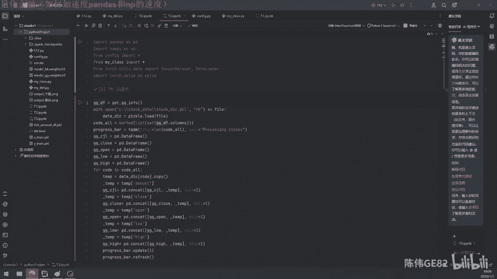

他给出的的呢就是这几个方法，这几个方法都是针对什么呢，你看潘达斯的加速，一个是读取，应该是读取，转换成时间，apply的用法，for循环使用apply的方法。

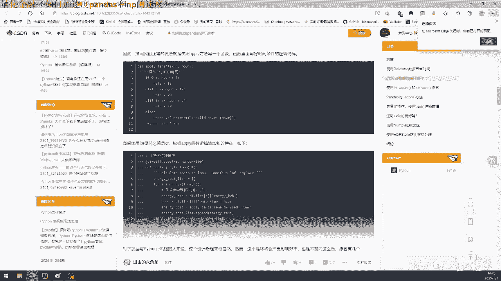

还有是循环的时候的方法，循环的一个加速，Ability of tru，哎也是这个这个是筛选的时候的这个加速，就没有说什么，这个也是循环的时候的加速。

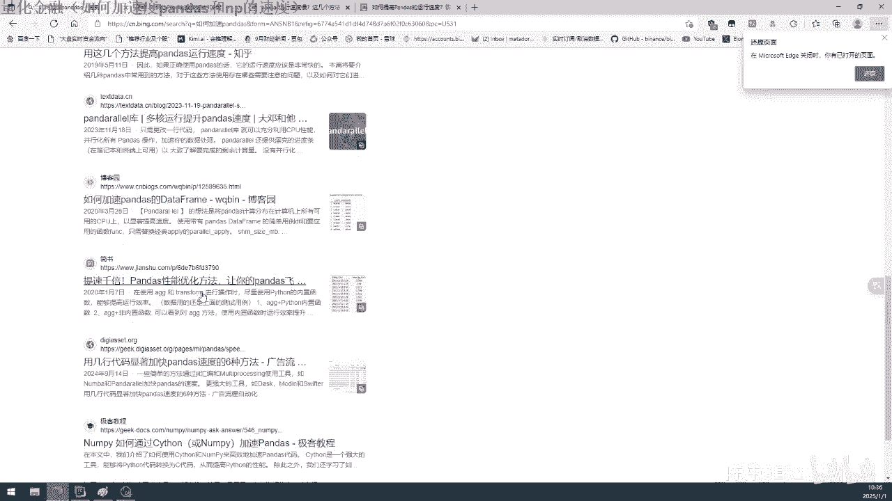

反正去找的话其实是很难找到，真正我们想要的，我们来看一段这个代码，比如说我这一个数据是保存着嗯，这些股票的这个开盘收盘最高价，最低价，还有成交量这个这个数据，那我要把它单独的拎出来。

比如说我把所有的这个。

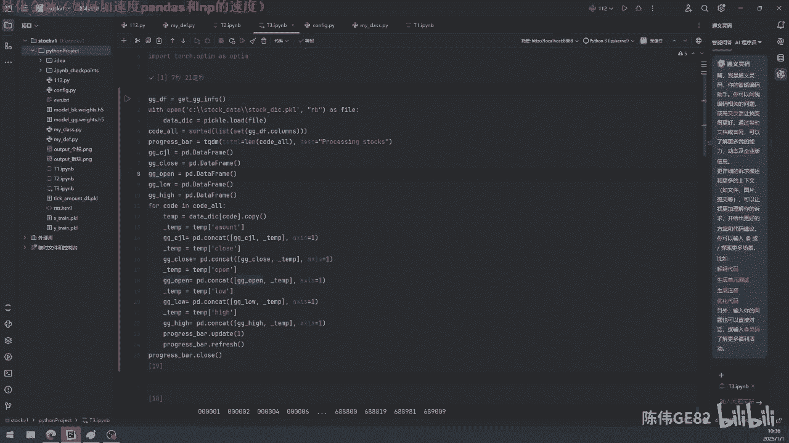

弄成一个什么样的格式来，你比如说我想弄成嗯这一个data flame。

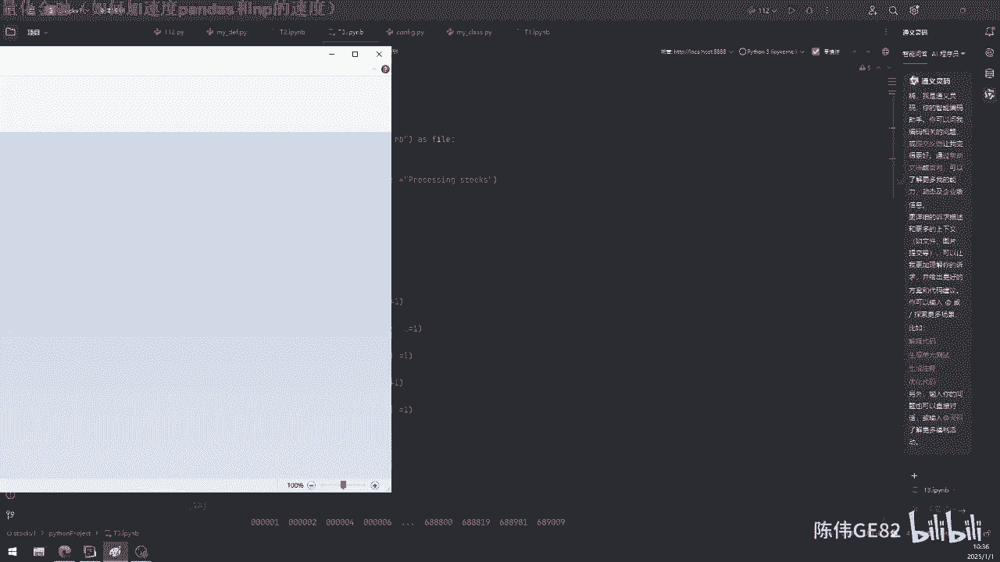

这里是比如说股股票的这个名字，code00001啊什么的，就是比这一个表单，比如说是一个收盘价的这个，然后这个是日期这样子的这种，这个是日期这种一行下来，这是股票代码。

这一行过去就是这一个是单独的一个呃。

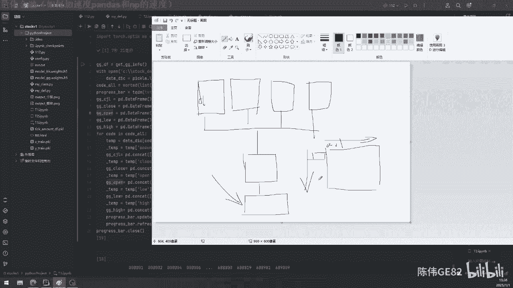

收盘价的这个pandas，那我这一个是字典方形式的，因为你从量化接口里头获取来的，这个它是把每一只股票，是以一只一只股票的开盘价，收盘价，最高价，最低价成交量这样子放在的，但我们数据分析的时候。

到时候做那个特征的时候，你就要把这个呃收盘价就放在一起，所有股票的这个收盘价放在一起，那我这一个代码，你比如说我现在只建立了这这几个个股的，这个额成交量啊，收盘价啊，开盘价这样的这个。

然后我把它单独的把它去拎出来，拎出来了之后，我再把它放到这那个各自的这个这个data嗯，pandas里头去，那这个代码是没有问题的，你看这个代码用CCAT这个把它衔接起来，我单独的另一个，然后拼接一个。

另一个拼接一个，这肯定是没有问题的，这有一个什么好处呢，就是说我这样子单独拎拎出来这个这个去了，就是说他的那个索引索引是会自动去对齐的，如果说你空一个，比如缺省一个数据啊什么的。

那它自动的就可以把它用用那个空子去去填充，它的这个索引索引列，跟那个呃呃它的索引列就不会乱，这个数据格式就不会乱，那这个是很好的，那我们来把它运行一下看，用心也是没有问题的，然后我们注意这个速度。

你看这个速度开始的时候还可以，你看到后面就不停的在往下降，这个速度不停的在往下降，我们等他用心完啊，看看有多慢，不停的下降，不停的下降，在实际使用当中其实也是很多的，比如说你你是一个实时数据过来。

比如说你一个40的数据过来，然后跟你以前老的这个数据，因为你以前的历史数据是自己提前处理好，放着的嘛，提前处理好放在那里，然后你一个最新的数据进来，那如果说你用CONCER就是把它去接起来。

那你比如说你是以tick，这种这种周期来进行监控的，那么你每三秒就要更新一次这个数据，每三秒就要更新这一次这个数据，那相当于你每三秒就要CONCAT一下，然后你concrete的越多。

其实他的这个速度就会下降的越慢，你们发现没有，它的速度是越来越慢，越来越慢，那么我们现在只要去分析，是什么导致了这个速度会越来越慢呢，这个算了太慢了，呃，这一半都还没到，到后面可能会更慢，我把它关了。

这个这个这个不用心玩了，那我们怎么来看他是为什么，会导致它的速度越来越慢呢，我们先来弄这两个data data，那个data flame，这个判断是，那我运行一下就是这两个定义了。

那我要看这个这一个的内存的地址呃，也不能说它内存地址相当于它有一个id，这个id假如说他的分配的额，分配的这个东西就是跟跟后面这一个不一样，或者说它的内存地址发生了变化。

比如说它这个PD1这个是放在内存的，比如说00001这个位置，然后比如说第二次，你也呃那个那个PD1放到了另外一个地方，那么他的id就会变，那个培训好像是不大，能去真正的去直接读取这个变量。

在内存当中的地址，C加加好像是可以的，但好像Python不行，但是可以用id这个方式来，就是说间接的来看这个地址有没有变化，这个是可以的，那我们就打印这个id，打印这个id，打印这个id之后。

我们用CONCAT来拼接一下这个pd1跟pd2，然后再来看一下这个pd1的这个地址，就暂且说他是地址嘛，啊其实他不不一定是这个内存地址，那我们看到之前的时候这个id是这么多，后面这个id是这么多。

也就是说pd1，现在这一个pd1跟之前的这个pd1，不是同一个pd1，而只是他的名字一样而已，名字一样而已，那所以说我们就可以知道在这一个地方里头，我们这一个我们开始定义了一个空的data flame。

到后面这里CONCAT一下之后，这一个这一个成交量，这一个这个data frame跟这一个data frame，其实并不是一个data frame，这个是导致了他变慢的这个原因什么呢。

就是相当于他要创建这个data flame的时候，他要把这个data flame，这个data flame就是把这个数据跟这一个数据，就是把它合并起来了之后，重新给它创建了一个data flame。

相当于它不停的在内存内存位置不停的在变，不停的在变，它的数据也是从这个内存，内存的这个数据复制到另外这一个内存，数据就不停的在复制，那么我们要做这个拼接的时候，我们是只希望于就是不停的增加进去数据。

但是呢就是前面的数据是想保持不变，就是不要去动它，那这样子的这个这个整个这个流程，可能就不是我们想要的结果，就是相当于他不停的在变换位置，然后这个NPN也是一样的道理，比如说我们要用一个南派。

我们来创建一个南派一，我们打印这个id是这个id，那我们再来给它进行一个赋值，比如说我哎这里先讲这里吧，CONCAT这个吧，先讲嘶这个男排一，这里哎，嗯这里这个蓝牌二我们创建了一个空的一个额。

一个N维的三行的一个一个南派，那我这里就创建一个数据，就是，诶不对呀，啊对这个是个这个是个数组，就是三维的这个数组，那我这个创建出来了之后，我再把它拼接起来，拼接起来，那么发现这一个这个ID这个NP2。

这个id跟之前这个id是不一样的，相当于这一个南派，跟这个南派其实并不是同一个南派了，这个就是导致了他变慢的原因，如果我们发现我们这个运行速度很慢，那么我们就要去看一下了这一个数据。

这样这个数据这一个不停的这个嗯，这个变换，是不是我们想要的这种方式来进行的变换，那么我们怎么来改进它呢，就是让它这个数据，就是比如说我创建了这样的数据，那么如何让它保证这个数据不变呢。

就是就是只是加进了新的数据，然后我们这个位置是不变的，相当于我之前的数据要保留下来，不要去动它，然后新的数据加进来，不停的加进来，保持它不变呢，我们有几种方式，你比如说潘达斯，潘达斯。

Pandas as，我看看，潘大师，我这里的话，我这里的方法是什么方法呢，就是比如说我创建这个这个成交量，这一个data frame的时候，那么我如果说我给他的所有的这个那个索引链。

还有是那个列名全都是固定的，然后我直接去修改这一列，就是说这一列的这个数据，你比如说我这个。

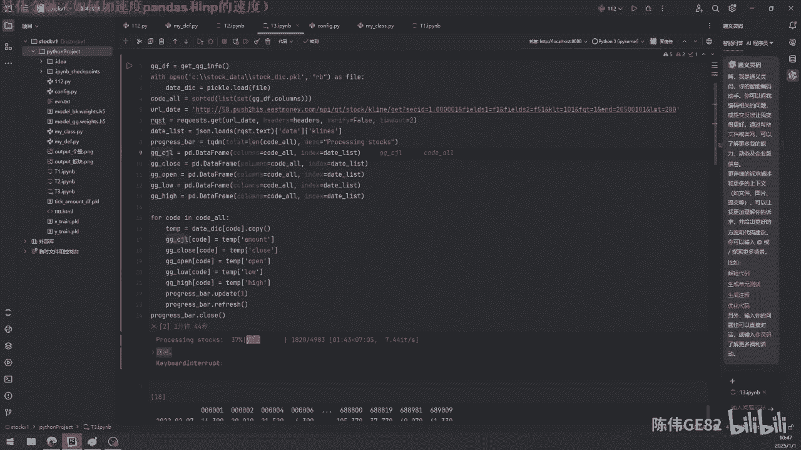

什么呢，比如说我这这个这个data flame的这个数据嘛，我创建开始初始化的时候，我就是一个完整的这个表格，我就是一个完整的，然后我每一列比如说这一列，这一列，就是比如说0001这个。

这个这00001这个这个股票代码，这个数据要想变的时候，我就直接去赋值，把这一列直接给给它，赋值成成我想要的这个数据，就是相当于我数据不停的在往里头去填充，我开始的时候是一个完整的。

然后我数据不停的去填充它，不停的去填充它，那么我这一个数据它的位置是不会变的，就是说它因为它开始初始化的时候，就是一个完整的一个data flame了，它是不会。

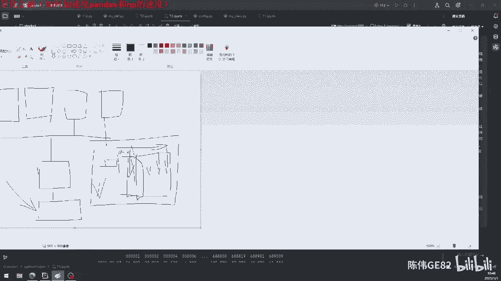

那就不会变了，那就不会变了，那这是一种思路，你看这个它就很很快来看看啊，这个加载会比较慢，因为我加载的东西很多，好然后我就开始来运行一下，哎你看这个就就不会随着这个时间去降低，它就一直维持在这个速度。

其实还有更快的，更快的就是什么呢，就是把这这个直接来直接来负值就直接复制，就比刚才那个就快很多，那这个基本上就是嗯基本上是符合了，我们想要的这种加速的这种这种思路了，就是他不会去不停的去复制复制数据。

啊这个就让他用心着吧，很快就会完了的，然后还有一种呢就是什么呢，就是嗯用用那个Python里头的两个内置的数据结构，一个是数组，这个数组，这个数组来加速这个南派是非常有用的，还有一个是字典。

还有一个是字典，一个是数数组，我们来看一下数组，比如说我创建呃，这用信号没有哦，快了哦，用心好了，嘶啊，这个就不会，他一直到最后它的速度也不会降低的，这个是那我们来看这个数组。

说这个数组我们来看这个id是那么多，那这个数组append的一个数据进去之后，你看看他的这个id会不会变，哎他的id是不变的，也就是说往数组里头添加数据，那这一个这一个这个内存。

也不会导致数据重复的复制，这种情况，还有一个支点也是一样的，比如说这个字典我运行一下，它这两个id也是一样的，也就是说你往字典里头去添加数据，那也不会导致这个变化，那这一个有什么用呢。

就比如说唉我想想看是在哪个地方，又无赖，应该是在训练数据，这里有一个地方有，修炼数据，一训练数据哎对在这里，这里这里这里你就说我训练数据的时候，我开始的时候因为什么呢，就是像刚才这个地方，就是这个地方。

这个地方这个地方我是已经知道了，它能够生成一个什么样的数据，那它的呃索引那个索引啊，还有是列名啊，这些都是固定的，那我已经清楚了，那我假设我是不清楚的了，那你不清楚的情况。

那我们就可以用数组这种方式来进行进行弄，数组，这个我就是建立了一个这个X训练的这个list，还有是一个Y的用来训练的这个list，这两个list里头呢，就是说不停的去添加这个这个数据，不停的去添加。

然后等添加完了之后，添加完了之后，最后一步这里就直接把它转化成南派，那这里的这个运行速度就也就是非常的高效了，要不然你你比如说你搞个几年的，比如说你搞个呃两年的两年的这个数据。

你两年的这个数据4000多只股票，那你这个这个如果说是按照CONCAT这种方式，就是不停的去拼接的话，那你运行个两天，三天可能都把这个数据都还整理不完，那如果说用这种方式，可能就就很快。

可能就一个小时啊，或者说几分钟啊就可以搞定了，因为到后面的时候，随着数据越来越大，比如说你这个训练的这个数据，可能是几个G啊什么的，那你不停的在内存里头反复的来复制，那会导致你非常非常的慢。

所以说这才是这个东西才是真正加速你，你这个呃核心就是加速你运行的这个速度的，这个核心就是控制它在内存当中减少它的复制，那才是真正的提高了加速这个目的。

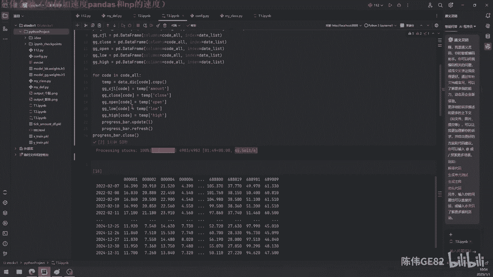

那网上说的这种加速呢，就是说是呃更多的是偏于什么呢，就是对于内存的使用，就是你内存里头循环啊什么的进行一些加速，他们这个说的的这这些东西呢。

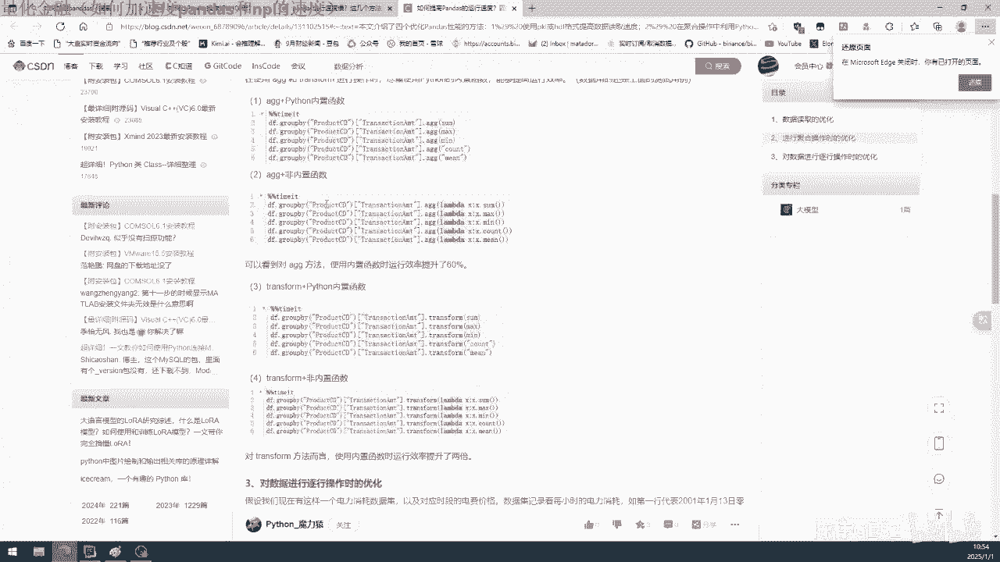

我们有的时候也是会去用的，但你发现当你发现你的代码运行慢了的时候，那你就要去思考是什么导致了你速度慢，比如说你循环慢，内存的利用效率不高，那可能这个有，有的时候可能就是培训天生的毛病，那没有办法。

因为他是他的这个呃那个语言，跟C加加这个语言是不一样的，C加加是编译之后运行的，那pandas as那个那个那个培训，他就天生的就没办法跟这样的语言去抗衡，那这种加速嘞，就是说是网上也提了有很多这个。

但是一般情况下面我们做量化的时候啊，或者说是写代码的时候啊，就是说嗯这些就是稍微注意一下就行了，一般情况下面他对培训，对内存的这个使用的这个效率也是挺高的，你弄个for循环，这种for的这种循环。

其实我们使用起来其实是完全够了的，只要不会出现，就是我说的这种情况，就是在内存里头反复的大量的复制这些数据，重复的复制这些数据，那你的效率就是会提高很多很多的，然后还有一个潘达是额。

就是说要注意的是什么呢，就比如说赋值这个东西，比如说panda1等于PD点，像这样的赋值，就是比如说我创先创建一个空的，然后这一个直接给它赋值，这样子其实它也不会导致，也不会导致它的变化的。

所以说我们尽量的用这样的方式，就是说不会导致它内存发生变化的这种方式，却用了这个也是用的很多的，所以我们要区分的就是主要就是还是在于呃，反复的强调，还是在于，就是说我的这个操作会不会导致它内存变化。

这个是加速这个南派跟南派跟pandas，as的这个核心。

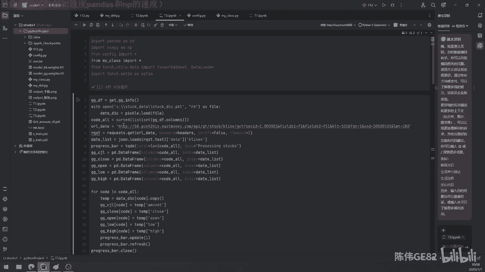