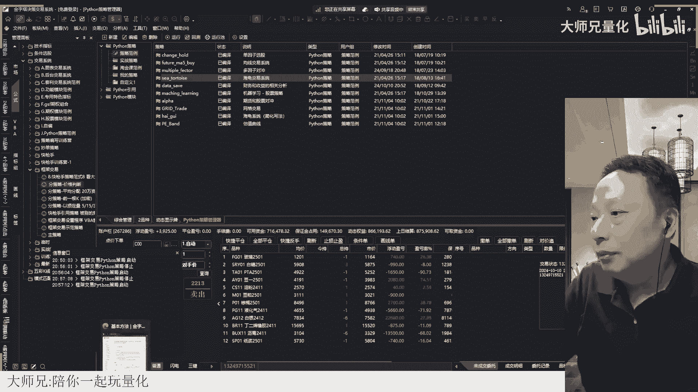
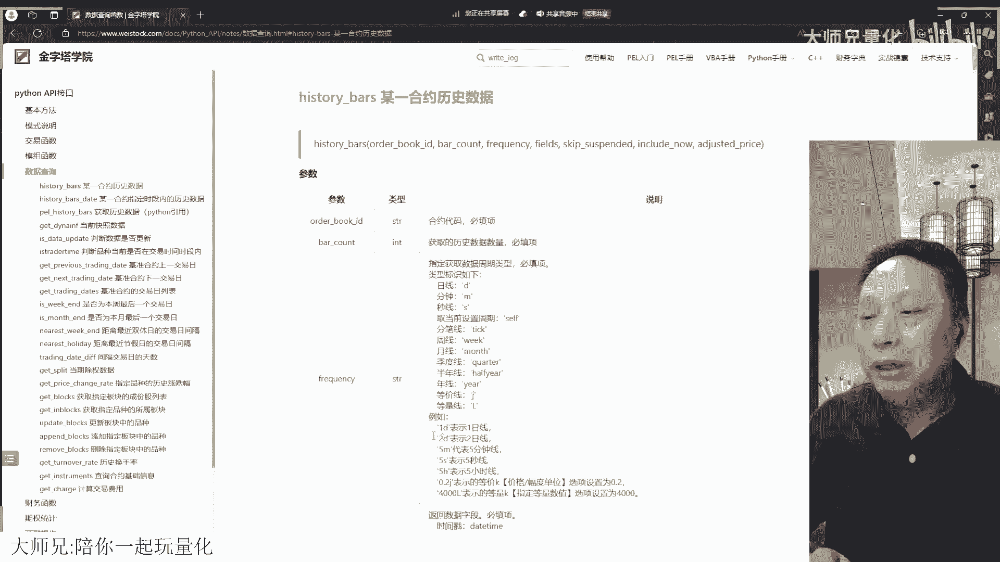
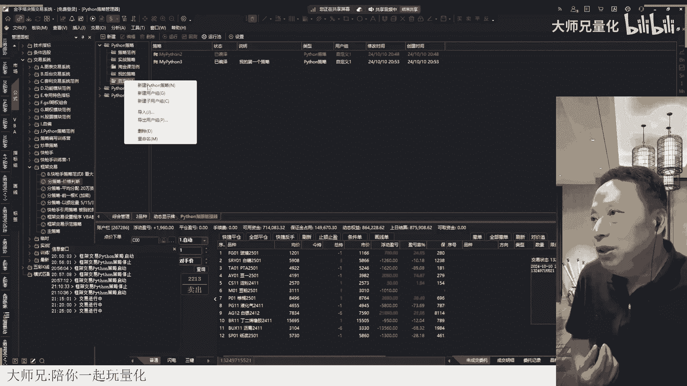
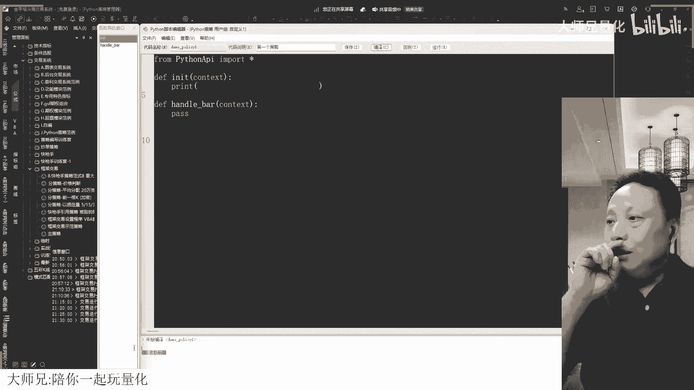
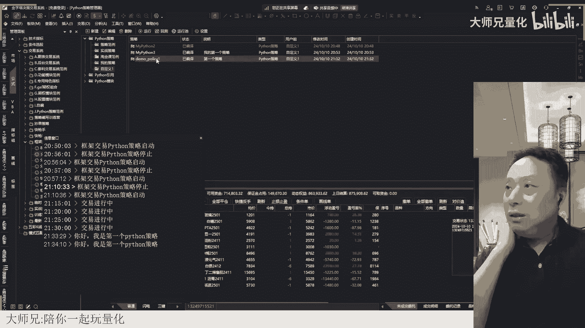
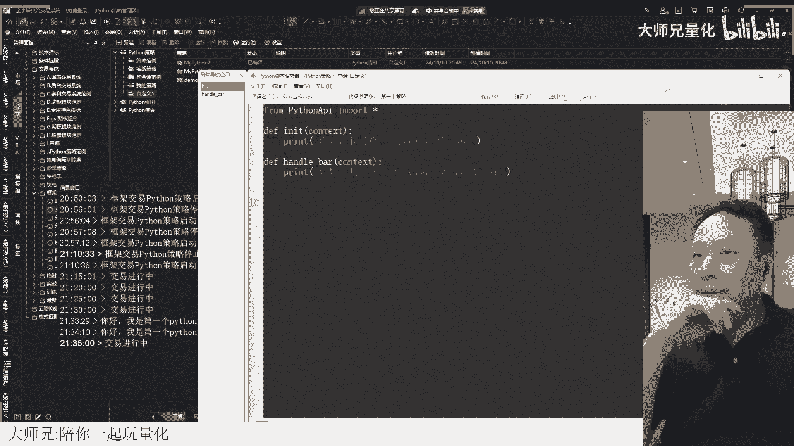
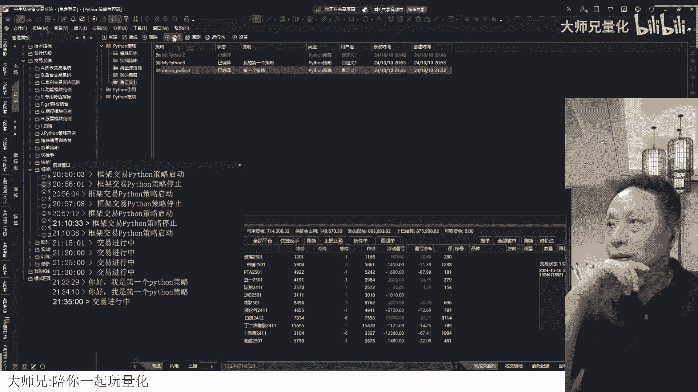

# 金字塔Python API文档学习指引，金字塔第一个python策略只有2行代码 - P1 - 大师兄量化 - BV1r12zYBEKT

打开一个叫做Python的一个API，这里有一个Python API文档，打开这个Python API文档，看一下，在金字塔里面我们可以参照，可以参考的一些函数有哪些啊。

啊打开完了以后，我们看Python API接口，它包括哪些东西啊，它分类了哈，首先基本方法里面，刚才我们说的NIT是必须实现的，也就是说你的任何一个策略，这一个是必须要有的。

然后HANDBY也是必须实现的，所以我们刚才看到一个最小的策略，里面就有这两个函数，你必须要写代码来实现它，下面这个before trading，before trading呢就是选择实现就是在盘前啊。

盘前你如果说你希望盘前做一下呃，变量的这种初始化呀，或者是要做某一个处理哎，那你可以在这个before trading里面做，但是往往呢我们在IIT，这个策略已启动的时候就给他做了。

所以呢这个就可以先现在不不去写啊，然后after after trading呢就是交易结束以后，比如说三点钟，三点钟一结束，那么他就会去执行这个after trading这一个函数。

order status呢是订单改变的时候，订单改变，因为我们是用它来写程序化交易的嘛，那你的订单改变本身就是一个事件，如果说你希望对这个订单改变进行处理。

那你就要用这个order status来进行捕捉，它做了哪些变化去做相应处理，order action呢，这也是就是你它是一种回调的方式哈，后面会讲到exit呢是退出，也就是你这个策略停止的时候。

他执行停止是什么呢，比如说我点这个停止，那么这个时候呢，它会执行这个EXIT这个函数啊，就刚才这个e x i t parameter呢，是一个参数设置啊，跟我们P2里面的那个input差不多。

input就是设置参数参数嘛，对不对，他这里面叫做parameter好，那这是基本方法，一个策略里面可以有这些呃，提供的这些框架性的一些函数，你把这个相应的代码填进去，它就可以跑起来了啊，启动这个策略。

它就可以跑起来，那么这个API里面还有其他的一些好像模式说明，模式里面他对策略进行了一个讲解，我们刚才说了，有Python车内有Python引用和Python模块。

这块呢我们要知道Python策略是最常用的，也就我们平常说的写一个Python策略，指的就是我们在Python里面去建立一个Python策略，Python引用呢它指的是一个P页策略。

去调用调用这个Python的一个代码来进行一个运算，运算完了以后返回一个值到P12里面去，相当于是一个自定义函数，就你如果是玩过VBA的话，VBA里面他也是可以写个自定义函数的。

就你的图表上要调用一个VBA，认识认识认算一个结果，然后呢你写一个函数，然后去调用，调用完了以后返回一个值，那么这个Python这个引用呢也是这么一个作用啊，但这个实际上用的很少啊。

下面一个Python模块，这个模块呢它跟我们在呃Python里面讲到那个模块，是一样的概念啊，就是你把一些常用的功能把它写在一起，放在一个模块文件里面，这个模块文件呢，你就可以在其他的策略里面去调用。

这是它的几种不同的策略，那正常也要用的东西，主要还是这个Python策略用的多啊，然后在其他组别里面这个API里面，那它是分类的，比如说交易函数全是交易相关的，那你想一想你的交易需要涉及哪些方面。

你是不是要有这个开仓的动作，那开仓有开多开空，有平仓的动作，那就平多平空，然后你要想去做交易的话，你肯定要对订单进行处理，对不对，你可以获取当日委托订单，比如说你在下单之前。

你是否要判断我这个订单是否已经下出去过，是不是还在没成交的状态，如果是，那我就不能再去重复下单嘛，那你家通过这个相应的函数来得到，有没有未成交的订单，下面这个呢也是获取订单信息。

还有对订单处理的撤单啦这些操操作，那么这些后面我们都会有相应的示范的例子，我们对这个API进行一个粗略的讲解，这是订单的操作，那么还有一个就是对你的账户的操作对吧，你的账户你需要知道你的账户有多少资金。

你要开某一个品种，比如说我要买一个股票，我这里人总共多少资金，我需要买多少支票，我就可以计算出我每一个票应该卖多少钱，然后有这么多钱，我再根据这个股票的价格来算一下，哎我要买多少股对吧。

那这就是需要得到投资者账户信息，然后如果你是机构版的，可以用这个得到多账户，多个账户的列表，还有一个投资组合，也就是持仓，那么对于这个交易这一部分，是不是我们会经常要用啊，这部分就非常关键了对吧。

所以这四个是最基础的几个动作，然后下面这个呢就是跟你的订单相关的，这个跟D呢相通关的，然后再下面呢就是你的账户相关的，然后再下面呢就是你的这个持仓，持仓相关的，就是你在交易的过程中需要碰到的。

所有的这些还有细节，在交易函数里面基本上都有了对吧，这是第三个组啊，模式刚才已经说了，基本方法里面是这些程序的结构，结构的一个说明，然后模组模组这个呢实际上嗯没有的，没有太大的用处啊。

他是要在这个机构版几个板下去用，然后呢呃可以建立子子账户组，这种东西一般我们都不用结构板嘛，对不对，所以基本上这个也没没没多大用，这块我们的那个视频里面有啊，你们要想了解是可以去了解一下的。

这个我觉得没多大用，反正我之后就没有用过它，这是模组函数，然后数据查询这个里面呢就是主要是呃，关于行情和合约方面的行情和合约，我们来看一下哈，比如说这个历史数据，历史数据按照时间来划分。

然后P12里面去获取历史数据，然后得到行情快照，判断数据是否更新，这都是跟行情相关的对吧，呃是否在交易时段，这个是合约的状态，就是在交易时段它返回真，否则返回假，然后得到基准合约的上一个交易日。

下一个交易日，然后基准合约的交易日列表是否为周，本周最后一个交易日，是否为本月最后一个交易日，这都是跟行情相关对吧，双休日啊，间隔天数，还有除权数据，这都是行情的吧。

然后好到一直到这里都是关于这个行情的，也就是说你要做策略，你可能要用到这些历史数据，或者是这个和快照的数据，那么你就需要用到这里面的这些函数，那还有呢就下面这一部分关于板块的，板块的操作。

板块就是比如说你可以建立一个自选股的板块，那么你想得到自选股这个板块里面的所有票，那你就需要用到这里面的相应函数啊，你要增加品种进这个板块或者删除它，都有对应的一个函数来给你去使用哈。

然后再下面呢这个查询呢，就主要是一些额数据的查询吧，包括下面这里面还有个财务数据的查询，都是属于查询的啊，这是一类数据查询方面的，跟行情相关的，然后到财务函数，财务函数呢这里面就很多了，这里太多了。

因为每一个里面可能又分了些不同的那个查询，某一个项目哈，这就太多了，那如果说你是做股票交易的，你可能会用到这些财务数据，这里面要说明一点哈，这个财务数据里面有一些基础性的数据。

它是在标准版里面就提供了免费版，也提供一些，但是如果说你要想获取到所有的这些财务数据，你需要他的那个专业版专业版才可以获取啊，那跟我们在金字塔里面哪个地方相关呢，就跟我们这个数据补充这里面相关数据补充。

这里面有个财务数据，基础财务对吧，基础财务这里面它就是一个最基础的东西，你免费版都可以补充的，我取消它，取消补充，然后有个深度财务，这个深度财务里面，你看现在我们能够补充的只有股票基本信息。

其他的都是没有权限的对吧，都没权限，也就是我们现在登录的是一个免费版的账户，所以没有权限，那你没有权限的，你用Python的那个接口去获取这些数据，它也是没有的，好，这是财务数据的获取，这一块好。

再看下一类，下一类的是这个期权的统计数据，就像刚才这个草原说的，我们需要知道期权的一些信息对吧，那你看这里面就可以得到了对吧，期权的这些信息，它的内在价值啊，他的delta伽马啊，什么阿球啊。

什么theta啊，维维A这些他都可以获取，但是呢，他目前因为只对这个ETF期权进行了一个支持，那你券商版里面就可以用这个函数来获得，当相应的值，这是，期权统计里面的，行权包括行权啊。

包括隐含波动率的查询啊这些哈，然后两融操作，两融操作呢就是你做股票的融资，融券这方面的一个操作啊，新股申购，就是你新股申购可能要去查询你的额度嘛，查询你的额度是多少，然后呢查询是否中签。

当然这个如果你做股票交易，想去把它做成自动去打新，那你可以去研究一下，比如说我要自动根据我的这个额度去呃，判断当天有没有新股，有的话自动去打新，你就免得自己忘了嘛，对不对，好，这是一类。

然后再下一类呢就是全局变量，前期变量呢，这个是一个小型的数据存储的一个数据库，就相当于金字塔给你提供了一个数据库，这个数据库呢你可以存储键值，对它也是以键值对方式存储的，这个在哪个地方呢。

就在这个工具里面的是这个数据管理全局变量，你看这里就有很多变量对吧，那我们现在这个地方有很多的这些，比如说框架交易里面的示范策略，那么这个是这么多的，那我这个是哪里来的呢。

这个实际上就是我们这个框架上的，我们框架这些数据，为什么我在这个Python里面，能够得到框架上的数据呢，我就在框架运行的时候，它自动保存到这个全局变量，然后我再通过Python提供的这个全局变量。

访问的这些方法得到这个全局变量，然后我就可以进行Python后台的交易了，所以全局变量呢是一个很好的，中间给你提供这个数据传递的一种方式啊，好这是一类也是比较重要的，其他函数呢。

就是他把这些其他的不好归类的就放在一起了，这里面包括哪一些呢，就包括比如说这里面有这个设置一个定时器啊，你你在我们Python车内运行的时候，不是有一个固定间隔吗，你在固定间隔里面。

你还你还可以在代码里面设一个定时器，比如说我设一个定时器，每两秒钟运行一个代码，那你就可以用这个定时器来设计啊，还有电视机的结束，然后下面还有一个日志的操作啊，比如说打印输出对吧，发送消息。

发送微信消息，然后更新合约池，添加到合约值，这个是这个就是对于合约池的访问，刚才我们设置荷叶池的时候，不是说随便设一个吗，如果说你想去跟踪合叶池里面的品种变化，那你可以用相应的这些函数好。

好在下面这个哎，这个就是获取你的这一个图表策略的信号，获取完了以后，你就可以进行后台交易了，然后在下面这个呢CORE vba，就可以去调用VBA的这一个过程，所以我们的策略编写都是VBA做界面。

然后呢Python写下单下单的部分，我就通过这个CORE vba，把这个数据传递到VBA这个过程里面去，然后他就可以实现界面上的这种显示，然后再下面这个是测试报告的一些东西。

然后声明参数的这些用的更少了，好了，这是整个API的一个大致介绍啊，你把这个分类搞清楚了，你需要找某一部分的这个呃函数，你就知道到哪里去找啊，而不至于茫然哈，如果你还是不知道，那你可以在这。

你知道他的一个名字，那你可以在这上面去找，比如说我我想知道一下这个日志输出，比如说write对吧，Right，然后那它这里有一个日志，对不对，Write log log write。

然后这个log log是日志日志输出，你看它就显示出来了对吧，那在Python API里有个write login，有VBA里面有个write方法，vb script有。

那就是他提供的这些有哪个地方用到的，write这个东西，你一点它它就定位到这个位置哈，就是上面查询的时候用的，那下面这个重要对象啊，为什么我们在课程开始的时候，我们就讲了一下对象呢。

实际上你这个Python这个策略里面，大量使用的这种对象，比如说这有个context对象，他就是把你这个关于你这个策略执行的一些，基础性的信息保存在那里，这里包括什么呢，包括合约池，包括运行的信息啊。

包括你这个如果是在策略性，用P2策略去调用的时候，它有一些呃信息，然后策略的这个运行时间，这些run info呢就是运行信息，就是你这个策略运行起来以后，它包括哪些信息。

这个到时候我们有示范策略来讲解哈，或者对象，这些都属于对象，order对象就可以提供你这个订单哈，下出去的这个订单，他的订单的标识，它对应的合约代码，订单的这个时间，他是买还是卖这样的一些信息。

这也是非常重要对吧，你别看他好像属性特别多啊，实际上你你也不需要去记忆的，不需要记，你翻出来，到时候去抄他就好了嘛，好了，这是这个重要性，重要对象里面还有一个持仓对象，持仓的一些基本信息。

trader对象呢，这是一个就是那个你的实际成交的一些结果啊，Split，这是叫什么来着，Data will，这是财务数据里面，往往都用这样的一个数据结构，它包括一个日期，包括一个对应的值。

比如说呃士一率，那士应力半年前的一个值和现在的一个值，那这有一个时间的概念嘛，对不对，Instruments，这个是合约的信息，比如说你要对股指期货这个合约的基本信息，做一个获取。

我要知道多头保证金多少，空头保证金多少，那你就需要用到这个对象，好，这个是证券可融券的一些东西，新股的一些信息哈，也就是这里面的这些对象也是要做一下了解的，因为我们在上面这里面有一些，比如说数据查询哈。

你查询的结果它实际上是返回一个对象给你，那么这个对象它有哪些属性呢，你就得要去在那里去查啊，OK这是整个API的一个构成，做了一个大致讲解，那就我们通过这个从全局来说。

你要把整个API的这个结构把它看明白，看明白以后，你在写的时候。

你就知道怎么去找这个对应的帮助了，好，OK回到这一个策略编写，现在呢我们来讲讲第一个示范策略吧，讲一个，然后把这一个就是往往我们写代码，第一个就是打印hello world，对不对。

如果我们要在Python车内第一个策略里面，我们输出一个信息，输出一个呃，你好，我是一个Python策略，就这么几个字，那我们要怎么写呢，我们来做一个这样的动作，我就在这个组里面好好去写。

我们去新建一个Python策略。

然后刚才说了，他的一个基础架构里面有INIT，有这个HANDBAR对吧，那我现在我要它输出的只需要在MIT这个地方，也就是说程序进来的时候去运行就行了，对不对，那这里面的代码呢。

我现在是不是都可以删掉它，都把它删掉对吧，我只是要打印输出，对不对，所以我这里面就可以直接用print，那我们在学基础的时候，我们不是有这个F格式符吗，对吧，那你就可以在这里面就使用了。

但是我们这个打印输出我只是打印一个字符串，我没有必要去做这个变量的引用，对不对，所以我直接用一个字符串嘛，然后就打印说你好，我是第一个，Python成列，好啦，那么这一这一行语句写在这。

然后这个策略就完成了对吧，后面这些都是pass pass对吧，这些都是pass，也就pass是个占位的对吧，占个位子，那我们刚才说了，这个after trading是可以删掉的，它是可选择实现的。

所以这块能不能删掉，可以删掉的，order status也是选择实现的，可以删掉，它本身就已经注释掉了对吧，然后order action呢删掉exit的删掉，对不对。

然后before trading不要，然后上面这些都可以不要，但是这一行要啊，这一行要哎，这个是说明可以删掉，那第一个第一个程序，你看起来他好像很多，实际上有多少东西，实际上就就两行代码而已啦。

你把它全部删掉以后，实际上就这两行代码了，然后给它一个名字，比如说叫做呃demo好吧，就是，police1吧，policy策略一好不好，然后注释说是第一个策略，是不是很简单，第一个策略写好了。

把这个字搞大一点，3号这吧，3号这还不够大，小二哈啊稍微大一点好了，保存确定，然后呢再给它编译一下，是不是编译成功啦。

对不对，好我们要运行这个策略，现在那我们这个找到这个策略对吧，按右键或者按上面这个上面这个运行，注意这是第一次的时候这么运行啊，后面建立好的运行值了，就不需要再这样运行了。

然后呢我用一个固定轮性能模式三秒钟，然后这边计算周期呢，因为我上面用的固定能性，所以这个计算周期它就没有效果对吧，那我这里选择一个基准合约，白银好，下面初始合约池也选白银，确定好啦。

现在看下面这里面这是一个信息窗口输出了，你好，我是第一个Python策略，对不对，是不是，也就是这个最简单的策略，他就已经开始工作了，但是他输出完了以后再也没做别的事了，就这个策略啥事没干。

就是就是进来的时候任性了一下，就没事了对吧，那如果我这个停掉，我再把它勾选呢，它又启动对吧，又启动的时候，他又任性了一遍，又出又出来一行信息对吧，OK所以你对这个第一个策略。

他是不是有一个全面的了解，应该很简单对吧，就就几行代码，那现在再来理解一下哈，我要让这一个这一行字不断的重复出现，那我应该放到哪里，安德巴后面每一个周期，每一条每隔几秒钟他就来一次对了。

这个时候呢假如说我这个这个位置呢，我这个显示一个上面显示个零以示区分，然后下面这个显示一个一，表示他在这个地方出来的对吧，或者我写写个HDB，handle8表示在HANDBY这一个函数里面输出的。

那么这个上面呢它是一个INIT，也就是在INIT这一个函数输出的好保存，编译好了。

这个时候我需不需要在上面点运行呢。

就不需要了，因为我在运行池里面已经有这个了，我只要把它现在是在运行状态对吧，我只要把这个勾选上，它就运行了，对不对，好，现在看他是不是重复出现，那我们把它停掉哈，把它停掉，看清楚一点。

看刚开始运行的时候，第一次运行的时候，第一次运行的时候是09：35：40，你好，我是第一个Python策略杠NIT对吧，然后隔了一秒钟，下面又出现了一次，然后显示的是hand bar。

也就是在hand by这个函数里面，输出的这一行信息，这后面都是每次隔了一秒钟对吧，甚至这21分35秒，41ms，对不对，那那这个输出就非常的密集对吧，为什么输出那么密集呢，那你要看一下这个地方。

我们设置是什么时候设的修改，这个时候你来你来体验一下啊，这个勾了一个tick级别，是不是这里每一个数据的变动，它都会运行这个策略，所以这个tick的时候他就不理会前面这个三秒，如果我把这个T给勾去了。

再保存，然后再来启动它，这个时候他这里面就是隔了几秒，三秒六秒九秒就是每隔三秒运行一次，这个能理解吧，啊这就是这个策略的运行的这种，我们用的是固定轮训这种模式，他这个策略是这么运行的。

那现在假如说我们来改一下，改成走完K线来试验一下，我用一分钟哈，一分钟确定一下，然后呢勾选一下这个，现在看这里面是21：37：45，出现了，在这个呃，首先i i it里面任选了一个。

然后接着在HANDBY里面任选了一个，也就这两个中间是没有间隔，没有时间间隔的对吧，连着运行，那么下面这个呢，37分45秒，37分59秒，我们设置的是一分钟对吧，再看下一个间隔多少。

也就他是根据你这个K线走完，走完以后他就去执行一遍，后面再等一个出来的，I59，59到现在还没出来，这一分钟有那么久啊，好出来了，37分59~38分59，是不是隔了一分钟，对吧。

所以你在这个Python策略运行的这个模式里面，你就要理解清楚为什么我们要这么设置啊，也就是这里面我用走完K线的时候，他会以这一个品种，它在一分钟周期上的这个数据的变化来执行，那如果选择5分钟呢。

它就5分钟才出现一个运行的这个程序。