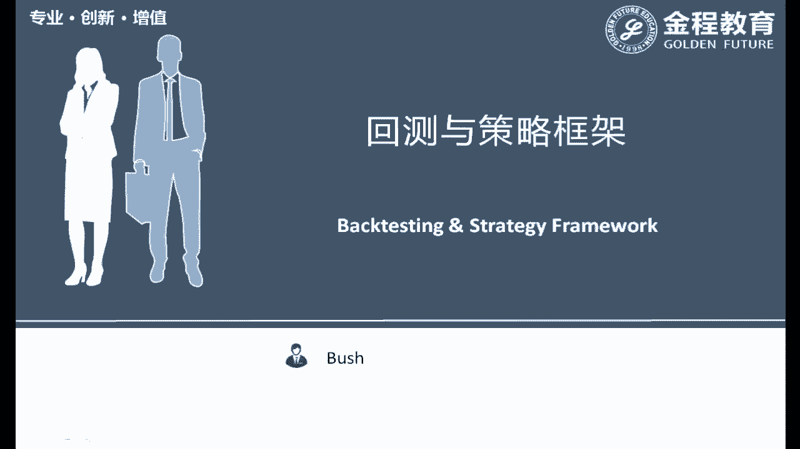
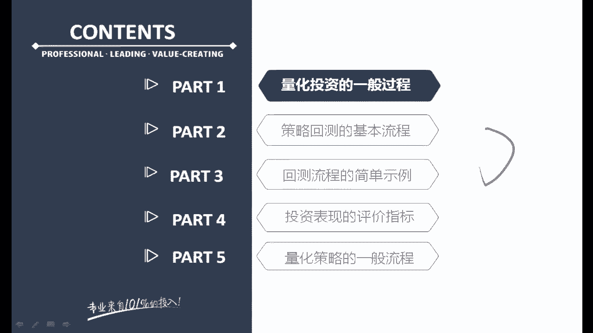
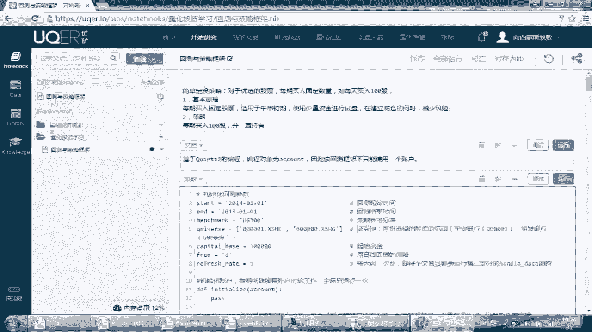
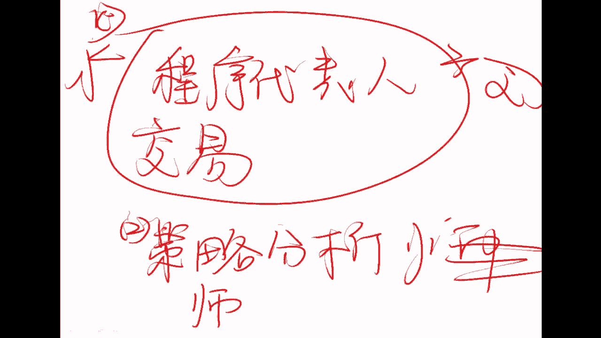
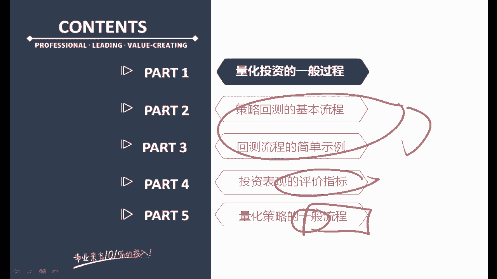
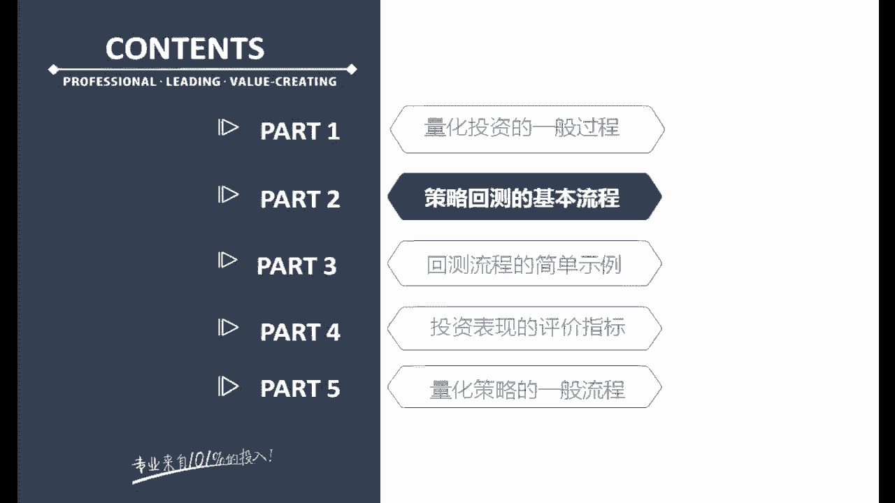
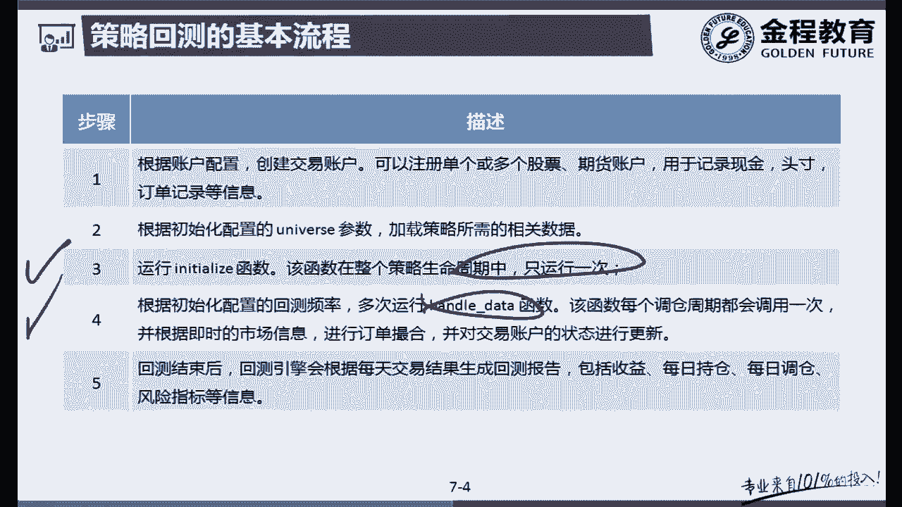
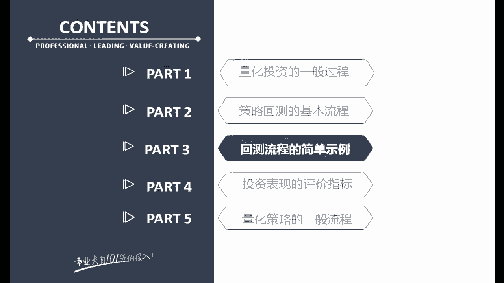
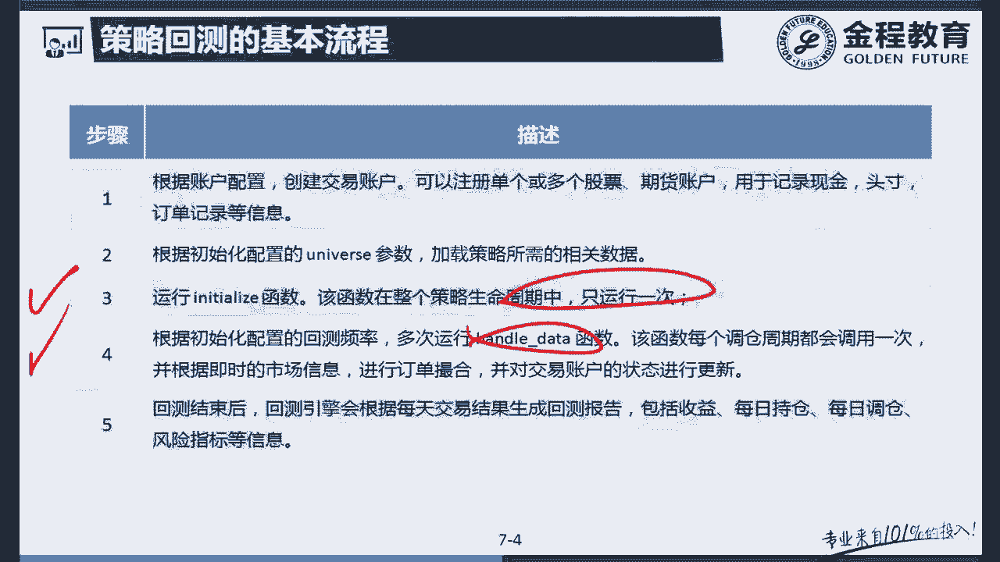
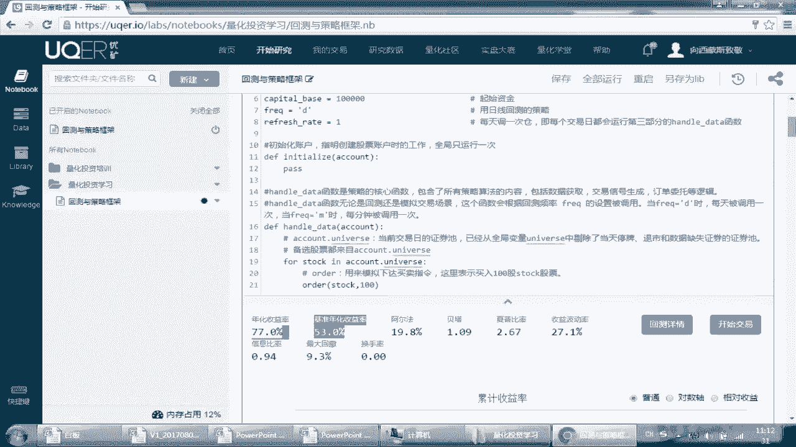

# 2024年金融大神老师讲解量化金融分析师.AQF—量化金融专业知识与实务 - P19：《实盘交易模拟_基于优矿的进阶学习》01.量化投资策略回测之回测与策略框架 - 量化沿前 - BV1oU411U7QM

好各位同学，我们从现在开始开始和量化投资，第二部分的学习，我们今天是量化投资，第二部分的第一课是回测与策略框架。

在这一部分我们主要讲解以下几部分内容，首先我们看一下量化投资的一般过程，然后在这个过程之中呢，有几个比较重要的点，我们还会做一个比较深入的讲解，首先第一个点是什么呢，是关于回测的这个部分的知识。

也就是第二部分和第三部分，这个第二部分是对回测这一点的基本流程，做一个介绍，而第三部分主要是用一个实例，帮助大家更深入地理解一下策略回测怎么做，然后第四部分就是我们讲一讲，你做了一个策略。

然后也跑出来结果了，那这个策略到底好不好呢，我们要看一些评价指标，而基于这些评价指标的深入分析，你可以发现你策略的一些优缺点，而根据这些优缺点呢，你也可以找到你的策略是否有改进的一些空间。

然后最后呢我们再讲一下，如果你要设计一个策略，我们应该怎么做，这一般的过程怎么来，那好了，我们先看第一个点。

就是关于量化投资的一般过程，而在讲量化投资的一般过程之前，我们先看看什么叫做量化投资，关于这一点啊，就是学界和实业实务界，它的定义也是千奇百怪啊，但是我基本上从这个就实践的角度。

我们或者说我这一派啊认为量化投资是什么呢，其实就是用程序代表人交易，就是用程序代表人交易，关于这一点为什么要这么定义，那后面我会给大家讲一下，这个其实也关系到我们的一个整体的，一个理念啊。

我们认为在量化投资而言，和传统的用人去做投资这件事情，其实从本质上讲是一致的，都是基于一个对于投资品的一个规律的认知，然后设计出一套投资的步骤，只不过到最后一步的时候，是根据这个步骤的执行者的不同。

如果你用人去执行，那么这个就是一般的主动投资，如果你是用程序去执行这个步骤，那它就叫做量化投资，实际上这里面也没看到啊，它本质而言就是用人来代替了什么，代替了我们，就只是用程序代替了一般的这种人。

交易的一个过程，这里的好处是什么，其实大家都知道啊，但一般而言，我们认为一个投资而言有三个部分组成，第一是预测，第二是仓位控制，第三个是什么，就是这个所谓的情绪管理，情绪管理是什么。

就是严格的按照我们的交易流程进行交易，而量化投资这一点，由于你是由程序来代表人进行交易，那么也就是说在情绪控制上，你可以几乎做到完美，所以这是量化投资的一个主要的好处之一。

那么当然它也有一些其他的好处啊，就是那个到回测的时候，我们还会再说一下，这两点都是比较重要的，那好了，在了解了这个量化投资的定义之后，我们来讲讲啊，我们这个量化投资的一个偏向。

什么叫做量化投资的一个偏向，我们在这里的意思是说，我们所教的这个量化投资的课程，主要是针对哪一类的工种，就说是一般来说在一个量化投资的基金之中，如果从专业上比较重要的两点是什么呢，一个是策略分析师。

一个是底层的算法实践，我们这个东西呢更加着重于策略分析师，这个策略分析师，特别像我们主动投资里面那个投研人员，因为为什么要着重于他来讲解呢，首先第一点我们还是以金融领域的一门课程。

所以说对于这个算法的这个优化，怎么降低运行时间等等，可能不会过多的进行设计，再有一点，我从以往的经验上看，对于最后能成为量化投资基金经理的，大体上还是以策略分析师为主。

所以说我们这里面第一点讲的是什么呢，讲的是我们讲怎么样用程序代表人进行交易，第二个点是什么呢，第二点是我们这门课，站在的是哪一个工种的角度，是站在策略分析师的角度，是站在策略分析师角度。

也就是说这门课的核心点已经出来了，就说我们讲怎么用程序代表人交易，而在程序代表人教会之中，我们更加着重的是如何做好一个策略分析师，那么它和底层的一个区别是什么呢，策略分析师是什么，我有一个基本的理念。

有一个步骤，我把它转换成程序，我看看我这个理念和这个步骤到底有没有用，而至于到具体的环境中，我用什么样的语言运行的更快，那是底层功能是个问题，不是我们的着重观点，所以说基于这一点啊。

我们全程是用了这个优框的一个框架给大家讲，这样可以省略掉很多底层的细节，用来加快你的学，而这种加分其实是对你的工作，日后是没有影响的，比如说你在策略分析师角度，是不需要去做这个底层了。

这一点是关于量化投资，我们讲什么，首先给大家做一个交流好。

我们了解了这个量化投资的这个概念之后呢，我们来看下面的一个问题，就是我们的量化投资的一般过程，首先我们这个量化投资啊，这个过程取的是国外的一个经典的这个流程，我们基本上的量化投资。

就是按照这个顺序来做的，首先我们看第一步就是开发出一个交易策略，实际上刚才我对于量化投资基石，给过一个简单的讲解，那么在这里面我们还可以说的更加细致一些，这一点其实就涉及到不只是量化投资的问题。

是而是整个投资体系应该如何建立的问题，实际上我们大家看对于一个投资体系，或者说你要进行投资，你应该怎么做啊，这个当然我们讲的是这个机构投资者，基于理性的投资，而不是说我们日常的一般的投资者或者是散户。

基于这种情绪，我们听个消息就买的啊，这是我们一般不会这么做的，我们怎么做呢，首先我们是发现市场中的某个规律，然后基于这个规律之后，我用一系列的这个步骤，然后我们一般来说叫做操盘策略，来一次给你写一下。

操盘策略之后有这个交易员具体去执行，这是我们一般情况下主动进行的一个过程，那么在我们的这个量化投资中，我们应该怎么做呢，首先也是你在第一点上跟他也是找到某种规律，什么叫某种规律呢，就是股票在什么时候涨。

什么时候跌，比如说我们如果这个股票预增或运营的时候，你买入了，那么这个时候他确实在期末的时候，财务报表表现出我确实是涨了，那么这个股价还会涨，这就是一个规律，那这个时候你做通关策略得怎么做呢。

是不是你要写啊，在预测运营的时候买入了，买入之后，当他公布之后，我是不是就卖掉了，这是你的操盘策略，最后执行怎么做，是不是人的交易员去给你去，在他预增运营发生之后，你去买入，而他最后说出股价的时候。

你要问怎么做，是不是应该把它卖掉啊，这是不是就是我们的一系列的这个过程呢，但是你注意在我们这个量化投资的角度，这是一般投资啊，这个右边这是量化投资，注意也是一样的，你也需要有这样的一个操盘策略。

这个往往是什么，我们程序里面要先写的这个框架，也就是说我们会写一系列的这个函数，季老师已经跟大家交流了，这个函数怎么写是吧，我们就不说了，这里面会有一系列的函数，这个名字往往其实就代表了我们操盘策略。

所谓的这一系列的步骤，然后呢怎么做，把这些步骤转化成具体的代码，也就是说程序去进行运行，这个就是我们策略该做的一系列事情，当然在后面我会讲一个具体的例子，或者说给大家，并且给大家一个模板讲讲。

一般情况下，这个步骤在整体逻辑上我们应该怎么做，然后这个程序我们应该是怎么写，但是注意跟大家说一点啊，我们其实而言，对于整体而言，我们用了Python这门语言，但实际上你要掌握一门语言，其实相对而言。

如果特别精通，对于底层程序员而言，可能需要比较长的时间，但是对于我们而言，我们什么只是说作为策略分析师的角度，我们是从金融的角度来怎么做呢，有这个思想，我们怎么把它实现，这个相对而言是一个比较。

不需要那么长时间去学的一个过程，而季老师给大家做过一个深入的讲解，在这个部分，基本上可以说保证大家程序是没有问题的，而我这里面讲的是什么，而讲的就是针对于你现实情况下，比如说我怎样做好一个父类的值。

比如说我怎么样去找到这个规律，然后有这些规律之后，我怎样形成一系列的函数，来代表我一步步的操作过程，最后人讲这个具体代码你应该去怎么写，实际上我做的方法是什么呢，是讲的是如何通过你去通过一个思想。

或者叫一个股市中的规律，怎么样转化成可以运行的一段代码，我讲的是这个事情，比如说我其实是把金融和这个计算机，给大家做了一个融通，我是讲是一个具体应用的一个过程好了，这是关于这个部分。

也就是说我们回到这里面，你生成了一个新的特点，其实是什么，是不是你首先找到的是一个规律啊，然后怎么做，然后你把它转换成一系列可以这个的步骤吧，然后最后呢最后变成什么，最后变成你具体的程序或者叫做代码。

是吧，这就是我们所谓开发的这个策略啊，当然这个时候开发策略肯定是有一些调试，取到一些程序的bug，让它变成一个可运行的版本，或者叫做一个正确的这种程序，那么第二步之后，你形成一个正确可运行的程序之后。

你的第二步怎么做，实际上你要测试一下，你这个策略到底有没有一个可以赚钱的效应，那这个过程就是我的一个back test，他是什么意思呢，主要其实他的想要点是，我用历史的这种交易数据。

比如说历史上这个股价的涨跌情况，来看一下我这个算法到底在历史上跑一跑，看看有没有赚钱的这个效果，其实这是bad tasting的一个思想，这一点我们在后面也会做详细的介绍。

我们会把这个流程就是这一步进行一个放大，然后再给大家举个例子，帮助大家更深入的理解一下，那么当你这个bg testing运行完毕之后，你必然会得到了一系列的结果，因为实际上对应而言。

我们这个结果是什么呢，其实就是一组指标，这一组指标啊，我用一组指标来代表，我这个策略是优秀的还是不优秀的，但实际上跟大家讲一点，其实你不管是用这种一般的这种投资方式，还是用量化投资。

其实你算出用的这个指标都是一样的，只不过基于这种量化投资，你在做完回测之后，我们这个程序可以直接帮你把这些指标算出来，但不管他是不是直接算出来的，你都需要对于这些指标进行一个深入的分析。

以便于你认识到我这个bad testing是好是不好，这里面跟大家强调一点啊，我问你个问题，如即便是我的整体收益率并不太理想，比如收益率比较低，只有100%分之二，是不是就代表这个程序。

或者说这个回测结果告诉我们，这个策略程序是不当或者是不好的，其实如果你对要进行深入的分析，这个结果并不一定是这样的，这样一个好像表面上看结果很差的这个策略，其实如果进行深入的分析。

还是有很多东西可以为未来的提高收益，做出一个准备的，也就是我想跟大家说的是，你不要只看了回测结果，看了他的一个收益率，比如这个这一个月我测完之后，收益率是负的1%或者负的2%。

我就认为这个收益率或者这个程序，这个策略是不当的，这是不对的，你需要对于各种指标，进行深入的一个了解和分析，去找到如何进行改进，这是指标的一个作用，那当然后面我也会作为一个重点的章节。

对于指标的这个问题做一个详细的介绍，这一点大家不必担心，如果说做完这些指标，都认为你这个回测程序各方面都是OK的，证明你的策略是有效的，那怎么做呢，那你就要进入下一个程序，说什么呢。

我用一一些真实的这个钱就真的钱去运行，也就是说我按这个程序去跑这个算法，然后用这个程序代表我们去交易了，但是你要明白一件事情，我问你个问题，这个真实交易和我们前面back past有什么不同。

你要明白一点，我们BTESTING用的是过去的数据，而我们现在交易的时点，我们是看这个程序的未来效果，这一点就决定了什么，决定了这两点可能会出现一个问题，就是什么过去的情况不能代表未来。

或者说过去和未来怎么的是不一样的，这个问题是相当严重的问题，所以说为了避免这个情况，你应该怎么做呢，就是用一笔小的钱，很少的钱去做这个事情，那这个事情有什么好处呢，即便这个程序过去不等于。

未来你能亏损的部分也是非常有限的，那么做完这个部分之后，我们应该怎么做，如果你用一个小的钱证明还可以，那么这个时候你想啊，我要把我这个算法要挣更多的钱是吧，所以说你要用这个大量的资金量去做运行。

那么在大量的资金量和小的资金量，对于算法中有什么不同呢，实际上我们大家知道，这个其实就是流动性的问题，那么回，实际上这个东西就是一个流动性的问题，这个流动性啊不但是在程序中交易中很普遍。

我们日常交易也很普遍，这个是什么意思呢，举个简单的例子啊，你进行个人投资，你投资100万，如果说你想赚个一倍，这个很容易，但是你要是100个亿呢，你要赚一倍，这就很难，其表现是什么，表现中。

如果你有极大的资金量进入市场，你是不是一买的时候这个股价就飙升了，你卖的时候这个股价就暴减了，但是如果你只有100万呢，你对市场的影响几乎可以忽略不计，其实也就是说，我们用大量资金量进行运营的时候。

其实在考虑一个什么问题，跟你小资金量有什么不同，不但是你可能由于大资金量所造成的，损失比较大，还有一个更主要的问题是什么，在算法层面上，就是我们这个小的这种资金量，可能对于流动性的问题。

可能就是什么遇到的不那么明显，而对于大的资金量，在流动性上就会遇到比较大的问题，这一点也是我们需要着重关注的，但是由于我们后面这三个点，会作为一个次要性的讲解，而我们今天作为一个初步的讲解呢。

会把上面这三个问题做一个深入的介绍，也就是说我们会讲什么呢，讲一下回测怎么做，当然讲了，大家看一下我们的这个方程，在这个部分先讲了一个回测的基本流程，然后我会给大家举一个简单的示例，帮助大家理解。

其次我们要讲这个部分，也是第三部分，这个部分其实他讲的什么是对于结果的分析，怎么分析呢，主要是看这些指标是否是一个表现如何，然后怎么做呢，然后我们回到一个比较难的过程，就是这个量化策略怎么办。

也就是这个第一部分这个部分有点难啊，所以说我放到最后讲，但是在这个简介这个部分，我们可能并不是给大家讲很多的程序，我们着重讲的是什么呢，讲的是我们的一般流程，就是你要再做一个量化策略的时候。

你这个算法的流程过程是什么。

实际上对应到我们刚才讲的这个东西，是什么来看，实际上它对应讲的是什么，是我们讲的是当你有一个规律的时候，你这个操盘策略或者一个步骤，一般来说分为几步，而这个几个步骤，你怎么样用程序模块化的进行表示。

这是我们一个关注的点，好，这就是我们在这一讲之中。

跟大家着重关注的三个问题，而至于后面的这三个点，这个就是直接进行交易，这一点，由于大大家都是初学阶段，而如果你用自己真实的现金流去进行植入的话，我在一开始的时候，其实并不建议大家这么做。

其实大家至少在掰开这个顶上，有过半年左右的经验，再用真钱去记，因为这个毕竟钱都是自己的，这个需要非常非常关注自己的资金好，那我们一个一个给大家做介绍，那么先回到第一部分。

就是讲一下回测的这个基本流程，然后我们看一下啊，这个基本流程，这个基本流程啊，如果用一句话讲，他是在干什么呢，实际上干的就是模拟现实的交易，干什么，应该讲是就是用过去的数据，关你。

是用过去的数据用来模拟现实的交易，那么你明白了这件事情之后，实际上怎么做呢，实际上我来举个例子啊，就是说其实它的语法特别类似于，我们现实中个人投资里面这个复盘，大家来看看啊，如果在过去的。

比如说一年的过程中，比如说我在2014年1月1日买入了，然后2015年1月1日把它卖出了，然后在这个过程整体而言，我每天有什么样的一个收益和风险的一个情况，那么你想你要做这件事情，你需要做什么好。

而注意，我们在这里面并不需要大家，每一个步骤都去写代码，因为优矿这一类的平台，会给大家提供一些什么底层的这种支持，所以说您其实主要是告诉大家环境是什么，它会帮你实现的。

那么这个时候我会给大家讲一下整体的流程，帮助大家了解的是这个底层是如何运行的，并且我给大家讲一讲，后面着重说一说什么呢，这些参数你怎么设置，用以达到你想要的这样的一个环境，首先我们看啊第一部分是什么。

第一部分其实讲的是参数的初始化，这个参数初始化其实在干什么呢，其实它就是对于交易环境的一个介绍，他这里面是什么，这个里面是说你要给这个系统一系列的参数，然后告诉他你要模拟的是一个什么环境。

最简单举个例子啊，就说你要告诉他你的模拟的起始和终止时间，也就是说你这段交易在所谓的过去时间数据，那么我到底而言我是交易的，是过去的哪个阶段，你总要跟人说一说吧，这个比如说我这里面可以指定是。

2014年1月1日到二零151月1日之间，实际上这就是起始和终止的事件一个数据，当然他这个参数的初始化啊，不只是这么简单的这个数据，我们还会有一系列其他的这个初始化参数，你需要做，然后我们这里面。

在后面也会给大家做一个详细的介绍，讲一下最基本的，我们必须指定的一些参数是什么，这个东西是要跟大家说的，当然了，这些指令的时候，我们介绍肯定不是全部都说的，偶尔我会逐步深入的。

到后面程序之中还会再加一些，那么这些参数可能就会更加灵活一些，然后你在模拟完环境之后，我们接下来怎么做的，你是不是要模拟一下这个人呢，说我用程序来代表人交易，你是不是这个程序你要想代表一个人。

你是不是得模拟出一个你要代表的人呢，比如说就是你自己，你这个人之中，你要告诉他我这个人用了一个什么样的账户，账户有多少钱等等的和一些基本的设置吧，这些就是在创建账户中就要做。

然后下一步的时候我要把这个账户初始化，就说我创建了这个人，我代表这个人进行交易，那这个人的一些特性，你是不是要初始的要告诉我，但注意在一般情况下，这两部分的初始化可能是一起做的。

但这个时候这个部分我们可能什么都不做了，因为我会把账户的初始化，在最开始这个环做环境的时候把它做掉，那这个点上，其实在编程而言并不是一个很好的习惯啊，但是呢但是我们一般而言，作为一个策略分析师。

我们可能不是过多去强调这个问题啊，只要把事情说清楚就OK好，那么在做完这个初始化的这个阶段之后呢，我们就正式的进入一个回测，就是测试一下过去的某个阶段的，这个收益情况如何，那我们怎么做呢。

首先我们获取的是这个当日的这个行情数据，这个说明一点啊，其实这个说的并不是很精确，因为但是他没有错误，这个原理是什么，跟大家说一下，就是如果我做交易的时候，这个东西是每日交易一次的话。

那我获得日行情数据是没有问题的，但是如果是我的交易周期是每分钟一次，那么我获得这个数据，就应该是每分钟的实际行情，就是怕实际行情怎样，那我看我这个程序怎么的，到底运行的好坏了，但实际上而言。

由于中国有一个就是T加一的那个形式，所以往往我们做这个呃，股票投资都是用的是日间交易，所以用日数据这个基本上是OK的，然后你获得了日数据之后，你应该怎么做呢，是不是通过对这些数据的处理来告诉你的。

这个程序，或者叫做这个机器，我到底应该买卖什么股票，以及需要买卖多少和和我什么时候买卖了，这个买卖什么股票什么，这不是选股吗，我什么时候买卖，是不是就是择时了。

但实际上这里handle date其实做的主要的两步，就是选股和择时，这个是步骤层面，当然实现了选股和择时，那么需要具体的程序，这一步骤都是由handle date这个来做的。

然后你形成了这样的一个程序之后，他最后输出的结果是什么，对于某一类或者某一个股票，你到底买多少，或者你多少钱价格买多少，那么执执行了这样的一个指令之后，那么我们就把它输出到这个程序的一个接口。

输出之后呢，我由我们你的经纪商来执行，你们现在的这个指令，这一点和我们的什么呢，和你们现再买股票的方式实现的，我们现在一般怎么买股票，是不是电脑中有个程序啊，你这个东西可以是任意的一家。

比如中这个证券公司，比如中信了中心了都可以，然后你这里面有一个电子指令，你点一下告诉我买多少，是不是，但是你注意在这个里面我们做出输出的时候，不是你在这个可视化界面中输入的数量，而是一个程序报文的形式。

这个远程的给他传输一组数据，这个数据就是什么，就我刚才说的买哪只股票，多少价格，多少数量等等这些，然后做完这个事情之后，我们要生成更新我们的account数据，什么叫更新account数据，我说了。

这个account其实代表的就是你你这个人性投资，那这个账户中你回忆一下你平时做投资的时候，这里面有什么特点，就是说这个account数据中肯定记录了，你到底买了哪些股票，就说你持仓了多少。

然后以及什么你众筹的现金有多少，实际上他是在更新你的这个什么，整体的这个股票的一个界面，然而这件事情做完之后，我们看一看是否要结束核测，如果不结束回测继续，我们获取当日数据处理数据，生成指令。

这一系列过程，如果结束的话，我们就生成回测报告，实际上这个回测报告主要是什么，主要的表现就是一系列指标的取值，用于你进行深入的分析，并且进行改进，这就是我们的一系列的这个过程，而这里面有几个点。

你注意一点这个基本的流程，比如说输出下单指令列表等等这一类的事情，我们整体程序会帮你做，那么你需要做什么呢，你需要做的几件事情就是这几个部分，橘黄色的部分，大家看一个是参数初始化。

第二是initialization，第三部分是这个handle date，这三个你需要自己告诉程序怎么做，剩余的部分程序或者是叫优矿的底层逻辑，会帮你做这件事情，所以说我们看一下这三部分应该怎么搞。

首先我们看一下这个参数的设置，这是我们一个比较核心的一个点，然后当然我们这里面指出了一个，最基本的五个参数，它们的含义及说明，但这里面必须说明的是啊，在后期我们做这个程序的时候。

可能会有一些更加特殊的参数，我们并没有使用这里面的一个默认值，我们需要自己设置，但是在我们初始情况下，我们只需要设置这六个参数，而其他这个参数，我们会在后面逐一给大家做一个讲解，这里面就涉及到一个问题。

就是我刚才说的，我们实际上每一个参数都有一个默认值，而没有这种默认值，或者说我们基本上不可以用默认值的，主要是这六个情况，你需要自己去设置，而对于其他的一些参数，如果你没有设置，它会默认的使用一些数值。

比如说交易佣金这一点，在这个里面我们并没有设置，但并不代表你没有交易金，我们现在大家知道交佣金一般是万分之2。5，弹的好的量大的可能会做到万分之二，但这个东西这里面我们会有一个默认的值。

比如说这里面默认值2。5%，这就是报就万分之2。5，这就是我们的一个设置，在这里面我们不去显示的，写出来主要的原因是什么，是为了简便大家理解而已，好了，我们看下这几个参数都代表什么。

首先第一点是关于that和as这个词，其实你读过这两个词，你基本就知道它代表什么含义，它代表什么，是不是开始的，开始的这个时点，就说我的开始时点和结束时点呢，然后你注意一点。

start代表的是回测的开始时间，然后and是代表的是结束时间，而这个说明叫什么，叫包含当日啊，也就是说，如果我在star取值是2014年1月1日，那代表我2014年1月1日。

这个时间是包含在开始试验之中的，那么如果我回测结束时间，我写成2015年1月1日，什么代表2015年1月1日，这一天，也是包含在我回测的整体的框架时间之内，看好了，我们接着看下一个参数。

这是universe，Universe，这个代表全局的意思，它指的是你的资产组合，什么意思呢，就是我在做投资的时候，我是不是要做选股啊，这个里面指的是我选股的范围，比如说如果我写一个参数叫做沪深300。

那它代表什么，代什么，代表沪，你可选范围是沪深300中配300只股票，好了，那我们再来看下一个参数叫benchmark，这个含义叫做基准，什么叫做基准，就是说我们而言对于一个投资。

我往往的话会有一个对比的对象，那什么意思啊，我在做投资的时候，我要想衡量我做的好坏，是不是我要有一个自己标的对象啊，我要跟他进行比较，那这个其实代表的是对标的对象，这个往往是用来计算。

你看这里面阿尔法贝塔等指标，这个后面会详细说，你这里面可以基本上我们理解的简单一点，这个benchmark是干嘛用的呢，这里面主要是用来指我计算我们一些衡量指标，这样事情的好。

那我们再接着看下面的两个指标，一个是一个refresh rate，这两个点哦是一组指标，这里面我们看一下，首先第一点叫做回测的频率，就是说什么意思，我这个回测我到底这个交易是多长时间做一次。

这里面D代表以天为交易，就是一天交易一次，而这个分钟代表什么，叫做每分钟交易一次，每分钟交一次，而大家注意一件事情，注意一件事情，就是我们这两个指标其实要联合使用，什么意思呢。

就是我们有一个这个叫做refresh，叫刷新率的问题，如果我刷新率为一，而FREQU等等于D的话，代表我一天交一次，如果refresh rate等于十的话，这代表什么，代表十天交易一次。

也就是说其实它代表的是两个加在一起，代表的是频率的问题，而上面代表频率计算的单位，而下面这件事情代表的是有几个单位的含义，好这个里面我们已经跟大家说过了，所以说这个里面是些什么。

相当于我前面这个东西的一个文字表述，我已经讲过了，就不再给大家再念一遍了，但这里面我强调几个事情啊，就是关于我们刚才的这两个点，给大家再做一轮交流，首先是这个initialize这个函数，它是什么。

初始化函数在整个策略的周期中只运行一次，这个里面往往是对于account的一些初始化动作，但是我讲在一般情况下，我们在做全局的，就这个初始化参数的时候，往往也把它也给做了，那么这个时候。

往往这个函数中就没有任何动作好，那我们还有一点就是这个handle date，我刚才也讲过了，这个里面是主要是形成什么，在某时某刻买多少股票这样一个事情。

后面我们还会仔细来看看好了。

我们刚才跟大家讲了一下回测的基本流程，并且着重讲了一下。

就是你在做整体流程之中，有三件事情需要你显示的去做，就是橘黄色的三件事情，剩余的底层逻辑，一般来说一个量化平台都会给你做到这些事情，你对于这些流程底层就需要掌握的什么，了解其中的基本过程。

就是我刚才给大家说的这个事情，而对于这三个部分呢。

你其实是要显示的自己去写代码，那么我们这里面讲的这个事例，其实主要讲的就是这一部分的代码，应该如何的去做的事情。

好大家看一下，这个是我们一个非常非常简单的一个成分，而我们用这个简单程序主要看一下，如果你最回测的时候，这一些参数，这些程序你应该怎么写，而刚刚给大家讲过，其实你做这件事情主要做什么，是不是做三个部分。

一个初始化参数，一个是什么，initialization的这个部分，最后是handle data的这部分，是不是实际上你在写一个量化程序的时候，也主要是解决这三个问题，那么我们通过这个程序呢。

逐一给大家再做一个回顾，大家看，首先看第一步说你要对初始化参数做一个讲解，首先我说了，你需要设置哪些这个初始化参数呢，首先是你的策略的初始时点和什么呢，结束时点这里面给大家说一下啊。

所有的这个我都做了一个，详细到语句集的这个注释，这个注释其实就代表什么。

代表中我们所说的这个步骤非常详细的步骤，而我们这些步骤如果有你说给人听，人可能直接就理解了，但是如果你输给计算机，是不是你要翻译成计算机可以理解的语言呢，那就是我们前面的这些程序化了算法语言。

然后我们再看啊，第一步我们设置初始化时间和结束时间，你注意我们这个时间的格式是用的是这种什么，2014杠零一杠零一的这个格式，然而并且你要注意，我们这里面上面要打两个单引号。

这个其实输入的是一个字符串格式，那其实我们跟大家说一点啊，你在做这个里面，我们其实什么是为了实现成策略是吧，所以说在算法之中，我建议大家可以把这个作为底层的模板，什么意思啊，就是你在做程序的时候。

实际上是可以把这个借用它的，啥意思，这初始化参数，如果你在开始的时候，我不是2014年1月1日到，2015年1月1日，你是不是可以直接把这里面改一改啊，比如说我要做2017年1月日。

到2018年1月1日怎么做，你把2014和2015，分别改成2017和2018就可以了，那么我们接着往下看这件事情啊，这个事情那我说设置完这个之后还有什么呢，就是这个投资范围英雄啊，这个点YOVERS。

这个点你看啊，我们实际上这里边是明示的告诉这个程序，我到底用哪些股票，而这股票两个中的这两个是不是股票的代码，它分别代表的是平安银行和平安银行，这代表什么呢，就是说我这个投资只投这两家银行。

这是我们指的范围，当然你也可以怎么做呢，也可以做其他的范围，比如说我直接就是沪深300，那怎么做，你就直接这么写就可以了啊，当然了，后面还有一些更加复杂的写的方法，我也会给大家做一个讲解。

然后下面就是这个benchmark，benchmark这个指的是用与衡量的时候，我的一个基准，我用的是沪深300，好了，讲到这些之后，都是我们的一些对于环境的一个介绍，那之后呢就是下面这两个。

大家看这个free queen代表什么频率，以日为单位，我们更新的频率是一天，也就是说什么我们每天跳仓一次，而每个交易日都是怎么做去做这个handle data，然后注意我把中间这面空了下来。

就是这个起始资金这个的变量叫做capital base，这个等于的是10万块钱，在这里面我要给大家做一个简单的介绍，注意这一点往明显是在模拟的，什么是代表一个人的情况，因为不是所有的人都是什么。

都是10万块钱吧，只是某一个投资者，这个是模拟了什么，具体的某个投资者的情况，实际上而言，这部分可以写在initialize和count，里面去做这个处理，但是我说了，由于我们是做策略分析师。

不是严格的去做底层程序，为了方便，往往这一些关于账户的初始化，我们也会放在初始化参数中进行处理，那好了，说完这个之后，我们来看核心，也就是说我每一天或者说每一个回测的周期，都要处理的问题。

就是handle data，然后这个东西是怎么做的，大家看一下啊，就是我们看一下，如果这个看啊，这个for stock in account universe是什么意思，这里面指的是，如果这个股票。

是我们可投资的范围中的一个股票，那我们怎么做呢，怎么做呢，就是去买这个股票，买多少，买100块钱的哦，买100股这样的一个股票，那么具体到我们这里面是什么，你注意我们什么叫做这个人的投资范围。

是不是就是我们上面指定的这个universe，也就是平安银行和浦发银行，也就是说，如果这个股票是平安银行和浦发银行中的一个，那么我们就买100股，以市价来买100股这样的股票呢，对不对。

公务员这就是告诉我们各位干些什么事情了，那么你注意点，同样的对于这一个过程，我们为什么要在这里单独的说一下呢，这个东西也是可以直接抄过来，直接用的，什么意思啊，那你明天不是浦发银行和这个平安银行了。

而沪深300中300只股票，你是同样可以用同样的语句，就是stop in account universe，只要把NEVERS改成什么，改成沪深300是不是就可以了呢，这样的运行你就可以来干嘛呢。

买每只股票干嘛买100股吧，所以说关于这两个是一个非常基本的指令，一个是便利所有的可投资股票，第二是买指定股票，指定数量这些事情进行购买，这个东西你是需要会的，也就是说。

其实啊对于我们一个策略分析师的角度，我们往往可以把这个基准的这个程序放在这里，然后在这个里面进行自己进行添砖加瓦，而你并不特别需要理解一些优化的逻辑，底层的逻辑，那好了，讲完这个之后。

我们再对底层的逻辑做一个介绍，看看我们为什么做一个策略分析师，要着重用一些电话平台，而不是自己做，你看这一点啊，这里面给大家我做了一个交代，就是关于account universe，它是当天的交易池。

他注意提出了停牌，退市和缺失数据的情况，这里面代表什么意思，各位同学看啊，也就是说如果你不用这样的一个底层逻辑，你必须自己去处理，我们的浦发和平安是否停牌了，是否退市了，当然退市的可能性比较小啊。

但停牌还是有一些情况的，那这些情况如果你自己处理，可能就会考虑不到，但是用这种情况呢是情况下，那么我们如果某一天我们的浦发停牌，那么在account universe这个范围之内。

我们实际上就怎么着就没有这样的一支股票了，你就只能去选平安银行，这样就可以避免很多很多的错误，那好吧，讲完这个之后呢，我们需要做的一件事情就是复下盘，什么叫复盘啊，注意我给大家讲过。

我说我们来做交易的时候，是规律步骤程序增加，在这里面，我只是给大家做了一个程序层面的讲解，但是我们还是要从什么，你真正设计一个量化程序，从头到尾来看这件事情，比如说我们这个规律是什么，步骤是什么。

程序是什么，才能理解的更清楚这样的一个思考逻辑才可以。

那这道题，或者说这个程序呃的思考逻辑是什么呢，注意其实我们干了一件什么事情呢，这件事情就是我们每一天对于平安银行，福安银行，只要他不停牌，不退市，你可以买，那么我每一天都买100股，我只是干了这个事情。

这是我们的步骤是吧，那么我们基于什么样的一个思想，或者是基于什么样的想法，我们才要这么做呢，这是我们要思考的一个很深入的问题为，那你就要想想了，他是干嘛来看，对于哎。

对于规律总结，我们来考虑一下这个就说我们先做的讲课，这个事情做完了，那么我们想一想，如果你自己做这个程序，或者说自己做这个算法应该怎么做，这是基于什么样的规律，你说我们其实干的这个步骤是什么。

来看我们反推，步骤什么，是不是每天100股，那你想这个每天100股这件事情是干嘛呢，跟我们日常生活中的实际投资什么很像，如果大家有回忆的话，应该就是基金定投是吧，就每天固定买100份的这个基金啊。

当然我们一般买基金都是每天买固定100块钱，那么这个其实是无所谓的是吧，所以说我们每天买100股，那你就要想啊，那这个基金定投在什么情况下，每天固定买100股或者100份，这个东西是合适的，你注意。

那其实是什么情况，其实是在于牛市和熊市进行转化，从熊市逐渐过渡到牛市的这样的一个开始阶段，在这个阶段你看到熊市好像基本上已经结束了，开始止跌，但是你注意这个牛市可能还有，需要有一点点的时间。

那这个时候呢，其实你拿不准这个牛市到底会不会到来，所以说如果你一次性的把大量的资金搁进去，你的风险就会比较大，但是如果你不建立底仓，当牛市起来的时候，你又不容易赚钱，那这个时候往往市场中呈现出的特点。

是这个样子的，大家看呈现出来这个特点是这样，先是在底部波动，然后找到一个点进行突破是吧，那这个时候你应该怎么买呢，是不是在这里面每一天在这里面干嘛，进一定的仓位吧，是不是这样的话，当市场中涨起来的时候。

你就可以有一定的损伤，并且获得足够的收益，那么这种收益还有什么好处呢，来看同样的是啊，当前现在的情况是在这里不动，我只是每天买一点点是吧，是不是买一点点呢，如果未来出现某种情况出现下跌。

由于我的买的量也并不是很大，因为每天只买了一点是吧，我可以择机，如果它出现大量的情况，我可以马上变现去走人是吧，所以说这种损失其实也不会有很大，那么当牛市来临的时候，我就可以获得一个比较高的收益。

这种情况也就是说其实他是什么，注意这种算法典型的适用环境是什么，典型的适用环境就是什么，熊市向牛市进行过渡的这个中间的震荡阶段，的一个初期建仓的一个方式，当然你想过没有。

也就是说其实啊这个东西并不是简单的，我就把程序写在这里，你其实你思考的是看到一个人的代码，你要想的是先把这个步骤找出来，就是他干嘛就是每天买100股嘛，然后这个步骤背后的规律是什么，这个里面就是说。

不能只仅仅停留在程序的层面中去思考问题，这是我们关注的一个重点，而你写这个东西的时候，看人多，应该是从下往上先看程序，再看步骤，最后看看它基于的是什么样的一个规律，而你自己写程序的时候怎么办。

是先把这个规律找到，然后再看步骤，再看程序，也这就是我为什么说啊，我说这个量化交易啊，其实是用程序来代表人进行交易，而这里面主背后的一个主心的驱动是什么，是你发现的这个规律，这个是最值钱的。

如果你发现的规律是正确的，你做出一个步骤，你可以是这个各种各样的函数，也可以是操盘计划，至于你最后是用人交易，还用计算机交易，这个东西的差别没有你各位想象中的那么大，因为一个成熟的交易员。

你做的这个程序，往往和我们一个好的这种主动投资，自己去人去做这个交易，其实差别没有各位想象中那么大，当然这主要指的是在股票投资的这个领域，如果你做的是一个高频交易，比如说一秒钟交易100次。

那人肯定干不了，必须是由什么，必须用机器去做，那个时候可能量化投资有其独有的，这个魅力而言啊，但我们这个讲解的课程主要是基于股票，我们这里讲的是在这一点上来看，我们其实而言你更注重的是应该是规律的发现。

然后转化成步骤，注意后面是用计算机程序交易还是人交易，这个东西没有你各位同学想象差别那么大，这是一个问题，那么讲完这个回测啊，我们看看这个程序执行的这个结果。

给大家看一下，来我们看一下这个回到我们这个程序算法之中，这个里面，我相信大家已经对其有过一定的了解啊，这就是我们刚才这个代码，实际上我就是把我写的这个代码写完之后，做了一个详细的注释。

我的注释其实讲的是步骤的问题，然后给大家贴到了我们的讲义中去，那我们看一下这个程序的运行啊，其实这里面已经有一个运行结果了，这是为了节省时间，那我们其实这个可以再跑一次看一下啊。

这里面运行出了这样的一系列的结果，那运行结果之后我们也会发现啊，这里面会有一系列的什么呢，一系列的这个指标，这些会有一系列的这个指标，大家看一下这些指标啊，都是用来干嘛的，衡量这个程序好还是不好用的。

那我们先简单的看两个最主要的指标之后，我们会对其进行一个非常详细的解释，首先看啊，注意这里面有个指标叫做年化收益率，还有一个指标叫做基准年化收益率，这里面是我们最基本的两个指标，对于什么叫做年化。

我们先不管收益率，大家知道就是我投资之后，它代表了百多少百分比的这个收益，是不是，那这里面你看啊，我这个策略，一年之内带来了77%的收益，这还是可以的是吧，然后或相对而言，对于我一个对比的。

这叫沪深300，他的是53%，这是什么含义啊，你注意一点，就是如果沪深300，这里面是其实是用300只股票组成一个指数，如果沪深300呢，这个基准收益53%代表什么，你就照着沪深300买。

你也不用找什么分析师，就照着买，你能拿到53%的收益，那么如果我采用我上面这个定投的，这个定投式的这个策略，我说了这个其实就是股，就是什么基金定投嘛，然后定投类可流可以获得77%。

然后这个中间的这两者之间差距，就是77%减去53%，这个23%是什么。

是相对于我这个基准而言，我采用了我的这个策略，我多赚了钱，比如说我比如说把钱给到你，你是一个量化基金经理，我给到你之后，我这样做，我获得的效益是多少，就是这个23%，这是对于这两个基本的指标。

大家做一个了解，实际上而言，我们注意这个的收益，我们被称作什么呢，就是我们加蓝的部分叫做绝对收益，他俩的差值也就是刚才所说的23%的，24的部分，这个部分是什么，叫做相对收益。

这两部分都是我们比较关注的一个收益情况，那好了，当然这后面还有一系列比较深入的指标，我们下面也会做一个比较深入的了解，好这个结果其实我也贴在上面，大家看，这不就是77%，这个53%吗。

我说这个叫做绝对收益，是不是，然后77%减去53%，是不是有一个24%的，刚才讲过这个叫做相对收益，是不是感觉而言，我每一年相对于我基准24%的收益，然后你投入进去一年时间，我给你赚了将近77%的收益。

这个感觉还可以，如果可以持续，这个是一个超过巴菲特的这个情况，因为巴菲特的平均年化收益是20%是吧，但实际上你要明白一点，这只不过是历史回测啊，你拿到回测结果，你下一步刚才讲过。

你要用小数据小的钱去试试吧，那实际上这个结果可能就没有大家想象中。

那么好啊，那这么说，其实你需要的对下面指标再做一个深入的分析，我们下面也会进入下一个章节。

