# 金融建模 50 ｜ 教你通过Python进行量化交易回测（Python Backtesting Trading Strategy） - P1 - RabbitWang1989 - BV1XFHieNEyd

嗨大家好，欢迎来到我的频道啊，今天给大家带来金融建模的第50期视频啊，主要想和大家聊一下这个交易回测back testing啊，然后这一期视频也是一个案例展示，然后我们主要是通过Python啊。

去对均值复归这样一个交易策略进行一个回测，然后我们研究的市场主要是啊，中国的这个权益市场，然后我们主要研究的这个标的是沪深300指数，然后去使用均值复归这样一个交易策略，投资的一个情况。

那为什么会去做这期视频呢，就是前段时间啊跟一个波兰的客户啊，一个经投资基金经理聊天，然后他跟我说，那个他发现了一个非常牛逼的这个交易策略啊，我问他啥，他也没藏着掖着，就直接跟我说叫做均值复归。

然后rin umain reverse strategy，然后这个策略的这个核心是什么呢，就是说啊你在这个市场的这个交易日当天啊，去搜这个大盘的这个5年的一个股票，然后选取十支跌幅最大的股票。

然后按照当天的这个价格去买入对吧，然后持有一个交易日，那么在第二个交易日呢，把这些前一天买的股票都按照当天的价格卖出，然后卖出的钱再去投，当天跌幅最大的是这个十只股票。

然后这里面的逻辑其实就是这个股票啊，它这个不管涨跌对吧，它都会有一个均值，然后会回归，那么如果前一个交易日它跌幅太大，那么很有可能在概率上来说，第二天它的价格就会回升，那么这个交易策略的主要核心。

就是这样一个内容，那么我说你有什么依据吧，然后这个波兰的这个投资经理跟我说，他自己跑过回归，然后主要研究的是美股，然后啊看到这样一张图，那么红线就是这个基准，它的一个啊收益率的一个情况啊。

这个组合的一个市值的一个情况，然后呢，这个蓝线是他用这个均值复归的这个交易策略，跑出来的，这个啊这个这个他自己的一个交易策略，实行的一个组合的一个收益率收益的一个情况。

那我就很好奇这样一个均值复归的交易策略，是不是在所有的市场都有效啊，尤其是在我们国家的这个权益市场，是不是能去复刻啊，这样一个呃超额的这个收益率，所以呢我就想啊看看啊，用这个均值复归的交易策略。

去投资沪深300指数里面的这个成分股，然后呃是怎么样一个效果，那沪深300主是指数，它的英文缩写是CSI300，然后是这个呃中证公司编制的对吧，然后上证交易所的代码是000300。

然后深圳交易所代码是399300啊，会选取这个上海和深圳两个市场，300只市值比较大的，流通性比较好的这个A股，然后进行这个股本加权的方式去编制这个指数，那么这个指数的话是呃呃也实行了蛮长时间了。

有很多的这种基金啊或者ETF啊，它都是跟踪这样一个指数的，这算是一个比较主流的一个指数，然后这期视频的话，我们主要有这样几个部分，第一部分我们会用Python啊去收集啊，沪深300指数的成份股。

以及它过去一段时间的这个历史数据，然后第二步的话啊，我们会那个通过这个Python去整理数据啊，去搜索每个交易日里面跌幅最大的十只股票，会在这300只股票里面去选取，跌幅最大的十只股票。

然后这都是用Python自动去编写的，那因为如果年份比较多的话啊，手工手工去搜索的话，这个工作量会比较大，然后呢我们会通过这个chat gp作为一个辅助，帮我们去编写一个代码。

去模拟这样一个过去一段时间的这个交易对吧，根据这上上上面那个逻辑，进行一个均值复归的这个交易，然后最后我们会把这个模拟交易的组合，业绩的这个结果，和啊沪深300指数进行一个比较啊。

去验证一下这个交易策略的有效性，那最后我们还会通过excel去手工去验证一下啊，用Python写出来这个代码啊，这个这个这个模拟的这个组合业绩是不是啊。

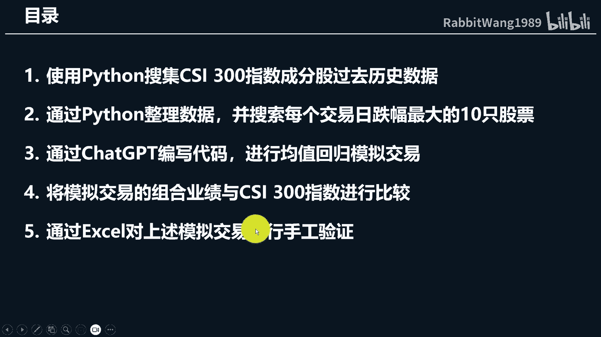

跟实际的这个逻辑一致，那希望大家喜欢呃，现在我们已经在jupital lab啊。

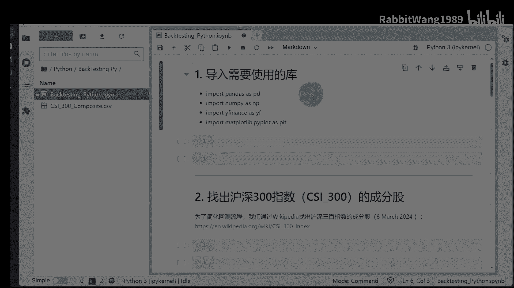

这样一个环境里面了，那如果我们要进行分析的话，我们第一步是要去导入各种各样的第三方库啊，包括pandas，non pi呃，WIFENCE或Mac pro live，那么分别是做数学运算啊。

啊下载金融数据以及绘图的这个第三方库，那我们把它复制进去，Shift enter，这样的话就把这个库给导入进去了，那我们第一步的话是要去找出，沪深300指数的一个成分股对吧，那我们这里为了简化流程。

我们就用这个WIKIPEDIA在这个24年3月8号，它更新的沪深300的成份股啊，作为一个依据进行一个回测，我们假设这个沪深300的这个成分股不变啊，就用这个3月8号，他公布的这个成分来进行回测。

那么下面有个链接，如果我们打开这个链接的话啊，就可以看到这样一个网页，是WIKIPEDIA对沪深300指数的一个解释，那往下翻的话，我们就可以看到他这里有个constitutes啊。

是在2024年3月8号，他更新的这个沪深300指数所有的一个成分股，包括这个股票的ticker是吧，它的一个代码，这公司的一个名称啊，比如说第一个是贵州茅台啊，它的板块的交易所。

以及它在这个指数里面的权重，那我们回到这个Python里面，然后我们在这里面其实已经放了一个CSV文件，它包含了这个沪深300指数的，所有的这个啊成分股内容。

那我们需要把它导入到这个Python环境里面啊，做成一个data frame的一个数据格式，那我们就用这个cs啊，CSI300是吧，等于PD点RT，因为它是一个CCV文件，然后我们冒号，然后1。1。

1杠，然后去搜索一下这个呃excel excel的文件，那CSV的文件shift enter，然后我们看一下我们最后那个导入的data frame，长什么样子啊，就是这样一个数据的格式。

只不过这里多了一个index，当然他这里的ticker好像还有当中有个问号，可能是一个特殊的一个字符，那第二步的话，我们是要将这个公司的标识修改成y finance。

雅虎finance能够识别的tick，那主要原因是什么呢，我们可以看下这里一个雅虎FINNESE的一个网页，那因为我们待会需要用雅虎finance，它提供的第三方库啊，去获取各个公司的一个价格信息。

我们知道很多的第三方金融软件，它如果要去获取证券的这个价格信息的话，一定要有这个正确的一个标识，那么这雅虎的finance is的这个标识，其实就是这个上市公司的一个，在交易所的一个代码。

然后点和后面一个简写SES1就是深圳嘛，然后我们其实可以翻到这个刚才一个啊，WIKIP地啊，这里一个ticker其实是有一定规律的，SSE其实就是上海交易所对吧，然后后面是交易所呃，就是这个公司的代码。

那如果是深圳的话，是SESE啊，30075，那我们看到雅虎finance is，它其实是反过来的，把公司的这个编码放在前面加一点，然后再是交易所的一个啊标识，那么的话我们就需要进行一个啊修改。

那首先我们可以看一下，比如说我们举个例子啊，这样啊我们选择这个ticker，我们看看第一个公司就是刚才那个贵州茅台，那是SSE啊，问号600519，我们需要把这个呃文本里面的600519，提出来。

放在前面加一点，然后再是SSS嘛对吧，这样一个方式，那我们把这个复制扩来，那么首先是怎么去抓取这个后面的这个六位，其实也是一个括号，我们可以用一个六，然后冒号零，这样的话我们可以看到啊，这个不是零。

我们可以把这个零给去掉，冒号，这样的话，我们就把这个呃一串文本里面，后面有六位给抓出来了，如果要去抓取它的前两位的话，那我们就应该是冒号，然后是二，这样的话就把额就是第二位及以前。

所有的字符全部抓取起来了，这样的话我们就可以去定义一个公式，叫做y finance ticker括号，然后当里面我们就写ticker吧，那这个公式要干什么呢，要return给我们一个字符串。

那这个字符串是这个ticker它的最后六位到额，从最后一位到倒数第六位的所有的字符对吧，然后再和一个点进行一个关联，在提取这个字符的前两位就是前两位，我们就把这个地方给，复制一下。

然后这里应该就是一个冒号二啊，我们这个shift enter以后，这个公式就被导入进去了，我们随便试试看啊，就比如说我们把这个刚才的一个，贵州茅台的这个文本给装进去，看看他有没有改造成功。

哎我们发现这时候就啊改造成功了，这样的话，我们后面就是需要对整个这个cs300的data frame，进行改造，我们怎么来弄呢，我们给它增加一个数据列，就叫做y finance ticker。

然后这个WIFX的这个这个数据列，它应该是这里的一个原始的，我们把这里一个也大写吧，他既然第一个大写哦，我们这里有小写吧，我反正是ticker，他去apply。

然后这个apply里面我们是用这个lambda，啊这样一个公式，我们shift enter，然后我们这个时候再看一下，刚才CCI300这样一个呃data frame。

我们就发现在最后一列增加了WIFANTICKER，就是对这个ticker的一个修正对吧，修正这样的话，我们其实就可以把这个cs300啊，这样一个额数据给提出来，那我们看到在旁边的一栏里面。

我们就有了这样一个呃CSV的一个文件，有了这样一个啊ticker。

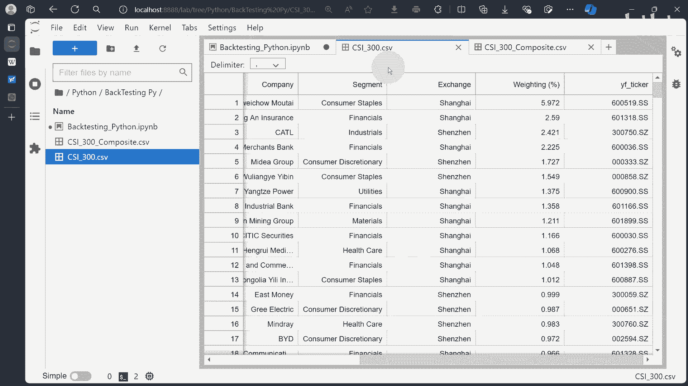

那后面我们要怎么做呢，我们可以就是后面借助一下ChatGPT p对吧。

因为如果大家对这个代码不是很熟悉的话，我们可以完全啊，我们先看一下我们这里prompt吧，我们后面一步就是要去啊，这是那个第四部了，第四部第四步话我们主要是什么呢，就是要根据这个刚才一个CSV文件里面。

这个ticker去搜集权重股过去的一个股价信息，那我们的做法是什么呢，我为了方便简便啊，因为很多同学可能对这个呃写代码，这个事情不是很熟悉，那么其实有了这个人工智能。

包括chat gt或者各种各样的GDP之后，其实我们写代码的这个过程被简化了很多，其实我们更需要的是了解自己有什么样的需求，那我这里的话已经把这个东西给写好了，就是说我们完全可以把我们刚才的这个CSI。

300CSV文件上传到这个chat gp中啊，请chat GDP帮我们去撰写代码，那么有一个使用GDP的一个很关键的内容，就是这个提词器prompt，就是我们的需求是什么东西。

那我这里面已经把这个需求给写好了，就说我们在这个cs five里面，然后对吧，我们有一个call in叫做WIFTICKER，然后他肯定了很多的这个呃，stocks的这个标识名称。

那我们需要去抓取这些股票，过去两年的历史股价信息对吧，是从雅虎finance is里面，然后呃把它们用pandas进行封装，包装成一个data frame。

然后我们要把这个data frame命名为这个CSI300，historic price这样一个data frame一个名名字对吧。

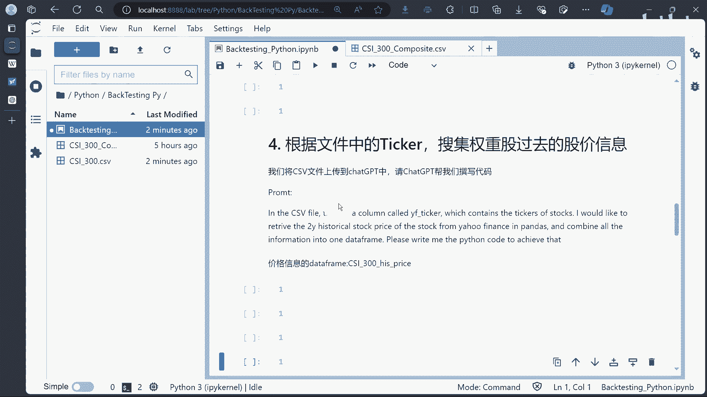

那我们就回到这个chat GDP，然后我们把刚才的一个C4I300。

这个文件呢给拖拽进去，然后我们回到这个界面，然后直接把这个prompts啊给复制过来。

然后我们粘贴到这个chat gt t这个对话框里面，那这时候我们这个文件也上传成功了，我们请我们把这个这个内容给上载上去，然后这个CHEDP就开始进行分析了，啊我们看他现在已经开始在写这个代码了。

我们稍微等一下，现在已经把这个代码给写完了，在他的这个右上角有一个copy，我们copy一下。

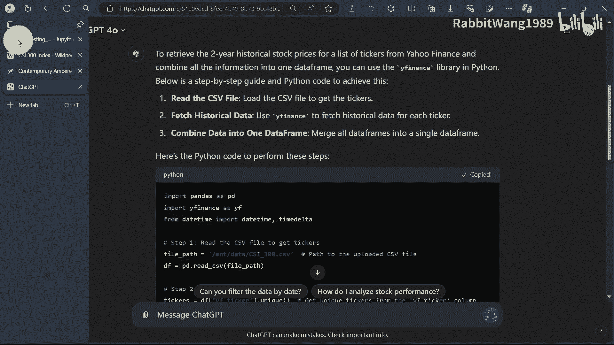

然后回到这个界面里，然后我们把这个给啊复制进去，然后呃这个复制进去，代码不是说就直接可以去跑，有的时候还是要对它进行手工的一个调整，就比如说这个pandas和yo finance as。

其实我们刚才已经安装过了，我们就没必要安装了对吧，当然这个daytime，我们刚才没有把它给导入到最开始的库里面，我们可以把这里面给进行一个保留，然后这里面一个发pass什么什么东西的。

其实主要是去读这个cf csv的这个法案，其实我们也可以啊，我们可以用，比如说我们就根据他的来，然后我们这里有个CCV300对吧，然后他把这个DF再读一遍，没问题，我们就用他的这个来啊，也问题不大。

最后的一个这个什么print all什么东西的额，我都觉得没有必要去保留，包括他把他打那个下载到我们本地，把这个cs文呃，这个文本下载到本地，我觉得也没有问题。

那么他现在这个对这个呃data frame的命名是all data，我觉得没问题啊，然后我们就shift enter，那这个时候我们看他在跑，然后下面有一行行的这个下载的一个流程。

就是我们从雅虎FINNEAS下载，因为这里面有大概300多只股票，所以这个需要啊等一会儿时间，啊现在我们看这个他这个已经跑好了对吧，然后这里有很多下载的东西。

我们可以右键一下把这些这个output给清除掉，因为这个output也没有问题，也没有用，然后我们看一下这个all data它长什么样子啊，就长这个样子呃，它里面有各种各样的一个信息对吧，额我们拉到底。

然后他有这里面的一个日期啊，以及它的开盘价，最高价最低价啊，他的一个clothes以及adjust clothes啊，交易量以及它的一个ticker啊，这样一个信息，然后行数的话。

我们这里有大概个十百千万10万14万行，因为是300只股票啊，他是时间是多少啊，我们看一下是过去两年的一个价格信息对吧，我们就回测两年，那么这个数据是量是比较大的，那么为了统一它的一个命名对吧。

我刚才说了，这个cs i300是作为我这个data frame的名字，因为我后面可能很多引用就是用这个东西，我就直接等于O，然后一个data这样的话。

我们就把这个呃data frame命名为这样一个东西，那么后面一步我们是需要把公司每日的这个呃，根据这个公司的这个每个证券的一个价格，它的一个close price去计算它的一个收益率对吧。

因为我们是要呃这个均值回归的策略，是要提取每个交易日里面呃，跌幅最高的这个呃股票，所以收益率计算是非常重要的，那我们直接用这样一个额列，然后我们可以给它增加增加额，就刚才一个cs300。

historical price增加一个return的这样一个列，那这个return的话就应该是等于cs300里面，然后我们是根据他的这个close price呃，呃不是adjust price。

Adjust price，它会调整公司的一个分红，以及一个呃分股的这样一个情况，那我们还是用它的一个原有的骨架吧，就是个close price来算，然后我们这里选择close，选择一个close。

然后我们这里是用个p c t percentage change，这里好像没有显示出来哦，哦这可能反应比较慢，他现在出来了，啊percentage change，然后我们用一个括号，这个跑好了。

然后我们再看一下这个C300，Historic price，这个的时候嗯，他在这个结尾处就有个return这样一个data，然后是他的一个啊，每日的一个价格变动情况，那么它可能会出现NA的情况。

因为第一个日期，他可能就没有一个收益率计算了嘛，那这个时候我们可以再用一个drop now，然后in place，in place的话应该是等于true对吧，就在原有数据上进行一个覆盖。

这时候我们再看一下，然后他的这个第一列就没有这个NA的这个啊，就是没有没有NA的这样一个数据，数据内容，在那这个东西叫historical price吗，为了避免歧义，我们就把这个，呃再重新命名一下。

他应该是呃historical ucs300，然后是一个return，啊这样一个东西，那有了收益率信息以后，我们需要找出每个交易日跌幅最大的，这个十只股票。

那我们还是借助这个刚才一个cheat gp p，那我们首先可以把刚才一个CSC呃，300这样一个return也去导到一个CSV文件里面去，这样的话我们在旁边就看到了这个CSV啊，return的啊。

这样一个信息其实跟刚才的一个差不多，只不过在后面多了一个return收益率是吧，然后啊同样的我们切换到这个chat GDP。

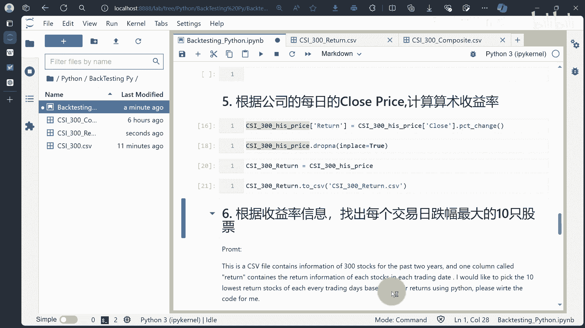

我们把这个return的数据表，CSV文件上传上传到这个呃那个CHEGP，只不过这个文件会比较大，里面我看了下，大概现在有呃，20兆左右的一个一个一个表格的一个大小。

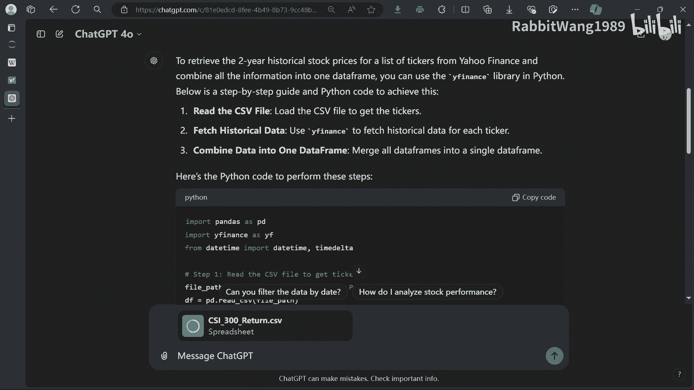

然后我们回到这个Python里面，我这里的话已经把这个提词器给写好了啊，就是呃讲的话就是说这个cs p e file里面，它包含了300个股票，在过去两年的一个啊信息对吧。

其中有一个QUN叫做return啊，我们可以把这个return，因为刚才这个return是这个大写的，我们就把这里面改成大写呃。

Contest the return information of stock in each trading date，那我希望现在啊选取这个每个工作日里面，每个交易日里面。

这个这个十个回报率最低的股票，也就是跌幅最大的股票对吧，根据他的这个啊returns information，然后我们要用Python，然后希望这个chat gp给我写个Python的code。

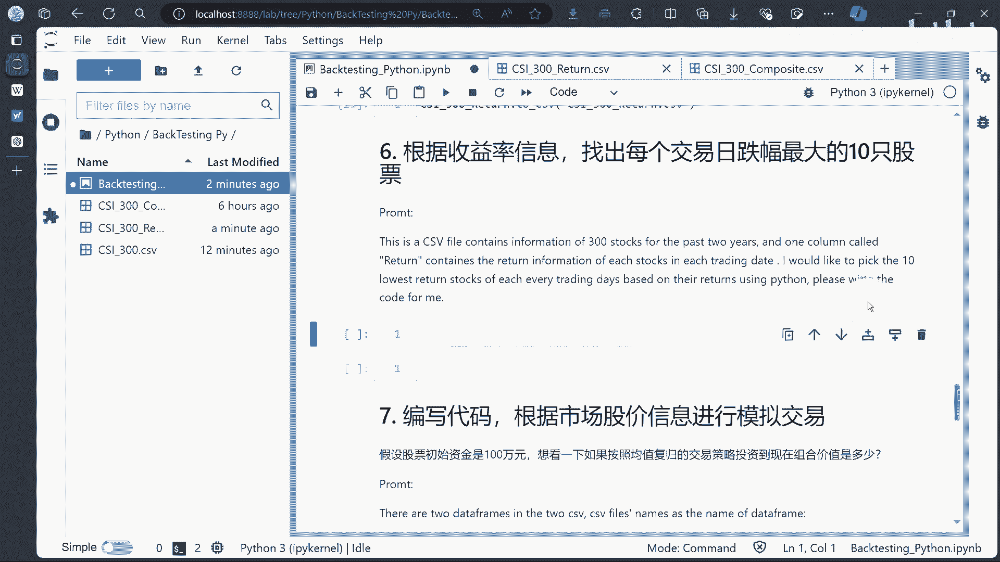

然后我们把这个东西再复制回到这个界面里面，然后我们把这一段给复制过去，把这个提词器给复制过去，当然我这里有些拼写错误图可以纠正一下，然后我们呃导入进去，然后这个时候这个下级批，请帮我把这个代码给写好了。

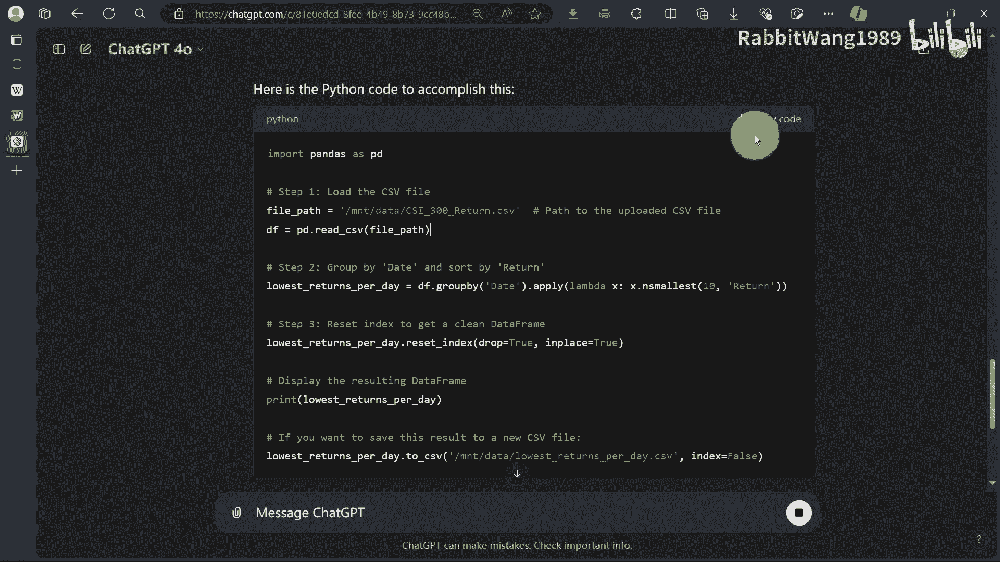

我可以同样的把这个给拷贝一下，那么回到刚才的一个界面，然后在下面我们复制一下，那这个pandas可以不用去再装载了，第一步是把这个呃CISFI给load进去，那没问题，我们可以再load1遍。

其实就是这个return information对吧，然后DF就是等于啊这个file path里面，那个这个我们刚才的一个，其实就是我们刚才一个cs300，这个return只不过再重复导入一遍啊。

我是为了避免后面这些命名规则不同，导致这个跑的错误，所以我就直接再去捞一遍，其实如果大家能自己习惯写的话，可以完全不必这样啊，否则这样的话计算机的内存会占用很大，然后后面就会去跑这样一个代码。

那最后一个print我觉得也不用，也不用把它导入成CSB，我们可以待会先看一下什么样一个状况，那么他最后导出来的叫做是lowest return per day。

这样一个这样一个data frame对吧，我们把这个代码给跑一遍，然后我们把这个data frame，我们看一下现在是什么样的状况啊，他现在就把这个啊data frame给这个，导出来了。

那么这个是收益率最低的这个十个股票呃，我发现这个data frame的话，它的index很多，然后我其实觉得可以drop掉一些内容，就比如说我们首先可以drop。

然后括号我们把这个n named的这个第一，第一个内容给复制进去，我们把这个东西给drop掉，他这一个label啊，我们直接用这个column吧，啊已经把这个给drop掉了。

然后我们可以再加个in place等于true啊，对的确有，这样的话这个law return里面，他刚才一个多余的东西就没有了，多余的东西就没有了，只有这样一个代码。

然后我们可以再reset一下index，有的时候这个index是不大对的，可能需要点时间啊，啊直接写吧，Reset index in a，No no in place，Resets index。

那这样的话我们啊当中再加个drop，就是把之前的一个index给去除掉，这样的话我们就把这个它的index重新的编写一下，那么这个就是一个完整的一个啊，我们就是根据这样一个表，我们其实也可以验证一下。

因为我们刚才已经有了这个啊，原始的一个历史信息嘛，我们可以把这里面的一个return的一个excel表打开，我们把这个excel表给拖拽过来，让我们自己看一下，这就是这个啊所有的股票啊，内容很多。

14万行是吧，然后我们看一下刚才我们data frame里面，它有个9月2号，可能有些股票它之前没有上市啊，所以没有这个股价信息，但这个不妨碍啊，就比如说我们这里选一个，他这里是多少，2022年的。

2022年的9月2号对吧，然后我们可以先filter，filter一下，然后我们要回返回的就是这个公司的一个代码，公司的一个代码和他的一个股价信息对吧，然后我们filter的那个标准是什么东西。

是这一行的信息都要等于我的这个日期，这样的话我们就把当天有股价的这呃，有收益率对吧，有收益率的这个股票的这个信息，以及它收益率啊，这个内容都复制过来了，然后我们第二步，其实是要根据这个东西进行一个排序。

我们可以用sold by，但是我们排序的标准是这里面的第二行，这个也没有问题，那我们这里就直接用sorts by，然后我们排序的规律是，这个index我们可以先看一下啊，如果我这里用一个index的话。

选择这个第二行，然后其中我们呃这个行数给空掉，然后QUN这里一个number选二的话，他就返返回给我这个第二行的一个所有的数据，然后待会我就需要从小到大对它进行一个排序，嘛对吧。

然后我们完全可以把这里面的一个公式给啊，复制过来得到的结果是一样的，我们再把这个公式复制到原原来的一个地方去，然后我们这里用个sorts，这里用个sold by，然后我们这个排序的依据。

就是刚才我们说的那一个数据列，然后它的排序的一个标准是这个ascending，就是从小到大，我们选择这个一括号，这样的话就把我们额这个刚才的9月2号，这一天的这个时间都排完了，我们可以看一下啊。

从小到大他的一个排序是怎么样的，还有一位，那这就是从小到大前十位的一个数据对吧，然后我们跟刚才的一个Python进行一个比较对吧，他这个是我们把直接把这个呃，Lose price return。

我们导到cs1吧，我们在这里面再打开一下啊，就就有这样一个信息，那么9月2号这里面有这样十只股票对吧，我们可以对比一下，我们刚才说的对不对，那么第一只股票是这个663个零，10。14呃，SS对吧。

然后收益率是这个东西，信息跟我excel算出来是这样的，第二位是601328点S4，跟我excel算出来的也是一样的，第三位啊，我们可以先看下第十位，第十位是60089600啊，八九上面是600啊。

000016S1对吧，说明是一样的，我们其实可以再把这个日期改一下，比如说是6月3号，应该是没有交易日的，那也就是6月5号，6月5号啊，99月5号，9月5号我们再提取一下。

看看这个跌幅最大的十只股票是不是一样，这里是9月的5号对吧，第一只股票是600196SS，600196点S啊，跟我们算的一样，第二个是688041点S，688041点S啊，其实跟我们算的一样的啊。

说明我们之前几个处理的结果都是对的好，我们也可以把这个excel的这个表格给关闭，其实没什么用了，我们接着来看这个Python，那么下面的话我们就是要去编写一个代码。

那么根据市场的股价信息进行一个模拟交易，我们现在其实已经有了这个呃，每日最低的这个跌幅最大的一个股票对吧，然后还有一个是那个啊我们那个股价信息，我们根据这样两张表就可以去编写代码，去模拟我们的交易。

那我们假设我们股票的初始投资资金，是100万元，我想看一下，按照这个均值复归的这个交易策略，我去投资投资每天跌的最凶的十只股票，然后第二天卖出，然后再用这个卖出的钱去投当天呃，这个跌幅最凶的只股票。

那么在两年，在两年的这个投资期里面，我到最后一天，我组合支期出呃，初始资金是100万，最后的一个日中的一个价格是多少，那我这里也是同样是请这个chat GDP，帮我去写这样一个额代码额。

我们可以把刚才的一个文件名字，和我这里面prompt啊，这个这个信息给保持呃一致啊，就比如说呃我们这里的一个啊，股票的一个历史数据的这个信息叫做cs300，Historical price，呃。

我们其实有没有这个东西啊，historical price看看有没有return啊，呃，这应该是composite，然后这个是300，Composits，Composit，就是return。

那我们把这里面提词器的内容给改掉吧，这里就不要historical这个这个这个300的这个price，我们就直接改成一个return，然后他的这个也不叫lois return every day啊。

因为这是我之前做的一次啊，然后我们把这里面的这个lois return every day，我们改成一个lois return per day，我也不知道为什么他一次性复制会复制两遍，那么这样一个信息。

啊这样就是我的一个梯次信息，啊然后我们回到这个chat GDP的一个界面。

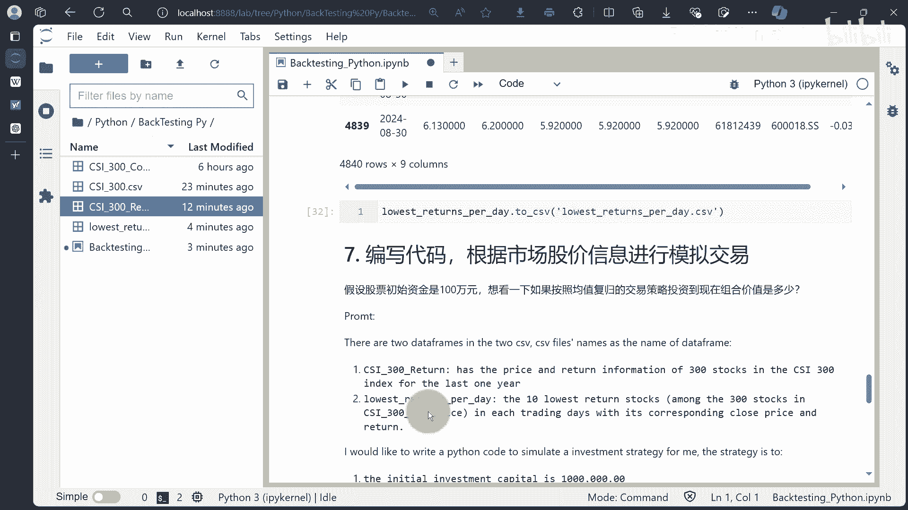

同样的，我们需要把刚才我下载下来的这个a lowest return，以及我的一个C四I300return，这样一个信息我给导入进去啊，两张表格都比较大。

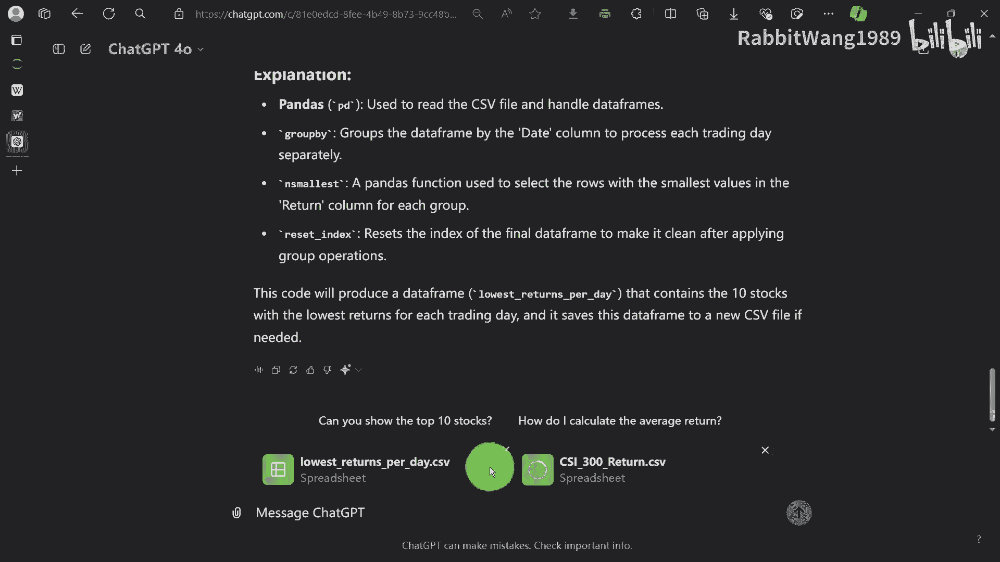

我们回到这样的界面，把我们刚才的一个prompt，然后这样一个比较长的一个啊文字给复制下来。

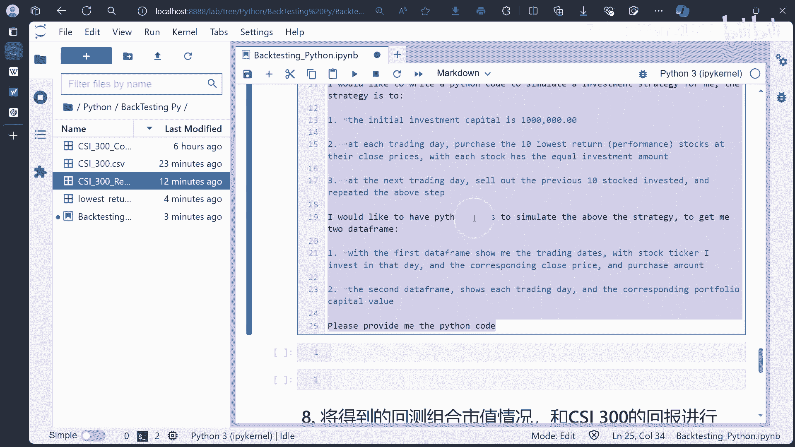

然后我们啊回到chat GDP，这个时候我们这个文件也上传啊，结束了，然后我们呃提交上去，这个时候这个啊，charge p就开始分析这个两个CSV的文件，同时开始帮我去写这个代码啊。

它也会直接显示我上载的一个CSV文件，长什么样子，我还在写啊，回测的这个代码还是比较复杂的，这就是为什么使用chat gp了，就说如果你自己要去写这个代码吧，可以第一个会费很长时间对吧。

你要把这里面的逻辑结构都想清楚，可能还会写错，那么Python的话就它比较省力的是什么，他他把所有的这个代码都给你写好，每一步在干什么也给你写进去，那么你只要有一定的这个代码基础啊。

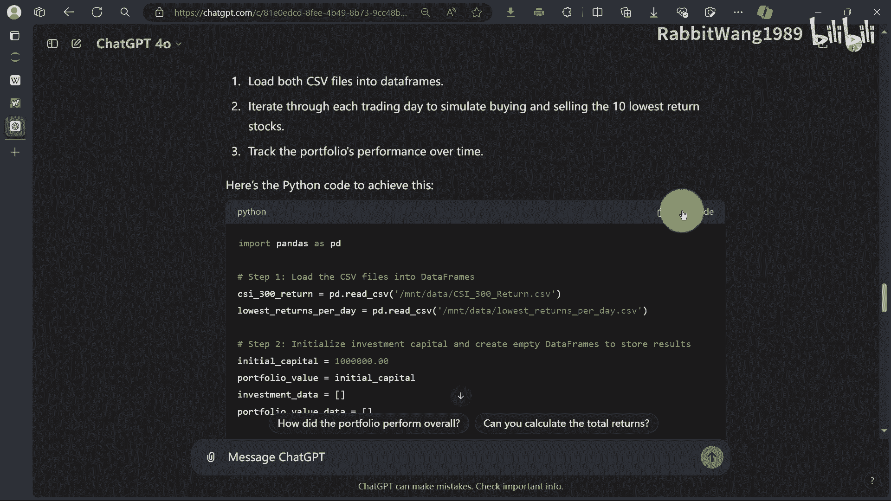

就可以根据他写的内容进行二次加工，这样的话会比你自己去写整套代码会方便很多，那我们把这个代码全部复制进去，首先这个import pandas就肯定没有必要了，是吧啊。

这里的一个import pandas肯定就是必要了，我们把它给删除掉，那么第一步的话是把这个c f v low load进去呃，我们还是自己漏呃，把这个漏漏进去吧，因为因为他这个代码比较长啊。

让我手工去改，改成跟刚才的一样的话，可能会比较麻烦，它首先是CSI小写的300return，对吧啊，没关系，我们就把它改成这个我们文件的这个地址。

同样的这里面是lewis return per per day啊，这两这个名字倒是一致的，然后我们第二步我们可以稍微扫一扫，它首先是设置了一个初始的这个金额，100万是initial capital。

然后put pto value是开始是等于这个initial capital的，对吧，investment date是一个列啊，创建两个列，然后呃get you need trading date。

就是他要把所有的交易日一个日期给列出来，其实也不用用ink的哎，用用ink day给，因为股票比较多，很多日期是重复了，那就把这些重复的给去重，然后开始一个循环额，其实我也不想看当中他怎么去写了。

这个比较复杂啊，我们就可以直接跑跑，看它的一个结果是不是正确，那么下面是display，以及把这些跑出来的结果啊，给他那个导成那个CSB，那我们可以回到下回下看一下，我们刚才那个这个提词器怎么说的。

就说我先跟他描述一下，我这里有两个data frame，就说提词器怎么写非常重要，其实因为XGP是机器嘛，你写的越清楚越详细，它给你的这个回测这个结果，就是给你提供的那个解答会越准确。

那首先我把他这个呃文件说明一下，我有两个CSV呃，分别装载了两个data frame，然后呃这个呃文件的名字，就是这个data frame的这个名字对吧。

然后呃第一个这个data frame里面它有什么东西呢，主要是这个300个股票的一个历史价格信息，然后第二个的话是他那个呃每个交易日，它最低回报最低的这个股票，其实我这里有点写错了。

我应该改成一个two year，Two year，Two year two year，这可能会导致我刚才回测的结果不准，然后我们可以看一下啊，啊这个都没问题，我觉得我有必要的话。

我应该把这个东西重新复制。

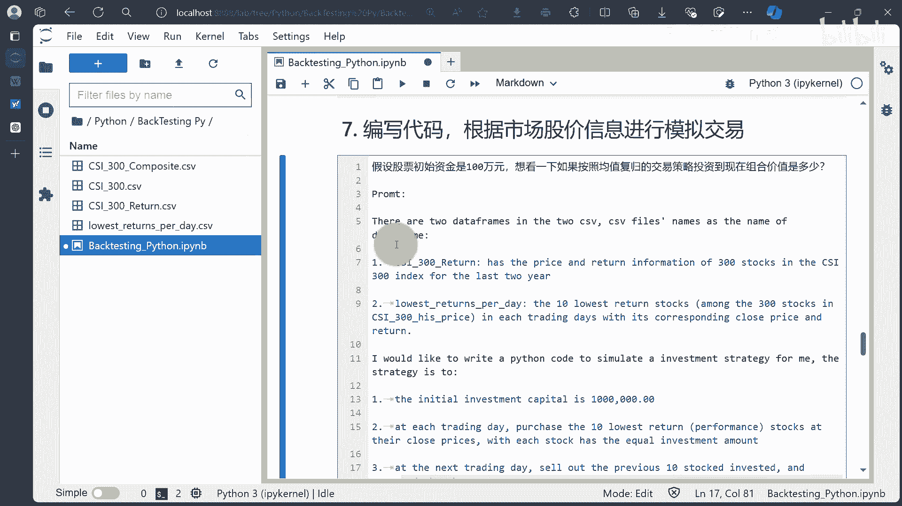

再去这个导一遍，因为刚才这个不大对，我们可以看一下啊。

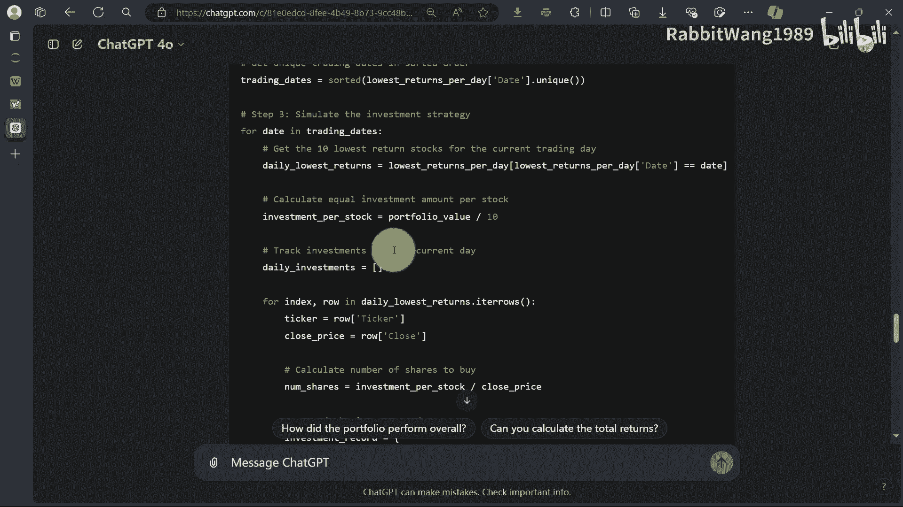

其实没问题，他这个date话就是用这个date，You need date，它并没有说一年，那我这里prompt刚才其实是没有写清楚，我写成了一个一年对吧，然后后面就是我的一个策略。

就是我期出有100万，然后每个交易日去买十只呃，这个跌幅最大的一个股票，然后用这个呃，用这个钱每呃等份的去投这个十只股票对吧，然后第二个工作日把这十只股票都卖掉，然后把额拿回来的本金继续上一个步骤。

那我想看下两年之后，我的一个啊投资的一个结果怎么样，那投资它模拟交易，他给我两个data frame，那第一个data frame是呃，显示我每个交易日我每个我我买的一个股票。

它的一个啊一个一个ticker，以及他的一个啊对应的我买进去的一个金额，那么第二个data frame主要显示的是我每个交易日，我的一个portfolio的一个capital value。

也就是说我的一个组合的一个价格，那么跑出来他给我提供这样一个代码，是呃这样的，然后我们去润一下看看，最后给我们生成的就是investment df，还有个portal value df。

你看put to file value df是我们比较关注的，就是我们的一个组合的一个价格情况对吧，我们去跑一下这个代码，那么有的时候这么长的代码，它可能会跑出问题，我们就要进行一个修改。

我们现在就在一个跑的一个过程中，好这次好像比较顺利，没有出现什么问题，我们希望这个结果也比较准啊，然后我们把这个portfolio df啊复制进去，我们可以看到这里面是呃。

F2024年8月30号还是100万，那说明我们的代码是其实有点问题，那这个代码的问题在哪里，其实这个代码比较长，而且我第一次这个prompt写的有点问题，所以我习惯的做法就是，我索性把这个代码全部擦掉。

因为这也毕竟是那个ChatGPT给我写的，我其实把它删删掉，我也不心疼是吧，然后回到这个，我们可以把这个prompt啊直接再去复制一下，然后是two year，然后我们把这个代码去复制一下。

那么回到这个chat gp界面，我索性就把刚才的一个呃，300和这个lows return这个data frame csv文件，我再重新上载一次，然后我再把诉求给贴进去，然后这个300的这个价格信息。

因为有十几万条数据，大概20多兆，所以上展需要一点时间，我们看这个上载已经完成了，然后我们清这个加载，然后我们让这个chat GDP，重新对这个code进行一个分析，然后我们看一下跑一下什么结结果。

啊第一次还是去load这个CSP元件对吧，然后是他把一个步骤给写清楚了，看它自动去生成这些代码，其实还是蛮爽的一个过程，最后这些print什么东西，我们其实可以先省略掉。

那我们直接去右上角copy最喜欢的一个动作。

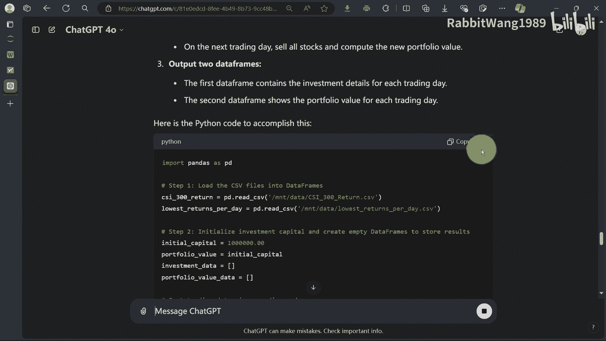

然后我们然后把这个代码给复制进去，然后我们把这里面的一个地址改一下啊，return的话，我们就是这个cc300return对吧，然后他下面是lois return per day。

然后我们去把这里面的一个地址做一个修改，Lost return per day，那pandas的话不需要再重复导入了，结尾的话我们先不要去啊，print我们只要有这两个DF。

这两个data frame就可以了，我把下面部分都删除掉，然后我们再print，好看现在已经结果跑好了啊，那又再见证一下，看看我们这个数据是不是对唉，这次好像这个结果就比较对，开头是大概100多万。

最后是48点几万啊，然后我们其实可以把这个结果额to csv，大家不要慌啊，就说我这里可能是出现错误，待会我会用excel的方式去算一下，这个结果是不是对啊，去会再对它进行一个对比，我们把这个导出到啊。

这最后一个名称没有去呃那个书写，然后我们再导一遍，然后这个文件可以去呃，delete啊，然后我们看一下这个CSV，这个的话就是我这个PORTFOO的一个value，最初二0022年9月5号是108啊。

100万8000多块对吧，但可能这两年这个国内的大盘不是特别好，到这个2024年8月3号用这个均值复归，至少我用Python去跑出来的，回归的结果是48万额，这个6000多元亏损还是比较严重的。

那这个是我的一个普通fu value嘛，那接下来我只想去呃，让我这个回测的这个市值的情况，和我直接投资这个那个cs300，他的一个回报进行一个对比，那我还有一种投资方法，就是说我比较傻。

我就开始是100万，我就直接投到这个呃，是沪深300这个指数的一个基金对吧，然后我就一次性去一次性去投，也不用我刚才一个回撤策略了，不要动脑筋，因为市面上这种ETF。

跟踪这个沪深300指数的ETF也很多，那我就投资这个100万，然后from the cindy as my simulated strategy。

然后再去keep my position on hold，就相当于我这个场口不去做任何调仓，然后呃，我希望然后这个Python的code，能帮我去从雅虎finance去下载这个cs300。

这个index的一个价格信息对吧，然后去计算一下我组合，就是我直接投资这个cs300ETF的这个组合，的一个价格，并且和我刚才的一个策略进行一个对比，然后，最后的话我希望有一个图表就是please呃。

Present，Present the comparison，With using using line chart，Piece right，Python code啊，这是我的一个提词器。

那主要因为这个ChatGPT还是国外的一个呃，GDPGDP嘛，所以说那个用英语写的话能更好的得到，我需要得到一个结果，所以呃不管是写什么代码的时候，我还是更习惯的去使用啊。

就是说这个这个英文去描述我的一个需求，那这个时候其实我们也没什么CSV文件，要去上传了，我直接在这个地方，把我刚才的一个需求给打进去，当然这里下划线可能是我这里一些拼写的错误，我们可以把它纠正。

啊然后我们直接把这个需求打到chat g p里面。

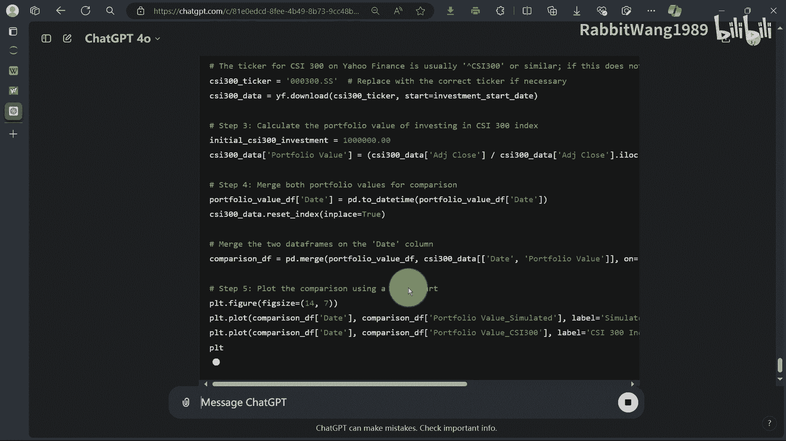

然后我们把这个code给copy一下，然后把它贴到这里面再进行一个加工，那么像这个panda wifense map polar lib，我之前都装载过了，不用了，同样删除。

然后这里一个put for value啊，我们是直接把它给down过来了，所以这里面也是有CSV的啊，我们可以把它给给删掉，然后，找到刚才一个put fo value这个cs。

这样的话这个我们就重新加载一遍也没有问题，然后，这些代码可以再看一遍，有什么需要的吗，其实我觉得也没什么可以修改的，我直接去run一下shift enter啊，这个时候他就给我做两张图对吧。

上面写的很清楚，这个画蓝线的是simullatest strategy，我们投资的一个组合的一个情况，那么很显然在2023年7月的时候，我去用这个均值复归，可能啊，在2023年4月之前。

我用均值复归这样一个交易策略，可能还跑赢了，我这个直接去投资cs300的这个index，当2023年7月开始，这个明显我的这个均值复归的策略，其实是跑出他的一个啊。

这个这个cs300的这个index的啊，就比较直接对吧，他已经把我这个组合的这个线给排出来了，那其实我现在也比较好奇，就说我刚才很多这个代码并不是我自己写的，我是让Python去给我写的，他写的对不对。

我其实不了解对吧，尤其是这个portful value，他算的准不准，这个我吃不准，但是我其实是有这个C300就是return information的，其实我用excel表。

其实可以手工的把这个交易策略给复现的，那么我接下来做的一步就是去复现一下，这样一个啊return的一个过程去验证一下，我刚才这个Python的这个code跑出来结果是不是正确。

然后我们已经把这个啊C300，这个return的这个呃数据给调阅出来啊，数据量比较大啊，有一呃14万多行，所以我待会excel啊，excel去计算的时候速度会比较慢啊，这就是为什么会用Python。

因为Python毕竟他有第三方库啊，很多底层的这个语言是C对吧，嗯去读这些数据的话速度会比较快，用excel去运算的话，速度就会比较慢一点，那首先最重要的就是这个啊date date这个信息对吧。

然后我们这里就完全是可以用unique，然后选中整个列，这样的话这样唯一的这个数据就给下载下来了，然后我们把这里面的信息调整成date，然后我们怕这里面的日期呃，比如说有出现额那个前后鼻致。

我们就salt一下，然后他是从小到大每天的信息都有，那么第二个事情就是我要去filter一下，就是2022年9月2号，它所有出现过的这个债券价格的一个代码，我其实有两个维度，第一个我需要去筛选的是呃。

这个二0222年9月2号，它出现的所有这个TIKER的一个情况，第二个是我要去筛选，就是他ticker，我要从小到大去选出最小的，就是这个跌幅最大的这个十度股票，其实这里用excel也是可以的。

那我们首先用这个filter，那我们要filter什么东西呢，我们FUFILTER就是啊ticker和return这两个数据列对吧，然后我们的一个准这个标准是这个日期里面。

出现过9月2号的这个日期的这个信息，这样的话他就把这个这里应该是有可能，300个不到啊，有些股票当时可能没加进成分股里面，你看这里就是298只股票啊，这就是为什么我们这个模拟是有点瑕疵的。

因为刚才在这个策略里面，我们假设的是，这个沪深300的这个权重股没发生变化，我们是用一个2024年3月8号的这个指数，但这不影响我们这个大致的一个准确性啊，然后这样的话，我们把这个第一步给呃计算出来了。

第二步的话其实我们需要进行对这个啊，对这个我们其实只要一个这个，这个taker的一个信息嘛，我们其实不需要这个价格信息，但价格信息重要在什么东西呢，我们要把这个跌幅最大的这个，实股股票给筛选出来。

那么这个时候的话啊，同样的我们刚刚其实已经学过了嘛，我们可以用这个，Index uh，去选中他的一个第二列，这样的话我们价格信息就有了，那这个地方的话我们就可以用，其实一个非常非常牛逼的一个。

我个人认为一个非常非常牛逼的这个公式，就是啊excel的let，我不知道有多少同学是会用这个let这个公式的，但这个let这个公式真的是，我觉得就有点编程的这个含义在里面了，如果大家想学编程的话。

其实我觉得最开始可以把excel好好学一下，因为excel现在360版本的里面，包括了很多很多公式，其实是有一点编程思维在里面的，所以其实你要学编程，其实开始的时候不一定要去直接碰编程软件。

我觉得可以把excel学好，因为它里面很多函数其实就有参数这种想法，那么let其实是很接近一个编程语言的，这个呃函数，但是你需要有一点这个编程的一个思维，那这个里面的话。

第一个是对这个let里面的所有的这个参数，进行一个命名，那比如说我这个呃，我是刚才根据日期，把这个那个股票的这个ticker，和他的一个回报率给额列出来了嘛。

那我就比如说这个地方叫做puter array，然后filter ray，它的定义的内容就是后面一个逗号的一个内容，对吧，你看第二个就是name values，一个是name。

第二个是name values，然后我如果我如果这里加上一个逗号shift enter，然后我们出第三个参数，它既可以是calculation，就是一个计算的一个值，也可以是下一个名字。

那我们其实还是要名字的，我们就是用一个salts index，那么这个sort index的话，就是应该是我用index这个函数返回来的，它其实就是这个filter ray。

filter array这一列的这个第二列的一个信息，那么我呃当中我行这个信息就留空，说明是所有的行都需要，然后第二列对吧，这样的话我把salt这个啊，这个这个这个index也算进去了。

那我第三个是要用salts sockethe，我需要对这个呃fter ray进行一个salt，我这里就是用个salt by，然后第一个第一个参数我们就直接用这个filter，第二个参数的话。

我们就用这个，它是用SBY哪一个东西，我们就用这个salt index，然后我们需要从小到大就是sending，最后我们先看一下啊，就说这个东西返回给我们是什么样的。

我们就比如说我们反传给我们一个sorted data，我们回车，我们看到这个东西，它就被我们给筛选过了，他是从那个-0。99对吧，到到那个到最下面是增长百分呃，55对吧，都都有。

接下来我们需要做的是那把这个source data给改掉，因为我们这里计算还没有完成，我们其实是要那个跌幅最凶的这个十个股票，那我们跌幅最凶的十个股票的话啊，我们可以看一下啊。

让我们想想看应该用什么东西额，我们这里可以用一个啊，就是跌幅最凶的，我们就是比如说是用个十，然后一个K，然后我们这里应该用用个small这样一个函数，然后把我们刚才的一个sot index给放进去。

然后他是倒数第十位的，那就是我们的一个10K，最后就是我们要返回给我们的一个函数，我们是要再去filter一下，我们要对这个filter ray再进行一个filter。

然后它的一个filter的一个标准，就是它的一个salt index，是需要小于等于这个10K的，我们可以把这里面给，复制一下括号，啊那这里应该再有个括号，啊这个命名可能不大对啊，可能不能出现数字。

那就是ten k吧，然后我们把这个名字，给复制到这里，哎，这个时候我们就把这个跌幅最凶的这个十个股，票给反传过来了，那最后的话我们这里再加一个index，因为我们只要第一列嘛。

只要这个ticker的名字，并不需要他的一个额跌幅的一个信息，那roll的话也是同样的，所有的roll都需要，然后是一，然后我们这里再来一个括号，这样的话我们就回到了啊。

这个信息我们可以再把这个东西给transpose下，Transpose，在这里面我们再加个括号，这样的话啊，在这个9月2号当天，跌幅最凶的这个十个股票的这个taker我都有了，那像这里每天我们都需要嘛。

我们看一下，这里是到L，这样的话这个每一天我跌幅最凶的股票，我都有了，都有了是吧，然后现在我们要做的我们要做的第二步，因为这一列是这个TIKER名字，那有这个光有这个TIKER名字不行。

我还要知道在9月2号这一天，这十个贴克它的一个股价是多少，它的一个收盘价格是多少，这样我才能去判断，当天我是以多少的一个价格去买入这些股票的，那我们这里也是可以用这个，这个filter这个信息来。

Filter，然后我们要filter的array，就是这里面的一个close price close，然后他的条件其实有两个，第一个，我们把这里给删除，然后我们这里的一个条件有两个。

第一个是这里的所有的，所有的这个date是必须要等于9月2号的，第二个是他的ticker，要跟刚才我们这里的TK一样，那我们这里的话可以用啊两呃两个乘法来实现，那首先我们是这里的一个date。

我们锁定下单元格，他要等于刚才我里面，这里的一个单元格是9月2号的这个信息是吧，然后我们去括号再去，乘以括号减减，然后我们第二个是要这里面的一个ticker，要去等于这个里面这里的一个ticker。

然后括号括号，然后这样的话我们就其实筛选完毕了，我们算出来结果是43块七角，我们可以把它精确到两小时后，点后两位，当然这里面我都有些东西还要调整一下，就比如说这里面的这个单元格，我必须要锁定一下。

然后啊这里已经锁定了 b的话啊，我希望它的劣势不变的，所以我前面加一个呃美元符号，然后这里的一个红色的我是都可以变都没问题，这样的话啊，这里的话一个I145到104啊，这个这个地方我也必须去锁定它的。

所以我再锁定一下啊，这样的话应该就得到了这个结果，然后我们需要把这一个列给额复制下去，哎似乎有点不大对，我们看一下哪里不对，为什么出现了两个，我们再看一下我们刚才的这个单元格，这里没有锁定。

这里我得锁定一下，啊这样就会没问题了，啊对，我们看一下是不是十只股票啊，这里下面count显示十，说明这个没有问题，就是啊十个股票，然后我们是到V嘛，所以说选中所有单元格诶，为什么这里多一个。

那可能这两个股票相重了，那我们这里先把他的内容全部，复制一下，可能有两个股票的跌幅比较类似对吧，然后我们把这里面的，好没问题，现在应该是没问题了，然后我们把这里面的这个单元格的数据，全部复制下去。

这里因为数据量比较大，所以你看这里一个calculating，它是3%，4%，一直在跳转啊，需要一点时间，呃现在这个结果都被跑完了，然后我们就把这个两年里面，每天跌幅十个股票的交易代码。

以及它的跌幅最凶的十个代码，以及当日他的一个收盘价信息给啊弄出来了啊，后面一步有了这个这个这是这个收盘价，其实是我用来去买当天股票的，那我在这里需要再复制一下，然后把这里面的这个日期信息改成9月5号。

因为你光有一个这个当时买的价格不行，因为你第二天要用第二天的这个，收盘价去卖出嘛，所以我们要再去搞一个卖出的价格，我们看一下这里面是不是不是这个呃十行，这里也是这也是十呃，那个实列的一个信息。

我们可以用颜色把它给区分一下，也就这这里的这一块价格信息，主要是我用来啊去买这个股票用的，然后这里的十个价格是我第一天买的价格，在第二天我卖出的这个价格，得到是这样一个数据，然后是到AF嘛。

然后我们同样的啊，CTRLD把这个公式给复制下来啊，同样的，因为这个数据量实在是比较大，14万个数据，然后不停的去filter，根据日期filter，所以这个过程非常的一个长，所以我们这里可以等一会。

然后我们看到这里现在数据也被填满了，说明这个全部跑完了，那这样的话我们红色的额，第一天买入的价格以及第二天绿色卖出的价格，这个信息啊都有了，我们甚至，哦这里有个spill是错误啊，这里没有复制到底。

这个没有复制到底唉，那我们需要把这个价格的信息再去补充一下呃，让我们想想看应该怎么去处理这样一个问题，那我们索性CTRLZ吧，估计是刚才那个哪里有一个问题再去跑一遍。

刚才我们估计就是有一个steel ray，他可能有一天，这个1月18号可能额跌幅最凶的十只股票，有两只股票跌幅一样，所以他给我了这个11只股票啊，所以产生了一点问题啊，然后当时没有注意到这个问题。

我们CTRLZ一下，啊主要是这里看到吗，主要是这里，然后我们可以怎么做呢，我们先把这个公式复制过去，然后，然后我们所有把所有的这个单元格，全部复制成这个呃文本对吧。

然后这样的话就没有spare bad了，然后再把这个删除啊对吧，这个这个这么小就无所谓了，现在的话我们这个呃两年的这个交易日，然后他每一天只有都只有十个股票，然后我们再把这个东西给拷贝过去啊。

当然把它这个颜色给标识一下啊，重复刚才一个步骤，那大家如果不想看的话，我待会儿就把这一段给切掉，我记得没错的话，应该是到VCTRLD，那我这里先暂停一下，待会直接好了，现在我刚才因为出现点错误啊。

所以就是所有东西全部重新跑了一次呃，当然用的时间比较长，所以我刚才也暂停一下，那么现在的话我们就把这个呃，两年的这个交易日呃，每每只股票对吧，它的跌幅最大的十只股票，它在第一天的这个收盘价格。

以及第二天的这个收盘价格啊，我全部导出来了，这样的话我们就有了计算，我们这个PORTFOO的一个基础，那我们这里比如说就叫做portfolio，然后我们的初始金额是100万对吧。

然后我们把这个格式变成这个再加一个千分符，再加一个千分符，我们可以把这个东西给引上去了，100万，然后我们的话这个股票每次投都是一个，这个等权重的，是那个1/10，那其实的话我们啊投资的这个金额。

然后他的份额我们主要是要计算它的份额，这样的话我们可以在计算他第二天收盘以后，卖出是多少金额对吧，然后我们同样是用let这个公式。

我还是特特别喜欢let啊，这样的话我们把这东西再再展开alt，然后他的一个initial capital，in是capital的话，就应该是我隔壁的这一行，这个啊，这个信息当然我们是要把这个列给锁定的。

那我们前面加一个美元符号，把这个东西给锁定下去，然后第二个，然后我们的，In individual investment，因为是我等权重去投资嘛，相当于就是我的initial capital去。

我知道有十只个股票，所以我就除以十对吧，这样的话我们就把individual investment，给算出来了，然后第三个就是我们要去求这个share shes的话，就应该是我的啊。

individual它的一个investment，去除语，我们可以直接把这一个，这一行或者说这一列全部选中啊，然后我们括号，啊这里应该逗号，那最后我们要返回的就是这个shes，啊我们在这里括号。

然后再一个括号，这样的话他一次性就把我10万块股票，我能买多少的这个股票都给算出来了，然后我们还是要用这个southern separator，我们可以算一下啊，这个10万块去除以啊。

这里面那个比如说我除以第一个数值是多少，啊是2288228832呃，2288329479啊，你看这里是228833对吧，那就说明我这里计算的结果是啊对的，那我这个这个是第一天的PORTFOO。

portfolio的一个金额，以及我投资股票的一个份数，那么第二天我其实就是可以用这个收盘价格，对吧，这里的一个收盘价格去乘以我的我的股数，算出我第二天的一个。

第二天的一个那个是portfoo tic value，那就是应该是some product，然后我是用头一天的每只股票的一个份额啊，去乘以这里的每天股票的一个价格。

然后我们就得到了这样一个呃组合的一个市值，当然我们可以把这里面的颜色给去掉，颜色给去掉，然后格式可以统一一下，然后这一个公式我们可以直接copy下去对吧，然后AH和H我们就copy两年CTRLD啊。

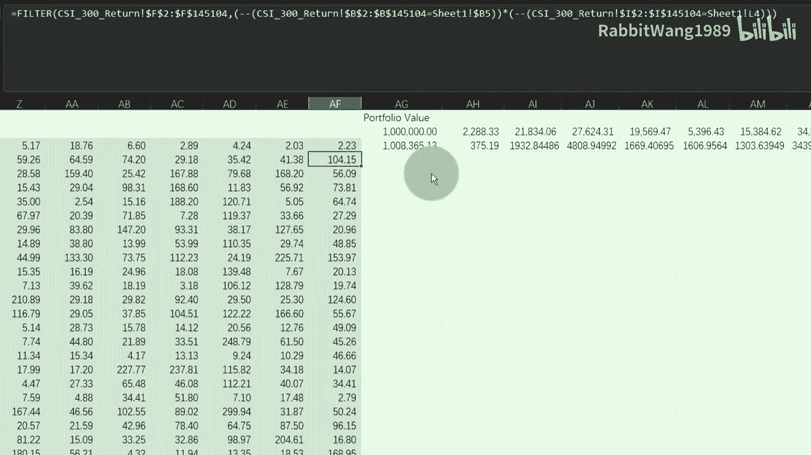

这样的话速度还是计算比较快的，我们看到最后的一个金额是48万，5810呃，48万5581块四角二，我们再跟我们刚才Python算出来的结果，进行一个核验额，我们这里啊这里大概也是四十八四呃。

50万不到吧，看起来好像是差了不远呃，我们这里是two ex呃，two csv了，我们可以把这CSV打开，我们得到的结果最后一天是48万6000多，好像是差不多还是有点差距，那我为了验证一下。

我这样计算的结果是不是准确，我把这个cs我把这个CSB1这个文件也打开，就是这个portfolio portfolio value df，也通过excel表进行打开啊。

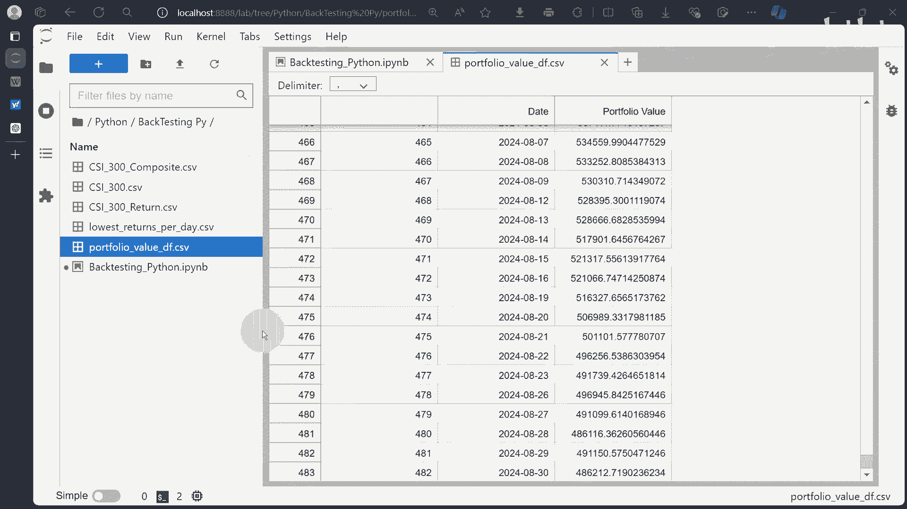

然后我们得到这样一个数据对吧，每天的这个日期，然后我们这里的这个价格，因为我头一天这里是9月2号，其实我是要9月5号，那就我用9月5号对吧，让我们回到刚才的一个地方，我们把这个数值给拧过来啊。

就得到了我这样一个信息，我看一下是不是最后一天缺点啊，还是还是有点差距的，那我们画张图，这比如说是excel，然后这里是date嘛，然后我们直接去插入一个图，去看看这两个两个计算方式的偏差。

的结果到底大不大。

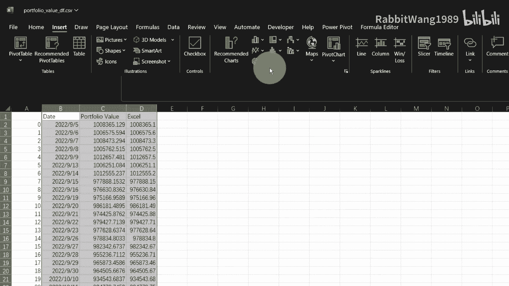

我们看到啊，这个红色的线是我们excel画的，这个蓝的线其实是就是这个PORTFOLIVIA，是我刚才用这个Python计算出来的，你看这两条线基本上是从和的对吧，基本上是重合的。

那说明其实我用Python算出来的结果，其实和我excel手工算出来的结果是一致的。

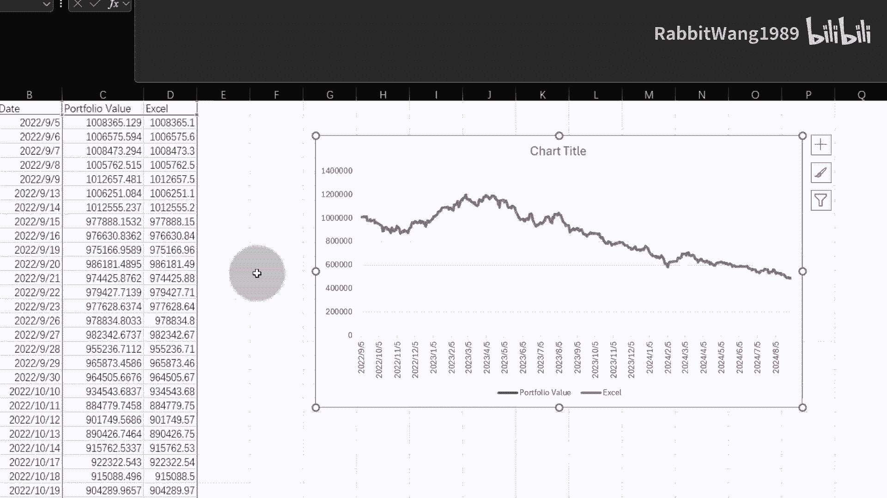

那从现实工作当中。

其实我个人觉得这个excel运用的面，还是要比这个Python更广一点，而且尤其好的一点就是在于什么呢，就是说你用excel的话，每一步计算的结果就呈现给你了，他比较清晰，不是那么的黑箱啊。

算出来结果你可以去寻找当当中有没有错误，你像Python的话啊，尤其是我这里借助了很多这种，像这个chat GDP给我写的代码，你也不知道写的对或错对吧，这个有的有的时候有点慌的。

而且他其次你这个如果对代码不是很熟的话，你只要进shift enter，它就运算下去了，你结果对或错啊。

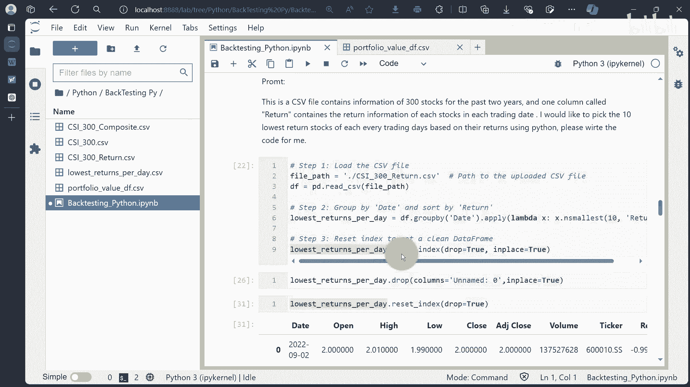

不知道的，所以在实践过程中，更多的就是先用excel把这个运算的逻辑给掌握了，然后再去写代码，然后写出代码啊，跑出来的结果，再跟excel计算的这个结果进行一个对比，那么就像我这个图一样。

我首先通过这个Python对吧去抓了很多数据。

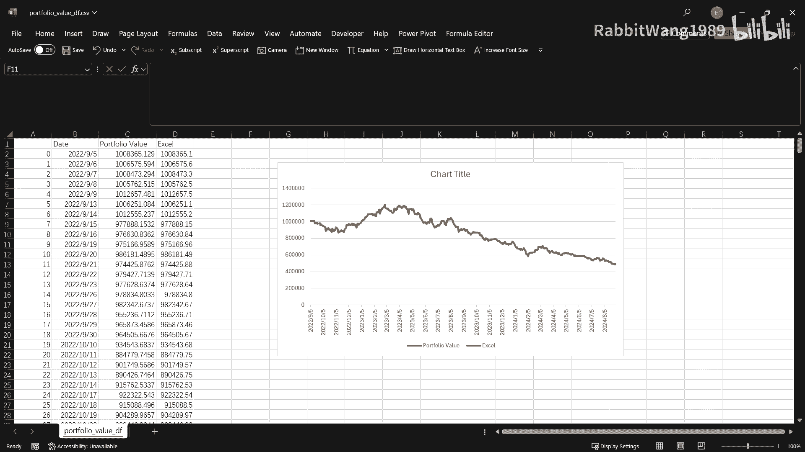

然后进行了一个模拟测试，最后得到一个结果，然后再进行一个比较，那么这个就是我啊红线啊，这个蓝线就是我通过这个我回归交易啊，做的一个结果，然后红线的话是那个啊直接投资cs300，这个得到一个结果。

然后最后我们再用这个excel去啊，包括刚才一个很复杂的一个计算结果啊。

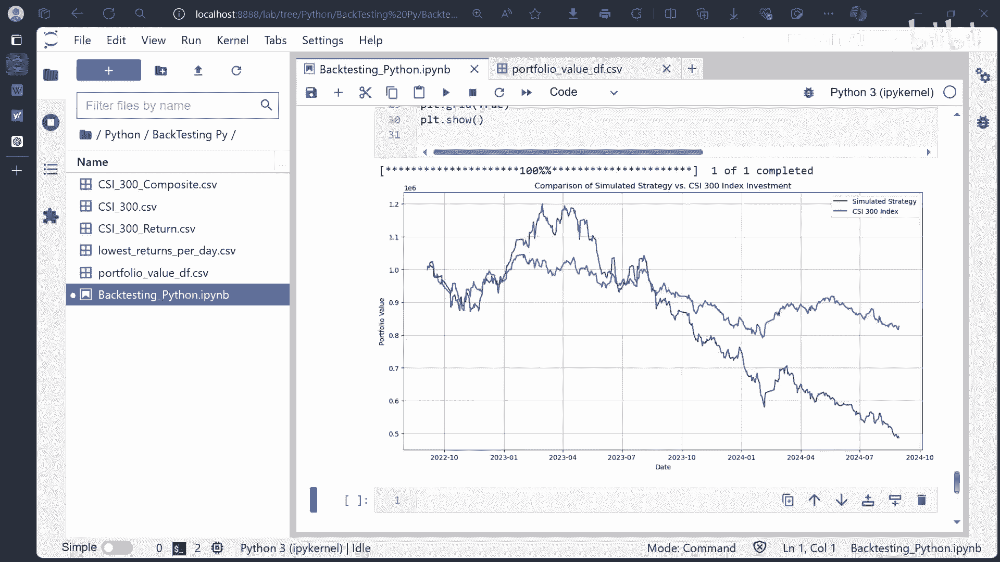

最后再两个东西做一个图，去比较一下两者的一个差异，那么现在我得到的结果，其实我刚才Python跑出来结果大差应该是不差的，应该是一个准确的一个数字是吧。

呃毕竟excel算了这么长时间，而且每一步都是经过验证的，基本上是一致的，这里也可以看出，这个Python去计算的一个优势所在啊，你看我刚刚Python其实我去跑，尤其是跑这个回测结果的时候。

我这个35的时候，他其实就跑了大概5~10秒钟，但是我这里excel。

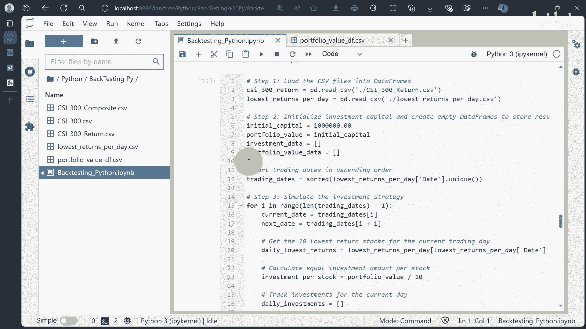

要把所有的这个交易步骤给模拟出来的话啊，它的数据量运算比较大的，那毕竟这里的一个300只股票，那个两年的交易数据量大概是14万，数据14万条数据，那如果你要去回归一个10年或者一个5年。

那么可能更加麻烦，那么这也是一个Python的一个优势所在吧。

也就是说，如果你的这个交易的流程和一个准确性，是得到验证的，通过excel进行验证过了，那Python的话运算的结果运算的速度会非常快，那这就是这期视频的主要内容呃，我这样通过这样一个回测。

我也证明了我之前跟我沟通，那个波兰的这个呃投资经理，我觉得他的一些说法也比较自信，那可能有些市场上可以运用的策略，并不是在所有市场上里面都可以灵验的，就比如说我们的A股这市场。

他的一个这个均值复归的一个交易策略，可能在某些的年份会比呃，体现一个比较好的一个效果，然后但在有些年份里面其实还不如投指数对吧，所以说这个没有一个万能的一个交易策略呃。

需要投资人根据不同的这个市场行情去分析，找到一个合适的一个投资方略，那这期视频也其实也不是主要讲投资策略，主要是和大家介绍一下用Python啊，以及chat gt TP。

怎么样去帮助我们去这个呃投资对吧，它是一个非常好的一个投资工具，尤其是我觉得自从有了chat GB之后呃，我觉得写这个代码，他的成就感会很容易获得这个成就感，形成一个正向的一个循环。

因为以前你要写一些代码的话，尤其是像那个写这种回归啊，这样的一回测的这样一些模型，你要花很长的时间，然后还会写错，你会受到很大的一个挫折感，但是自从有了chat GDP之后。

它可以帮你迅速的搭起一个框架，你只要进行一个微调，这样的话你每次跑完一个结果，就像这样，我就直接把一个两年的一个投资的一个情况，进行了一个回测，之前可能我需要花几个小时去写这个东西。

现在可能一个小时之内就可以帮我搞定，能让我快速的得到成就感，而激发我下一步学习的一个热情，那我也我也希望把这样一个呃学习，或者说一个呃研究的一个经验分享大家，希望对大家有帮助。

那么这期的视频就到这里了啊，欢迎持续关注我的频道啊。

