# 金融领域中的AI和ML-第18讲-支持向量机的应用-上 - P1 - 量化Quantgirl - BV1Lm42177eR

上一期视频，我们已经看到了k个最近邻和支持向量机，我们现在想把这些应用于信用卡客户的数据集，它不是一个关注默认的数据集，当听到这些话时，人们可能会怀疑，信用卡与金融及分类应用，但我们实际上想预测客户。

所以我们想看看哪些客户更容易，取消和终止他们的合同，哪些不是数据可以在Kaggle下载，所以如果你转到这里的这个链接，你可以在Kaggle找到数据，你也可以找到各种各样的，通常。

Python笔记本具有各种各样的不同方法来实际进行这种分类，不仅仅是K个最近邻和支持向量机，但是在这里，因为我们刚刚看到了这两个模型，我们想用支持向量机来关注这两个，我们将使用支持向量分类器。

所以线性函数和带有径向基函数核的函数。

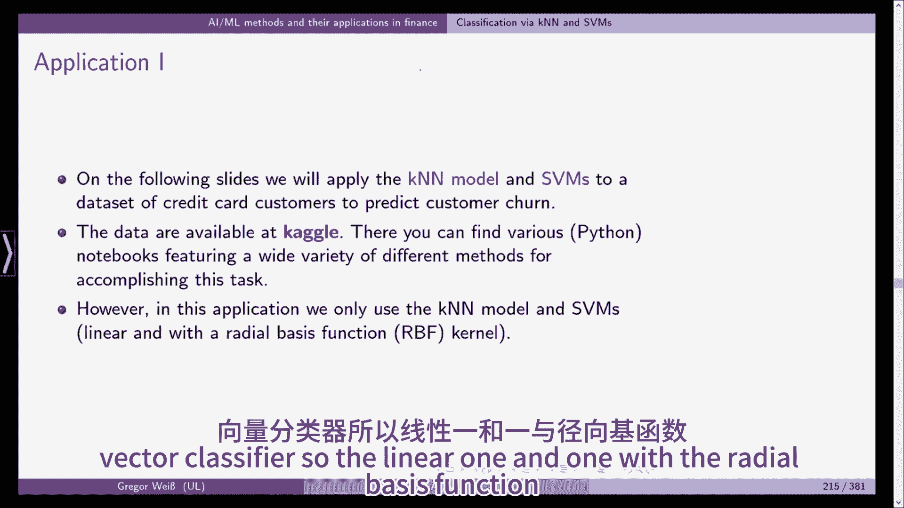

我们已经在脚本的前一张幻灯片上看到了这一点，嗯，在这里我们看到径向核，径向基函数核。

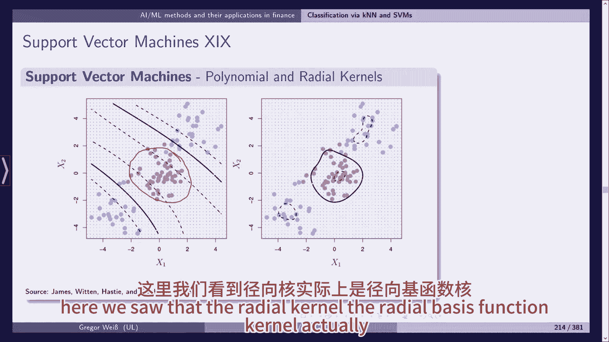

实际实现非线性决策边界，这可能比纯线性的更好。

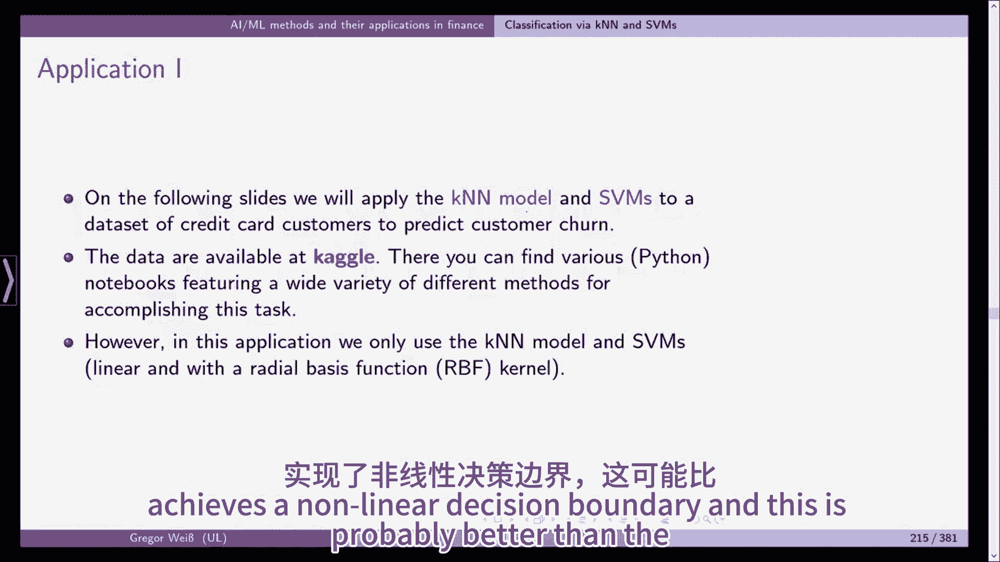

这个应用程序背后的动机是什么，嗯，保险资管其实更是如此，在保险管理方面，例如，如果你想想汽车保险，嗯，合同通常在一年后到期，然后你得续约，在德国通常是这样的，如果您不取消保单，它将自动续订，但是。

如果你取消它，换一个更便宜的竞争对手，那就明显取消年龄，取消率是一个主要问题，以及保险公司保费计算的主要投入，这里的信用卡客户也一样，所以如果你是经理，你关心的是，是否有越来越多的客户退出并终止合同。

你想慢慢来吗，因为很明显这对生意不好，你现在正试图使用机器学习方法，K最近邻和支持向量机，识别那些能够预测客户流失和合同取消的功能，然而，她需要预测谁将终止合同，所以这就是我们要做的。

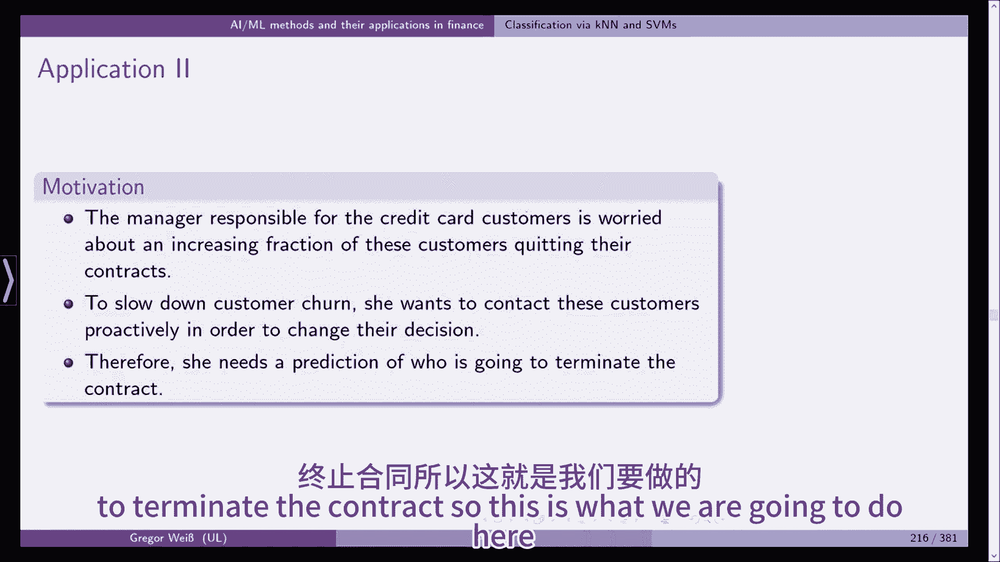

Kaggle提供的数据集，包含超过一万名客户的信息，我们有特色，包括年龄工资，信用卡限额等特征，而且数据不平衡，这意味着数据集中只有大约16%的客户实际上取消了他们的合同，所以百分之十六的人取消了。

百分之八十四的人留在信用卡公司，这使得训练和解释模型的预测性能变得复杂，显然这会更糟，如果让我们说，两个顾客取消了，九千九百九十八个客户没有取消合同，所以这是一个小问题，我们稍后再讨论这个问题。

与不打算搅动的客户联系也可能更有利，比不花钱不联系客户，他是，所以问题是在做了预测之后会发生什么，在做了分类之后，前进的最佳方式是什么，我们要不要联系那些顾客，那么威尔更有可能取消他们的合同。

或者我们应该专注于那些接近取消的，或者是那些永远不会解除合同的人，为了使我们的利润最大化，在这次讲座中，我们主要关注的是模型，因此，我们将不具体解决所谓的阶级不平衡问题，意味着只有16%的人取消了。

84%的人没有，嗯，但这通常被称为阶级不平衡问题。

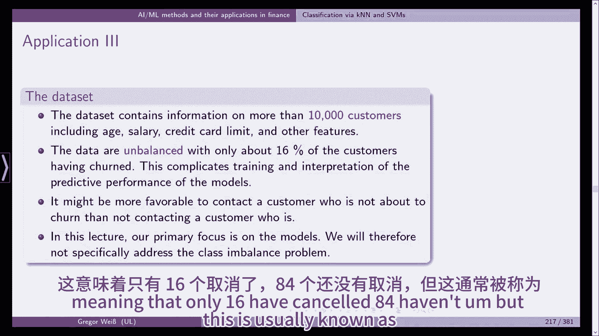

你现在可以在课本上的文献中查到这一点，安装手杖和建模SVMS，以及我们在上一节中看到的弹性网络模型，到2020年，我们将依靠R包胡萝卜，我们将很快更详细地介绍这个包，我们以前已经用过了，但在这里。

我们将更详细地讨论这一点，所以胡萝卜只是分类和回归交易的简称，它在一个非常精简的过程中总结了与模型开发有关的活动，它允许您测试不同的模型，只需对代码进行很小的更改，我们稍后会看到这个。

在我们实际上不需要的R代码中，嗯写，重写太多的代码，为了从一个型号切换到下一个型号，并提供自动交叉验证和参数整定，这个包提供了一致的建模语法，例如，通过简单地更改方法参数。

您可以轻松地将底层模型从k个最近邻更改为SVM，加起来，它使您有可能使用机器学习中的200多种不同模型。

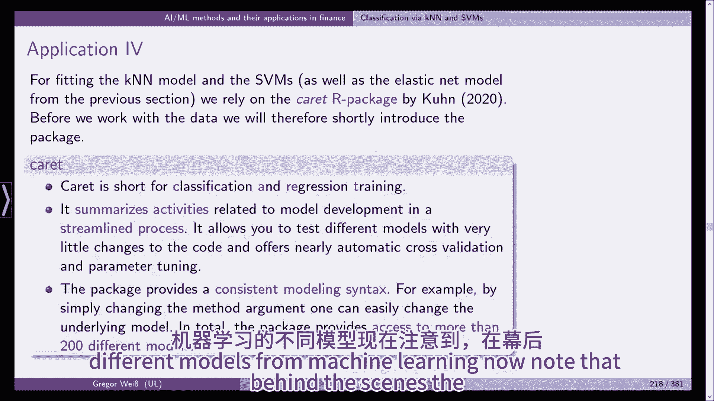

现在请注意，在幕后，包并不执行建模本身，其实呢，它使用我们的标准方法，例如，如果你用lm，它只是引用stats包中的lm函数，估计线性回归模型，它只简化了k个最近邻的语法。

它依赖于venables和ripley的类包，因此，在我们的，而不是重新发明一切，以及完整的模型列表，您可以转到脚本中的这个链接并访问carrot的文档。

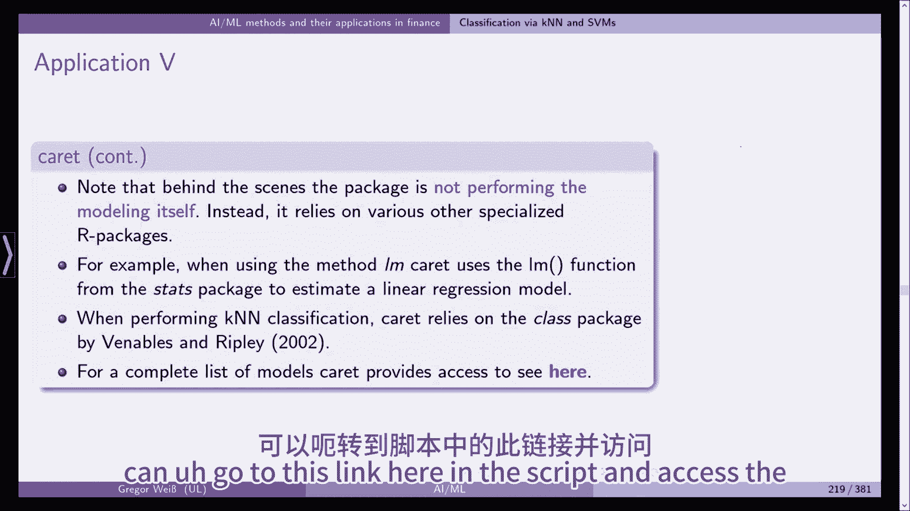

和以前一样，我们需要首先导入和预处理数据，我们在做这个，嗯，把德国银行的CSV从Kaggle甩了出去，你可以在这里看到链接，然后把它下载到你的电脑上，你需要把它导入，我们使用读R的包。

我们将CSV文件读入这个对象，现在的银行车工，如果你读了Kaggle的描述，建议删除不需要的最后两列，这就是我们在第六行所做的，银行转换器被银行转换器覆盖，只需使用列到1到列数，银行有-2。

所以我们放弃了最后两个，这些数据是最初的七个观察，你可以看到它是一个小标题，它包括一个客户号码，减员旗，客户年龄，性别，它还有17个变量，大概有一万行所以我们有一万个银行客户，正如你所看到的，两个，四。

五上，所以我们有两个，现在为客户提供的两个功能，也可从Kaggle获得，大家可以看到，例如，客户数量，不出所料，是客户的唯一和标识符，减员旗就是旗，那是一个，如果帐户已关闭且为零，否则如此，如果是零。

这是一个现有的客户，如果是一个，是客户取消了他或她的合同，受抚养人计数是受抚养人的数量，性别年龄，等或不言自明，嗯，我们会做一些探索性的分析，例如，我们看看是否有丢失的值，所以如果你用任何一个银行记者。

您可以检查是否有NA不可用，那是R中的数据类型，它让我们后退，所以我们没有丢失的值，我们也可以检查任何副本，然后又在银行日记本上复制了，结果是假的，所以我们没有任何副本可以看到阶级的不平衡。

我们用一张银行特纳的减员旗的桌子，除以行数，然后我们把这个四舍五入，你可以看到我们有一个请客的顾客，16%的现有客户，84%，所以我们可以清楚地看到，是呀，我们有阶级不平衡。

我们在应用程序中没有解决这个问题，但是是的，这是个问题，它会降低我们分类模型的质量，但这是另一堂课的主题，现在我们继续我们的剥削分析，我们按年龄分析翻腾的顾客，我们使用包dplyr，我们要做的就是，嗯。

一些子样本的磨损标志，例如，按客户年龄划分的客户，嗯，由嗯，我们也可以按性别来做，等，这有点复杂，因为情节是为了好看，如果你看下一张幻灯片。

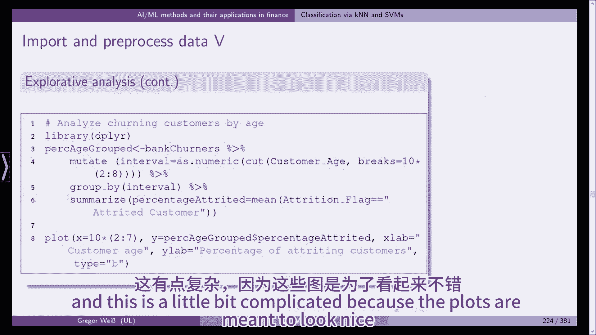

你可以看到由此产生的结果，你可以看到对待顾客的百分比，起价大概是12英镑20英镑，然后它上升了三四十五十年，对于六七十岁的顾客来说，它急剧下降，所以我们可以看到，是呀，显然年龄似乎有一些婴儿在减员旗上。

因此，它可能是留在我们模型中的预测因素之一。

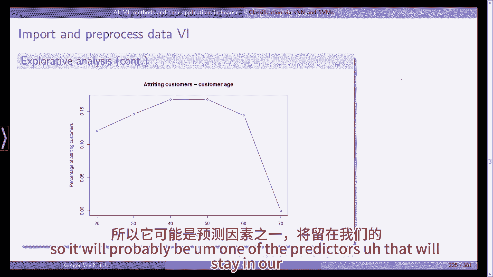

客户教育也一样，大学博士研究生，高中，研究生，未受教育，似乎至少如果你有自然减员旗的博士学位，而且减员的比例要高得多，比其他的教育班，所以再一次。

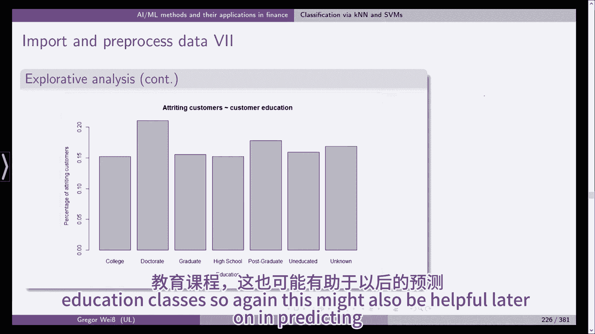

这也可能有助于以后预测客户，嗯，我们确实有一些分类特征，例如，客户教育是一个分类特征，它不能简单地编码在一个数字变量中，因为序数变量有时是可能的，例如，如果你的评分很好，很明显是个分数。

比方说五十比有明确特征的三十要好，这是不可能的，因为你不能，你真的可以这么说，例如，博士学位，比高中文凭好一倍，因此，客户教育可能通过六个二进制虚拟变量进行编码，然而，这显著提高了数据的维度。

如果我们对每一个分类特征都这样做，然后我们就会得到大量的虚拟变量，对于像K n分类这样的非参数模型来说，这是一个特别严重的问题，由于维度的诅咒，我们正在增加并人为地增加维度，我们所观察到的少数。

我们有一万个观察，但在这种情况下，这并不过分，维度的诅咒意味着如果你增加问题的维度，对数据的固定观察次数，你的观察会在某个时候消失在巨大的空间中，这是你的超维空间，为了简单起见，因此。

我们删除所有数值变量，在实践中，你显然应该仔细决定每个分类变量。

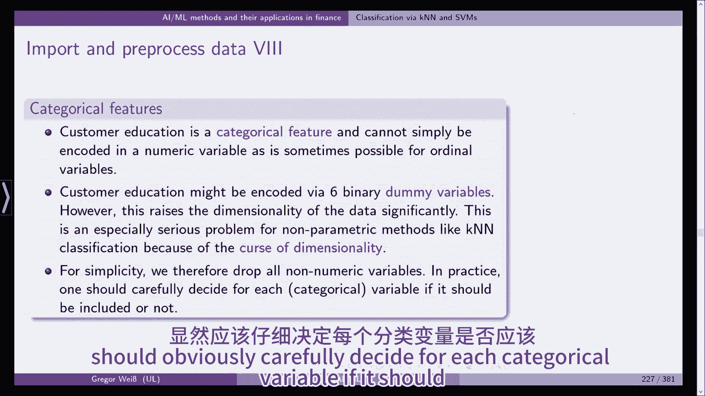

是否应该包括，如果我们看看客户教育，博士学位似乎有影响，所以你可以考虑使用一个虚拟变量，博士是一个，其他课程是零，这可能是个解决办法，嗯和H，你可以分成两个子样本，60岁以下或50岁以下和50岁以上。

这可能行得通，但是如果你为每个年龄和每年加入一个虚拟变量，这只会造成更多的问题，而不是现在解决任何问题。

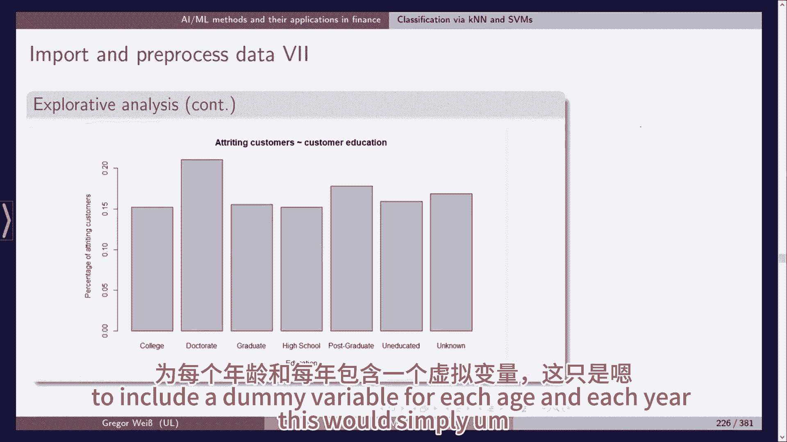

然后我们创建训练和测试集，我们删除所有数字特征，列客户机现在我们不需要客户机号，它没有预测价值，我们随机创建训练和测试集，包括训练中80%的观察和测试集中20%的观察，所以这就是我们要做的。

为了可重复性，我们再次放置了221号种子，然后我们把我们的数据集分成x训练，um，y训练和y测试。

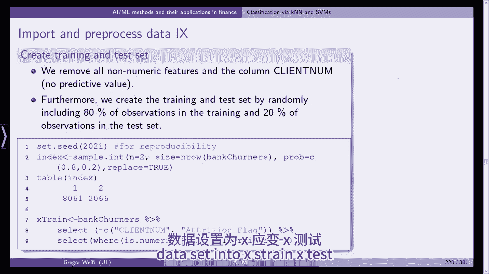

显然银行转手和减员旗，在本例中，是我们的响应变量，所以我们有四个数据样本，测试和训练集。

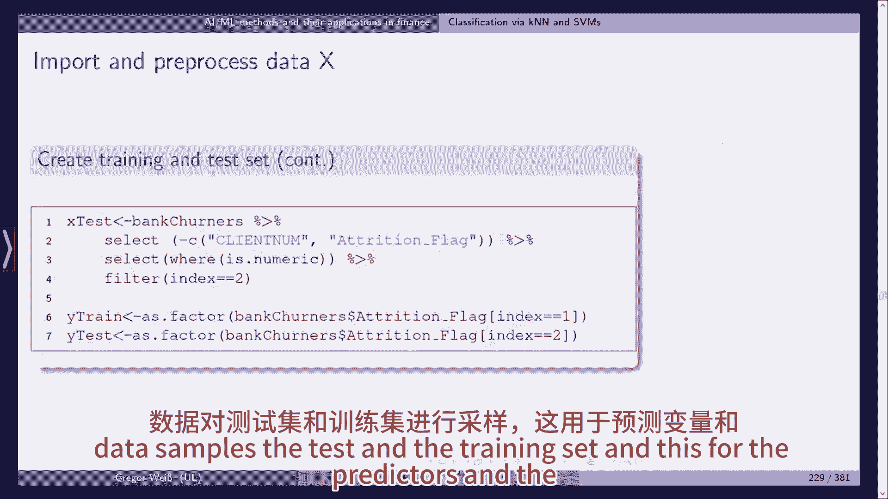

这是给预测者的，响应变量，现在默认情况下，K最近邻基于欧几里得距离，并确保所有特征对测量距离的贡献相等，嗯，我们根据最小值和最大值缩放数据，所以我们确定每列的最小值和最大值，然后我们缩放所有变量，例如。

这里x训练和x测试，我们现在称之为X火车秤和X火车秤，嗯X火车和X测试SC，我们所做的就是扩大它的规模。

就像我们在这里看到的，它的最小值和最大值分别为零和一，所以训练集中的所有变量最小为零，最大为一，它在两者之间单调地缩放，因为缩放是基于训练集的数据，对于测试集不一定是这样，所以你可以在这里看到。

如果我们这样做是为了测试缩放和火车缩放，稍微有点不一样。

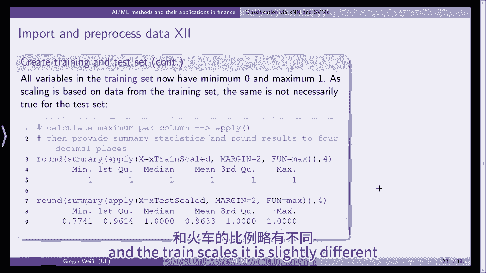

好啦，现在呢，下期视频，我们将从k个最近邻分类开始，然后做支持向量机，但是您可以看到预处理数据需要一些时间。

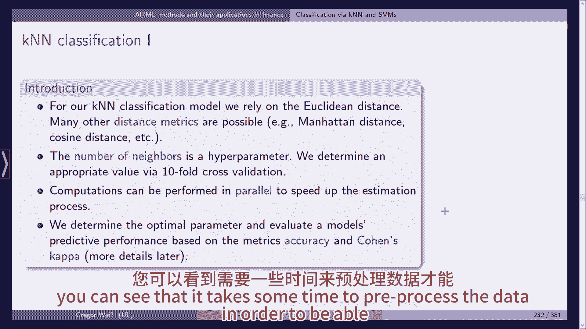

