# 金融领域的人工智能与机器学习-第17讲-支持向量机 - P1 - 量化Quantgirl - BV13t421J7rj

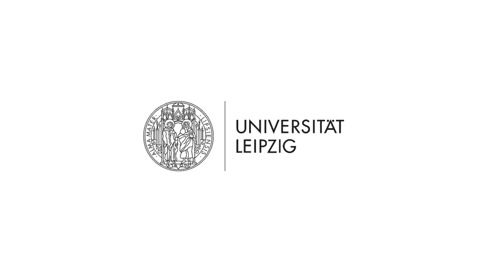

上一期视频，我们已经看到了最大边距分类器，如果你看这张幻灯片，我们看到最大边距分类器实际上对，嗯，新数据，如果我们添加新的数据点，然后判断边界，也就是这里的线，对这些新增加的观察相当敏感，所以问题是。

我们能让这个分类器对新的观察不那么敏感吗，更宽容一点，这就是我们现在到达所谓的支持向量分类器的地方。

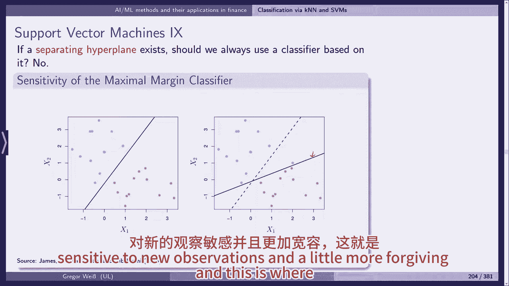

这还不是我们要在本节中讨论的支持向量机，但它是支持向量分类器，通常也被总结为，嗯，在这个名字下支持向量机，所以解决方案是我们使用一个分类器，允许一些观察，并非全部，当然啦，但有些观测被错误地指定和分类。

你可以在这里看到这个，例如，如果我们加上这个观察11和这个观察12，即使十一是红的十二是蓝的，决策边界没有太大变化，因为这些新增加的观察使，决策边界不再是分离的超平面，所以我们要有一点判断力。

当谈到观测结果的分类时，这就是支持向量分类器的作用。

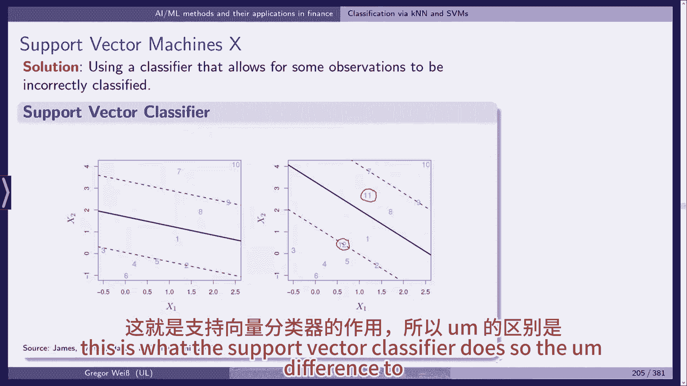

因此，与最大边距分类器的差异可以在这里看到，导致支持向量分类器的优化，或者我们用来分类的支持向量超平面，我们的参数从b到0，B对一，超平面等，现在我们有了额外的变量。

epsilon 1到epsilon n，我们最大化m关于这些参数，我们在第28行有同样的限制，即系数的平方加起来为1，现在的不同之处在于，首先，超平面，而且观测值不应该正好高于或低于m。

所以我们又不是在寻找一个分离的超平面，但我们有一定的判断力，这个可能的错误实际上包括在这里，有了这些所谓的松弛变量，允许观察在错误的一边，至少有一点点。

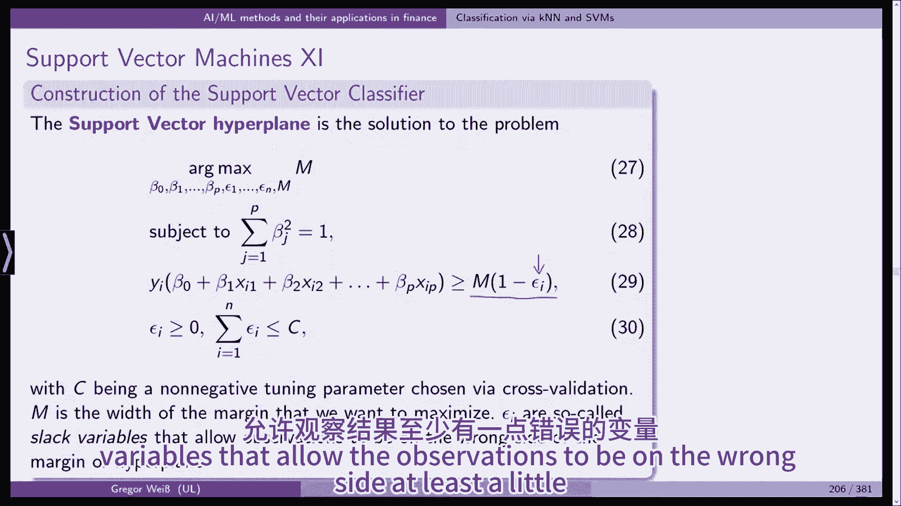

这里到底发生了什么，所以我们预计11个在这一边，但没关系，它实际上有点偏离，在超平面上方一点。

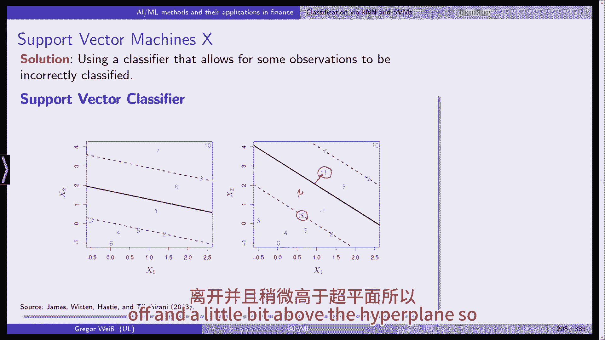

所以这将被捕获在松弛变量中。

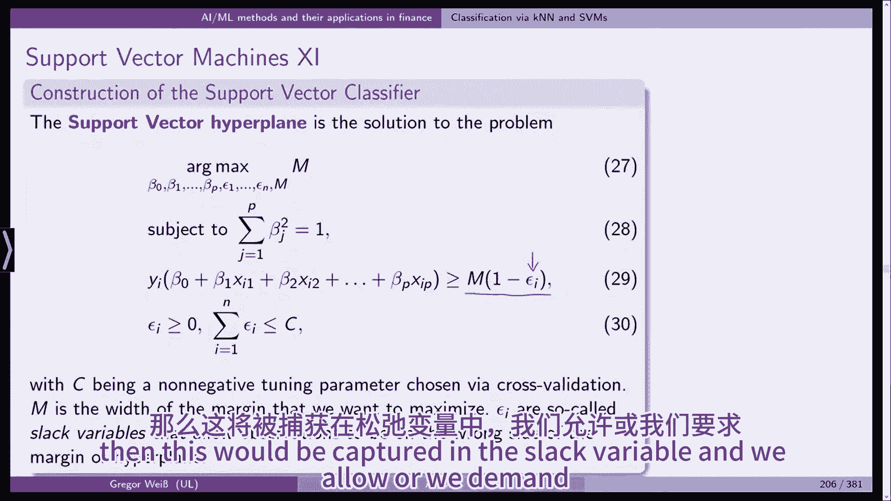

我们允许我们要求，当然这些变量不是负的，我们有一个额外的超参数，也就是c，所以所有松弛变量的总和，换句话说，我们允许的误差之和需要小于或等于c，所以c是，当然一个非负调谐超参数，它是通过交叉验证选择的。

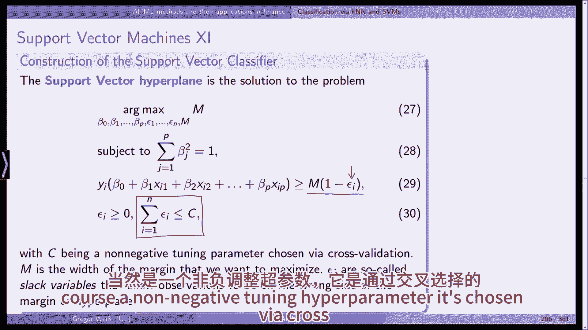

m是边距，这是支持向量分类器，我们在这些插槽中看到四个不同的支持向量超平面，情节，你可以从标题中看到，这些斑点是由调谐超参数C的不同选择造成的，例如，左上角面板中使用了c的最大值，右上角使用了较小的值。

左下角和右下角，所以有四个不同的值，实际上当c很大的时候，然后对观测值在边缘的错误一侧有很高的容忍度，所以利润会很大，随着c的减小，我们减小最大值，允许一些误差，随着c的减少。

这种对观察的容忍度是相反的，在超平面的错误一侧减小，边缘变窄，所以你可以在这里看到这个，这个让我看看，这实际上是这一边和这一边的边缘，如你所见，每块地都减少了。

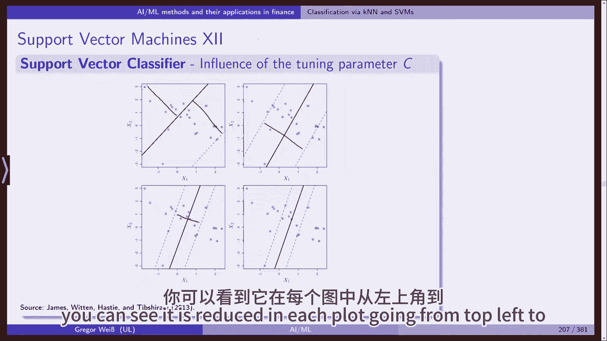

从左上角到右下角，现在的问题是我们做得好吗，其实没有，因为是线性分类器，总是保证很好，如果你看看这个情节，你可以立即看到没有，嗯，你可以尽你最大的努力使用飞机。

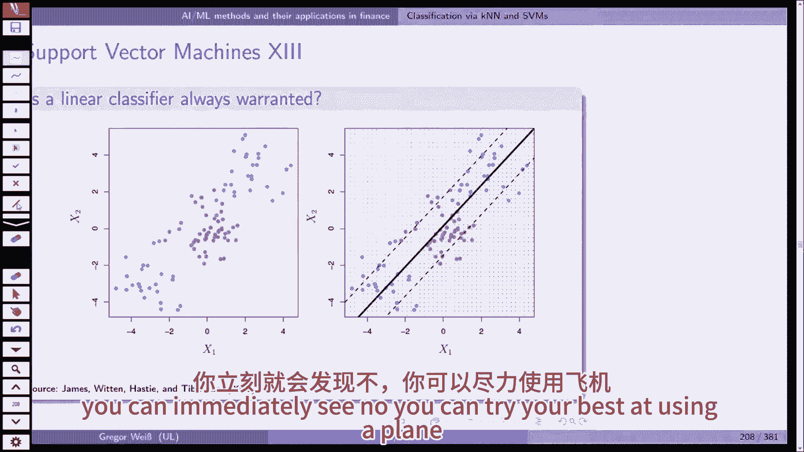

一个超平面，在这里是一条分隔蓝点和红点的线，然后呢，例如，如果你用这条线，然后你在这里有这些观察，这些观察造成了一个问题，并导致了一个问题，你可以用这样的超平面，这并没有真正的帮助，你真正需要的是。

实际上这是非线性的，例如，可能是类似，或者像这样的东西也可能有用，所以这里不需要线性超平面。

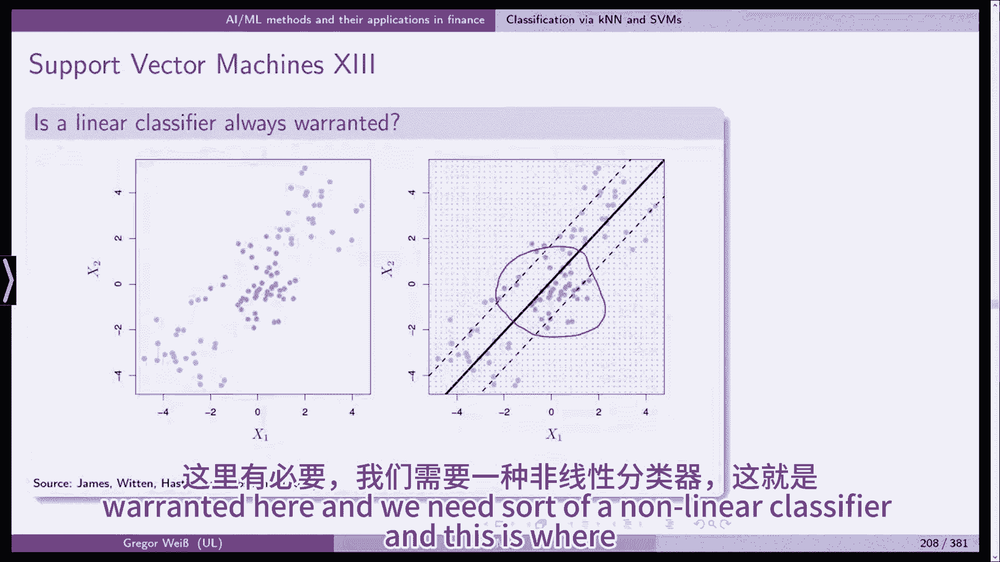

我们需要一个非线性分类器，这就是我们最终得到嗯，在接下来的几张支持向量机的幻灯片中，其中一个支持向量分类器是线性分类器，那么我们如何自动转换为具有非线性决策边界的分类器呢。

我们首先要做的就是把利润最大化，我们用打浆机，爱普西隆一家，作为我们的参数，我们现在说，好啦，我们不是在用超平面，但是，例如，你可以在这里看到，这又是一个负一或一的反应，边缘。

我们在松弛变量中允许一定的误差，但在括号里，以前我们有一个线性超平面，我们现在允许多项式函数，就像我们用多项式回归，我们允许判定边界为多项式边界。

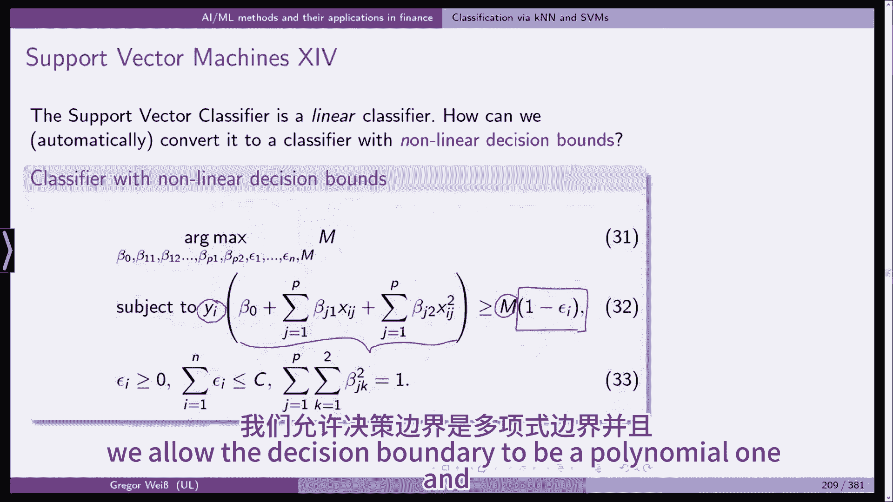

这是一种方法，问题是这可能还不够，我们看到的多项式回归，这给我们的模型增加了一些灵活性，我也一样，但我们可能需要更多的非线性，那么我们怎样才能做到这一点呢，首先，回忆一下茎网，在这种情况下。

两个向量乘积中的欧几里得，x i和x i条破折号，其实呢，你有标量乘积，两个向量乘积中的欧几里得，我们需要这个，因为线性支持向量分类器可以表示，这只是一种不同的表现，显示支持向量分类器的不同方式。

对于n个参数，αi实际上是它的，超平面由零给出，加上参数之和x i乘以x和x i的内积，换句话说，我们可以用。

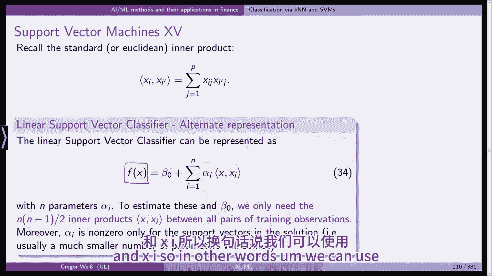

嗯这个代表，今年我在哪里得到它。

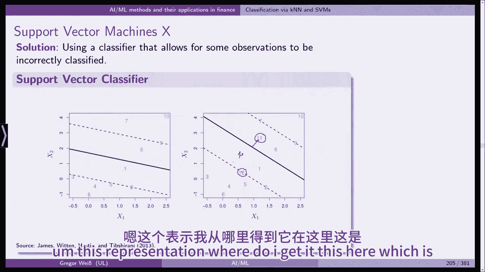

它是一个线性函数，它是线性的。

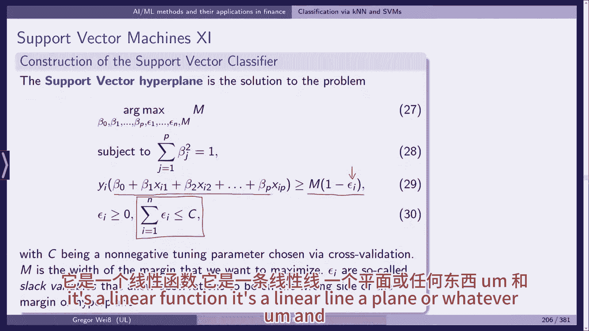

一条线，飞机什么的。

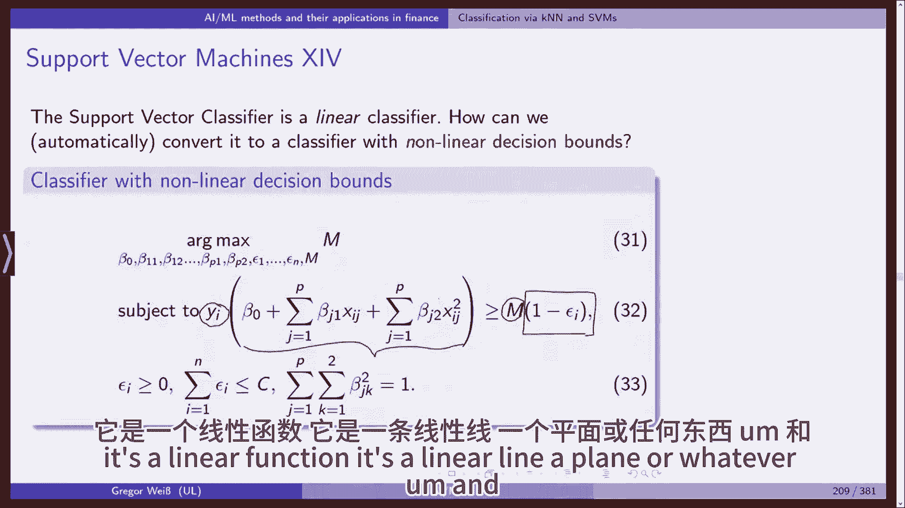

超平面也可以用这种方式表示，所以不用贝塔乘以x，测试版一，X一，β2乘以x 2以此类推，我们也可以用里面的产品，我们得到一组不同的参数，这是αi和β0，当然啦，为了估计这些。

我们只需要n乘以n减去1除以两个内积，在所有训练观察之间，一开始，这听起来像很多，如果我们在看一个大数据样本，很明显，如果我们有一百万次观察，那我们也就有一百万了，不，实际上一百万次。

几乎一百万除以两个内积和n，但是，alpha i仅对解中的支持向量不为零，你可以再次看到为什么它们被称为支持向量，嗯，这意味着我们实际上不需要所有的n个参数，阿尔法一世，但是我们需要用更少的参数来表示。

和支持向量分类器的超平面。

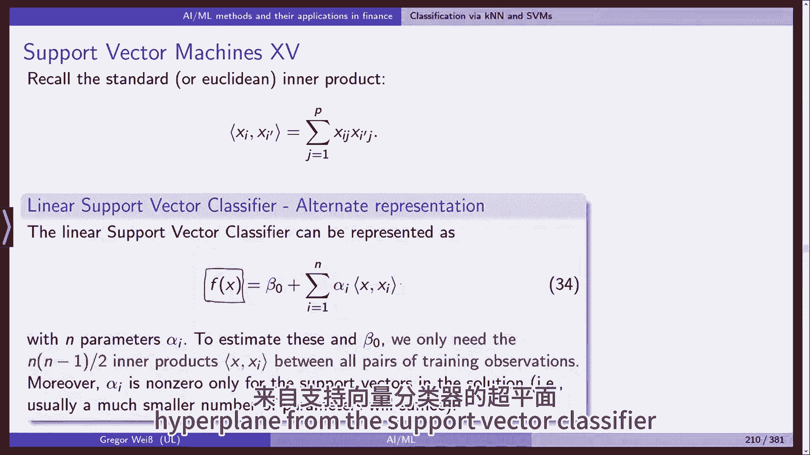

现在我们需要这个吗，为什么我们需要这种不同的表示来支持线性分类器，嗯，线性支持向量分类器可以用一种非常简单的方法进行扩展，以及我们如何用一个更一般的，所谓内核，什么是内核，内核。

在数学和统计学的不同部分的含义略有不同，核是量化两个观测相似度的函数，所以我们有两个观察，x1和x2，内核是一个函数，在某种程度上测量相似性，也可能是这两点之间的距离。

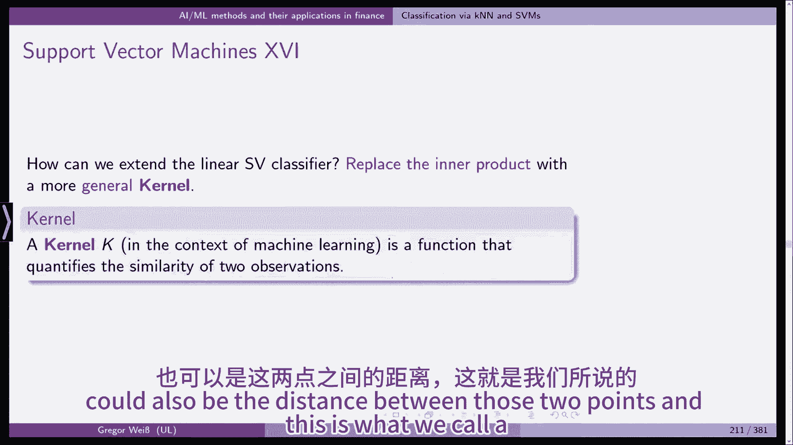

这就是我们所说的内核--很清楚，在内积的情况下，这当然是，测量欧几里得空间中这两个向量之间距离的函数，所以我们需要更换内部产品，我们需要用我的光标替换，这里我们需要用一个不同的内核替换这里的内积。

然后我们得到了支持向量分类器的一个更一般的扩展。

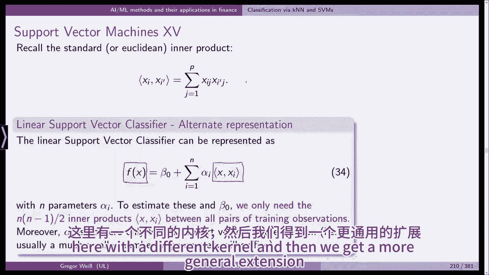

这是一个支持向量机，我们可以用不同的核，例如，我们可以用线性核，我们也可以用d次的多项式核，或者经常使用所谓的径向核或径向基函数核，方程式3-7，所以这些是比较习和习的不同选择，破折号两个向量。

我们知道嗯，如果我们现在用，比如径向核。

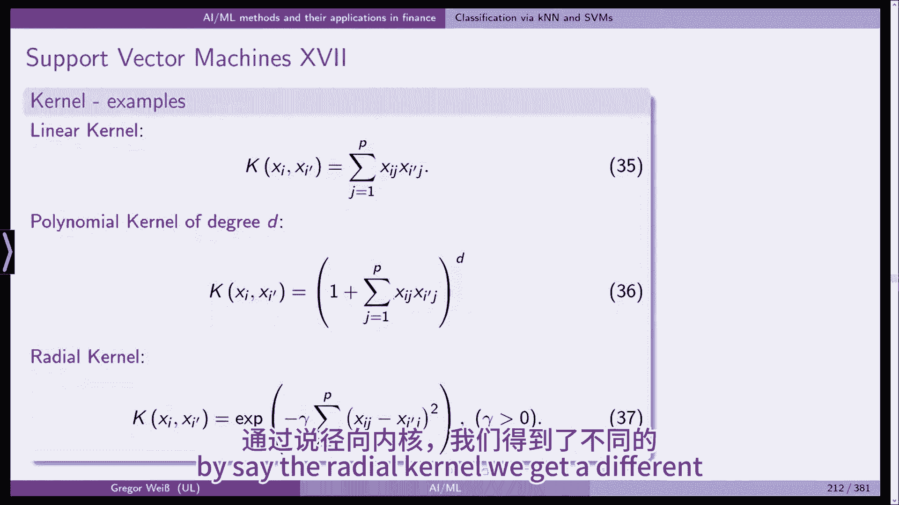

我们得到了一个不同的分类器，具有非线性核的线性核，由此产生的分类器称为支持向量机或svm，在方程式3 8中，你看，我们现在只说一个一般的核k，重要的是，正如我之前提到的，我们不需要所有的N，Um参数。

因为这些参数αi是非零的，仅针对支持向量，所以包含索引的集合S，因为支持向量通常比n小得多，而这个表示只是，嗯，就是，我们只需要集合中的这些索引，是呀，这就是支持向量的集合，那是支持向量机。

用非线性核代替线性核。

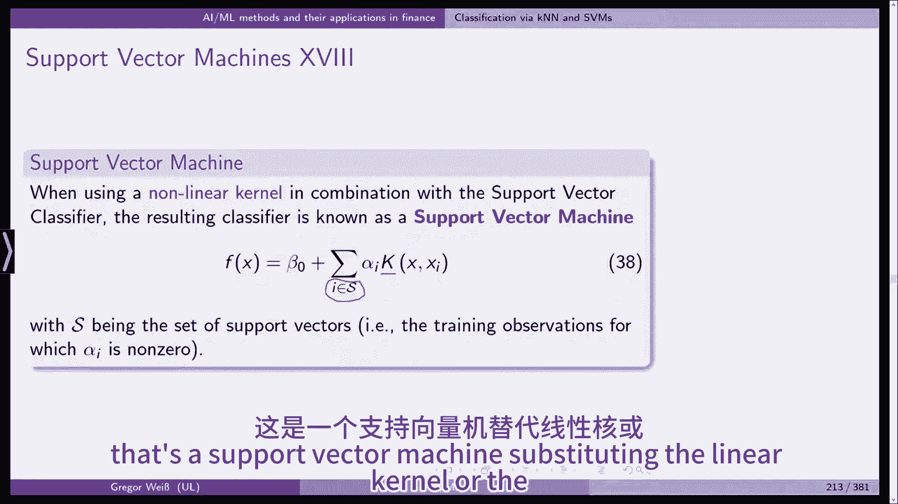

我们得到的是一种更好的方法来分类这些观察，在左手边，你看到一个多项式核，你看我们在这里有我们的观察，我们会喜欢那些红色的，把观察结果和蓝色的分开，多项式核做到了这一点，实际上，你可以在右手边看到。

径向基函数核工作得更好，这些是支持向量机，它们的估计方式与支持向量分类器相似，所有这些分类器实际上是最大裕度分类器，支持向量分类器，这些更通用的支持向量机，通常它们都被概括为支持向量机。

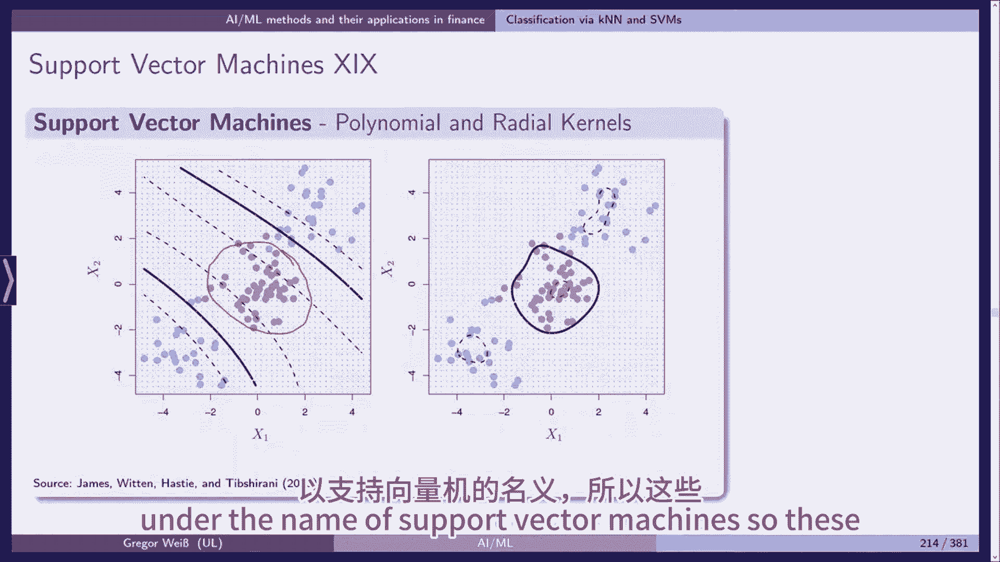

所以这个，Um SVMS，这就是理论。

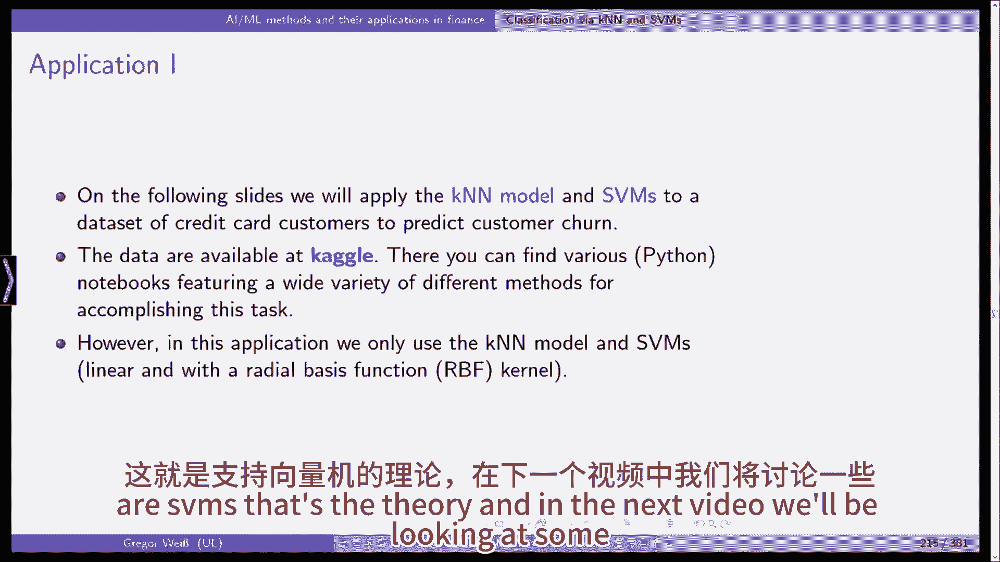

