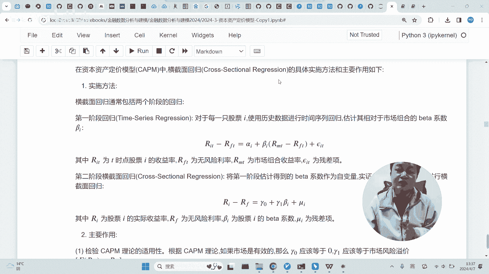
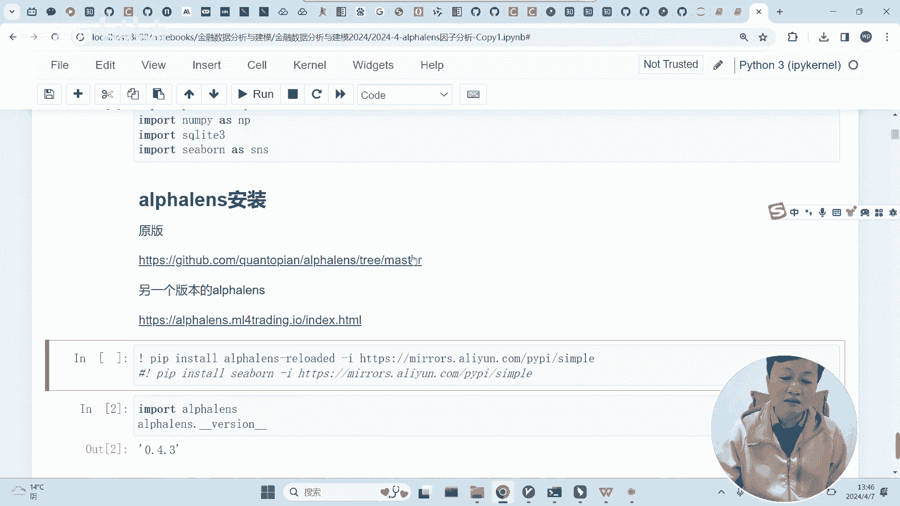
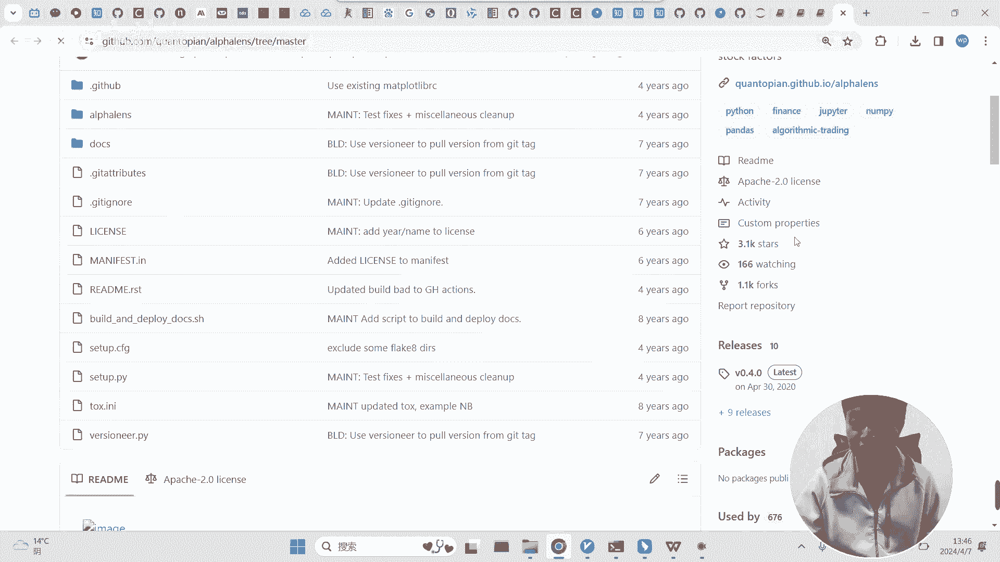
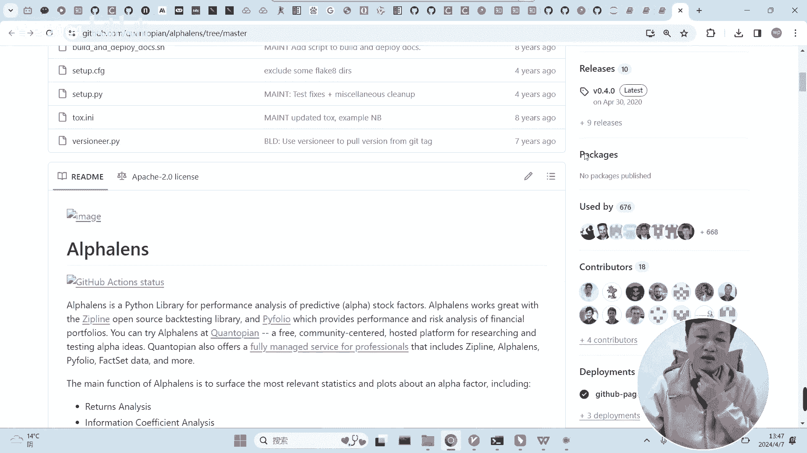
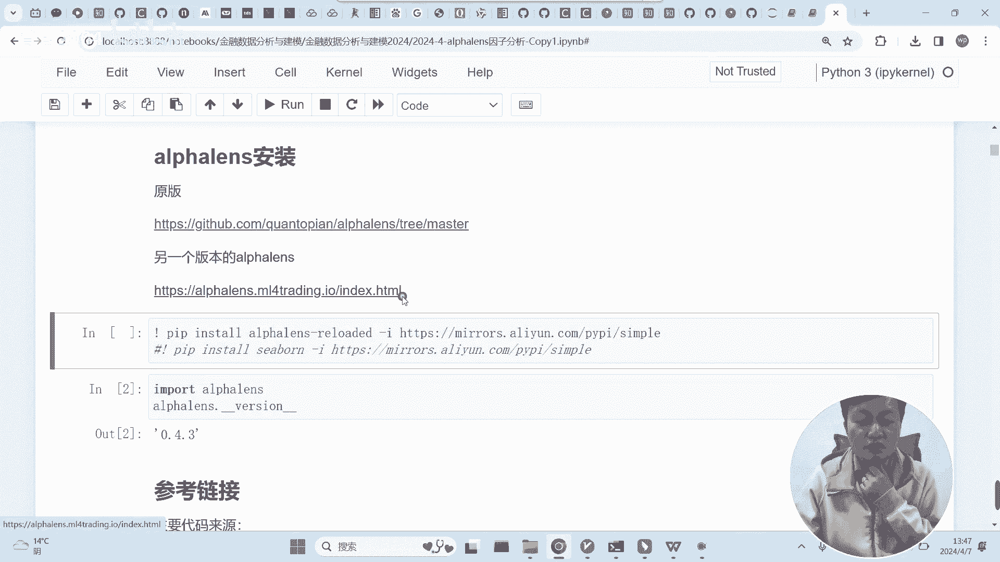
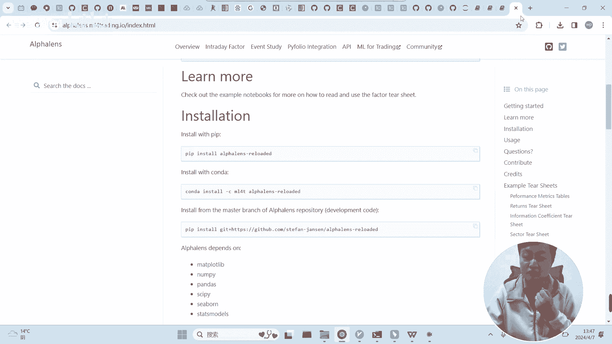
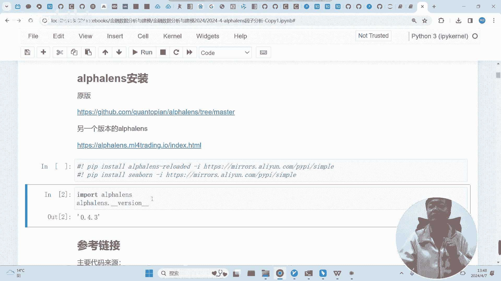

# 阿尔法因子分析概念与alphalens的安装-量化金融与机器学习2024 - P1 - 背包2004 - BV1f1421m7iW

我们学习所谓的阿尔法因子分析，而且是基于什么呢，基于这个工具，基于这个工具，呃，要讲一点，为什么这里提这个因子啊。

这其实是和我们资本资产定价里面一直提的，所谓的贝塔和阿尔法是一脉相承的啊。

刚才老师其实也讲过，我们资本资产定价里面最核心的东西，是求什么呢，是求市场的，说是那个股票或者是某一个资产的预期收益率，是不是我们的预期收益率的公式，里面是一个线性，是这样的一个线性公式是吧。

这个公式里面包含了两个因子啊，两个系数，一个是贝塔系数，一个是阿尔法系数啊，我们上节课呃，其实讲了很多，其实最主要的还是围绕这个贝塔系数来展开的，我们七呃，我们所有的礼盒。

基本上阿尔法系数只是顺带讲一讲，我们在资本资产定价模型里面，阿尔法系数被称之为什么呢，被称之为一些未知的东西，就是和这个股股票本身有关系的，一个未知的因素导致的一个溢价啊，而且在资本资产定价里面。

大家还记得吗，完全有效的这个市场理论里面，而且我们在为什么要做CAPM模型的，横截面回归的时候，其实就讲到了这一点，他是为了这个方法是为了判断市场的有效性，而怎么去判断市场的有效性呢。

前面这个阿尔法它是要要什么呢，他的车他的和是要等于零的，懂吗，那你还记得吗啊，就是在资本资产定价里面，这个因子是要等于零的啊，理论上他认为是不存在的啊，在经典的这个理论里面。

他只认可的是所谓的贝塔因子啊，也就是说系统的风险，系统风险一筹的一个暴露度啊，一个暴露度，所以我们之前其实核心点都是在这里啊，都是在这里，但是呢我们这节课啊，我们这节课是专门要分析。

这位这个阿尔法因子啊，要分析这个阿尔法因子。

也就是所谓的阿尔法因子分析，啊，首先呢，我们得了解一点阿尔法因子，它的特殊性在什么地方啊，它的特殊性在什么地方。

这个里面我们刚才讲过，在这个模型里面，阿尔法因子是个未知量啊，是个未知量，而在我们这里啊。

在这个因子分析里面，他把阿尔法因子看成一个，呃有很多因此协同产生的一个作用啊，有很多因子产生协同产生因素产生的作用，而且呢还有还和之前的那个因子啊，和之前的所谓的那个风险一筹啊，很不很不同的地方啊。

这是这是一个核心的不同是什么呢。

是之前的风险一筹的这个词，它是一个市场上共同有的一个值，这个值不会随着不同的股票发生变化，能理解吗，能理解这个意思吗，这是这是贝塔因子，它这里面的这个这个值的一个特点啊，它是整个市场所共有的纸。

但是到了我们这里啊。

到了这里，阿尔法因子所面临的是这个因子的那个值。

就完全不一样了，阿尔法因子刚才讲过，整个这个它是它更加突出的是单个资产的个性，阿尔法因子里面具体的因子的值，不同的股票是不一样的啊，不同的股票是不一样的，另外呢还有一点这里也讲到了。

你看在这里面阿尔法因子的绝对大小并不重要，重要的是它的相对相对的情况，就是不仅是它因子的值不同的股票不一样，而且你即便是去这产生一个什么什么，产生一个什么问题呢，就是当你做阿尔法因子分析的时候。

你甚至都不应该用线性回归了，为什么不应该用线性回归呢，因为对于阿尔法因子，就是阿尔法因子不是一个因子啊，它是一类因子啊，一类它里面有很多种因子，对于阿尔法因子来说，它的值大小并不重要。

它的重要点在于什么呢，重要点在于整个市场，它这个值所处的一个顺序和位置，它的相对值更重要啊，因此这一点就决定了，我们的阿尔法因子肯定不能单纯的用线性回归，线性回归。

它核心点就是呃你这个因子的值它是重要的啊，它的值的变化导致了最终结果的变化，但是这里不一样，这里阿尔法因此它肯定是产生作用，但是它的作用机制，是跟它的相对大小是有关系的，跟它的绝对大小是没有关系。

这是阿尔法因子的一个特点。

当然除此之外，这里讲的很详细啊，所以阿尔法杯子的区别我们可以看一下，我们可以看一下，阿尔法因子反映了个别资产相对大盘的超额，超额的预期收益能力，代表的是选股能力啊，代表的是选股能力。

而贝塔因子衡量的是整体啊，整体波动的影响反映的是系统性风险，这是两者的一个区别，阿尔法因子是主动投资的一个体现，它体现投资者通过选择不同的阿尔法的，这个资产组合来创造超额的收益。

贝塔因只是被动投资的体现，它反映了通过分散投资规避系统性风险啊，然后是可控性不一样，阿尔法因子呢他是主动的，能够被创造和捕捉的，但理论上啊，而beta呢，它实际上是反映的是整个系统的风险一筹。

其实它的收益是由系统决定的，你只能是通过它来降低一些风险啊，是比较被动的啊，比较被动的，持续性也不一样，这次也很也很显然的啊，大家注意点，这这一点很重要，哎呀就是贝塔。

因此它通常都是有持续性和比较稳定的，但是阿尔法因子很不一样，它持续性是它不持续的啊，他肯定不持续，他不会他你拿你，你获得的这个因子，绝对不可能靠这个东西吃一辈子啊。

就是你你顶多靠靠一个因子能够吃吃吃一两年，那都很不错了，就是你如果你是一个呃基金的一个管理者，你如果发掘出一个最近几个月或最近一两年，有效的因子，这个这是很好的一件事情啊。

但是呢通常通常的操作都是自己瞒着不说，肯定是不能跟别人讲的啊，就是你大张旗鼓的跟别人讲了，很可能很快就没了啊，很快就没了，就是阿尔法因子，它本质上持续性是非常差的，你你如果想获得连续的收益。

你是需要不断的发掘新的阿尔法因子，啊这是这个，而且他从这一点也讲的很很清楚。

什么意思呢，阿尔法因子的存在反映了市场的无效率，持续存在的阿尔法因子是违背有效市场理论的，要理解这一点就是在传统的经济学里面，传统的这个如果市场上都是理性的信息，获取完整的这样一群投资者来进行投资。

理论上是不应该有阿尔法因子存在的教程，即便是有刚才讲了，有真正的有效市场，符合资资本资产定价，它的所有股票的阿尔法因子加起来必须等于零，这才是一个完全的一个有效市场，如果有阿尔法因子存在。

这是说明了整个市场的一个无效性，这说明了整个市场存在很多老婆不清醒的，而且说明这个市场上，信息肯定是不足够透明的啊，不足够透明的，因为如果大家都是信息透明，信息有足够多的理性的人的话。

是不可能存在阿尔法因子这个东西的，所以大家了解一下这两者的一个区别啊，两者的区别，所谓的阿尔法因子的发掘本质上就是什么呢，从不可能中寻找，可能需要寻找个性啊，需要寻找个性好吧，这是整个这个东西的一个。

所谓的阿尔法因子的一个啊一个说明啊。

一个说明，另外还有一点，大家其实后面可以看到所谓的阿尔法因子分析，本质上也是也是干嘛的，也是通过某个因子来预测未来的一个，收益情况啊，收益情况呃，他和未来我们将要学的另外一个东西，就是所谓的回撤啊。

就是未来我们会学，可能下次和下下次课啊，就是什么呢，就是假装你购买了这个这个资产组合，然后看这个资产组合在未来的一个收益，通过呃实盘的回撤，来判断某一个因子的一个效果。

而这里呢它不是通过是通过阿尔法分析来，因子分析来做的，这两者是有不一样的啊。

这两者是有不一样的，通过交易使用单个和多个因子作为信号源，来进行交易执行，生成时实际的交易执行，换言之，交易策略是将预测转化为实际的投资操作获利，而阿尔法因子仅仅关注预测未来的价格走势和。

关注的范围不一样，方法也不一样，而且呢就是通过回测来验证某些因子，某一个因子的作用，毫无疑问是可以的，但是呢回测得到的结果虽然说很真实，但是不容易分解啊，不容易不容易分解，未来我们可以可以看到。

但是阿尔法因子分析了它的目的其实是，让你更好的去理解这个因子在未来未来呃，收益率的形成的过程中到底起什么作用啊，他这一点会更加详细一点啊，能够辅助大家在做策略的时候。

来进行一个音子的选择啊。

因子的选择好吧，这是前面这个E啊。

E然后呢我们是需要同学们安装一下。

其实我们第一节课其实装过，但是呢如果你装过的话，建议同学们再装一下，为什么呢，我建议同学们装这个版本啊，我们之前装的是原版，但是原版呢，原版是由以前是由一家公司那个呃开发的。

但是这个公司在5年前就倒闭了啊，所以它它的开发开发。

好像最后一次版本是在2020年。

其实已经是在他这个时候已经倒闭了啊。

很长时间没人维护了，好多有很多问题啊。

呃老师建议同学们再装一装，就是用这个命令啊，用这个命令再装一装，装这个呃，这个版本这个版本应该是有一位。

写书的啊，因为他写他应该写了一本国外很有名的，那个很很很火的一本呃，量化机器机器学习在量化的应用这本书啊，然后他为了这个事情，然后他自己把这个这个包给做了一些补丁啊，应该是提升了一下。

所以说同学们装一下他的吧，他这个版本应该bug会稍微少一点啊，稍微少一点，我建议同学们装一下他的。

另外的话这个这个也装一装，这应该是个可视化的东西啊，这个大大大概分为两个步骤，一个个装啊，把这个东西装一下，装装好的一个标志是什么呢，装好了之后，建议同学们重新开一下，然后运行一下。

看这个版本版本应该是0。43，0。0。4。3，如果是0。4的话，桌面还是老版本，如果你你是这个装好了的话，他应该是0。4。3，应该是就用的新版本啊，好同学们装一下好不好。

