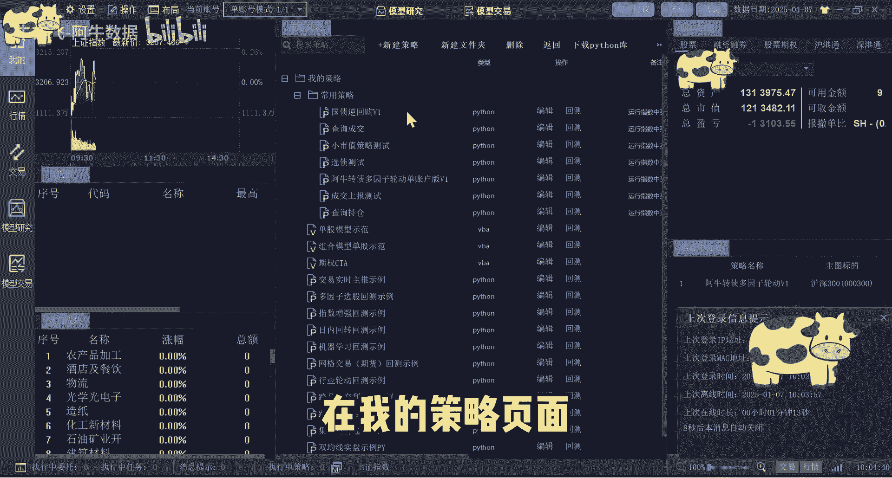
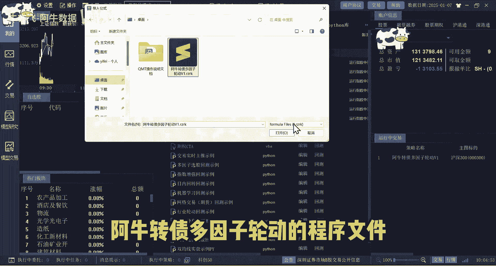
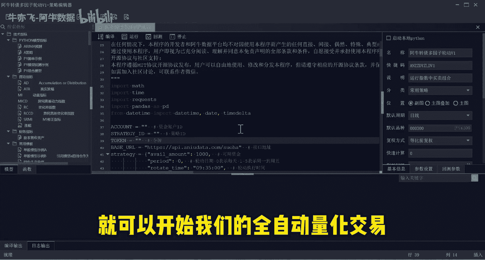
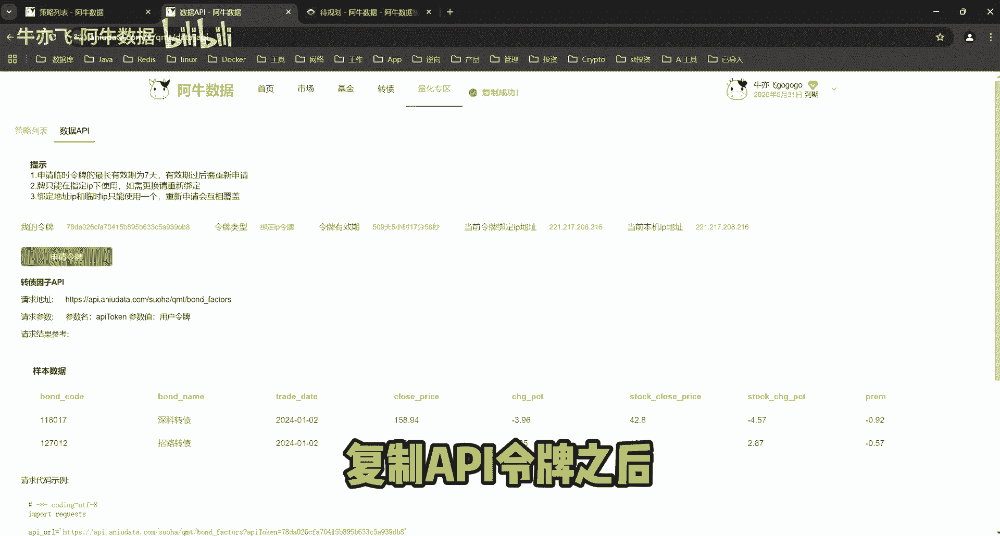
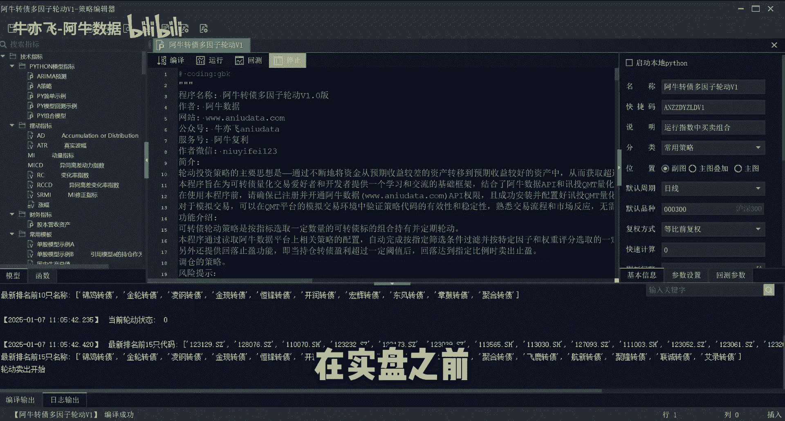
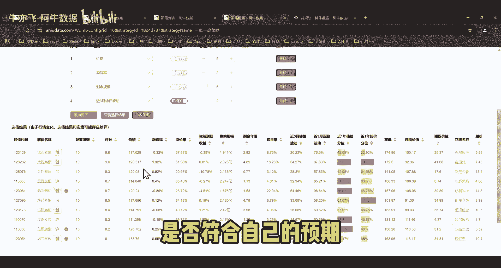
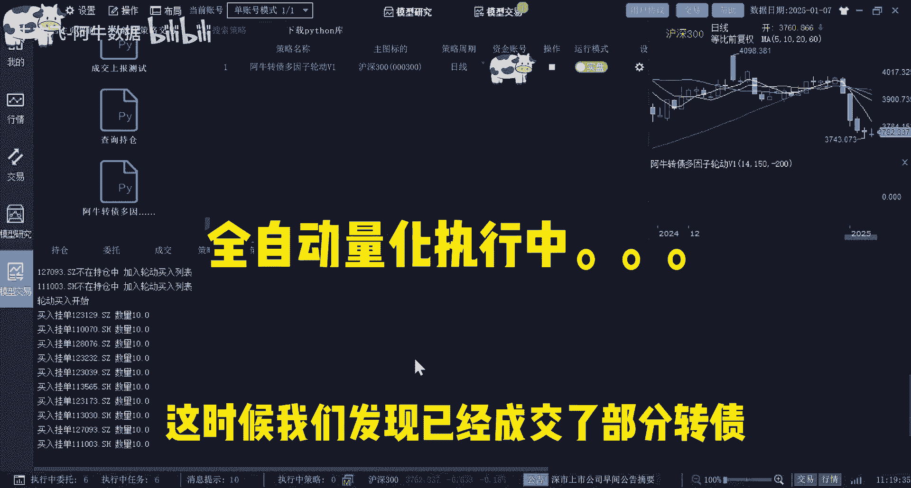
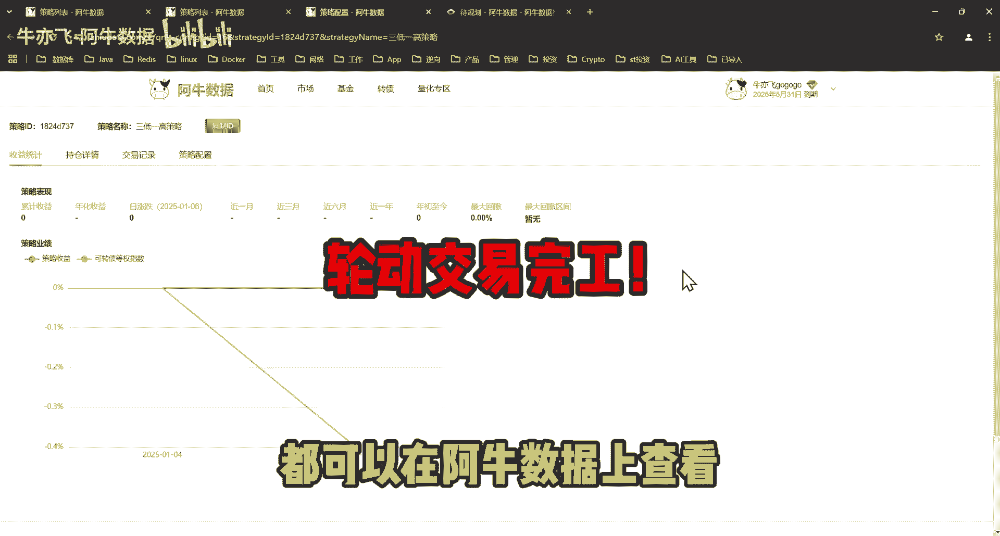

# 阿牛数据全自动量化攻略 - P1 - 牛亦飞-阿牛数据 - BV1EurSYLEK5

大家好，今天继续给大家介绍，如何使用阿牛数据，进行可转债的全自动量化交易。

我们打开q mt客户端，然后登录我们的账户，在我的策略页面。

我们右键点击常用策略，在这里选择导入策略，然后选择下载好的按钮，转载多因子轮动的程序。

导入之后，我们点击编辑进入到这个程序的源代码界面，我们只需要在这个代码里面填入资金账户id，阿牛数据的策略id以及API令牌，就可以开始我们的全自动量化交易。

我们还是回到量化专区页面，然后复制我们想要实盘的策略id，粘贴到我们的代码之中，然后再进入数据API页面，申请令牌，复制API令牌之后同样复制到我们的代码之中。

点击一下运行，在实盘之前测试一下程序能否正常运行。

再检查一下策略配置当中的投入本金，交易时间，时尚数量，点击查看选债结果是否符合自己的预期。

好了，接下来就可以开始，激动人心的全自动量化实盘交易了，进入QMT的模型交易界面，选择刚刚导入的R扭转债多因子轮动的程序，设置好自己的账户，点击确定运行模式，选择实盘，点击开始，首先开始进行的轮动卖出。

由于这个策略是新建的，现在并没有持仓，开始轮动买入，这时候我们发现已经成交了部分转贷。

实盘策略的交易记录，持仓详情和收益统计，都可以在按钮数据上查看啊。

