# 【python数据分析精华版来了（附文档代码）】10小时学会Python数据分析、挖掘、清洗、可视化从入门到项目实战（完整版）学会可做项目 - P35：08 电商数据分析案例 - Python万能胶 - BV1YAUuYkEAH

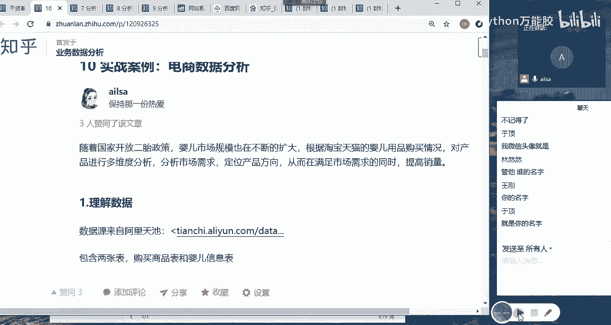

嗯，那我们这个大作业啊就是电商数据分析，它是淘宝天猫的婴儿用品用品的一个购买情况。然后呃我们从这个数据当中，然后需要分析啊一些我们想要的结果啊，但是这个结果大家没必要啊按照我这个啊我这个提出的问题。

然后去分析大家可以根据自己的思路，然后去做这样的一个按照这样的一个方式，然后一步一步的把自己的整个的一个结果啊体现出来。

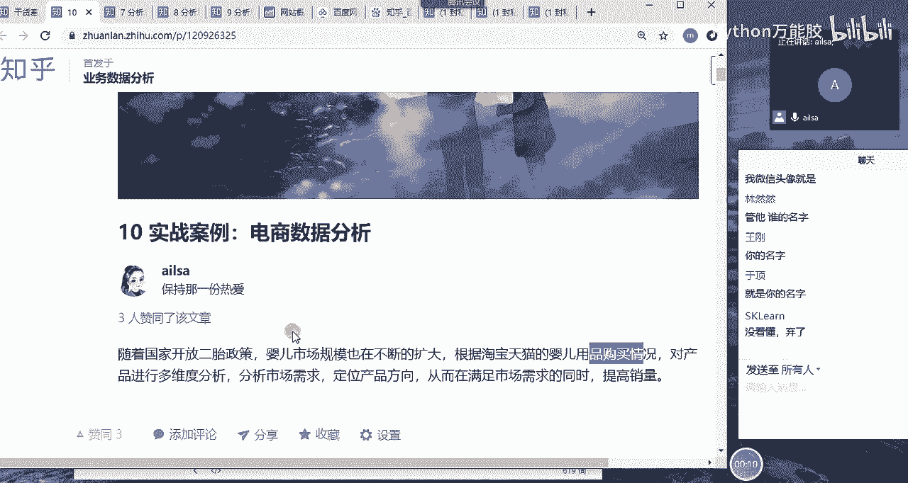

那我们看一下它的数据数据内容哈，它的数据内容有两个表。我这边应该有理解数据啊，他这边数据类型有两个表，一张表就是商品表，一张表是婴儿的信息表。

那这个商品表呢有用户ID商品ID商品二级分类一级分类商品的属性，购买的日期啊，购买的数量，那婴儿的就是用户的ID和出生日期性别。也就是说嗯也就是说这边购买的商品啊。然后这边是相当于是婴儿的一些信息。

那我们从这两张表当中，我们可以知道我们可以分析商品啊或者购买行为的啊这样的东西，还可以结合用户的一些基本信息，比如说性别出生日期，这样，然后进行一个用户特征的一个分析，大概是这两个维度。嗯。

然后如果大家没有太好的一个思路的话，可以在知乎上找一找。因为啊我在知乎上看过有不少基于这个案例的分析。你可以看一看别人是怎么做的，也可以看一看我。

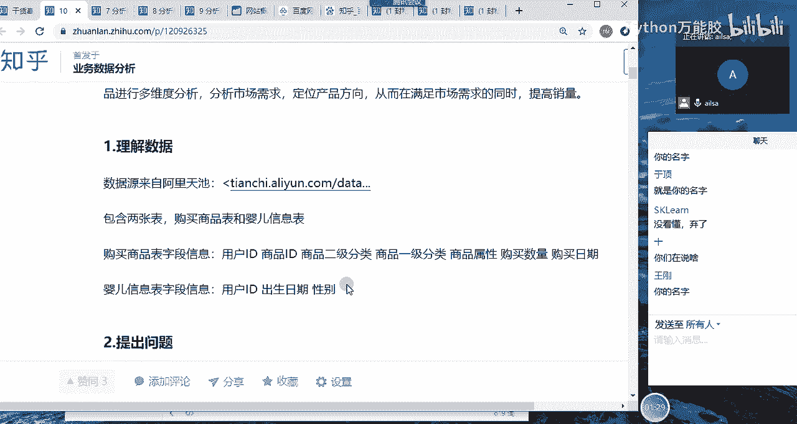

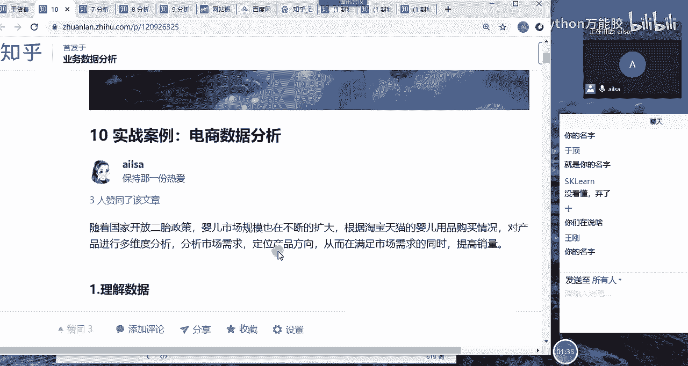

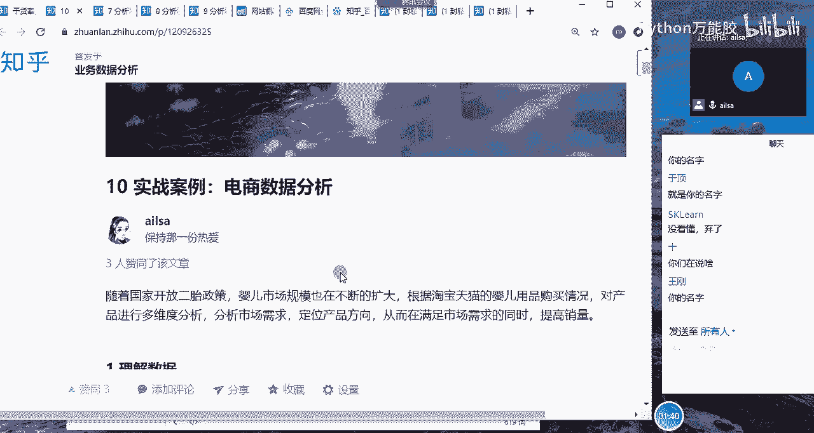

是怎么做的？然后结合这些，把自己的思路写下来。然后包括用到的哪些指标都可以写下来，然后呃一步一步怎么去深入分析的，然后找到了什么样的问题啊，这样的一个结果啊，我们也是从数据清洗开始，然后到数据分析啊。

然后到接下来的各个步骤啊这样的东西啊。

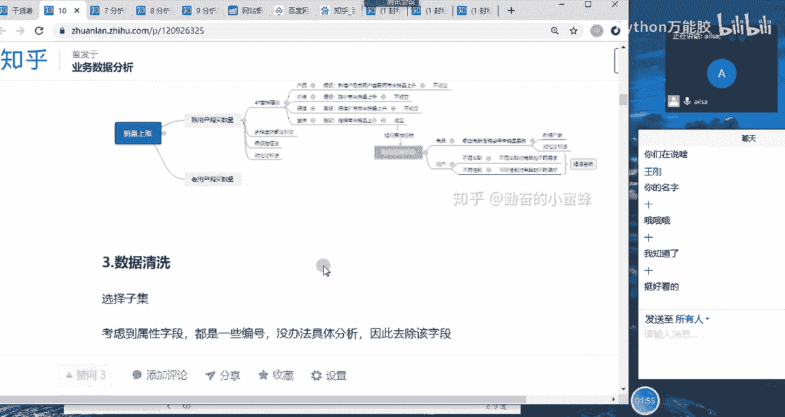

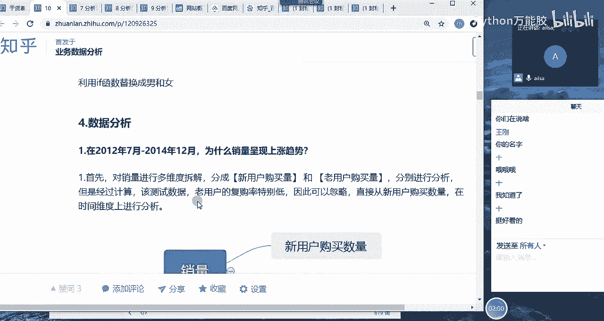

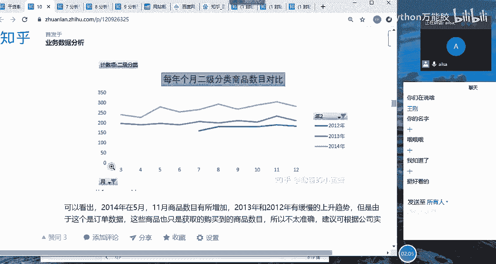

最后要得出结论哈，你分析完了之后，你要有啊，你要有你的结论啊，我还记的挺多。

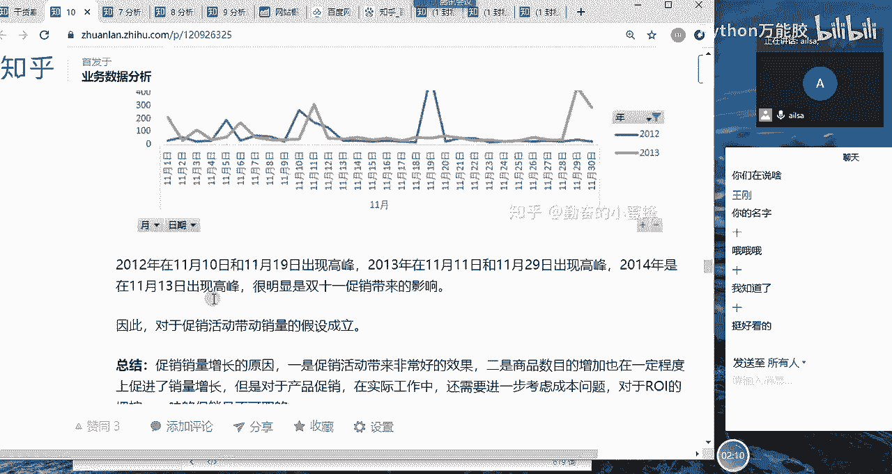

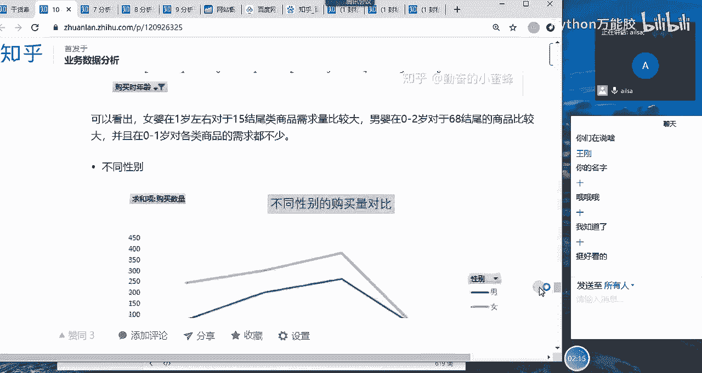

要你的结论啊，结论和建议，就是说你做过这么一堆分析之后，你从数据当中发现了什么问题，你提出什么建议，建议谁该怎么执行这样一个结果啊，大家对于作业了解明白了吗？

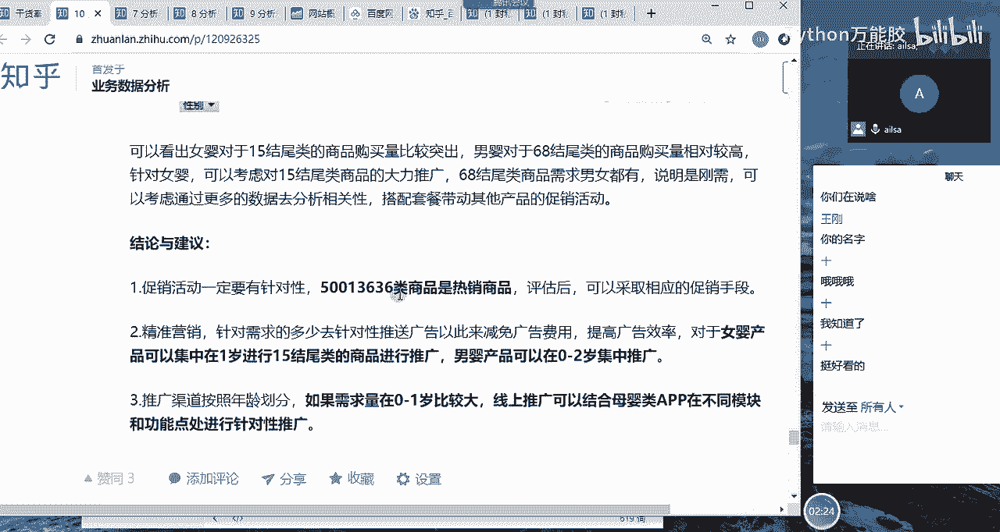

还在聊电影。啊，了解明白给我扣1。好的好的好的。😔，啊，这个就交给大家了哈，大家写的好的话就可以放到简历里当中了啊，就是我。

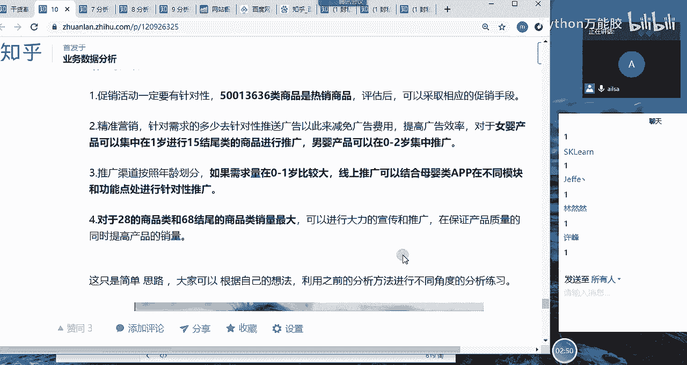

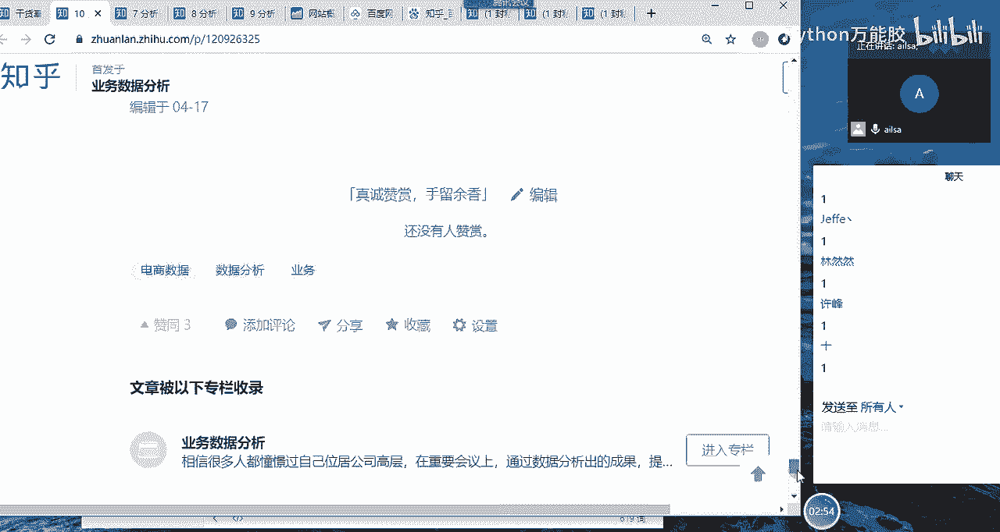

我们公司的一个产品，然后我做的一次分析。

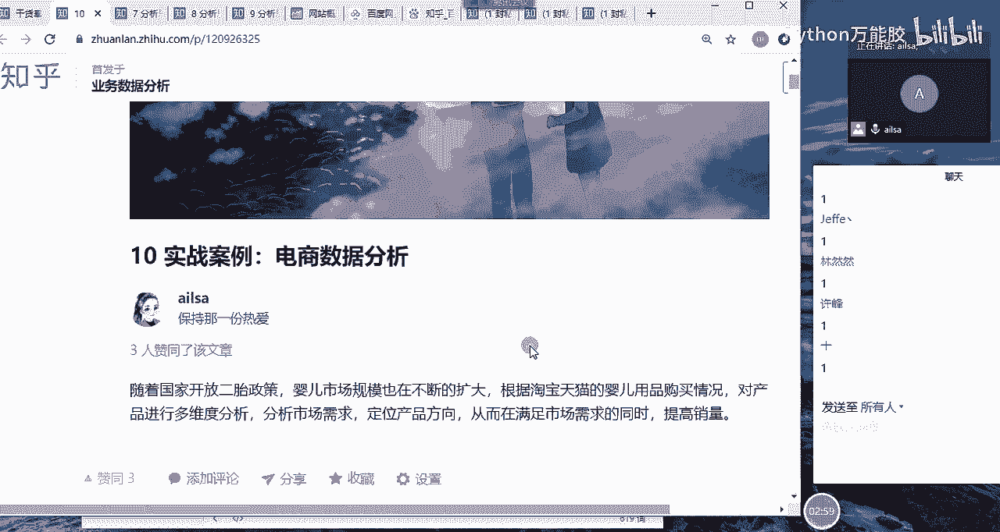

所以大家还是要重视。

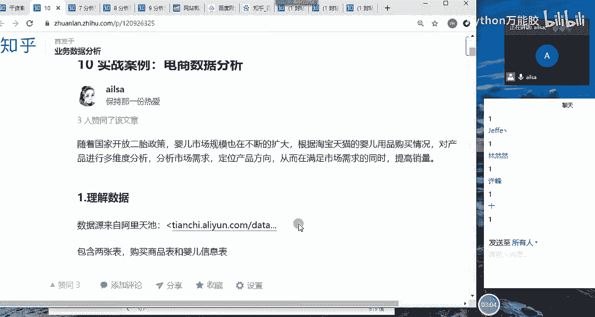

好吧。