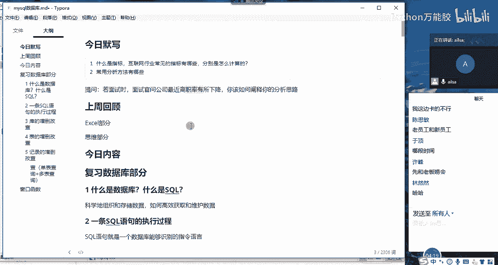
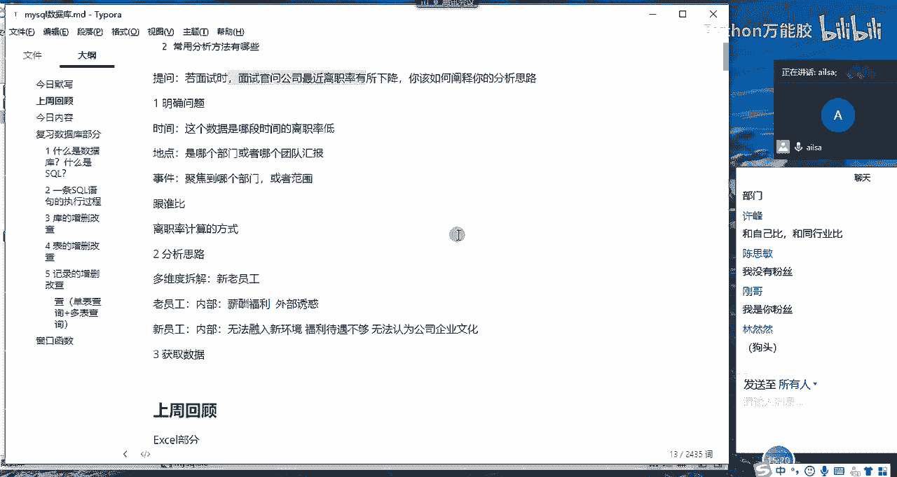
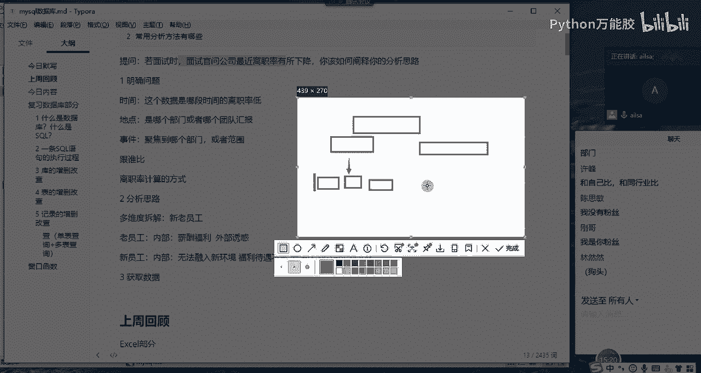
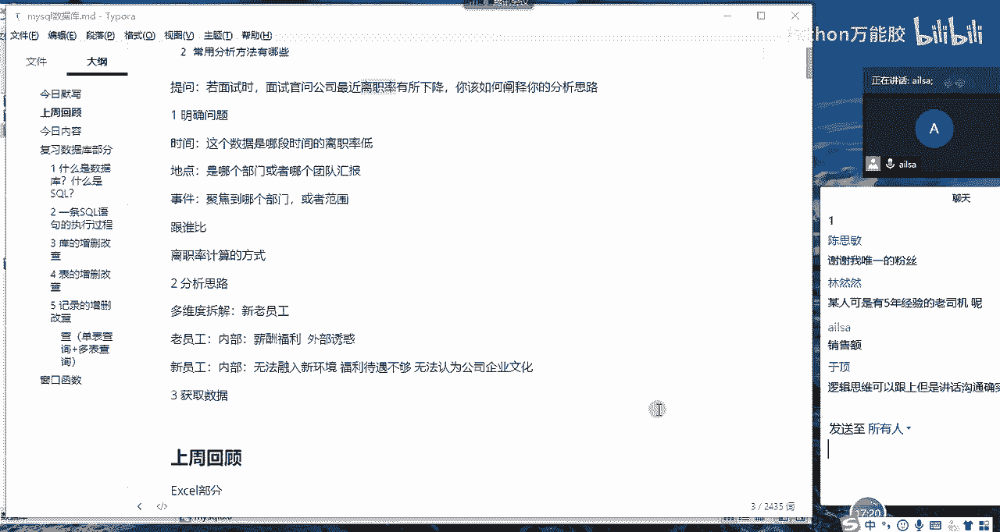
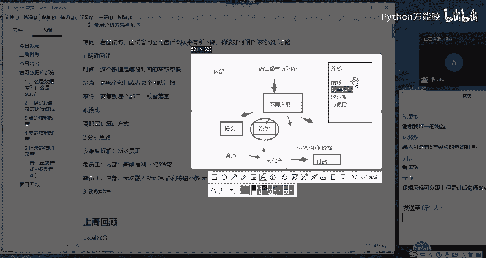
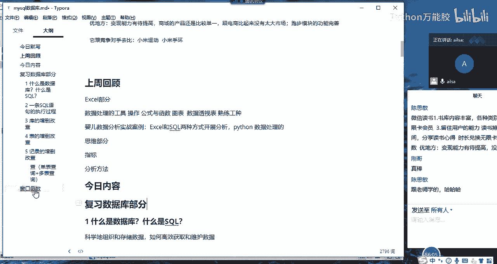

# 【python数据分析精华版来了（附文档代码）】10小时学会Python数据分析、挖掘、清洗、可视化从入门到项目实战（完整版）学会可做项目 - P40：02 如何分析业务问题 - Python万能胶 - BV1YAUuYkEAH

嗯，假设啊假设我们在面试的时候啊，面试官问公司最近的离职率有所下降啊，就比如说他抛出这样的一个业务问题啊，其实不算业务问题哈。因为离职率啊，这个是每个公司都会有的这样的一个指标。那你解释一下啊。

如果是你作为数据分析师，面对这样的一个数据的异常，你该怎么的着手你的分析思路啊，然后提交这样的一个分析结果给到你的上级领导，好吧，嗯，问题已经抛出来了。而且这个我在课上已经讲过了哈，原封不动的哈。

都是离职率。我看大家是怎么想的哈啊，这个时候我要提问一位同学啊。嗯，提问然然吧嗯。然冉，我给你解除静音了。Hello。hello，嗯，为什么是我呢？怎么又是我？啊，我不是第一次提问你吗？

怎么是第一次上一次郭晨不是转到我了吗？哦，没关系，因为你今天来的最晚啊。可能这样的吗？对，那那假嗯假设我是你的boss，然后公司最近离职率有所下降。然后我就想问问你该怎么办？有所下降。嗯。

那我先看他的这个离职率是不是健康。如果是。呃，不是那天讲不是离职率有一个健康的范围吗，就3%到5%是吧？如果他下降到这个范围内不是很好。那还要分析什么？是吧。嗯，嗯哎我听着呢，现在啊我是你的boss。

现在你在访问我吗？哦，那那。那就是按照那个呃之前课的思维是好是那那那行哎，那个冉然，我们现在重新来，假设我是面试官哈，我们不说课了哈，我是面试官。然后我就问呃，如果说你是我们公司的数据分析师。

假设我已经招你进来了啊，已经招你进来了，然后公司最近的离职率有所下降。然后呃你作为数据分析师啊，你负责这一块的业务，你该怎么啊呃做这个工作。啊。就是好像是从呃外部原因跟内部原因分析。

然后内部原因是就是呃是不是呃员工给自己的。薪资感觉到满意了。或者就是呃然后就是还有其他的就是那个啊是不是就是呃就那个什么类似于文化的那种东西，就是啊你你。呃，那个怎么描述来的？嗯，刘文光环吗？啊。

对对对，就这个别人关怀嗯给到位了。大家都觉得这个工资嗯还不错嗯。然后呢，还有就是。啊。还有。还有什么。嗯，内部内部就记得这俩个。然后外部的话，我记得当初。离职率升高是因为外部诱惑，这离智率降低。

诱惑不够啊。还有吗？うん。嗯。嗯。还有什么？嗯，现在让我突然想，我只能想到这仨。嗯，好的哈好的，那你可以关麦了哈。嗯。好的，哎，我说一下哈，我说一下这个冉冉同学，他给我们啊示范了一个很好的反面教材哈。

面对面对这种情况，我是一个面试官啊。我我要我要问你这个问题的话，首先对于业务问题的话，我考察的不仅仅是你对于业务的理解，还有你的逻辑思维能力哈。

因为我们在讲分析方法的时候啊，分析分析方法的时候，我们第一个。嗯。讲的第一个啊分析方法就是逻辑数哈啊逻辑数分析法。那啊逻辑数分析法意思就是说针对某一个大的问题，对吧？然后把它拆分为一个个小问题。

大问题很难去解决。所以说我们解决了一个个小问题，也就解决了一个大的问题。那面对离职率有所加下降。这样的一个业务问题的话，我们要学会拆解啊，拆解成一个个小问题。这是你的一个思路啊。

那刚才冉然这样的一个过程呢，就相当于就是说我他确实拆解了，拆解为内部和外部啊，但是呢它整个的一个分析思路啊，没有建立在一定的完整性基础之上。为什么呢？我们说了，对于一个指标的下降。

我们首先要具有一个怀疑个态度，是不是我们得先确定他这个是否是一个正常的现象。也就是说这个离这个指标或者这个数据。来的来源是否是准确的。所以说我们要明确这个问题，对不对？我们第一个思路是这个样子的啊。

我先提示到这里，然后我再教一位同学哈。

我再叫一位同学啊。那就。那就女生吧啊，思米。okK思敏，我已经解除你的经验了啊。喂。啊，是是你那边信号不好？我这边我这边特别卡啊，行，你现在能听清楚吗？我们是可以的。喂，嗯，这会还行啊。

那你说一下你的思路啊。我行不。日3。看一下那个指标就是属不属于正常的范围之内。通过。我的我的碗一顿一动的我，对不起，没事，你说我听得清，属于正常的话就。😊，就就看一下，就是他具体是在哪一段时间出现了。

就是哪一个部门，然后就是离职率比较高嗯，然后。嗯，然后再说他。我看一下，除了这个部门之外，还有谁啊，这个就是。对对嗯我不是故意砍的，是我这个。😊，王卡。行，你说你说嗯。就是还嗯。然后。为什么好想笑？

不想我要忍。嗯，对。然后就是嗯嗯分部门之后，就是发现哪一个部门，就是相对来说比较嗯。嗯，那个离职率比较高，然后就去看一下到底是在老园。么老员工的离职率比较高，还是新员工的离职率比较高然后嗯。嗯。呃。

如果是老员工的话，就会先看一下内部的就是。嗯，嗯分内部和外部，内部的话就去看就是看看他就是嗯。就是我我觉得就是可能跟你老师的稍微不太一样嗯。觉得就是可能是他对公司的，就是他自己本身嗯。嗯。

经验什么的都比较丰富了。他可能对公司对他的福利啊什么的不太不太。太满意。然后嗯如果外部的话，可能是有别人就是挖他，他要跳槽。然后嗯如果是就是新从新工的角度上说，就是毕竟刚来嘛，就是会。觉得。嗯。

就是嗯跟跟那个同事关系处的不好，或者是他的福利啊，什么工资啊什么都不是很到位，会就是嗯。嗯，肯定就这些了。好的。好了，你可以关麦了啊嗯，等一下。😊，At first。嗯。嗯，嗯你可以关麦了。思明。

那边信号不太好。OK哈。😊，OK思敏那边信号不好啊。嗯，他这边再去说的时候，我先去模拟一下哈。首先哎我刚才给他引导了一个思路，就是说首先我们要明确一个问题。

就是这个离职率下降下降到底是不是一个真实存在的问题。那我们明确问题可以从时间啊地点。地点，然后是我们的事件啊这三个维度，然后进行判断时间的话就指的是。啊，就指的是呃啊就指的是这个啊。数据是跟谁啊，是。

哪段啊哪段时间的离职力地哈。哎，我们要确定一个范围啊，这个数据是哪段时间的离职率低。然后第二个地点的话，就是说是哪个部门。哪个部门或者啊哪个呃团队汇报的，哎，我们要跟他去沟通啊。

然后事件的话是说呃是说呃我想想啊地点。是哪个部门或哪个团队？然后事件的话是。我当时讲的是什么？事件的话是跟谁比吗？跟谁比他低。啊，从这几个维度，然后去判断啊，应该不是跟谁比啊，我搂一眼哈。忘记了。

又开始给我瞎搞了哈，我们呃事件的话，我们就先当做他是跟谁比他低啊啊，对，是啊对，是聚焦到啊，事件是聚焦到啊。聚焦到啊哪个。啊，部门啊，或者是。啊，范围哈。范围。OK事件的话就聚焦到哪个部门或者范围。

就是到底是全公司啊的一个离职率高，还是说就个别部门的一个离职高，这是一个事件。然后地点的话就是指哪个部哪个部门或者是哪个团队去汇报的，我们要跟他去沟通这件事情。

时间的话就指的是这是指的哪个时间段的那我们这是我们明确这样一个问题。明确完了之后，我们还要再确定他是啊跟谁比他高了，对吧？然后是。啊，然后是这个离职率啊计算的方式。到底是什么？

是不是按照公公司统一的一个标准来进行一个计算的。如果以上这些都没有问题，那它第一个步骤就已经完成了哈，就已经完成了，就是问题已经明确了，确实是某个月份比某个月份的离职率高了很高了呃高了几个百分点。

然后是销售团队这样的一个呃数据内容。然后我们针对呃这样的一个明确问题的之后的结果，我们通过不同维度的去拆解啊。我们通过新老员工啊，或者是呃的根据年限的不同，分为新老员工去多维度拆解拆解之后。

然后分别针对新老员工在内部和外部两个方面进行一个呃原因的分析。那这是自己的一个分析思路，分析思路确定完了之后要啊获取数据啊，获取数据可以通过啊其他部门也可以通过。我自己的数据仓库对吧？哎。

这三个维度再进行讲解。你在。因为这是一个面试的环节。所以说你在说问题的时候，一定要有就类似于标题啊。你说比如说离职率下有所下降，然后你的分析思路是什么。你要说首先我要做的事情。

就是我要先明确这是否是一个真正存在的问题。然后从以下三个或者以下几个方面去啊去阐述或者去分析说时间方面，地点方面，事件方面就让面试官会感觉到你整个的一个思路非常的清晰。

然后你第二个再进行一个呃问题明确了之后，拆解的时候，你要顺带带上自己的一个分析方法。你比如说我们学了多维度拆解哈。那逻辑数不用提哈，逻辑数是一个分析的思维方式哈。啊然后你比如说我首先要对维度进行拆解。

按照年限的不同，分为新老员工，然后老员工通过内部和外部两个层面，然后去。分别分析具体的原因，然后新员工也是一样，怎么怎么着，然后获取的数据从应该是从哪些方面去获取数据。然后啊然后最后得出结论。

结论不用不用说啊，面试的时候面试环节不用说结论。他如果在面试官如果再进一步问，你说，假设你分析出来呃什么什么你应该有什么建议的时候，你再去得出这样的一个结论。我们在面试环节遇到遇到这种啊业务问题。

这属于业务问题啊。比如说某个指标下降了，某个指标上升了，然后公司某个业务存在问题。这种这种都属于业务业务问题。它不是说去考察你的业务能力有多强，而是他考察你整个的分析思路是否清晰啊。

如果说你分析思路特别清晰的话，代表你的逻辑思维能力是很强的。那你就比较适合做分析。之前我在讲逻辑数分析法的时候，我我就跟大家说过减肥那个案例，对不对？你们呃想要减肥。然后这个事情出来了之后。

那大家的一个想法就就是很零散，对吧？哎，我就是少吃点，然后不吃菜的呃不吃肉什么什么等等这些就比较散。但是如果说你整理成啊你整理成这样一个数啊一个数一个大问题，然后往下拆解啊，对吧？拆解一个个小的问题。

然后一个个小的问题呢，再往下拆解拆解一个个部分组成。然后如如果说你这些小的问题解决了，那相对来说你的大的问题也就解决了。那在这个过过程当中，你看它有一步一步的拆解这样的一个过程。

那你看我们的比如说我们的一个离职率下降作为整个的一个标题的话，那接下来两个三个方向，就是第一个要明确问题。第二个就是分自己的分析思路。

第三个要进行数据处理。然后那明确问题，我们通过时间、地点、事件来进行分别的确认。那分析思路的话，我们通过维度、新员工、老员工分别又从哪些维度去拆解，对不对？

这才是你整个的一个分析过程当中应该具备的正确的打开方式。

嗯，那大家对于这个问题明白了吗？嗯，明白明白了，给我扣1。啊，一定要我我我就是我在讲这个思维的过课程的时候，大家大家一定要把这个这个这个想想问题的一个方式啊给融入进去。而且应该在座的都是理工科学生哈。

都是理科学生啊，老师我可是文科生？如果你们的思维方式还没有我的具有逻辑性，那是不是不太好，是不是我可是文科生哈。所以说你们在进行分析的时候，一定要把自己的思路一条一条的都梳理的特别清楚，特别明白。

然后才可以这个啊有的人说哎，这个我对业务部了解什么什么的。这个都是。那这个都是啊这个都是有套路的哈。你你分析离职率是这么来分析的。比如说你在分析销售额的时候啊，我跟大家举一个销售额的例子哈。

你在分析销售额的啊你在分析销售额的时候也是一样。你比如说啊公司最近抛出了一个业务问题，或者你在面试的时候，别人问哎，最近公司的销售额有所下降，你该怎么办啊？大家想一下，销售额有所下降。

我们先看一下销售额它是怎么来计算的，是不是销量乘以单价呀啊，那我们就在想销售额，那公司的产品应该不止一个吧，对不对？那呃那我就可以进行一个多维度的拆解哈。

拆解到哪两个方面呢？一个啊是啊按照不同产品哈。放到下面。按照。按照不同产品啊，比如说啊不同产品哈，你就比如说哎我们的呃那个教育行业啊，就比如说K12K12大家都知道吧啊，就是从呃小学一年级啊。

甚至是幼儿园，然后到高中啊这样的一个啊不同的不同的市场范围内。如果说公司总体的销售有所下降。我们肯定在分析的时候，肯定说啊我要通过产品，我要通过运营，我要通过渠道等等各方面去分析。

但是你要首先做的第一步操作，你要给它拆解。因为你的如果按照那个思路去分析的话，你的范围实在太大了。你按照不同的产品去拆解。你比如说你可以拆解为。哎啊假设哈我这里举的举的一个例子哈。

假设啊语文啊我们有语文课哈，语文啊语文科目啊的产品销售额，你对比一下，然后又分为数学啊数学。啊，语文、数学、英语啊，或者是我们的pyython啊，少儿编程也也是有的哈哎思维的课程。语文、数学、英语。

然后还有等等其他的，你按照不同的产品，然后去拆，你去分析一下到底是哪个产品，它下降了啊，到底是哪个产品下降了。比如说你最后分析出来是数学这个产品啊，它下降了，销售额。积极就是猛烈的下降。

造成了整个的一个销售额的下降。这个时候数学就是你的聚焦对象，嗯，数学就是你的聚焦对象，然后你就把数学。你就把啊整个数学拉出来，拉出来之后，你要从哪些方面去分析呢？你就要从。从什么呢？从整个渠道开始哈。

就是说因为渠道这边是整个客户的来源的入口。所以说你看渠道这边过来的客户是不是少了，那客户少了，是不是整个的一个销售额也就有所下降了。那如果说渠道这边没有问题，那你要再往下看，就是这个渠道啊。

这些渠道过来的客户啊，我们再走一步哈，这些渠道过来的客户质量怎么样？哎，如果渠道没有问题，我们就看转化率啊。啊，看转化率啊，各个环节的转化率哎是否正常啊。啊，转化率是否正常？

如比如说这个从那个百度推广过来的100个客户，到最终啊成为我们的啊就是注册AP的客户。如果只有10个，那说明这个渠道是不是不健康，我们要去分析每个渠道的转化率，如果各个渠道的转化率都没有太大问题。

我们还要再往下分析，分析啥呢？分析他整个的一个付费转化率。也就是说这个客这个渠道过来100个用户有90个都成为我们的注册用户数了。那但是他最终购买的时候，因为最终我们要分析到钱嘛，对不对？

那他最终到购买的时候啊，发现哎就是付费用户数哈，我们也可以从付费用户数或者是我们这个付费转化率啊，付费这样的一个角度去看。哎，发现这个又下降了，那说明是不是在这个环节。

就是从我们的活跃用户转化为我们付费用户的过程当中出现了问题，那我们就要再进行分析。如果说是这个环节出现了问题，我们还要再进行一个分析，分析啥呢？为啥他不付钱，你比如说大家都知道现在的课程啊。

咱们的教育行业现在的课程都有什么。你看你比如说咱们的咱们都有试学，是不是你上来先给你上两周免费的课，对吧？呃，不是免费的哎也算是免费的课，就是试听嘛？然后如果你觉得不满意，你可以走，对吧？

那如果说假设啊假设我们就处于这一个环节，就是我们学校把你们招来了之后，你们上完课之后都觉得不满意，都没有付钱都走了，那相对于公司来说，整个校。到时候我是不是就有所下降了。

那你就要会分析这个环节到底是什么原因造成的。到底是啊这个时候我们就要从不同的啊方面，就是它相关的不同的方面去分析了，分析啥呢？哎，到底是就是这个是就具体到很多方面哈，到底是环境的因素啊。

环境的因素还是讲师的问题，还是说啊学费啊，比如说价格的问题啊，价格的问题啊，是不是价格太高了，大家不愿意买。然后还有就是听完这个老师讲课，其实老师讲的也不咋地，然后就不愿意买了，还有就是环境的问题。

是不是上课环境太差。比如说大家都想线下开课。但是现在线下开不了线上线上的效果不好，所以大家又不愿意购买。所以说都有这些造成的一个问题。那你看我从整个销售额下降。

然后按照不同产品的维度去拆解拆解到一个维度之后或者是1到2个哈，他不可能啊不可能所有的产品都出现问题。如果说所有的产品都出现问题，那应该是啊就不是单个原因造成的了，就有可能是啊外部环境造成的哈。

就不是就不可能是内部的一个原因了。然后你再通过啊。在如果说是某一个产品的问题，你再通过整个从客户来源的角度去出发，从客户从哪儿来的，他经过了哪一步哪一步的操作到最后付费。然后你看一下，在这个过程当中。

哪个环节出现了问题。然后你找到这个环节，你再看一下影响这个环节的因素有哪些。然后再针对这每一个每一个因素进行分析。那这其实呢这只是一个方面，什么方面呢？这只是内部原因分析哈。啊，这只是内部原因。

你看我们出现了销售额下降，我们什么都没想，先分析自己的原因，对不对？那内部原因就是这么来分析的。如果说是我们分析完之后发现分析了一圈都没有什么特别大的收获的时候，这个很正常哈。

你不要以为你做分析都一下子都能做出来，得出很大的结论，你发现了公司存在重大问题，这不可能哈，这个这个分析有时候你分析了好久，最后分析出来啥也不是哈，真的是啥也没有得出什么重要的结论。

那还有可能是外部的原因啊，你比如说销售额下降，对不对？那外部的原因，看疫情对吧？疫情造成了整个的一个市场环境发生了变化。然后因为这样的一个突发事件或者是不可啊。

不叫什么不可抗力的一个事件造成了整个销售额的下降啊，这也是有可能的。但是一般情况下内外部原因，我们都要进行分析。那外部原因就是比如说是啊环境啊，就是那个。呃，突发事件啊。

外部环境哈啊市场啊外部环境啊市场还有可能是我们的竞争对手啊，竞争对手，他们搞了一些比较厉害的促销活动，或者是他们使用了一些手段，然后把我们的客户给挖过去了，这也是有可能的竞争对手，对吧？

那还有一种还有一种什么呢？就是说这个销售额下降啊，有时候我们在前期的时候还要去评判一下他这个下降是否属于正常。为什么呢？你比如说我们的呃整个的一个呃教育行业，它是分淡旺季的啊，如果说是淡旺季这种的话。

其实呃如果说是因为这个原因，那销售额下降，它属于正常范围就可以不必啊采取一下各方面的一个维度的分析了。那还有可能是什么节假日啊，这种啊节假日类似于这种啊这种外部环境造成的这其实就是外部啊的一些影响因素。

我们一般情况下。在分析的时候，如果说啊我们的外部环境比较敏感的话，我们优先的是先考虑外部环境。因为外部环境相对来说会比较好分析一些。那内部环境就牵扯的数据就会比较多了。

但是分析外部环境就会有一个很大的点在于什么呢？我们的数据不好获取啊，你比如说竞争对手啊，你可能就得特别关注人家的一个搞的活动，以及人家搞活动前后，然后带来的一个效果的影响。

你可能这一部分数据就需要挖掘一下了啊，那对于内部的分析的话，他整个的一个数据还是比较完整，比较好获取的啊，明白了吗？啊，那如果说面试官在问你的时候啊，比如说现在我是面试者，面试官问哎。

如果说我们公司的销售额下降了，你该怎么去分析。假设你是负责这个业务的数据分析师。那首先你要回答的第一个问题还是明确问题，什么呢？你说啊首先要先啊就是第一个啊，你说对于这样的一个问题啊，不对哈，同志们呃。

我跟大家说面试的时候，面试官啊，在抛出一个很重要的问题的时候，他不会让你立即回答啊，他可以让你思考1到2分钟啊，或者是说比如说他说公司的销售有所下降。然后如果你是作为公司的数据分析师，你该怎么做。

这个时候你不要着急回答，你先想想自己的思路，然后你可以这么跟面试官说，你说啊面试官我这边可以思考1到2分钟吗？他肯定会说完全可以的。因为这个问题比较大，你需要在脑海里去想，这个时候在这一分钟当中。

你就要去想你的思路了。哎，我第一步明确问题我应该明确哪些问题。第二步，我分析思路，我应该从啊哪些哪些维度去分析，因为这个都是套路哈，只是说你的分析维度和各方面不是特别一样。一但套路都是这么多哈。

这个时候假设你你思考好了，然后你就可以跟面试官说，哎，面试官，我这边可以了啊啊，那你就可以开始讲了。你说针对这样的一个问题，首先我们要先明确这个是否是真正的问题那啊首先想想问一下面试官，哎。

这个销售额下降，他是啊他是在哪个时间段啊，这个下降了。那第二个就是这个数据，您是从哪获取的啊，然后第三个就是说这个销售额下降是指所有的产品销售额都下降了，还是说个别产品啊，你可以明确这样几个问题。

还有就是这个相对于谁而言，它下降了啊，你比如说是相对于上个月还是上个季度还是上一年啊，然后然后是这样的一个明确完了之后，你说第一个我要先明确这些问题。

假设我明确这些问题得出来的结论是4月份的销售额比3月份的销售额下降了10万啊啊就是啊所有全公司所有的。销售额啊，那这个时候我的分析思路是大概是这样子的。首先我要从不同的产品类型啊去拆解这个指标。

然后去分析不同产品的一个销售额情况。然后啊假设我得出来是某一款产品的销售额啊极度下降，造成了整体销售额的一个下降。那针对这个产品，我需要开展以下方面的分析啊。首先我会从渠道方面。分不同的渠道啊。

然后去分析他整个的一个呃渠道的转化率是否是正常的啊。然后如果是没有问题，我会接着往下分析他转化过来的这部分客户到最终付费，哎，这个环节是否是存在是正常的，是否存在问题，假设哈你可以给自己抛问题哈。

比说假设这个环节是有问题的那我需要从哪些哪些哪些哪些方面，然后去分析，然后说完了之后，你跟面试官说啊，因为时间有限，所以说以上就是我大致的一个思路啊啊，就这样啊，或者说谢谢，然后就可以了啊。

然后这只呃对，前提你要说是从内部和外部两个大的方面，然后去分析啊这样。

嗯。大家听明白了吗？嗯。听到没？给我扣个一。好。这就是这就是一个在实际的面试过程当中。然后你针对业务问题该如何回答的一个全部的流程了哈啊，你如果这么去回答完了之后，然后我跟大家说，这么去回答完。

你可以体现你两点能力。第一点就是你的业务理解能力，哎，说明你在公司确实是做过这样的一个工工作。那第二个就是说你这个你这个面面试者或者你这个呃你这个职场人他整个一个思维逻辑还是比较成熟。

比较稳定那说明他比较适合做数据分析。那其实是比较呃就是说他们公司愿意招这样的人愿意去培养。好吧，那这就是我们前期在讲啊上其实我主要是为了说明我们在讲上周五的时候。

在讲整个思维课程的时候的一个的初衷和目的，就是希望大家能够。融入一些呃我们软实力这样的一些东西。认为数据分析师你不能只会数据处理，你还要学会如何去做分析，而且如何做分析是非常非常重要的。

你要有这样的一个代入感，然后还有就是大家在平常的一些生活当中都可以融入自己的一个分析思维，比如说你看到了别人的一些促销活动，然后看到了别人的怎么怎么着，你这个时候你可以去想一想，哎，哎他为什么要这么干。

他这么干的最终目的是什么？那就比如说我之前给你们举个例子，天桥上经常有人发小礼品扫扫二维码，然后关注公众号，类似于这样的一些操作，他们的目的是为了干嘛呢？啊，他们为什么这么傻，你扫一个扫一个二维码。

然后扫一个什么关注他们公众号，他们就可以啊，他们就可以给你小礼物呢，对吧？啊，那他们的目的其实是为了对吧？你也知道哈，大家也知道。然后还有就是你在是在那个服装店买衣服。的时候经常会说让你充个会员对吧？

免费啊，免费充个会员，然后给你打折，还要怎么怎么着。你想一下，充会员这个东西他们是用来干嘛的。而且你还会发现你你充完会员之前，或者说怎么怎么着之后，你要去关注他们的公众号。

他们的公众号其实就是一种运维运营手段。运营手段。然后就是呃就是说他们定期会发一些服装的啊一些信息啊，然后的话让你有欲望去购买，让你成为他们的粘性客户，对吧？然后就对就是他们提高啊。

就是提高自己的一个呃用户粘性或者增强用户购买力，他复购率嘛。因为你第一次你肯定是先第一次去购买了。他想留住你，他就会让你充会员，然后一是打折，二是他你还能关注他的公众号，然后啊一一举两得嘛。

对于你来说也好，对于他来说也好这样的一个呃双赢的这样的一个方方式哈啊，你包括现在还有很多啊，现在实行很长的很就是比较常见的一个新新型的运营手段，就是转发啊，转发什么。嗯，就是比如说你想你有一些公众号。

他们会分享一些呃就免费的资料，比如说数据层面的免费的资料什么的。然后呃需要你转发10个朋友啊，这就属于这就属于叫裂变啊的一种方式啊，就是说转发转转发朋友圈，然后还有就是啊你去某一个某一个饭店。

然后去吃饭。然后他说你发个朋友圈，然后集32个赞。然后就可以啊免费获取一个啊小凉菜呀，类似于这样的，其实就是。扩大宣传嘛，对不对啊？就是说呃拿利益去诱导你还。嗯。对，是就是这像这种的话还好啊。

这种的话还好，因为它没有金钱的一个交易，它被封的会有哪些呢？就是说比如说呃你假设哈假设我在写知乎，然后文章，我说你在下面给我评论一次，然后我就给你5块钱。那这种的话其实就属于啊，就属于啊就会被封。

就有可能会被封。但是嗯但是我会如果说我转变一种方式。我说啊你你给我点，你给我评，你给我评分，然后我给你做积分，然后积分达到多少之后，然后你可以兑换什么什么东西啊，这种是OK的。啊，这种是OK的啊。

这种就呃应该还好。明白了吗？所以你们在日常的就是我们日常的，哎呀，你比如说像淘宝，像支付宝，他们的运营手段都特别厉害。就是还有那个美团，他们那个发红包什么的，其实无形当中我们都是为了自己的利益。

然后或者是他们给我们提供一些好处。然后我们其实他的收获会更大一些。因为你想一下，他获取一个客户的成本是需要很高很高的。但是相当于现在他花了一点钱。

然后他就可以获取他就可以有可能会获到获取到很大批的一个用户的时候啊，是非常好的嗯。淘宝这种的话其实已经啊已经啊已经定型了。像这种啊就是五星好评，我一般都很少去领这个钱。如果他东西真的好的话。

我就会给好评，然后也不会去领他这个钱。嗯，嗯，还有什么呢？反正就是呃你们多关注一下，多关注一下自己日常使用的APP啊，然后就可以发现有很多啊有很多诱诱导你的一些行为啊。

然后大家啊大家呃我给大家布置一个作业吧。然后因为我看今天大家答的也不是特别好。然后布置一个作业，什么作业呢？就是说。这个啊这个也是面试过程当中啊。面纸过程当中给你的布给你的一个坑哈。

所以说我首先问你第一个问题哈，现在大家就直接来来回答我啊。你日常生活中常用的。APP啊。有哪些说一个就行。同志们，你日常生活中常用的APP有哪些说一个就行。啊，微信好的。明日方舟。王者荣耀。

哔哩哔哩B站嗯，还有吗？QQ。啊，内涵段子OK。我要直播OK。支付宝啊。还有吗？抖音好的。支付好的。拼多多好的。OK哈呃，除了除了后三个以外哈，除了抖音、知乎和拼多多之外，以上的所有同学都掉坑里了。

为什么这么说哈？我告诉大家，我告诉大家，面试官在问这个问题的真真实的，他下一步就接着会问，接下来会问一个问题，再问一个问题，你就掉坑里了。他会问你觉得啊APP啊，这款APP。这款APP好在哪里？来。来。

冉然，你觉得支付宝好在哪里？从你最好是告诉我，你是从数据分析师的角度来去分析的。因为你面试的岗位是数据分析师，你要从各个方面去体现你分析的思维。既然面试官这么去问了。

肯定是想让你说出一些呃超出于常人的一些见识和想法。嗯，那你想一想。啊，如果你这么去回答的话，那你就是一个普通人，你就不适合去做啊，你就不适合去做数据分析师啊，你明白吗？而且我接下来还有一个问题。

那你觉得。这款APP。啊。有哪些啊有哪些？地方是需要优化的，就是你提出你自己的建议和想法，你在哪些地方用的不好用啊，这这三个问题我跟你说啊，就是你日常生活中常用的APP有哪些啊，在面试的过程当中。

你要注意两点。啊，第一点。不要啊说大众，不要说太过成熟的产品。太过于成熟的产品，它没有什么特别大的缺点啊，而且说每个人都在用，我们也很少去研究它了。而且大家都比较熟，你知道吗？比如面试官。

比如说支付宝面试官可能懂得会比你多很多。然后你在说的时候，你怎么说，你说的再好，你可能因为人家已经抛出这个问题，人之前应该是研究过的。所以说你肯定达不到他所想要的一个效果啊。

不要说太过于成熟啊和大众的啊APP。这是第一点。第二点。如就是说就是面试官问你这个问题，还有一个还有一个想法，就是他想知道你在日常的。生活和工作当中啊，你除了你的工作时间，你其他时间在干什么。

就是看看你个人的一个呃呃生活习惯。你比如说你经常啊你说刚才有人说看内涵段子是不是这个的话就是有点就觉得说哎这个人是不是。不上进啊，就有可能会这样的给面试官这样的一个想法。

你的这个APP一定要是充满正能量的，明白了吗？啊，对，要是就是我们不是说特别虚伪哈，就是你要因为我们手机的APP应该不下2到20到30个，对不对？那你可以说一点。

就是体现你品味的一定是体现你品味和价值的。你比如说这个人就比较积极的正能量。那他就比较喜欢用的产品或者比较喜欢用的APP应该就是读书类的对吧？读书类的，然后健身类的。啊，健身类啊旅游类。啊。

旅游类这样的东西啊，然后就是提高提高自身，以及说呃偏啊偏积极向上的这种啊。所以说第二点就是一定不要说太过于呃呃俗气的啊这样的一些啊APP。那你比如说有人说。有人说知乎是可以的，抖音也是可以。

因为抖音现在在迅猛的发展过程当中，而且大家都比较熟悉。那它目前的产品还不是说特别特别特别的完善，你可以提出自己的一些想法。你说抖音的时候，如果你说你是经常用抖音，那你最好你面试的岗位是跟视频有关系的啊。

这个的话，第三个哈就是说可以啊，第三个可以什么呢？第三点就是可以跟。啊，可以跟面试。好的，岗位类似的APP。啊，内容类似的也是可以的哈。

那我对我希望说我希望说大家能够回答到的就是啊啊就比如说我还是我推荐的哈，对微信读书啊，keep啊健身类的。然后嗯啊微信读书是可以的哈，微信读书是可以的。然后keep啊还有就是抖音也是可以。

你们可以自己想，但是内涵段的这种就算了吧。然后拼多多也可以说啊，但淘宝支付宝这种就不要说了哈，因为它实在是太过于成熟了，我们没啥可说的，知乎也是可以的。那你说完了之后。对。

一般情况下你不要给自己呃埋大太大的坑哈，你说一到两个就可以了。然后他让你挑一个，有时候他可能会让你挑一个，因为时间有限，他让你挑一个，然后说说这款APP好在哪里，好在哪里啊。

它就是让你从数据分析师的角度，然后去啊去看待这个APP。你比如说啊你比如说我就拿keep来说，还是我给你们介绍的cap，因为我比较熟，天天都在用。你比如说你这个keep好在哪里？首先啊第一点哈。

你的思路一定要清晰哈，我们在如做任何呃表达性的啊，特别是给别人进行表述性的东西的时候，包括你在开会怎么怎么的怎么怎么的时候，你的思路一定要清晰哈。第一个就是那它的内容比较优质哈。啊，这也是每一款啊。

对每一款APP或者是每一个产品应该具备的最基本的内容，就是它有好的东西才能够吸引好的用户。所以说它的内容比较优质，它包含了啊包含了啊就是健身啊健身跑步。啊，走啊。啊，跑步，然后是还有瑜伽啊，还有冥想。

啊，就是它内容会比其他款的APP会更丰富一些啊，然后它的内容是呃涵盖。各个啊水平段的啊，比如说有小白，然后有初级，有中级和水平段的啊，然后还有就是他的整个的一个课程啊，也是比较合理啊易学。

啊啊这样的一个呃这样的一个特点。所以说只要用户一上来就是一打开，只要下载了这个APP就觉得特别特别好用，就不会再用其他的产品了。所以说因为这样的特点，它吸引了。还大量的用户啊，所以keep。

keep有很大的一个呃用户群哈啊keep的呃keep的那个整个总共用户数是很大的啊，就是因为他有优质的资源，所以说呃客户来了之后他就不想走了。然后第二个的话就是。好，第二个你看他有这么大的一个用户群体。

对不对？那他也有自己的一个变现的能力哈。就是说一款APP它除了提供服务之外，它还要赚钱呢。对，不然你不赚钱，你怎么去拉投资啊，怎么盈利，对不对？它还有一些变现能力。那怎么去体现呢？就是说它有制定。

你一上来，他就会给你制定的什么什么健身计划，那个是收费的哈，健身计划有私人教练。啊，私人教练还有什么呢？就是有会员制哈，会员制就是有收费的啊，免费的和收费的课程，收费的课程，它还有自己的商城啊。

这的商城主要卖的是啊主要卖的就是运动啊，运动服装和器械哈。运动啊。运动服装啊和器械。运动器械啊，它有自己的商场等等这些啊，那这是第二，它变现能力。那第三点就是它还有啊很强的一个活跃。啊。

他还有很强的留啊留住啊用户的能力，我们叫留存率哈，留住用户的能力，它是怎么来实现的呢？就是它有自己的社区哈，社区就是有达人分享啊，就是说大家分享一些啊分享一些这建测经验，还有一些他们拍的整个的一个视频。

还有就是他们的就是每一个下载ke的人，他们在里面叫ke哈，就是说你如果是使用ke的，然后你就叫keper，然后ke里面啊，还有就是ke的啊日常运动分享。啊，他们会呃有就是说呃就是。一个月前啊运动。

比如说他专门练小腹这样的一个对比啊，给大家一些积极正能正能量的一些东西。ke的一个日常运动啊记录。还有饮食啊饮食方面啊，所以说是提供了。积极正能。正能量的信息啊，然后激励。

大家啊激励keeper或者是激励keeper，然后不断。努力哈，因为健身这个东西它其实是反人性的，所以说很多人坚持了一段时间就不想坚持了。但是他有这些呃这些社区啊。

达人分享就觉得他们还就是还有一些就是还有什么什么加入啊，什么什么计划，就是运动计划。啊啊，运动啊运动计划。啊，就比如说他们搞了一个什么活动，然后几千人加入，然后大家一起这样的一起去运动啊。

这样的一个留住客户的一些能力啊，所以他留存率还是挺高的。然后还有就是。大概的大概的优优点，你就可以说这三个哈，你说一款啊一款好的APP肯定要是有优质的内容，而keep确实是内容非常优质。它包含了什么。

包含了什么？因为这样一个原因，所以说他吸引进了大量的用户，所以keep有很大的一个用户群，他的总的用户数啊是很大的啊，这是第一个有了用户群之后，那他第二个就是说它整个的个APP还是很健康的。

他有很强的一个自我变现能力。那他有健身计划，有私人教练，有会员制收费的课程，自己的商城卖运动服装器械等等这样第三个他还有留住会员的呃留住用户的一个能力，然后等等这方面。当然还有一些什么呢？

还有就是领徽章啊，就这种就是日常的一些营销了徽章制度，领徽章啊，就是打卡。徽章。啊，打卡啊，这样的话就是激励大家去啊每天都在这个APP上啊，就是做一些事情啊，那它不好的点，比如说它有什么缺点呢？

需有哪些地方需要优化呢？然后你就是需要优化的地方。啊，需要优化的地方，我这边就说一点哈，我个人觉得他做的不是特别好的地方就是。他整个的一个变现能力。我刚才说了啊，他有这么多这么多也是近期才开展出来的。

之前的话还商几乎就没有自己的商城哈，那变现能力还是有待提高哈。为什么呢？你说它的整个的一个商城啊，商城的产品还是比较单一哈，量不大，还还是比较单一。然后跟电商啊比起来啊啊没有太大市场。啊。

还需要引入更多更丰富的产品。啊。啊，这样然后就可以了。还有就是呃keep的话，还可以再从另外一个方面，就是说他啊跟。啊，竞争。对手笔。竞争对手去比啊竞争对手去比。现在比方说小米运动啊。

还有一个什么月运动什么的啊，我只知道小米运动哈。啊，小米运动啊小米运动它是按照什么呢？它是跟小米手环。啊，小米手环啊进行一个绑定啊，然后你要绑定小米手环，你必须下载小米运动。

然后它现在小米运动的发展也是比较好的啊，就是它里面也有也有很多健身的内容。但是我现在还是比较喜欢用cap。然后你就说它跟小米运动而言的话，它跑步这样的一个呃就模块呢没有人做的好啊。

所以说因为很多健身小白一上来的话，它其他都不会只会来跑步。然后小米手环可以跟跑步的数据绑定啊，然后就会呃造成有一个很大的一个啊很大的一个用户的留存率。那它跟它相比的话相对会弱一些。

所以说啊ke可以提高它的整个的一个跑步模块的啊功能完善。完善啊，这样去说就可以了。你看我什么叫从数据师数据分析师的角度去分析呢？就是说呃你要知道呃你作为数据分析师一款优质的产品需要具备哪些哪些东西。

然后他需要用到的核心指标有哪些。比如说我们知道总用户数哎，我们的留存率的变现能力，然后等等这些你对这个产品，你每天都有，你肯定对这个产品是了解的，再结合你自己的一个业务分析能力。

然后把这个东西阐述出来就可以了啊，明白了吗？啊，大家对于这个了解了吗？了解给我扣个一，你们可以呃你们自己在选APP的时候啊，这个就是这个肯定是要准备的哈。啊，这个肯定是要准备的。

但是你们选整个的一个分析对象的时候，不用按照我这个我这个去选，你就按照你们熟悉的产品去选就行。然后我告诉大家呃，就是怎么去准备啊一款APP啊，它的一个分析呢，就是去网上找资源。比如说你经常用知乎。

对不对？你就在你就你就找啊。知乎啊这款唉这款APP。的好处和和优点和缺点。然后你看别人怎么写的，然后你再去啊再去融入到你的整个的一个思路当中就可以了。啊，所以说这个东西也是我经过别人的一个呃。

就是我结合自己的一个想法，然后再看别人是怎么说的，然后融入了自己的就是整合成自己想要表达的方式就可以了。OK都听明白了哈。😊，哎呀，我这一块回答的写的有点详细啊。好。好的啊，先稍等一下，我等会再看。

然后我们再对上周的内容进行一个简单的回顾哈。我们上周内容是讲了两呃两大部分，一个叫excel部分和思维部分哈。那excel呢它其实就是一个数据处理数据处理的工具哈啊，我们讲了啊操作啊。公式与函数。啊。

公式与函数啊，然后还有就是嗯我们的图表啊，数据透视表。啊，这些操作的话啊就是熟练工种哈。熟练工作啊，然后我们在。就是婴儿啊。啊，婴儿数据啊分析啊那个实战案例。的案例，我们可以采取excel。

和 circlecle。两种方式开展。嗯，两种方方式开展分析。呃，就是说如果你用excel的话，图表也是用excel来实现就可以了。用数据通时表和excel呃和图表都可以啊啊，然后用circle的话。

也是它的整个的数据提取，是用circle。但是它整个的一个分析还是用excel来实现的啊，这样的两种方式都可以。我的目的是重点让大家去练习。如果说啊有时间和精力，最好是这两种方式都做一遍哈。

而且我跟大家说。等到你们后面讲完python之后，我建议你们用python再重新做一遍，你就可以发现万变不离其宗啊。python在老师在至少在抢讲前三天的时候都是用来做数据处理的。好吧。

python用做数据分析也是前期都是大部分是用来做数据处理的。而且python它有自己的画图模块啊，所以说你完全都可以用python来实现我们以上所有的啊数据清洗和数据分析的这样的一个内容啊我建议大家excel circlecle和python都练一练啊。

相当于就是因为我们需要加强啊这样的一个过程，你还可以去综合对比一下啊，有一些功能在excel当中是怎么做的。在circle当中是怎么做的。在python当中又是怎么做的啊啊，一个是写代码。

一个是写词可以去一个是啊点点点的操作啊，这样的三种形式。啊，思维部分其实我们讲了指标啊，指标和我们的分析方法啊。那其实思维部分呢更考察的是一个软实力的过程。

也就是说你如何把你的指标和分析方法应用到你实际的业务当中去融入进去啊，这个的话可能需要我不断的在我们的呃学习和过程当中不断的给大家灌输这样的一个理念和想法。就是说我该怎么我针对一项业务问题。

我该怎么去分析。我针对一款APP我该怎么去分析等等这些啊，我会我会慢慢的去给大家融入一些呃我在工作当中啊，遇到一个问题之后，我的思路是什么。然后呃这也告诉大家，我们在思考任何问题的时候啊。

不仅仅是我们的工作当中哈，你作为一个数据分析师。比如说你接下来啊假设哈。再过个一两年，然后大家都是在数据分析师行业干的都还不错。然后比如说要买房，那要买房的时候，你也可以从数据分析师的角度。

然后去思考一下你该怎么去办啊。就是说比如说你一个月至少要攒多少钱，那你这个首付应该付多少钱。然后你其他的开销怎么怎么去计算，你要把整个的一个东西都融入到你的工作和生活当中。

这就是你的一个思维方式的一个很好的锻炼啊。当然了，如果说你数据分析做得好，你在以后的工作和生活当中无情哈，你就会用这样的一个方式啊啊，那我们上周回顾就到这么多哈，我们先休息一下。

然后接下来啊我们就会讲今天啊今天的内容。今天内容就是数据库部分哈。数据库部分。因为我们之前已经讲过了，我今天前期会带大家去回顾我们之前讲过的内容，然后会增加窗口函数这样的新内容哈。

好，我等一下。