# 【python数据分析精华版来了（附文档代码）】10小时学会Python数据分析、挖掘、清洗、可视化从入门到项目实战（完整版）学会可做项目 - P5：04 Excel操作技巧 - Python万能胶 - BV1YAUuYkEAH

好的，那我们接下来讲解的就是我们的excel的操作技巧了。那相对于excel的简介而言，它的操作技巧就有一定的难度哈。我们先看一下，我们先看一下我们主要讲哪些东西哈。

我们主要讲的操作技巧有哪些呢有以下7个方面哈，我们尽量在上午讲完，一个是定位，一个是选择性粘贴，快速填充查找与替换分裂与合并，还要去除重复项日期时间规范啊，日期格式规范。这些呢就是在我们的工作当中哈。

我们做数据分析啊，之前有一个很重要的步骤叫数据处理。那我们在进行数据处理的过程当中，这些操作技巧都多多少少会用到，而且是经常被用到。所以说我把它总结下来，然后给大家进行一个讲解。

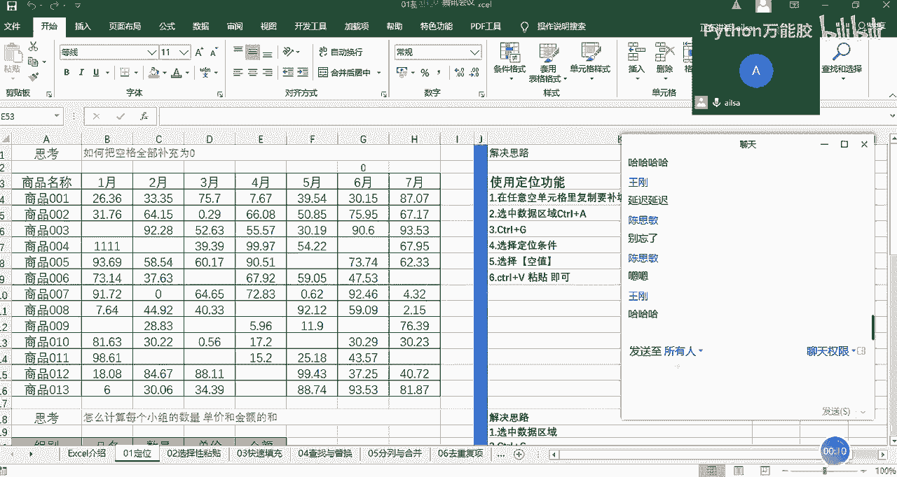

好，方便我们日后在进行数据处理的过程当中更加的高效，也更加的让我们的数据变得更加规范，好吧。

OK进入今天的主题。首先第一个我们讲的是定位功能。那我们结合一个实例哈，也不仅一个实例哈，很多个实例来给大家展示这个功能到底是怎么来操作的。比如说哎我们现在进入到一个业务场景当中。

领导给你发了这样一张表哎。

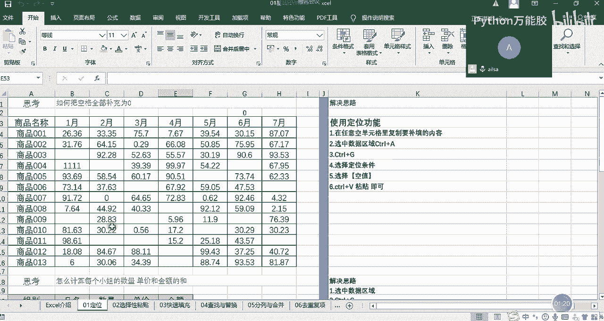

这张一张表看似没有什么问题，但是领导有洁癖啊，数据洁癖，这个很可怕哈。他说你这个空格我看着真不爽，你给我填成零吧。哎，你接到这样的一个任务之后啊，你觉得领导。呃，确实是呃，反正领导让干啥就干啥吧。

实际让他给我们发工资呢，是吧？那我们就一个个填，对吧？我们第一个思就一个个填，这也没几个嘛，对吧？啊，一会就填完了。但是呢如果他给你发的数据量特别大。啊，特别特别大。那你说。

你你说你一天往那一做啥事不干啊，光填这个零是不是感觉啊有点啊有点麻烦哈，替换哈啊，思敏说替换哈，我先给大家讲我今天要讲的功能，好吧嗯啊替换也是可以的，我今天要讲的功能，不用替换就可以实现哈。

怎么来实现呢？我们用定位功能看一下怎么来实现。首先第一步我们先复制一个零啊啊，先复制一个零，选择这个零，然后ctrl加C复制一个零，然后选择我们的数据区域。完了之后，我们ctrol加G啊。

我们刚才讲过了，ctrorl加GGPS的G哈，定位功能okK我们选择定位条件。

这里面调就有很多，我们没办法一一介绍。但是我们先说解决这道题，我们该怎么去操作，我们点击的是空值。因为这里面我们想定位到一个个的空值，对吧？我们点击确定哎，然后我们发现哦妈呀，空值全部都被选中了。

对不对？选中了之后，我们该怎么去操作呢？我们刚才是不是ctrol加C了，然后我们直接controrl加V，嗯，大家看一下我所有的零都被填充上了。okK我看一下大家这个听明白了没有？大家这个听明白了没有？

听明白给我扣个一。最好自己啊操作一下哈，跟着我的思路自己操作一下，看能否操作成功哈。我给大家再操作一遍哈，操作一遍的时候，我说一下大家经常犯的一个错误哈，就是说。

啊，我们在这先取消掉哈，哎crl加Z撤销，我们复制ctrl加C了之后，然后选择我们的数据区域controrl加GGPSG选择定位条件，选择空值，点击确定这个时候哈这个时候我的鼠标不要乱点哈。

你鼠标乱点了，你这些全部都完了哈。比如说现在我就是想点一下鼠标OK啊，你这个全部都没了。所以说你还要再重新定位一下，定位条件，选择空值确定，然后cttrol加V啊，这样才行。所以说我们在定位了之后。

鼠标不要乱动哈，不要乱动，你的鼠标直接cttrol加V就行了哈。我这边有详细的步骤去给大家讲解该怎么怎么去操作。然后在我的博客当中哈，在我的知乎账号当中，我这边也有动图，然后去演示该怎么去操作。

相对于啊我可以说哈我这个课件做的还算呃很详细呃很贴心了哈。所以说啊大家手动操作一下，然后不会了，还可以再来看哈。OK我们再回到我们的操作界面。然后这个功能我就讲明白了哈，我们接着再往下来讲。

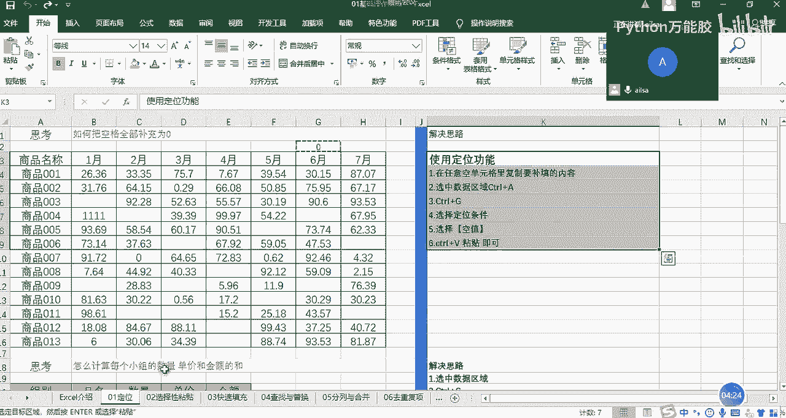

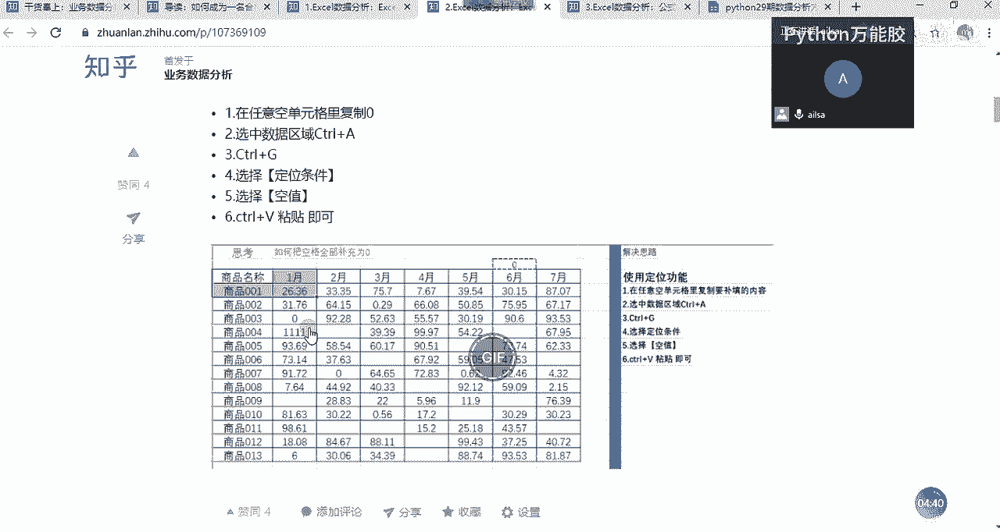

哎，第二个业务场景是什么呢？就是说他给了你一张表格，然后领导说哎呀，这边有一个计算一下每组的一个总计。你比如说数量单价金额，你给我算个加和吧。哎，你看。

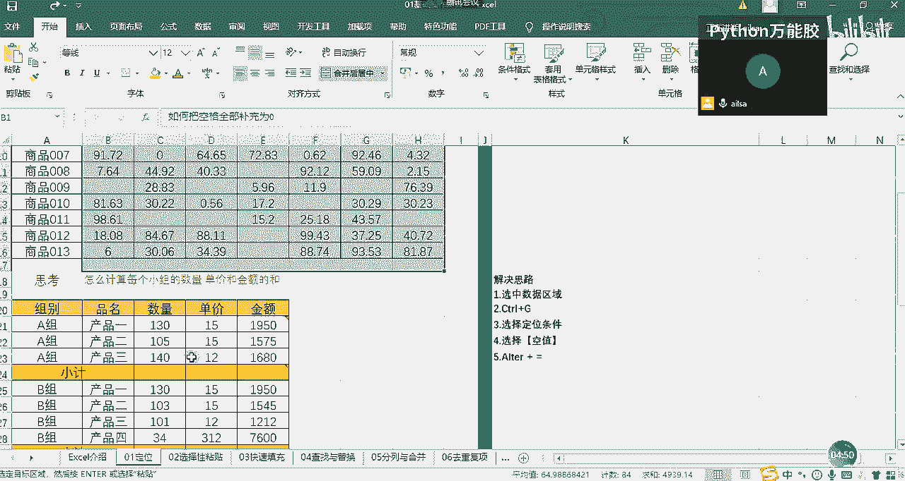

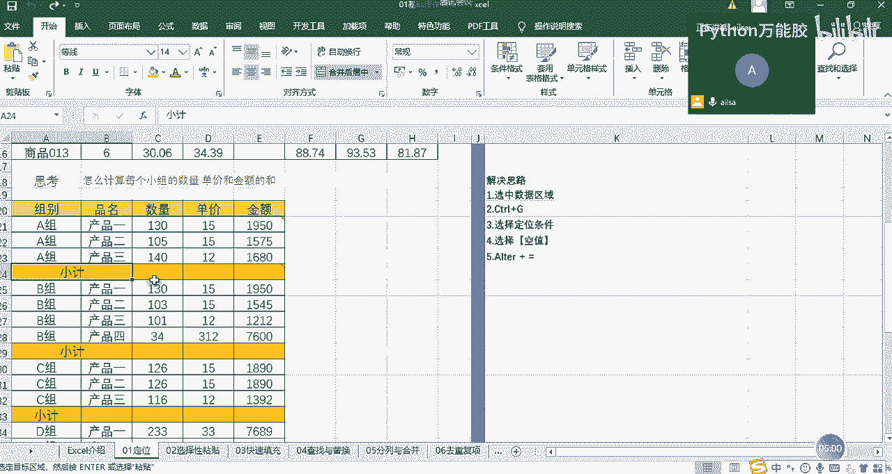

嘉和好像之前啊假设哈假设你之前学过一个学过一个函数啊，叫sam函数加和函数哈，大家都知道哈。然后啊然后哎我基于这个函数进行一个计算不就可以了吗？你看我多厉害，领导给我派了一个活，我还能用到公式，哎呀。

妈呀，我太厉害了，这个时候你就这么去写的哈。sam啊，然后。嗯，然后选我们的单引号，后面我会讲公式，在这里不讲讲哈，我们选择它，然后点击啊哎是不是实现了，这个时候你还会你还学会了拖动，你一拖动，哎呀。

妈呀，全部都计算出来了，是不是？那接下来你是不是还要这样的去操作，还要这样操作。如果你这个类名或者是你这个组别特别特别多的时候。

你这么去做，是不是也没有想象当中那么厉害呢？

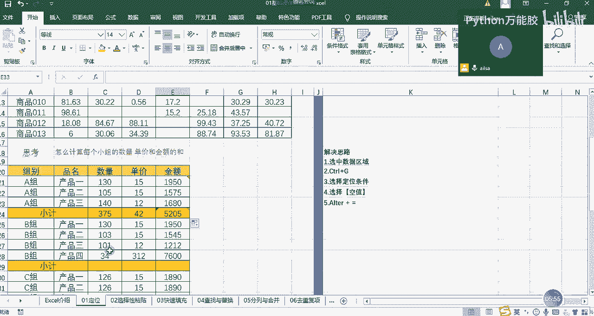

哎，对我们最厉害的是一键实现，对不对？那我们也可以用定位，我们该怎么去实现呢？我们第一步还是。

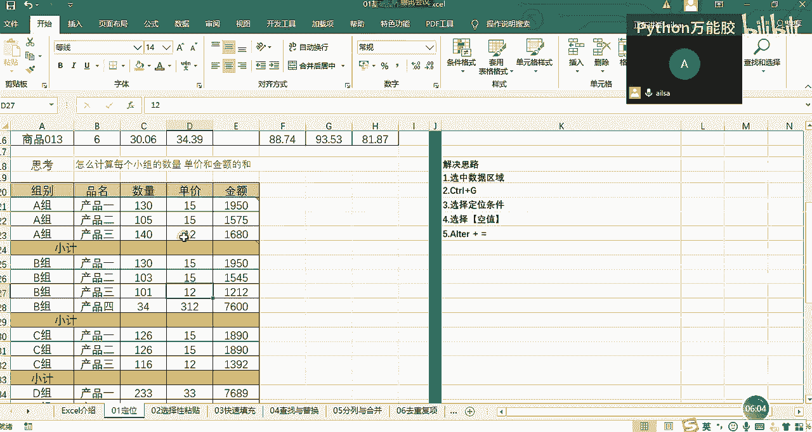

这一步就不需要复制粘贴了哈，因为我们要进行一个计算了，我们还是选择我们的数据区域哈。我为什么不cttrol加A呢？是因为这边有合并单元格，到时候去识别空值的时候可能会受到一定的影响。

所以我就选择这一部分数据区域。然后我再ctrol加T啊，选择我们的定位条件，然后选择还是选择空值。因为我们要定入到空值，空值了之后，哎，我把这些空值选择完了之后，我是不是要对它进行一个加和的计算啊啊。

大家要知道我们excel也是啊我刚才动了一下鼠标哈，sorry。

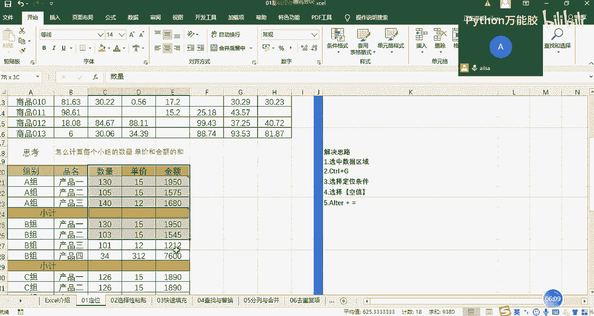

OK我们重啊我们重啊刚才应该可以重新来的，我们再选择一下，然后啊cttrol加DGPS定位条件选择空制。

嗯，这个时候我们该怎么去操作呢？我们这边有一个自动求和，大家看一下啊，大家看到没有？它这里面有提示alt加等号，对不对？我们先选择自动求和。

哎，全部都计算出来了是吧？哎，这就是一个呃操作技巧。那刚才既然说可以alt加等号，那我们也可以输入alt等号啊啊，这样也可以计算出来啊，这样的一个效果，这也是我们定位的一种方式。

它还可以进行一个定位的空值进行一个快速的求和啊，这是第二个业务场景啊。

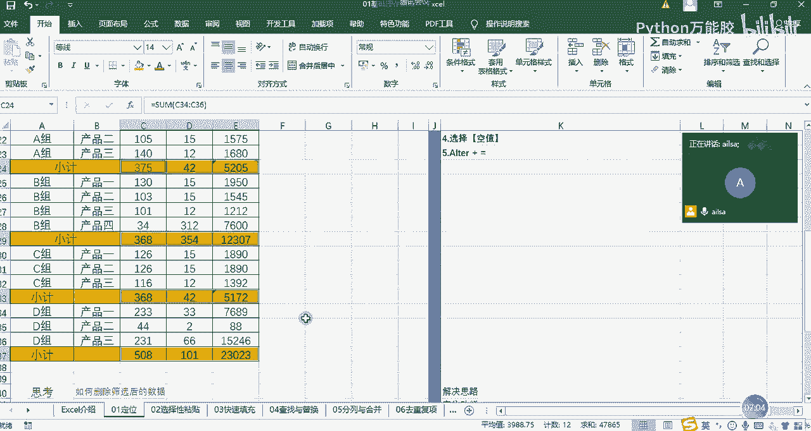

OK大家这个听明白了吗？OK听明白给我扣个一。好的好的，自己私下一定要去自己去做练一练哈，不要听完就觉得简单就不练习了。嗯，OK我们接着往下看第三个业务场景，第三个业务场景啊，不需要做什么的操作是什么？

就是在我在工作当中经常会遇到这样一个问题，就是。啊，就是我们在进行一些数据啊清洗的过程当中，有一些数据可能我们不想要了。比如说呃我们筛选一下这两款车行吧，哎，我也不太认识哈啊，这两款车型。

然后现在我不要了，那我要直接进行删掉就行了。大家可以看一下筛选功能，其实就是啊怎么着呢？就是对于某一行进行一个隐藏。你看这是47行，那48行是不是隐藏了，我也可以拉出来，大家看到没有？

是不是可以拉出来啊，就它就是把它的一个航宽变成零了而言啊，所以就是一个隐藏的功能，然后这走行显示出来了。现在我要进行一个删除的过程当中，对于一些啊老版本或者是exel的老版本而言的话。

它有可能哈我们只能说它有可能存在这样的bug，就是你把48行也删掉了啊啊这样的一种情况。所以说我们对于删除数据的话，还是非常非常非常谨慎的那为了保险起见，我们也可以用定位功能。进行一个呃保险的操作。

怎么来操作呢？就是选择这两你要删除的行，然后controrl加G，然后选择我们的定位条件，然后选择这个时候就不是空制了哈。这个时候选择的是可见单元格。什么意思呢？

就是说呃隐藏的东西你肯定是呃不可见的那你接下来的操作这是针对可见的单元格而言，所我们点击确定再进行删除，它就绝对不会把你呃没有筛选到的内容给删掉，以保证你数据的一个准确性和完整性啊。

这里我就不进行删除了。因为这边涉及到我写的一些东西哈啊，这个大家应该明白吧。OK这就是我们的一个定位的操作。嗯，定位操作啊，这呃以上三个案例都没有问题，给我扣个一。我们接着往下讲选择性粘贴。

好的好的好的，非常好哈非常好，大家都在认真的听课哈。选择性粘贴啊，我们看一下选择性粘贴是什么意思呢？就是说啊我在进行粘贴的时候选择哪些格式或条件，对不对？那我们先结合第一个业务场景哈。第一个业务场景是。

啊，第一个业务场景是这样的哈，哎，发福利了哈，你看这个是员工的一些基本的工资啊，工资表哈，员工姓名入职日期、部门，然后基本薪资浮动薪资应发工资，然后呃然后什么社保啊、公积金啊，税呀，最后实发工资在这儿。

然后呢哎我们不是马上要放端午节了嘛，对不对？那公司说哈你这个放下的发过节费啊，对不对？我要在你所有的工资的基础上，每个人再多发2000块钱哦，太好了，这公司什么公资这么好，对不对？

那我要进行1个2000块钱的一个加禾的时候，那其实很简单，对吧？你直接让他等于然后加两天哎，不就行了吗？对吧？这么简单东西，然后我再双击下来。哎，这不就实现了吗？这可以，这样也没有问题。

但是我们可以不用公式，直接用啥呢？直接用我们的操作就可以来实现给大家演示一下怎么来实现的哈。我们为了保证我们的数据的一个核对，我们先把它。选择，然后复制到这里。然后大家看一下哈，我是怎么来操作的。

首先它既然是选择性粘贴，那我肯定要有复制的，对不对？那我先复制它，然后再选择我这些的数据区，然后我右击，然后选择性粘贴，大家看这里面有很多个选项，对不对？我们不用一个个来看，我们就看点一个加运算哈。

我们看能出现什么样的一个效果，确定。哎，好，我所有的工资都加了2000。你看我通过啊选择性粘贴这一步操作都能够实现数据的计算，这样的话会更加高效一些。这是选择性粘贴的其中的一个很重要的功能啊。

OK我问一下大家啊，这个在工作当中有用到过吗？经常用excel的人啊，王刚，这个你用过没有？王刚同学没是吗？思敏同学。啊OK哈呃，这个其实我不是说它有多么高效哈，这只是其中的一个操作技巧啊。

什么叫技巧呢？就是说呃绕过常规的方式，然后采用比较高效的方法，然后去实现你所想要的效果啊，呃不叫投机取巧哈啊。对，然后所以说你没有用过也没有关系。如果你觉得好用，你就用。

如果你觉得还没有你之前操作操作的那种方式好用呢，那你就采用你之前那种方式就可以了。我给你给大家说exelexcel的操作方式，有很多没有好坏之分啊，也也有可能在某些效率上会存在一些问题。

但是呃但是如果数据量不是特别大的话，都差不多啊。

好嘞，那我再接着往下讲哈，接着往下讲我们第二个啊第二个选择性粘贴的一个呃呃嗯场景啊，就是我们可以看到这里面啊。啊，看一下哈，我们可以看到这里面的有一些很多的一些计算，对不对？

那我们如果说想去除你们的公式的话，比如说我刚才在这里每一个人加了2000块钱啊，这个时候哎我们看一下哈，加了2000块钱，这是我的最终工资，对不对？

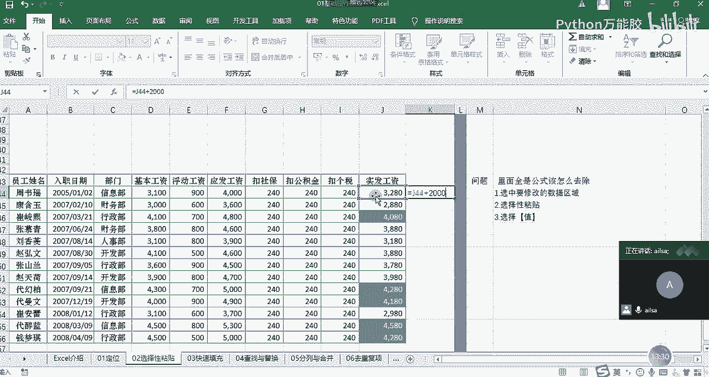

这是我的最终工资啊，然后现在你把这个数据呢要发给老板，但是老板才不关心你这个啊这这么多一堆的东西到底都有啥呢，是不是那怎么办呢？你需要对他进行一个数据的一个整理啊。

比如说老板说我就看一下最终工资哎就可以了。那你需要把前面所有的数据都怎么着啊，都删掉，结果你一删除发现你的最终工资报错了，为什么呢？因为你在这里面进行了单元格的引用，对不对？那你引用这个单元格。

如果你把这个单元格删掉了，它就没有值了。那个数据当然也就错了。所以说我们在进行一个公式的操作的过程当中，我们一般情况下要进行一个公式的去除，然后让它保留最终的值，那该怎么去操作呢？

也就是说就是我们的选择性粘贴ctrorl加C，然后右击选择什么呢？可以直接选择这个值是一样的，我们也可以点选选择性粘贴选择数值，然后点击确定这个时候我们看一下里面啊，在这看哈。

大家有的人不知道说哎你怎么看里面有公式的。我们在第一节课讲的时候，就是说这里面显示的是它实际的值。那这个时候我再进行删除啊，我们看一下啊，是不是就达到我们所想要的效果了，这也是选择性粘贴。

然后比较常用的一个功能啊，我们可以看一下选择性粘贴。啊，首先得复制哈，不然你怎么选择性粘贴，这边有啊就是粘贴原格式粘贴值粘贴公式，然后还有转制啊，还有我们的格式，然后呃粘贴链接。

这个我们就不一一详细的去讲。然后大家可以自己私下的去啊练习一下。你比如说你比如说我现在选择了部门和工资啊，应该选择人啊和工资。现在我他进一个转制，我们可以看一下达到什么样的效果啊，转制。哎，大家看一下。

他是不是就从竖排变成横排了。这就是一个格式的转换啊。

OK嗯，那我们看一下选择性粘贴啊，大家有什么问题没有？

OK没有问题，给我扣个一。好的啊，那我们接着往下来讲，就是快速填充。哎，我们看一下什么叫快速填充呢？就是我们excel，我们都知道进行一个数据的录入处理等等这些操作的，对不对？那我在录入的过程当中。

我该如何去提高他的录入效率呢？你比如说你这边要录入一个序号1呀234哎，一个个录入是不是特别麻烦，那怎么着呢？有的人说哎呀，你往下拖不就完了吗？对不对？填充序列。哎，你看是不是就可以实现我去好高效啊啊。

如果说对于一个啊呃假设哈对对于一个从来都没有接触excel的人而言的话，他觉得这个功能实在是太厉害了啊，其实一点。啊，一的技术含量都没有哈啊，因为啊它就是一个啊它本身就是一个智能的电子表格。

它肯定在某些方面会给你做的比较智能一些哈。所以说这叫自动填充哈，我们没必要一个一个去填。然后它不仅仅可以填充连续的数字，它还可以填充等差数列。你比如说2468024680，我该怎么去填充呢？

它这个时候就不能单独输入一个单元格的内容了，它需要输入两个，然后再进行下拉，大家看一下两个内容之后，哎，我什么时候下拉呢，有的人就会问这个时候大家看我的鼠标哈，看我的鼠标。

然后在鼠标移动到我的右下角的时候出现的是一个从空啊，从空心变成实心了，对不对？实期的双十字啊，十字，然后往下拖动啊，大家看一下24680，也就出现了我们的等差数列。那对于数值是这样，对于日期也是一样。

比如说我输入了一个日期，我在往下拖动的过程当中，它也会发生相应的变化。那有的人就问你这个它能识别出来是哪个月有多少天吗？啊当然。能了，它是根据系统来自动生成的，看到没有？3月1号、2号三样这样就可以了。

ok啊。看一下大家的一个状态。OK啊，那我们再想一下，我们想一下一个问题哈。嗯啊那为什么这个excel能实现自动填充的功能呢？我们知道了数字，我们知道了日期，它能填充等差数列等等这些。

那它什么都能填充填充吗？啊，那我们比如说我们现在举个例子，我们都知道姓氏哈，张往里跳，它能不能填充，我们试试啊，张啊，我们看一下。哎，他能填充张王李昭，哎，哎，这人太厉害了啊，这搜太厉害了啊。

现在哈我给你们啊做一个任务哈，你们自己在自己电脑上试一下，能否填充为张王李昭。也就是输入了张之后往下拖动，看能否出现张王李昭。啊，大家现在进行操作一下。好，如果说可以的话，给我扣个一。好。

我等大家一分钟。我一堆章是吗？不能是吗？嗯。不能失敏可以吗？啊，OK大家想一想，为什么不能呢？为什么我的电脑就比你们的电脑要智能一些呢？啊，其实我们要你看我们在学任何东西的时候啊，都要想到一个原理。

它这个它这个是怎么智能来实现的。其实它没有大家想象的那么高大上，它其实就是就是在后台设置的那我这个张网礼兆，对我这个张网里照是怎么出来的呢？就是它有一个自定义的一个列表。我们有一些是它设置好的。

有一些是如果说你根据你自己的一些需要，你也可以进行一个自定义，那我们看一下它在哪里哈，首先点击文件啊，我操作慢一些哈，点击文件，然后点击我们的选项。

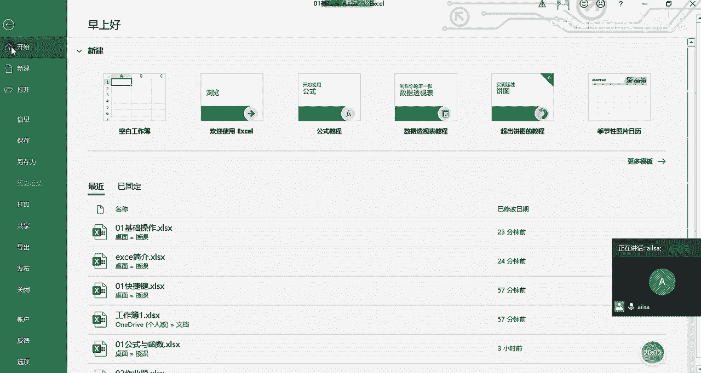

好，在我们的高级里面，然后拉到最下面有一个编辑自定义列表，大家找到没有？

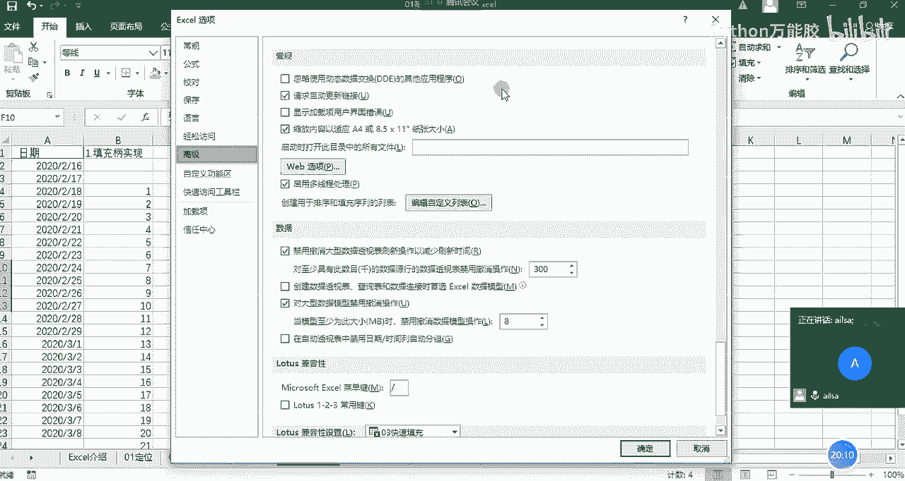

好，我点击面慢一些哈。啊，找到了给我扣个一，我们接着往下走啊，这一步操作要跟着我来。找到了吗？高级下面的一个自定义列表，要拉到最下面才能看到。啊，找到了扣个一。好的，那我们点进来啊，点进来之后。

大家看到没有？oh my god啊，这里面就是他们定义好的一些东西。大家看到我的账文立照没有啊，我还定义了部门一部门二部门3。哎。

这就是我自己自定义好的那如果说你在工作当中经常会嗯用到你一些自定义的东西的时候，你就可以在这里面去设置了，是不是可以提高你的工作效率哈。当然了，如果领导不知道你给他一展示，他还觉得唉。

绝了哈，我这个员工招对了哈，我们先删除它，先看一下怎么来实现的哈。哎，我们先学一下怎么来实现的。首先我的鼠标先定位到一个新序列，先选中它。然后在这个新序列当中，我输入我所想要的效果。那比如说是张哎王。

李。找啊，大家跟着我设置哈。嗯，哎，我们可以看到我们的格式是不是呃每一个分类都是占一行啊，这样一个一列排下来的这样子我们输完了之后点击添加，哎，看到就有了，对不对？然后就有了之后啊。

呃我们这个时候点击确定大家也点击确定啊，在这里也点击确定，然后你们再试一下张王李兆可不可以实现。嗯，如果说可以实现的话，你就再扣个一给我，我再接着往下讲可以了是吧？那就说明其实我们只要在后台设置了什么。

然后它就可以实现相应的操作了，对吧？

那我们再接着往下看哈，我没讲完啊，我们的选项，然后我们的高级啊在我们的拉到最下面，然后编辑自定义列表。然后我们刚才编辑的是这样的一个形式。那我们还可以怎么去编辑呢？

我们还可以比如说我以部门一部门二为列哈。部门一，然后我们可以以英文逗号隔开啊，这样的一个编辑哈，部门一部门2啊，逗号隔开部门三逗号隔开啊，这样的部门。

部门四把逗号隔开就是英文状态下的逗号去隔开，点击添加，它也是一样的。你看我这边啊输入了之后，它就会自动变成你呃呃就是每一行每一行这样子，反正就是就是另外一种方式，你自己怎么输入输服。

你就选择怎样的一个形式就可以了。我们再点击确定，然后我这边也验证一下我刚才输入的部门。不满意啊不满意。再往下拖动，哎，就是有了，对吧？就是我们所想要的一个效果，这就是。

这就是这就是我们整个的一个呃自动填充的啊快速填充的这样的一个效果。可能很多人知道，哎，我前面可以这么去操作，但是却没有人去研究过哎，它到底是怎么来实现的。明白了吧？OK哈，因为这个是大家跟着我去操作的。

相信每个人都会了哈。我们接着往下走，是查找和替换。

嗯，查找和替换呢主要是啊其实这个功能啊怎么说呢？我们不管在哪个软件当中都有查找和替换。那接下来我讲excel当中，就是我们的数据量比较大的时候，我们在进行呃数据的呃呃呃数据的一些呃处理的过程当中呢。

我们需要用到呃查找和替换这样的一个功能。来啊，我们先看查找查找的快捷方式是什么呀？查找的快捷方式。OK现在我考一下啊。OKctrol加F哈，大家说说整个的一个答案的时候，一定要加control哈。

你光一个F键是实现不了的。对不对？cttrol加F嗯，然后我们那我再考察一下哈啊啊替换替换的快捷方式。OK唉，大家知道怎么去记这个替换吗？就是你看control加FF是查找的意思。

那ctrol加对ctrol加H呢就是换换的意思啊就是中英文一定要结合哈啊对。我一直我也不知道他这个他这个英文到底是什么哈，但是觉得从换得角度去理解的话，好像更简单一些。嗯，OK那我们说完了快计方式。

我们接着往下说怎么去操作。首先啊这个的一个conttrol加F，我们先看第一个例子，怎么查找姓李的员工啊，首先呢我们整个的一个呃查找默认是模糊查找什么意思呢？只要代理的单元格，它都会被找到。

比如说现在我输入了一个理查找全部。大家看到没有？

我们的纸里面只要带理的啊，只要在里的都会被找到啊，都会被找到。这是一个查找很简单的一个东西。那呃你比如说你要查找叫什么李师的，哎，我们再精粹一些李师。诗歌。OK理知的，然后我们看查找全部，哎。

是不是他的理知和理啊，也就是它就是默认的是模糊查找。如果说你想精确查找，当然也可以啊，对吧？啊，那我们可以选择选项，哎，这里面有区分单小写，单元格匹配啊，区分全角半角，这个不知道不怎么用。

我们就选择区分单元呃单元格匹配就可以了。我们再点选查找全部，这个时候知查找的理式的内容，对不对？这个是我们的模糊查找和精确查找。嗯，那这个查找的是值，对吧？那下面有的人就说。

哎，比如说我这里面有一个呃黄色背景，红色字体的一个东西哈。假设哈我这边给大家简单举个例子。那现在我想查找这种特殊格式的啊，这个内容，我该怎么去查找呢？哎，这个我们也可是可以的哈啊。

那就是在这个我们看这种设定格式哈，我们先把选项取消掉。哎，我们再点击选项，这就有格式格式的话，你就选择你想要的格式进行一个查找就可以了。当然了，我们内容要取消掉，然后格式的选择有两种方式。

第一种是直接点选格式，就是你设置它的填充为黄色字体为红色这样一种形式，那还有一种形式就比较简单了。既然你这个格式是从单元格里面去查找的那你就可以从单元格里面选择你要查找的格式，选择它。

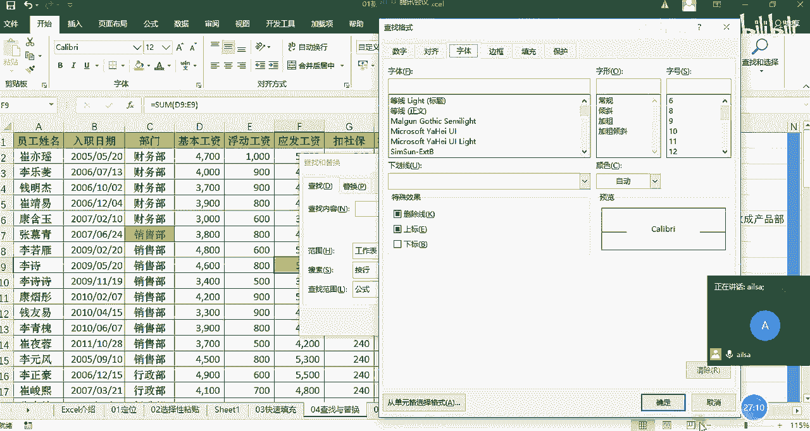

哎，是不是我们可以看一下是不是黄色背景，红色字体，然后我们再点选查找全部就查找到了哈。我们把单元格匹配学消掉之后，查找全部啊，就查到一个查找到一个。黄色啊黄色背景，我再试一下。红色字体一样的啊。

因为它是数值啊，因为它是竖值格式，可能是因为这样的一个原因造成的哈。嗯，如果说我们不不选择这个东西的话，我们再从这个格式去设置的话，看一下。

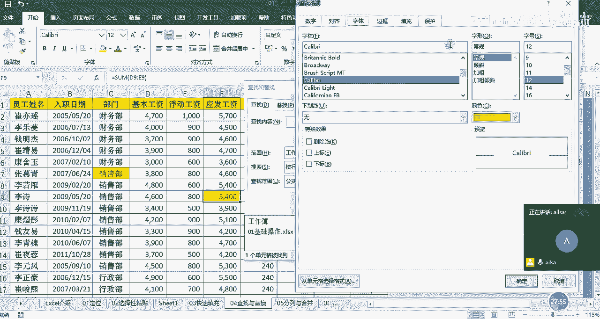

填充数字啊，它这边才能是自定义的这种格式了。因为它这边啊有一个千维分隔符，比如说我们喜常规呢。点确定好，再点击查全国。无法查到内容啊，好吧。我们私下再去事一下吧啊，这种格式的选择我们可能有两种。

它两种是不一样的，因为所以说才会出现这样的一个问题。现在我再进行最后尝试最后一步操作。格式刷一下。啊，看他能否呃查找到哈，应该刷的是他。OK我们再试最后一次cttrol加F。

然后格式我们选择我们的单元格格式，选择这个，然后定型查全部，它是不是就查找出来了？差了几个看一下。OK3个就是我们的树枝开导出来了啊，说明这个销售部跟它不是一个跟它不是一个格式啊这样的一个形式。

OK那我们再接着往下走，这是我们的格式的查找。那既然查找是这样子的那我们看一下替换是什么样子的啊。那在这里我们可以看到我们再一次跳调出来我们这个查找的一个对话框的时候，它还是保留着原来的一种形式。

对不对？那我们需要把它的清除查找格式才可以清除它。也就是说我们在学任何东西的时候，你都要知道你该怎么去设置，你该怎么去清除啊，你该怎么去新增，你该怎么去删除这样的一个功能，肯定都要学全的哈。

OK那我们看一下替换啊，这个就简单了哈，替换啊，我们把这个取消掉啊替换。比如说我们把销售部替换成产品部啊，那我们看一下哈，销售部替换成产品部。我们在替换之前，为了保险体现哈，保险体现。

我们先查找全部看一下。我们看一下我们查找的内容，哎，好像有点问题哈，它这个东西的话，其实我们不想替换这个东西是吧？还有这个也有这两个其实是我们不想替换的。但是它如果查找到的话，它就会全部把这些替换掉。

所以说我们再进行替换的时候，像这种修改的操作，我们也需要谨慎一些。那我们该怎么去操作呢？就是我们要选中哎选中我们要替换的区域，你既然不想替换这些东西，你就不要选中它。如果说你你刚才我也没有选中。

因为它如果不选中的话，它默认是这个整个工作表的啊，所以说我选中我的数据区域，然后再选择cttrol加H替换，然后再选择查要全部，我们可以看一下。我们可以看一下是不是就是我所想要的效果了。

然后我可以contrl加A，然后把我们这部分内容选中，然后直接全部替换OK啊，完成了18所替换。那我的整个的一个销售部就替换成产品部了。那在这这个进行替换的过程当中，如果说你有格式的一个替换也可以实现。

只要设置它的格式就可以了。啊，这个可以自己自己有兴趣，可以练习一下哈。OK呃，那我们刚才说了查找，也说了替换，对不对？那我们呃再讲一个就是我们在python当中学到的一个正则里面的通配符哈。

我们在这里叫通配符哈，在python里面叫正则。那我们在进行查找的时候，有时候我们的模糊，没有那么那么的模糊，也就是有一定的具体性。

你比如说我现在要查找姓李的三个字的啊三个字的一个呃呃三个字的一个员工的时候，那我们就可以首先我们要选选择单元格匹配哈啊，这个时候我们看问号代表的是问号代表的是一个啊，对吧？

我们在python里面也是哈代表一个做一个，那既然是三个字，我们就是李两个问号，两个问号，然后点击查找全部，我们可以看一下哈。哎，姓李的三个字的都查找到了啊，这就是我们的通配符的使用。

那星号其实就是代表零个或多个，也就是说任一个他都可以。代表你比如说我想查找已诗结尾的，我们可以看一下，已知结尾就是开头不管有多少个数字了啊，星号，然后失。哦，诗歌。啊，诗啊这样结尾的。

我们再看查找全部是不是就查查找到了以知为结尾的啊啊这样的一个内容。这是就是在模糊的基础之上，相对精确的一个使用方法叫通配符务。好吧，那我们查找与替换啊，就讲这么多内容。大家都听明白了没有？

听明白给我扣个一。好的嗯。好的，那我们接下来看啊分列与合并哈，分裂与合并。

啊，分类合并。啊，大家能不能稍等我一分钟，我上个厕所，好吧。我把声音关一下。啊，有点尴尬。好的，同志们。啊。好的好的好的，嗯，没事，多一个人最好啊。然后我回来了。刚才啊刚才上了个厕所啊，都回来了吧。

都上厕所了啊。😊，OKO啊，那我们再说分类合并，我们看一下还有多少哈啊，分类合并去重复项日期啊，时间规范哈。我们还差三个内容啊，讲到12点应该是能结束。我们看一下，在我们的日常的工作当中。

有时候别人给到的表呢，其实也没有那么规范。因为别人记录excel的水平，也不会说让我们想象当中的那么高端。那他给我们的一些数据。比如说给了我们这样数据之后。

现在领导说你看这一个单元格里面存储的内容都不是啊，都不是啊自己想要的内容。那我想对它进行一个分裂啊，我们该怎么去把它分裂啊，成甲喜欢excel这样的一个三个单元格的内容呢？哎。

那这个其实就用到的是分裂的功能啊，我们看一下怎么去操作哈，我需要新建一个。

啊新建一个，然后嗯新建一个这个东西之后啊跟大家看一下哈啊，应该是能够看得清楚的。分裂功能在我们的日常生活当中哈，用到的也是很多。它不仅仅可以用来分裂我们的这个内容，它还可以啊有其他的操作。

我们在以后的讲解过程当中，大家就会感受到。首先啊分裂是在我们的数据选项卡下面，我们先选中它啊呃数据选项卡下面我们有一个分裂的功能。然后点击。点击这个之后，大家看到我有两个选择，第一个是分隔符号。

第二个是固定宽度。很明显，我们知道它这个是用英文的逗号隔开的，所以它属于分隔符号的一个呃一个分列，所以说我们点击下一步，然后这里面有分隔符，你到底是什么分格符呢？哎，我们这边是逗号哈。

如果说你这边有不是这边所有的选择，你可以选择其他，那我们再选择逗号之后，我们可以看到有一个数据预览，它就给我们预览出来。你是不是想这么分呢？哎，好像是的，对不对？哎，那我们再点击下一步，点击下一步之后。

大家看到这里这是指的是它的输出格式啊，就是如果说你输出的是文本，你就选择文本，是日期就选择日期。然后我们输出的是不是是常规，那就选择常规。然后还有一个目标区域，也就是说你输出了这个东西之后。

你到底想放到哪个位置。你看如果说我们不想复制A类的内容的话，那我们可以选择什么？我们可以。选择BE啊。放到它后面这个地方，然后我们再点击完成啊。

替换它，哎，这个时候我们就可以实现我们所想要的一个效果了，这就是分裂的功能。最基本的啊分裂。啊，那我们在进行分裂功能的操作了之后哈啊，我这边要听一下啊啊，大家啊大家就嗯自己刚才操作了没有？啊。

要自己手动操作一下，我现在等大家半分钟。嗯，操作完了之后给我扣个一。啊。其他人呢？嗯，大家不要懈怠哈，一定要跟着我的思路去走，手要动起来嗯。好的，两个人完成了，其他人呢？不会吃饭去了吧。

应该现在饭还没做好吧。啊。都做好了是吧？OKOK都差不多了哈。嗯，差不多了，我们再往下去走哈。既然你分裂分完了之后哈现在领导就是一个奇葩哈，他说你分完了之后，你能不能跟我合并在一起啊，傻屌是吧？😊。

OK没关系哈，我们可以的，就是领导的发需求我们都可以实现。只要你足够强大哈。😊。

那怎么办呢？哎，我们excel当中也可以进行一个合并，合并，我们使用的是连字符，这边要用到简单单简单的公式啊，选择它，然后选择我们的连字符。大家看一下连字符是怎么来打出来的，按住shift键加7哈。

7啊，就是连字符相当于把这些连在一起，所进一个合并了，是不是？跟呃python去比这个excel简直就是太好用了，对吧？哎，这个时候我再往下去拖动就可以了，就可以实现了。

就是我们的连接就是分裂与合呃分裂与合并哈，这样么两种形式。那我介绍完了这个操作之后呢，再给大家介绍一个2013版excel的20313版及以上的一个非常快捷的一个方式叫control加E哈，真的是一个。

我从知道了这个ctrorl加E之后啊，我就觉得真的无敌了啊。我跟大家看一下它到底有多无敌。你看我这边输入了甲喜欢E对呃，excel，对不对？那这个时候我选择这一列啊，然后我直接按ctrol加E啊。

大家看一下会出现什么样的效果哎。哦，他是不是已经按照我所想要的方式给我实现了，然后这个里面也是一样，control加一，然后conttrol加一，它只能一列一列来实现哈啊。

所以说我们就会发现你给了它一定的规则之后呢，他就知道你想干嘛啊，对，非常的智能，所以ctrol加E就可以实现。那下面这个也是一样。你比如说甲喜甲喜欢excel，然后我把这个东西复制出来。复制成数值啊。

这里面公式复制成数值。然后我在这里control加一啊，大家看一下，它是不是也实现了。也就是说，只要你的规则哈，只要你的excel里面的规则足够明确，它就能够去识别出你到底想要什么。

也就是说它就是你肚子里面的小蛔虫，它就能猜出来你应该是想要实现这样的效果，然后就可以帮你去实现。OK那现在大家操作一下conttrol加E。啊。没关系没关系啊啊，大家现在操作一下ctrol加E啊。

来实现一下。把实现好的能够实现的给我扣个一。好，可以哈啊，可能大家平常不怎么用excel哈。如果说经常用excel的人而言的话，知道cttrol加E这个功能的时候，其实还是很。很很开心的哈啊。

因为他们有很多的其他的一些数据处理的过程当中，有些奇葩的，他们要使用很复杂的公式，有时候才能够实现。但是你用ctrol加E真的是啊很方便。只要你的规则啊比较明朗一些就可以。哦，只有余定实现了吗？

其他人呢？你们再等半分钟哈。好的，嗯，我们不等了哈。呃自己没有实现的，自己私下的再试一下哈。我们接着往下去讲出重复项。啊重复项这个东西哈在工作当中真真的是啊数据处理数据清洗必嗯必然要操作的一个步骤。

我们看一下怎么去啊去除重复项啊，那我们先带入到一个业务场景当中，比如说对于这一张表而言的话，它的整个的我们可以看这是item ID我们大概知道item是类别类别I然后店铺的名称啊。

shop shop不是店铺嘛，店铺的I啊，然后一个iner time啊，这有点像我们数据库啊存的表，也就是什么意思呢？你比如说这个是一个淘宝的店铺，然后他淘宝店铺里面有很多的商品，它的商品的页面呢。

大家都设计过页面对吧？页面有时候需要进行呃就是产品的呃更新迭代啊，这样的一个更新。然后这下面是的更新时间。那它相当于就是说对于一个店铺的一些商品而言，它有可能一天当中进行了多次的一个更新。

现在我给你的一个需求是什么呢？我不管他在一天当中进行了多少次啊，我只要其中一条数据就可以了。也就是说我只要它在哪一天更新了就可以啊，这样的一个操作啊。那我们需求明白了之后，我们把这个数据啊拷出来啊。

拷出来放到一个单独的excel当中。嗯，首先呢我们想一下，既然它是对于添这个维度的呃进行一个去重的话，那我这边是不是精确到了时间呀，那我要先把时间给去除掉啊，先把它的日期提炼出来，对不对？

那我们提炼日期的话，我们可以观察一下，它这个是不是可以分裂，哎，好像中间有个空格，对不对？那我们就可以通过分裂的方式来进行实现。我们选择我们的数据选项卡，下面的分裂功能。

然后选择这个时候我们就要选择固定宽度了，因为它是一个空格，我们选择固定宽度，点击下一步，哎，我们可以发现选择固定宽度的时候，你可以自己拖拉拽哈。哎，这个是我们选择这个空格的位置，是不是我们所想的。

效果啊，然后我们再点击下一步，我们输出的时候就不是常规了，而是日期。嗯，我们点击完成。

点击确认，然后这个时候就可以了。但是我们会发现好像时间也带上了，这个时候没有关系，它只是显示的问题。因为它原来的这个单元格的是日期时间格式，我们只要给它改一下，改成日期格式就可以了。

我们点击确定OK就可以实现了。那我们把日期提炼出来了之后，我们就要进行一个判断item ID和日期，它俩同时重复的时候，我们就可以删除了，对不对？那我们看item ID。那人本来是文本格式。

结果你一复制出来之后，或者是你进行了一些操作之后，它变成了数字，所以说特别大。那我们怎么把它进行改改，改成文本呢？啊，这个时候我们用到的也是分裂功能。选择它，然后点击分列，然后点击什么呢？什么都不点击。

对，点击下一步，点击下一步，什么都不点击输出的时候选择输出文本，点击完成啊，大家看很简单啊，就输出出来了，这就是分类的一个很大的一个啊使用方法。那接下来我就要进行一个删除重复值的一个操作了。

那既然是A列和C列同时重复时，我才删除，那我们就可以这么来操作，在数据选项卡下面啊，这个删除重复项，它是个很小的点哈，大家一定要看啊，数据选项卡下面有一个这个看到没有啊，这个删除重复项啊，点击它啊。

点击它之后，我们会发现有几列全部都全选了。那代表什么意思呢？就是如果说你所有的列都打了对勾代表你这些列同时重复时才被删除啊，那当然了，我们只要选择。

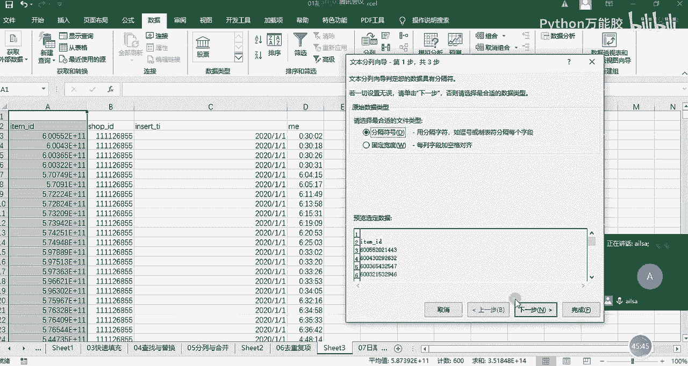

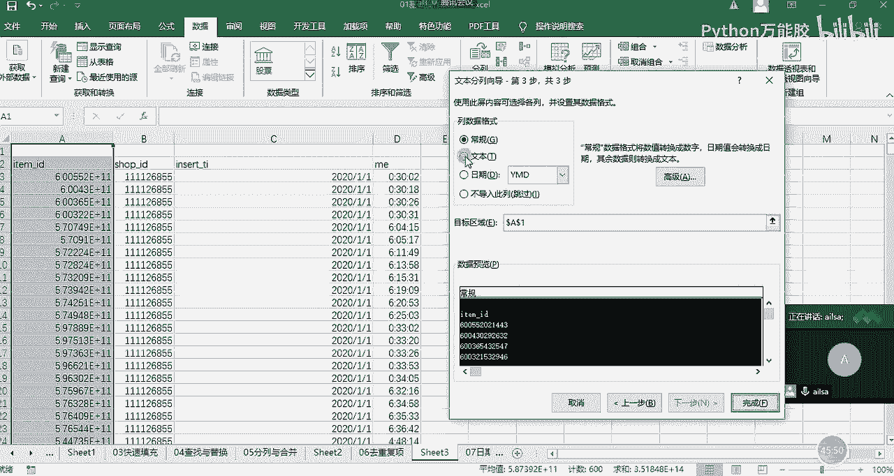

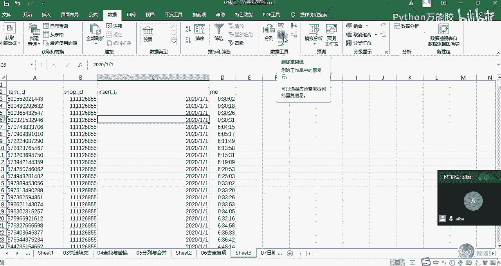

ID和呃insert杠time就可以了。也就是说我们的。item ID和插入的时间，它俩同时重复值，我们就删除就可以了。我们点击确定哎，上面写到发现14个重复值，将其删除，保留了585个为值。

这就是我们把重复值删掉的一个操作。嗯，O大家啊大家自己操作一下啊，按照我刚才的一个步骤，然后操作完了之后，如果没有问题，给我扣个一。

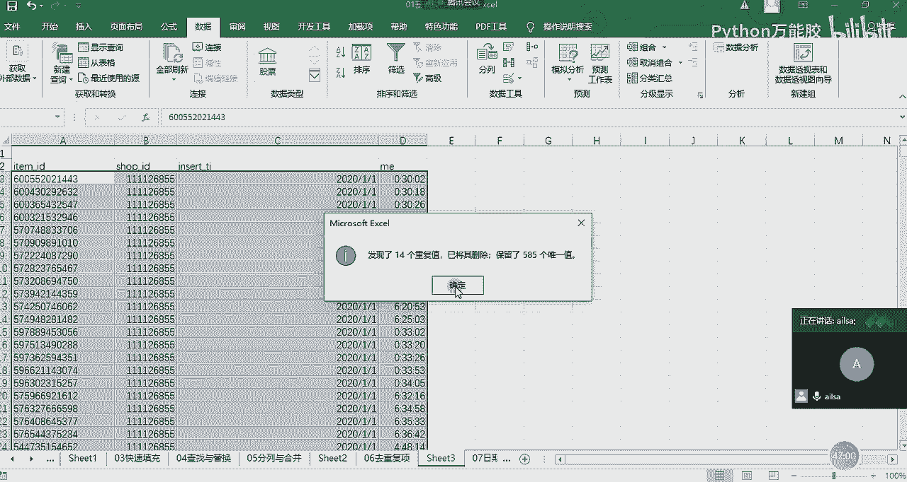

好。还在吗？都没有操作完，是不是？慢慢来，别着急。有需要再讲一遍吗？再讲一遍，我就给你们再重复一下。怎么没出来数字啊？呃，你那边有没有对他进行一个分裂，然后输出文本操作。能截图看看吗？啊。

这边能发截图吗？可以发微信。有其他人完成的吗？没有完成，我就再重新讲一遍。OK又完成的。好的好的好的，那我就不重新讲了，好吧。啊，可以可以可以，这个不难哈。嗯。

然后我们那我们接下来就呃因为这个用到了分裂功能啊，然后再进行一个删除啊，这样的一个操作。我们再进行接下来的最后一个日期啊，日期时间的一个规范。那日期时间的一个规范呢，在我们的数据处理当中啊。

特别是别人给过来的一个数据哈，别人给过来的数据就是比较糙哈。所以说他这个日期时间非常的不规范。你比如说对于这个而言，这个点其实这个点，你说它错吧，好像很多人都这么去写。但是对于我们的系统而言。

我们的日期不是这么来记录的，我们的日期正规的应该是2014-1-2对吧？这样的一个形时自产日期时间格式。但有些时候你给别人就说哎，你不能这么去写，你应该这么去写，那对于毫无数据分析呃。

思维的一个呃呃同事或者是呃人员而言，他觉得都一样，对不对？但是我们在后期进行一个公式和函数的引用的时候，差别其实挺大的。

因为他在这里面其实是。其实是一个文本格式，而不是日期格式。我们该怎么去呃进行一个规范呢？啊，其实这个就用到了之前最开始的时候，思敏提到的一个呃替换的一个操作。

也就是我们呃也讲过的一个ctrol加什么ctrol加H的一个操作。嗯，那我们先选中哈，这个时候我们就要先选中了，因为其他的地方啊有可能有点，所以没必要去替换。

那我们需要把英文状态下的有个点英文状态下的点输入，然后再输入英文状态下的杠。哎，我们输入了之后先点选查找全部。哦，那这个点是中文的吗？稍等。中文没有点。查找全部。OK没有关系，我们把这个点复制出来。

可能他会有空格什么的啊，这个都有可能。应该是有一个空格。可能应该是不影响啊。没有关系哈，我们再试一下，可能家还是。OK那这个时候我们再查找全部。

查找全部哈，我刚才我刚才犯了一个错误哈，单元格匹配了，没有任何一个单元格有点的哈。哎，那我们这边查找到了之后，我们看一下是不是所有的日期都查找到了。查找到了之后，我们就要进行一个cctrol加A的选择。

然后进行一个全部替换。

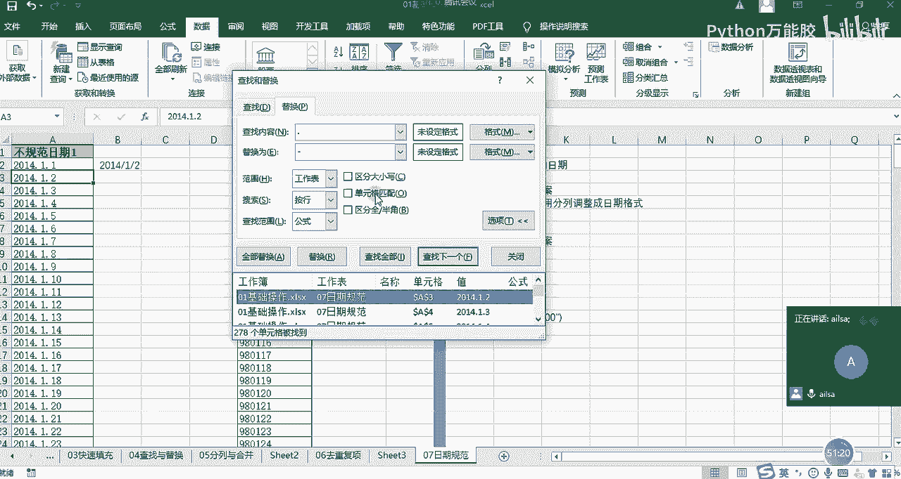

哎，完成了一个替换。我们关闭。这个时候我们看到它也已经替换成我们的日期格式了啊。那如果说啊有可能你进行了一个杠的替换了之后，它这边不是，那你就可以把它输成啊日期格式啊，这样的点击确定，然后就可以实现啊。

我们所有想要的操作了。也就是说把点替换成杠，然后替换成杠，如果原来的还是文本格式的话，你设置成日期也就可以了。如果啊假设哈如果你还没有实现，你就可以采用分列的功能啊。

分裂的功能真的对于格式的一个统一很重要。你输入什么呢？你什么都不前面什么都不要操作，然后你直接按日期格式去输出，它就会统一的给你替换成日期的一种格式啊，就可以了。这是这样的一种形式。

那还有这样的一种就是类似于我们啊我们经常用的计算机的那种思维方式的话，那我们可以通过拼接的方式来。

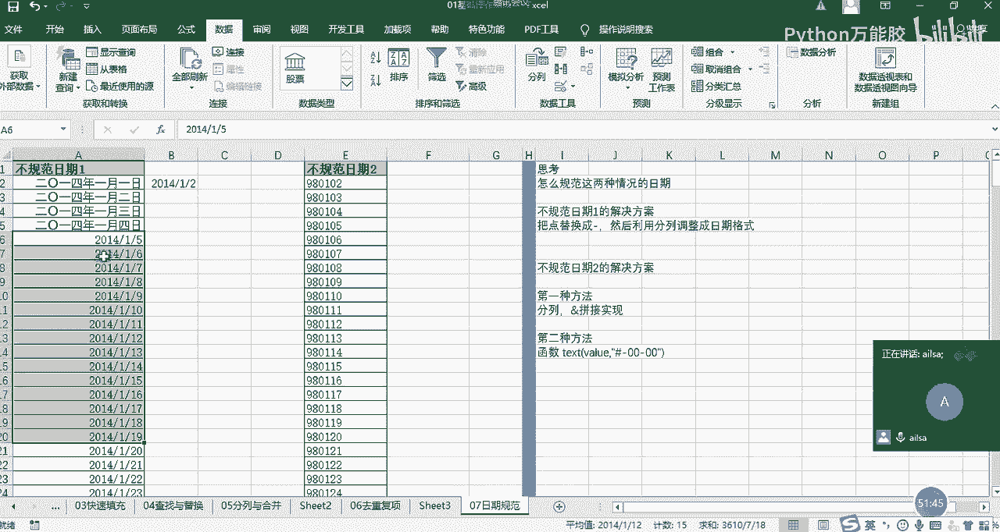

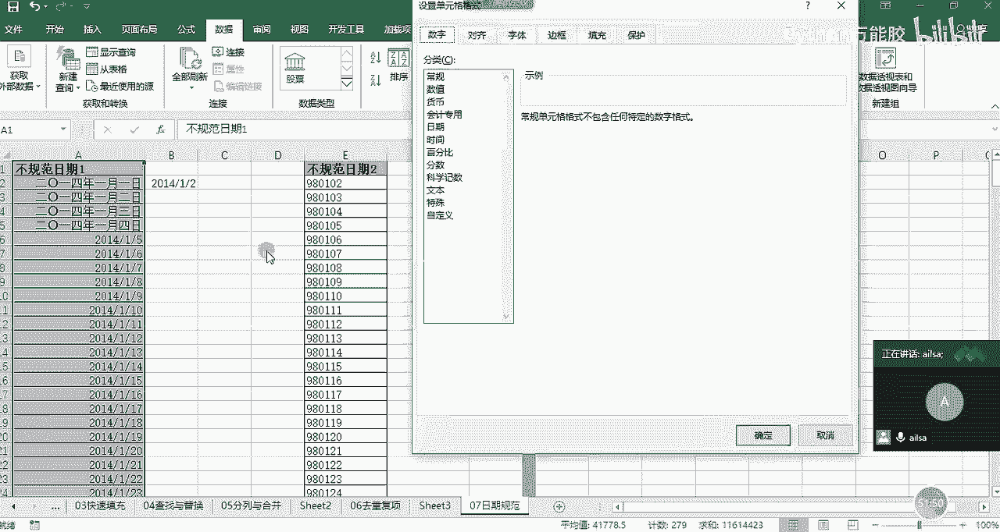

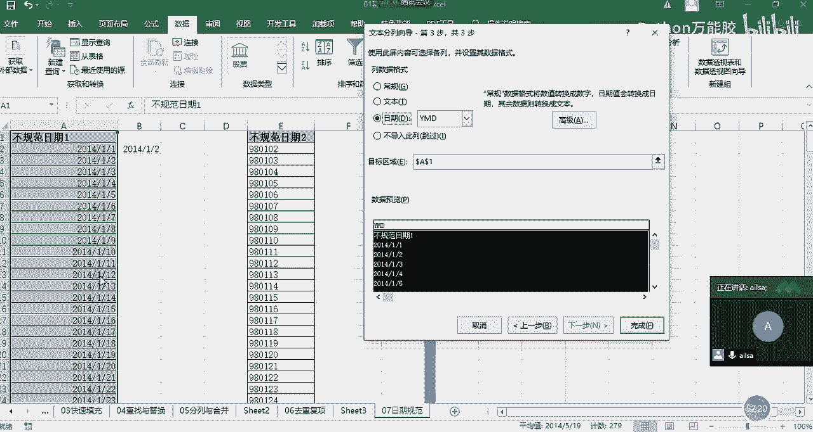

实现也可以通过函数。我们先看这个函数啊，这个函数应该没有学过哈啊我们在后面如果有机会，我们就可以再给大家讲一下。我们先看一下这个函数，这个函数很快。哎，大家看一下。

还输入这个函数没有出现问没有出现所讲的效果。为什么呢？是因为它是文本格式，文本格式是识别不了公式的，所以我们选择常规点击确定，然后再双击进来再ent键啊，它又出来了啊。

这边报错的原因是因为我这个应该选中的是单元格啊，你看一下啊，这个时候我们再需要加上1个20就可以了，对吧？然后进行一个操作，这是我们用公式来实现。那当然今天我们不讲这个内容哈。

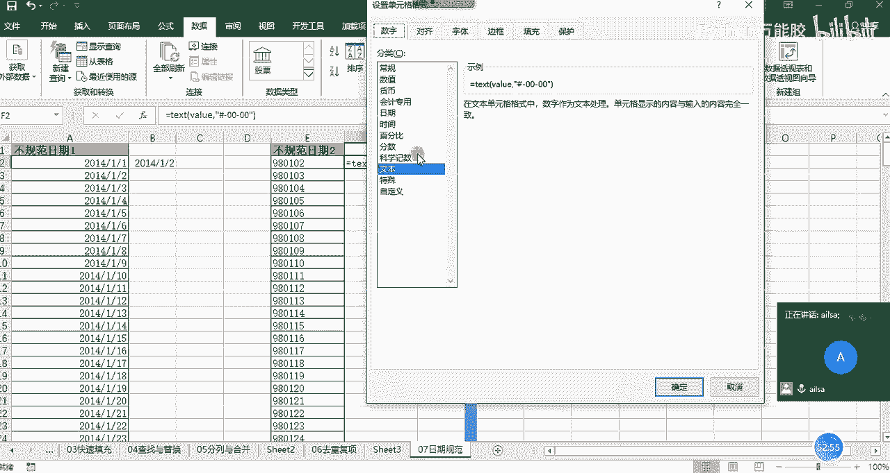

我们不讲这个，我们讲怎么通过拼接的方式来实现啊，有点麻烦。稍等一下，我喝口水哈。拼接方式我们就是用我们的连字符来实现。首先我们会发现它呃它前面都少了一个什么啊，它前面应该都少了19啊1998年啊。

199几年这样的。所以说我们首先拼接的是我们的一9啊这样的一个字符串，然后加上我们的连字符。然后我们需要拼接它的啊拼接它的。啊，前面两个内容对不对？然后再是中间两个内容，再是最后两个内容。

但是因为我们现在没有学函数，所以说我们需要对它进行一个什么进行一个切啊，就是把它切成三等份，对吧？前面俩中间俩最后俩，所以我们现在还用不了公式，我们要对它进行一个切割。哎，我们插入这些。

然后我们选择它，然后选择我们的分裂，看又用到分裂了。这个时候我们就用固定宽度，你别看它没有空格，我们也可以用固定宽度。我们怎么用呢？我们可以通过哎大家看到拉鼠标哈。来拉鼠标按照每两个进行一个分割。

然后点击下一步，然后我们就按常规格式去输出或者文本格式也都可以。我们按文本格式吧啊，输出点击确定啊，大家就可以看到。这个是年这个是月，这个是日哈，这样的一个结果。然后我们就可以使用嗯连接的方式。

然后首先我们先输入一组刚才的内容，然后连字符，哎，我们的年，然后年了之后，后面是个啥，后面直接连月吗？其实不是我们要连一个杠对吧？一组就是年杠多少，对吧？然后再连一个月对吧？然后再连一个杠。再连一个杠。

再连一个。月啊日啊，这样就可以了。我们看1998年1月2号，这样实现了之后，其实还没有完成。因为这里面是有公式的，所以我们要把它替换成啊要换成值。好，我们看一下，这里没有公式的。

但是这里面虽然没有公式了，但是它也不是日期格式，因为我们都知道日期格式是这样显示的，所以你还需要。

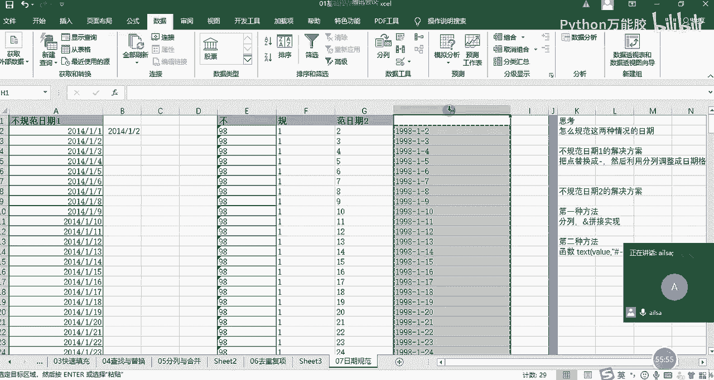

再一步分裂哈，把它分裂成日期格式。日期啊完成啊，这个时候我们就所达到了我们所想要的效果。

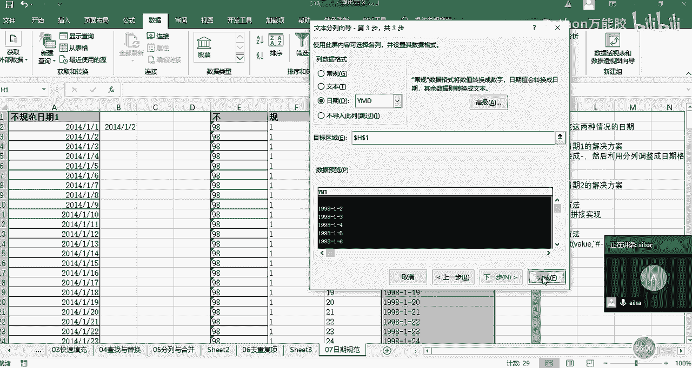

同志们。同志们。我给大家一分钟的时间。一分钟的时间，然后把这个实现。嗯，实现完了之后，然后我们今天啊就讲到这里了。

我先把呃视频啊，然后。