# 零基础系统自学金融学、量化投资、数据挖掘、python，太全了，同济大佬终于把他的全套教程分享出来了，比刷剧还爽！-人工智能、金融分析、量化管理、机器学习 - P3：2-序列变化情况分析计算 - AI前沿技术分享 - BV13Safe4EsV

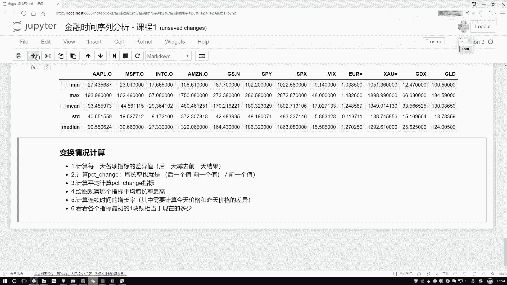

再看下一个，下一个就是让我们做这样一件事啊，我们要去呃变换情况的一些计算啊，什么叫做变换的情况，这不叫变换情况吧。

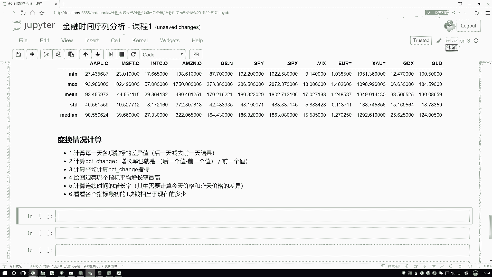

就是叫个变化吧。

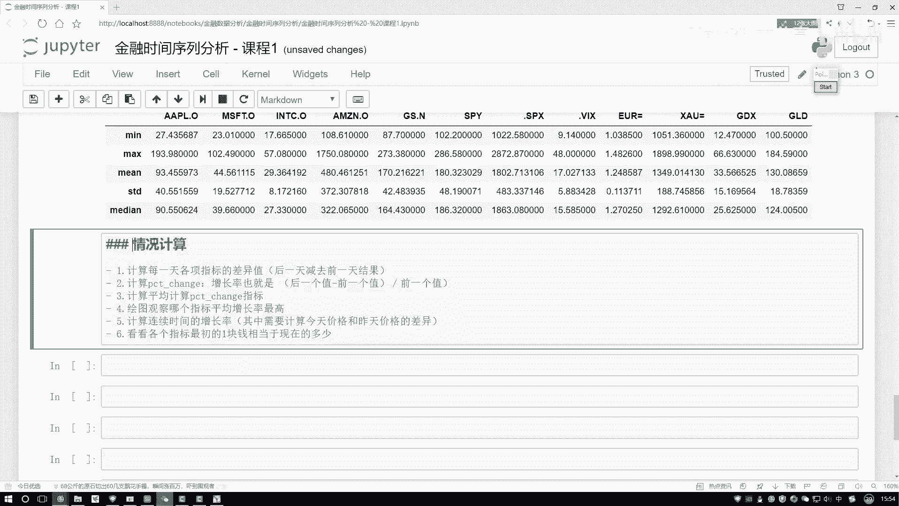

额序列变化情况，他的一个情况计算啊，这个可能描述的有点抽象，咱来看其中每个点要做什么，然后咱把这个东西实现出来啊，首先第一点我说啊要去计算一下呃，每一天指标的一个差异值。

什么叫做每一天的一个指标差异值呢，这是这这个意思啊，你看在我这个数据当中啊，你看这块，比如说这有1月4号和1月5号的数据是吧，我现在啊就是我对于每一天的数据，那其实我都不关心当天啊是30还是38。

你跟我说我没印象，我希望你告诉我这样哎，就是当前啊你告诉我它的一个增幅有多大，比如说涨了一块钱还是跌了一块钱，你能不能告诉我这样一个指标啊，啊我们要做这样一件事，那这件事怎么去做呢。

那你看我们都需要用什么，后一天的数据再减去咱们前一天的数据吧，我们得后一天减去前一天，那这个东西说起来容易，那我们该怎么去写呢。

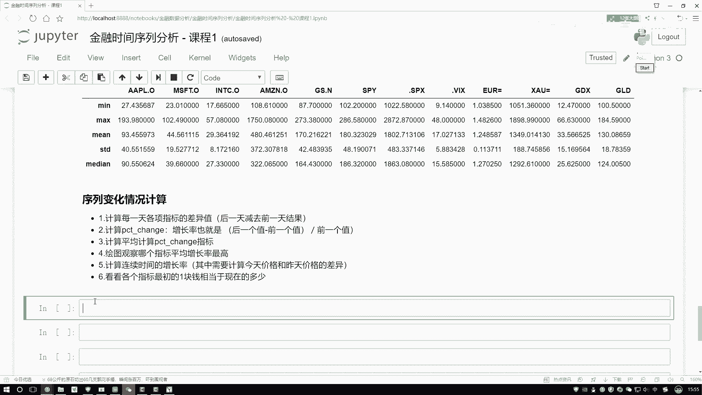

啊其实在这个panda当中啊，非常简单，我们直接干什么，对于这个data我们干什么，我们去算一下它的一个差异是就可以了吧，啊点difference一下，在这里呢我们执行完之后，然后呃打印前五条吧。

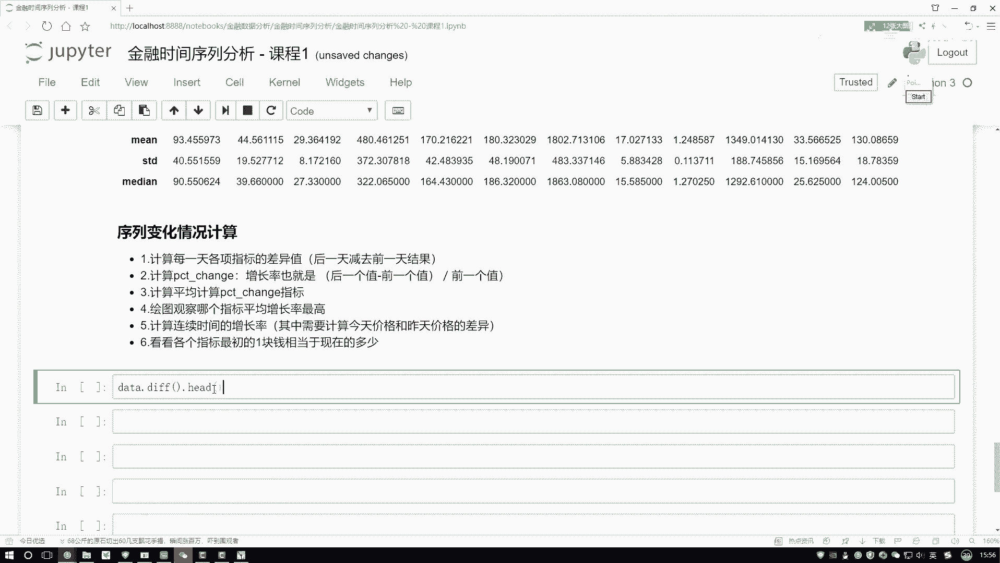

咱来看一看当前的一个结果，看一下吧，这里啊我们这个我们这个索引没变，是不是，但是你观察一下1月5号的时候，它是等于什么，0。052来回到我们的数据当中，1月5号的时候，这里0。052怎么来的。

是不是用我们当前这个数据减去什么，前一天的数据咱得到的呀，那你看其他指标是不是都是用当天的这个指标，减去前一天的了，那为什么1月4号这块哎你多出来一些an值啊，note number值啊，来看一下吧。

因为前面这块怎么样没有值吧，没有值咱就没得减了，所以说他得到的就是一个a an啊，这样我们完成件什么事，用当前的啊，当前这一天减去前一天的结果。

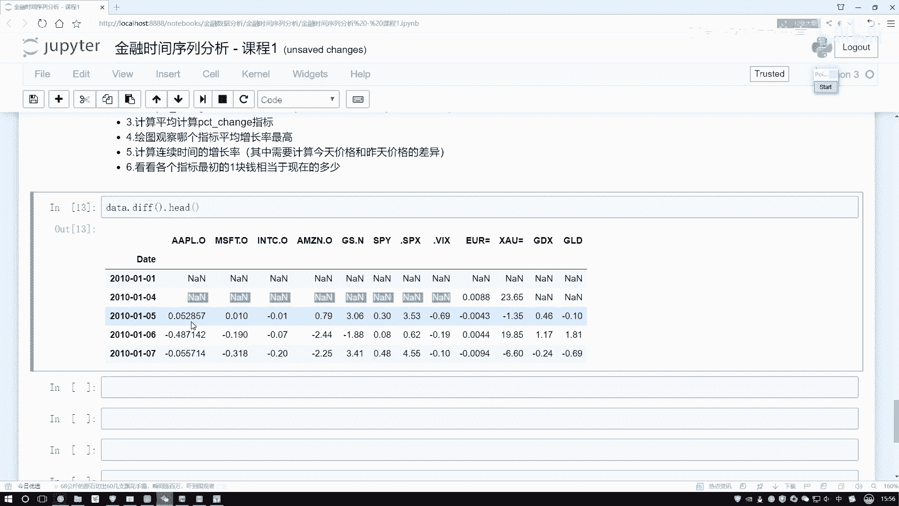

我知道了，咱现在可以叫什么，每一天跟前一天比我们的一个增幅是多少吧，或者说一个差异值是多少，这个指标在我们的时间序列当中啊。

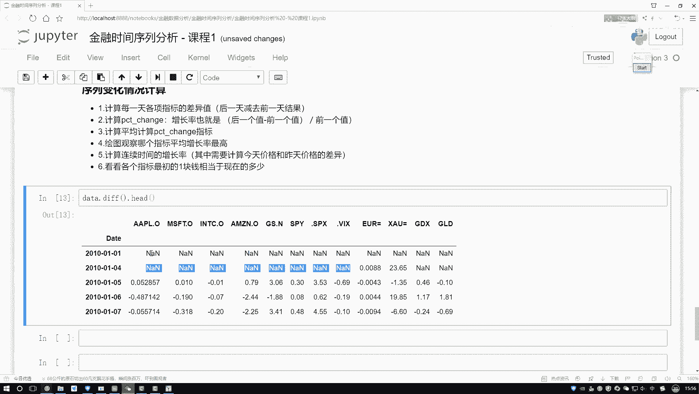

使用的相对来说会比较多的一个指标啊，这里啊咱们是看的是一天的差异，那如果说看两天的差异呢，隔一天一看行不行，隔两天隔一周一看行不行啊，都是可以的，我们可以在这个函数当中啊，怎么样指定参数吧，好了。

为了养成大家良好的查API的习惯，但凡你遇到不知道的函数，或者说遇到不知道这个参数该怎么写怎么办，最直接简单的方法，CTRL加C复制过来，要么百度去查啊，要不然API当中去查，是不是结果一下就出来了。

我也是建议大家这么去学啊，就是但凡哎你遇到了哪块，可能是你不是特别熟悉，或者想看其中的参数，多查多练，你自己做一遍实验才是最好的学习方法，看着视频啊，看的时候都能听懂。

不代表你自己写的时候就一定都能明白哦，自己写自己查的过程要比看视频。

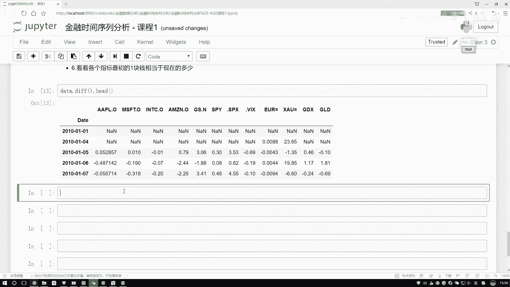

我觉着是更有价值的一个学习过程，好了，咱们再继续说啊。

这里这里我们的差异值看完了，那你看这个差异值当中其实还能去统计指标，比如这一块儿，你看我现在不想要哎他这个每一天的差异了，我想看一下整体，那比如说我看整体，那你就告诉我一些统计特性呗。

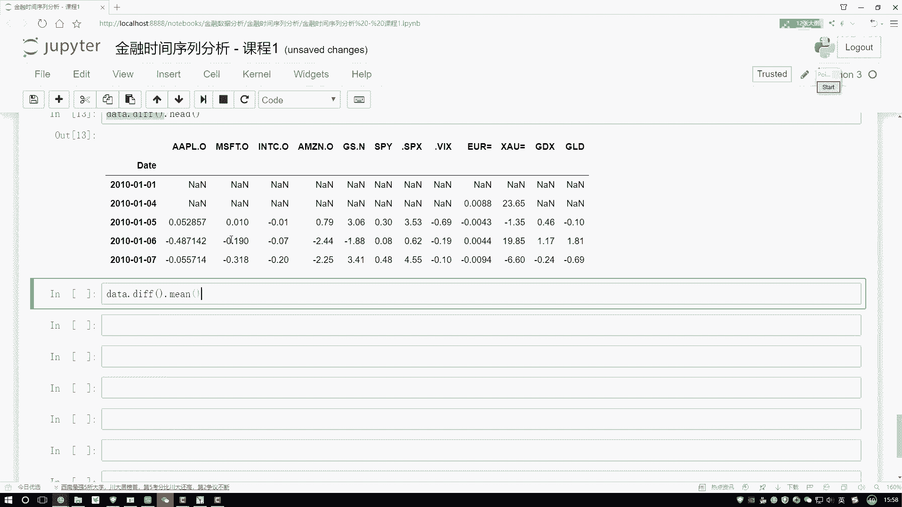

那比如说一个均值均值，我点min传进来之后，是不是各个维度啊，你看它的一个平均情况，咱就全部给他算出来了，这个值还是比较好算的吧，那然后呢接下来哎你说我想换一种统计的方法，那现在可能是这样啊。

就是哎呀一个股票你告诉我它涨了个一块，两块三块的，好像来说没有什么太大的感觉，因为比如说从一块钱涨到两块钱，那也叫那是涨了一块钱是吧，那从1万块钱涨到1万01块钱，也是涨了一块钱。

但是你说这个一块钱它是相同的概念吗，第一个股票翻了一倍，那第二个股票没没咋变化。

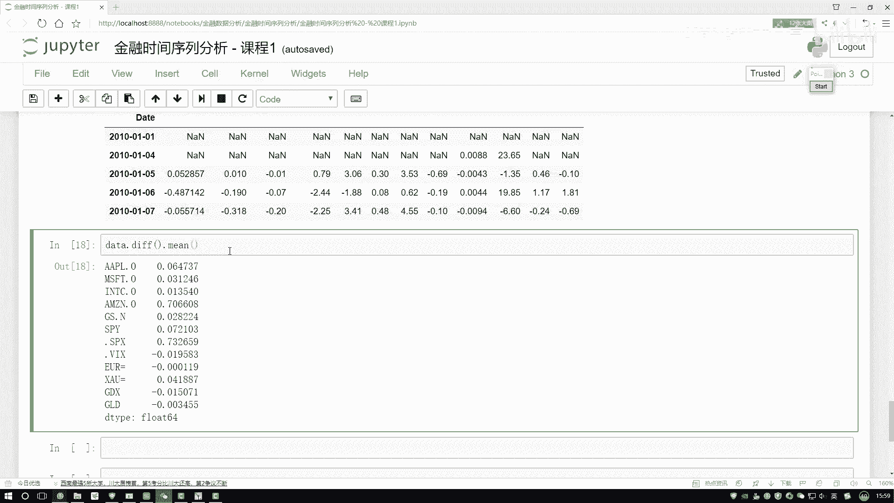

是不是，所以说啊当我们在计算的过程当中啊，很多时候我们看的呀不一定非是一个差异值，而是一个什么，可能是不是一个增长值吧，或者说不是一个变化值，而是一个变化率或者是增长率吧，什么叫变化率呢。

你看一下这块我没列公式，我直接给大家写了，因为比较简单哦，嘶很简单，它用后一个值减去前一个值，再比上前一个值，这是什么，那再有个除法，那不就是一个律吗，所以说此时啊当我们在计算过程当中。

也可以用这个增长率来帮我去做计算吧，好了，这里大家可能说哎呀增长率后约值减前一个值，然后呢比上前一个值，我要不要自己去写呢，自己写其实很简单吧，但是啊有一个线程函数巧了。

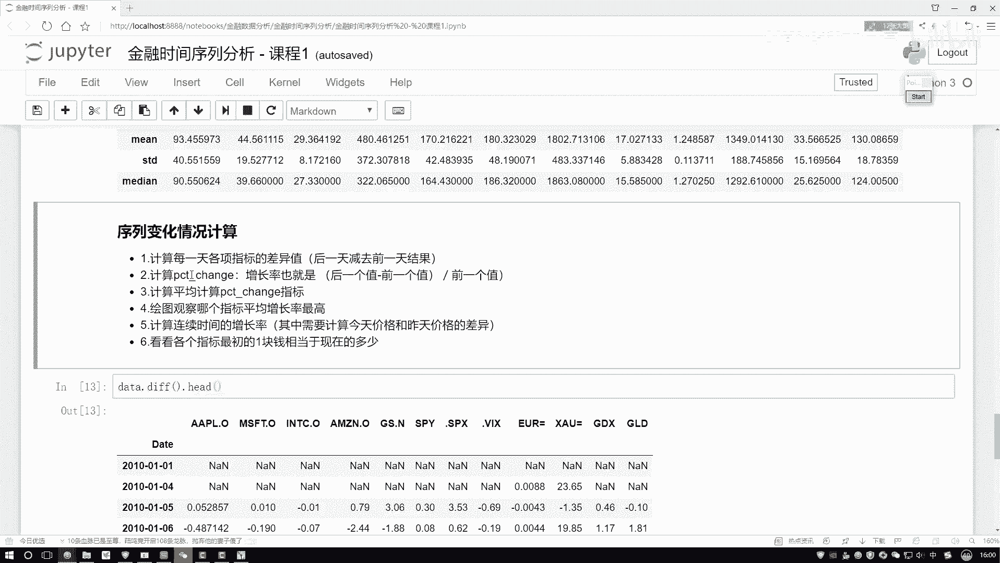

帮我们去做了，直接给他复制过来，咱先来看一看哦，它的一个结果对于我们data frame当中，我算这个增长率。

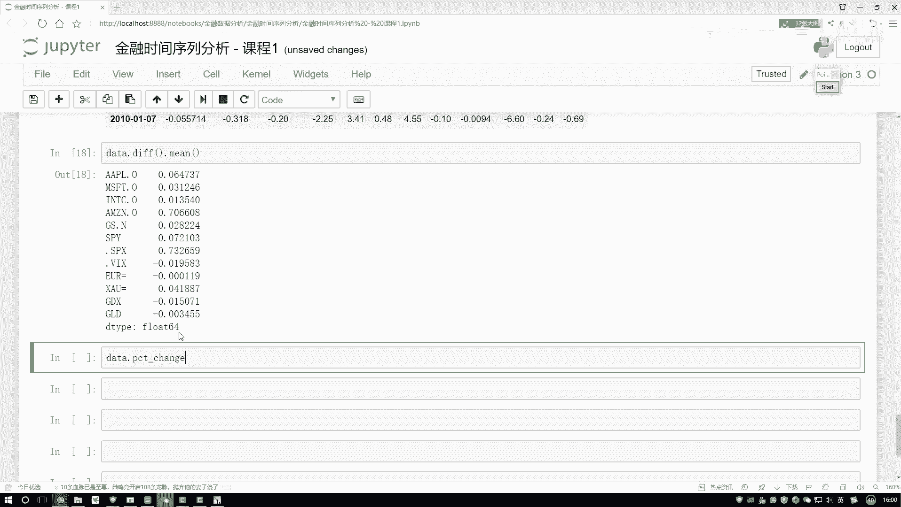

然后算完之后我去点HIIT一下吧，先来看看结果，你看当前我们这个结果怎么样。

是不是之前唉都是一些就是增长了多少。

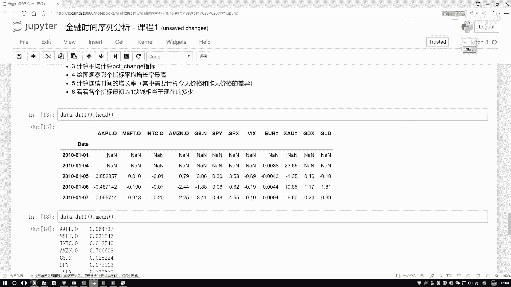

现在呢变成了增长的，比上前一天的变成什么了，一个增长率了吧，这个小点后面太多了，为它少点。

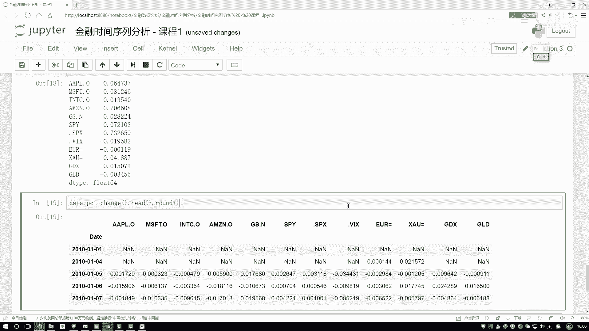

为他留个三位得了啊，就留上比较小的一些值，这就是咱们这个增长率，那大家可能说哎呦，这个增长率你怎么看着这么低呀，那确实如此啊，你说这个一个股价，他一天讲道理，他才能讲涨多少啊，涨那么0。2个百分点。

涨0。1个百分点都不错了吧。

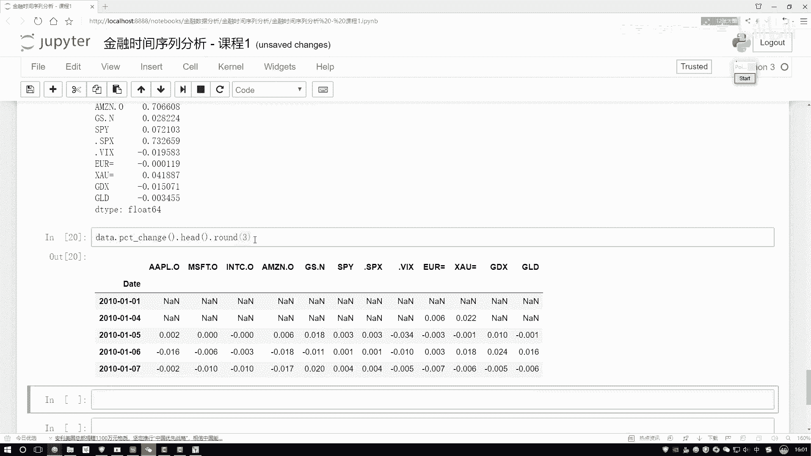

能涨就行，是不是就这块咱给大家说了一下，我们可以算什么啊，不光算一个差异值，还能算我们的一个增长率好啦，增长率当中诶。

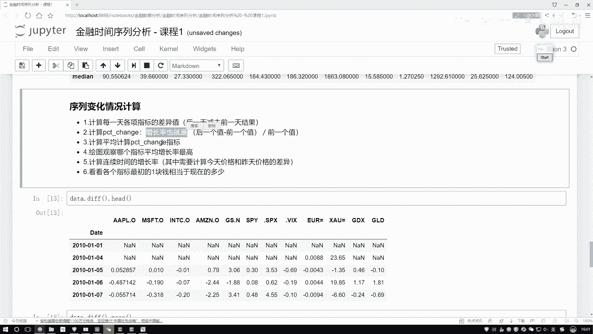

那你说现在啊对于增长率，你给我这个时间序列当中花了这么多天诶，这今天涨了，明天跌了，后天涨了大后天跌了，你能不能给我算个平均呢啊是不是也可以啊，把这个东西复制过来之前咱是一个点hat是吧，好了。

这就先算一个平均，算完平均之后呢，我还可以干什么，算完平均之后，我还可以再去把这个图给它展示出来吧，直接的我说我去点PLOIT一下，在点PO的过程当中啊，我可以去指定一下哎。

当前我们用什么样的格式来去画这个图吧，那你说先用什么格式画这个图呢，平均的值哎它是某一个指标就一个结果吧，一个指标就一个结果，那不能用折线图来表示吧，我们可以用什么条形图，是不是最简单的。

只用调整图看的当中，你去指定你要用什么图来去画，是不是就可以啦，然后呢指定好当前我这个图的一个大小，那比如说一个16得了。

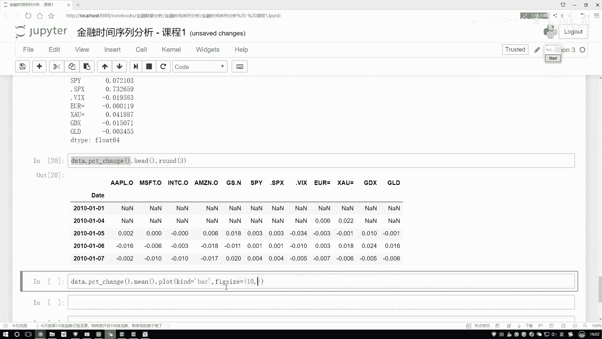

来看一下当前画出来的结果好了，各个指标啊。

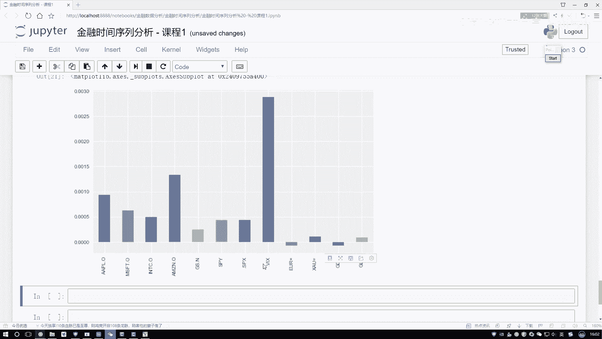

这反正咱也不用管了，就各个支架，然后你看其实他的一个Y轴啊，这个值确实都比较低吧，因为他也不可能往往死了，涨涨这样一个结果的，这样我们是不是各个指标结果就一目了然了。

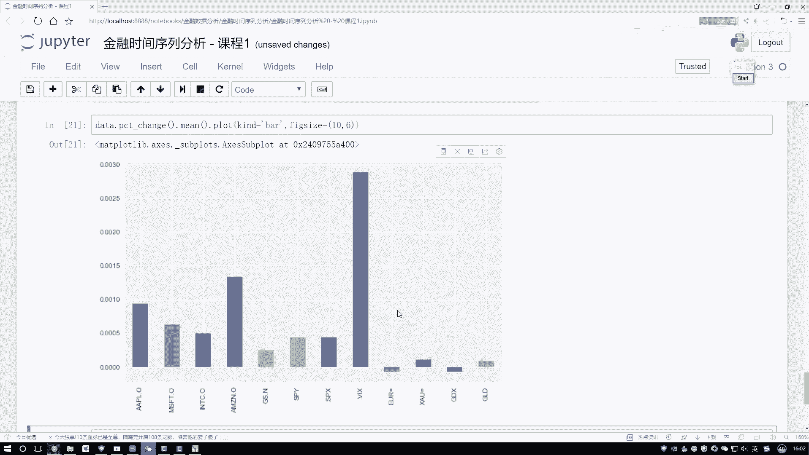

非常清晰啊，咱就可以得到哎。

