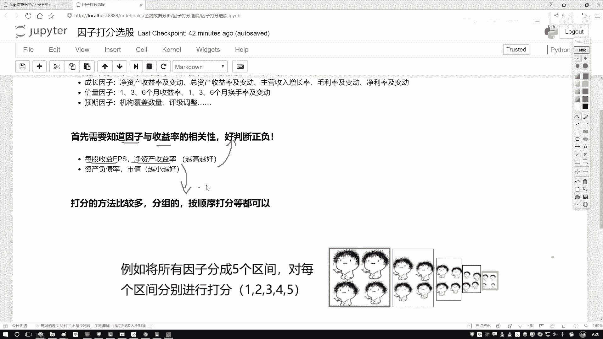
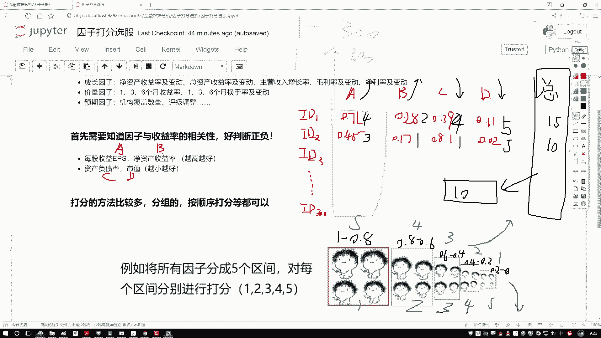
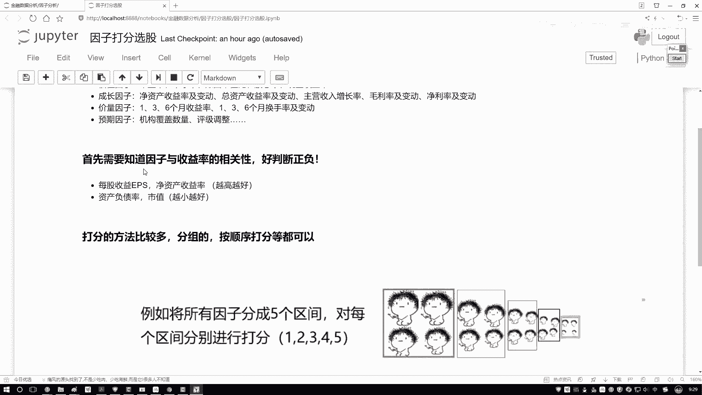
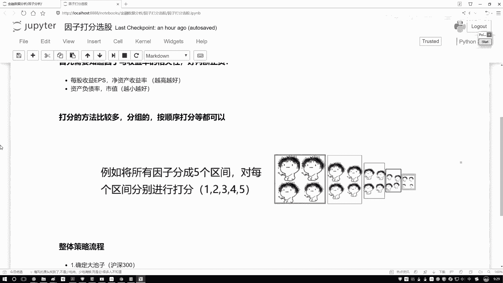
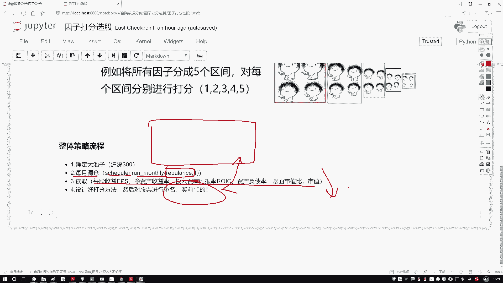
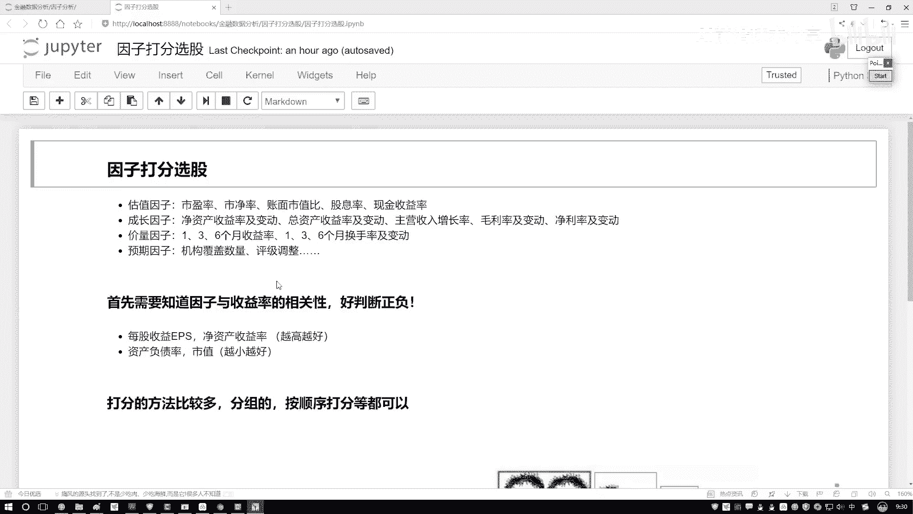

# 零基础系统自学金融学、量化投资、数据挖掘、python，太全了，同济大佬终于把他的全套教程分享出来了，比刷剧还爽！-人工智能、金融分析、量化管理、机器学习 - P46：2-整体任务流程梳理 - AI前沿技术分享 - BV13Safe4EsV

那有了这个已知条件之后啊，接下来我该怎么做啊，那是不是我们就要去打分了。

那好了，给大家来说一下吧，咱们打分该怎么去打啊，这里啊能打分的方法嗯，其实来说还是蛮多的啊，咱们举几个例子来。

先看第一个例子，我说这样我先把这个数据给大家画一下吧，咱就拿这个数据举例子呃，我说这样吧，咱们就有几页数据，有一些样本数据，样本数据当中啊，咱有这个我说有这个IDE1啊，第一个第一个股票行吧。

然后呢我说还有这个id2，第二值，然后我都我多写几个id3，然后假设吧，咱们就沪深300当赚啊，我一直到这个id300啊，咱们三百三百股票，然后呢咱有几个指标呃，我说咱们就按这几个刚才说的来了。

我说这个是个A啊，这是越大越好，B也是越大越好，然后C和D啊，就是这个负债率还有一个市值越小越好，然后呢这里有这个各科成绩，ABC还有这样一个D行了，那我说这样一件事，我先拜把这些指标拿到手了。

并且我也知道哎他们的一个大小是好还是不好，然后呢比如说咱们现在有些值吧，呃是不是说每个股票，我ABCD4个值都能拿出来啊，那我随便写啊，现在随便给大家举个例子哦，我就拿这个红色来写吧。

比如说它的一个值哦，IDE这个它是个0。71，然后这个是个0。28，然后这个是个0。39，我就当做关归归一化的一个结果吧，这是0。11，然后呢再写个id2得了，这是一个0。45，这是0。17，这是0。

81，然后这是一个0。02吧，好了随便买个股票都有指标值，再一个是在咱们那个数据当中，我们直接可以取到的吧，query下把这些数据我就能取到了，然后呢我说这样吧，我说嗯对于每个因子来说。

那我是不是对于每个因子都要打分啊，我说这样我是先把咱们这区间啊分一分，不管这个A它是从小到大的，还是从大到小的，哎我说都分一个区间，那你看下面说这样，这样在这里我列出一个区间呃，比如说这里吧。

我说咱们先按照一个从大到小的吧，比如说这个呃A因子咱们就说了，哎它是一个越大越好的，哎这里写一下，对于A来说，我希望它是越大越好的，B也是越大越好，C是越小越好，D是越小越好啊，这是咱们的一个方向。

然后呢我说这样，我说对于这个明明的来说吧，这里它有一个取值范围，这个取值范围是最大的，最大的一个取值范围就是从啊这个一到0。8，就相当于你可以分成几个区间，把这个数值我就假设啊。

咱们的取值范围是从零一到，就是从0~1之间了，或者说啊你可以把这个东西当成百分位啊，就你一旦你的数值不是从0~1，从这个0~1的，那我们是不是也能做一些百分位啊，啊从这个零到20%的。

从20%到40%的，这里呢我们就拿0~1的数值给大家举例子了，其实不是零一的零和一的数值，你自己写百分位数不是道理是一样的，好了，我说这个取值范围是从一到0。8的，然后这个是从这个0。8到这个0。6的。

然后这个是从这个0。6到0。4的，然后这个是0。4到0。2的，最后呢就是一个0。2到一个零的，好了，这样一个数据给它按大小个先排一下吧，拍完之后我说哎咱们是不是得设计一个分值啊，那好了。

我说咱有两个方向，一个是呃换一个颜色吧，一个是从小到大，一个从大到小是吧，好啦，那我先说这样吧，就是如果说哎我们的指标是越大越好的时候，越大越好的时候，是不是数值哎落到这个一到0。8的。

我说他可能打分会越高啊，哎因为像是你的一个就是你的一个成绩似的，既然越大越好，那我肯定落在大区间当中的，比如说落到一到0。8的，我说给他一个五分行吧，然后呢，0。8到0。6的。

说这四分这三分这两分这一分行吧，那不光那可能在我们这个任务当中啊，咱怎么样，不光有一个从小到大数据，还有什么越小越好的数据吧，在这里好了，那我说第二指标，那如果说这个它是个越小越好的。

当它是越小越好的时候，那这回打分怎么打，那可能越小的时候分越高吧，那可能这就是个五分，那这是个四分，这是三分，这是两分，这是一分吧，好啦这是啊，对于数据来说，我们分了两个分支诶，越大越好的。

还有一个越小越好的，然后呢，既然我们这样方向分完了，那么打分来看一看吧，先看看这个A第一个值我拿这个黑色来画吧，第一个值它等于个0。71落到哪了，哎对于A来说，他是希望越大越好，它落到了这个就是0。

8到0。6这个区间，所以我说它是个四分行吧，然后0。280。28落到哪儿了，哎第二区间它是个两分，0239呢，0239落到也是一个两分吧，0。01是一个一分，那下面的id2是不是也一样啊。

哎咱们来写一下呃，哎对对这这这题写错了，这个C和D不是啊，C和D你看0。39，0。39落到哪儿了，落到这里就到，就是我们是需要越小越好的吧，所以说此时啊他不是一个两分，哎，他应该是一个四分。

然后给改过来，然后0。01呢它不是个一分，它是个五分吧，哎改也疏忽了，这还有越小越好的，然后呢id2咱们再算两个得了id2，这个0。450。45啊，它落到了是一个，这是个三分，然后0。17呢，0。

17他是个一分，0。810。81啊，是什么，是落到了这里，但是它是越小越好的，所以他也是个一分吧，然后呢0。02它是最好的，所以说这是个五分行了，最终啊我们要干什么。

那是不是说把它的总总成绩这一块我写个总分，把他们的一个总分我再汇总到一起就行了，那第一个4+2得六，6+4得十，这是个15分，是不是下面呢四分，然后这个五分，然后这是个十分，那好了。

我们现在是不是把两只股票的一个总分，算出来了，那其他股票300只股票，我们是不是说他的一个总分，我全部都能算出来啊，那全部算出来总分之后，哎我说在这个总分当中我排个序吧，排序完之后。

我说选前十个排名最高的成绩拿出来，当做我下次调仓当中，哎我要关注的一个对象是不是就行了，这个啊就是呃咱们的一个打分法，基本的计算方法啊，这个是你如果说想去分这个区间，或者说啊部分区间也行。

那部分区间怎么办，那300个股票，那第二种方法，比如说300个股票，每个值是不都有了，我把直接把这个300个值，我说按照从大到小就从1~300，从大排序吧，如果越大越好，那肯定就是呃第300个。

我说给他300分，第一个我说给他一分是不是也行啊，L大有个给分呗，其实方法有挺多啊，你给他分区间去做也行啊，直接打个分去做也行啊，反正最终我们只要一个指标，你把总分告诉我汇总出来，我能做排名啊。

这就行了，这个就是我们的一个呃打分法啊，也是在因子策略当中啊。

咱会经常用到的一种方法啊，效果其实来说还是不错的，然后呢我们来看一下整体的流程。

这个流程也就是我们一会儿要去做的策略，在这里先给大家捋一遍，第一步，第一步你得告诉我啊，你要去到哪儿找咱们当前的一个数据，一会儿呢我们是到这个大池当中，哎，就是我们第一步在那个contest当中啊。

咱们先指定好那个沪深310会儿啊，咱们基于这300个股票去选啊，这是我们现在有的一个池子，然后呢，既然我们要调仓了，哎咱们不拿这个每日啊，其实正常情况下每月每个季度是比较常见的啊，每月可能更常见一些。

咱拿每月做一个调仓，所以说我们要设置个定时器，哎在这里写这样一个函数，然后呢我们重点啊，其实就要实现这个函数就是个REBALANCE，在这个REBALANCE当中啊，我们要去干什么。

那首先呢我们是不是说啊，哎我们要把数据给它先读进来，那比如这里我们有几个指标，刚才是给大家说了，我们前三个是越大越好的，后三个是越小越好的，哎这就当做我们的一个先验知识，或者是我们的一个经验值吧。

那读完数据之后，我们是不是要去计算一下，当前诶每个指标打好分了，到我分完之后还没完，我们是不是还要汇总得到一个总分，得完总分之后，哎我说买前十的是不就行了，看起来流程哎相对来说还是比较简单哦。

一会儿呢咱们就拿这种打分法来去试试水诶，看一看用打分法啊，我就随便选了几个指标，看一看能够能不能够使得咱们的收益哎，能够翻多少倍吧啊这个意思行了。

