# P11：Lecture 11 HMM Part 1 - ___main___ - BV1fv411r7z1

好我们今天呢来讲这个所谓云马尔科夫过程，这个银马尔科夫过程呢，我觉得那是我们现在要学习的一个小小的高潮啊，因为这个这个内容呢其实是有一些稍稍有些你们数学的工具呢，稍稍用的会多一些。

所以说很多同学接触起来呢，可能会稍稍开始的时候会感觉嗯这个公式比较多，这个银马尔可夫过程呢又叫做hmm，这个hidden这个h是表示呢hidden的意思好，那in mark的过程。

我们先回忆一下咱们上一次说的，咱们讲了em算法，在咱们这个em算法里面是这么说的，你想想我们是怎么引入的，咱们引入的时候呢是说我们有两个，我们是有两个，咱们说的是有两个袋子。

每个袋子里面呢都装有嗯不同的球，比如说这个是这个袋子，a我们就画一个这样的一个袋子，b呢我们也画一个，所以咱们上次说的是a中呢，它有红颜色的和白颜色的，那么带在b中呢，它也有红颜色的和白颜色的球。

然后我们呢是随机的从a袋子中取出一个球来嗯，但是a袋子和b袋子之间也是随机的，然后我们推导了一些重要的一些参数，在a袋子中，我们从a袋子中拿球的概率呢是w。

从b中拿球的概率就是一减w在a袋子中这种红白的比例呢，比如说是p和一减p b袋子中呢就是q和e减q，咱们最后拿出的这个球来呢，我们就会看到它有红色的，白色的，白色的，红色的。

咱们最后是怎么就是试图去估计这些参数呢，我们最后呢估计这些参数我们会发现是这样的，就是呃我们注意到wp加上e减w，它理论上来讲呢应该我们计算出所有的红色的球占所有球的比例，当然了，你如果这样看的话。

那么当然就是w乘以一减p加上一减w乘以一减q，它就等于n减k除以，所以说只要w p q满足眼前的这两者关系啊，其实这两者关系是一个关系，这是一个方程，因为第一个方程满足，那么一减去这个等式的左边和右边。

我们就会得到第二个方程，我们就会有第二个方程，所以本质上这是一个方程，所以我们也说这是一个方程，三个未知数，你只要有其中的确定两个未知数，第三个未知数你就确定了，比如说你有了p跟q那么w也就有了。

有意思的是，我们就虽然咱们上次是呃，我们会发现啊，这个是一个参数多而方程少这个等问题，但其实呢我们这只是我们的一个引子，我们刚把它放到高斯分布上的时候，我们就会发现啊，就没有这个问题了。

所以说眼前的这个问题呢有显示结，当我们放到混合高斯分布上呢，它就没有显示结了，但是眼前的这个问题有意思在哪呢，它可以提供给我们一些inside，就是给我们一些带来一些直觉。

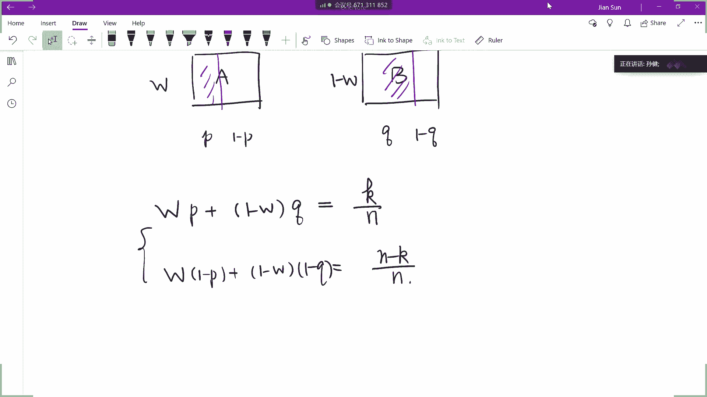

因为根据眼前的这个公式啊，我们就会看到当我们拿到一系列的球的时候，比如说红白白，红红红白红等等等等，我们注意到最后我们我们最后关心的是什么呢，是这个k除以n，也就是说频率。

也就是说红色比如出现的这个频率，或者是白色出现的频率，至于它们的顺序，其实我们并不关心，所以说理论上来讲，我们拿到了十个样本，其中的这十个样本呢，只要是我们上次举的那个例子是七次，是红的，三次是白的。

我们这估计呢这个k就是七啊，我看看下面这个样本数12345，比如说我们在，那这就是一个七次一样，这是一个总共是十个样本，那么七次是红的，三字是白的，如果说这十个样本是这样去给出来的。

如果眼前的这十个样本是抽到的球，就是我们抽到的只是这样分布的，七个是红的连在一起，三个是白的连在一起，那这个时候从我们估计w p q来讲，参数将会一模一样，因为我们看到其中关键的是频率。

它们的次序在这里呢是毫不相关的，但是显然呢我们上面的这一组，第一组和下面这一组，那咱们直觉上就会觉得这不对，也就是说上面这一组如果勉强我们还能解释成为啊，就是从两个袋子里面分别去取球。

就是呃以每次都是独立的选取袋子，然后呢又从袋子中独立的去取球，我们认为还是可以的，那红球比白球多嘛，那那总是因为这个w p加上e减wq，那是比较大这个数值，因为这个数值可能是接近70%。

那这样红球它就会多，那么下面这个虽然也是红球多，但是我们看到它不像是随机取出来的，从这个意义上来讲，下面就是说明em算法其实无法很好的对于下面的这一组样本的结果，来给出一个很好的解释。

这就说明我们上一次那个简单的这个em算法不不是还不是足够的powerful，那你想对于球尚且如此，如果我们转换成这种高斯分布呢，它也会根据我们得到的这个样本的次序很可能是相关的。

而原始的那个混合高斯分布很可能就不是一个更好的一个模型了，这就是驱使我们去寻找另外一个模型的动力，因为我们如果根本没有这个动力，我们何必去design设计一个全新的，因为马尔科夫过程的这种模型呢。

好我们来看一看隐马尔科夫过程，那我们首先得说马尔科夫过程，这个马尔科夫过程，马尔可夫过程是什么东西，马尔可夫过程呢其实是他说的，我们从这个袋子上讲啊，我们才是这样的一个。

比如说我们现在眼前呢有还是两个袋子a或者是b，我们还是从代子取球这件事儿，咱们原来说袋子中取球，是每一次我都是等概率的去随机的选取带子a或者带着b，那么现在呢我们不再是这样去，我们现在是怎么取呢。

我们下一次所选取的袋子跟我上一次所在的那个袋子是密切相关的，怎么叫这个密切相关的，就是说比如说我们第一次是随机的选了一个袋子，而我们这第一次选了这个袋子，就是袋子a，结果我们选了袋子a之后呢。

下一步就是从上一步是选的袋子a，那么下一步选袋子有两种可能，一种是选从袋子b中去选，还有一种呢还是从它自身去选，但是这两个概率啊，就是说从袋子a上一次是袋子a，下一次是带子b。

那么这个概率呢你比如说啊是10%，然后呢就是90%，如果上一次是在袋子b，就第一次你选的是袋子b，那么下一次呢也是两种可能，一种可能呢它是从袋子a中选，还有一种可能呢是从自身选。

但是呢它这个概率呢就不一样了，那么下一次再到袋子a里面，这个概率呢比如说它就是90%，而在自己中的概率就变成10%，你看啊这样的一种过程就满足刚才我说的，也就是说他不再是每次的独立的从袋子a中。

按照一定的概率从a或者b中去选袋子，那么他选袋子的概率跟你上一次在哪个袋子中取球是密切相关的，那么眼前的这样，我画的这么一个图，它会造成一个什么结果，那就是造成你在a中选取了球之后。

下一次大概率还是在a中，你要万一就是一个小概率跳到了b中，那么你在大在b中又大概率又返回到a中，所以说呃眼前的这个眼前的这个就是情况啊，它就会造成一个什么样的结果，不仅仅是在频率上。

不仅仅是说我们选出的球多半都是a中的球，而且呢它还会在它们之间的次序上会体现出来，凡是刚才我描述的这个过程都叫做马尔科夫过程，马尔科夫过程呃，他的数学表达，我们现在再来说一下。

就是马尔科夫过程的严格的数学的定义，当然我们现在是用了两个袋子，咱们在数学上呢其实呢它是可以针对很多的这种所谓的袋子，或者说是离散的这种概率分布，或者说是连续的概率分布都可以好。

我们先来看看这个马尔科夫过程一般来讲是什么样子，我们现在做之前呢再说一个，再说一个这个例子，比如说啊我们再说一个例子，我们看看这个马尔科科夫过程是如何会影响我们的次序的，我们再讲一个例子。

比如说我们现在仍然是ab两个袋子，a袋子中呢它的这个白球，这个球呢全是白的啊，全全是红的吧，所以a袋子中呢全是红的，这个b袋子中全是白的，换句话说呢，你只要从a袋子中取球都是红的，b袋子中取球都是白的。

如果说从马尔科夫过程角度来讲，如果说你上一次在a袋子中取得球，那么你下一次从b袋子中取球的概率呢是10%，你还在a代的这种取球的概率呢，那就是90%好如果这是这个a袋子中，如果是b袋子中。

你上一次从b带子中取到球了，那么下一次回到a袋子中取到球的概率呢是10%，在b袋子中自己的概率呢反倒是90%，好我们看一看，如果是这样的一个概率分布，我们会就是得到一个什么样的这种去嗯。

很可能会看到一种什么样的拿球的分布，如果说第一次你就是在a代的中取球，那我们知道a代的中的球全是红颜色的，所以说接下来你就是你就会看到就是一个红球，但如果说你在a袋子中。

你接下来还是90%停留在a袋子中，所以说我们就会看到一个tendency，那就是在就出现连续的红球会比较多，结果出现的出现的呢啊一到了一定程度上了，他呢你在这个概率呢，它很可能就跳到b带子中了。

因为我们每一次不都是虽然是出发于a，但是呢下一次的判断呢，他很可能是90呆在自己，那么10%跳出去，它是有可能跳出去的，但是一旦你跳到b带的中，我们知道b站的中肯定会拿到一个白球，因为地在中没有红球。

但是你一旦落到必带的中了，那他就90%自己还是下一次从必带的中拿球，所以我们就会看到哦，白球就会连续地出现若干，所以你看啊在这样的一个情况下，就是眼前我们出现的这个球。

它的这种不仅仅是它的频率在这里面是重要的，还有更重要的就是它们出现的这种一个一个的这种次序，也在这里很显示出来了，就是眼前的这组次序啊，五个红，比如说五个白，它不仅仅是代表着哦，我们可能从em算法来讲。

我们可能是1/2的，从第一个袋子中拿球，1/2，从第二个袋子中拿球，每个袋子又各是50%的概率，因为那样就解释不了他们之间的次序关系，而眼前的这个次序关系。

只能从我们前面这个现在说的这个马尔科夫过程角度来讲，我们才能够解释，所以这就是想说我们马尔科夫过程是对我们原来的emm模型往前啊，推荐的一个很重要的一个补充，数学的表示是这样的，我们来看。

比如说我们现在因为马尔可夫过程嘛，它就是一个随机过程，所以这个随机过程呢我们就要用随机过程来表示，数学表示是这样的，比如说我们有呃x1 x2 ，然后呢这是一组，这是一组随机的过程，所以一组嗯。

一组随机过程，按照随机过程的定义，都是一个随机变量，而且这个随机变量呢它们可以取这些随机变量，我们可以来考虑离散，每个随机变量它的取值，比如说都是从一二若干个状态中取值，n个状态中取值好。

也就是每一个随机变量呢都可以从n个袋子中啊，n个随n个这个离散值取值n个离散值，这n个离散值就相当于n个带子，所以每一次你都是从这n个袋子中来取这个随机变量，但是这个随机变量呢它有这样的一个性质。

什么性质呢，就是你上一次，我们用t来表示对了，我们呢在这里呢为了让我们的表示更好，我们把这个下标呢，我们用t来表示，这是表示时间，就是说他在时间t上，虽然这个时间是离散的，它的取值呢是离散的。

它取值就是121直到n这n个取值好，如果我们在时间t上xt它取决的是第二个袋子，那么在时间t加一就是下面它取值从b这个袋子中取值，这个的条件概率它叫做p i g。

而且呢它马尔科夫过程就是说这个p i g是仅仅依赖于这个你呃，这是仅仅依赖于呢是上一次你在哪里取求第一呢，他跟你的时间没有关系，就是我们在这里假定啊，就是咱们现在研究的这个马尔科夫过程。

我们假定它是时间，其次的就是跟你的时间是没有关系的，第二一点呢，你这一次从b这个袋子中取球，只仅仅依赖于你上一次是在哪个袋子中取球，跟你上上次又没有关系，换句话说我们想说的是。

你这一次在d这个袋子中取求你上一次第一次，比如说是在i一中取得球，第二次是在历史上啊，在d就是i2 袋子上取得球，在t。一次，在i t减一个袋子中取得球，在t次是在dx中取得球。

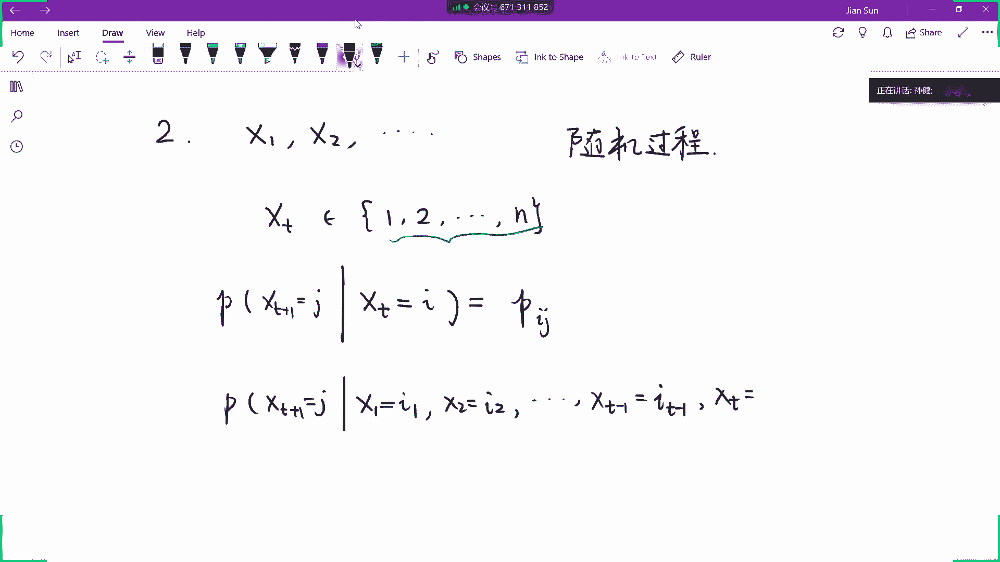

这样的一个完全依赖于整个历史的条件概率，它就是仅仅跟你再上一次取得那个球的概率是相关的，跟你整个以前的这一组历史，从第一个到t减一个是完全无关的，你可以去忽略掉所有那些information。

只要满足眼前的总马尔科夫过程，定义上来讲，满足眼前的这个条件的过程，我们就叫做马尔科夫过程，所以刚才我们取球，从袋子中取球，我们给大家形容的这样的一个过程就是马尔科夫过程。

那么进一步的咱们来看马尔科夫过程啊，我们一般的嗯它的一些术语，眼前这个pi j他其实就把整个的马尔可夫过程都的信息都包含进来了，那么这个p i j呢又叫做转移矩阵，纯粹是没锤。

咱们看看这个转移矩阵应该具备什么样的性质呢，转移矩阵呢你就想象它就是一个方阵，它是一个n乘以n的方阵，这个n乘以n的方阵呢就是你想象一二，这是n行，然后呢这边呢是一二，然后呢这边是n列。

然后这边呢你这个啊代表虽然是啊，这边是代表这个n行，但是这些一二呢你就想想这面呢就代表的是p t，那么这个上面这代表这n列，这些121直到n呢，它就代表p t加一。

所以说在我们去把这个矩阵填写完整的时候，这个地方就是p11 ，这个地方就是p12 ，这个地方就是pen，它就代表第一次，上一次我们从第一个袋子中，那么下一次在第n个袋子中的这个概率。

同样呢这就是p21 ，这就是p22 ，然后这就是p2 n好，这个呢就是p n1 ，这个呢是p n2 ，然后这个就是p n n整个的这个矩阵，你看我们说就是转移矩阵，这个转移矩阵它有什么特点。

这个转移矩阵它不是一个一般的矩阵，因为这个转移矩阵它显然它具有这种概率的这种特点，就是第一点每一个元素都是介于零和一之间的，第二一点呢你看每一行它的是全概率加起来等于一，因为这每一行啊。

咱比如说就看第一行，第一行就是说哦我上一次是从上一次的这个random variable取值是一，在这个条件下，下一次的random variable取值是一二，一直到n，那你把它加起来。

那不就是全概率吗，那没有别的可能性，就是这么多可能性，所以说这个转移矩阵具有的特点就是固定这个i的时候，让j从一到n的求和等于一，每个案例都成立，所以你对第一行成立，对第二行成立。

一直到对第n行全是成立的，这也是转移矩阵，所以应该满足的条件，反过来，任何一个矩阵满足眼前的这个条件，我们就可以称为它就是一个转移矩阵，从这个意义上来讲，它也就定义了这么一个马上克服过程。

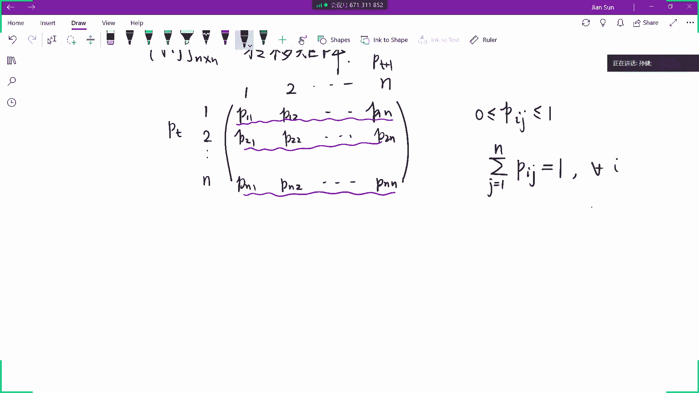

好马尔科夫过程啊，在概率论中啊，嗯大家学过这个概率论的都知道，其实呢是专门的呃一块内容，一部分内容就是里面呢还会研究很多的问题，那么咱们从机器学习角度来讲呢，我们就暂时了解这么多。

然后我们看一看马尔科夫过程跟我们机器学习有些什么样的联系，它在概率中占据一个非常重要的位置，还有很多值得研究的问题，但是在机器学习中呢，我们看看它是如何啊，帮助机器学习来。

只是帮助我们解决一些提供一个新的算法，帮助我们解决一些问题。

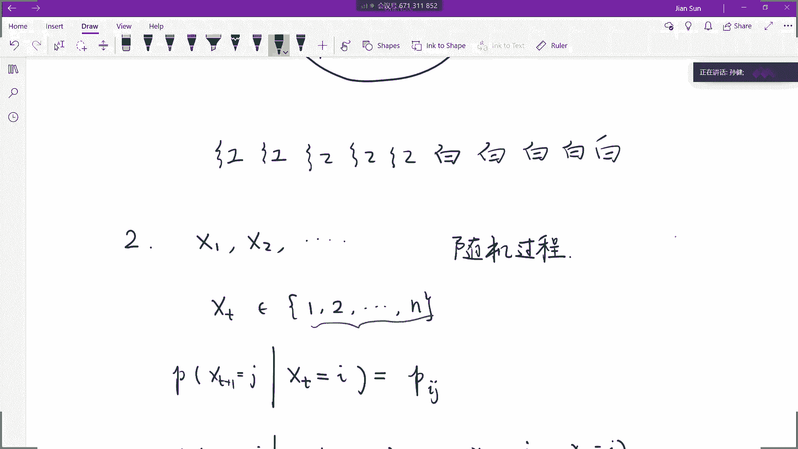

在机器学习中呢，我们就可以回到我们取球的这个问题了，我们就设想现在呢我们有两个袋子啊，最简单的是两个袋子，当然触发也可以是三个袋子，那每个袋子中都有一些红颜色球和白颜色的球。

但是现在我们取球就不像em算法中，每一次取球就是先独立的选取一个袋子，按照一同样的这种概率分布，i i d式的选取一个袋子，而我们现在在袋子上，其实呢我们就是按照马尔科夫过程来选取袋子了。

按照马尔科夫过程选取完袋子之后呢，再在袋子中去取球，这样我们眼前就有一个次序，红白白红等等这样的一个次序好了，我们看到的就是只是这些球的颜色，但背后到底在哪个袋子中，我们现在不知道。

因为每个袋子中都有红球和白球，所以当你看到眼前是一个红球的时候，你仍然无法判断它是从哪个袋子中取来的，这样呢就成为一个这个什么问题呢，就是说中间的这个隐含层。

我们就可以想象这个袋子就是中间的这个隐含的这么一个过程，其实咱们是不知道的，其实在上一次em算法里面，中间的这个隐含层我们也是不知道的，现在呢我们无非是给隐含层，咱们做了这样一个数学模型。

em算法的时候，我们说隐含层它是i d的分布，就是完全一样的，每一次我们都是独立的争取啊，去去抽取这个袋子，这是i d的分布，这个就是identical distributed的。

这个就是这个identical这个independent identical distribution，现在呢我们就是不是i d的选举，而是我们的选取是根据马尔科夫过程的选举。

同样中间的这一层对我们从观察者的角度来讲是完全未知的，我们虽然是给他设置的这么一个数学模型，但中间的这个过程是完全未知的，从这个意义上来讲，银马尔可夫过程。

就是说中间的这些袋子的选举过程是马尔科夫过程的，但是对于我们观察者来讲，它是未知的，因此它就叫做银马尔科夫过程，这就是这个名词的来历，好我们现在呢就来看一看隐马尔可夫过程。

我们是怎么把这个问题来给它定义出来的，源码各服过程呢就是这样说的，我们刚才已经叙述好了，现在呢我们引入为了把这个模型啊叙述出来，我们引入啊这个相应的这些啊公式以及相应的这些字母名称。

咱们中间呢我们刚才叙述了，我们现在用一个比较standard的写法，就是这个过程本身就是那个引过程本身，我们用q0 ，我们用q1 ，我们用q2 等等，一般的呢我们用qt来表示，这个t呢是表示时间。

那么所有的这些q就是代表了中间的这个隐含的状态，我们也叫做引状态，回过头再说，如果说啊从咱们的这个例子角度，你就想象这是一个一个每次从哪个袋子中取出，但是这些引状态眼前的这些q啊。

我们说的形容的是那个random variable，是那个随机变量，这些真正的隐含的这个状态能够取得值，就是这些隐状态能够取得直，我们从n个袋子中我们就取值121直到n。

这就说嘛我们每一次从这n个袋子中来确定，我们真正的就是第t次，这个q t呢就是表示第t次我们从哪一个袋子中来取的，所以这些q0 到qt呢都是random variable。

它真正的取值是取一到n中的一个值，这些就是表示这些状态啊，好从状态呢取定了一个袋子，我们真正观察到的呢是观察到的，实际观察到的这个具体的是红色的球还是白色的球，我们用o来表示。

这就是o0 o1 o2 到o t这些球，那本身能够取出来的，实际的这个球呢，其实是我们观察到的，但是观察到的呢，你比如说这些呢是观察值，同样它是表示观察值对应的那个随机变量，而真正的观察值可以取哪些呢。

我们叫做v1 ，v2 叫vk，我们为了区别上面用n那么下面用k，所以说呢隐含的状态是一到n个状态能够观察到的值是k个值，在咱们说取球的情况下，这个k就等于二，我们就是两个两个观察。

能够观察到的无非是红酒还是白酒好了。

这就是我们用比较标准的银马尔科夫过程里面的字母，那么马尔可夫过程刚才我们说了，我们现在想一想啊，我们来叙述一下马尔科夫过程，是说针对这些隐含的状态，他们之间满足马尔科夫过程，如果咱们用这个符号来写一下。

它的意思，就是说我们在key加一个那个隐含的状态，如果是g的话，如果同样我们知道了嗯，q0 q11 直到qt就是所有前面的状态都给定的情况下，我下一次到底在哪个袋子中取球。

这件事其实跟我再往以前没有任何的关系，就是时刻以前的所有的记忆力都被我抹掉了，他只跟我在上一课，就是t的时候在哪个袋子中有关，在和以前就没有任何关系了，那么这个时候就叫做我们看到叫做页码。

就是叫做mark不过程，而且呢我们在这里呢我们再引入一个记号，比如说q t的时候是等于i，我们也知道这个记号呢我们就叫做a i g，一会儿我们要反复用的就是a i g，我们用来代表就是刚才那个转移矩阵。

我们因为这个里面呢我们用了很多的p，我们为了避免就是混淆，所以我们用a i g a i j来代表转移矩阵，我们转移矩阵有了，那么下面我们还需要刻画什么呢，刻画中一旦我们选取的袋子。

最后我们取出的球是红的还是白的的那个概率，这个概率怎么说呢，是这个意思，所以接下来我们要来论，就是来啊来给出另外一个假设，这个假设就是说我们在t时刻真正看到的那个观察值。

就是这个o t t时刻看到那个观察值好，我们再看看呃，什么条件呢，我们比如说给出了q0 q1 ，一直到就是哪一个呃，什么都给出来了，一直到甚至以后的这些状态也都给出来了，而且这些观察值也都看到了。

你比如说啊这个t减一就是自己不知道这一刻的观察值不知道，那么如果这一刻观察值都知道的话，再问你这个观察值，那不当就是一了嘛，所以这个不知道其他的都知道，不仅是引状态，知道所有其他的观察值。

也都知道这件事情仅仅和当时t时刻的引状态有关系，这个是它这个东西不是一个马尔科夫过程的假设，这个东西呢我们只是想说想说明什么呢，我们在t时刻里面去拿的那个球是红色的和白色的。

仅仅和t时刻你在哪个袋子中去取求是相关的，跟你呃这个跟你其他的时刻的这个袋子，跟你之前和之后的那些袋子，跟你之前取出的球和之后取出的球都没有关系，我们其实这个呢只是想说明这件事情。

所以这个呢上一步我们来看看上一步，这个过程是马尔科夫过程的假设，下一步呢我们仅仅是想形容我们当前的这个观察值，和当前背后的那个隐状态相关，跟其他的都不相关，我们同时呢也用一个进一步的这个这个矩阵来表示。

比如说上一个它就是当前的这个引状态，就是i在第二个音状态下，我们看到这个观察值ot的这个概率呢，我们也给它用一个符号来表示，这个符号呢我们就是用bi o t来表示，因为在这个隐马尔可夫过程中。

很快大家会看到我们有很多的公式上来，所以说我们在这里就首先得把咱们的记号都给记好，不然的话就全乱了好了。

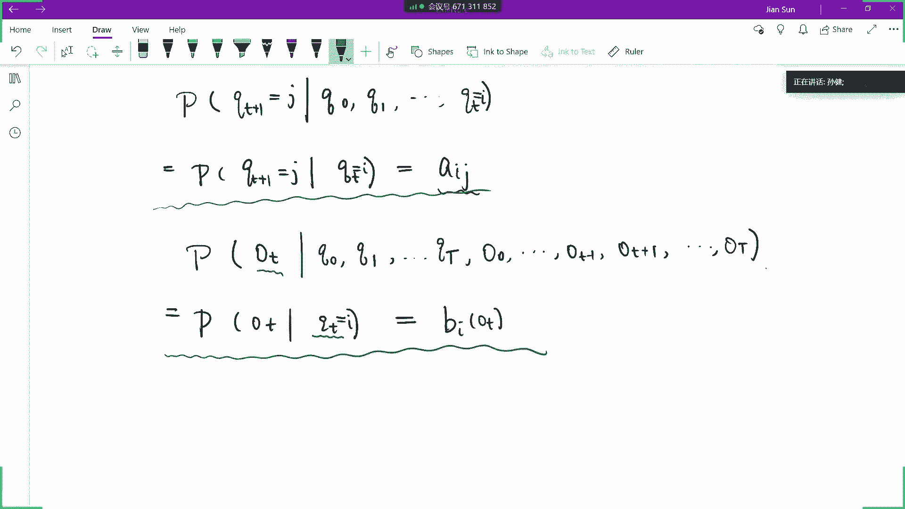

现在我们看一看啊，我们的参数是什么，第一个参数就是这一组ai j，这一组h a i j构成的转移矩阵是n乘以n的，第二组参数是b i o t这一组参数，我们想想i可以取n个值，那么o t可以取k个值。

所以说呢眼前又是一个n乘以k的一个这个观察的矩阵，所以这a i j呢是隐含的马尔科夫过程的转移矩阵，这个b i o t呢它是n乘以k的，从隐含状态到观察值的这样的一组矩阵啊。

好我们现在呢因马尔科夫过程的定义就定义好了。

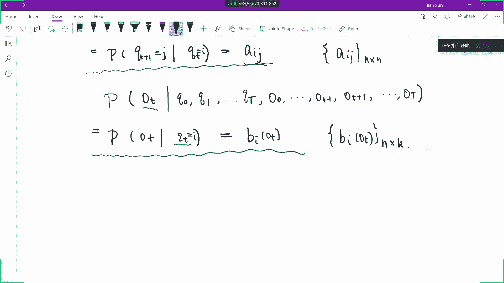

我们看看我们面临的问题是什么问题。

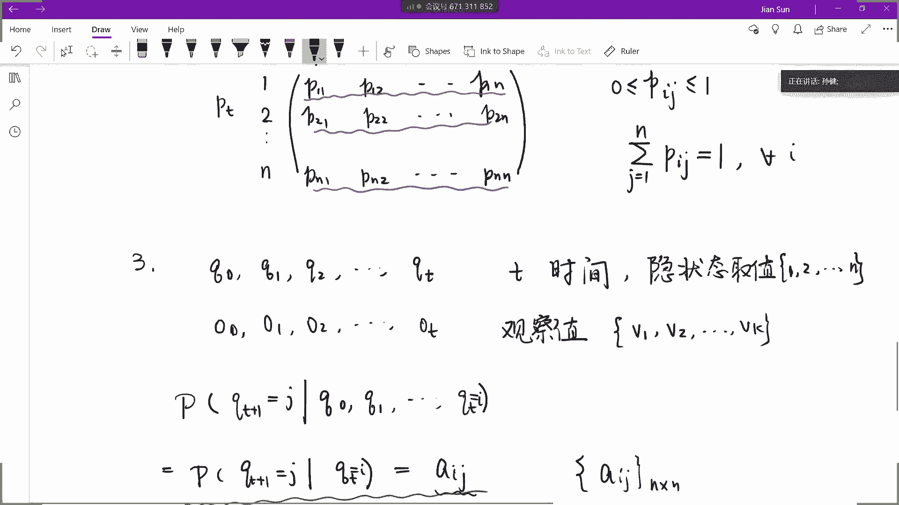

这是它的定义，这是hmm的定义。

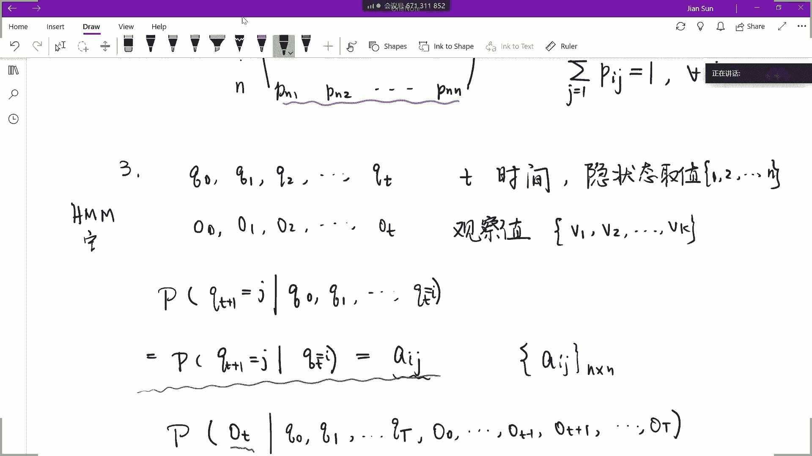

下面呢我们来看看hmm有哪一些问题要解决，模型相当于我们已经给好了对吧，我们要解决的问题就是hmm要想解决的问题，你看它有这么几个问题要解决，我们这个来写一下。

最后呢往往我们面临的问题就是观察到了一系列的值，这个，我们观察到啊，在讲我们这个之前呢，还有一个参数，我们还没说这个参数呢就是第一个袋子中万物皆有始，让你最低一个袋子中。

你是从哪一个袋子中选取的这个概率，因为他就不是说你第一个第一次取的时候，你不是前面不就没有了吗，你既然前面没有了，那么你就无从就是谈不上是从哪儿转移过来的。

所以所以说呢我们有一个最初的一个取代子的diribution，这个最初的取代子的diribution呢就是初始我们也写一下，在这就是初始的那个选取带子的概率，我们叫做派一派二，一直到派n。

所以说我们真正的这个参数呢还得再加上n个，不仅仅是刚才我们的转移矩阵n乘以n的，仅仅是从状态到观察值n乘以k的矩阵，我们还得再加上n个初始的向量，n个初始的向量当然也满足，就是派爱的1i呢从一加到n。

它是一个初始的这么一个概率分布，我们先去决定了第一个袋子中选哪，那么有了第一个袋子，然后呢我们就从第一个袋子开始转移到第二个袋子，第三个袋子等等等等就可以了，好那我们h m m想解决什么样的问题呢。

我们往往要看到的是这样一个情况，就是我们看到的最后是观察值，就是这一组观察值到大t我们停下来，就是给了我们这么多的观察值啊，从第零个一直到大tg，当然有的时候我们也可以写，从第一个大大都无所谓。

你拿到这么多的观察值之后啊，这组观察值我们叫做用一个大o来表示，这纯粹是为了记号上的方便，观察值，用大o来表示，我们看看我们想计算的是这个观察值出现当到底是多大的概率。

就是这组o0 o11 直看到了o t的概率等于多少，这是我们要面临的第一个问题，那我们就先来解决这么一个第一个问题，那我们为了计算眼前看到观察者的这个概率，那我们总要有一些假设啊，假设是什么呢。

当然假设就是standard的假设，就是说给出了所有的参数，就是给出了这个转移矩阵，给出了从状态到观察值的矩阵，给出了这个初始的分布，这些都给出来了啊，好我们给出了这么一个组观察值。

比如说这个红球白球白球红球这么一个particular的这么一组观察值，我们想问这组观察值出现的概率是多少，那这件事咱们在em算法不也计算过吗，咱们在em算法是当你看到一个红球的时候。

我们知道它出现的概率是w p加上一减w乘以q，这就是它出现的概率，如果下一个是白球，那就是这个w乘以一减p加上e减w乘以一减q，我们把它们都乘起来，这就是在em算法下某一组观察值出现的概率。

我们咱们在em算法算过，现在我们面临同样的问题，就是知道了所有的参数以后，知道了所有的参数以后，我们反过来求这组观察值的概率是多少，只有这样我们才可以下一步就步入到极大死人估计中。

所以我们现在呢要计算这件事，给出了这组参数，同时呢这组参数呢有时我们也用一个记号来表示好，我们用它来表示所谓的参数，我们用大o来表示呢，所有的这个观察值，同样呢这个中间的这些引状态。

就是这些q0 q11 直到q t我们用大q来表示呃，所有的这些这个中间过渡的这些隐含的这些状态，所以本质上来讲，我们现在想要估计的就是我们目前要估计的，要计算的就是从记号上来讲。

就是要计算制组给出了所有参数以后，我们要计算出这个particular观察值出现的概率，咱们看一看，咱们从几个简单的例子来看这个问题，那一个简单的例子，比如说我们没看到多少，我们就看到了第零个。

我们就看到了一个观察值，我们没去多看，我们就看看这个第零个观察值出现的概率是多少，咱们从这儿开始，从这个最简单的情况，我们开始想啊，第零个观察值出现的概率，那我们怎么计算呢，你想想第零个观察值出现了。

其背后隐含的状态叫做q0 ，那隐含的状态可能有多少呢，那可能有n个，所以说呢我们把这个状我们把这个公式呢写全，就是i等于一到n我们观察到了d0 ，但其实背后的隐状态可以是第二个。

从第二个袋子中我们取到了o0 这个观察值的总共的概率总和，但是我们进一步的来写这个概率，因为我们现在需要的我们已知的是条件概率，但是我们现在看到的是这个联合分布，所以我们就是说它就等于对应的那个状态。

是第二个状态，我们观察到o0 的概率乘以对应的状态是第二个状态本身的概率，因为这两个概率我们是知道的好，那是多少呢，这一边我们把这个求和保持下来，这个是多少呢，这是按照我们刚才的记号。

这就是b i o0 ，这是从第二个状态观察到o0 的概率，再乘以这个东西是什么呢，就是派零啊，派i，这是第一次，这是第一个袋子，就最初始的那个袋子是从第i中选取的，好了，我们不是说参数给出来了吗。

那这个派的参数给出来了，这一组参数也给出来的，所有的对i求和我们就知道了，眼前的这个观察到了o0 的这个概率，我们就计算出来了，就是这样的一种计算，所以你看并不复杂。

但是呢你需要把我们的这个联合这个概率，用我们给出的转移矩阵或者是初始的概率分布，以及从状态到观察值的概率分布，你都把它给组合起来才行，我们进一步的来看第二个例子，第二个这第一个例子太简单了。

我们进一步的来看，如果说我们观察到了，不仅观察到了o0 ，我们还观察到了o1 ，这个时候该怎么办，当然这个时候就更复杂了，为什么这个更复杂了呢，因为背后你就可以想象这个状态就不是一个状态了。

它就涉及到这个第零个状态是i，第一个状态是g所有的爱，这都从一求和，就是所有可能的第二个状态是i，第一个状态是k我的这种联合分布，你都把它加在一起才能构成啊，这是对的，这是全概率公式，这是对的。

你才能构成我们要计算的这个啊p o0 o一好了，又根据刚才我们同样的想法，这个是联合分布，我们要把这个联合分布转化成为条件分布，那怎么办呢，我们保持这个求和号，我就是说给大家计算两步之后。

其实大家就是一般的情况，大家就明白了，这个呢计算成联合分布一样，我们怎么计算这个联合分布呢，我们就是这样一步一步的来计算联合分布，就是说我们先看看有什么，你比如说我们可以这样计算。

我们先观察到的是第零个状态和第零次的观察值，以及第一次的状态，在这个已知的情况下，然后呢我们在这个条件分布情况下，就是第零个状态啊，第零个观察值，第零个状态以及第一个状态，我们在这个条件下。

我们去观察第一个状态啊，第一个观察值不是第一个状态啊，这是在刚才这些已知的情况下，我们去观察一第一个观察值，再乘以同样的这些出现的概率，本质上我们就是做了一个啊贝叶斯估计，这个贝叶斯估计我们写在这。

本质上我们在这里就是说dx y等于这个x出现的概率乘以啊，给定了x y出现的概率，我们在这里其实就做了这么一件事好了，那这样一来我们看看后面的是什么，我们先看看后面这后面是什么呢，根据咱们前面的假设。

你说观察到第一个欧一这个观察值给了我乱七八糟的这些条件，其实都没有什么用，唯一有用的就是什么呢，它只是和第一个引状态有关，这是咱们刚才在h m的这个假设下说的。

所以说后面的这个呢其实就是按照我们刚才的符号，就是b j o e，现在我们来看前面，就等于我们把前面。

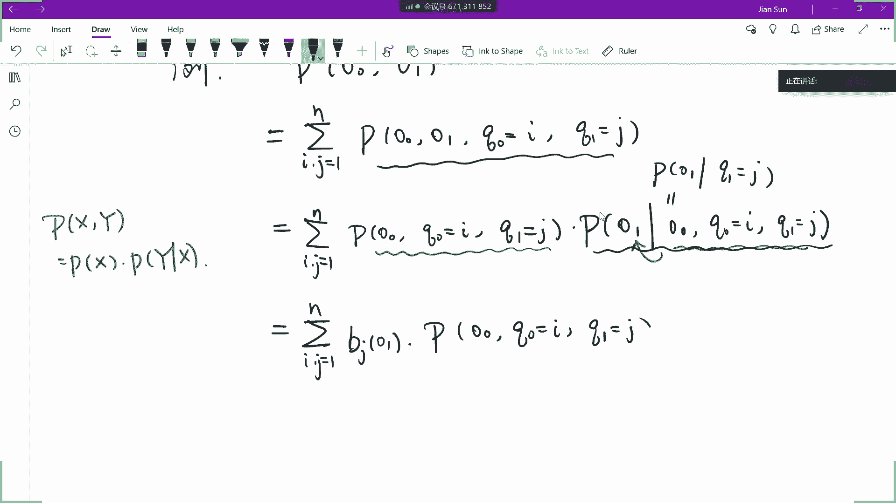

好了我们现在就完成一步了，那我们再看第二步，那我们再继续的用bs公式来处理这个，那怎么处理这个呢，我们就就进一步的，比如说我们假定o0 也知道了，q0 等于第二个状态，也知道了，在这样的条件分布下。

我们来看看第一次的隐状态，好好了，那我们现在又看到这个，我们又根据我我们的野马尔科夫过程的假设，特别是引状态的马尔科夫的假设，他跟你o0 的观察没有任何关系，只和你这一步的观察有关系。

所以这个就是转移矩阵a i j好了唉这就出来了。

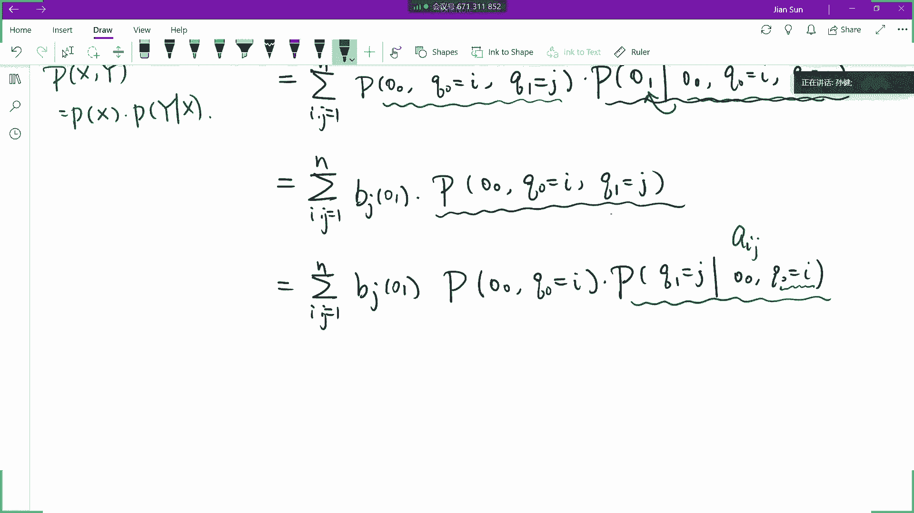

那么我们这个一进一步的就可以写成，它是i j等于一到n a i j乘以b j o e，这个o e就是particular第一次观察到那个状态乘以啊这个东西，现在我们就开始着手来解决这个问题了。

ai j b j o e这个东西我们再一次的利用，比如说我们观察到了o0 这个状态，而不是观察到了q0 这个状态，然后呢我们计算在这个状态下出现啊。

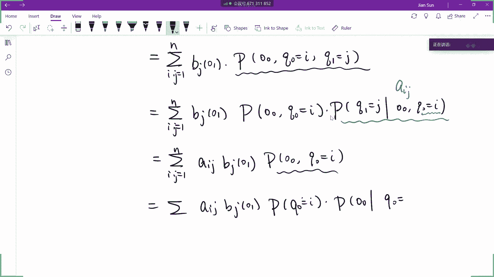

这i出现o0 这个观察值的概率好了，现在我们就都可以写出来了，现在所有这些我们都知道了，i等于一到n，第零个状态是爱它就是派啊，然后呢从i到j的转移矩阵，然后呢呃还先不用我们来报d0 的状态是i。

然后我们看下面从这个状态我们观察到了o0 ，那就是b i o0 ，然后呢是从这个i状态转移到这状态，然后在这状态下观察到o1 ，最后就是眼前的这四个的乘积。

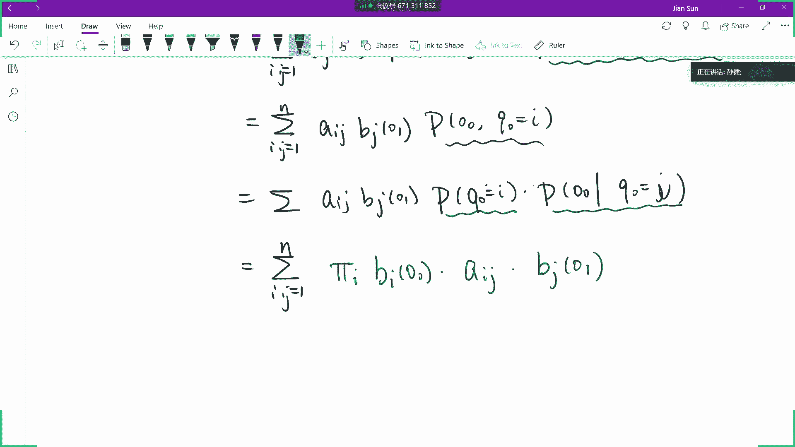

所有的i j从一到n相加。

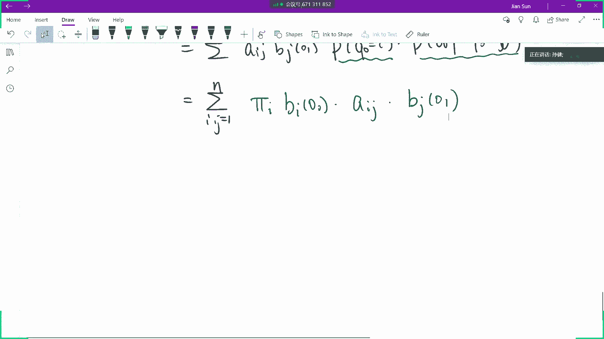

我们这个问题就彻底解决完了，那我们用了这么多步解决了，观察到两个particular的观察值，你就可以想象啊，不是在具体应用中，它可能就是红球，白球，第一个是红球，第二个是白球的概率是多少。

咱们以前在em算法里面很简单，因为你观察的这个红球和白球每一次取代的是相互独立的，我们只要做个乘积就行了。

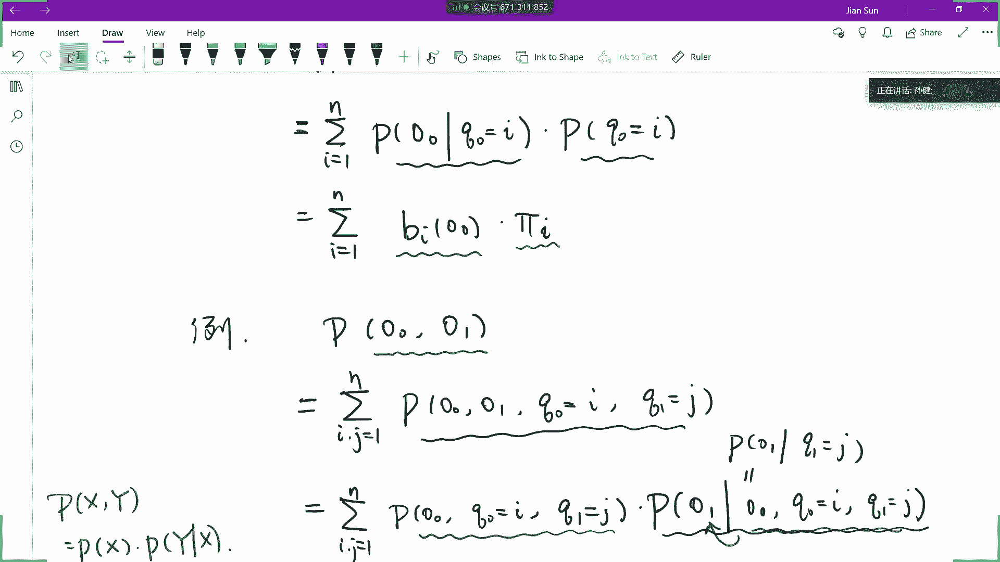

现在可可不行，现在你不仅得做个成绩，你这不是做一个简单的成绩了，因为他们之间是有关联的，所以最后就变得挺复杂了，但是这个复杂其实背后的直觉也很简单，因为派就是告诉你第一次带这种曲球，从第一次带这种取球。

然后从第一次袋子中不是从第一个决定的第一个袋子，然后呢下一个就是从第一个袋子中取球，再下一个就是从第一次的袋子转移到第二个袋子，再下一次就是从第二个袋子中取球。

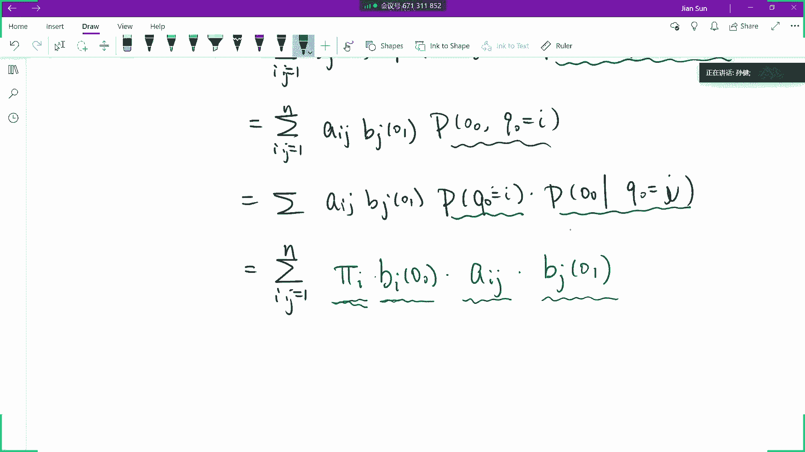

这他无非就是说明了这么一个简单的事情，好这就是这个例子。

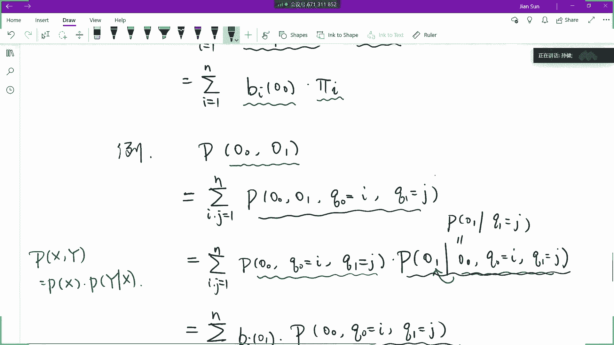

那一般的情况下呢，咱们就可以想象出了。

我们给大家写一下，一般的，我们要计算的是什么呢，我们要计算的啊，q0 也发现了q1 ，也发现了q2 也发现了他这个q t都看到了哦，我们要我们要计算一下，就是眼前的这个分布，就是眼前的这个概率。

出现这一组particular的观察值的概率率是多少啊，我们就不去推导，推导也是跟我们刚才一模一样，我们甚至现在咱们就可以直接写出来了，怎么直接写呢，你想一想，你要为了观察到第一个欧灵。

你得先取一个袋子，第一个袋子比如叫做艾琳，但是你取了第一个袋子，我们就从第一个袋子中取球，取到o0 ，你看然后呢过渡一下，从i0 过渡到i1 ，然后呢你再在第i一这个袋子中取到了o1 。

然后呢再过渡一下，从i一过渡到i2 ，然后再从i2 袋子中取到了o2 ，一直到了最后就是从i大t减一过渡到大t，再从i大t这个袋子中终于取到了o t所有的求和。

就是从就是对所有的i0 i11 直到i大t都要取一到n，把这么大的一个求和啊，其实这个推导很简单，你看我跟大家都已经就是直觉上已经非常简单了，这个求和需要对这个艾琳一直到i大t求和。

从一到n来做最后的这么一个求和好了，所以眼前的这个问题我们就解决了。

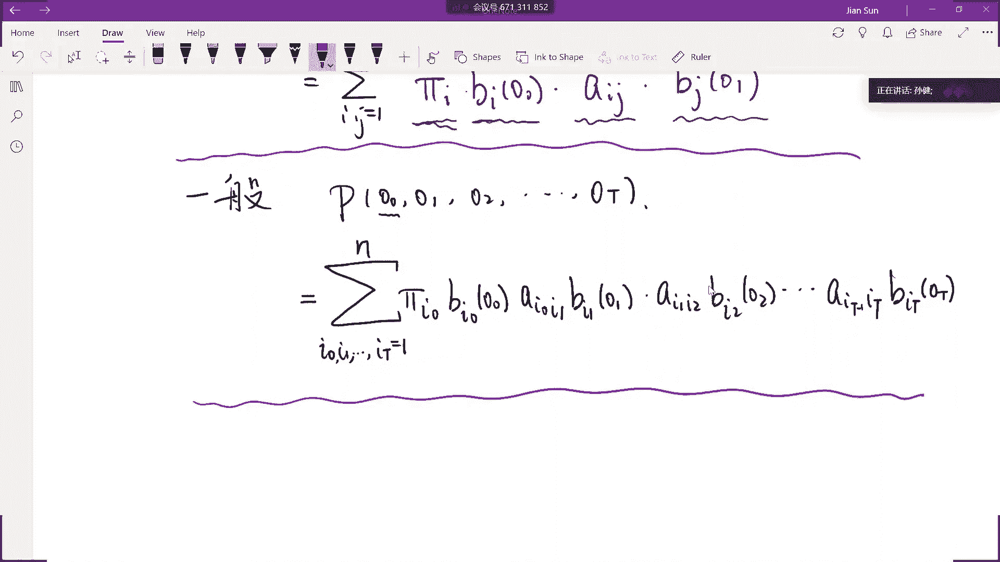

这个对应到咱们em算法上啊，你看啊对应到咱们em算法上，其实我会跟大家说，对应到咱们em算了，咱们本质上咱们就是那个很简单，就是wp加上e减w乘以q如果是这个球是这个红色的。

那就是取一otherwise呢，就是，取一点wx i咱们对应到咱们em算法上，其实是那样的一个算法，就是i等于一到最后大t你取了大t个球，这是在em算法下，咱们当时推导的，你看多简单，为什么呢。

因为你每一次取代的都是独立的，所以它们之间就是一个连成。

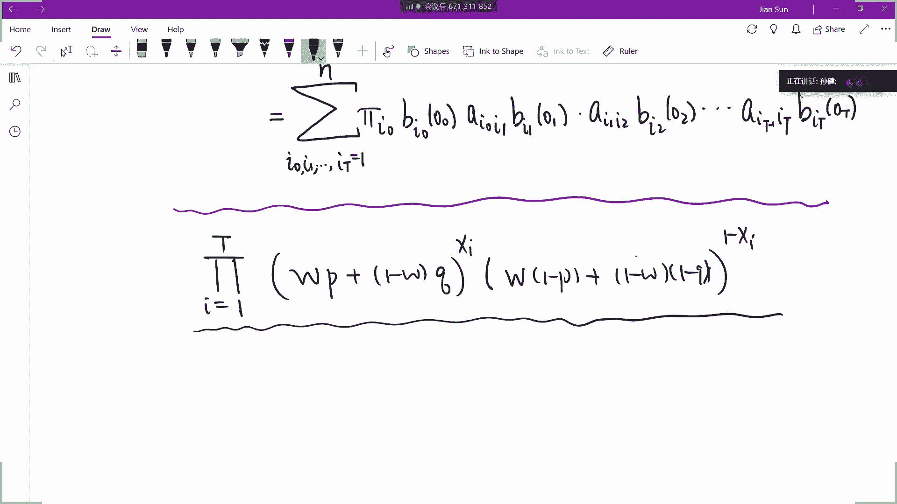

现在可倒好，现在你也假，你也假想啊，当前的这个o0 o一到o大t都是这些x取得红球和白球，你现在就比这个要复杂的多了，所以说这个就是hmm里面的东西，这个是在em算法里的相应的东西。

那这个就上面的就复杂，下面的就简单回过头来说，我我们眼前这么复杂的东西怎么计算呢，其实计算量是非常大的，你去看一看计算量，每一个我们有t加一个指标，每个指标都取从一到n取n次，那相当于就是这么多n个啊。

t加一个n连成，所以它的计算复杂度最后就成了n真的t加一次方了，最后这个整个的这个计算复杂度，那这个计算复杂度是解决不了的，所以说按照眼前的这个办法来解决hmm中的第一个问题，就是知道所有的参数。

我们问出现的这些观察值的这个概率是一个解决不了的问题啊，我为了解决这个问题呢。

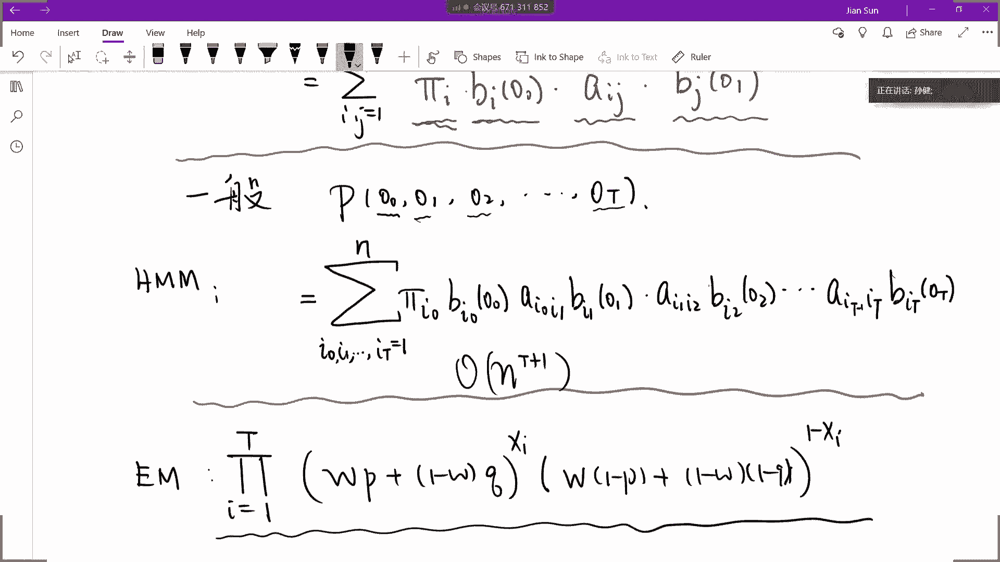

我们必须是要重新的从另外一个角度来想办法解决它，那么我们现在来看看怎么解决眼前的这个问题。

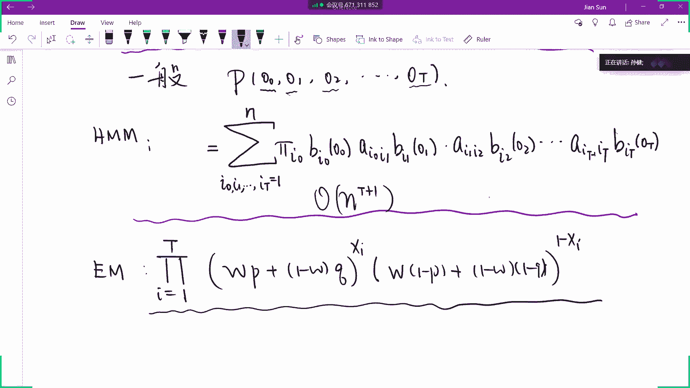

为了解决眼前的这个问题呢，嗯这都是hmm里面发展出来的这个算这个方法。

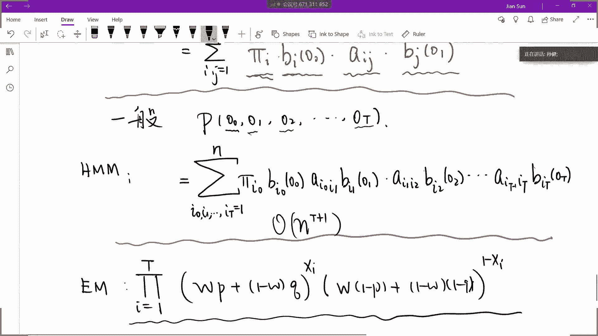

我们呢就是想办法迭代的来解决眼前的这个问题，所以说我们就不能够直接的去硬算这件事儿了啊，我们看看为了我们怎么才能够用迭代的方法，我们这样看这个观察到就从零吧，观察到o0 o1 ，一直观察到ot。

我们引入一个这样的一个，这点这个东西，就是说我们观察到了o0 o11 直观察到了ot，而且在t时候他的状态是第二个状态，这件事情我们定义成为这个所谓的up ti，为什么要要就是要这个中间的这个变量呢。

因为中间的这个变量才能够帮助我们最后呢去给这个中间的变量，才能够帮助我们去计算，刚才我们计算不出来的那个东西，我们看中间的这个变量为什么能够帮助我们，首先呢这个中间这个变量就是在。

就是它怎么才能够计算出我们原来想计算的那个东西呢，你看我们原来想计算的东西是什么，我们原来想计算的东西是观察到的，第二个状态，第一个状态，第四个状态，这是我们原来希望计算的。

那么利用我们现在定义的这个f t这个东西，我们希望计算的这个东西，我们就可以写成是o0 o1 o t而且当时的这个状态是第二个状态，就是最后这个引状态是第二个状态，所有的i等于一到n。

而这个东西不就是按照咱们刚才的定义，这不就是阿尔法i吗。

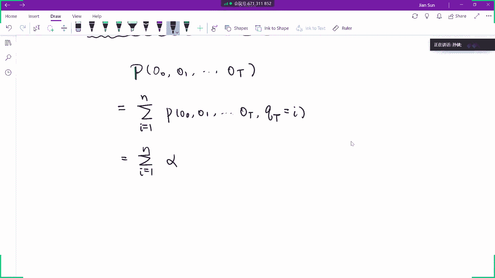

所以你看如果说我们眼前新定义的这个量对所有的t就是对所有t啊，等于011直到大t所有的i等于一二对，最后到大n都计算出来了，那么我们最后要计算的这个东西，无非是阿尔法大t i做个求和就可以了。

那么我们啊咱们要解决的问题就解决了，所以问题就归结于这个阿尔法i ti怎么计算了，我们现在说ti啊，其实是可以迭代的计算，首先我们来看看这个0i20 i根据咱们的定义。

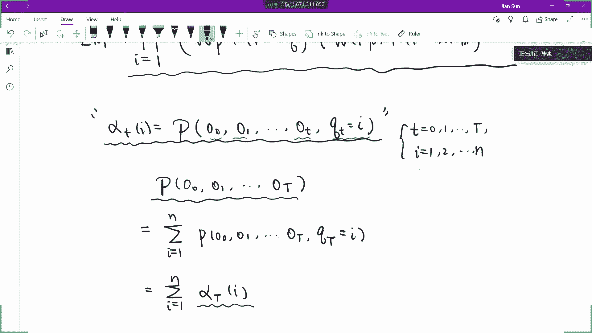

就是说我观察到了o0 ，然后当时的状态是i这个东西我们不是计算计算过吗，你就跟刚才我们的逻辑一样，先从第二个袋子中取球，而且是最初的那个，所以就是派爱啊，然后呢派爱。

然后呢给的这个在这个拍i就是第二个这个袋子中调条件下，我们取到了o0 ，它的概率就是b i o0 ，这个参数是给出来的，这个是从状态到观察值也是给出来的，所以就解决了，所以这个值我们是知道的。

阿f0 任何一个i我们就都知道了，从阿尔法0i我们可以计算阿尔法1i，阿法1i我们计算阿尔法2i。

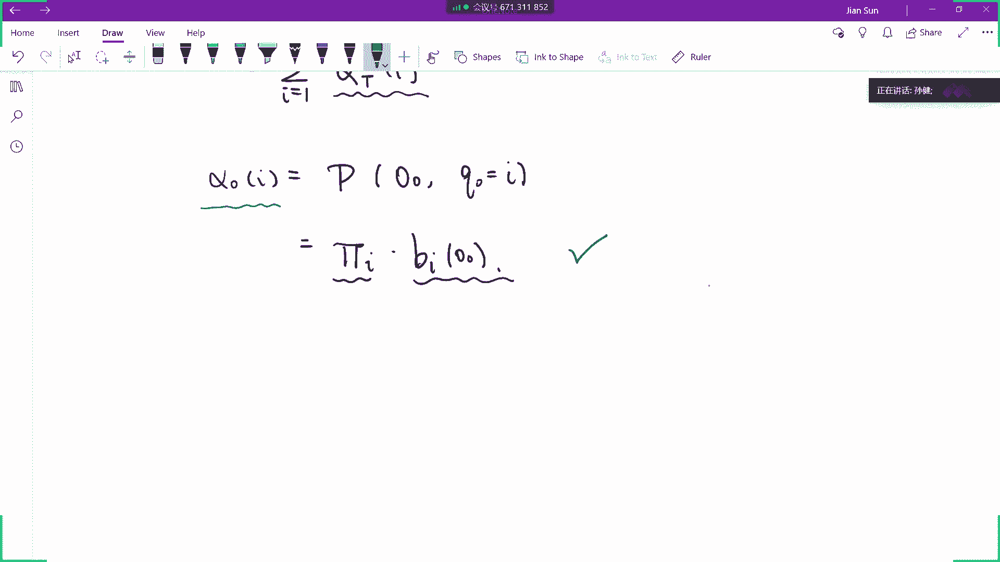

最后到阿尔法大t i就都知道了，那么现在关键就是我们如何从法t到阿法t加一这个之间。

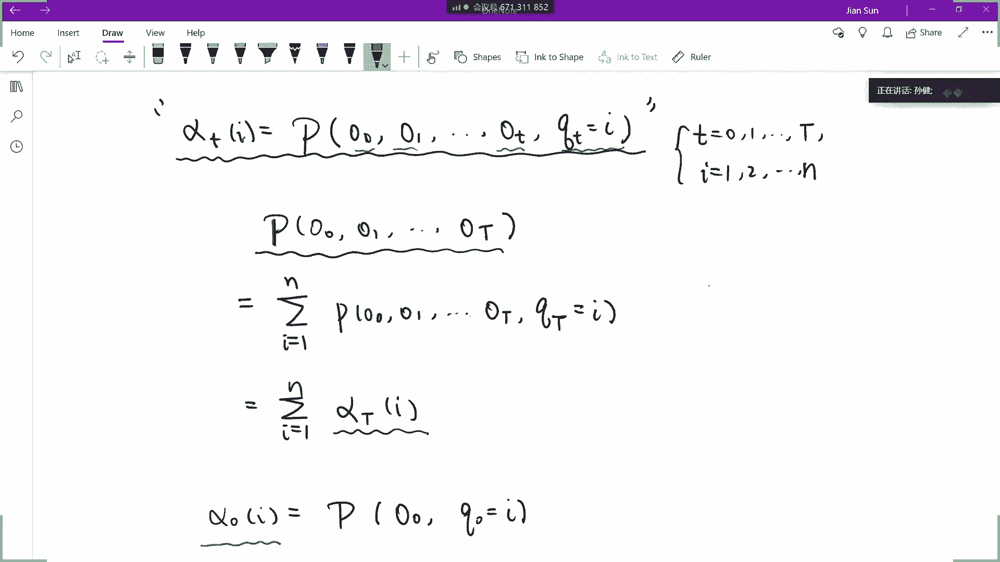

它们的迭代过程，我们需要来说一下，我们来看一看啊，给大家写一下，根据咱们的定义啊，ti他是说我观察到了o1 o0 o11 直到ot，而且呢在t状态下是i。

这个时候我可以人为的就是我为了想做迭代还是o0 o1 ，然后呢ot减一ot，但是这个t减一的状态是这状态是i，那么现在呢就是对所有可能的j我要求和这就是一个全概率公式，没有什么。

我只不过是这个t减一的这个状态呢，把它给是定义了出来，而且是对所有可能的j我都把它加进去，所以眼前无非就是一个正常的全概率公式，但是这个正常的全概率公式一旦有了，我就可以利用把它转化成为条件概率。

就是说我先按照次序先到了ot减一，然后又知道t减一的状态是j在这件事情已知的情况下，所以把它作为条件，那剩下的东西当然就只剩下ot和qt等于i这件事，那么已知呢就是知道了观察值，刚才就是说已知的这些。

好了好，我们看看，但这个东西，就这不就是阿尔法t减1g吗，我们的定义吗，我们目标不就是要做这样的迭代吗，那么后面的这个东西我们看看啊，后面这个东西我们都不用去计算了，就跟还是根据这个马尔科夫过程等等。

我们就直接写出来，看怎么直接写出来，我们知道了，t减一是在d这个袋子中取球，下一次呢是从第二个袋子中取出，从在中取出又观察到了ot，所以这个值其实本质上就是第一转转移矩阵dj转移到从j转移到i。

然后呢是从i中取球，观察到了ot，你眼前的这个概率啊，你要是愿意进一步的写成条件概率分布，你就可以得到，刚才我们都练习过，就是这个值，所以最终这个值我们终于写出来了。

它就是j等于一到n t减1g乘以a j i再乘以b i o t，结束了，这就是for tei。

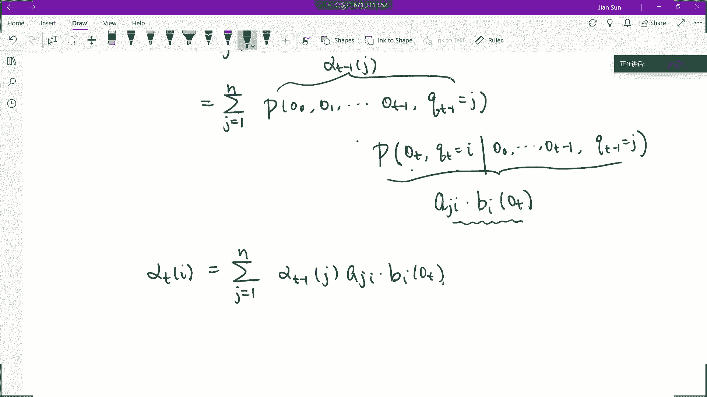

所以啊眼前呢有一个迭代公式，这个迭代公式就是从offer 0 i迭代出所有的f ei在迭代啊，你就是最后就是阿尔法ti，然后你再把阿尔法t i求和之后就有了。

这是这是这是这种这种就是我们为了去计算这个嗯。

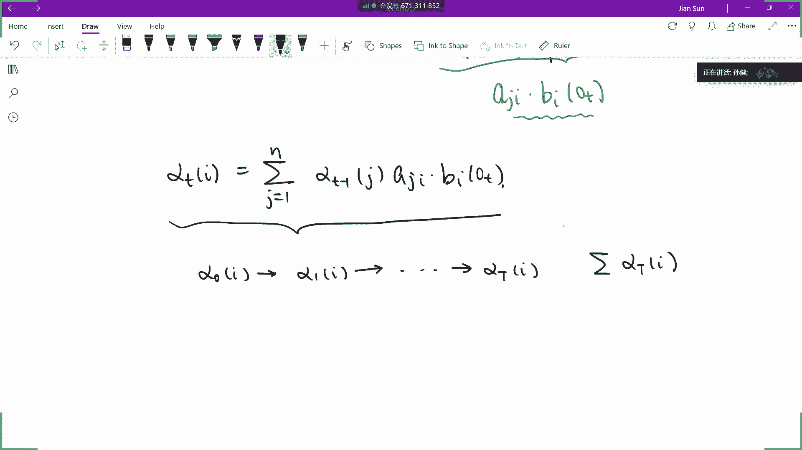

出现了这个观察值之后。

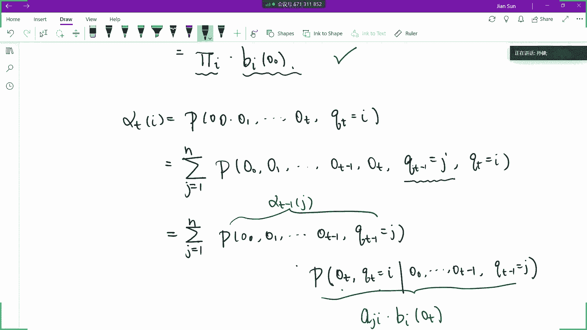

这一组particular的观察值的计算，我们就用这样的一种方法，一个一个的就迭代了出来，那么你看这个计算的次数就少多了，它不再是n的，就是t加一的幂次这么多了，因为每一次我们都计算了。

你可以看成是每一次计算了n次，在这里呢才计算的t加一，所以这个计算的这个这个复杂度大概就是t加一乘以n了，就比我们原来看到的这个n的t加一次方，就是不可同日而语了，不知道这前面加上多少个小于号了啊。

所以呢第一个问题呢就是基本上就解决了。

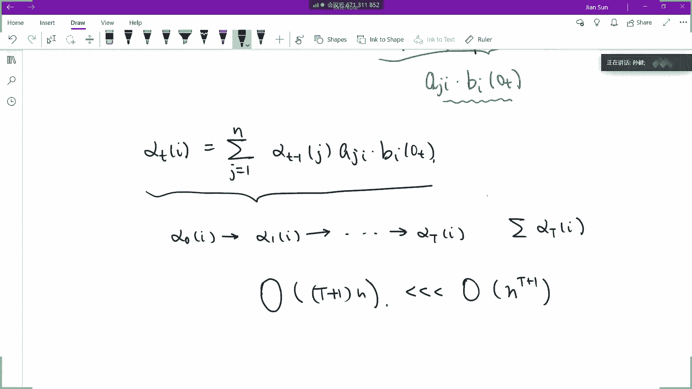

换句话说就知道参数。

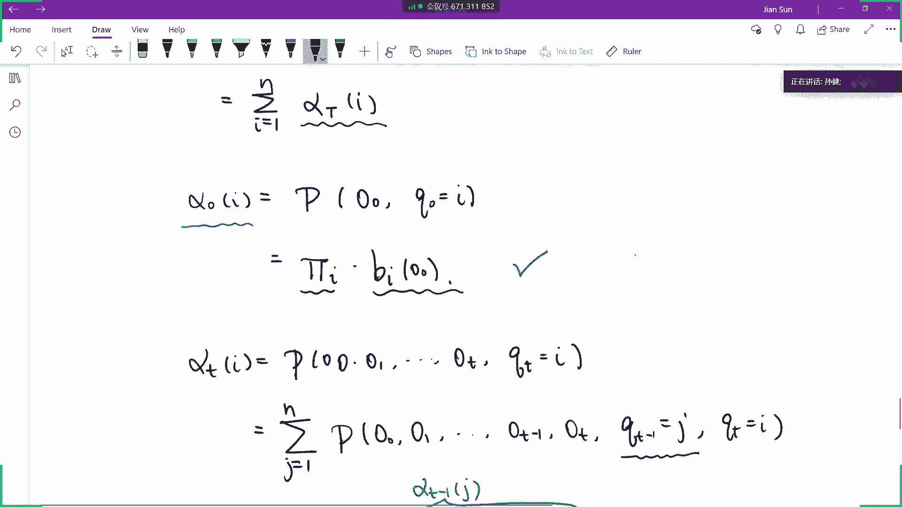

我们来计算这个particular观察值的这个概率问题就解决了。

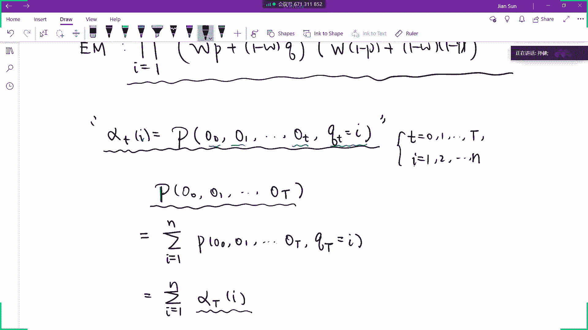

呃在这里呢我们还要再引入一个，虽然呢第一个问题解决了，但是为了以后计算的方便呢，我们还要再引入一个杯的这个贝塔ti，我们看一看是怎么定义的，给大家也说一下这个ti是这样说的。

刚才呢就是说它是说t加1+21直到最后的观察值，其中呢建立在一时刻的隐含状态是第二个状态，在这样的一个条件下，下，下一个就是下面的这个观察值是o t加1t加二，一直到ot的这个概率，我们称为是贝塔。

那为什么要这个背着呢，一会儿下面我们就会看到和阿尔法之间，我们经常是一起使用好，首先我们来看看这个b的，对于我们计算是原来的那个也是很有用处的啊，我们先看看这个beta和offer之间的关系。

我们原来要说计算的是o1 o0 啊，一直到o，小t一直到o小t加一一直到o大t这是我们原来要计算的，现在呢我们要计算的这个东西呢，我们把，加上一步就是dt的状态是第二。

剩下的还是ot加一也是o t将你插上这一步，根据全概率公式，我们就需要让i等于一到n求和，让这一步之后呢，我们就可以利用我们的条件分布，条件分布就是已知道了o01 直到小ot。

然后呢qt等于i已知道了这件事，然后再求什么呢，就是知道这件事情之后的条件概率，那么前面这就是阿尔法，后面就是贝塔，所以前面的你看它不就是我们定义的a和ti吗。

这后面呢好后面后面跟根据咱们的这个银发个过程的假设，我们观察到了后面ot加一直到ot跟我前面的观察值那都是独立的，所以说这些观察值都是不需要的，那后面是什么呢，就是刚才我们刚刚定义的这个贝塔。

你看呢这个背的跟阿尔法之间呢一起配合也可以得到，我们想要计算的就是从观察，就是那一组particular的观察值，它的概率，所以apple和beta是可以互相配合的，贝塔按照定义。

这个定义我们也是一上来把这个，我们为了得到，把t加一的状态放进去，1+1的这个状态，那就是j等于一到n，根据全概率公式，我们把它所有的都计算进去，现在我们就可以看这是从一到n这边呢。

我们就可以再一次的利用我们已知的t加一ot，这些呢是已知的，那在什么情况下，已知呢是在t加一等于j状态是i已知的再乘以，那就是乘以q t加一等于，然后呢是qt等于i，这件事儿哦对了。

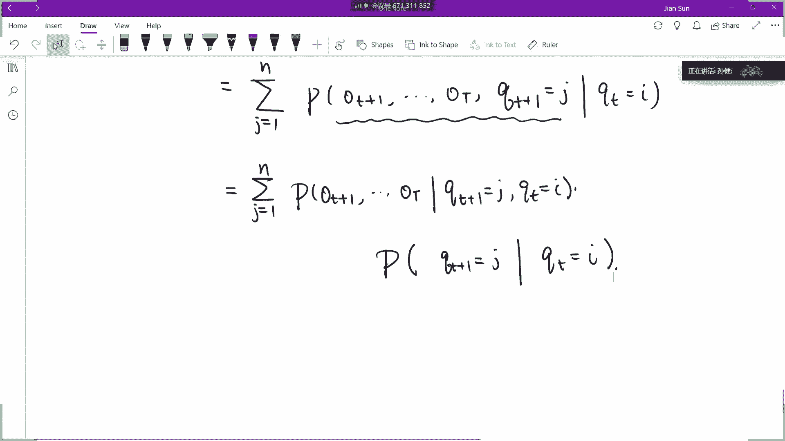

后面呢，还要再已知一个就是已知，因为我们按照贝塔的这个定义，我们要从t加二开始，所以呢我们先要知道t加二，t加一等于j q t等于i再乘以从这个从这个知道了啊，是知道了t加一本身就知道了，t加一等于。

乘以p t加一等于j等一个i。

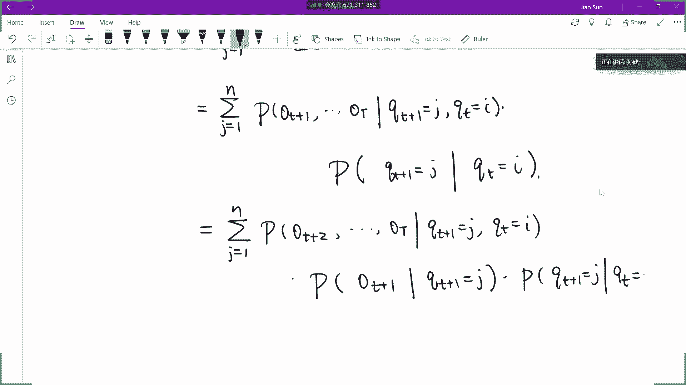

这位置就是i等于一到n眼前的这个值，按照咱们的定义就是贝塔t加一乘以j这个转移矩阵，从i到j这个是从第这个关d这个状态观察到了5t加一，所以呢我们现在又有了bt等于眼前的这样的一个就是递推的。

那从这个递推的我们看看是为了得到bt需要b啊。

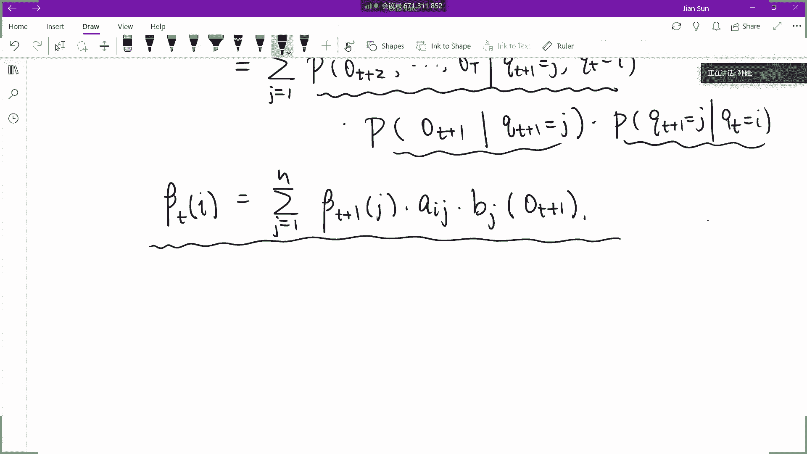

bt加一，比如说呢相当于是我们得知道最头上那个，换话说呢就是我们为了呃用这个递推公式，从我们需要从知道开t就是b大t所有的i b大题i我们要知道，但是这个呢很简单，这个呢比较按照定义就是。

你的定义就是从t减一个观察值是di，然后观察到o t那这个就是b i t，所以最终从这个碑的角度来讲，我们是知道最后的值，然后我们可以一步一步推到最前面，所以从贝塔t我们可以推到贝塔t减1i。

然后呢一直推到这个贝塔零所有的爱啊。

零所有的爱在求和就会得到我们的这个观察值的，就是它在求和之后就可以得到我们观察值的矩阵，好啊。

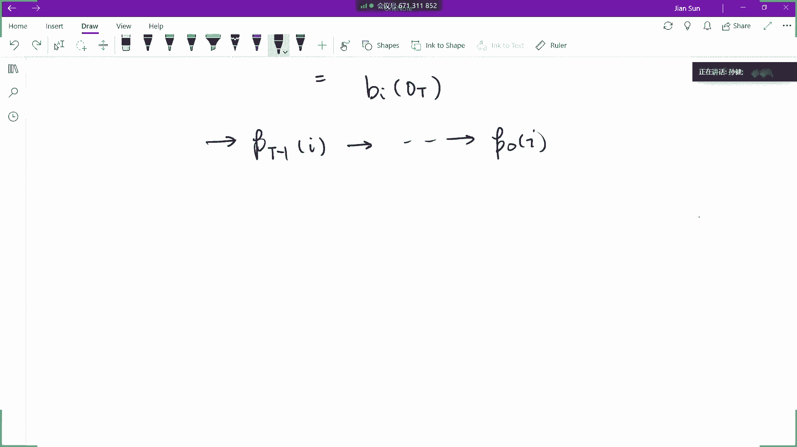

总之呢到这里呢我们就有我们就知道这样一件事。

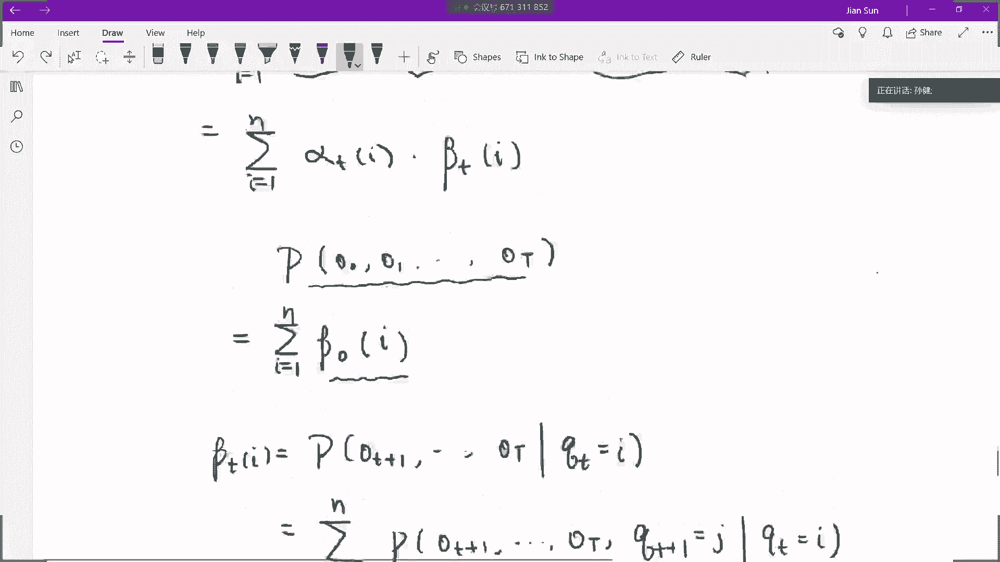

我们第一个问题就彻底解决了，第一个问题就是说我们看到了所有的这些观察值如何啊。

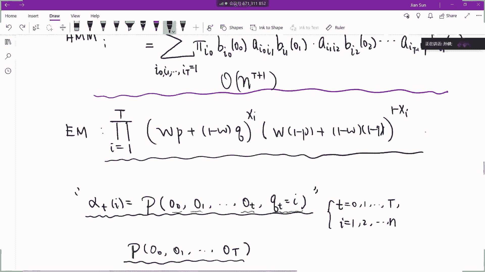

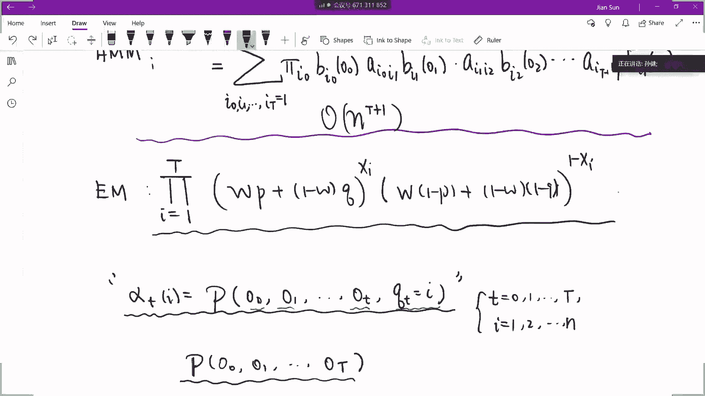