# P12：Lecture 12 HMM Part 2 - ___main___ - BV1fv411r7z1

好我们继续来讲述咱们的银马尔科夫模型，我们上一次说了，首先呢在in mark模型的这个框架下呢，我们呢是有一些状态，那么这些状态就是我们用q11 直到q p来表示。

每个状态的取值呢分别取自121直到n这n个状态，另外呢我们从每个状态出发，又能够得到一组观察值，这组观察值我们称为o11 直到o t假定这一组观察值呢，它们可以分别取v1 v2 ，也是离散多个观察值。

这些状态可以取的值跟我们观察值可以取的值呢是不一定相同的，所以说状态我们用一到n，那么观察值呢我们用v11 直到vk，这是初始，这是我们的这个初始点，那么接下来呢就是重要的参数。

重要的参数就是状态之间呢满足马尔科夫过程，而且呢是不依赖于时间t的，那这样一来呢我们就由ai g它呢其实就是转移矩阵，转移矩阵就是说基于前一个状态是第二个，那么后面这个状态是dj他的转移矩阵。

同时呢我们还有b i o t，他说的是从引状态出发观察到观察值的这个概率。

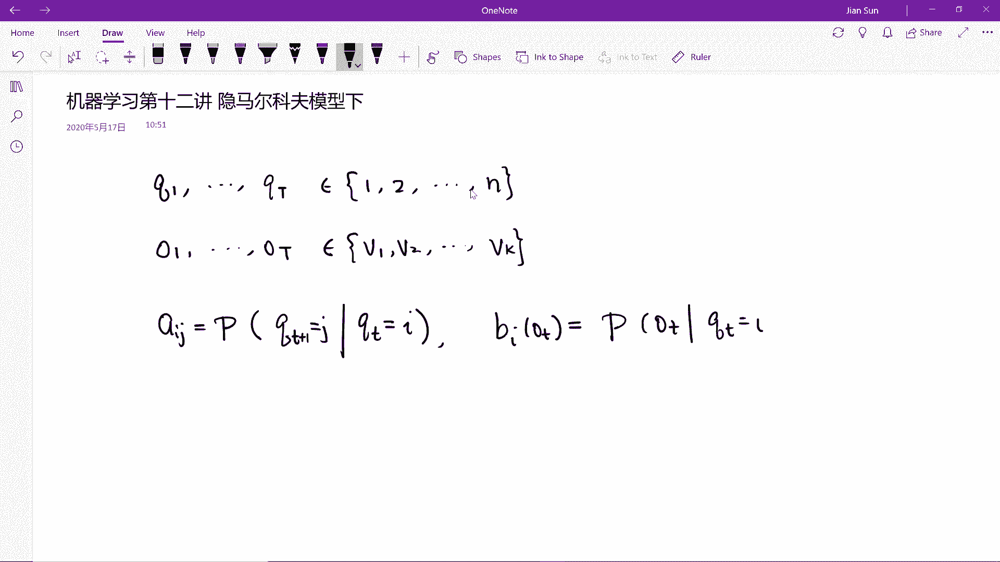

同时呢我们还有一个初始的这种状态的分布及初始状态分布，那就是第一个状态是爱它的概率好，我们以前呢我们在上一次这个这个lecture里面呢，我们是从零开始的啊，从一开始的都一样。

所以说在这里从哪里开始都无所谓，我们就是为了追求这个记号上的简单，我们上次讲了，在这样的一个框架下，这个这个模型呢叫做云马尔科夫过程或者是云马科夫模型，它的整个的框架就是给定的这一组参数的情况下。

这些转移矩阵给出了从隐状态到观察值的概率，给出了，当然也是初始的隐状态的分布也给出了，所以这些给出之后呢，我们观察到一组状态，我们就可以计算它出现的概率了。

所以当我们观察到o1 o21 直到ot这一组观察值，我们可以去计算它发生的这个概率，一方面我们知道根据如果是完全根据定义出发，那么就是它发生的概率，那么这个计算是可以的，那他就是对于所有的这种i一啊。

第一个分布是按一，同时呢从i一这个分布呢，我们观察到o一从i一这个分布转移到i2 这个分布，然后从i2 这个状态我们观察到o21 直到从i t减一到i t的转移。

从i t这个状态我们观察到ot所有的求和呢，就是对所有的i11 直到i t来求和，所以这个知道了参数，我们到看到所有的观察值，但这个概率啊的给出就是这样的一个巨大的一个求和。

这个求和呢我们知道这个求和呢是对于这个指数n的这种t次方，我们知道这个计算是非常是实现不了的，因此呢咱们就引入了这个所谓的这个fti，我们就是想递归的区域进行计算。

bt i呢我们知道它就是o一这组观察值，ot都观察到了，但是当时的状态是第二个状态，有了vt啊，这个小ti因此最终的这个计算就是o一到o t的观察值。

其实呢它就是对所有的i求和i等于一到n阿尔法大t i，因此上只要我们能够计算出所有的这些rf t i来啊，当然是基于给定的这些观察值，我们不是说对所有可能的观察值的combination来计算。

我们仅仅是对眼前的这个观察值，我们来计算这种ti就可以了，而且呢这个vdi呢是满足递推的，那么这个阿福t i我们一方面我们阿尔法t加1i，我们看看它的递归的表示，那么就是o11 直到o t啊。

还要到ot加一，其中呢qt加一等于i，显然呢我们要想做递归呢，我们就把qt给他补上，所以在这里呢就是qt等于j，但是到q t加一就等于i，这里的g是从一到n，然后我们再用贝叶斯，我们就是一步一步的来。

我们先看从观察值到ot，其中呢qt等于g，我们再看基于此o t加e和q t加一等于i，基于呢qt等于j啊。

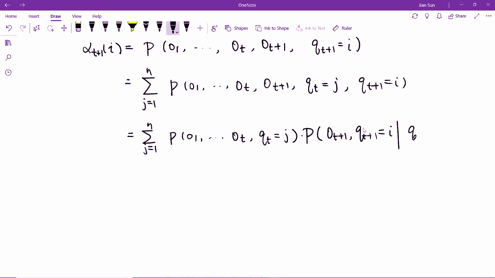

后面的这些观察者我们都可以省略，因为这些观察值并不影响状态之间的变化，所以，根据这就是ftg后面的计算呢，我们还可以再分两步，一步呢是从qt到q t加一，一步呢是从qt加一到o t加一。

我们就在这里省略，基本上呢就可以说它就是a从z到a然后是b i o t加一，所以这里呢这个求和呢是这里等于一到n。

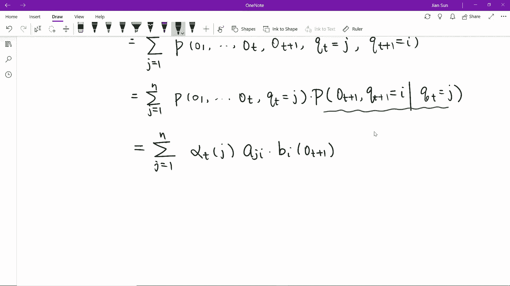

那这样一来咱们就可以利用递推把f t呢一个一个的求出来。

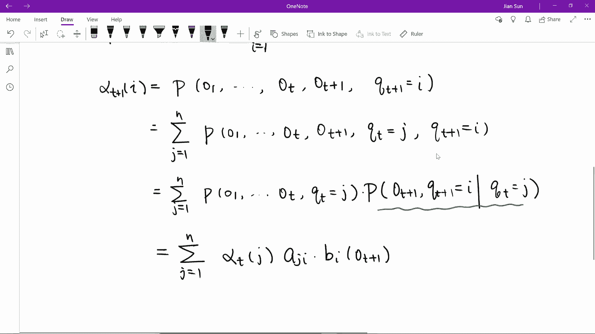

同时咱们还引入了beta t i，我们也回忆一下betty i就是观察到了qt以后，而不是观察到了qt以后，就是说假定知道了qt是第二个状态，那么观察到了ot加一到ot。

它的概率after tea和bt是可以互相配合的，那么从特别是给定了这些观察值的概率，其实呢就可以是针对任何一个t f t i乘以贝塔ti，我们上次也说了，所有可能的i从一到n这样的一个求和。

对两个人的乘积，就是这组观察值出现的概率，以上呢是我们简单回忆了一下，在我们说过的第一个问题，因为mark的过程的第一个问题就是给定参数下，我们去去求解观察值发出发生的这个概率问题，我们就解决了。

现在我们来看第二个问题，乃至第三个问题，其中第二个问题我们看一下，这是我们关心的，第二个问题是反过来，就是当我们看到这组观察值的时候，我们如何去估计背后的参数，一方面我们看到从观察值。

无论是我们利用眼前的这样的一个递归也好，还是说根据我们的最早的这个刚才我们写的这个观察值的。

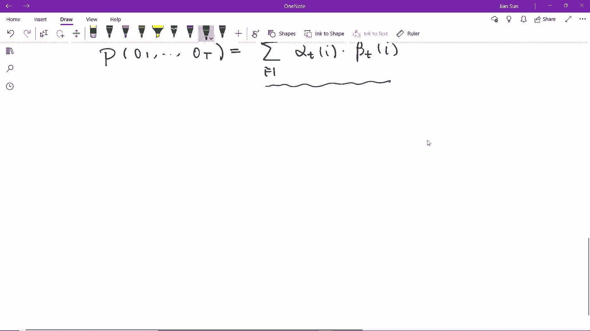

完全的这个非递归这个计算也好，那理论上来说就是我们去试图去寻找所有的这组参数，转移矩阵的参数，从状态到观察值的参数，初始分布的参数，使得我们眼前的这个式子能够取到极大，这就是极大似然估计。

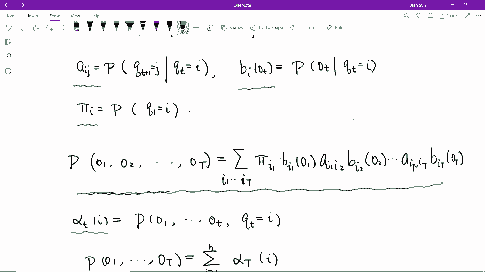

但这个办法呢是从计算上，理论上是这样，但是计算上是行不通的。

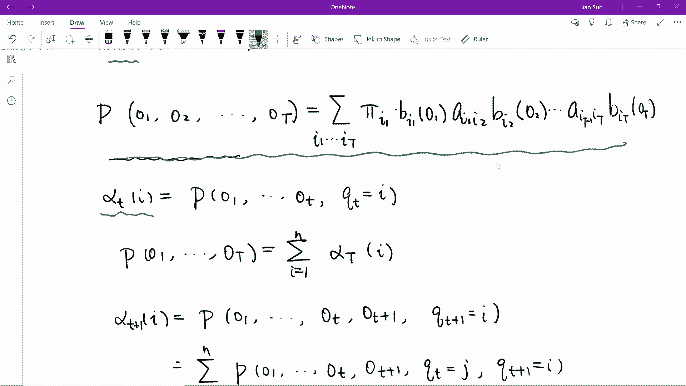

这就使得我们需要换一种思路，从em的算法来考虑计算这个问题，我们现在就来看看从em的算法怎么样来考虑这个问题，所以从em的算法来考虑这个问题。

你就是又要想我们眼前出现了一个巨大的这样的一个excel table，我们观察值是给出来的o1 o2 ，所有的这些观察值都列在我们的眼前，比如说它可以是球，红色的球，白色的球等等等等，那么每一列就是对。

就是啊每一列就是不同的这个每一个观察值，那我们现在再来看一看每一行，咱们的目的呢是求，比如说我们先看想去看转移矩阵，因此上说我们就想看啊给出某一个观察值，比如说给出o一这个观察值这样的一个观察值以后。

我们是想去看这样的一个事情，就是说qt等于i，我们是想计算qt等于i，但是qt加一就等于这这样的一个概率，我们看看在给定每一个观察值，情况下，那么这个应该是多少，为此呢。

我们就需要来计算眼前的这个的估计好，我们看一看，所以我们现在感兴趣的是这样的一个概率，就是qt等于i啊，或者是我们反过来说我们是对qt啊，但是呢qt加一等于g在给定了观察值下，它的概率。

这是一个联合分布，当然如果我们知道联合分布了，在给定观察之下的条件分布也就可以了，所以我们先来看这个联合分布，那么根据这个联合分布，根据定义它就是o e o t。

然后是q t等于i q t加一等于j q啊，o t加一一直到o大t的概率，咱们呢就是按照次序来，先已知这件事情，然后在这件事情的条件下，我们看。

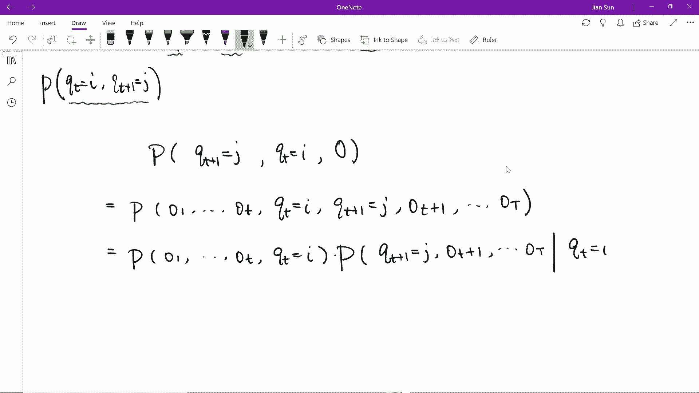

这个条件概率，前面的这就是我们刚才定义过的这个阿尔法t，我们再来看后面的，后面呢我们又也是分成两步，第一步，就是从，它是已知的啊，就是d t加一个状态是知道了，然后呢呃我们先求t加一个状态的概率。

然后再知道t加一个状态下，ot加一，的概率，然后再进一步的就是从ot加二开始，知道了t加一个状态，现在我们就可以发现这些都是我们已经可以计算的啊，首先呢是up to i，其次呢是转移矩阵a i j。

再其次呢就是从d这个状态观察到了o t加一，然后在最后呢我们就是根据咱们的定义，就是贝塔，从d这个状态向更高的观察值去看，所以我们感兴趣的这个联合分布。

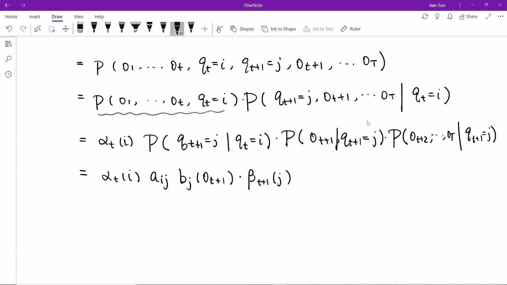

就是第七个状态是i t加一个状态是g和所有的观察值的联合分布。

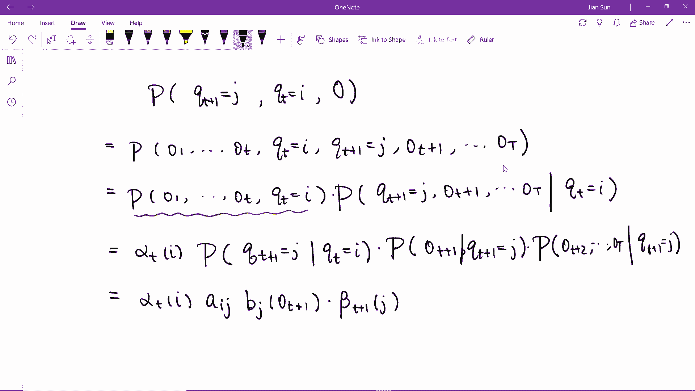

我们就得到了，那这样一来条件分布，也就是说第t加一是j d t是i给定这些o的条件分布，当然就是我们眼前的联合分布，除以，所有观察值出现的概率，但是所有观察值出现的概率呢，我们是知道的。

我们可以计算出来的，比如说我们就可以把这个观察值出现的这个概率被replace成啊，针对这个ti和这个beta t所有的这个i等于一到n的这么一个求和，我们就知道了，眼前的这个量我们把它定义成为cos。

从i到j在d t t k值上，我们把它定义出来好，我们现在看一看我们所做的是什么事情，我们现在所做的事情是这样的一个事情，从流程上来讲，就是给出了给出了初始分布，给出了转移概率，给出了从状态到观察值。

这是一组初始的，我们可以上面都标上零，这是一组初始的值，这些所有参数的初始的值我们可以去计算，我们就计算眼前的观察值的概率是多少，从初始的这些参数，同时呢我们可以继续的计算。

我们现在计算的这个cos i gt它的概率是多少，这个cos i g t，也就是说针对每一个这个t，每一个这个状态的这个就是每一个时间在t点，我们可以把它近似的看成我们所描述的。

就是已知在t点的状态是i而且t加一点的状态是g，在观察值给定的情况下。

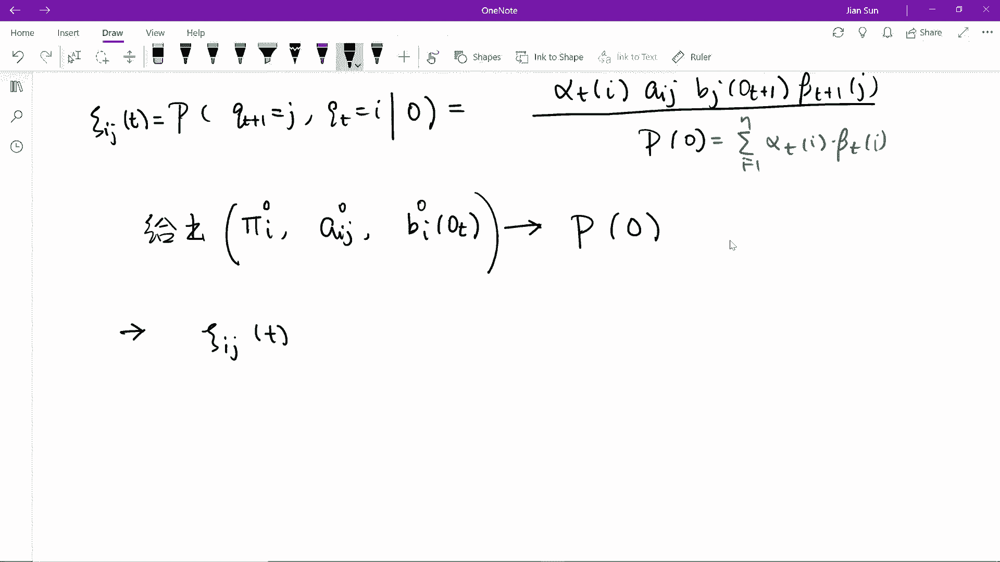

它的概率好，我们再看一看，如果说咱们进一步的来定义，如果我们建议的定义这个啊小的这个伽马的i，我们把它就定义成是所有的cos i g，其中呢i等于一到n也就是说我们取所有可能的这些i加起来。

那这个概率其实就是在t加一等于j，在给定了咱们观察值情况下，这个t加一的这个状态等于j的概率好了，我们现在眼前呢针对每一个时间，我们都有这样的一个可以想象啊，这样的两个数啊，这样的两个数值。

一个是他一个是他分别形容的是状态，一个是状态，两个相邻的状态，一个是i一个是g，另外一个呢就是当前的状态呢，呃这是爱，sorry，我们还可以计算伽马i t。

伽玛i t就是等于所有的j等于一到n cos i g t它就是当前的状态，给定观察值以后，在t点时刻的状态等于i的概率，咱们现在呢就会有这些事情，就是我们知道了在关键期给定的情况下。

在t点的状态是i t加一的状态是g，同时我们也知道了比例观察值的情况下，在t点的状态是i那这些我们就都知道了，从而呢我们就是视图啊，我们给出一个新的参数的估计，这个新的参数的估计，那就是我们叫做ai。

就是新的转移矩阵，这个新的转移矩阵呢就是cos i g t，所有的这些t从第一个到t减一除以所有的这些伽马i t，同样这些t呢是从一到t减一，我为什么要定义这样的一个量呢，因为我们去看上面这个量。

上面这个量它其实就可以说是在所有的观察者里面，我们去看相邻两个状态，一个是i，一个是g的概率，而底下的呢就是所有的可能这些状态里面这个这个观察啊，我们当前的这个观察值呃，我们当前的这个状态是爱的概率。

所以这两个相除呢他就给出了我们一种转移矩阵，一种新的估计就是给出了新的，就是说给出了我们的这个观察值以后，我们来重新估计了一下，从观察值的角度出发，他们之间的这种转移是如何转移的。

是如何从第二个状态转移到d这个状态的这种频率，我们重新计算了一下，那就是眼前的这个值。

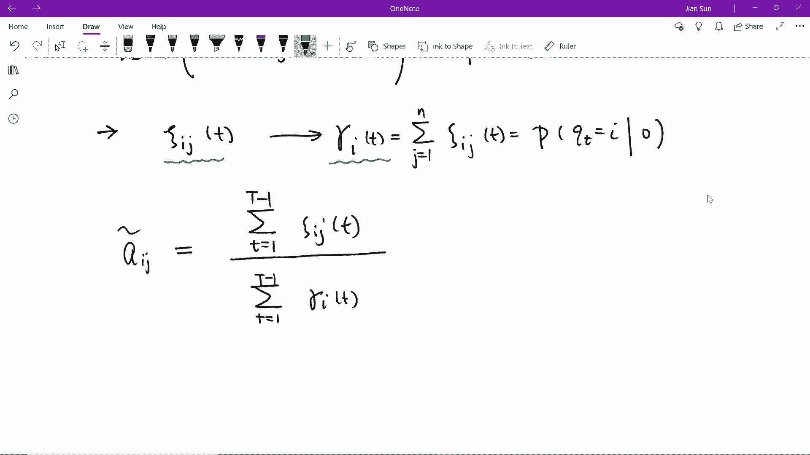

所以眼前的这个值呢就是一个新的参数，而这个新的参数转移矩阵的就是转移矩阵的估计，我们现在再来看一看，我们还需要给出从状态i观察到o啊，观察到不要说ot，因为ot呢是具体的观察值。

我们想知道某一个呃非常具体的这个vm的这个观察值，因为我们说观察值可以取v1 v2 ，一直到v k，但那么从状态i观察到vm，它的这个就是这个概率可以怎么定义呢。

那就是回到刚才我们说的这个excel table。

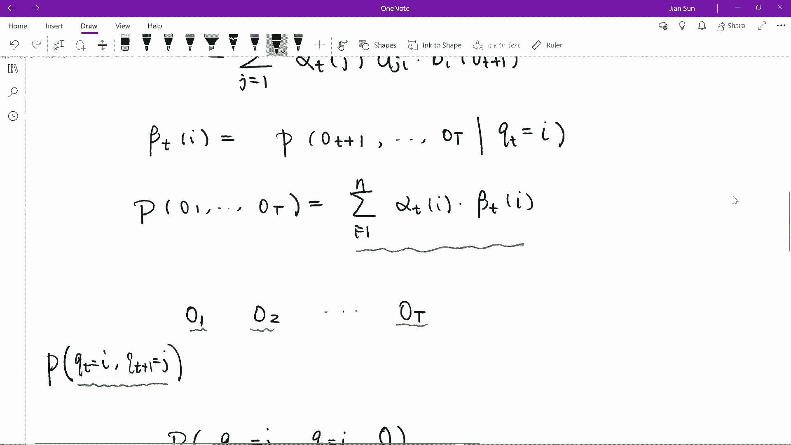

我们就看一看所有的这些观察值有没有出现过vm，如果vm根本就没有出现过，那我们就从我们看到的观察者角度出发，我们就可以说它是永远不可能从一个状态发生到vm，如果vm确实出现过。

就是说你比如说这里有个小ot。

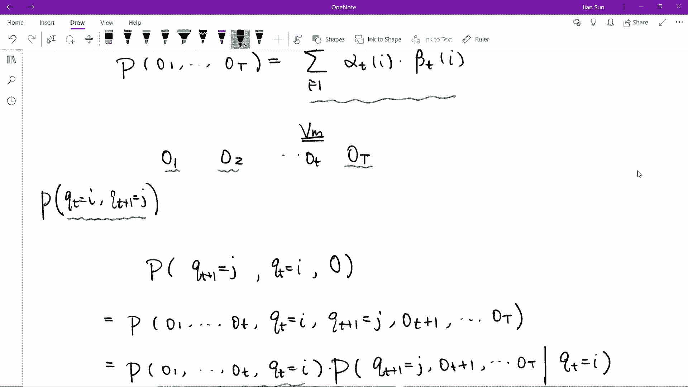

它等于这个vm就是我们观察到的这些实际观察到的观察值，等于vm的时候好。

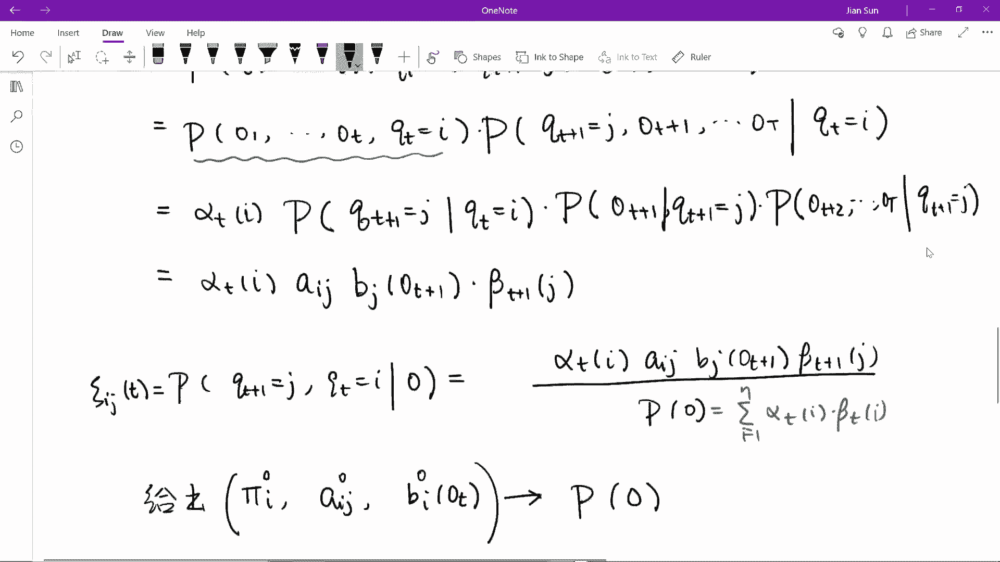

那么这个时候对应的那个状态i是什么呢，我们是知道的，他就是cos i啊，伽马i p，所以我们现在就是要对所有的t来求和，t是对哪些t求和呢，就是观察到的ot等于v m的那些t，把这些ga i t求和。

它就对应了，从第二个状态转移到vm的这样的一个嗯就是估计，然后呢分母呢也就是所有可能的这个i等于一到t减一，我们把它normalize一下，这个就是对于从状态i到观察值vm的一个参数的重新的估计好。

我们最后呢还剩下就是初始初始的这个分布，比如说pi pi的初始分布呢，其实这个很简单，你从我们的定义上，那就是这个这个伽马按e它本质上呢就是形容了从啊，这个它本身就是从第一个时刻。

那么第二个状态的概率在北京所有的观察之下。

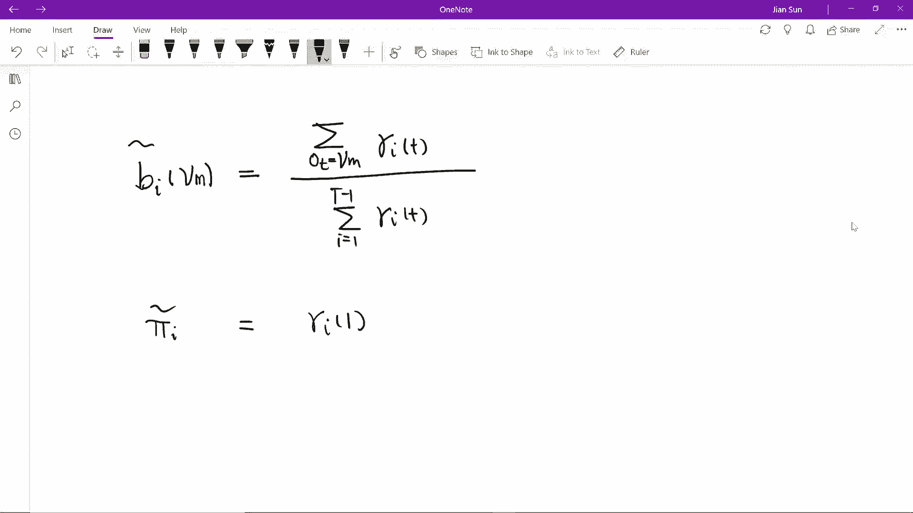

好到目前为止，你看我们的计算方式就是给定了初始的这组参数，我们通过实际的观察值来计算出了若干变量，我们计算出了这组观察值发生的概率，在初始参数下，我们又计算出了这个cos i g啊。

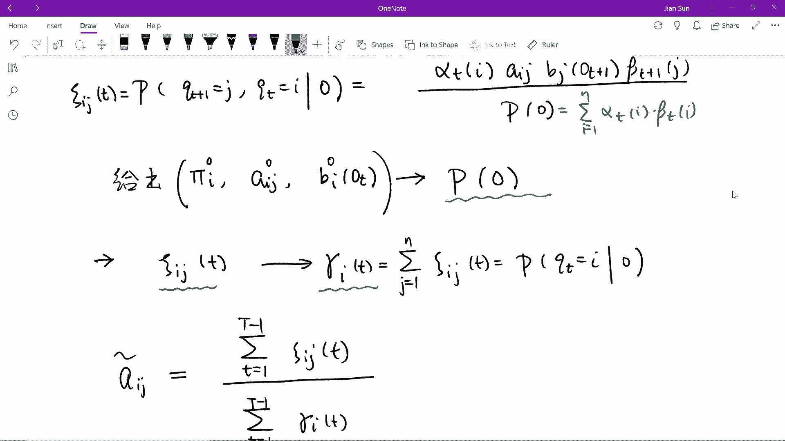

我们又计算出了这个伽马i，同时呢我们就根据这几个参数。

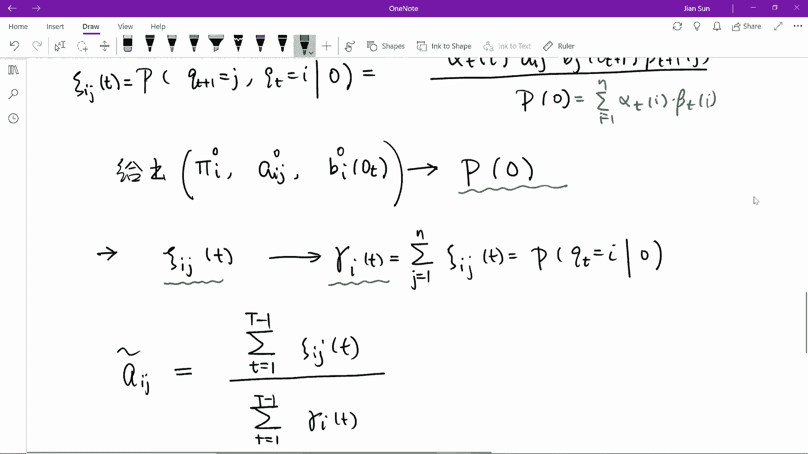

我们就重新能够计算出这些新的参数。

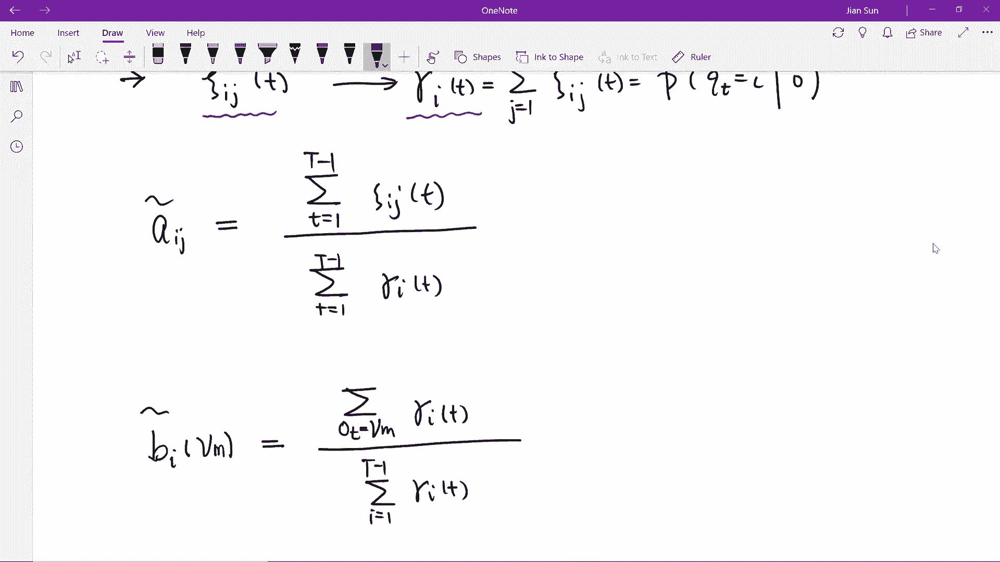

新的转移矩阵，新的从状态到观察值以及新的这些初始分布，我们从这一组新的参数，我们再继续计算同样的值，就相当于我们从派i0 i j0 b i所有的这些啊。

这这vm不同的这些vm我们计算出到派i1 i j1 ，还有就是bi所有的v m1 ，然后我们继续的就一步一步的迭代下去，逐如果说我们发现我们的迭代逐步收敛，那我们就可以停下来。

而那一组参数我们就可以认为是当前in mark服过程的最优参数。

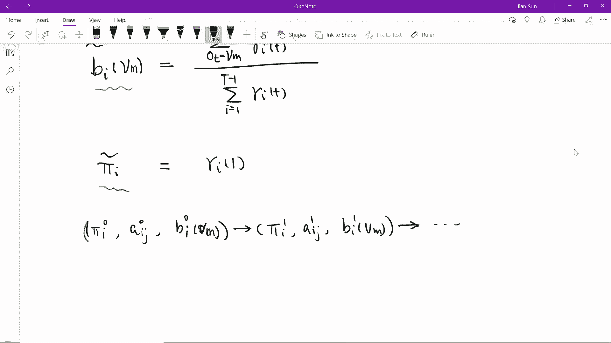

我们通过这样的一个方法呢，就解决了我们in mark服过程的第二个重要问题。

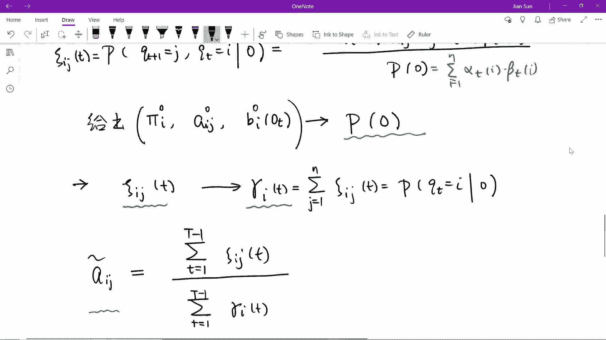

其实呢也是最重要的一个问题。

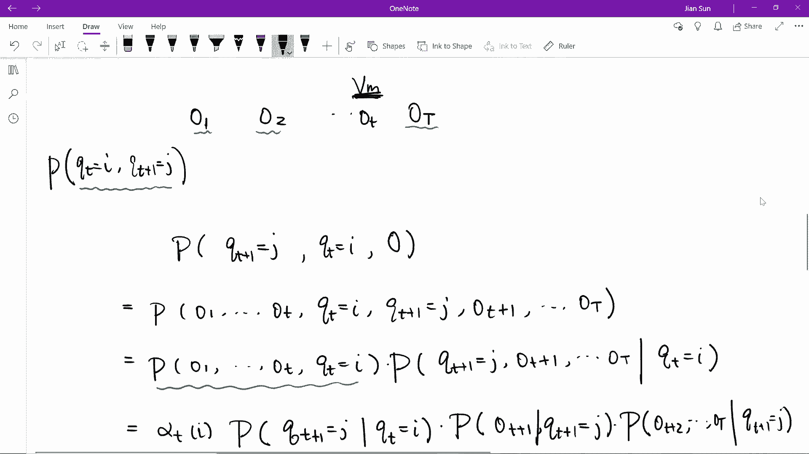

那就是如何从观察值我们去估计背后的参数的问题。

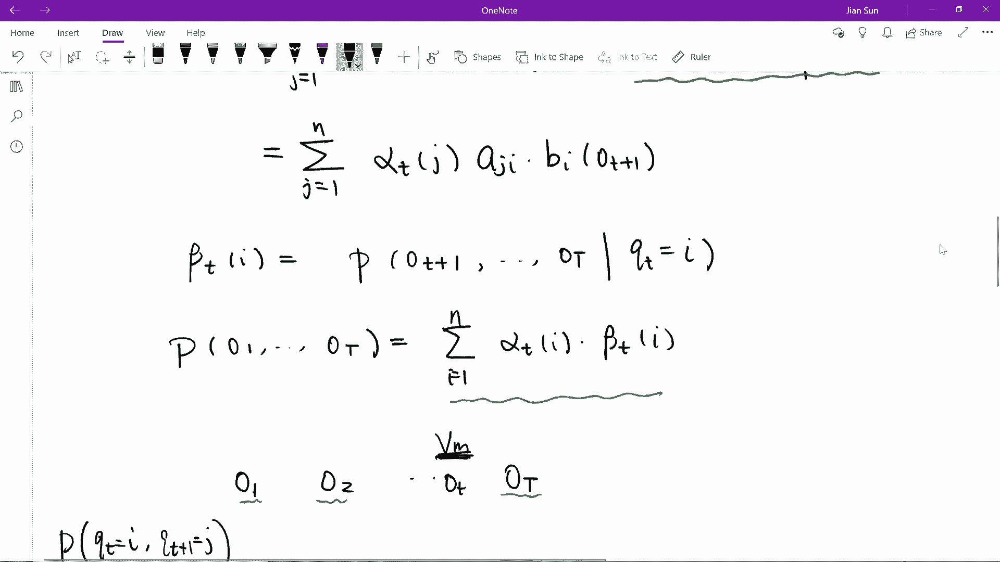

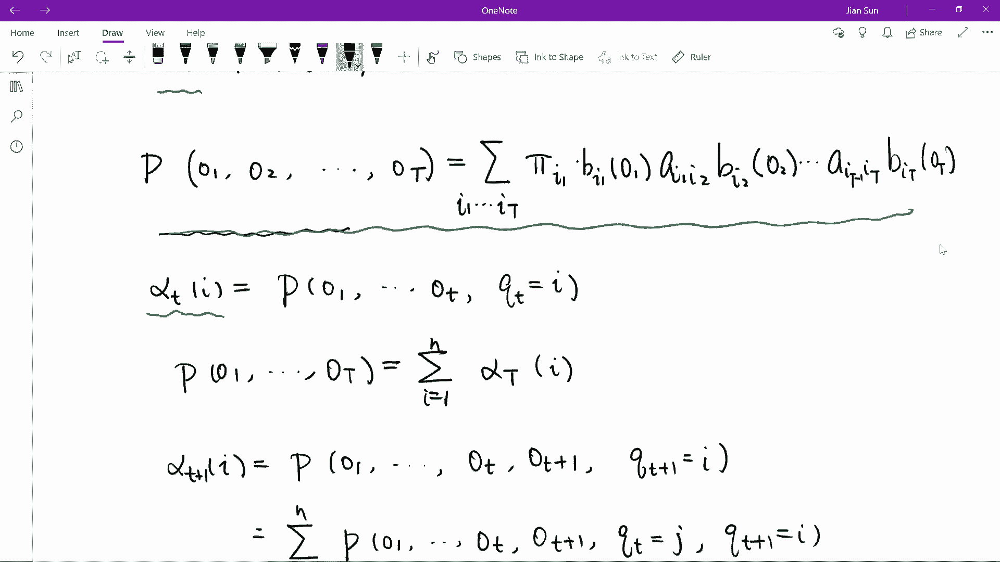

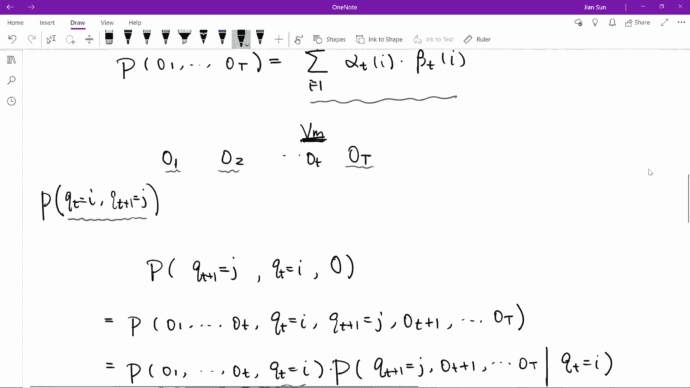

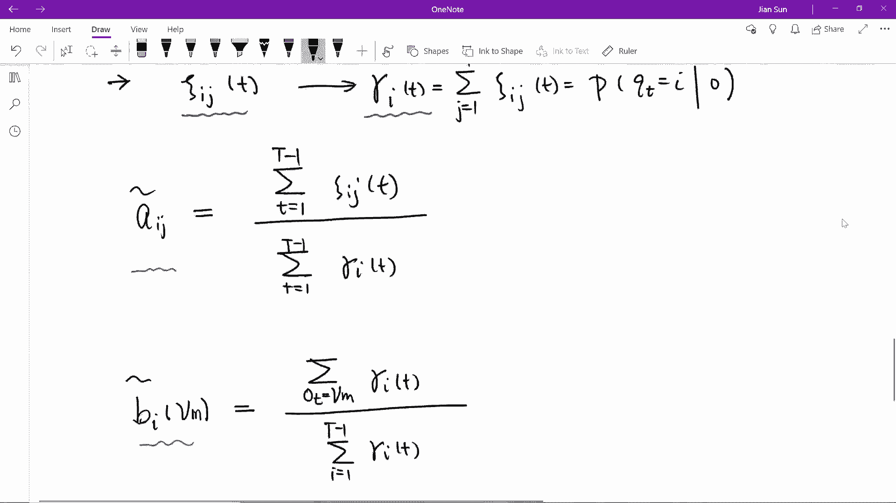

现在我们来看in mark模型的第三个问题，那第三个问题呢是这样的，那就是我们现在估计完了参数，我们就走向预测了，我们再看看我们给出了o1 ，我们给出了o2 这一组观察值到o t。

而且从这组观察值我们也计算出所有的参数来了，那就是说对参数有了一个估计，那我们对参数估计完了以后，我们不能停留在这，那么下面我们肯定是想去估计下面一个o t加一，比如说最有可能出现的这种观察值。

或者是对应来每一个下一个出现的观察值的概率会是多少，这就是我们面临的下一个问题，为此呢，如果说我们想从以前的观察值是估计下面一个观察值，我们肯定希望是知道当前的状态，其实不仅要知道当前的状态。

我们肯定还想知道以前的状态，也就顺便可以知道所有以前的状态，换句话说就是为了解决眼前的预测的问题，我们需要从观察值能够计算出，那么最有可能我们所处的背后的那些引状态分别是多少，特别是当前的隐状态是多少。

如果这件事情知道了，我们从当前的饮状态，当然我们就可以通过转移矩阵，我们关参参数估计出来的转移矩阵就可以知道下一个的引状态，那从下一个的引状态，我们当然就可以知道下面出现了观察值的概率分布是多少。

所以我们现在呢就来着手解决我们现在的最后一个问题，就是预测的问题，为了解决预测的问题呢，我们也是分成先从最简单的开始，比如说我们先从这样的一个开始，我们知道了o1 ，我们仅仅知道了o1 。

我们想知道第一个隐状态是多少，那第一个隐状态是i的概率，我们当然就可以去估计第一个隐状态是i的概率，就是原始分布，从第二个状态中取得pi乘以，从第二个状态观察到o一的观察值。

问题就在于给定一个i我们就有这样的一个概率，那么哪一个i能够让我们当前的这个概率最大的那个i，我们就可以把它定义成是q1 ，所以q e所对应的这个状态呢，我们就可以说它其实是是取最大值，哪个最大值呢。

就是派i乘以b i o e去取这个最大值，这个最大值我们就可以认为这是给定的观察值以后，第一个非常可能的这个应状态的值我们就有了好，那么这样呢从第一个音状态我们就可以用这样来估计出来了。

那第二个隐状态是什么呢，接连下去就是dt的运用状态是什么呢，那我们也就是来迭代的，可以去计算，迭代的去计算，我们为此呢，咱们比如说我们为了计算知道了，我们想去计算dt加一个这个隐状态。

我们想知道这个dt加一个的这个我们想去计算，为了去计算dt加一个这个隐状态，我们看看回去怎么啊，怎么得到怎么迭代的，这种得到好，根据咱们的定义呢，我们是想去计算啊，就是首先呢是计算这个o一啊。

这些o t而且呢o t加一也知道了，然后呢前面的这些状态就是q1 ，q t而且呢这个q t加1=2，我们想知道啊，换句话说这个1p加1i，我们就定义成呢是如果说我们q一到q t这些都已经知道了。

我们看一看第t加一个隐状态是多少，才能够使得我们当前的这个值呢是达到最大，所以在这个时候呢，我们看一看，我们来计算一下啊，如果说我们仍然是利用咱们不断的利用咱们的这个页面，个过程的条件概率来计算。

那么我们就可以分成两组，一组呢是o一到o t，qt我们在这里呢假定qt是g然后是o t加e，然后是q t加一等于i，这里呢j呢就是，控制没有了，写一下吧，我们在这儿写，一直到qt减一。

但是qt呢我们可以设置g然后ot加一，qt加一等于i，这里呢是所有的那些j，也就是说我们看看哪些g可以使得眼前的这个值达到最大，我们继续落实，继续落实，那么眼前我们就可以写成了。

o e o t q t等于j啊啊对，qe到q t减一qt等于j，还有呢就是已知这些情况下，我们去ot加一qt加一等于i，后面就是qt等于j好。

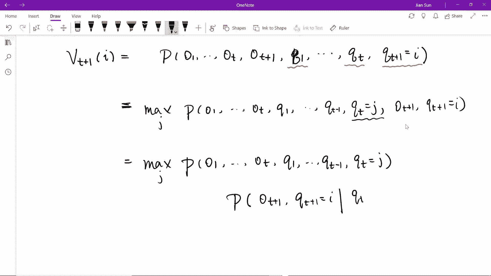

好前面这个根据咱们的递推，它就是v本质上就是1t这乘以后面的就是转移矩阵，从i啊，从j转移到i，然后呢再从观察到o t加一好说了半天想说什么呢。

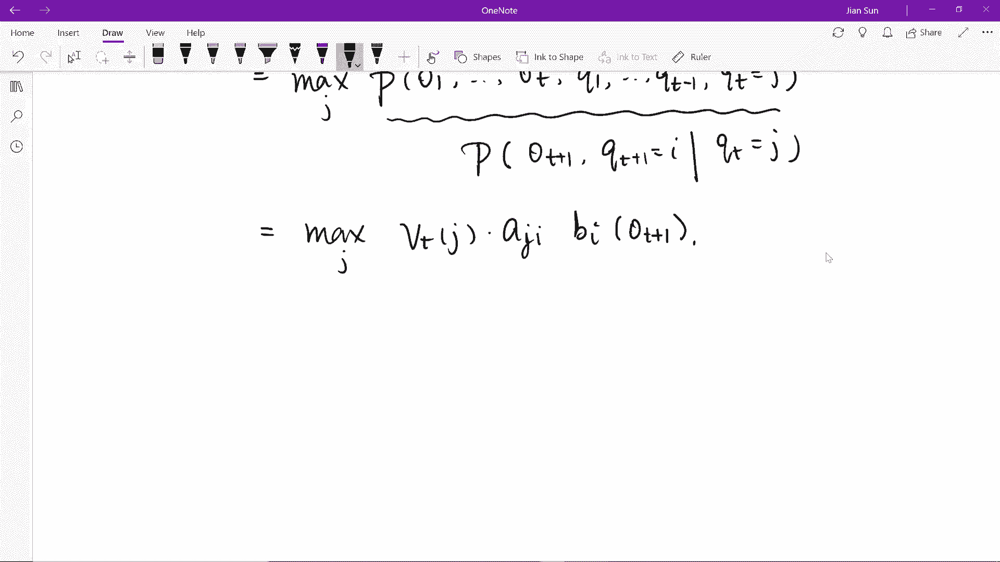

想说我们理论上来讲是可以来定义来做一个迭代的，如果说咱们去这样的定义就是mt v t i啊，等于说我们知道了这些观察值以后，那么哪些一一直到q t减一，能够让我们达到最大。

而且呢还知道了qt是第二个状态，前面呢就是所有的那些q11 直到q t减一，就是说我们需要定义眼前的这个量，眼前的这个量呢就是说你知道所有的观察值，而且知道dt状态是i前面的哪些状态是最优的。

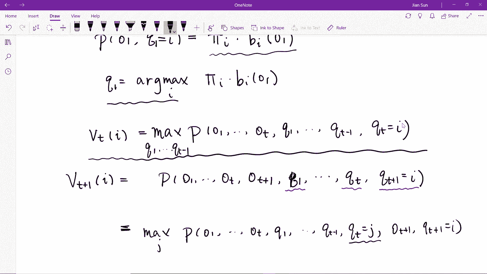

因为如果我们从这个出发啊，我们就v t加1i我们就有了，因为v t加1i一样，前面呢我们就是说你知道dt加一个状态是i，那么前面的哪些q11 直到q t是最优的，再根据我们一直follow下来。

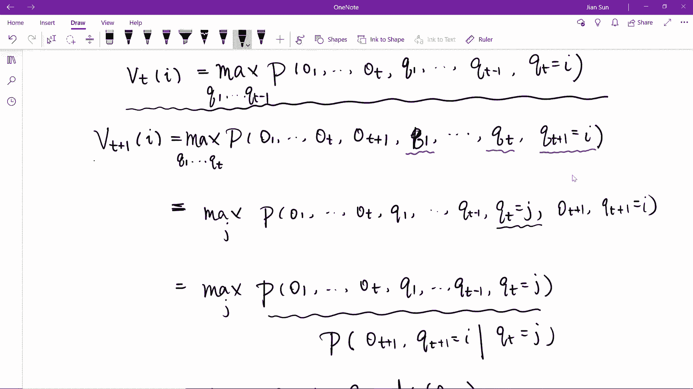

就是你就会发现这呢还再加上q11 直到q t，而且呢我们q t减一，我们就这也是加上q一到q t减一，我们就根据它的这个vt i v tj的定义，我们就得到了。

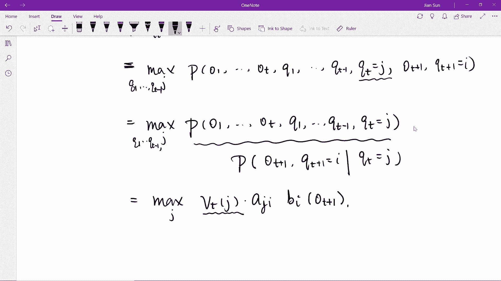

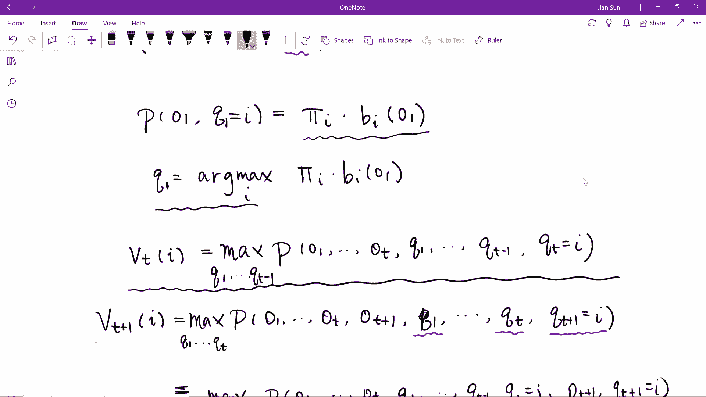

所以我们看到眼前为了去做预测问题，我们也可以就是从第一个隐状态。

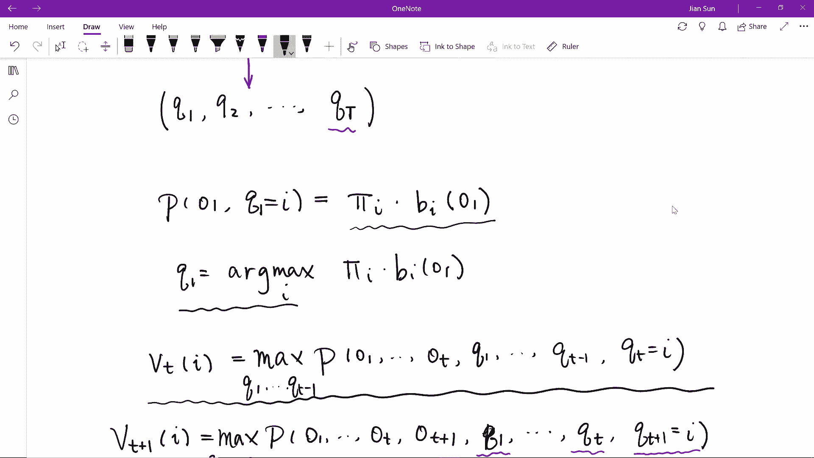

一步一步地去估计到最后一个隐状态啊，而这个一步一步的迭代就是眼前的这个迭代。

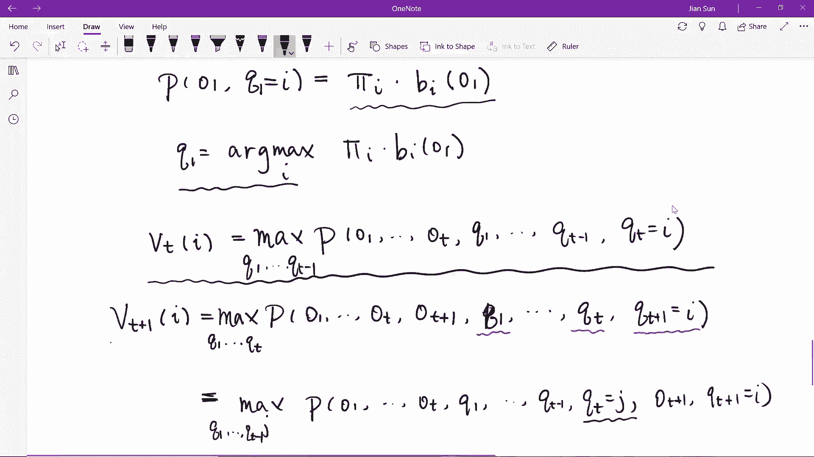

那么至此呢，因为马尔科夫过程，或者是因为马尔科夫模型的三个问题我们就都解决了，我们一起看看这哪三个问题，第一个问题知道参数来估计观察值，发现了概率，第二个问题看到了观察值，我们背后去估计最优的参数。

第三个问题知道了观察值，也估计出了参数如何，我们去做预测，那么银马尔科夫过程或者因马尔科夫模型的离散情况。

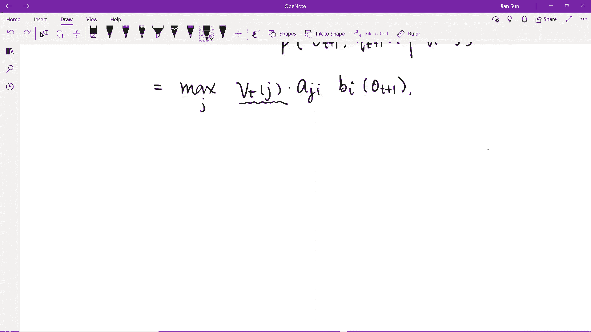